| [Patreon Paketti](http://patreon.com/esaruoho) | [GitHub Paketti](https://github.com/esaruoho/paketti) | [Discord Paketti](https://discord.gg/xNT6eH7W) | [Gumroad Paketti](http://lackluster.gumroad.com/l/paketti) | [GitHub Sponsors](http://github.com/sponsors/esaruoho) | [Ko-Fi Paketti](http://ko-fi.com/esaruoho) |

# Changeslog

← [Back to Main Manual](index.html)

If you liked what you're seeing here, please consider supporting. Every bit helps.
- Join my [Patreon](http://patreon.com/esaruoho) as a monthly supporter. This adds up and would help me. There are different level tiers from 3€ to 7€ to 10€ to 20€ to 50€ to 139€ to 236€ to 300€.
- Sponsor me on GitHub at [GitHub Sponsors](https://github.com/sponsors/esaruoho)
- Send me a donation via [PayPal](http://paypal.me/esaruoho). 
- Send me a one-time donation / or a monthly donation, via [Ko-Fi](https://ko-fi.com/esaruoho).
- Buy Paketti via [Gumroad](https://lackluster.gumroad.com/l/paketti) for a one time purchase.
- Buy my music on [Bandcamp](http://lackluster.bandcamp.com/).

## Paketti Updates Changelog

<div style="margin-bottom: 20px; padding: 10px; background-color: rgba(240,240,240,0.7); border-radius: 5px; border: 1px solid #ddd;">
  <strong>📅 Sort by date:</strong>
  <button onclick="sortChangelog('oldest')" style="margin-left: 10px; padding: 5px 10px; background: #666; color: white; border: none; border-radius: 3px; cursor: pointer;">Oldest First</button>
  <button onclick="sortChangelog('newest')" style="margin-left: 5px; padding: 5px 10px; background: #2196F3; color: white; border: none; border-radius: 3px; cursor: pointer;">Newest First</button>
  <span id="sortStatus" style="margin-left: 10px; font-style: italic; color: #666;">Currently: Newest First</span>
</div>

<script>
function sortChangelog(order) {
  console.log('Sort function called with order:', order);
  
  // Find all h3 elements with date pattern
  const allH3s = document.querySelectorAll('h3');
  const dateEntries = [];
  
  allH3s.forEach((h3, index) => {
    const text = h3.textContent.trim();
    const dateMatch = text.match(/^(\d{4}-\d{2}-\d{2}) - (.+)$/);
    
    if (dateMatch) {
      // Collect all elements after this h3 until next date h3
      const elements = [h3];
      let nextEl = h3.nextElementSibling;
      
      while (nextEl) {
        // Stop at next date header or "under the radar"
        if (nextEl.tagName === 'H3') {
          const nextText = nextEl.textContent.trim();
          if (/^\d{4}-\d{2}-\d{2} - /.test(nextText) || nextText.includes('under the radar')) {
            break;
          }
        }
        elements.push(nextEl);
        nextEl = nextEl.nextElementSibling;
      }
      
      dateEntries.push({
        date: dateMatch[1],
        elements: elements,
        originalIndex: index
      });
    }
  });
  
  console.log('Found', dateEntries.length, 'date entries');
  
  if (dateEntries.length === 0) return;
  
  // Sort by date, then by original index for same dates
  dateEntries.sort((a, b) => {
    const dateCompare = (order === 'newest') ? 
      b.date.localeCompare(a.date) : 
      a.date.localeCompare(b.date);
    
    // If dates are the same, sort by original index
    if (dateCompare === 0) {
      if (order === 'newest') {
        // For newest first: reverse document order within same date (3, 2, 1)
        return b.originalIndex - a.originalIndex;
      } else {
        // For oldest first: document order within same date (1, 2, 3)
        return a.originalIndex - b.originalIndex;
      }
    }
    
    return dateCompare;
  });
  
  // Find insertion point (after sort buttons)
  const sortDiv = document.querySelector('div[style*="background-color: rgba(240,240,240,0.7)"]');
  if (!sortDiv) {
    console.error('Could not find sort div');
    return;
  }
  
  // Remove all elements from DOM
  dateEntries.forEach(entry => {
    entry.elements.forEach(el => el.remove());
  });
  
  // Insert sorted entries back
  let insertAfter = sortDiv;
  dateEntries.forEach(entry => {
    entry.elements.forEach(el => {
      insertAfter.parentNode.insertBefore(el, insertAfter.nextSibling);
      insertAfter = el;
    });
  });
  
  // Update status and button styles
  const statusEl = document.getElementById('sortStatus');
  const oldestBtn = document.querySelector('button[onclick*="oldest"]');
  const newestBtn = document.querySelector('button[onclick*="newest"]');
  
  if (statusEl) {
    statusEl.textContent = order === 'newest' ? 'Currently: Newest First' : 'Currently: Oldest First';
  }
  
  // Update button styles to show active state
  if (oldestBtn && newestBtn) {
    if (order === 'newest') {
      oldestBtn.style.backgroundColor = '#666';
      newestBtn.style.backgroundColor = '#2196F3';
    } else {
      oldestBtn.style.backgroundColor = '#4CAF50';
      newestBtn.style.backgroundColor = '#666';
    }
  }
  
  console.log('Sorting completed');
}

function getInitialSortOrder() {
  // Check URL parameters first
  const urlParams = new URLSearchParams(window.location.search);
  const sortParam = urlParams.get('sort');
  
  if (sortParam === 'oldest' || sortParam === 'newest') {
    return sortParam;
  }
  
  // Default to newest first
  return 'newest';
}

// Auto-sort when page loads
document.addEventListener('DOMContentLoaded', function() {
  const initialOrder = getInitialSortOrder();
  console.log('Initial sort order:', initialOrder);
  
  // Wait a bit for the page to fully render
  setTimeout(() => {
    sortChangelog(initialOrder);
  }, 100);
});
</script>

### 2024-06-16 - Improvement: Effect Column CheatSheet Dialog now either outputs to selected_row if no selection, or to the selection.

---
### 2024-06-16 - Paketti Effect CheatSheet Dialog
<div style="position: relative; padding-bottom: 64.90384615384616%; height: 0;"><iframe src="https://www.loom.com/embed/29043519c0a548a1a30fd696560f580f?sid=4e0836bb-95a1-46e4-9016-0c0a8fbfc9a7" loading="lazy" frameborder="0" webkitallowfullscreen mozallowfullscreen allowfullscreen style="position: absolute; top: 0; left: 0; width: 100%; height: 100%;"></iframe></div>

https://www.loom.com/share/29043519c0a548a1a30fd696560f580f?sid=b2bd3dc7-8647-4294-b3d3-01545f44be5b


---
### 2024-06-16 - Improvement: Impulse Tracker shortcuts have been renamed to reference `Impulse Tracker` for easier discoverability. 
No more guessing. 
Note: "Mixpaste" is still not working, i started work on it but somehow couldn't get it going, will hopefully look at that later

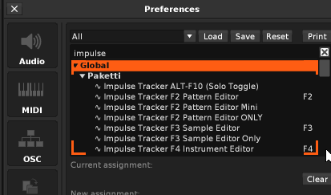


---
### 2024-06-16 - Improvement: Effect Column writers (shortcuts) now either outputs to selected_row if no selection, or to the selection
their naming has been tweaked also for better discoverability

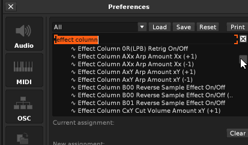


---
### 2024-06-16 - Improvement: Been working a bunch on making Menu Entries better and more organized, here's Keyzones
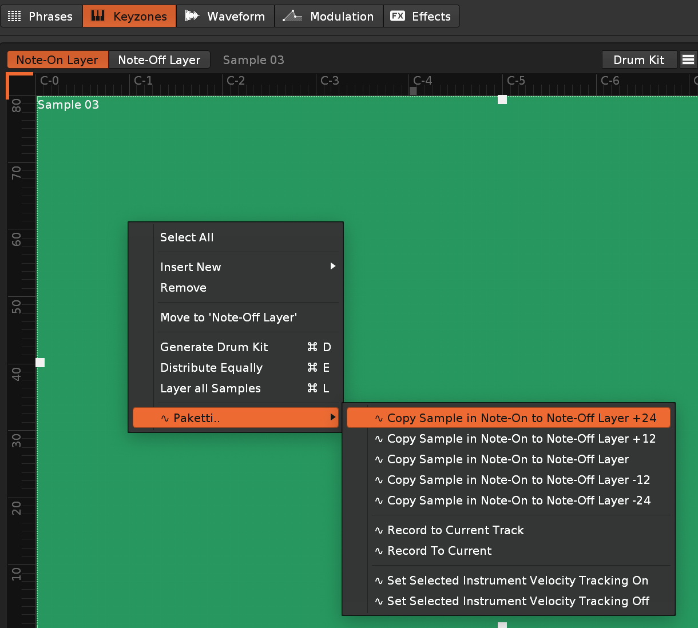


---
### 2024-06-16 - Improvement: "Wipe Song Retain Sample" now no longer errors if the Instrument you selected has no sample.

---
### 2024-06-16 - WIP Improvement: Instrument Box Menu Entries are better organized
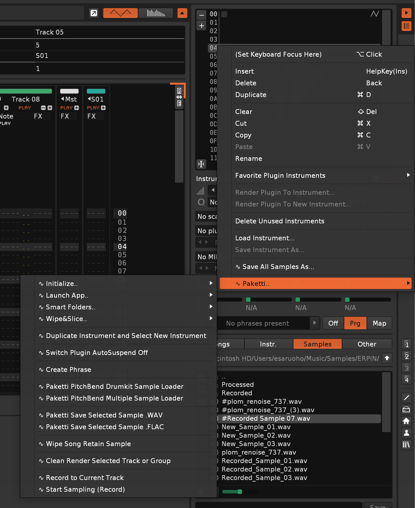

---
### 2024-06-16 - Improvement: Wipe & Slice no longer shoots an error if there is no sample in the instrument.  - instead shows a status "No samples available in the selected instrument".

---
### 2024-06-16 - Improvement: Wipe & Slice will tell you how many slices have been added to the instrument, and reference the sample name.
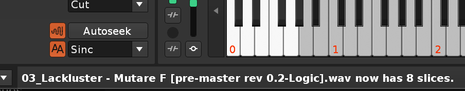

---
### 2024-06-16 - Improvement: Wipe & Slice will tell you when you've wiped all slices
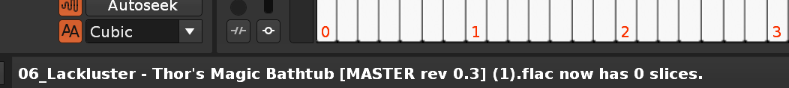

---
### 2024-06-16 - Improvement: LoopBlock "2nd binds" made available with matching naming convention to what Renoise provides
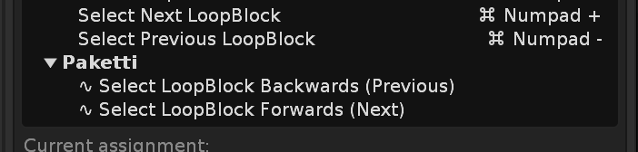

---
### 2024-06-16 - Improvement: Enable / Bypass EFX in Pattern now uses the right commands to bypass the first 8 effects, or enable the first 8 effects.
(Meaning: now compatible with Renoise 3)

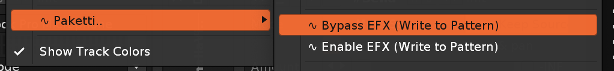

---
### 2024-06-16 - esaruoho

Backend Improvement: there's now a global function for giving a XML Preset and loading it directly to a plugin. which'll be useful in the future for loading XML content into active_preset_data for a plugin or a device.

---
### 2024-06-16 - Improvement: Whenever saving a script, or saving a song, or loading a new song, or creating a new song, or loading a sample, the view_preset1 would be forcibly shown. 
I've removed that since it benefits no-one - the viewport should stay the same no matter what

---
### 2024-06-17 - Improvement to ImpulseTracker `ALT-L *2` functionality. 
Now, if you are on Send or Master, and press ALT-L, it will select the content of the Send or Master track. when you press ALT-L again, it will select all of the pattern data (including sends + masters). instead of "only the tracks and not sends + masters".

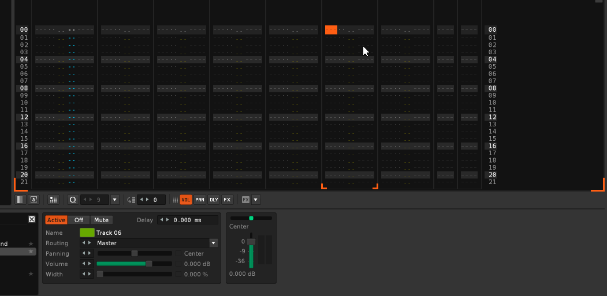

---
### 2024-06-17 - Fixed: when using Pattern Doubler to double a 256 row pattern to 512 - and the pattern has automation, there used to be an error shot.
now no error is shot no more and the automation works as expected.

---
### 2024-06-17 - Improvement: Sample Navigator now has the "Mono to Stereo" & "Mono to Left, Right Blank" & "Mono to Right, Left Blank" entries
And they're sorted correctly
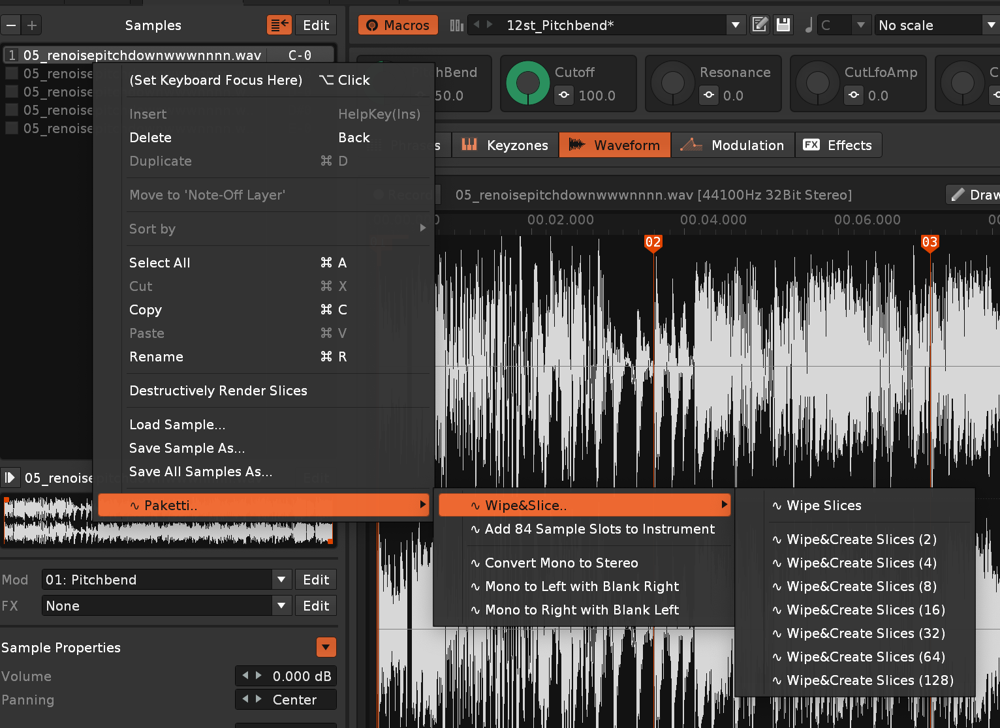

---
### 2024-06-17 - improvement: tweaked the naming convention of "Bypass EFX (Write to Pattern)" and "Enable EFX (Write to Pattern)"
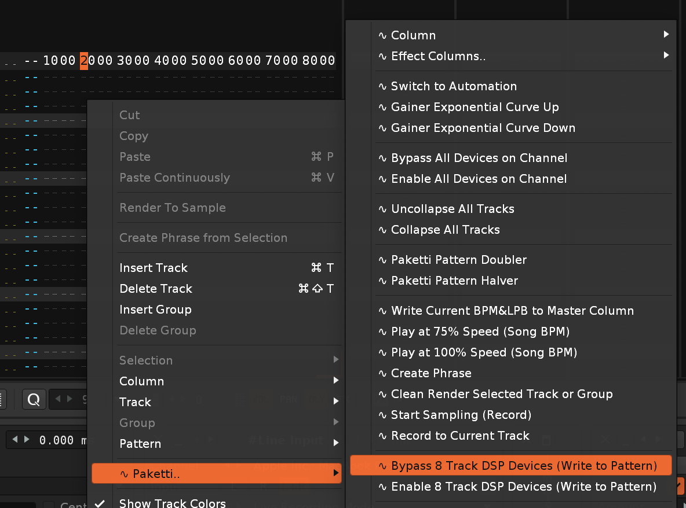

---
### 2024-06-17 - Improvement: Paketti PitchBend DrumKit Loader now correctly sets LoopMode + Sample Interpolation for each of the samples loaded into the drumkit.

---
### 2024-06-17 - Improvement: Bypass EFXs are now grouped together
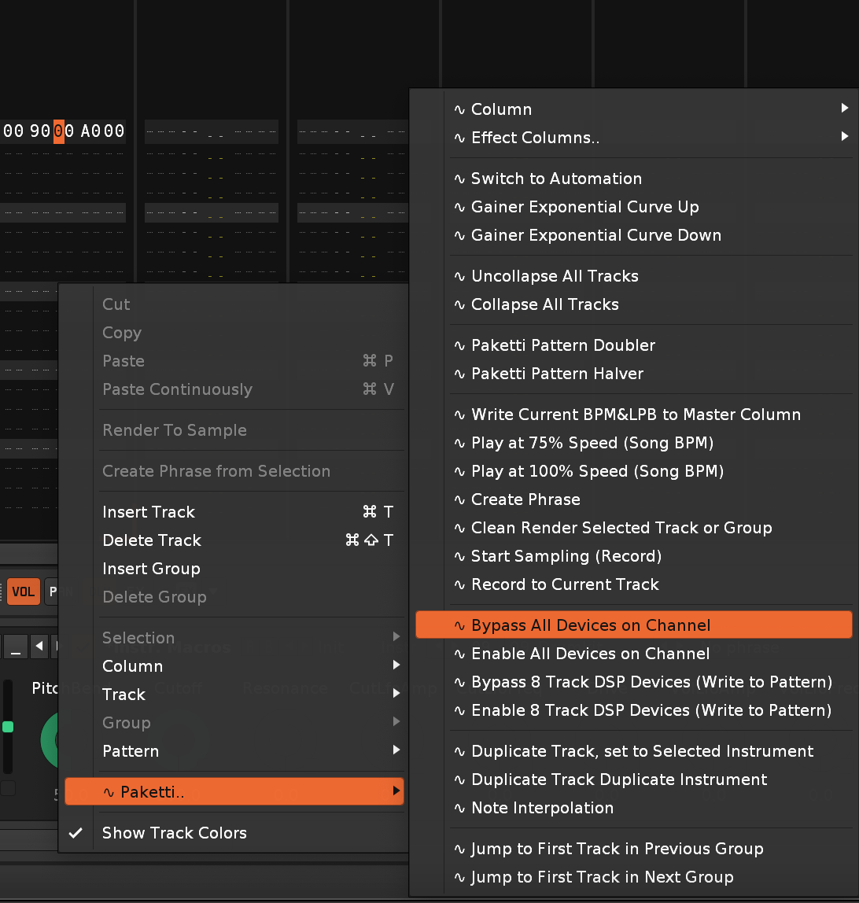

---
### 2024-06-17 - Improvement: had to switch from vb:switch for loop release to vb:checkbox -  - but now the preferences actually work properly. for loading samples and for slicing.

this Loop Release mode, coupled with Backward - means that whenever you let go of the playing slice, it will start playing backwards until the beginning of the sample is reached.
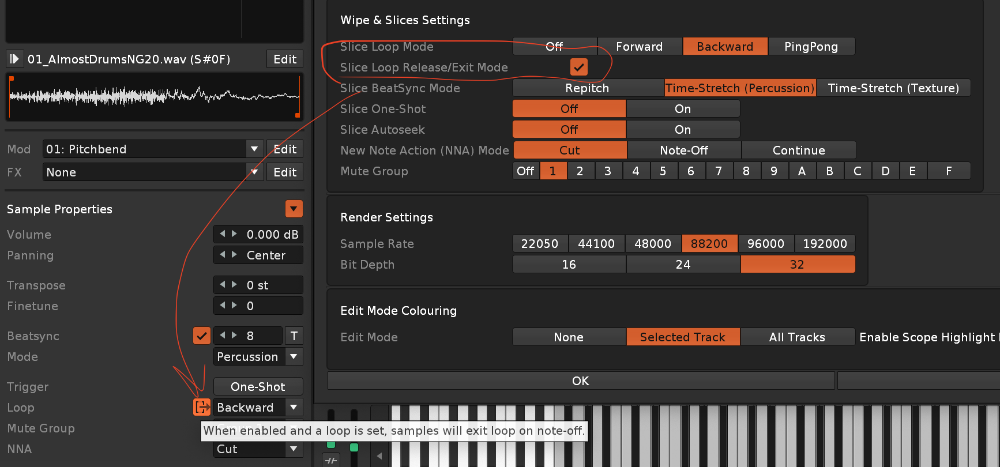

---
### 2024-06-17 - Feature: "Jump to First Track in Next Group" & "Jump to First Track in Previous Group" - as requested by icasiino - 
pretty much does what it says on the tin - if there are no groups, then it doesn't do anything.
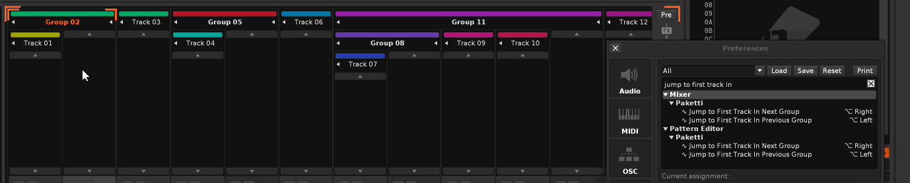

---
### 2024-06-17 - Improvement: 24st_pitchbend, 36st_pitchbend, 48st_pitchbend, 64st_pitchbend, 96st_pitchbend loaders updated with macros set up
these init instruments were lagging behind from 12st_pitchbend which had all the goodies
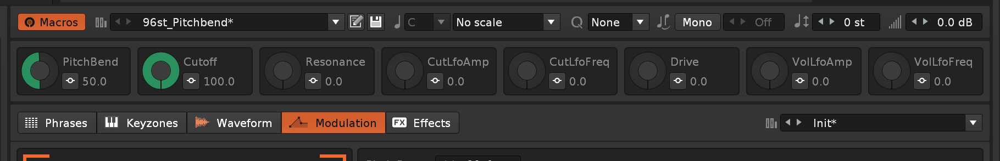

---
### 2024-06-17 - Improvement: Pattern Editor Cheat Sheet: added "0Yxx" (Maybe), "0Zxx" (Trigger Phrase) - tweaked order of effects so they match ["Effect Command Cheatsheet on Renoise Forum"](https://forum.renoise.com/t/effect-commands-cheat-sheet/45512) .. 
more tweaks incoming later (additional efx, grouping)

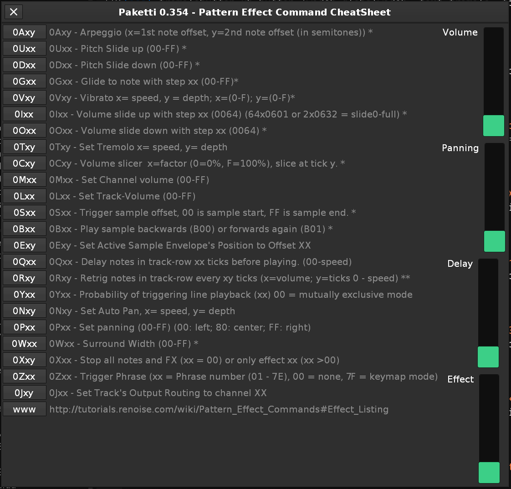

[Effect Commands Cheatsheet (Renoise Forum post, printable PDF by someone else)](https://forum.renoise.com/t/effect-commands-cheat-sheet/45512)

---
### 2024-06-18 - Feature: Globally Enable / Disable Volume Column, Panning Column, Delay Column, Sample FX Column. Available in Global:Tools:Paketti..:Pattern Editor, and Pattern Editor:Paketti..:  menu entries, and also as shortcuts. 

these change the Column Visibility of all regular Tracks to On/Off (Toggle) or Set to Visible.
(found this on a Renoise Forum post by ViZiON from 2008)
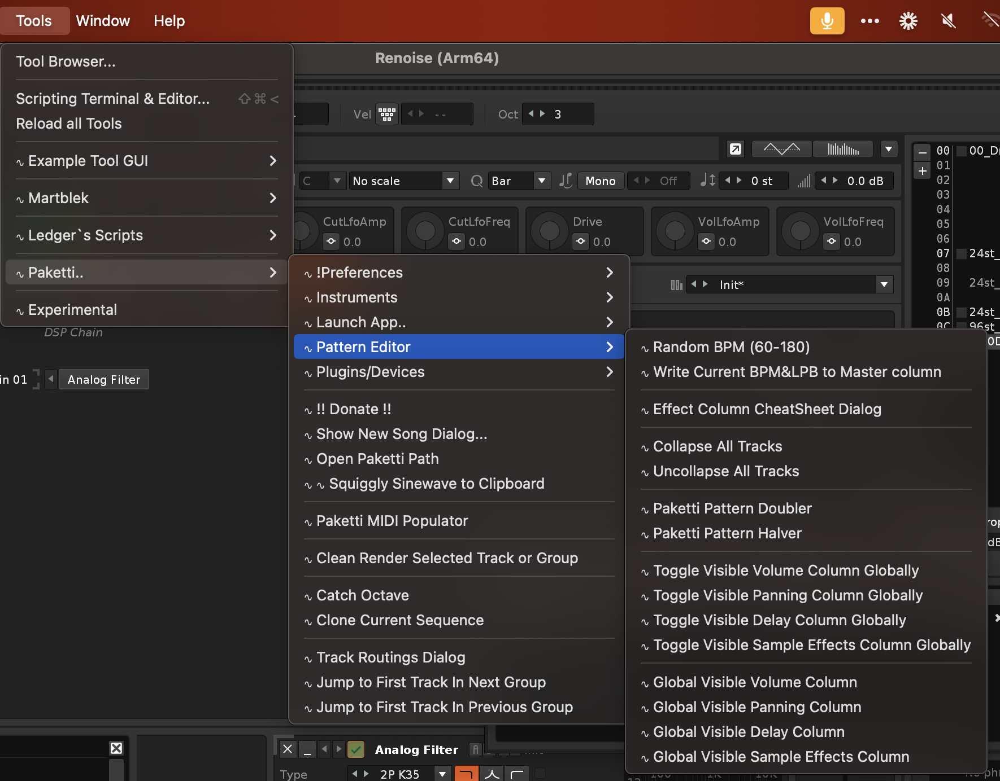

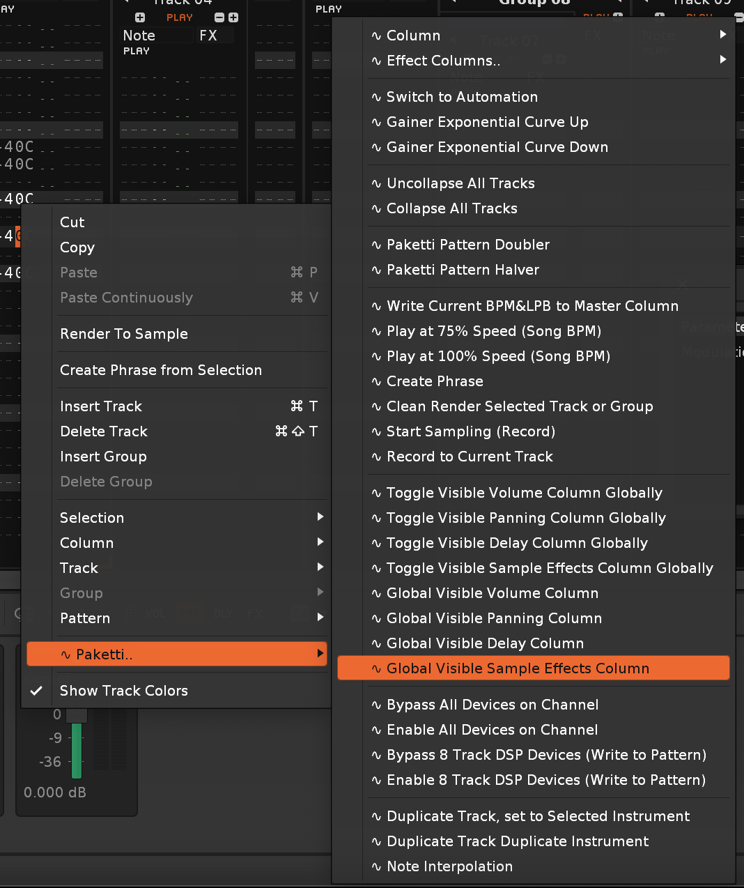

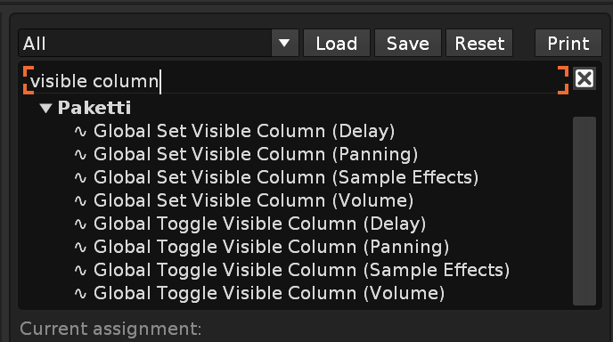

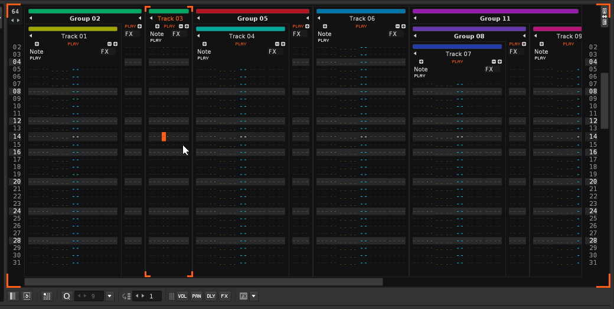


---
### 2024-06-18 - Improvement: Globally / Enable Visible Columns are now also visible on View -> Paketti.. -> Pattern Editor -> submenu
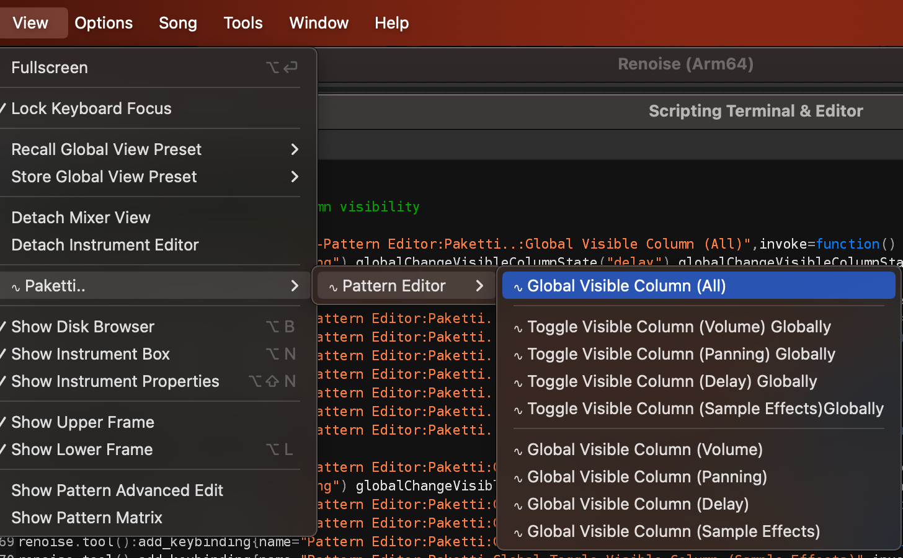


---
### 2024-06-18 - Improvements: `Bypass all Effects on Channel` now shows status `Disabled all Track DSP Devices on Selected Channel`
`Enable all Effects on Channel` now shows status `Enabled all Track DSP Devices on Selected Channel`

Tweaked most Track DSP Device hiding shortcuts + menu entries to make mention of "External Editor"
and added `"All open External Editors for Track DSP & Sample FX Chain Devices have been closed."`  and `"No Track DSP or Sample FX Chain Device External Editors were open, did nothing."` for informing the user what is going on.

this show_status thing will need to be done for hundreds of functions so whenever you see one that doesn't tell you what it does, hit me up and i'll tweak it in. there's too many for it to be doable in one go.


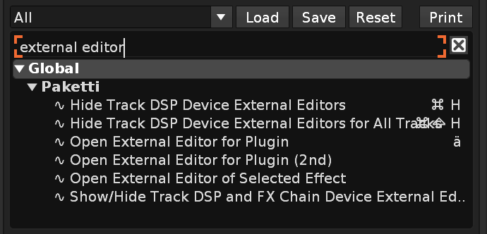


---
### 2024-06-19 - Feature: `Bypass All Other Track DSP Devices (Toggle)` as a keyshortcut, menu entry for Mixer + Track DSP  (Lower Frame) -- as requested  by untilde
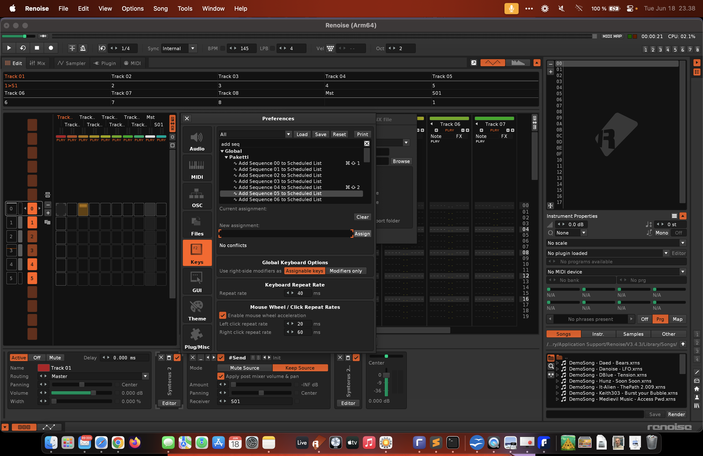

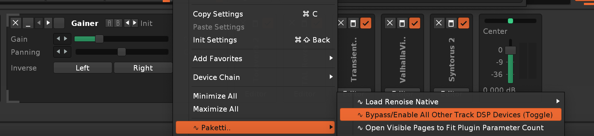


---
### 2024-06-19 - Improvement: "Jump to First Track in Next Group" & "Jump to First Track in Previous Group" shortcuts added to Pattern Matrix -- as requested by icasiino

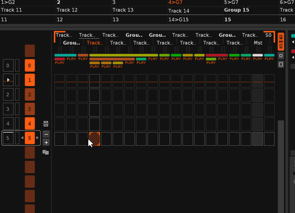


---
### 2024-06-19 - Improvement: 12st, 24st, 36st, 48st, 64st, 96st + drumkit loaders / init instruments now correctly map Cutoff knob to Cutoff, instead of.. Volume.. 🫢 🤦‍♂️

---
### 2024-06-19 - Improvement: added "Mono to Stereo, Mono to Left, Mono to Right" to Sample Mappings (=Keyzones) menu
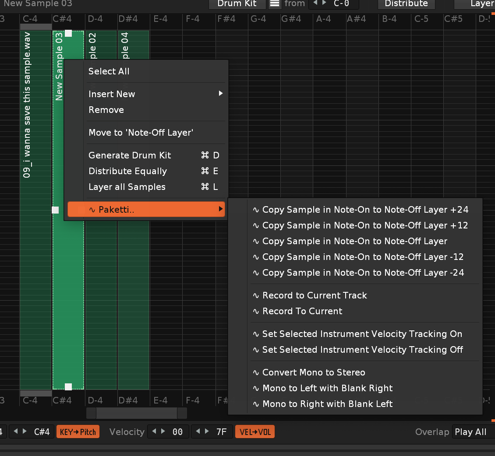


---
### 2024-06-20 - Improvement: "Mono to Stereo" "Mono to Left with Right Blank", "Mono to Right with Left Blank" now retain basenote and other key mapping settings, and are put into the same sample slot as previously (meaning instruments with multiple samples will retain their organization correctly).

---
### 2024-06-21 - Improvement: if 0G01 Loader is ON and you Wipe&Slice - new tracks are no longer created for slicecount (if you sliced a sample to 128 slices, you'd get 128 tracks) now you no longer need to protect yourself by disabling 0G01 Loader in order to wipe&slice and then re-enable 0G01 Loader -- the wipe&slicer just does the ad-hoc disable at the start of wiping&slicing, and then just re-enables it, if it was enabled. 
(this closes (https://github.com/esaruoho/org.lackluster.Paketti.xrnx/issues/183)[https://github.com/esaruoho/org.lackluster.Paketti.xrnx/issues/183] )

---
### 2024-06-21 - Feature: AppSelection GUI now includes method for setting three Smart Folders (for macOS use), instead of hardwiring them to /Users/esaruoho/Music/samples/LogicSmartFolder + /Users/esaruoho/Music/samples/LiveSmartFolder..
I've also removed `sox` usage for adjusting 32bit samples to 24bit samples, which is no longer needed since Logic Pro can handle 32bit wavefiles nowadays.

NOTE: if there are apps out there that can't handle 32bit wavefiles, please tell me which ones they are, so i can try them out and add "adjust to 16bit" "adjust to 24bit" next to the Smart Folder path buttons.

(this closes  (https://github.com/esaruoho/org.lackluster.Paketti.xrnx/issues/161)[https://github.com/esaruoho/org.lackluster.Paketti.xrnx/issues/161] )
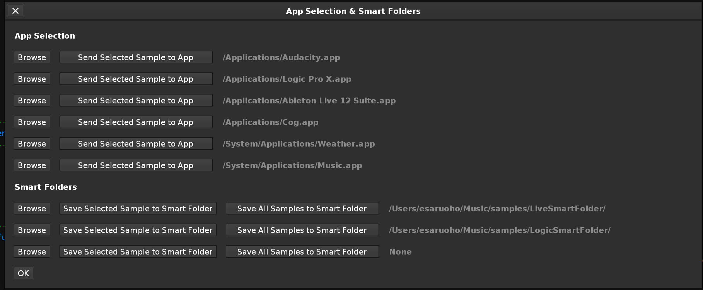

---
### 2024-06-21 - Improvement: If you try to save sample or samples to a Smart Folder that is not set - an error is shown on the status and the Smart Folder GUI opens up

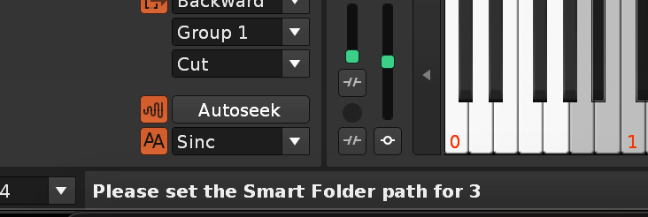

---
### 2024-06-21 - esaruoho

Feature: Create Identical Track.
if your track has X amount of Note Columns, Effect Columns, Panning, Delay, Volume, Sample FX Columns visible or the track is collapsed -- (or if none of these are visible or on), the "Create Identical Track" shortcut will create a Track that matches the track you were on.
closes https://github.com/esaruoho/org.lackluster.Paketti.xrnx/issues/208
(as requested by ViZiON on the Renoise Forums in January2009)

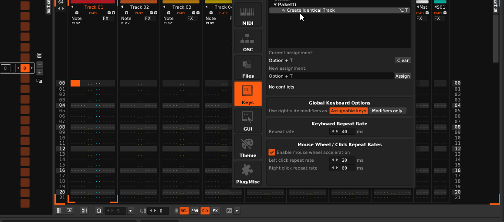


---
### 2024-06-21 - esaruoho

Feature: Randomize Selected Device Parameters:
<div style="position: relative; padding-bottom: 64.90384615384616%; height: 0;"><iframe src="https://www.loom.com/embed/52748313bf284544976bf7f90b62e6c6?sid=a2142966-d532-49d2-adbc-2aca8bd751fa" loading="lazy" frameborder="0" webkitallowfullscreen mozallowfullscreen allowfullscreen style="position: absolute; top: 0; left: 0; width: 100%; height: 100%;"></iframe></div>

https://www.loom.com/share/52748313bf284544976bf7f90b62e6c6?sid=b3198df4-229b-47e0-a5ce-465ca11f90e6

---
### 2024-06-21 - esaruoho

Feature: Randomize Selected Instrument (All) Plugin Parameters .. but since it randomizes each parameter, you might have a bad time if the synth sets itself to not play anything (outputs that you're not listening to, etc..)

---
### 2024-06-21 - esaruoho

Improvement: Randomize Selected Device Parameters now shows the name of the device that was randomized.
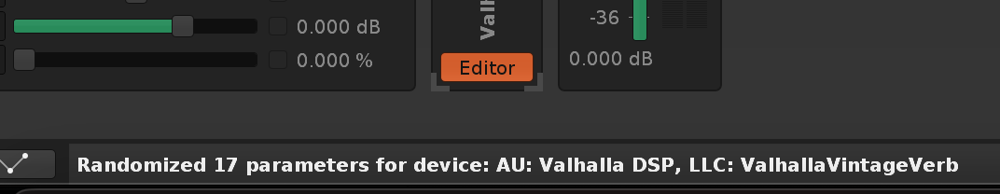

---
### 2024-06-21 - esaruoho

Feature: LADSPA/DSSI Device loader (shortcut + midimapper) GUI created. if you have Linux, please DM me and i'll send you a xrnx and please take some video + screenshots, i can't test how it works myself.
EDIT: there's apparently some noisy devices there that have a really long name (looking at you: 
```
721  Audio/Effects/LADSPA/lsp-plugins-ladspa.so:http://lsp-plug.in/plugins/ladspa/sc_mb_dyna_processor_stereo
```
fun. but shoot me some screenshots + video  so i can pick up the pieces. seems to work anyway.

---
### 2024-06-21 - esaruoho

Improvement: Gainer Exponential Curve Up, Gainer Exponential Curve Down now goes from 0.0dB to INF or from INF to 0.0dB - instead of to "12.5dB" - thus boosting the input signal by +12dB.
fixes (https://github.com/esaruoho/org.lackluster.Paketti.xrnx/issues/171)[https://github.com/esaruoho/org.lackluster.Paketti.xrnx/issues/171]

usecase: make a way to fade in a sound by adding a gainer device to the track and fading sound in or sound out.
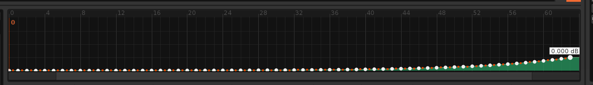

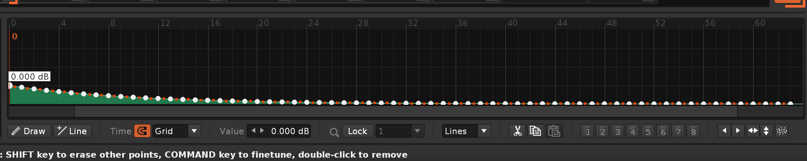


---
### 2024-06-22 - esaruoho

Improvement: Moved "Jump to First Track in Next Group" & "Jump to First Track in Previous Group" to Main Menu:Tools:Paketti..:Pattern Editor:
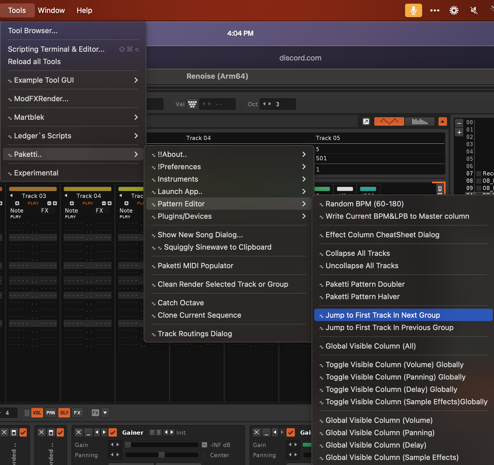


---
### 2024-06-22 - esaruoho

Improvement: Added "Create Identical Track" to Tools->Paketti.. -> Pattern Editor

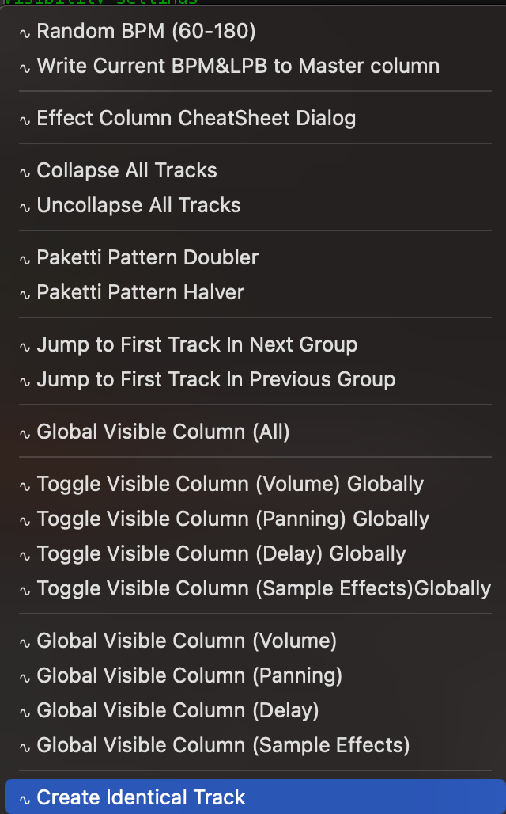

---
### 2024-06-22 - esaruoho

Improvement: Added "Randomize Selected Instrument Plugin Parameters" &."Randomize Selected Device Parameters" to Tools->Paketti..->Plugins/Devices
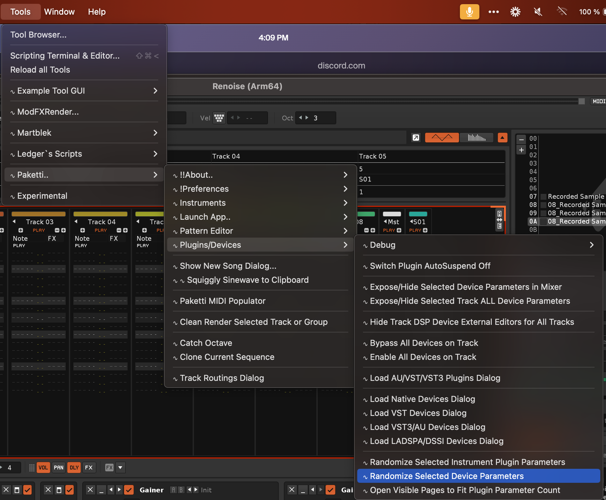

---
### 2024-06-22 - esaruoho

Feature: Move Slice End Left/Right by +10/-10, +100/-100, Move Slice Start LeftRight by +10/-10 +100/-100:
this means that you can be in the slice itself, and adjust the slice visually with nudges.
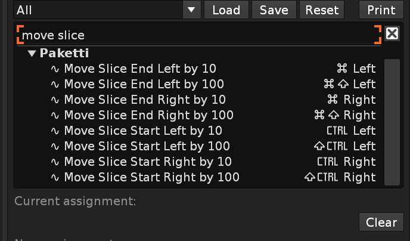

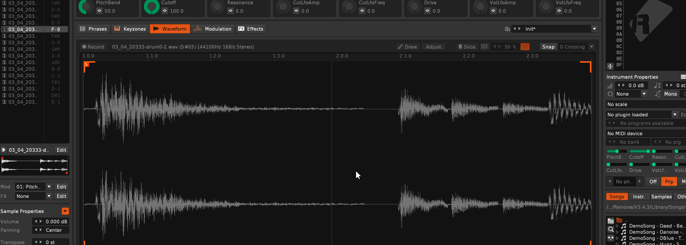

---
### 2024-06-22 - esaruoho

Improvement: Wipe Slices (in Wipe&Slice suite of features) now will properly wipe all slices from the sample even if a slice was selected when you wipe slices. (it used to do nothing)

---
### 2024-06-22 - esaruoho

Improvement: If there are no apps configured in App Selection, the dialog does not forcibly open on every new song, Renoise start, etc. Just a show_status message instead:
```
No apps have been configured in Paketti..:Launch App..:Configure Launch App Selection, cannot populate Menu.
```

---
### 2024-06-22 - esaruoho

Improvement: if no LADSPA or DSSI devices found on computer, display a sensible message (`No LADSPA/DSSI Devices found on this computer.` )  instead of ruining the GUI by making the buttons not show properly

---
### 2024-06-22 - esaruoho

Improvement: if no AU, VST or VST3 plugins found on computer, display a sensible message ( `No AudioUnit Plugins found on this computer.` or `No VST Plugins found on this computer.` or `No VST3 Plugins found on this computer.`) instead of ruining the GUI by making the buttons not show properly

---
### 2024-06-23 - esaruoho

Feature: Solo Selected Track in Group using Note Column Mute:
closes (https://github.com/esaruoho/org.lackluster.Paketti.xrnx/issues/106)[https://github.com/esaruoho/org.lackluster.Paketti.xrnx/issues/106]
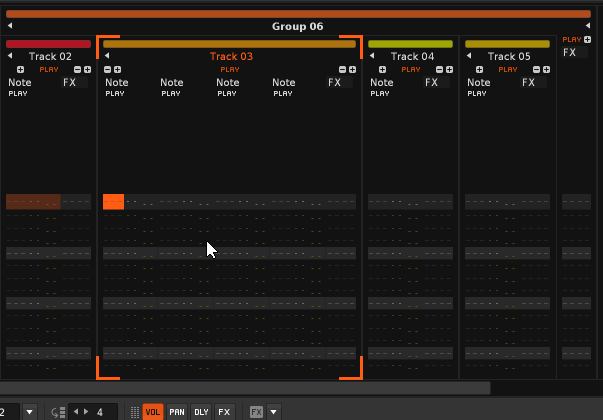

---
### 2024-06-23 - esaruoho

Improvement: +300/-300 +500/-500 for both Slice Start & Slice End:

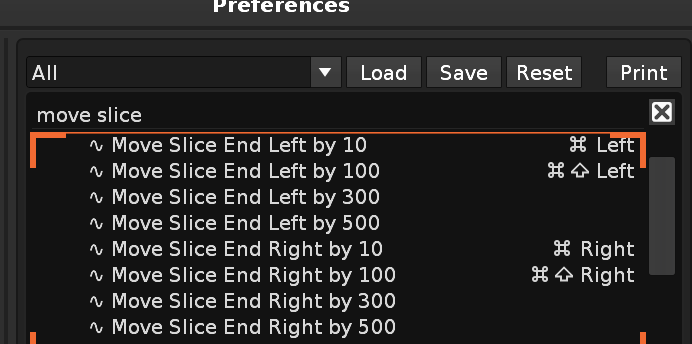

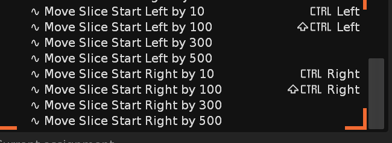

---
### 2024-06-23 - esaruoho

Improvement: Midi Mapping Sample FX Column knob now shows the Sample FX Column, for better visibility.

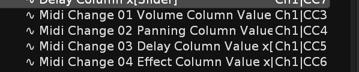

---
### 2024-06-23 - esaruoho

Improvement: Midi Change 01 Volume Column Value / 02 Panning Column Value / 03 Delay Column Value / 04 Sample FX Value: 
if you have nothing selected, it'll output to current_line row. if columns are not visible, they are made visible. if you have a selection, then the whole selection will be changed by midi knobs.

<div style="position: relative; padding-bottom: 64.90384615384616%; height: 0;"><iframe src="https://www.loom.com/embed/3af37cfeac9a4aa78834d7b6c74b7f36?sid=8448be8d-8f03-469a-a7a2-12df1888add2" loading="lazy" frameborder="0" webkitallowfullscreen mozallowfullscreen allowfullscreen style="position: absolute; top: 0; left: 0; width: 100%; height: 100%;"></iframe></div>

(https://www.loom.com/share/3af37cfeac9a4aa78834d7b6c74b7f36?sid=0285c5a2-1d7b-4c83-820c-e9e07f40a52f)[https://www.loom.com/share/3af37cfeac9a4aa78834d7b6c74b7f36?sid=0285c5a2-1d7b-4c83-820c-e9e07f40a52f]

---
### 2024-06-23 - esaruoho

Feature: Selected Device Parameter Randomizer Dialog.
Offers a slider for controlling percentage of randomization
auto-updates to new device if you select a new device.
<div style="position: relative; padding-bottom: 64.90384615384616%; height: 0;"><iframe src="https://www.loom.com/embed/6358542ad6db449daf581421653548fa?sid=710584ec-3e0c-47ae-9e3b-9da0abecefba" loading="lazy" frameborder="0" webkitallowfullscreen mozallowfullscreen allowfullscreen style="position: absolute; top: 0; left: 0; width: 100%; height: 100%;"></iframe></div>
(https://www.loom.com/share/6358542ad6db449daf581421653548fa?sid=aee4ccb0-2738-4214-933d-0bd5c50eb163)[https://www.loom.com/share/6358542ad6db449daf581421653548fa?sid=aee4ccb0-2738-4214-933d-0bd5c50eb163]

---
### 2024-06-23 - esaruoho

Improvement: BPM +0.1 / BPM -0.1 (in addition to +1/+5/-5/-1 already being there since 14 years ago in Paketti.) this is ripped straight from the ModPlugTracker playbook:


---
### 2024-06-23 - esaruoho

Improvement: Randomize Selected Device Parameters Dialog now updates if no Device is selected. also, after clicking on the Randomize button, the keyboard focus is returned to Renoise / the Tracker, so you can continue shortcutting+keyjazzing.

---
### 2024-06-24 - esaruoho

Feature: "Duplicate Effect Column Content to Pattern"

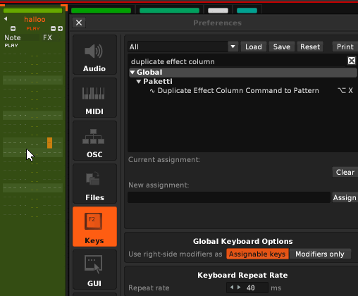

---
### 2024-06-24 - esaruoho

Improvement: "Duplicate Effect Column Content to Pattern or Selection" -> if something is selected, your current row effect parameter is input to selection.. if nothing selected, then the whole pattern gets the effect parameter input

---
### 2024-06-24 - esaruoho

Feature: "Randomize Effect Column Parameters for Pattern or Selection"

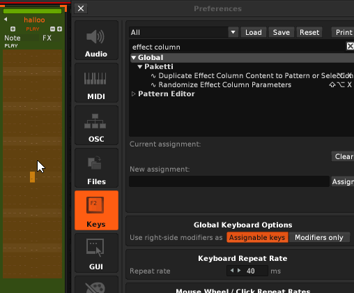


---
### 2024-06-24 - esaruoho

Feature: Effect Column Interpolation for Selection or Pattern.

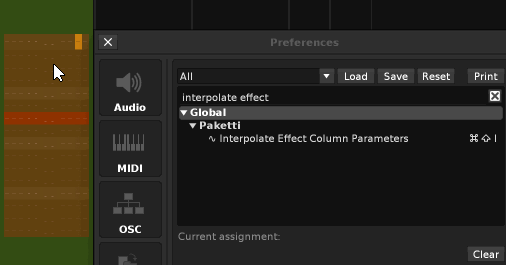

---
### 2024-06-24 - esaruoho

Feature: Flood Fill Selection or Track with Instrument + Note:

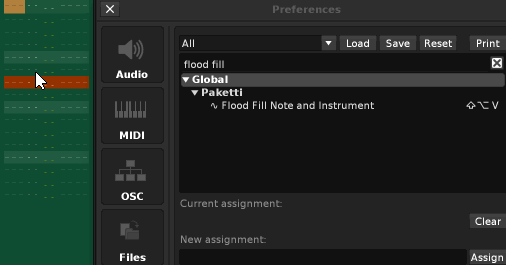

---
### 2024-06-24 - esaruoho

Improvement: now all Plugin parameters can be randomized, or all plugins in the whole song can be randomized.  same GUI as Selected Track Device & All Devices on Selected Track.
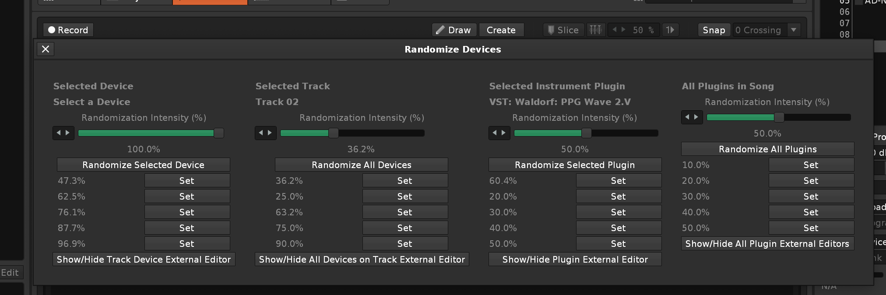

---
### 2024-06-25 - esaruoho

Improvement: If currently selected instrument has no plugin, Randomize Devices & Plugins dialog will still open.
If there are no plugins in the song, then Randomize All Plugins will show_status stating there are no plugins, instead of saying "yes, randomized all plugins in song". and in the same situation, "Show/Hide all Plugin External Editors" will also show a status.
and visual update: the fourth column now has empty space before the "Randomization intensity (%)" line to better line up.
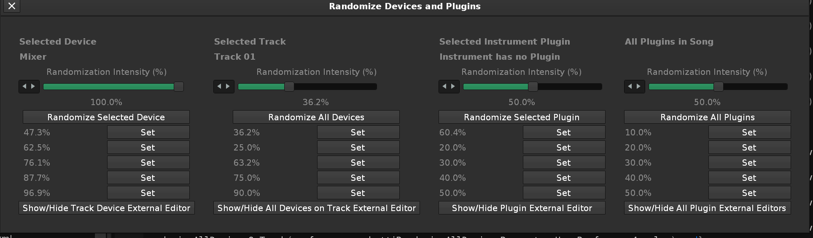

---
### 2024-06-26 - esaruoho

Feature: Impulse Tracker ALT-Left / ALT-Right (two flavors, one that Wraps (last track to first track.. or first track to last track), and another that doesn't wrap (press alt-left enough, and you'll be in first track but that's it.. same for alt-right)))

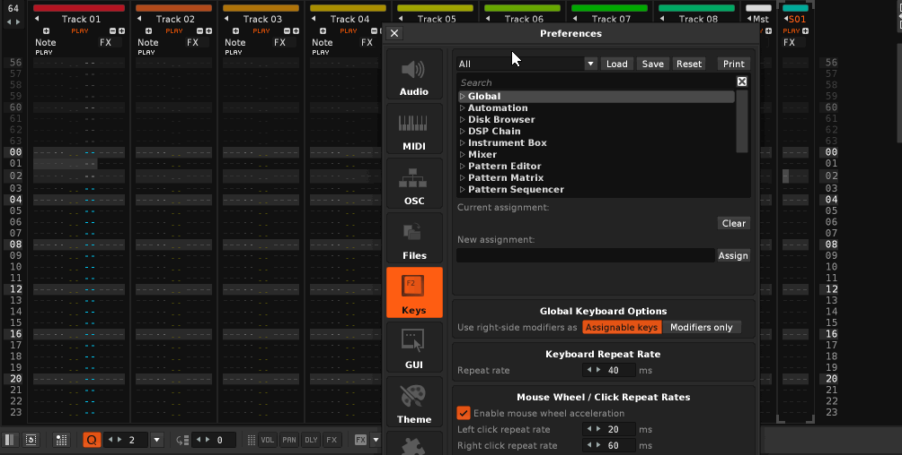

---
### 2024-06-28 - esaruoho

Feature: Impulse Tracker "Slide Content Up / Down". this takes Selected Track.. or Selected Note Column or Selected Effect Column. will slide it up and down.
	
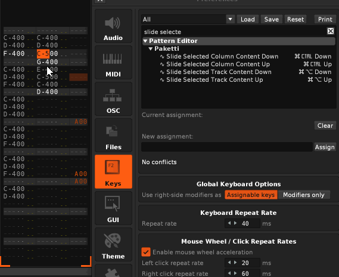

---
### 2024-06-28 - esaruoho

Feature: Solo Tracks - if no pattern selection - then mute currently selected track. if current track is selected or has selection, mute that. draw selection around multiple tracks and run shortcut = all other tracks are muted. or unmuted.

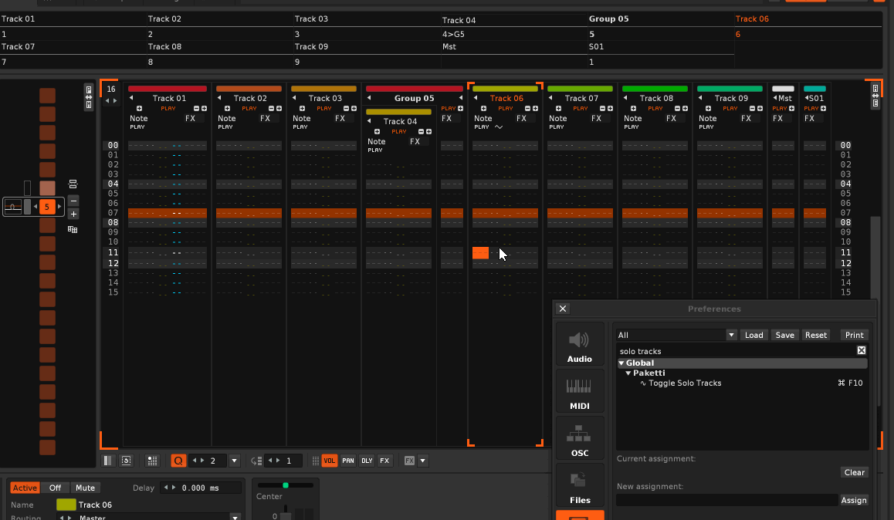

---
### 2024-06-28 - esaruoho

Improvement: Note Interpolation now works on any note column on the track. same with selection. and.. if you have multiple note columns selected, and there's notes there at the start + end of pattern rows, the interpolation will happen. and if you have a selection within a track, the note interpolation will happen for the whole selection.


---
### 2024-06-28 - esaruoho

Feature: ALT-Y "Swap Block" straight from ImpulseTracker2/SchismTracker/ScreamTracker3(?)


---
### 2024-06-28 - esaruoho

Improvement: Alt-Y will now work with tracks that don't have "enough" note columns, they will be resized. and now this can be used for multiple note columns, and to the track you're at.


---
### 2024-06-29 - esaruoho

Improvement: Transpose +12 / -12 / +1 / -1  so that if nothing is selected in the pattern, it will transpose the whole selected_track. if something is selected in the pattern, then it'll transpose the selection.
Feature: Transpose +12/-12/+1/-1 for selection, or just current note column.

both of these transposes actually go from C-9 to C-0 if you keep transposing.


---
### 2024-06-29 - esaruoho

Feature: Duplicate Instrument and Reverse Sample -- this just takes your currently selected instrument, duplicates it below it, and reverses the samples in the instrument. (and selects the newly created reversed instrument)


---
### 2024-06-30 - esaruoho

Improvement: F5 "Impulse Tracker Play" used to have a 0.4 second delay after Panic + playback starting. it was to avert plugins from crashing (F5 is a macro that stops playback, runs Renoise Panic (to kill all audio) and then starts playback with follow pattern = on)) - now i cut it down to 0.225second, so it "feels less sluggish".

---
### 2024-07-01 - esaruoho

Feature: Paketti Renamer - shortcut + menu entry for renaming a track. opens a dialog with current name highlighted, you can type, press enter -> renaming done. works for master, send, group, track.


---
### 2024-07-01 - esaruoho

Improvement: Now Paketti Track Renamer reads selection-in-pattern for multi-track renaming one at a time.


---
### 2024-07-04 - esaruoho

Improvement: "Wipe Plugins" added to CTRL-N, it will look through all the instruments and clear the plugins from the instruments.


---
### 2024-07-05 - esaruoho

Improvement: Added the Note-On to Note-Off (with transpose) copying to Sample Navigator, since i went there to try and run it and realized it's not there. it's now in sample editor, sample mappings, and sample navigator.


---
### 2024-07-05 - esaruoho

Improvement: Solo Tracks will now:
- Work if the selected track is a Send - the rest of the Sends + Tracks are muted.
- Mute Sends if selected track is a Track, or if Selection In Pattern covers tracks.
- Work if Selected Track is within a Group - mutes the rest of the Tracks within the Group, but keeps the Group playing.
- If you Selection in Pattern say tracks4-5, and run shortcut, and then move Selection In Pattern to 5-6 and run shortcut, 5-6 will be unmuted and the rest muted. this used to mess up.
- Master is ignored and is not allowed to shoot error. (i.e. script no longer tries to mute Master for no reason.)

still ironing out 4 other issues, then it's ready. .. 🫢

---
### 2024-07-05 - esaruoho

Feature: Isolate Slices to New Instruments - this takes the slices in your sliced instrument, and copies all their settings and modes, and creates new instruments, naming them according to the slice.
available in Sample Editor, Sample Navigator, Sample Mappings and Instrument Box. and a global shortcut.


---
### 2024-07-05 - esaruoho

Feature: Reverse Notes in Selection


---
### 2024-07-05 - esaruoho

Improvement: Load Native Devices Dialog can be opened multiple times instead of only once (and then the gui fails to render)

---
### 2024-07-05 - esaruoho

Improvement: the Smart Folders segment of this dialog has been, more understandably, modified to include "Backup Folders" and for the buttons to refer to "Folders" instead of "Smart Folders" - because the usecase is of course that you can set the folder of your choice to be a folder that's a smart folder (macOS) or any folder (such as a backup folder). think "folder 1 = drums, folder 2 = melodies, folder 3 = pads" or something like that


---
### 2024-07-05 - esaruoho

Improvement: End *2 now actually first takes you to last row of current note column, and on second press, to the last track last row.

---
### 2024-07-05 - esaruoho

Feature: Send Populator for Selected Track or All Tracks.


---
### 2024-07-06 - esaruoho

Feature: Flood Fill Note & Instrument with Edit Step - this takes the Edit Step and fits the currently selected line note + instrument to it, or if you have a multi-track selection, it will take the current row and fill the selection with the note+instrument using editstep.
<div style="position: relative; padding-bottom: 64.90384615384616%; height: 0;"><iframe src="https://www.loom.com/embed/2dc0c84c97dc4dcc9c5125671e6b1da2?sid=1e5f9784-6265-47de-b622-eb39cc463ab5" loading="lazy" frameborder="0" webkitallowfullscreen mozallowfullscreen allowfullscreen style="position: absolute; top: 0; left: 0; width: 100%; height: 100%;"></iframe></div>
(https://www.loom.com/share/2dc0c84c97dc4dcc9c5125671e6b1da2?sid=081e5637-a092-4299-ac49-7433e90d344a)[https://www.loom.com/share/2dc0c84c97dc4dcc9c5125671e6b1da2?sid=081e5637-a092-4299-ac49-7433e90d344a]

---
### 2024-07-06 - esaruoho

Improvement: Load Native Devices Dialog now has "Randomize Selection" as a possibility.  it will clear the current selection, and then select a random amount of devices.


---
### 2024-07-06 - esaruoho

Improvement: Load VST Devices Dialog also has "Randomize Selection"


---
### 2024-07-06 - esaruoho

Improvement: Load VST3/AudioUnit Randomize Selection


---
### 2024-07-06 - esaruoho

Improvement: Load VST3/VST/AudioUnit Plugins Randomize Selection:


---
### 2024-07-06 - esaruoho

Improvement: Plaidzap gift now uses the macros (pitchbend,cutoff,resonance,cutoffLFOAmount,cutoffLFOFreq,Overdrive,VolLFOAmount,VolLFOFreq

---
### 2024-07-06 - esaruoho

Feature: Unison Generator.. creates 6 samples  and finetunes them by -1 +1 -2 +2 -3 +3 and adjusts the sample startpoint by fractions (1/8 to 7/8) so they're slightly offset


---
### 2024-07-08 - esaruoho

Feature: You can now Export the Convolver IR to a new Instrument, which will export it and then show the Sample Editor. You can also, after modifying, Import the Selected Sample back to the Selected Device (Convolver).
if anyone's into IRs, please DM me and I'll send a build and we can continue looking at this - i need plenty of IRs to make sure it all works

---
### 2024-07-08 - esaruoho

Improvement: There's now a connection between 0G01 loader and Paketti PitchBend Multiple Sample Loader - if 0G01 loader is set to On, then new tracks will be created per each loaded sample, and each track will cleanly have a instr automation device added, so there's no longer a flood of instr automation devices for the track you were on, i.e. you load 36 samples and there's 36 instr automation devices on selected_track.

closes (https://github.com/esaruoho/org.lackluster.Paketti.xrnx/issues/191)[https://github.com/esaruoho/org.lackluster.Paketti.xrnx/issues/191]

---
### 2024-07-10 - Improvement: Export / Import Convolver IR
file feature now offers a GUI for also importing to convolver or exporting from convolver, and the gui allows for using shortcuts while open, so you can select a new sample to be imported to a Convolver of your choice. it also will update when you select a different sample, it allows you to add a Convolver to the start of the Track DSP Chain or the end of it, and you can import or export from any of them.


---
### 2024-07-10 - Feature: Set Master Track Output Routings 00...32 - this changes the Master Track Output.


---
### 2024-07-10 - esaruoho

Improvement: Set Master is now 0...63
Selected Track Output Routing is now 0...63

---
### 2024-07-11 - esaruoho

Feature: MidiMapping Knob 0...127 for Selected Track Output Routing, and Master Track Output Routing:


---
### 2024-07-12 - esaruoho

Feature: MidiMapping Buttons for Selected Track Output Routing, and Master Track Output Routing:  0...63


---
### 2024-07-13 - esaruoho

Feature: a brand new donation dialog with buttons for donating via ko-fi, bandcamp or PayPal, and with a list of people who donated, how much, and links to their pages as promotion.

---
### 2024-07-14 - esaruoho

Feature: PlayerPro Note Dialog - lets you output selected instrument and note to row if nothing selected.. if there's a selection_in_pattern, and you press a note, the selected instrument + clicked on note will appear in the selection.


---
### 2024-07-15 - esaruoho

Feature: Set Master Track Volume +0.1dB / -0.1dB, with clamping at -INF and 3dB.

---
### 2024-07-16 - esaruoho

Feature: Paketti eSpeak Text-to-Speech, tested with macOS & Linux.
This supports both `espeak` and `espeak-ng` 
it is an improvement over Martblek's abandoned ReSpeak. (Martblek gave permission to take his work and improve upon it)

Supports: 
- Loading textfiles and rendering
- selection from text can be rendered
- same shortcut that opens the dialog, renders the sample
- espeak path is stored  in Preferences
- settings stored in Preferences
- Sample Editor is brought up after rendering, so you can see what happened
- Can select whether new instrument is rendered or sample.
- User setting: every voice/language change will render a new sample / new instrument. (dropdownmenu & +/- changes for quickly changing the voice / language) -> means when you  hit +/- it'll render a new instrument every time.
- Languages sorted alphabetically


---
### 2024-07-16 - esaruoho

Improvement: if you have no MIDI input devices and/or MIDI output devices, the Paketti Midi Populator no longer errors out and stops working.

---
### 2024-07-18 - esaruoho

Improvement: Switch to Automation will now switch back to TrackDSPs if Automation is already displaying

---
### 2024-07-18 - esaruoho

Feature: Resize & Fill. (available in Pattern Editor menu, Tools menu, and as a shortcut). this takes your pattern (and pattern automation) and expands until you have a pattern of 032, 064, 128, 256, 512 rows. so if you have a 4 row pattern, and you press "Resize & Fill 128" - the 4 row pattern changes to 128 rows, and the content is duplicated 32 times. 
if, however, you have a 512 row pattern and you press "resize&fill 032" - it will simply resize the pattern to 32 rows. and tell you accordingly.

this is basically a controlled "Paketti Pattern Doubler".


---
### 2024-07-18 - esaruoho

Improvement: Paketti Save Sample as FLAC / WAV menu entries added to Sample Editor (!!!) they should have always been there.


---
### 2024-07-18 - esaruoho

Improvement: Paketti Save Selected Sample as FLAC / WAV menu entries added to Sample Navigator.


---
### 2024-07-18 - esaruoho

Improvement: Unison Generator -> sets the selected instrument selected sample loopmode to Forward, in case if it is not set

---
### 2024-07-19 - esaruoho

Improvement: Unison Generator now both makes a copy of the original instrument, and loads 12st_Pitchbend.xrni instrument, for macros.
(closes (https://github.com/esaruoho/org.lackluster.Paketti.xrnx/issues/274)[https://github.com/esaruoho/org.lackluster.Paketti.xrnx/issues/274])

---
### 2024-07-19 - esaruoho

Improvement: "Save Selected Sample" & "Save All Samples" to Smart/Backup Folder menu entries added for Sample Navigator (Selected+All), Sample Editor (Selected) and Instrument Box (All)
EDIT: typo fix, "All Sample" -> "All Samples" for each menu entry 🙂
(closes (https://github.com/esaruoho/org.lackluster.Paketti.xrnx/issues/245)[https://github.com/esaruoho/org.lackluster.Paketti.xrnx/issues/245] )


---
### 2024-07-19 - esaruoho

Improvement: Transpose +1/-1/+12/-12 now work with 1) selection only if selection in pattern 2) each note column in track if no selection in pattern.
(closes (https://github.com/esaruoho/org.lackluster.Paketti.xrnx/issues/174)[https://github.com/esaruoho/org.lackluster.Paketti.xrnx/issues/174]

---
### 2024-07-19 - esaruoho

Update: Paketti Donations list updated with URL button added to newest donator - a maximum of 3 URLs can be added upon donation (Zoey Samples got the BTD Records url)


---
### 2024-07-19 - esaruoho

Improvement: Unison Generator now reads this brand new (still WIP) setting in Paketti Preferences:  .. i.e. if it is set to ON, then the Unison Generated Instrument will have AHDSR envelope enabled instead of disabled. default is disabled.


---
### 2024-07-19 - esaruoho

Improvement: Unison Generator is now the first feature that uses the "Default .XRNI to use" Paketti Preferences setting. This allows you to set your own instrument to be loaded when generating a Unison - enabling you to decide which macros + etc modfx + samplefx settings (sample fx chains) stuff your instrument comes preloaded with. including sample modulation. this is a powerful thing to have.

---
### 2024-07-19 - esaruoho

Improvement: "Create New Instrument & Loop" now also uses Default XRNI Preference

---
### 2024-07-19 - esaruoho

Improvement: Paketti Pitchbend Multi Sample Loader now also uses Default .XRNI preference

---
### 2024-07-19 - esaruoho

Improvement: Paketti Clean Render now also uses Default .XRNI Preference

---
### 2024-07-20 - esaruoho

Improvement: Default XRNI Loader now has a dropdown menu in Paketti Preferences: you can pick from the ones already available, or your own.
this lets me also collaborate with other people who want to make a default XRNI available, and want to contribute it to Paketti


---
### 2024-07-22 - esaruoho

Plumbing: Paketti has KeyBindings.xml files inside the script itself, I've moved them to the `KeyBindings` folder. These are, for now, only used for storing the "macOS Paketti" shortcuts.. The objective is to eventually offer a PakettimacOS / PakettiWindows / PakettiLinux  KeyBindings files, but that is further down the line.

---
### 2024-07-22 - esaruoho

Feature: PlayerPro Transpose Selection or Row +1/-1/+12/-12


---
### 2024-07-23 - esaruoho

Feature: Paketti Theme Selector Dialog.
<div style="position: relative; padding-bottom: 64.90384615384616%; height: 0;"><iframe src="https://www.loom.com/embed/2289acd190614b388a93edc2e7f3507a?sid=ff453d9e-81db-49ea-be24-3592a85b2f6a" loading="lazy" frameborder="0" webkitallowfullscreen mozallowfullscreen allowfullscreen style="position: absolute; top: 0; left: 0; width: 100%; height: 100%;"></iframe></div>
(https://www.loom.com/share/2289acd190614b388a93edc2e7f3507a)[https://www.loom.com/share/2289acd190614b388a93edc2e7f3507a]

- 453 themes added within Paketti (from Renoise Theme Thread, and private sendings) - if you want your theme added, please shoot me a DM.
- A dropdown menu that shows you the whole list. +/- and Randomize functions.
- Shows you the previously selected theme (saved when closing dialog)
- You can create a list of Favorited themes, and +/- and Randomize from that.
- "Select a Random Favorite on Renoise Launch" checkbox - your Favorite list will be looked at, and a theme is randomly selected.
- Open Themes Path - should work on Windows, Linux and macOS - opens the Themes path so you can update
- Refresh for refreshing the dropdown menu.


---
### 2024-07-23 - esaruoho

Improvement: Paketti eSpeak TTS now will use the Default XRNI Instrument - so you have pitchbend, cutoff, resonance, overdrive etc Macros already set up

---
### 2024-07-23 - esaruoho

Improvement: Paketti Theme Selector:
Removed all the duplicate themes.. and added all the Renoise default themes + "More" themes, so there's 505 now.
Added shortcuts for these functions.


---
### 2024-07-23 - esaruoho

Plumbing: Isolated all Preferences to separate segments of the preferences.xml for better managing. this should help a lot. Hopefully also with the Paketti Theme Selector

---
### 2024-07-25 - esaruoho

Improvement: Paketti Theme Selector:
- Added "Save Favorites" & "Load Favorites" so you can save your Favorites properly
- Fixed Preferences so the "Select a Random Favorite on Renoise Launch" & Favorites are properly stored.
- Tweaked the interface so it feels more optimized (+/- & randomize & add to favorite & remove favorite are on the same row as the dropdown menu)
- made "Pick a Random Theme (Favorites)  properly work
- Removed "Load Favorite Theme (Next)" & "Load Favorite Theme (Previous)".


---
### 2024-07-25 - esaruoho

Improvement: 12st_Pitchbend now has 
- a deactivated "Mono" device for Monoing up the output
- Glide Inertia button
- Parallel Compression button

NOTE: this modifies the Instr Control device usage, should not touch X_Pitchbend but instead Pitchbend in Automation lane. 
this closes
(https://github.com/esaruoho/org.lackluster.Paketti.xrnx/issues/286)[https://github.com/esaruoho/org.lackluster.Paketti.xrnx/issues/286]


---
### 2024-07-25 - esaruoho

(regards 12st_Pitchbend)


---
### 2024-07-25 - esaruoho

Improvement:  `*Key Tracker` & `*Velocity Tracker` can no longer be added from Menu Entry or shortcuts, to Send, Master or Group Tracks. instead of shooting an error (!!) there will be a show_status notification.


---
### 2024-07-25 - esaruoho

Improvement: Separate blacklists for loading native devices. 
Master cannot load `#Send, #Multiband, #Sidechain, *Key Tracker, *Velocity Tracker`
Group cannot load `*Key Tracker or *Velocity Tracker`
Send cannot load `*Key Tracker or *Velocity Tracker.`
SampleFX cannot load `#ReWire Input`

---
### 2024-07-25 - esaruoho

Improvement: #Sidechain added to "regular Paketti Shortcuts" (the ones that are manually written, not created by user via Native Device dialog

---
### 2024-07-25 - esaruoho

Improvement: "Randomize Selected Device" will now read if you're in the Sample FX Chain - and randomize the parameters of that. if you're not there, it'll randomize the selected device (in track dsp chain, or in mixer). it used to shoot an error.

---
### 2024-07-25 - esaruoho

Improvement: "Pitchbend" is now part of the "start from center" brigade for drawing automation using midimapping. (the Default XRNI had PitchBend, but that's now called X_PitchBend since it's not to be touched (since the addition of the Inertia for Gliding with Pitchbend).

---
### 2024-07-25 - esaruoho

Improvement: added `*Instr. MIDI Control`, `*Instr. Automation` and `*Instr. Macros` to blacklist of SampleFX Chain - so they can no longer be added even if you have them shortcutted - meaning that no error will be shot but a warning will be shot on the show_status.


---
### 2024-07-25 - esaruoho

Improvement: If you're in the Sample Editor, and press the "Switch to Automation" shortcut, it'll jump to Pattern Editor + Automation, instead of requiring two presses of "Switch to Automation" to have the Automation lane display.

---
### 2024-07-26 - esaruoho

Improvement: EditMode Signaler now no longer shoots an error, if you had editmode on, a track was blended, and you open a new song or create a new song.

---
### 2024-07-27 - esaruoho

Improvement: "Isolate Slices to New Instruments" now also adds the Default XRNI Instrument for each isolated slice to new instrument - meaning, your slices now have cutoff, resonance, pitchbend inertia, overdrive, parallel compression and cutoff LFO Amount & cutoff LFO Freq. 
(closes (https://github.com/esaruoho/org.lackluster.Paketti.xrnx/issues/295)[https://github.com/esaruoho/org.lackluster.Paketti.xrnx/issues/295] )

---
### 2024-07-27 - esaruoho

Improvement: "Wipe Song & Retain Sample" now retains the name of the Instrument and the name of the Sample in the new song. 
(closes (https://github.com/esaruoho/org.lackluster.Paketti.xrnx/issues/294)[https://github.com/esaruoho/org.lackluster.Paketti.xrnx/issues/294] )

---
### 2024-07-27 - esaruoho

Improvement: "Wipe Song & Retain Sample" now also adds the Default XRNI Instrument for the sample.
also, added the feature to Sample Navigator & Sample Editor menus.

---
### 2024-07-27 - esaruoho

Improvement: "Load Renoise Native" menu entries now also list the Hidden devices (deprecated devices)
(closes (https://github.com/esaruoho/org.lackluster.Paketti.xrnx/issues/292)[https://github.com/esaruoho/org.lackluster.Paketti.xrnx/issues/292] )


---
### 2024-07-27 - esaruoho

Improvement: Added Hidden / deprecated devices as shortcuttable devices:


---
### 2024-07-27 - esaruoho

Improvement: the Load Native Devices dialog, for loading, or adding to shortcuts+ midimappings, now also shows the Hidden/deprecated devices:


---
### 2024-07-27 - esaruoho

Improvement: Paketti YT-DLP Downloader has been verified as working for downloading content from SoundCloud, Bandcamp and Instagram (in addition to YouTube). updating the dialog to better inform the user:


---
### 2024-07-27 - esaruoho

Improvement: Paketti Pattern Effect Cheat Sheet now correctly outputs `0Y` into selection in pattern, or if no selection in pattern exists, to current row.

---
### 2024-07-27 - esaruoho

Improvement: Paketti Pattern Effect Cheat Sheet now has dialog improvements: you can open and close it with the same shortcut.
the Delay, Panning and Volume sliders now will turn the tracks within selection in pattern to visible, if they aren't already.
(closes (https://github.com/esaruoho/org.lackluster.Paketti.xrnx/issues/300)[https://github.com/esaruoho/org.lackluster.Paketti.xrnx/issues/300] )


---
### 2024-07-27 - esaruoho

Feature: Paketti About page:
( closes (https://github.com/esaruoho/org.lackluster.Paketti.xrnx/issues/291)[https://github.com/esaruoho/org.lackluster.Paketti.xrnx/issues/291] )


---
### 2024-07-27 - esaruoho

Improvement: If you're on Modulation tab and run a shortcut to add a VST,VST3,AudioUnit,Native Device or LADSPA/DSSI device, then the view will change to Sample FX Tab.
closes (https://github.com/esaruoho/org.lackluster.Paketti.xrnx/issues/284)[https://github.com/esaruoho/org.lackluster.Paketti.xrnx/issues/284]

---
### 2024-07-27 - esaruoho

Improvement: "Isolate Slices to New Instruments" is now "Isolate Slices or Samples to New Instruments" -> meaning if your instrument has multiple samples, you can dump them to new instruments, with the Default XRNI instrument applied to each instrument.
closes (https://github.com/esaruoho/org.lackluster.Paketti.xrnx/issues/246)[https://github.com/esaruoho/org.lackluster.Paketti.xrnx/issues/246]


---
### 2024-07-27 - esaruoho

Improvement: Paketti Coluga Downloader  will now automatically focus the "URL" textfield, meaning, for me, the workflow is CTRL-C (start Coluga), CMD-V (paste YouTube URL), press enter  -> download starts

---
### 2024-07-28 - esaruoho

Improvement: It seems they lowered minimum BPM from 32 to 20.. So BPM +1/-1/+0.1/-0.1 will now go to 20BPM. 
closes (https://github.com/esaruoho/org.lackluster.Paketti.xrnx/issues/306)[https://github.com/esaruoho/org.lackluster.Paketti.xrnx/issues/306]

---
### 2024-07-28 - esaruoho

Feature: "Select First Half of Sample Buffer" - this will select exactly half of the available sample buffer content in Sample Editor.


---
### 2024-07-28 - esaruoho

Improvement: "Select First Half of Sample Buffer" now has a counterpart, "Select Second Half of Sample Buffer".


---
### 2024-07-28 - esaruoho

Improvement: Paketti eSpeak Text-to-Speech now:
- no longer renders a Selection if you press +/- - unless if "Render on +/-" is ON
- has shortcuts for Generate Sample, Generate Selection, and Refresh textfile

---
### 2024-07-29 - esaruoho

Improvement: Pattern Editor Cheat Sheet
- On start of Dialog, returns focus to Pattern Editor, so you can keep selecting, tracking, while using the dialog.
- now correctly shows the pattern effect command + effect description in show_status, and the GUI no longer says "0Axx" in button only to be followed by textfield starting with "0Axx - ". (no need to show redundant information twice)
- now writes properly to the selected effect columns and selected note columns - no matter where your cursor is. doing the note column + effect column math to figure out where to write. so your "not-selected" effect columns, and "not-selected note columns" are safe.
- the dialog sliders are in the correct places (aligned to the right, so the gui looks better)
- if you select a Group, Master or Send track, the Delay,Volume,Panning sliders no longer shoot errors.
- If you have Group, Master or Send tracks in Selection In Pattern, the Delay,Volume,Panning sliders no longer shoot errors.
- the cursor no longer jumps to the effect column, if you're on note column, instead writing to the effect column from the note column.
- if the selection_in_pattern does not have any effect columns selected, and you press a button for inputting an effect, the first effect column will be used.


---
### 2024-07-29 - esaruoho

Improvement: Pattern Editor Cheat Sheet
added all missing effect commands from the "FX dropdown" in Renoise Pattern Editor.
tweaked the copywriting to conform to what FX dropdown says


---
### 2024-07-29 - esaruoho

Improvement: Cheatsheet modified with.. randomize functions.
hopefully this video will shed some light as to what is going on:
(https://www.loom.com/share/978e659e038e432d873272b8a819b96c?sid=df8061c5-fef7-45a0-bb43-aa0333bbe66a)[https://www.loom.com/share/978e659e038e432d873272b8a819b96c?sid=df8061c5-fef7-45a0-bb43-aa0333bbe66a]


---
### 2024-07-30 - esaruoho

Improvement: CheatSheet randomize functions improvements:
- Randomize Min/Max Only - if it is on, the randomize switches from min value and max value - so you can pick your favorite min value and max value and that will be the only content put to the selection in pattern, or whole track.
- Don't Overwrite - if this checkbox is On, the buttons you click during randomize will not overwrite currently existing effect content
- Fill All checkbox replaced with 0% to 100% Slider - Slider at 100% ? fill all. Slider at 10%? Fill Probability will be 10%.
- fixed ZTxx and Txx effects so the min + max are properly used, instead of erraneously introduced default values.

(closes (https://github.com/esaruoho/org.lackluster.Paketti.xrnx/issues/313)[https://github.com/esaruoho/org.lackluster.Paketti.xrnx/issues/313] )


---
### 2024-07-31 - esaruoho

Feature: Paketti Gater
offers 16 steps for Volume, (C00 to C0F) and for Retrig (user can set the Retrig speed)
randomize features, shift left&right, imprint on volume column (volume/retrig), panning column (retrig), effect columns (volume/retrig)
clear checkboxes. .. 
how it works: will fill the whole selected track with content, and you have 16 steps available, the length of which you can modify so that retrig could be 8 steps and volume could be 6 steps,.. and presets like all, every second, every third, every fourth.
can also receive the first 16 rows of volume, or retrig, to the checkboxes. 
some screenshot examples:


---
### 2024-08-01 - esaruoho

Feature: Flood Fill with Selection.
<div style="position: relative; padding-bottom: 64.90384615384616%; height: 0;"><iframe src="https://www.loom.com/embed/147fab8a865e4b87af4850185620aae3?sid=c52b301d-7084-4074-80ce-44a77210c1bf" loading="lazy" frameborder="0" webkitallowfullscreen mozallowfullscreen allowfullscreen style="position: absolute; top: 0; left: 0; width: 100%; height: 100%;"></iframe></div>

(https://www.loom.com/share/147fab8a865e4b87af4850185620aae3?sid=191b0f48-7985-4603-b218-c77abbd84d87)[https://www.loom.com/share/147fab8a865e4b87af4850185620aae3?sid=191b0f48-7985-4603-b218-c77abbd84d87]
select anything, effect columns, note columns, run flood fill with selection = result = pattern filled with content.

---
### 2024-08-01 - esaruoho

Feature: Selected Row to / Selection In Pattern Start  -> circular rotate to first row.
this means, if your cursor is on say row 6 and you trigger the shortcut, row6 becomes row1 and everything in row1-row5 goes to the end of the pattern. or if you have a selection, such as a couple of note columns and a couple of effect columns, and trigger the shortcut, then the first row in the selection is moved to the first row of the pattern.
<div style="position: relative; padding-bottom: 64.90384615384616%; height: 0;"><iframe src="https://www.loom.com/embed/a3f55137bb4d46de9ccd81e76296fc60?sid=a7902e6e-86ac-45fb-86cf-2def38563cbc" loading="lazy" frameborder="0" webkitallowfullscreen mozallowfullscreen allowfullscreen style="position: absolute; top: 0; left: 0; width: 100%; height: 100%;"></iframe></div>

https://www.loom.com/share/a3f55137bb4d46de9ccd81e76296fc60?sid=b7c8a4f5-9d76-46b9-9034-5bbbc5c73500


---
### 2024-08-01 - esaruoho

Feature: Oblique Strategies 
this fetches a random line from the official Oblique Strategies list and shows it either in a dialog, or on the statusbar.


### 2024-08-02 - esaruoho

Feature: Paketti Dater & Titler - (Save Song As replacement)
<div style="position: relative; padding-bottom: 64.90384615384616%; height: 0;"><iframe src="https://www.loom.com/embed/6d1b8cf98ee0471cb67156b6a98fa383?sid=6373355d-068c-46fc-b1c1-028d0d5074df" loading="lazy" frameborder="0" webkitallowfullscreen mozallowfullscreen allowfullscreen style="position: absolute; top: 0; left: 0; width: 100%; height: 100%;"></iframe></div>
(https://www.loom.com/share/6d1b8cf98ee0471cb67156b6a98fa383?sid=73e989d0-b7ff-4f96-a538-264f67a18239)[https://www.loom.com/share/6d1b8cf98ee0471cb67156b6a98fa383?sid=73e989d0-b7ff-4f96-a538-264f67a18239]


---
### 2024-08-02 - esaruoho

Improvement: Mixer: Load Native Device menu entry now shows both the renoise native devices and renoise hidden devices - instead of there being two menus (one with the name "Load Native Device" and the other "Load Native Device ")
closes (https://github.com/esaruoho/org.lackluster.Paketti.xrnx/issues/335)[https://github.com/esaruoho/org.lackluster.Paketti.xrnx/issues/335]

---
### 2024-08-02 - esaruoho

Improvement: "Duplicate and Reverse Instrument" is now available in the Instrument Box, Sample Editor and Pattern Editor
closes (https://github.com/esaruoho/org.lackluster.Paketti.xrnx/issues/331)[https://github.com/esaruoho/org.lackluster.Paketti.xrnx/issues/331]

---
### 2024-08-02 - esaruoho

Improvement: "Paketti Save sample as FLAC / WAV" now says that the file was successfully saved, and where
closes  (https://github.com/esaruoho/org.lackluster.Paketti.xrnx/issues/329)[https://github.com/esaruoho/org.lackluster.Paketti.xrnx/issues/329]


---
### 2024-08-02 - esaruoho

Improvement: If you were in F4 view ( MIDI or Plugin frame ) and pressed F3  , nothing happened. fixed.
closes (https://github.com/esaruoho/org.lackluster.Paketti.xrnx/issues/323)[https://github.com/esaruoho/org.lackluster.Paketti.xrnx/issues/323]

---
### 2024-08-02 - esaruoho

Improvement: Naming of Delay +1 -1 +10 -10 - discoverability improvement:
closes (https://github.com/esaruoho/org.lackluster.Paketti.xrnx/issues/333)[https://github.com/esaruoho/org.lackluster.Paketti.xrnx/issues/333]


---
### 2024-08-02 - esaruoho

Improvement: Double Beatsync Line & Halve Beatsync Line now has a total of 4 shortcuts. both for selected sample, and for all slices, or all samples. if there are slices, the 1st (original sample slot) will not be touched. if there's only samples, (all) will apply for all.
closes (https://github.com/esaruoho/org.lackluster.Paketti.xrnx/issues/51)[https://github.com/esaruoho/org.lackluster.Paketti.xrnx/issues/51]


---
### 2024-08-03 - esaruoho

Improvement: Wipe Song & Retain Sample now supports Selected Slice -> if you select a slice and run the script, a new song is created with that slice retained. 
closes (https://github.com/esaruoho/org.lackluster.Paketti.xrnx/issues/304)[https://github.com/esaruoho/org.lackluster.Paketti.xrnx/issues/304]

---
### 2024-08-03 - esaruoho

Feature: Paketti KeyBindings Dialog. 
Shows all the KeyBindings with Paketti. 
sort by path (Global, Sample Editor)
can filter "unshortcutted"
menu entry in main menu tools paketti.. but also in every instance (right-click on Mixer for instance to go to **Paketti..: Show Keybindings**

closes (https://github.com/esaruoho/org.lackluster.Paketti.xrnx/issues/308)[https://github.com/esaruoho/org.lackluster.Paketti.xrnx/issues/308]


---
### 2024-08-03 - esaruoho

Improvement: Paketti KeyBindings Dialog:
- KeyBinding names sorted alphabetically
- Padding added for shortcuts -> easier to see, matching padding on each tab
- Important note added ( `NOTE: KeyBindings.xml is only saved when Renoise is closed - so this is not a realtime / updatable Dialog. Make changes, quit Renoise, and relaunch this Dialog`) 
- Pattern Editor added to list of Menu_Entries (meaning, you can right click in a place such as sample editor, pattern editor, instrument box, mixer, pattern sequencer, pattern matrix.. and you'll see the available shortcuts in that Section because the dialog opens and selects that place
- "and 0 are unassigned" would show in annoying places, fixed.
- Show only Keybinds with Shortcuts set added


---
### 2024-08-04 - esaruoho

Plumbing: Removed all `Paketti..:` shortcuts (should be `Paketti:`

---
### 2024-08-04 - esaruoho

Feature: Renoise KeyBindings Dialog:
shows all KeyBindings in Renoise.
you can only show tools, or show without tools.
search is fuzzier (for both Renoise + Paketti KeyBindings dialogs)
padding has been introduced to make it better looking.


---
### 2024-08-04 - esaruoho

Improvement: Paketti KeyBindings Dialog:
fuzzy search
padding for better readability


---
### 2024-08-05 - esaruoho

Improvement: 0G01 Loader no longer triggers every time you load a sample, even if Off (!!!).

---
### 2024-08-06 - esaruoho

Improvement: I've tweaked all the Midi Mappings to no longer fluctuate wildly ("Global:Paketti:Name" // "Global:Tools:Paketti:Name" // "Tools:Paketti:Name" // "Tools:Name" //). now they're either Paketti:Name or Context:Paketti:Name.

closes https://github.com/esaruoho/org.lackluster.Paketti.xrnx/issues/342

---
### 2024-08-07 - esaruoho

Improvement: `Wipe&Create Slice` renamed to `Wipe&Slice` - better conforms to what the Paketti Preferences calls it.
closes https://github.com/esaruoho/org.lackluster.Paketti.xrnx/issues/352

---
### 2024-08-07 - esaruoho

Improvement: Impulse Tracker shortcut naming convention is now `Impulse Tracker <keyshortcut> featurename`
and "Set Selection to Instrument (Protman)" has been renamed to `Impulse Tracker ALT-S Set Selection to Instrument` for better discoverability. 
closes https://github.com/esaruoho/org.lackluster.Paketti.xrnx/issues/346
and https://github.com/esaruoho/org.lackluster.Paketti.xrnx/issues/345


---
### 2024-08-07 - esaruoho

Feature: "Insert Stereo -> Mono to Master Track"
closes https://github.com/esaruoho/org.lackluster.Paketti.xrnx/issues/350


---
### 2024-08-07 - esaruoho

Feature: Paketti Midi Mappings dialog.
This shows all the Midi Mappings created by Paketti. if you also open the CMD-M Midi Mappings Dialog and enter the Extended mode, clicking on the button selects the Midi Mapping and you can press a button, twist a knob or move a slider to assign that. fastest way to onboard yourself into the features Paketti introduces.
I've also tweaked the namings of all the midimappings, and grouped them accordingly.
<div style="position: relative; padding-bottom: 64.90384615384616%; height: 0;"><iframe src="https://www.loom.com/embed/ad75ebed54234085965675a1c4649726?sid=868e331a-ee92-43de-90cc-f8f343b509e7" loading="lazy" frameborder="0" webkitallowfullscreen mozallowfullscreen allowfullscreen style="position: absolute; top: 0; left: 0; width: 100%; height: 100%;"></iframe></div>
https://www.loom.com/share/ad75ebed54234085965675a1c4649726?sid=7ad37178-855d-4b9e-af35-7594afdc09fe

Closes https://github.com/esaruoho/org.lackluster.Paketti.xrnx/issues/262


---
### 2024-08-07 - esaruoho

Improvement: "Duplicate Instrument and Reverse" would break if instrument had slices.  now no longer. - now it reverses the first sample and the slices are maintained.

---
### 2024-08-08 - esaruoho

Improvement: "Duplicate Instrument and Reverse" now handles each slice setting separately and works.
closes https://github.com/esaruoho/org.lackluster.Paketti.xrnx/issues/332

---
### 2024-08-08 - esaruoho

Feature: Strip Silence shortcut - this will take the currently selected sample, and strip silence from beginning and from the end. some examples in the gif.
this might help with drumloops.


---
### 2024-08-08 - esaruoho

Improvement: Strip Silence now has Strip Silence Threshold  - "some sort of threshold"..
closes https://github.com/esaruoho/org.lackluster.Paketti.xrnx/issues/48#issuecomment-2275323680


---
### 2024-08-08 - esaruoho

Feature: Move Beginning Silence to End


---
### 2024-08-08 - esaruoho

Feature: Rotate Sample Buffer Content Backward / Forward:
i believe this lets me close these:
https://github.com/esaruoho/org.lackluster.Paketti.xrnx/issues/228
https://github.com/esaruoho/org.lackluster.Paketti.xrnx/issues/148


---
### 2024-08-08 - esaruoho

Feature: Paketti Clean Render Track or Group with LPB*2 

Ok, so what this does is pretty much identical to Paketti Clean Render - except.. right after it diskwrites, it writes current BPM + LPB to Master of current pattern
then it clones the pattern, increases LPB by *2 (so 4 -> 8), and writes BPM + LPB to Master of the new cloned pattern, which non-destructively replaces the original_pattern, and then puts in the sample onto the new track.
closes https://github.com/esaruoho/org.lackluster.Paketti.xrnx/issues/65

---
### 2024-08-08 - esaruoho

Feature: MidiMapping for EditStep Double + Halve:
closes https://github.com/esaruoho/org.lackluster.Paketti.xrnx/issues/92


---
### 2024-08-08 - esaruoho

Improvement: EditStep Halve + EditStep Double added to Paketti MidiMappings dialog


---
### 2024-08-08 - esaruoho

Improvement: now all Plugin, VST, VST3, AudioUnit, Native Device loaders will work properly with Midi Mapping - meaning, a pad will trigger it once - instead of loading the same thing twice (!)
closes https://github.com/esaruoho/org.lackluster.Paketti.xrnx/issues/173

---
### 2024-08-08 - esaruoho

Improvement: Create New Instrument & Loop MidiMapping now triggers once instead of twice

---
### 2024-08-09 - esaruoho

Improvement: "Midi Select Track (Next)" & "Midi Select Track (Previous)" now triggers once instead of twice (and no longer need you to hammer a midipad at 127 velocity to happen 🙂

---
### 2024-08-09 - esaruoho

Improvement: "Midi Select Group (Next)" & "Midi Select Group (Previous) now trigger once with the press of midipad, and no longer capped to "must be velocity 127 to work"

---
### 2024-08-09 - esaruoho

Improvement: Midi Trigger fixes:
```
Impulse Tracker F5 Start Playback x[Toggle]
Impulse Tracker F8 Stop Playback (Panic) x[Toggle]
Switch to Automation
Impulse Tracker Pattern (Next) x[Toggle]
Impulse Tracker Pattern (Previous) x[Toggle]
Wipe&Slice 004-128 x[Toggle] (all 6 of them)
Paketti:Metronome On/Off x[Toggle]
Paketti:Uncollapser
Paketti:Collapser
Paketti:Show/Hide Pattern Matrix x[Toggle]
Paketti:Record Quantize On/Off x[Toggle]
```
also renamed Start Playback to `Impulse Tracker F5 Start Playback` for easier discoverability, also `Wipe & Create Slices` to `Wipe&Slice` so it matches the other places.

---
### 2024-08-09 - esaruoho

Improvement: Global:Paketti:Selected Instrument Midi Program +1 (Next)
& Global:Paketti:Selected Instrument Midi Program -1 (Previous) now map from 0...128 meaning you can select "Off" in addition to 1...127
+ added Midi Mappings for both features.

---
### 2024-08-09 - esaruoho

Improvement: 
these now work with triggers
```
Paketti:Play Current Line & Advance by EditStep x[Toggle]
Paketti:Record and Follow x[Toggle]
Paketti:Impulse Tracker F7 Start Playback from Cursor Row x[Toggle]
Paketti:Stop Playback (Panic) x[Toggle]
Paketti:Set Delay (+1) x[Toggle]
Paketti:Set Delay (-1) x[Toggle]
```
more updates coming

---
### 2024-08-09 - esaruoho

Feature: NumPad SelectPlay 0-8 now works with MidiMappings (single trigger, not double trigger). what this does is, you can play instrument slots 00 to 08 with pads. why is it called NumPad? Because there's also a version for NumPads. NOTE: this will NOT play the sample. it WILL however record to the pattern. if you have a quick pattern running, you can tap in beats and keep tapping in more beats. it will input a note to "current row". the note will always be C-4. while it is of course possible to fingerdrum a singular instrument's drums, this is for fingerdrumming instruments 00 to 08.


---
### 2024-08-09 - esaruoho

Improvement: NumPad SelectPlay 0-8 will now warn the user to select a note column, if on effect column.


---
### 2024-08-09 - esaruoho

Improvement: MidiTrigger singular fix:
```
Paketti:Capture Nearest Instrument and Octave
Paketti:Simple Play
all Columnizers
```
also renamed the Columnizers for better discoverability

also fixed Columnizer Effect Amount / Effect Number Increase Decrease to not error out if you're on Note Column instead of Effect Column.


---
### 2024-08-09 - esaruoho

Improvement: added "Midi Paketti PitchBend Drumkit Loader" midimapping
(and more "Trigger once only" things)


---
### 2024-08-09 - esaruoho

Improvement: Paketti Gater now has `LPB*2` and `LPB/2` buttons for `Clone Current Pattern and set LPB*2` and `Clone Current Pattern and set LPB/2`
what these do, is, print current LPB + BPM to current pattern.. then if you run `LPB*2` , it makes an identical copy of the same pattern, selects the new pattern, prints LPB*2 and BPM to the pattern.  LPB/2 does the LPB halving so LPB4 becomes 2.

Also, Print now writes to the amount of rows in the pattern, instead of only writing to 64 rows of the pattern.

---
### 2024-08-09 - esaruoho

Improvement: Paketti Gater now will output `L00` & `LC0` - in case you want to flip the mixer volume instead of sample volume.


---
### 2024-08-09 - esaruoho

Improvement: Clear FX Column would not clear L00/LC0  columns. now it clears them.
if you resize the pattern while dialog is open, now the maximum amount of rows to be printed to will be set on every Print, instead of "set on start of dialog".

---
### 2024-08-09 - esaruoho

Improvement: Receive would receive volume or retrig stuff from where the cursor was, not from the beginning of the pattern. it now receives it from the beginning of the pattern.

---
### 2024-08-09 - esaruoho

Feature: Shift Sample Buffer Upwards / Downwards (MidiMapping)


---
### 2024-08-10 - esaruoho

Improvement: renamed these and added -INF dB. they now more clearly say it's all the samples in the instrument


---
### 2024-08-10 - esaruoho

Feature: Set Selected Instrument Volume 0.0dB / -INF dB.


---
### 2024-08-10 - esaruoho

Feature: Set Selected Instrument Volume +0.01dB / -0.01dB


---
### 2024-08-10 - esaruoho

Feature: Set Selected Sample Volume to 0.0dB and others to -INF dB
closes (https://github.com/esaruoho/org.lackluster.Paketti.xrnx/issues/371)[https://github.com/esaruoho/org.lackluster.Paketti.xrnx/issues/371]


---
### 2024-08-10 - esaruoho

Improvement: better name


---
### 2024-08-10 - esaruoho

Improvement: Now references Global Volume name


---
### 2024-08-10 - esaruoho

Improvement: Set Selected Sample Volume 0.0dB, others -INF now has an informative showstatus


---
### 2024-08-10 - esaruoho

Feature: "Paketti Save Selected Sample Range .FLAC / .WAV" - basically just saves the selection in sample editor to a wav or flac using macOS Finder or Windows Explorer prompts.  available in midimapping, keybinding and menu entry flavors.

p.s. the genesis of this is FastTracker 2! (https://github.com/esaruoho/org.lackluster.Paketti.xrnx/issues/233)[https://github.com/esaruoho/org.lackluster.Paketti.xrnx/issues/233]


---
### 2024-08-10 - esaruoho

Improvement: CTRL-N  "New Song Dialog" now has Track DSP Wipe/Keep.
wipes Track DSP devices from all tracks, groups, sends, master.
closes (https://github.com/esaruoho/org.lackluster.Paketti.xrnx/issues/249)[https://github.com/esaruoho/org.lackluster.Paketti.xrnx/issues/249]


---
### 2024-08-10 - esaruoho

Improvements: Paketti Midi Mappings Dialog has been updated with additional tweaks and fixes and added midimappings

---
### 2024-08-10 - esaruoho

Feature: "FT2 Minimize Selected Sample" -> another FT2 port - this will remove the rest of the sample after LoopEnd.
shortcut + menu entry
closes (https://github.com/esaruoho/org.lackluster.Paketti.xrnx/issues/232)[https://github.com/esaruoho/org.lackluster.Paketti.xrnx/issues/232]


---
### 2024-08-11 - esaruoho

Improvement: Paketti DrumKit default instrument now has ParallelCompression and Glide Inertia

closes (https://github.com/esaruoho/org.lackluster.Paketti.xrnx/issues/336)[https://github.com/esaruoho/org.lackluster.Paketti.xrnx/issues/336]


---
### 2024-08-11 - esaruoho

Improvement: if you're in Mixer with TrackDSP displaying and run "F12", it used to kick you from TrackDSP to Automation - now it correctly goes to Mixer, Master, TrackDSP. same with if you're in Sample Editor, Sample FX Chain, or Instrument pages (f3, f3, f4, f4)
closes (https://github.com/esaruoho/org.lackluster.Paketti.xrnx/issues/344)[https://github.com/esaruoho/org.lackluster.Paketti.xrnx/issues/344]

---
### 2024-08-11 - esaruoho

Improvement: if you're in Mixer without Upper Frame visible, pressing F3 would do nothing - now it goes to Sample Editor without requiring a second F3 press.

---
### 2024-08-11 - esaruoho

Improvement: All Plugin & Device loader dialogs now say "Add as Shortcut(s) & MidiMappings".
closes (https://github.com/esaruoho/org.lackluster.Paketti.xrnx/issues/347)[https://github.com/esaruoho/org.lackluster.Paketti.xrnx/issues/347]


---
### 2024-08-11 - esaruoho

Improvement: ALT-D when there's less rows to be selected than LPB allows (you're on 3rd last row, LPB is 8), would shoot an error. now it gracefully selects from 3rd last row to last row.
closes https://github.com/esaruoho/org.lackluster.Paketti.xrnx/issues/354

---
### 2024-08-11 - esaruoho

Feature: Recursive DC Offset - one shortcut that wrecks the sample, the other that runs it random amounts (1-50 times)
https://www.loom.com/share/3b67650f0d8242f8ad7d08c6640207fc?sid=b4996356-c5b1-4cf6-a66b-1f9a56952d82


---
### 2024-08-11 - esaruoho

Feature: Load Device Chain shortcut - this is within Paketti. the first Device Chain Load command. If you have XRNTs you wanna share that are utility/utilitarian in essence, please hit me up with DMs.  This is only the beginning re: Device Chain uses / scope of where we're going with this


---
### 2024-08-11 - esaruoho

Feature: Record,Follow,Jump to Pattern Editor & start playback with Metronome Precount for 1-4bars.
(closes https://github.com/esaruoho/org.lackluster.Paketti.xrnx/issues/348 )


---
### 2024-08-11 - esaruoho

Improvement: for better discoverability, midimapping names `Sample Buffer Selection 01 Start x[Knob]` & `Sample Buffer Selection 02 End x[Knob]` will be used from now on.
(closes https://github.com/esaruoho/org.lackluster.Paketti.xrnx/issues/349)


---
### 2024-08-11 - esaruoho

Improvement: Midi Mapping for Move Slice Start Left / Right, Move Slice End Left / Right
(closes https://github.com/esaruoho/org.lackluster.Paketti.xrnx/issues/355)


---
### 2024-08-11 - esaruoho

Feature: 15 frame Fade in & Fade out to sample buffer
(closes https://github.com/esaruoho/org.lackluster.Paketti.xrnx/issues/372)


---
### 2024-08-12 - esaruoho

Feature: Invert Left Sample, Invert Right Sample, Invert whole sample - with protection against running "Left Sample Invert" if sample is mono (same for Right)  - available as menu entries and keybindings


---
### 2024-08-12 - esaruoho

Improvement: Re-added OverSampling + AutoFade to PakettiLoader - when loading multiple or single samples, or drumkit, these two are now applied.
(closes https://github.com/esaruoho/org.lackluster.Paketti.xrnx/issues/360)


---
### 2024-08-13 - esaruoho

Improvement: Autoseek + Oneshot added to Paketti Loader Settings.


---
### 2024-08-14 - esaruoho

Improvement: Renamed "Enable Pitchbend Loader Envelope" to "Enable AHDSR Envelope" (as witnessed with the two screenshots above
also some additional tweaks like having the Note text be on the next row, matching "One-Shot" text everywhere (not "One-Shot" somewhere and "Oneshot" somewhere else. also increased the BeatSync Mode Switch width so the text is better displayed.
Paketti Preferences dialog can now be closed with the same shortcut that opens it.
and it is now less wide. and other minor look'n'feel tweaks


---
### 2024-08-14 - esaruoho

Improvement: CTRL-N (Keep/Clear song elements) now has a Keep/Clear switch that switches all the below ones to Clear (or to Keep)
(closes https://github.com/esaruoho/org.lackluster.Paketti.xrnx/issues/388 )


---
### 2024-08-14 - esaruoho

Improvement: Added "Select All" to all the VST,VST3,AudioUnit,Ladspa/DSSI,Native Devices & VST,VST3,AudioUnit Plugin dialogs.
(closes https://github.com/esaruoho/org.lackluster.Paketti.xrnx/issues/380 )


---
### 2024-08-14 - esaruoho

Improvement: the "SimpleSend" DeviceChain now looks like this:
(i.e. needless hydra device parameters have been hidden and it really is just "one slider for send dry/wet")


---
### 2024-08-14 - esaruoho

Improvement: Midi Populator dialog now has better text titles
(closes https://github.com/esaruoho/org.lackluster.Paketti.xrnx/issues/384)


---
### 2024-08-14 - esaruoho

Improvement: Paketti Clean Render Selection/Track now has a setting in Paketti Preferences for bypassing devices on rendered track after end of render.
(closes https://github.com/esaruoho/org.lackluster.Paketti.xrnx/issues/250)


---
### 2024-08-15 - esaruoho

Improvement: "Pale Green Theme" actually works now. it was broken after i renamed it as a file. so it's been broken for multiple weeks 😉

---
### 2024-08-15 - esaruoho

Improvement: the Plaid Zap Gift XRNI name is more accurate now. Next to the Pale Green theme, there's a button for opening the Paketti Theme Selector dialog.


---
### 2024-08-15 - esaruoho

Improvement: added dialog openers into Paketti Preferences. so Theme Selector, Gater, Effect Column Cheatsheet, Phrase Init Dialog, MIDI Populator, KeyBindings, MidiMappings


---
### 2024-08-15 - esaruoho

Improvement - grouping is now a little bit better, less visual jitter.


---
### 2024-08-15 - esaruoho

Improvement: added minor 0G01 Loader detail / info. further small tweaks to layout.


---
### 2024-08-15 - esaruoho

Improvement: Theme Selector no longer uses numbers in the dropdown menus, or when exporting XML or loading XML. this should mean that if you add x amount of Themes, the Favorite loading no longer breaks.
(closes https://github.com/esaruoho/org.lackluster.Paketti.xrnx/issues/338 )

---
### 2024-08-15 - esaruoho

Feature: Paketti Dialogs Dialog. This should in theory show all the dialogs in Paketti. It's a handy piece you can use to open them, or familiarize yourself with different features of Paketti.


---
### 2024-08-15 - esaruoho

Improvement: Forgot "Paketti Preferences" from the Dialog 🙂

here's a demo of opening all the dialogs
<div style="position: relative; padding-bottom: 64.90384615384616%; height: 0;"><iframe src="https://www.loom.com/embed/830634bae9f544bcacc6867d74ee5a6c?sid=1cbcd58f-a70b-4612-b910-9a19566b6305" loading="lazy" frameborder="0" webkitallowfullscreen mozallowfullscreen allowfullscreen style="position: absolute; top: 0; left: 0; width: 100%; height: 100%;"></iframe></div>

https://www.loom.com/share/830634bae9f544bcacc6867d74ee5a6c?sid=e771626f-c8e7-4f10-b840-a99e1b408c0f


---
### 2024-08-16 - esaruoho

Improvement: "Computer Keyboard Velocity Slider" now works instead of shooting an error. this is a midimapping knob that lets you set the Velocity of your Computer Keyboard.


---
### 2024-08-16 - esaruoho

Improvement: I've changed the "Strip Silence" & "Move Beginning Silence to End of Sample" default settings to be "0.0121" (1.21%) so they immediately do something useful from the start, instead of requiring the user to set the Strip Silence/Beginning Silence Move settings in the dialog. of course they can set the dialogs as they want, after, but it's good to start with "for most cases, this'll be identified as silence -> blammo, do something useful" 🙂
(closes https://github.com/esaruoho/org.lackluster.Paketti.xrnx/issues/394)

---
### 2024-08-16 - esaruoho

Improvement: "Paketti Pattern Doubler" will now shoot a status error if you're trying to go beyond 512 rows.
(closes https://github.com/esaruoho/org.lackluster.Paketti.xrnx/issues/392)


---
### 2024-08-16 - esaruoho

Improvement: Theme Selector Favorites dropdown menu no longer has  `.xrnc` at the end. this means loading +/- randomize (favorites) in dialog & randomize favorite shortcut work without issues now.


---
### 2024-08-16 - esaruoho

Improvement: Randomize Devices / Plugins dialog now tells you which preset you're setting (user#1 to user#5) for each of the four flavors, and there's a "run" button to run the randomize.
(closes https://github.com/esaruoho/org.lackluster.Paketti.xrnx/issues/334)
(closes https://github.com/esaruoho/org.lackluster.Paketti.xrnx/issues/387)


---
### 2024-08-16 - esaruoho

Improvement: Main Menu Entries tweaked and organized with better horizontal ruler sorting 
same for Instrument Box:
and Pattern Editor:

i.e. Clean Render Selected Track or Group + LPB*2 flavor are together instead of separated.


---
### 2024-08-16 - esaruoho

Improvement: "MIDI Populator Dialog" now closes if you click on a button that opens it, instead of opening a second (and third and fourth.. etc) copy of the same dialog. shortcut for opening it also opens it, or if open, closes it.

---
### 2024-08-16 - esaruoho

Improvement: Menu Entries in Tools:Paketti..: are now organized in a better way.
and from now on, I'll try to enforce `...` for signifying that it's a dialog in both keybindings, menu entries and midimappings


---
### 2024-08-16 - esaruoho

Improvement: Unison Generator now correctly assigns all the created instruments to Sample FX Chain 1, so "Parallel Compression" etc works. - i.e., you load Devices (Renoise, VST, VST3, AudioUnits) to FX Chain1, and you hear them being played.
(closes https://github.com/esaruoho/org.lackluster.Paketti.xrnx/issues/401)

---
### 2024-08-16 - esaruoho

Feature: Randomize Selected Instrument Modulation Filter Type shortcut
this will pick a random Filter Type .


---
### 2024-08-17 - esaruoho

Improvement: Added Default Filter Type to Paketti Loader settings. - from now on you don't need to be stuck with "LP Clean" - you can set the filter you want the samples/kits/renders/create new instrument/unison generator/isolate slices/samples to new instruments/duplicate instrument and reverse sample etc   to be loaded with.
(Closes https://github.com/esaruoho/org.lackluster.Paketti.xrnx/issues/231)


---
### 2024-08-17 - esaruoho

Feature: Added Midi Mapping for controlling BeatSync value 1-128. If BeatSync Mode is Off - it turns it On.
(closes https://github.com/esaruoho/org.lackluster.Paketti.xrnx/issues/409)


---
### 2024-08-18 - esaruoho

Feature: Paketti Phrase Default Settings Dialog + shortcuts + midimappings + menu entries for creating according to the Settings.

this lets you set your own specified settings for Phrase creation, meaning you can use it instead of the Renoise Native "Insert Phrase" shortcut that people might already be using. 

(closes https://github.com/esaruoho/org.lackluster.Paketti.xrnx/issues/165 and
https://github.com/esaruoho/org.lackluster.Paketti.xrnx/issues/399 )


---
### 2024-08-19 - esaruoho

Improvement: Paketti Loader Preferences now has NNA & Loop Release / Exit Mode (these are used for unison, multiple sample loader, drumkit loader, clean render, etc, etc, etc.
(closes https://github.com/esaruoho/org.lackluster.Paketti.xrnx/issues/376 )


---
### 2024-08-19 - esaruoho

Improvement: Paketti Preferences Dialog has been split in half (the maximum height was exhausted, i couldn't have added anything extra at all - the OK/Cancel buttons would have stopped showing. 
I also added some more dialogs to the top bar of the dialog. this resize will hopefully let me add some more content to to all the places in the near future.


---
### 2024-08-20 - esaruoho

Feature: Midi Mapping for toggling selected track Send 01-64 Value On/Off. It will either be `-INF dB` or `0.0dB` aka full volume.
(closes https://github.com/esaruoho/org.lackluster.Paketti.xrnx/issues/79 )
p.s. if there is no send, it will gracefully error on the show_status


---
### 2024-08-21 - esaruoho

Improvement: Changed `Midi Change 04 Effect Column Value x[Knob]` to `Midi Change 04 Sample FX Column Value x[Knob]`
(since it wrote to sample fx column and not effect column)


---
### 2024-08-21 - esaruoho

Feature: Added `Midi Change 05 Effect Column Value x[Knob]`  which directly inputs into the Effect Column with a slider.
this now completes the 5 columns. 
note the "selected row" or "selected column"
(closes https://github.com/esaruoho/org.lackluster.Paketti.xrnx/issues/134 )


---
### 2024-08-21 - esaruoho

Improvement: Midi Change 01 to 04 (Volume, Panning, Delay, Sample) will now work even if you're on Effect Column.

---
### 2024-08-21 - esaruoho

Improvement: Midi Change  05 Effect Column Value will now check which Effect Column you are on and output to that column


---
### 2024-08-21 - esaruoho

Improvement: Midi Change 05 Effect Column Value will now check which Effect Columns are selected, across multiple tracks, and output to those columns.


---
### 2024-08-21 - esaruoho

Improvement: Midi Change 01 -04 (Volume Panning Delay SampleFX) will now work across all columns that have been selected.


---
### 2024-08-21 - esaruoho

Improvement: Paketti Cheatsheet now has the Sample FX Column Slider too
(one checkbox marked as done at https://github.com/esaruoho/org.lackluster.Paketti.xrnx/issues/317 )


---
### 2024-08-21 - esaruoho

Improvement: Hot Dog Stand theme added to Theme Selector!


---
### 2024-08-21 - esaruoho

Improvement: Sand (Contrast) added to Theme Selector


---
### 2024-08-21 - esaruoho

Improvement: Paketti Default Drumkit XRNI Loader  can now be set in the Paketti Preferences - meaning, you aren't stuck using the default Drumkit XRNI  - and can instead use your own.
(closes https://github.com/esaruoho/org.lackluster.Paketti.xrnx/issues/305)


---
### 2024-08-21 - esaruoho

Improvement: `Pick a Random Theme (All)` now shows the name of the theme picked


---
### 2024-08-21 - esaruoho

Improvement: Randomize a Theme on Startup of Renoise from all Themes.
(one checkbox from https://github.com/esaruoho/org.lackluster.Paketti.xrnx/issues/283 )
note: this will take preference over "Randomize Theme from Favorites".


---
### 2024-08-22 - esaruoho

Improvement: "About Paketti..." Dialog will now close if it is already open, and you try to open it again.

---
### 2024-08-22 - esaruoho

Improvement: "Donate" Dialog will now close if it is already open, and you try to open it again.

---
### 2024-08-22 - esaruoho

Improvement: "Oblique Strategies" Dialog will now close if it is already open, and you try to open it again.

---
### 2024-08-22 - esaruoho

Improvement: "Paketti Theme Selector" Dialog will now close if it is already open, and you try to open it again.

---
### 2024-08-22 - esaruoho

Improvement: "Create New Instrument & Loop" now has Autofade, AutoSeek + Interpolation settings inside Paketti Preferences


---
### 2024-08-22 - esaruoho

Improvement: Paketti Gater/Retrig/Playback now has 0B01 / 0B00 added.
(closes https://github.com/esaruoho/org.lackluster.Paketti.xrnx/issues/443)


---
### 2024-08-22 - esaruoho

Improvement: Added Set Pattern Length 006 012 024
(closes https://github.com/esaruoho/org.lackluster.Paketti.xrnx/issues/438)


---
### 2024-08-22 - esaruoho

Improvement: Added Set Phrase Length 006 012 024 
(closes https://github.com/esaruoho/org.lackluster.Paketti.xrnx/issues/439 )


[Embedded Link](https://github.com/esaruoho/org.lackluster.Paketti.xrnx/issues/439)


---
### 2024-08-22 - esaruoho

Improvement: Phrase Init Generator, added 006 012 024
(closes https://github.com/esaruoho/org.lackluster.Paketti.xrnx/issues/437)


---
### 2024-08-22 - esaruoho

Improvement: Fix `Toggle Visible Column (Sample Effects) Globally` string in menu
(closes https://github.com/esaruoho/org.lackluster.Paketti.xrnx/issues/435)


---
### 2024-08-22 - esaruoho

Improvement: Grouped Sample Editor Menu Entries(Save Sample as WAV / FLAC, Save Selected Sample Range WAV / FLAC) together for better discoverability 
(closes https://github.com/esaruoho/org.lackluster.Paketti.xrnx/issues/422)


---
### 2024-08-22 - esaruoho

Improvement: Moved Strip Silence Threshold Dialog & Move Beginning Silence to End Threshold Dialog sliders to Paketti Preferences for better discoverability.
(closes https://github.com/esaruoho/org.lackluster.Paketti.xrnx/issues/440)


---
### 2024-08-22 - esaruoho

Feature: Max Amplitude DC Offset Kick Generator
- this creates a 16800 length sample, sets maximum amplitude, and runs a randomized amount of dc-offsets on it (1-50)
result is a clicky kick. - mix this with "recursive dcoffset randomizer" shortcut and you can get an even clickier, longer, kick-click
(closes https://github.com/esaruoho/org.lackluster.Paketti.xrnx/issues/434)


---
### 2024-08-22 - esaruoho

Improvement: F3 will now correctly exit back to Sample Editor `<->` Sample FX Chain loop .. even if you're in Phrase Editor, Keyzones or Modulation.
(closes https://github.com/esaruoho/org.lackluster.Paketti.xrnx/issues/442 & https://github.com/esaruoho/org.lackluster.Paketti.xrnx/issues/418)

---
### 2024-08-22 - esaruoho

Improvement: Added "Global Visible Column (None)" to all menu entries (Pattern Editor, Tools, View)
(closes https://github.com/esaruoho/org.lackluster.Paketti.xrnx/issues/436)


---
### 2024-08-22 - esaruoho

Improvement: Plaid Zap now uses Parallel Compression + Glide Inertia instead of "old Drumkit XRNI)
(closes https://github.com/esaruoho/org.lackluster.Paketti.xrnx/issues/427)


---
### 2024-08-23 - esaruoho

Improvement: Reintroduced LPB*2 LPB/2 to Paketti Gater


---
### 2024-08-23 - esaruoho

Improvement: F4 *2 will now go from Midi Monitor in Midi Out, to Instrument Plugins Phrase Editor (instead of Instrument Plugins External Editor screen which just has a button there for opening the External Editor)
(closes https://github.com/esaruoho/org.lackluster.Paketti.xrnx/issues/417)


---
### 2024-08-23 - esaruoho

Feature: Wipe Selected Track Track DSPs
a shortcut that wipes the Track DSPs from the selected track
(closes https://github.com/esaruoho/org.lackluster.Paketti.xrnx/issues/419)


---
### 2024-08-23 - esaruoho

Improvement: Midi Populator will now also name the track accordingly - i.e. if you load a plugin, then the plugin name is shown in the track title.
(closes https://github.com/esaruoho/org.lackluster.Paketti.xrnx/issues/429)


---
### 2024-08-23 - esaruoho

Improvement: If you try to run "Create New Instrument and Loop" while there is no sample there - an error used to be shot. now shows a show_status and exits gracefully.


---
### 2024-08-23 - esaruoho

Improvement: Pattern Effect Command CheatSheet now has visual rows, hopefully making it easier to recognize where tempo + bpm + lpb stuff is.
(closes https://github.com/esaruoho/org.lackluster.Paketti.xrnx/issues/430)


---
### 2024-08-23 - esaruoho

Improvement: Paketti Gater will now print C00 to each of the empty checkbox rows until there's a checkbox that starts the C01 process.
also if there are no checkboxes for playback reversing checked, then `0B01` will no longer printed on each row of the selected track.

---
### 2024-08-23 - esaruoho

Improvement: Paketti Gater now has Panning for Panning Column or Effect Column 4.


---
### 2024-08-23 - esaruoho

Feature: Multi-pattern Automation Drawing (Curve Up, Curve Down, Line Up, Line Down)  - this reads the selection in Pattern Matrix and imprints
<div style="position: relative; padding-bottom: 64.90384615384616%; height: 0;"><iframe src="https://www.loom.com/embed/2642b8a5ab7f4afe9328ddff90aba7bf?sid=7c90e800-2600-4cbc-9255-54cdf28c9a75" loading="lazy" frameborder="0" webkitallowfullscreen mozallowfullscreen allowfullscreen style="position: absolute; top: 0; left: 0; width: 100%; height: 100%;"></iframe></div>

https://www.loom.com/share/2642b8a5ab7f4afe9328ddff90aba7bf?sid=c94130c3-5274-4e7a-abb2-b4322398aa70
(Closes https://github.com/esaruoho/org.lackluster.Paketti.xrnx/issues/57)

---
### 2024-08-23 - esaruoho

Improvement: Multi-pattern Automation Drawing now has Center->Top, Top->Center, Center-> Bottom, Bottom->Center in both Exp + Lin form.
<div style="position: relative; padding-bottom: 64.90384615384616%; height: 0;"><iframe src="https://www.loom.com/embed/6d851711aa52451eb41cbedd631d61cc?sid=6ce5efe5-2c77-4def-9c7e-c2193d2374c8" loading="lazy" frameborder="0" webkitallowfullscreen mozallowfullscreen allowfullscreen style="position: absolute; top: 0; left: 0; width: 100%; height: 100%;"></iframe></div>

https://www.loom.com/share/6d851711aa52451eb41cbedd631d61cc?sid=77630b42-cef3-4ff7-a4e2-9c0192000dc4


[Embedded Link](https://www.loom.com/share/6d851711aa52451eb41cbedd631d61cc?sid=77630b42-cef3-4ff7-a4e2-9c0192000dc4)


---
### 2024-08-23 - esaruoho

Feature: Set Velocity Range 00,7F for selected sample, and 00,00 for all the other samples in the instrument. midimapping + keybinding flavors. midimapping is 0...127, keybinding is +1 -1 and random.
this lets you load f.ex. 120 snares into an instrument, you manually click "Layer" in the KeyMappings, then tweak a midiknob or press a shortcut and all the other snares  stop playing - but the one you selected will play. quickly audition your samples or other drums or oneshot synth sounds or wotevs.
(closes https://github.com/esaruoho/org.lackluster.Paketti.xrnx/issues/157)


---
### 2024-08-23 - esaruoho

Improvement: the above Switcharoo now will actually select the selected sample - meaning, if you're in the Sample Editor, you immediately can see, and start editing, the sample that you've selected with shortcuts or midimapping.


---
### 2024-08-23 - esaruoho

Improvement: Receive / Writing of Panning + 0B00 / 0B01 in Paketti Gater has had various bugs fixed, and a Jaguar preset has been added to Volume.


---
### 2024-08-23 - esaruoho

Improvement: Added "Caapi" preset to Paketti Gater


---
### 2024-08-23 - esaruoho

Improvement: Some minor improvements to make the Paketti Gater gui less wide:


---
### 2024-08-23 - esaruoho

Improvement: "Solo one sample out of all samples in instrument" (Velocity Range / Switcharoo -- still looking for a name) now prints status of which sample slot / sample name is selected.


---
### 2024-08-25 - esaruoho

Improvement: "Global Receive" added to Paketti Gater -> this will take what's in the currently selected track, and receive.


---
### 2024-08-25 - esaruoho

Feature: OctaMED Pick/Put Dialog / Shortcuts / MidiMapping:
This lets you PICK a row to a slot (10 slots).. then you can move your cursor around and PUT it anywhere, to any track. the slots are saved.
there's editstep too. so you could pick, say, 10 very highly customized rows, and bang them in yourself with midi buttons or shortcuts, to any track.
it will resize the track to fit the max 12 note columns and max 8 effect columns, if they're in use.
you can also set it to selected instrument, so grab something that uses one instrument, and paste it somewhere else, using another instrument.
(Closes https://github.com/esaruoho/org.lackluster.Paketti.xrnx/issues/453)


[Embedded Link](https://github.com/esaruoho/org.lackluster.Paketti.xrnx/issues/453))


---
### 2024-08-25 - esaruoho

Improvement: Paketti MIDI Populator takes less screen space - dialog is more optimized:


---
### 2024-08-25 - esaruoho

Improvement: OctaMED Pick/Put shortcuts + midimappings will now put slot content to pattern editor even if dialog is not open.

---
### 2024-08-25 - esaruoho

Feature: Selected Track Mute 
midimapping for toggling mute on/off with one button. if it's off, it'll be turned on. if it's on, it'll be turned off. flavors: "selected track" or track01-64. also has protection against track not existing.


---
### 2024-08-25 - esaruoho

Feature: Set all non-empty patterns to current pattern length
Set all non-empty patterns to 96 rows.
menu entries + keybinds
(closes 2/3 of https://github.com/esaruoho/org.lackluster.Paketti.xrnx/issues/464)


---
### 2024-08-26 - esaruoho

Improvement: Paketti KeyBindings + Renoise KeyBindings dialogs will now close when you run the shortcut again (and the dialog was open).

---
### 2024-08-26 - esaruoho

Improvement: Paketti Theme Selector will now return focus to Pattern Editor when opening dialog.

---
### 2024-08-26 - esaruoho

Improvement: Paketti Preferences can now be opened, closed .. and re-opened multiple times without an error

---
### 2024-08-26 - esaruoho

Improvement: Audio Processing Tools Dialog can now be opened.. and closed, with the same shortcut.

---
### 2024-08-26 - esaruoho

Improvement: Merged Audio Processing Tools Dialog and Resample Dialog together - because it makes sense.


---
### 2024-08-26 - esaruoho

Improvement: fixed the width of the slider and overall the rectangle boxes.. for Audio Processing Dialog


---
### 2024-08-26 - esaruoho

Improvement: Paketti About dialog is now the Donate dialog too.
(Closes https://github.com/esaruoho/org.lackluster.Paketti.xrnx/issues/465)


---
### 2024-08-27 - esaruoho

Improvement: Paketti Preferences topbar + Dialog of Dialogs content tweaked. (aka removed Donations, renamed "About Paketti" to "About Paketti/Donations..." - and removed "Resample" dialog since it is in Audio Processing Dialog.


---
### 2024-08-27 - esaruoho

Improvement: Formula Device Documentation Dialog + manual text optimized so it no longer takes so much space. this loads the Formula device and displays the manual, with helpful Renoise forum links at the bottom.


---
### 2024-08-27 - esaruoho

Improvement: App Selection dialog has now been optimized so it takes less space
(Closes https://github.com/esaruoho/org.lackluster.Paketti.xrnx/issues/470)


---
### 2024-08-27 - esaruoho

Improvement: About Paketti/Donations dialog can now be closed with "OK" or "Cancel":
(Closes https://github.com/esaruoho/org.lackluster.Paketti.xrnx/issues/482)

---
### 2024-08-27 - esaruoho

Improvement: Pattern Effect CheatSheet will now correctly write to current row SampleFX Column if no selection in pattern exists - instead of erroring.
(Closes https://github.com/esaruoho/org.lackluster.Paketti.xrnx/issues/475 )

---
### 2024-08-27 - esaruoho

Feature: "Duplicate Sample Range, Mute Original"
this takes the samplerange, copies it to a new sample slot, mutes the original and makes sure all other settings are copied for the sample. (transpose, pitch, finetune, panning, autofade,autoseek, interpolation, oversampling, beatsync etc)
(Closes https://github.com/esaruoho/org.lackluster.Paketti.xrnx/issues/457)


---
### 2024-08-27 - esaruoho

Improvement: "Interpolate Effect Column Parameters" now also duplicates the first row effect number - so it's not just empty lines with interpolated effect values.
(Closes https://github.com/esaruoho/org.lackluster.Paketti.xrnx/issues/170
and https://github.com/esaruoho/org.lackluster.Paketti.xrnx/issues/480
and https://github.com/esaruoho/org.lackluster.Paketti.xrnx/issues/473)


---
### 2024-08-27 - esaruoho

Feature: Clean Render Selected Track or Group and save as WAV or FLAC
this will do a render of the original track, without muting notecolumns of original track, without collapsing the track, and without printing C-4 on a new track (since no new track is created).
this is basically a shortcut and a menu entry for "selected track or group straight to .WAV/.FLAC".
(Closes https://github.com/esaruoho/org.lackluster.Paketti.xrnx/issues/408)


---
### 2024-08-27 - esaruoho

Feature: Randomize Selected Sample Pitch +6/-6 and Finetune +127/-127
(Closes https://github.com/esaruoho/org.lackluster.Paketti.xrnx/issues/458)


---
### 2024-08-27 - esaruoho

Improvement: moved "Strip Silence Dialog & Move Beginning Silence to End Dialog" content to Audio Processing Dialog
(closes https://github.com/esaruoho/org.lackluster.Paketti.xrnx/issues/451)


---
### 2024-08-28 - esaruoho

Improvement: Audio Processing Tool now includes "15 frame fade in, 15 frame fade out" - and it correctly updates the sample waveform at the end of running it - and some visual tweaks to make the dialog take less space.


---
### 2024-08-28 - esaruoho

Improvement: Added Max Amp DC Offset Kick, DC Offset, DC Offset 1-50 times buttons to Audio Processing dialog and a slider for running DC Offset multiple times (1-500 times)
(Closes https://github.com/esaruoho/org.lackluster.Paketti.xrnx/issues/450)


---
### 2024-08-28 - esaruoho

Improvement: Rotate up,down,left,right shortcuts + midimappings now all refer to Rotate instead of some Rotate and some Shift.
(Closes https://github.com/esaruoho/org.lackluster.Paketti.xrnx/issues/481)


---
### 2024-08-28 - esaruoho

Improvement: Added Invert Left Channel, Invert Right Channel, Invert Sample buttons to Audio Processing Dialog.
also added DC Offset, Recursive DC Offset with a slider, and a max amp dc offset kick generator
(Closes https://github.com/esaruoho/org.lackluster.Paketti.xrnx/issues/485)


---
### 2024-08-28 - esaruoho

Improvement: Resample Name + Details now change when changing to a new sample, and they update when running Process or Resample 44.1khz


---
### 2024-08-28 - esaruoho

Feature: Transpose Notes in Selection via Midi Mapping
(Closes https://github.com/esaruoho/org.lackluster.Paketti.xrnx/issues/449)


---
### 2024-08-28 - esaruoho

Improvement: Rotate Sample Buffer Left/Right Fine + Coarse MidiMappings:
and with protection against rotating a sample larger than 64000 frames - (as it would cause a significant hit on performance, crash renoise - well, all 3.
(Closes https://github.com/esaruoho/org.lackluster.Paketti.xrnx/issues/486)


---
### 2024-08-28 - esaruoho

Improvement: Rotate Sample Buffer Left / Right by 1000/10000 shortcuts now implemented.


---
### 2024-08-28 - esaruoho

Feature: Duplicate selected Sample, Maximize Sample, Convert to 16bit, save as WAV or FLAC
(Closes https://github.com/esaruoho/org.lackluster.Paketti.xrnx/issues/445)


---
### 2024-08-28 - esaruoho

Improvement: Midi Change 05 Effect Column Value x[Knob] will now work even if you are on Note Column. it used to shoot an error.


---
### 2024-08-28 - esaruoho

Improvement: Introduced "Sample FX Column Visible" to the dialog + preferences for Paketti Phrase Init.

also modified "Create Phrase" entry in Menu Entries to read the Phrase Init Settings and use them.


---
### 2024-08-28 - esaruoho

Improvement: Flood Fill Note and Instrument every 1-64 step now also captures Volume, Panning, Delay, SampleFX column content
(Closes https://github.com/esaruoho/org.lackluster.Paketti.xrnx/issues/476)


---
### 2024-08-28 - esaruoho

Feature: Replicate at Cursor (0, +1, -1, +12, -12). this will replicate everything that is above the cursor to below the cursor until pattern runs out.
this is from PollyTracker, JohnPlayer and QuantumSoundTracker.
<div style="position: relative; padding-bottom: 64.86486486486486%; height: 0;"><iframe src="https://www.loom.com/embed/66b956cf80d24ad2a72ed5abe590b84a?sid=eb84ac98-249e-4ab1-9bda-47e3fc75d6ce" loading="lazy" frameborder="0" webkitallowfullscreen mozallowfullscreen allowfullscreen style="position: absolute; top: 0; left: 0; width: 100%; height: 100%;"></iframe></div>

https://www.loom.com/share/66b956cf80d24ad2a72ed5abe590b84a?sid=fae3b7e0-359f-472b-b059-5a4c9ab9a683
(Closes https://github.com/esaruoho/org.lackluster.Paketti.xrnx/issues/460)


---
### 2024-08-28 - esaruoho

Improvement: Added "Replicate Selected Track at Cursor" to the above.

quick demo.
<div style="position: relative; padding-bottom: 64.90384615384616%; height: 0;"><iframe src="https://www.loom.com/embed/2df6c536454041128e2d38aff6c4dcd3?sid=a2603636-8c75-4cf8-907b-560d12f3f9e0" loading="lazy" frameborder="0" webkitallowfullscreen mozallowfullscreen allowfullscreen style="position: absolute; top: 0; left: 0; width: 100%; height: 100%;"></iframe></div>

https://www.loom.com/share/2df6c536454041128e2d38aff6c4dcd3?sid=8c2ce261-ce79-45a3-a9c9-02efb6ecb432


---
### 2024-08-29 - esaruoho

Improvement: Rotate Sample Buffer Left / Right  by 10, 100 added


---
### 2024-08-29 - esaruoho

Improvement: Wipe&Slice now reads if the drumloop or other loop has beatsync mode ON and a specific line set. meaning. if you set sample to 128 beatsync, and slice into 64 slices, then each slice will have beatsync 2. if you set sample to 16 beatsync, and slice into 16 slices, then each slice will have beatsync 1. and so on.
and if sample has no beatsync, then slice without beatsync.
(Closes https://github.com/esaruoho/org.lackluster.Paketti.xrnx/issues/100)

---
### 2024-08-29 - esaruoho

Feature:  Draw a diagonal line to new sample for DC Offset drum generation
(Closes https://github.com/esaruoho/org.lackluster.Paketti.xrnx/issues/493)


---
### 2024-08-29 - esaruoho

Improvement: Paketti Transpose  will no longer shoot an error if you try to transpose a selection in a Group, Send or Master track which cannot have Note Columns. Will cleanly error. If selection in pattern contains tracks, sends, groups and masters - no error will be shot, also - just transpose the rows with notes.
(Closes https://github.com/esaruoho/org.lackluster.Paketti.xrnx/issues/488)


---
### 2024-08-30 - esaruoho

Improvement: The Randomized Theme randomizing is now run once, not twice, on load/save of Song and restart of Renoise.

---
### 2024-08-31 - esaruoho

Improvement: Added "Mono->Stereo" & "Mono->Stereo (Blank L)" and "Mono->Stereo (Blank R)" to Audio Processing Dialog.


---
### 2024-08-31 - esaruoho

Feature: Double LPB / Halve LPB - this will double the current LPB - or halve it, if possible (odd LPBs will not be halved).
(Closes https://github.com/esaruoho/org.lackluster.Paketti.xrnx/issues/500 )


---
### 2024-08-31 - esaruoho

Feature: Initialize Groove Automation.
this adds three `*Instr. Automation` devices to Master, the first is set up for Global Groove Settings (slot 1-4) and the second one is set for EditMode, EditStep and Octave, and a currently experimental RunScript1 and a third device will have RunScript2-5. 
they will be the first four `No Parameter` in each automation for each device.

these are not yet configured for anything since I'm trying to find usecases for which Paketti functions should be automated.
(Closes https://github.com/esaruoho/org.lackluster.Paketti.xrnx/issues/150)

Here's a little video of how it works:
<div style="position: relative; padding-bottom: 64.90384615384616%; height: 0;"><iframe src="https://www.loom.com/embed/f24ab48833aa47aab640aa3a79350b16?sid=891d6b7d-f83b-48a6-a43e-dcd256bb2a0e" loading="lazy" frameborder="0" webkitallowfullscreen mozallowfullscreen allowfullscreen style="position: absolute; top: 0; left: 0; width: 100%; height: 100%;"></iframe></div>
https://www.loom.com/share/f24ab48833aa47aab640aa3a79350b16?sid=c6c8c08d-1aae-49f8-86e2-8b15e1a31c2e


---
### 2024-09-01 - esaruoho

Improvement: the above Automation now is named accordingly - am still tweaking this and it requires a reload of the parameter notifiers on every song load or song save, but at least the automation lanes are named accordingly.


---
### 2024-09-01 - esaruoho

Improvement: Another screenshot for the above to show the improvement better


---
### 2024-09-01 - esaruoho

Improvement: "instr00" is automatically added, which is a placeholder for "Paketti Automation" - and now there's no chance you will accidentally automate some plugin's parameters.

---
### 2024-09-01 - esaruoho

Improvement: When launching Paketti Automation - the current Global Groove 1-4, EditStep, LPB, BPM, Octave are read into the Doofer devices. so there's no "oh!" panic situation happening when launching the init (i.e. all your settings changing)


---
### 2024-09-01 - esaruoho

Improvement: Upon request from Osionik `Cyberpunk1.xrnc` has been renamed as `Osi-Cyberpunk1.xrnc` in Themes

---
### 2024-09-01 - esaruoho

Improvement: `Mono Blue` & `Mono Orange` & `Mono Red` removed since `Mono Blue (dblue).xrnc` & `Mono Orange (dblue).xrnc` & `Mono Red (dblue).xrnc` already exist

---
### 2024-09-01 - esaruoho

Improvement: 12st_Pitchbend.xrni instrument (aka Paketti PitchBend Multiple Sample Loader etc) now has "PitchStepper" automatically added to the instrument. this means you have a 16 step randomizer for pitch there, which will only become active when you start configuring the steps.


---
### 2024-09-01 - esaruoho

Feature: "Jump to Sends" - this jumps to Sends globally, anywhere. (Renoise Native jump one is only available in the Mixer)
(Closes https://github.com/esaruoho/org.lackluster.Paketti.xrnx/issues/504)


---
### 2024-09-01 - esaruoho

Improvement: eSpeak TTS now has Randomize Settings for randomizing Language, Voice, Word Gap, Pitch Capitals, Pitch, Speed.
(Closes 3rd checkbox of https://github.com/esaruoho/org.lackluster.Paketti.xrnx/issues/307 )

---
### 2024-09-01 - esaruoho

Improvement: Added "Normalize Sample" function to Audio Processing Dialog.


---
### 2024-09-01 - esaruoho

Improvement: eSpeak TTS now automatically normalizes the audio, this prevents clipping.
(Closes a todo-entry in https://github.com/esaruoho/org.lackluster.Paketti.xrnx/issues/307)

---
### 2024-09-01 - esaruoho

Improvement: eSpeak TTS now has `Randomize Consonants` and `Randomize Vowels`
(Closes a todo-entry in https://github.com/esaruoho/org.lackluster.Paketti.xrnx/issues/307)


---
### 2024-09-01 - esaruoho

Improvement: eSpeak TTS now has `Randomized String` 
(Closes a todo-entry in https://github.com/esaruoho/org.lackluster.Paketti.xrnx/issues/307)


---
### 2024-09-01 - esaruoho

Improvement: Added Pitchbend Drumkit Init Menu Entries (Instrument Box, Tools, keybinding)
(Closes https://github.com/esaruoho/org.lackluster.Paketti.xrnx/issues/507)


---
### 2024-09-01 - esaruoho

Improvement: added PitchStep to Drumkit default XRNI

---
### 2024-09-02 - esaruoho

Feature: Show/Hide PitchStep External Editor
this will show/hide the PItchStep External Editor of selected device.. There's protection against errors if there's no sample, or if modulationset is not called `Pitchbend`. 
(Closes https://github.com/esaruoho/org.lackluster.Paketti.xrnx/issues/506)


---
### 2024-09-02 - esaruoho

Feature: Pakettify Selected Instrument - this will make an identical copy of the sample, samples or slices, and inject the Default XRNI into the mix.


---
### 2024-09-02 - esaruoho

Improvement: .WAV and .FLAC are now capitalized in the Dialogs for saving samples.
(Closes https://github.com/esaruoho/org.lackluster.Paketti.xrnx/issues/514)

---
### 2024-09-02 - esaruoho

Improvement: "Set Pattern Length" and "Set Phrase Length" shortcuts will now show the number in Hex after it. so `012 (00C)`
(Closes https://github.com/esaruoho/org.lackluster.Paketti.xrnx/issues/512)


---
### 2024-09-02 - esaruoho

Improvement: OctaMED Pick/Put Slots are now named from 01-10 instead of from 1-10
(Closes https://github.com/esaruoho/org.lackluster.Paketti.xrnx/issues/511)


---
### 2024-09-02 - esaruoho

Improvement: Changed the Clean Render and Save Selected Track or Group as .WAV to a shorter version for better discoverability in KeyBinding:
(Closes https://github.com/esaruoho/org.lackluster.Paketti.xrnx/issues/515)


---
### 2024-09-02 - esaruoho

Improvement: added "Replicate at Cursor" MidiMappings:
(Closes https://github.com/esaruoho/org.lackluster.Paketti.xrnx/issues/518)


---
### 2024-09-02 - esaruoho

Improvement: Paketti Gater "Retrig Gater" feature will now clear the steps that don't have checkboxes set to On.
It will now read the switch status (FX Column, Volume Column, Panning Column) for Retrig - and clear that, before printing the new content in.
(Closes https://github.com/esaruoho/org.lackluster.Paketti.xrnx/issues/478)

---
### 2024-09-02 - esaruoho

Improvement: Paketti Gater "Panning Gater" - Clear FX Column or Clear Panning Column will now set `0P80` or `40` (panning column) when wiping. - returning the Panning to the original state.
(Closes https://github.com/esaruoho/org.lackluster.Paketti.xrnx/issues/456)


---
### 2024-09-03 - esaruoho

Improvement: Unison Generator now auto-sets the Instrument Volume down to -10.5dB to evade clipping

---
### 2024-09-03 - esaruoho

Feature: Chordsplus add 1-12 / sub 1-12. This takes the current note column content, and adds x to it and adds the note+x to the next column row. if there's more visible note columns required, then it adds more visible note columns. looks like this:


---
### 2024-09-03 - esaruoho

Feature: "Insert Note Offs to all Visible Note Columns" - this will put a note off to all the visible note columns.


---
### 2024-09-03 - esaruoho

Improvement: Paketti Automation now has 2 Doofers. the Doofer2 has "EditMode" & "Sample Recorder" & "Pattern Length" and "Instrument Pitch"


---
### 2024-09-03 - esaruoho

Improvement: 2nd Doofer now has "LoopEnd" for Selected Sample. 
example:
<div style="position: relative; padding-bottom: 64.90384615384616%; height: 0;"><iframe src="https://www.loom.com/embed/acbb53d9d5b34f04b9dc11f9274fb794?sid=6d95d0b5-f339-4800-a6d8-20bab7cca78e" loading="lazy" frameborder="0" webkitallowfullscreen mozallowfullscreen allowfullscreen style="position: absolute; top: 0; left: 0; width: 100%; height: 100%;"></iframe></div>
https://www.loom.com/share/acbb53d9d5b34f04b9dc11f9274fb794?sid=2e88e830-5ecc-4be4-a72e-8614873b4423

---
### 2024-09-03 - esaruoho

Improvement: "Insert Note Offs to all Visible Note Columns" has been renamed to `Toggle Note Off in All Visible Note Columns` - and yep, it now adds or removes Note Off.

---
### 2024-09-03 - esaruoho

Improvement: Added BPM +0.5 & -0.5 shortcuts 
(Closes https://github.com/esaruoho/org.lackluster.Paketti.xrnx/issues/520)

---
### 2024-09-03 - esaruoho

Feature: Track Grouper - creates a Group based on Selection in Pattern.
`Selection in Pattern to Group`

edit: this is a KeyShortcut that i run in the video. i select tracks with mouse or keyboard (regular renoise feature), then run the shortcut and bang, the tracks that are in the selection, are grouped)
(idea from https://forum.renoise.com/t/fastest-group/34495)
(Closes https://github.com/esaruoho/org.lackluster.Paketti.xrnx/issues/521 )


[Embedded Link](https://github.com/esaruoho/org.lackluster.Paketti.xrnx/issues/521)


before: here's `hey` `ho` `huh` and `track 08` selected
after: here's the selection grouped. 👍


---
### 2024-09-04 - esaruoho

Feature: There's now a Customization folder inside Paketti which includes the transparent "Badge" & "Logo" images - so that your Renoise can look like this (i.e. Renoise logos  from bottom right + R badge in Instrument Box are removed)
note, the copying is manual work since Renoise cannot be open at the same time. These are just stashed so they are safe.


---
### 2024-09-04 - esaruoho

Improvement: Paketti Gater now correctly writes a 0P7F for real Center, when wiping Panning with no entries.
EDIT: it's actually a bug in Renoise. they say `0P80` is center, but when you right-click on Center, it says `0P7F` and neither of them are Center. i've reported it.

---
### 2024-09-04 - esaruoho

Improvement: the Paketti Automation Doofer will now correctly set Global Groove 1,2,3,4, LPB, BPM, EditStep and Octave to the Doofer device - so you can start automating from "actual settings".

---
### 2024-09-04 - esaruoho

Improvement: Unison Generator now introduces randomized Panning (Hard Left / Hard Pan), and Finetuning happens randomly between -8 and 8 finetune values.

---
### 2024-09-04 - esaruoho

Feature: Chordsplus - this one is heavily in progress. Basically, you select a note on the first note column, and run either "add 1" to "add 12" - what it does is, print a note on the second note column that is pitched upwards by the number. so "add 3"? C-4 now has D#4 on the second note column. add 4? C-4 now has E-4 on the second note column. you can continue until you get to the 12th note column, after which, you'll be kicked back to the first note column but next row.

then, the same for sub to sub 12 - you have a C-4 on note column and run sub12? you now have C-3 on the next note column and that column is selected. this means you can quickly put together a chord with intervals.

but that's not all.

there are ready-made chords that you bang out with a shortcut (check second screenshot).
this means, you run the script while cursor is on a basenote -> result is a chord.

and the real deal is the midimapping. Global:Paketti:Chord Selector [0-127] <- this means you're on any row with a note on notecolumn1 -> twist a knob, and you've output an interval based on the note the cursor is under. meaning a large amount of possibilities of chords and variations.

note: this is very much a work in progress so if you're seeing intervals that are missing, send me a DM with the intervals (run them as "3-4-4-3" meaning 3rd transpose of basenote, 4th transpose of 2nd note, 4th transpose of 3rd note and 3rd transpose of 4th note.

I'm also introducing "Toggle Note Off to all Visible Note Columns on track" and a "Phrasing Randomizer" which takes the notes on your row and transposes them by 1, 2, 3 octaves up or down.

if you have any ideas, please get in touch.


---
### 2024-09-05 - esaruoho

Improvement: Paketti Phrase Doubler / Halver naming tweaked
(Closes https://github.com/esaruoho/org.lackluster.Paketti.xrnx/issues/526)


---
### 2024-09-06 - esaruoho

Improvement: PitchStep Show/Hide will now allow for hiding the PitchStep if running the shortcut on an instrument that has no instrument / sample.

---
### 2024-09-06 - esaruoho

Plumbing: Paketti Manual has now been added to my account, and the first PR has been merged in.
( https://github.com/esaruoho/paketti-manual/ )

---
### 2024-09-06 - esaruoho

Feature: Show/Hide Selected Device on Master or Selected Track
you have your favorite visualizer or different device on Master? now you can set "ok, always show TDR Kotelnikov external editor, no matter where it is on Master, if shown, hide it". meaning, you can configure your preferred devices to be shown on master or on selected track, 10 slots in total. you will get a dropdown menu with a list. if you always have device1, device2, device3 on your master - anywhere in the fx chain, you can display one of them, or hide one of them. 
(closes https://github.com/esaruoho/org.lackluster.Paketti.xrnx/issues/374)


---
### 2024-09-06 - esaruoho

Feature: Main Menu -> Tools -> Paketti.. -> Plugins/Devices -> Debug -> Dump VST/VST3/AU/LADSPA/DSSI/Native Effects to Dialog
opens up a dialog, with a save button, with the full list of available devices, and their full details.
good for debugging.


---
### 2024-09-06 - esaruoho

Improvement: Show/Hide Slots will now add, and show, the slot device to your Master or Selected Track, if it's not already there.
also added midimappings.. so when you press a midibutton.. if it's not there, it's added. if it's there, it's shown. if it's visible, it's hidden.
Also Improvement: fixed LADSPA / DSSI so they are shown in the dropdown menus
Also Improvement: the dropdowns are now alphabetically ordered for easier discoverability


---
### 2024-09-06 - esaruoho

Improvement: Show/Hide Slots -> If no External Editor available, then say it instead of erroring. and don't minimize the device, since parameters can be shown within the device.

---
### 2024-09-06 - esaruoho

Improvement: Show/Hide Slots: if you open the dialog while it is open, it closes. when you open the dialog, cursor focus is shot back to Renoise.
and when you use the shortcut to close the dialog -> the slots are saved.

---
### 2024-09-06 - esaruoho

Improvement: Added missing Silence + Beginning Silence threshold text info to Paketti Preferences
(Closes https://github.com/esaruoho/org.lackluster.Paketti.xrnx/issues/529)


---
### 2024-09-06 - esaruoho

Improvement: Paketti Transpose +1 -1 +12 -12 and Note Column Transposes now 
6. no longer transpose "OFF" note to B-9 or C-0 (both)
7. no longer exit transposing if first column selected is an effect column (Note Column Transpose)
(1. Closes https://github.com/esaruoho/org.lackluster.Paketti.xrnx/issues/524)

---
### 2024-09-06 - esaruoho

Feature: Insert Random Delay on Visible Note Columns on Selected Row of Selected Track
(Closes https://github.com/esaruoho/org.lackluster.Paketti.xrnx/issues/492)


---
### 2024-09-06 - esaruoho

Improvement: Added Insert Random Delay, Insert Random Volume, Insert Random Panning shortcuts + midimappings:


---
### 2024-09-06 - esaruoho

Improvement: Modified Insert Random Delay Volume + Panning shortcuts + midimappings to either do it to the current row, or to selection in track .. or selection in pattern.

---
### 2024-09-06 - esaruoho

Improvement: From now on, all Modulation Device loaders (menu, shortcuts) will default to `+` instead of `*` 
(Closes https://github.com/esaruoho/org.lackluster.Paketti.xrnx/issues/534)


---
### 2024-09-06 - esaruoho

Improvement: Player Pro Note Dialog will now wipe Instrument column of selection, if "000" or "OFF" is selected:
(Closes https://github.com/esaruoho/org.lackluster.Paketti.xrnx/issues/499 & 
https://github.com/esaruoho/org.lackluster.Paketti.xrnx/issues/498)


---
### 2024-09-06 - esaruoho

Improvement: Player Pro Note Dialog now can follow EditStep.


---
### 2024-09-07 - esaruoho

Improvement: if PlayerPro Note Dialog receives EditStep = 0 - it defaults to filling the rows as if EditStep was 1

---
### 2024-09-07 - esaruoho

Improvement: minor PlayerPro dialog tweaks and EditStep row is more informative now.


---
### 2024-09-07 - esaruoho

Improvement: Player Pro Transpose now works across multiple tracks, and does not transpose "OFF" "notes"


---
### 2024-09-08 - esaruoho

Improvement: Added "Save as Textfile" to Paketti KeyBindings - saves a textfile of what is shown on the textfield.


---
### 2024-09-08 - esaruoho

~~Improvement: I've added a new file to the paketti-manual; https://github.com/esaruoho/paketti-manual/blob/main/Documentation/22-KeyBindings.md
it is a direct print from the Paketti KeyBindings.~~
(Closes https://github.com/esaruoho/paketti-manual/issues/5)


---
### 2024-09-09 - esaruoho

Feature: "Set Repeater Value" MidiMapping. this takes a leaf from the `Show/Hide Slot` book, but instead of opening an external editor, one knob will 1. add Repeater if it is not already in Selected Track 2. change the parameters from parameterspace
```
Off, 1/1 Even, 1/1 Triplet, 1/1 Dotted, 1/2 Even, 1/2 Triplet, 1/2 Dotted, 1/4 Even, 1/4 Triplet, 1/4 Dotted, 1/8 Even, 1/8 Triplet, 1/8 Dotted, 1/16 Even, 1/16 Triplet, 1/16 Dotted, 1/32 Even, 1/32 Triplet, 1/32 Dotted, 1/64 Even, 1/64 Triplet, 1/64 Dotted, 1/128 Even, 1/128 Triplet, 1/128 Dotted
```
meaning, you tweak a knob and it changes to one of these. this is surprisingly powerful.
there's two flavors - one will rename the track destructively, so you know what's going on, the other will not rename the track.


---
### 2024-09-09 - esaruoho

Feature: Global Set EditStep to 00...64
this means you only configure one set of shortcuts, instead of "Pattern Editor EditStep" & "Phrase Editor EditStep". Found this need while going to Phrase Editor and cmd-1-9 doing nothing.

---
### 2024-09-09 - esaruoho

Improvement: "Duplicate Instrument and Select New Instrument" shortcuts will now detect you're in the Phrase Editor, and keep you in the Phrase Editor. meaning: you've got a phrase you're happy with, run the script, you're editing a new phrase for a new instrument, but still in the Phrase Editor.

---
### 2024-09-09 - esaruoho

Improvement: "Duplicate Instrument and Select New Instrument" shortcuts will now detect if you're in Plugin->Monitor view and stay there.

---
### 2024-09-09 - esaruoho

Improvement: Init Phrase Settings will now create a new Phrase if there is no Selected Phrase - otherwise it'll modify the Selected Phrase.

---
### 2024-09-09 - esaruoho

Improvement: added `2` and `4` to Init Phrase Settings dialog because.. they weren't there.


---
### 2024-09-10 - esaruoho

Improvement: Added further protections for Randomize Devices and Plugins dialog - now it will properly update the selected Plugin, and return from "No Plugin Selected" state back to the selected Plugin state.

---
### 2024-09-10 - esaruoho

Improvement: Player Pro Note Dialog will now also follow editstep when changing instruments - instead of typing the whole selection in pattern full of the instrument.

---
### 2024-09-11 - esaruoho

Feature: "Record Automation to Selected Parameter" - pick a parameter in Automation View (Lower Frame), twist the knob assigned to this midimapping - whichever parameter you have selected in Automation, is the one that gets automated. 
<div style="position: relative; padding-bottom: 64.90384615384616%; height: 0;"><iframe src="https://www.loom.com/embed/5b46a1dd7d5e4d82b87ff145fc38c3cb?sid=47d167d0-2442-4251-a87b-f9a407fb528a" loading="lazy" frameborder="0" webkitallowfullscreen mozallowfullscreen allowfullscreen style="position: absolute; top: 0; left: 0; width: 100%; height: 100%;"></iframe></div>
https://www.loom.com/share/5b46a1dd7d5e4d82b87ff145fc38c3cb?sid=a70c3095-f7b8-4909-a664-6b449baecb23

---
### 2024-09-11 - esaruoho

Improvement: Record Automation to Selected Parameter" will now write it to selected automation range, if there is such a thing. but if playback + follow pattern is ON, then it will write to playhead position.

---
### 2024-09-12 - esaruoho

Feature: Selected Device Automation Parameter 001-128 midimappings added. 
This means, you select a Device on TrackDSP, and twist a knob, and if it has a parameter in the knob you've set (001-128), that parameter will change, in the device, no automation. 
BUT if you have EditMode on, then the parameter value change is written to automation automatically to currentStep (not following playhead)
BUT if you have EditMode + Playing on, then the automation is written to playStep -> following playhead.

this means you will automate, with your battery of knobs or sliders, the value of any parameter in a selected device. - or if not recording, then simply change the parameter of any device.
(Closes https://github.com/esaruoho/org.lackluster.Paketti.xrnx/issues/543)


---
### 2024-09-12 - esaruoho

Improvement: Selected Device Automation Parameter will now also edit device parameters if Playing is on, but follow pattern is off.

---
### 2024-09-12 - esaruoho

Improvement: Selected Device Automation Parameter will now also edit device parameters if Playing is Off.
and if Playing is Off and Record is On, it will write to Automation.

---
### 2024-09-13 - esaruoho

Improvement: If using Wipe&Slice while there was no BeatSyncLines set - it would shoot an error. no more.
(Closes https://github.com/esaruoho/org.lackluster.Paketti.xrnx/issues/547)

---
### 2024-09-13 - esaruoho

Improvement: If you run Paketti Normalize Sample on a Slice - it will normalize the original sample. otherwise, selected sample.
(Closes https://github.com/esaruoho/org.lackluster.Paketti.xrnx/issues/548)

---
### 2024-09-13 - esaruoho

Improvement: Paketti Renoise Native, VST, VST3, LADSPA, DSSI, AudioUnit dialogs have now been combined into one dialog. with dropdown menus. this averts the issue with "too many devices" when in AU/VST3.
it also has a randomize slider. 
(Closes https://github.com/esaruoho/org.lackluster.Paketti.xrnx/issues/403 & 
https://github.com/esaruoho/org.lackluster.Paketti.xrnx/issues/466 & 
https://github.com/esaruoho/org.lackluster.Paketti.xrnx/issues/406 & 
https://github.com/esaruoho/org.lackluster.Paketti.xrnx/issues/404)


---
### 2024-09-13 - esaruoho

Improvement: Paketti Device Loader dialog now correctly sorts VST3, and has 36 rows per column, which should help with large selections of VST3

---
### 2024-09-13 - esaruoho

Improvement: Paketti Plugin Loader dialog now shows LADSPA, DSSI, splits VST3 and VST and AudioUnit to separate dropdown menu dialogs.


---
### 2024-09-13 - esaruoho

Improvement: Paketti Device Loader dialog has now been optimized for maximum amount of rows i can stretch out of it. this should help when you have hundreds of devices. you now have 39 items per each column, and the dialog will fit to how many columns you have.


---
### 2024-09-13 - esaruoho

Improvement: I've optimized the Paketti Device Loader about as far as it can go. Please post on <#1251962697298214922> with a screenshot if you have any issues with the Device Loader Dialog.


---
### 2024-09-13 - esaruoho

Improvement: LADSPA / DSSI dialog names have been filtered so they no longer take up a lot of space.
(Closes https://github.com/esaruoho/org.lackluster.Paketti.xrnx/issues/414 )

---
### 2024-09-14 - esaruoho

Improvement: Added "ClippyClip" Device Chain to Shortcuts:


---
### 2024-09-14 - esaruoho

Improvement: "Change Selected Track Volume +0.1 +0.05  +0.01 -0.1 -0.05 -0.01" - this sets the PostFX volume of the Selected Track. protection against going over 3dB and below 0dB.
(Closes https://github.com/esaruoho/org.lackluster.Paketti.xrnx/issues/553)


---
### 2024-09-14 - esaruoho

Improvement: Coluga YT-DLP downloader now no longer uses BASH scripting. it should now work with both macOS and Linux. Windows is still pending. there's also a log screen so you can see what is going on. and a Clear button.
(Closes https://github.com/esaruoho/org.lackluster.Paketti.xrnx/issues/267)


---
### 2024-09-14 - esaruoho

Improvement: eSpeak Text-to-Speech now has a "Which Row" valuebox, meaning you can either use 0 - which renders everything, or a specific row.
(closes https://github.com/esaruoho/org.lackluster.Paketti.xrnx/issues/263)


---
### 2024-09-15 - esaruoho

Improvement: "Populate Sends to All Tracks / Selected Track" will now consider if the Sends have already been added. if the SendTrack name has changed, then, instead of adding a new duplicate send, it will rename the currently existing one.
(Closes https://github.com/esaruoho/org.lackluster.Paketti.xrnx/issues/256)

---
### 2024-09-15 - esaruoho

Improvement: YT-DLP downloader will now, at the end of having downloaded the whole sample, normalize it.

---
### 2024-09-15 - esaruoho

Feature: Match Current Sub Column Selection. This lets you fill the current pattern content with Instrument, Volume, Panning, Delay, SampleFX(01) and SampleFX(02) and works for selected note column.
(Closes https://github.com/esaruoho/org.lackluster.Paketti.xrnx/issues/130)


---
### 2024-09-16 - esaruoho

Improvement: Added a Normalize flavor to Paketti PitchBend Multiple Sample Loader. this will normalize the samples being loaded.


---
### 2024-09-16 - esaruoho

Improvement: if you ran PitchStep external editor shower with no sample, you would get an error. fixed.

---
### 2024-09-17 - esaruoho

for the sake of clarity, here


---
### 2024-09-17 - esaruoho

Improvement: There's now two flavors of "Replicate at Cursor". one that replicates above+cursor and one that replicates above only.
(Closes https://github.com/esaruoho/org.lackluster.Paketti.xrnx/issues/495)


---
### 2024-09-17 - esaruoho

Feature: Loop Set Texture, Loop Set Percussion.
This takes the current sample
- Enables BeatSync
- Sets BeatSync to either Texture or Percussion
- Enables Forward Loop
- Enables AutoSeek.

(Closes https://github.com/esaruoho/org.lackluster.Paketti.xrnx/issues/560)


---
### 2024-09-17 - esaruoho

Improvement: "Save Notes" for Paketti Track Dater & Titler
if you find a cool name, you can save it to your selected note file.
(Closes https://github.com/esaruoho/org.lackluster.Paketti.xrnx/issues/337)


---
### 2024-09-17 - esaruoho

Improvement: Flood Fill Note and Instrument, will, now when there's no selection, fill from current row onwards instead of all rows in pattern. Also errors fixed
(Closes https://github.com/esaruoho/org.lackluster.Paketti.xrnx/issues/359)

---
### 2024-09-17 - esaruoho

Improvement: Paketti Gater "Insert Commands" shortcut + midimapping added
(Closes https://github.com/esaruoho/org.lackluster.Paketti.xrnx/issues/517)


---
### 2024-09-17 - esaruoho

Feature: 3 shortcuts: 
- Set Selected Sample Velocity Range to 7F
- Set Selected Sample Velocity Range to 00
- Set All Samples Velocity Range to 7F
(Closes https://github.com/esaruoho/org.lackluster.Paketti.xrnx/issues/559)


---
### 2024-09-17 - esaruoho

Improvement: Added one more "Delay Column Increase/Decrease +1 -1 +10 -10". This one does current row, or current selection.
(Closes https://github.com/esaruoho/org.lackluster.Paketti.xrnx/issues/366)


---
### 2024-09-17 - esaruoho

Improvement: eSpeak now has "Generate Row 00-32" shortcuts. 00 will generate all the rows. 1 will generate 1st.. and so on.
(Closes yet another checkbox in https://github.com/esaruoho/org.lackluster.Paketti.xrnx/issues/307 )


---
### 2024-09-17 - Improvement: Loop Set Texture / Loop Set Percussion now set Mute Group 1.
(Closes https://github.com/esaruoho/org.lackluster.Paketti.xrnx/issues/564)

---
### 2024-09-17 - esaruoho

Feature: Smart BeatSync from Selection
This reads selection in pattern and imprints it on selected sample beatsync.
meaning: select 4 rows, run shortcut - sample BeatSync lines is now 4.
select 64 rows, run shortcut - sample BeatSync line is now 64.
(Closes https://github.com/esaruoho/org.lackluster.Paketti.xrnx/issues/561)

---
### 2024-09-19 - Feature: "Change Selected Instrument (Next / Previous)" added to MidiMappings.
it's a +1 -1 effort.


---
### 2024-09-19 - esaruoho

Improvement: Added -1 protection, so can't go lower than instrument 1 (00)

---
### 2024-09-20 - esaruoho

Improvement: Coluga / YT-DLP now has a textfield for storing the location of the `yt-dlp` executable. This, along with the heavy plumbing i did, converting the bash script (which was macOS only, really) to full LUA, should allow yt-dlp to successfully download YouTube videos in full and add them as samples into a new instrument, complete with the Default XRNI Instrument (and it's macros) automatically added, on macOS, Linux and Windows.
It's been a long time in coming
(Closes https://github.com/esaruoho/org.lackluster.Paketti.xrnx/issues/570)

---
### 2024-09-20 - esaruoho

Sidequest: In case you're wondering about the drop-off on updates on this channel, it's because I've been reworking the Sononymph tool so that it has more and better features, and improve the Configuration file detection. here's a screenshot or two. Sononymph is a tool that allows for a deep integration between Sononym and Renoise, and I've added certain features to it that "made sense" to have. If I include this in Paketti, I'll have to do a complete rewrite of it, so that it fits into how Paketti has been coded. I'm in contact with danoise about these features and hoping to see some, shall we say, official progress, further down the line. If he has abandoned it, I'll rewrite it and include it in Paketti.


---
### 2024-09-20 - esaruoho

Another sidequest: I've received permission from Martblek to take his "Simple Beat Detector" tool, which uses a lowpass filter to detect low-end beats and create slices, and modify it. I've been working on it, and now it has both lowpass and highpass filters for detecting beats, and therefore it now detects hihats too, not only bassdrums. It's still a work in progress, though - I want it to be better than the Renoise transient detection, before I will ship it in Paketti. Here's a rudimentary video. 
<div style="position: relative; padding-bottom: 64.90384615384616%; height: 0;"><iframe src="https://www.loom.com/embed/8908487817cc4c888ce00657afed9d8b?sid=6f669599-25be-4631-9d81-a93692891d2e" loading="lazy" frameborder="0" webkitallowfullscreen mozallowfullscreen allowfullscreen style="position: absolute; top: 0; left: 0; width: 100%; height: 100%;"></iframe></div>

https://www.loom.com/share/8908487817cc4c888ce00657afed9d8b?sid=629daeb8-01d8-4e97-ae84-a6837371556d

---
### 2024-09-20 - esaruoho

Improvement: I've added three TouchOSC specific shortcuts, designed for switching to Pattern Editor, or to Sample Editor, and the third one starts sampling and stops it. So press a button and hold it down on TouchOSC - Renoise samples a new sample. Let go -> stops sampling.


---
### 2024-09-20 - esaruoho

Plumbing: Finally removed all the four separate Load VST, Load VST3, Load AU, Load LADSPA/DSSI, Load Native device dialogs from the code since there's only one preferred dialogs that loads all 6 things.

---
### 2024-09-20 - esaruoho

Improvement: Added Graphite RC1 and Yellow Harmony to Paketti Theme Selector


---
### 2024-09-20 - esaruoho

Plumbing: Moved features around in codebase

---
### 2024-09-20 - esaruoho

Feature: Expose and Select New Column
Hide Current and Select Previous Column
these are slightly smarter shortcut replacements for the Renoise "Add New Column" .. It not only adds the new column (effect or note column) but also selects the column. if you're on the 12th note column and remove one, then you're on the 11th note column. same for if you're on the 8th effect column and remove one, then you're on the 7th effect column.
(Closes https://github.com/esaruoho/org.lackluster.Paketti.xrnx/issues/567 & 
https://github.com/esaruoho/org.lackluster.Paketti.xrnx/issues/505)


---
### 2024-09-21 - esaruoho

Improvement: When loading a Plugin using a shortcut, the Middle Frame would change from "Midi tab" to "Sample tab" - mostly to Sample Editor. Added some logic to avert that, and also made sure that if you're in the Plugin Phrase Editor, you are no longer transported to Sample Phrase Editor.
(Closes https://github.com/esaruoho/org.lackluster.Paketti.xrnx/issues/551)

---
### 2024-09-21 - esaruoho

Improvement: Expose and Select New Column & Hide Current and Select Previous Column are now available as MidiMappings

---
### 2024-09-21 - esaruoho

Feature: Select Sample Next/Previous shortcut + midimapping:
it also communicates at the bottom status row, which sample has been selected and if there's no more to move to
(Closes https://github.com/esaruoho/org.lackluster.Paketti.xrnx/issues/571)


---
### 2024-09-21 - esaruoho

Improvement: Osionik has sent four more themes to me.
`Osi-BladeRunner`
`Osi-Moss1`
`Osi-TheBlueBrandy`
`Osi-TrackerHacker`
they've been added to the Themes. Now there's a total of 516 themes in the Paketti Theme Selector. If you have any additional themes, please send them my way via DM.

---
### 2024-09-21 - esaruoho

Feature: "Flood Fill Column with Row". if you are on effect column 1 and what's on the row you wanna fill the pattern with, then run this. or note column.


---
### 2024-09-21 - esaruoho

Feature: Toggle Note Off on All Tracks on Current Row
it will write a Note Off (or turn it off) on the current row of all tracks.
(Closes https://github.com/esaruoho/org.lackluster.Paketti.xrnx/issues/568)


---
### 2024-09-21 - esaruoho

Improvement: The "Selected Instrument Macros1-8" generation has been simplified so it is no longer so over-the-top.
they're no longer dynamically created, they just exist. this should avert an error caused in a newer version of Renoise that's currently in alpha.


---
### 2024-09-22 - esaruoho

Improvement: Added noby's "Mango theme" to Paketti Theme Selector

---
### 2024-09-22 - esaruoho

Feature: Double Double LPB & Halve Halve LPB. 
(Closes https://github.com/esaruoho/org.lackluster.Paketti.xrnx/issues/581)


---
### 2024-09-22 - esaruoho

Feature: Double Double BeatSync, Halve Halve BeatSync (Selected Sample or All)
(Closes https://github.com/esaruoho/org.lackluster.Paketti.xrnx/issues/582)


---
### 2024-09-22 - esaruoho

Feature: Double BPM, Halve BPM, Double Double BPM, Halve Halve BPM.
(Closes https://github.com/esaruoho/org.lackluster.Paketti.xrnx/issues/580)


---
### 2024-09-22 - esaruoho

Update: Removed "Gainer Exponential Curve" from Pattern Matrix, KeyBindings, Track Automation etc. this can be done properly with other Paketti Automation shortcuts + menu entries.
(Closes https://github.com/esaruoho/org.lackluster.Paketti.xrnx/issues/471)

---
### 2024-09-22 - esaruoho

Improvement: Flood Fill Note and Instrument with Step will now also Flood Fill the Effect Column content.
(Closes https://github.com/esaruoho/org.lackluster.Paketti.xrnx/issues/398)

---
### 2024-09-23 - esaruoho

Improvement: Launch App Selection added to Sample Navigator + Sample Editor dropdown menus
(Closes https://github.com/esaruoho/org.lackluster.Paketti.xrnx/issues/516)


---
### 2024-09-23 - esaruoho

Improvement: If you use ALT-Y Swap Block to swap the selected block, and have the cursor on the first row of the selection - Renoise would become unresponsive, end up in a loop and eventually either crash or ask you to stop the tool. 
(Closes https://github.com/esaruoho/org.lackluster.Paketti.xrnx/issues/513)

---
### 2024-09-23 - esaruoho

Improvement: ALT-Y Swap Block now correctly swaps Volume, Panning, Delay, SampleFX Columns and makes them visible in the new track.

---
### 2024-09-23 - esaruoho

Improvement: If you are on Master track and load samples using the Paketti PitchBend Multiple Sample Loader / Paketti PitchBend Drumkit Sample Loader, the `*Instr. Macros` device will not be created to the Master channel and an error will now be shot.
(Closes https://github.com/esaruoho/org.lackluster.Paketti.xrnx/issues/501)


---
### 2024-09-23 - esaruoho

Improvement: ALT-Y Swap Block now finally, correctly, also swaps the effect column content, and makes the correct amount of effect columns visible in the track where they are being swapped to.


---
### 2024-09-23 - esaruoho

Feature: `Set Pattern Length to LPB*001` to `Set Pattern Length to LPB*512` added
(Closes https://github.com/esaruoho/org.lackluster.Paketti.xrnx/issues/420)


---
### 2024-09-23 - esaruoho

Improvement: Pattern Editor context menu reorganizations - submenus, no longer scrollbar galore. and somewhat better organized anyway
(Closes https://github.com/esaruoho/org.lackluster.Paketti.xrnx/issues/330)


---
### 2024-09-24 - esaruoho

Improvement: Pattern Editor CheatSheet now looks like this, so more optimized. almost 100% there with the Randomize buttons - they will only randomize the rows that do have content. volume, panning, delay, samplefx already work. just effect columns to go.
(Closes https://github.com/esaruoho/org.lackluster.Paketti.xrnx/issues/316)


---
### 2024-09-24 - esaruoho

Improvement: Effect Columns now get properly randomized - ignoring the empty rows.


---
### 2024-09-24 - esaruoho

Improvement: Pattern CheatSheet no longer writes to each pattern in the song, only the one you're on.
(Closes https://github.com/esaruoho/org.lackluster.Paketti.xrnx/issues/474)

---
### 2024-09-25 - esaruoho

Improvement: Pattern CheatSheet now follows "Randomize whole track if nothing is selected", otherwise reads selection in pattern, and if no selection, and "randomize whole track" is off -> then it just outputs to current row.
(Closes https://github.com/esaruoho/org.lackluster.Paketti.xrnx/issues/589)

---
### 2024-09-25 - esaruoho

Improvement: Paketti Preferences now (again) closes and opens without issues multiple times.
(Closes https://github.com/esaruoho/org.lackluster.Paketti.xrnx/issues/587)

---
### 2024-09-25 - esaruoho

Improvement: Wipe Effects from Selection will now only wipe the selected effect columns, not all effect columns of the track. and if there's multiple effect columns selected across multiple tracks, it'll still continue working and only wipe the effect columns that were selected.

---
### 2024-09-25 - esaruoho

Improvement: Added 2nd keybinds for "Impulse Tracker Pattern (Next)" / "Impulse Tracker Pattern (Previous)"
(Closes https://github.com/esaruoho/org.lackluster.Paketti.xrnx/issues/202)

---
### 2024-09-25 - esaruoho

Feature: Impulse Tracker ALT-X (interpolate, or, if already interpolated, wipe)
(Closes https://github.com/esaruoho/org.lackluster.Paketti.xrnx/issues/205)


---
### 2024-09-25 - esaruoho

Improvement: The Center-to-Bottom & Center-to-Top automation drawing while in Automation, from menu entry, now properly starts from 0.5 instead of "slightly off".
(Closes https://github.com/esaruoho/org.lackluster.Paketti.xrnx/issues/124)

---
### 2024-09-25 - esaruoho

Feature: Toggle Match EditStep with Note Placement. This is meant for Effect Column use. If you are on the Effect Column and you toggle this off, the EditStep will dynamically change to match the "next note".
(Closes https://github.com/esaruoho/org.lackluster.Paketti.xrnx/issues/128)


---
### 2024-09-25 - esaruoho

Improvement: Paketti PitchBend Multiple Sample Loader  had regressed to no longer working due to Coluga changes. Fixed.
(Closes https://github.com/esaruoho/org.lackluster.Paketti.xrnx/issues/590)

---
### 2024-09-26 - esaruoho

Improvement: added Autofade to Paketti Preferences for Wipe&Slice
(Closes https://github.com/esaruoho/org.lackluster.Paketti.xrnx/issues/566)


---
### 2024-09-26 - esaruoho

Feature: Device Control 01-34 Bypass, Enable, Toggle.
These shortcuts+midimappings will let you bypass, or enable, or toggle, all the 34 devices of the Track DSP Chain.
(Closes https://github.com/esaruoho/org.lackluster.Paketti.xrnx/issues/583)


---
### 2024-09-27 - esaruoho

Improvement: Normalize no longer worked with Coluga or eSpeak or Audio Processing Dialog - due to a regression. fixed.

---
### 2024-09-27 - esaruoho

Improvement: eSpeak now has a brand new checkbox, called "Add Render to Current Instrument" - which will add a new slot and add the render there. 
(Closes https://github.com/esaruoho/org.lackluster.Paketti.xrnx/issues/307)


---
### 2024-09-28 - esaruoho

Improvement: After a ton of plumbing, I got eSpeak dialog to open and close and open without erroring out.
also some tweaks to how it looks.


---
### 2024-09-28 - esaruoho

Improvement: Player Pro Note Dialog is now a Global shortcut and takes you to the Pattern Editor so it "immediately makes sense"

---
### 2024-09-28 - esaruoho

Plumbing: in preparation for making it possible to set a user-defined key for closing a dialog, I've modified the following dialogs to follow the forthcoming user-defined key:
8. Paketti Preferences
9. Paketti Theme Selector
10. eSpeak
11. Dialog of Dialogs
12. About/Donations
13. Paketti Gater
14. Paketti Phrase Init Dialog
15. Oblique Strategies
16. Track Dater & Titler
17. Track Routings
18. Select or Add Convolver Device
19. User Preferences for Show/Hide Slots
20. ImpulseTracker New Song CTRL-N
21. Effect Column CheatSheet
22. Midi Populator
23. OctaMED Pick/Put Dialog
24. Paketti KeyBindings
25. Renoise KeyBindings
26. Paketti Midi Mappings
27. Paketti Track Renamer
28. Paketti Coluga YT-DLP
29. Beat Detector Dialog
30. Launch App Selection
31. Player Pro Note Dialog
32. Load Devices (VST,VST3,AU,Native,LADSPA,DSSI)
33. Load Plugins (VST,VST3,AU,LADSPA,DSSI) 
34. Debug: Available Plugin Information
35. Debug: Available Device Information
36. Audio Processing Tools Dialog
37. Player Pro Effects Dialog
38. Player Pro Tools Dialog

---
### 2024-09-30 - esaruoho

Improvement: Track Routings dialog ui has been tweaked, so the dropdown menus will show a longer output channel name, and margins have been removed.


---
### 2024-09-30 - esaruoho

Feature: Output Routing (Serial, Continual) & (Serial, Non-Continual) - this maps the Outputs for all tracks including master + sends. it is serial. continual will go through the list continually, non-continual will map as many outputs as you have, and the rest of the tracks will have the same output channel, if output channels have been exhausted.
there are "omit Master & include Master" flavors of each.
(Closes https://github.com/esaruoho/org.lackluster.Paketti.xrnx/issues/542)


---
### 2024-09-30 - esaruoho

Improvement: the "Selected Track Send 01-64" has been changed from volume control to On/Off toggle. and the placement can be anywhere in the selected track. first send is first send. doesn't matter where it is.
(Closes https://github.com/esaruoho/org.lackluster.Paketti.xrnx/issues/428)


---
### 2024-09-30 - esaruoho

Improvement: added the "Master is in Loop" too flavors for Output Routing:
(Closes https://github.com/esaruoho/org.lackluster.Paketti.xrnx/issues/597)


---
### 2024-10-01 - esaruoho

Feature: Play current line + step forwards & Play current line + step backwards shortcuts. These will toggle follow pattern off, and step forwards, or backwards.
(Closes https://github.com/esaruoho/org.lackluster.Paketti.xrnx/issues/599)

---
### 2024-10-01 - esaruoho

Feature: Set Output Routings to Master, and Master to ` 1 & 2` 
(Closes https://github.com/esaruoho/org.lackluster.Paketti.xrnx/issues/600)


---
### 2024-10-01 - esaruoho

Improvement: added "Play Current Line&Step Random" which steps to a random step in the current pattern.
(Closes https://github.com/esaruoho/org.lackluster.Paketti.xrnx/issues/602)


---
### 2024-10-01 - esaruoho

Feature: Clean Render Seamless Track/Group.. this will take your <256 row pattern, duplicate it to max 512 rows, i.e. play it "twice", then render it, select the first half of the sample, and add a loop from the end of the first half to the end of the second half. meaning, seamless loops with reverb tails.
(Closes https://github.com/esaruoho/org.lackluster.Paketti.xrnx/issues/280)


---
### 2024-10-01 - esaruoho

Feature: Rotate Sample by 1/2, 1/4, 1/18, 1/16
this will flip your beat by a fraction of the whole beat.
(Closes https://github.com/esaruoho/org.lackluster.Paketti.xrnx/issues/362)


---
### 2024-10-02 - esaruoho

Feature: Play at Random Line in Current Pattern, 2, 4 or LPB.
this will either, if follow pattern off, move the cursor to a random line in the pattern-space, or if set to 2, move to a matching.. or 4, move to a matching,  or LPB, move to a matching LPB space. so if you have 64 row pattern and LPB is 8, then it'll only randomize all the "8th" rows if that makes sense. also available for midimapping.
and if follow pattern is on, it will actually kick you to play the random line it picks. and no duplicate lines will be hit - so if you're already on row 48, pressing a randomizer will not accidentally kick you to row 48. enjoy (and remember to use autoseek! if you're working with loops)


---
### 2024-10-02 - esaruoho

Feature: Play at Row 001-512 (Shortcut + midimapping)
(Closes https://github.com/esaruoho/org.lackluster.Paketti.xrnx/issues/603)


---
### 2024-10-02 - esaruoho

Feature: Stepper Dialog for Volume, Delay, Panning - Auto-Grab will also automatically grab the current track's settings.
(Closes https://github.com/esaruoho/org.lackluster.Paketti.xrnx/issues/340)


---
### 2024-10-02 - esaruoho

Improvement: OctaMED Pick/Put Dialog now
- has Load / Save buttons for loading and saving the Slots
- Will work with Group, Send and Master - no longer putting in Note Column content to a track that has no Note Columns - instead only putting in Effect Columns
- Will no longer overwrite Notes if Putting in a Effect Column only Slot.
- has a Randomize slider + Randomize checkbox so you can randomize how many times the Slot is put in
(Closes https://github.com/esaruoho/org.lackluster.Paketti.xrnx/issues/463 & 
https://github.com/esaruoho/org.lackluster.Paketti.xrnx/issues/461 & 
https://github.com/esaruoho/org.lackluster.Paketti.xrnx/issues/462 )


---
### 2024-10-02 - esaruoho

Improvement: Renoise KeyBindings Dialog now, again, correctly opens in the right context - open it in Sample Editor? -> Shows Sample Editor selection. open it in Pattern Editor ? -> Shows Pattern Editor selection.
(Closes https://github.com/esaruoho/org.lackluster.Paketti.xrnx/issues/407)

---
### 2024-10-02 - esaruoho

Feature: Paketti Macro 01 - this is designed for setting your own preferred middle frame views. so meaning, you have one shortcut that cycles through the ones you have selected.
(Closes https://github.com/esaruoho/org.lackluster.Paketti.xrnx/issues/379)


---
### 2024-10-02 - esaruoho

Feature: "Wipe All Columns of Selected Track" - fully wipes the whole track all note columns all effect columns and all columns.


---
### 2024-10-02 - esaruoho

Improvement: "Play at Row 001-512" now also includes HEX next to it.


---
### 2024-10-02 - esaruoho

Improvement: "Play at Row 000-511" makes more sense 😉


---
### 2024-10-02 - esaruoho

Improvement: Play at Row will now default to "Play Current Line" and move to that Line, if playback is not on. if playback is on, then it just plays from that line.
(Both this and the above two close https://github.com/esaruoho/org.lackluster.Paketti.xrnx/issues/606)

---
### 2024-10-02 - esaruoho

Improvement: while eSpeak dialog is open, and *no textfield is selected*, pressing ctrl-R will refresh (reload) the textfile. ctrl-enter will "Generate Sample". alt-enter will "Generate Selection"
(Closes https://github.com/esaruoho/org.lackluster.Paketti.xrnx/issues/264)

---
### 2024-10-02 - esaruoho

Feature: Dynamic MidiMapping for Compressor (Threshold, Ratio, Release, Makeup), RingMod (Note, Transpose, Dry/Wet), CombFilter (Note, Transpose, Feedback, Dry/Wet)
meaning, once you bind them, you can modify them no matter where they are in the Selected Track.
<div style="position: relative; padding-bottom: 64.86486486486486%; height: 0;"><iframe src="https://www.loom.com/embed/e7360634fec44795bd8ace4ebafccc01?sid=20736f6a-786e-4c1a-881f-6d210c54f008" loading="lazy" frameborder="0" webkitallowfullscreen mozallowfullscreen allowfullscreen style="position: absolute; top: 0; left: 0; width: 100%; height: 100%;"></iframe></div>

https://www.loom.com/share/e7360634fec44795bd8ace4ebafccc01?sid=4b7073bb-4bfa-4654-8fde-a26700fa35a9
(Closes https://github.com/esaruoho/org.lackluster.Paketti.xrnx/issues/410)

---
### 2024-10-02 - esaruoho

Improvement: EQ10 now also Dynamically MidiMapped
(closes https://github.com/esaruoho/org.lackluster.Paketti.xrnx/issues/608)


---
### 2024-10-03 - esaruoho

Feature: Start/Stop Sample Recording and Pakettify it.
This means you have one shortcut, that immediately creates a new instrument slot, selects it, writes onto it .. and injects the Macros, Paketti Loader default autofade, autoseek, oneshot, interpolation, mutegroup, new note action, oversample, beatsync, interpolation into it.
(but detail: you ***have*** to have "Create a new instrument on each take" off).  this way anything you sample using the function, will always be Pakettified.


---
### 2024-10-05 - esaruoho

Feature: Inverter Device. This is a Gainer device with Invert set for both channels.
(idea was touched upon on the Facebook Renoise "Workflows/Painpoints" chatgroup - seems valid, here it is)
(Closes https://github.com/esaruoho/org.lackluster.Paketti.xrnx/issues/613)


---
### 2024-10-05 - Improvement: If you add a VST/VST3/AU/LADSPA/DSSI device to Sample Chain, that specific device is selected - allowing for direct randomization or other modifications

---
### 2024-10-07 - Improvement: I made the Gainer device load into Sample FX Chain too

---
### 2024-10-07 - esaruoho

Update: If you're wondering about the lack of updates, I've been working on a quite massive dialog + Dynamic View script which started around thursday-friday as (image1).. then changed to (image2).., and kept ballooning up until we're now at:
(Closes https://github.com/esaruoho/org.lackluster.Paketti.xrnx/issues/379 & 
https://github.com/esaruoho/org.lackluster.Paketti.xrnx/issues/605)
it's still WIP so I'll describe it better, just an update so you know that it's coming and that's why it's been tumbleweed town on this channel.
(i was also on a trip to play a gig on friday and only returned last night at 9pm). there's updates coming, that's for sure.


---
### 2024-10-07 - esaruoho

Feature: Paketti Dynamic View Dialog + 8 Shortcuts. There's 4 Cycle slots per Dialog (1-4 Dialog & 5-8 Dialog).
This lets you fully configure a cycle-based shortcut (Dynamic View 01 to Dynamic View 08) with full control over Upper Frame, Middle Frame, Lower Frame and Visibility (Disk Browser, Instrument Box, Sample Recorder, Pattern Matrix, Pattern Advanced Edit). you can set up your own preferred shortcut for the controls. I believe this is the maximum control that the Renoise API allows for ViewModes, and they are dynamic, so you can set a maximum of 8 cycles, i.e. one shortcut will start from the first slot, then proceed to the next and next and next. 
there's also a system for saving and loading the presets. Enjoy.


---
### 2024-10-08 - esaruoho

Feature: Select 00...F0 in Instrument Box. if the Slot/Chunk does not exist, it creates it.
(Closes https://github.com/esaruoho/org.lackluster.Paketti.xrnx/issues/585)


---
### 2024-10-08 - esaruoho

Improvement: Added BPM +1 -1 +0.1 -0.1 +0.5 -0.5 as MidiMappings
This comes from the Renoise Forum request from October 2012 - https://forum.renoise.com/t/bpm/37363
(Closes https://github.com/esaruoho/org.lackluster.Paketti.xrnx/issues/615)


---
### 2024-10-08 - esaruoho

Feature: Wipe&Slice now has a Paketti Preference for "Off". this means that even if the original sample that you want to wipe&slice DOES have a beatsync set up, the slices will NOT have beatsync set up.
(Closes https://github.com/esaruoho/org.lackluster.Paketti.xrnx/issues/611)


---
### 2024-10-08 - esaruoho

Feature: Create New Track&Load Random Device Chain/Preset
this takes the DeviceChains/ folder already available in Paketti, creates a new track, and loads either a random .XRNT or a random .XRDP inside Paketti, onto the track.
(Closes https://github.com/esaruoho/org.lackluster.Paketti.xrnx/issues/358)


---
### 2024-10-08 - esaruoho

Improvement: Paketti Preferences now correctly loads and displays the Default Filter Type
(Closes https://github.com/esaruoho/org.lackluster.Paketti.xrnx/issues/591)

---
### 2024-10-08 - esaruoho

Improvement: Paketti Preferences now has "Random Device Chain Loader Path".


---
### 2024-10-09 - esaruoho

Improvement: Change Selected Track volume is now in dB. 
(Closes https://github.com/esaruoho/org.lackluster.Paketti.xrnx/issues/554)


---
### 2024-10-10 - esaruoho

Feature: "Clear all Track DSPs from Selected Track". 
This will, well, wipe all the TrackDSPs from the Selected Track. that was simple.


---
### 2024-10-11 - esaruoho

Sidequest: In order to make it easier for me to "pick something to do" from the 120+ tickets on Paketti, I improved this script that picks a random ticket:

https://tobycm.github.io/random-issue-picker/?url=https://github.com/esaruoho/org.lackluster.Paketti.xrnx/issues&fetch

so running this resulted in me working on one long-standing ticket that i've been now tweaking for 1,5 days.
[Embedded Link](https://tobycm.github.io/random-issue-picker/?url=https://github.com/esaruoho/org.lackluster.Paketti.xrnx/issues&fetch)


---
### 2024-10-11 - esaruoho

Update: I'm working on the same large new feature that i started yesterday morning and am hopefully gonna be able to finish it before Wednesday. Am making great progress with it. stay tuned. send a DM if interested in previews

---
### 2024-10-13 - esaruoho

Improvement: There's a theoretically-working-with API5 build Paketti (older version), which might work with Renoise v3.1.1. I don't have it available to me right now so can't check. it disables eSpeak, BeatDetector and removes all font styling.

---
### 2024-10-13 - esaruoho

Improvement: more alterations to API5 Older build, this should now evade certain errors encountered

---
### 2024-10-14 - esaruoho

Feature: Paketti Groovebox 8120. this is a 8 row groovebox, 16 steps per row. each step count can be modified between 1-16. it will, in realtime, output to the pattern editor. youcan load instruments into it using Browse - meaning, one instrument can have max 120 samples. so you can load 120 kicks, 120 snares, 120 hihats, 120 claps, 120 rimshots, 120 rides, 120 toms and 120 randompercs in, and use the Selection Slider or Random button to immediately change to one of them. there's also direct routing for automating pitchbend / cutoff / the Paketti Macro works. there's a Random Gate which will fill the 16 steps across all 8 rows in such a way that only one of the 8 instruments will be playde on that row. there's Global Groove controls. there's mute buttons for muting them. there's a Random Fill which will modify the Step counts and fill randomly. you can control bpm, play, follow pattern. when you move Select or Random slider, it shows the Sample Editor. when you click on Step-count of on Follow or Play, or a checkbox in the stepsequencer, it shows the pattern editor. when you click on Random Groove, or enable Global Groove, or Global Groove sliders, it shows you the Global groove. when you click on Show Automation, it shows you the automation.
Here's a little video demo of it:
<div style="position: relative; padding-bottom: 64.86486486486486%; height: 0;"><iframe src="https://www.loom.com/embed/a6866eb0d331409ab092a7c13c5b357e?sid=048d1e35-7b62-484c-bdd2-d10d1754dae6" loading="lazy" frameborder="0" webkitallowfullscreen mozallowfullscreen allowfullscreen style="position: absolute; top: 0; left: 0; width: 100%; height: 100%;"></iframe></div>

https://www.loom.com/share/a6866eb0d331409ab092a7c13c5b357e?sid=2d20a67e-0d3b-4c63-810b-903ad21f1c99

I'm still improving on this, but this is the thing i've been working on for 3-4 days. Will keep cracking away at it until it does everything I want and when using it in a jam session type deal, i don't get any additional ideas. I'm open to any suggestions, out of interest, but let's please not blow this out of proportion by demanding lots of more rows etc.
(Closes https://github.com/esaruoho/org.lackluster.Paketti.xrnx/issues/448)

---
### 2024-10-14 - esaruoho

Improvement: Here's three ways of booting up the Paketti Groovebox 8120 - a shortcut, a midimapping and a menu entry


---
### 2024-10-14 - esaruoho

Improvement: Groovebox 8120 has been improved in these ways in the past 3 days:
bug: Checkboxes should update Pattern
bug: Random Gate&Fill Empty steps functions missing
feature: Select Button that shows the sample currently playing in sample editor for quick edits
feature: buttons return focus to Renoise instead of dialog
feature: clicking on Random will select the instrument in Sample Editor
feature: moving slider for Drum Sample selection will select the instrument and show the Sample Editor
feature: global groove sliders + random groove should select master track and show global groove
bug: Browse does not trigger Refresh
bug: Random fill slider at 0, clears all rows
bug: Select slider does now select a sample
bug: Samplename now properly changes when pressing Random
bug: Global Groove checkbox is not checked for, i.e. shows as off even though ON in settings
bug: when fetching, dialog lurches + overwrites destructively.
bug: Select Slider should set the correct samplename
Improvement: When clicking on 1...16 Global Steps, display Pattern Editor
Improvement: Global Groove is now correctly updated - i.e. if master has it on-> then it reads it. if master has it off -> then it reads it.
Improvement: When opening the dialog, the correct steps are fetched from Pattern Editor, without overwriting Pattern Editor content
Improvement: "Randomize All" will randomize each of the 8 rows
Improvement: "Random All" will random pick a sample of each instrument.
Improvement: Selected Slider now selects the correct samplename
Improvement: Select Row1-Row8 Automation Device for pitchbend working
Improvement: Dynamically rename Tracks upon Loading
Improvement: "Show Automation" shows automation for easy pitchbending
Feature: Clicking on Follow Pattern should show the Pattern Editor
Clicking on Play should show Pattern Editor
1st sample should be selected - and the rest muted, after adding instrument.
Random All now sets random samples for each row.
Random Gate resets steps to 16

---
### 2024-10-15 - esaruoho

Improvements: Paketti Groovebox 8120
- now correctly fetches the sample name when opening dialog
- now no longer errors if no samples have been loaded
- dialog opens properly without uninformative error

---
### 2024-10-15 - esaruoho

Improvements: Paketti Groovebox 8120
- Random Fill now gives an informative status
- Added BPM/2 and BPM*2
- Random Gate now gives a better status
- Global >> and << now give a better status.
- Clear All now says "Wiped all steps of each row."
- Random All now says "Each Instrument Bank now has a Random Selected Sample"
- Randomize All now says "Each Instrument Row step content has now been randomized."
- Select button has been renamed to Show for better discoverability.


---
### 2024-10-15 - esaruoho

Improvement: Added all buttons to midimappings:


---
### 2024-10-16 - esaruoho

Improvement: now each row in 8120 has Reverse and there's a Reverse All which reverses all the selected samples for each row

---
### 2024-10-17 - esaruoho

Improvement: Paketti Preferences now only runs the XRNI Default search once instead of running it twice.

---
### 2024-10-17 - esaruoho

Improvement: GitHub plumbing now means that "choose random theme" Paketti Theme Selector is not run by default when installing Paketti. There was an issue with GitHub inputting all the preferences (aka my settings) to any user who downloaded the build. this is not so in private builds.
I've also set EditMode blend highlight so that it is not Selected Track by default. working on a few other things.
(Closes https://github.com/esaruoho/org.lackluster.Paketti.xrnx/issues/467)

---
### 2024-10-17 - esaruoho

here's something quite simple but with possibilities that might be really useful:  "selection in pattern to selection in automation"


---
### 2024-10-17 - esaruoho

Improvement: ALT-D / ALT-U (Doubleselect, unmark) now read if automation is displayed, and provide selection/deselection there, too.


---
### 2024-10-18 - esaruoho

Improvement: Windows Paketti no longer opens up two CMD.exe's to query default XRNIs, instead does it without using terminal / cmd.

---
### 2024-10-18 - esaruoho

Plumbing: all mentions of "ReSpeak" removed and replaced with "eSpeak" everywhere. 
Improvement: Randomize Settings will now render the textfield content, instead of just randomizing the settings and doing nothing.

---
### 2024-10-18 - esaruoho

Improvement: "Bypass all Devices on Track" & "Enable all Devices on Track" weren't available as shortcuts. now they are

---
### 2024-10-18 - esaruoho

Improvement: Three Bypass/Enable&Toggle menu entries are now sorted correctly in Mixer Menu Entry for better discoverability


---
### 2024-10-18 - esaruoho

Feature: Bypass All Devices on All Tracks / Enable All Devices on All Tracks
(Closes https://github.com/esaruoho/org.lackluster.Paketti.xrnx/issues/630)


---
### 2024-10-18 - esaruoho

Improvement: moved Clean&Render features in Pattern Editor to be next to eachother instead of all over the place in the menu.
also did the same thing for Mixer menus, all 5 are shown in their own correct place.


---
### 2024-10-18 - esaruoho

Improvement: Groovebox 8120 "BPM" text is no longer a text, it's a button that randomizes the BPM between 20-300


---
### 2024-10-19 - esaruoho

Improvement: Inverter device can now be loaded (and gets renamed) in both Sample FX Chain and Track DSP Chain:


---
### 2024-10-20 - esaruoho

Improvement: Groovebox 8120 now has probability Yxx setting below every actual step - each instrumentbank can have it's own Yxx set for the probability checkbox


---
### 2024-10-20 - esaruoho

Improvement: "Yxx ProbabilitY" now listed next to the valuebox for better discoverability
+ "Random Fill" Removed because "Randomize All" does the same thing


---
### 2024-10-20 - esaruoho

Improvement: eSpeak error from Menu Entries: it was still referring to ReSpeak so fixed it to eSpeak

---
### 2024-10-21 - esaruoho

Improvement: "Load Random Chain" button added to Paketti Preferences:
so you can immediately start testing out your device chain loading.


---
### 2024-10-21 - esaruoho

Improvement: Grabbed Renoise subforums 10 (Tips & Tricks), 18 (Renoise Tools) and 19 (Renoise Tool Development) to PDFs - a total of 4209 posts
(Closes https://github.com/esaruoho/org.lackluster.Paketti.xrnx/issues/413)

---
### 2024-10-21 - esaruoho

Improvement: Yxx now starts at FF (so "always play". that way you can start dropping it down from there to where you like it

---
### 2024-10-21 - esaruoho

Improvement: 8120 now has Clear for each probability row - and also buttons for quickly setting them.


---
### 2024-10-21 - esaruoho

Improvement: added MidiMappings for "Random Gate", "Random All", "Randomize All"," "Reverse All" and steps 1,2,4,6,8,12,16 and << >> global controls

---
### 2024-10-22 - esaruoho

Improvement: Added "No Selected Sample" error protection for "Set Selected Sample Velocity Tracking On/Off" shortcuts

---
### 2024-10-22 - esaruoho

Update: I've finally reached a milestone, i've gone through 30% of the "Ideas and Suggestions" Renoise subforum (2002-2024 posts). i've picked 346 tickets from the 30% (there were 7361 in total). some of them are already done, but some are just "oh, look at this and eventually do it". if i were to add these to the GitHub we'd probably jump to 500 open tickets or so. but work is being done to filter through the ideas and suggestions, beginners questions, tips and tricks, tool development, renoise tools discussion threads. there's i believe in total over 16000 threads i need to filter through and make decisions. just wante dto let you know i'm at 30% of 7361 now. (only 5130 to go through left on Ideas and Suggestions)

EDIT: and i just got through all 2002 Ideas and Suggestions, now it's upwards from 2023

---
### 2024-10-22 - esaruoho

Feature: Show/Hide Selected Track Device 1...32 - this shows or hides the Selected Track's device x if it has an external editor.


---
### 2024-10-22 - esaruoho

Improvement: Plaid Zap XRNI loads on Paketti Preferences again
Also Lackluster Pale Theme button loads on Paketti Preferences
(Closes https://github.com/esaruoho/org.lackluster.Paketti.xrnx/issues/643)

---
### 2024-10-22 - esaruoho

Improvement: "isolate Slices to new Samples" now sets the octave correctly so "q" is C-4
(Closes https://github.com/esaruoho/org.lackluster.Paketti.xrnx/issues/639)

---
### 2024-10-22 - esaruoho

Improvement: "Set Selected Instrument Panning / Interpolation" shortcuts are now global instead of stuck in Sample Editor (joining the rest of the Global "Set Selected Instrument" settings.
(Closes https://github.com/esaruoho/org.lackluster.Paketti.xrnx/issues/637)

---
### 2024-10-22 - esaruoho

Improvement: when using "Create New Instrument & Loop" and Paketti PitchBend Multiple Sample Loader, if Master is selected, you'll get told "Did not add *Instr. Macros device to Master track"
(Closes https://github.com/esaruoho/org.lackluster.Paketti.xrnx/issues/641)

---
### 2024-10-22 - esaruoho

Improvement: Player Pro Note Dialog now returns cursor focus to Pattern Editor - meaning, you can edit the editstep with shortcuts while clicking on the note dialog.
(Closes https://github.com/esaruoho/org.lackluster.Paketti.xrnx/issues/646)

---
### 2024-10-22 - esaruoho

Improvement: Unison Generator Sample Slot names now accurately say what the pan is (such as L50 or R50 for hard pan left, hard pan right) for each unison sample.
(Closes https://github.com/esaruoho/org.lackluster.Paketti.xrnx/issues/640)


---
### 2024-10-22 - esaruoho

Improvement: Send and MultiSend now no longer have this:  - it's off from now on.


---
### 2024-10-23 - esaruoho

Improvement: When loading the Maximizer device, the "Boost" parameter is automatically displayed in the Mixer.


---
### 2024-10-23 - esaruoho

Improvement: Gater now updates the pattern immediately on every checkbox click.
(Closes https://github.com/esaruoho/org.lackluster.Paketti.xrnx/issues/642)


---
### 2024-10-24 - esaruoho

Improvement: I've been tweaking the Instrument Box and Tools Menu Entries and organizing them in a better way. also moved the WIP/Unfinished stuff to "Xperimental/Work in Progress" submenu, for better discoverability. also some copywrite tweaks ("..." = Dialog, ".." = Submenu). removed Clean Render menu entries from Instrument Box because they're Pattern Editor/Mixer specific, and just in general doing more discoverability/readability tweaks. aka "instrument box shouldn't talk about samples too much when they can be in sample editor/sample navigator"


---
### 2024-10-24 - esaruoho

Improvement: Removed "Add 64 slices to instrument" since 84 already exists. Added 84 to Instrument Box, Sample Editor, Sample Navigator.
Some Menu Entries were tied to "Sample Navigation" instead of "Sample Navigator" so they did not get shown
Removed Unison Generator from Instrument Box Menu Entries
Tweaked Sample Mappings Menu Entries look and organization
Added "Configure Launch App Selection..." to Sample Editor and Sample Navigator submenus
Hid Coluga/yt-dlp (since it's WIP) from Sample Navigator, Sample Editor and Instrument Box
Added 7F/00 switcher to Keyzones tab


---
### 2024-10-24 - Feature: Set Interpolation to None,Linear,Cubic,Sinc across the whole song (each sample, each slice) shortcuts
(Mentioned in https://forum.renoise.com/t/set-interpolation-of-every-sample-in-song-to-none/74220)


---
### 2024-10-25 - Improvement: Paketti Donation / About dialog buttons open URLs again

Improvement: the Paketti Donation / About dialog buttons for opening urls now.. open the url again.

---
### 2024-10-25 - Improvement: OctaMED Pick/Put Dialog keybindings with correct paths

Improvement: OctaMED Pick / Put Dialog keybindings are now under "Paketti:" instead of "Paketti..:" for better discoverability

---
### 2024-10-26 - esaruoho

Improvement: more organization for Main Menu -> Tools -> Paketti -> Instruments


---
### 2024-10-27 - esaruoho

Improvement: Additional tweaks - all menus in menu entry now end with ".." and they are better organized


---
### 2024-10-27 - Improvement: "Capture Nearest Instrument and Octave" 
- After selecting the nearest instrument, if you run the script again, it shows the Sample Editor.
- If you're already in the nearest instrument, and Sample Editor is showing, then back to Pattern Editor and Automation
- If you're already in the nearest instrument, and Pattern Editor and Automation are showing, then show Track DSPs.
(Related to some discussions at https://forum.renoise.com/t/sample-selection/20837, so 2007.. )

---
### 2024-10-28 - esaruoho

I pretty much ended up using most of today trying to get the Paketti Manual GitHub page working, didn't make much headway, the markdown is not correctly parsed. but also filtered through tons of Renoise Threads

---
### 2024-10-29 - Improvement: Midi Mapping cleanup

Improvement: Moved the path of these so there's no "Global:Paketti" for MidiMappings, instead Paketti: for these


---
### 2024-10-29 - esaruoho

Improvement: Path changes for MidiMappings for these


---
### 2024-10-29 - esaruoho

Improvement: Path changes (easier to show the before fix)


---
### 2024-10-29 - esaruoho

Improvement: Fixed the numbering order of these so they start from 01 instead of 1 - better discoverability
(Closes https://github.com/esaruoho/org.lackluster.Paketti.xrnx/issues/666)


---
### 2024-10-29 - esaruoho

Improvement: Unison Generator will no longer error out if being run on an instrument with multiple samples. it will instead make a copy of the selected sample, and start the unison generator process.
(Closes https://github.com/esaruoho/org.lackluster.Paketti.xrnx/issues/662)

---
### 2024-10-30 - esaruoho

Updates: I've merged the paketti manual work with the brickwall of text into one article instead of multiple pages. and wrote some more stuff to the brickwall and did the first rudiments of organizing it a bit better. i'll need to split it into little pieces and group them by themes and areas. It's a longform project, would probably take me a month to get it done fully and properly
Added some more Loom videos to it

---
### 2024-10-30 - esaruoho

Improvement: Added shortcuts and midimappings for controlling Automation playmode - so you can set it to Points, Lines or Curves at will.
(Closes https://github.com/esaruoho/org.lackluster.Paketti.xrnx/issues/667)


---
### 2024-10-30 - esaruoho

Improvement: "Show External Editor for Selected Device" in Automation will no longer error if there is no External Editor 🙂 instead shows an informative error.


---
### 2024-10-30 - esaruoho

Improvement: "Show External Editor for Selected Plugin" now also shows an informative error


---
### 2024-10-31 - esaruoho

Improvement: Track Titler now has different date formats for those who want them:
(Closes https://github.com/esaruoho/org.lackluster.Paketti.xrnx/issues/657) 


---
### 2024-10-31 - esaruoho

Feature: Midi Mapping for changing Selected Instrument Transpose
(Closes https://github.com/esaruoho/org.lackluster.Paketti.xrnx/issues/638)


---
### 2024-10-31 - esaruoho

Improvement: I've added 8 midiknobs that fit the 0...127 values into 1...8 for cycling through the Dynamic Views. if there's only two cycles configured for a dynamic view - then 0-64 will change to cycle1, and 65-127 to cycle2.
this means, you can configure a max of 8 different dynamic view states as per one Dynamic View number, and use one knob  to switch between these views.
so if you have a situation where you absolutely must quickly run from pattern editor to sample editor to sample editor with sample recorder showing to mixer to pattern editor with automation, to.. sample phrases.. to.. something - you can do it with the twist of a knob.
(closes https://github.com/esaruoho/org.lackluster.Paketti.xrnx/issues/656) 


---
### 2024-10-31 - esaruoho

Improvement: Paketti Groovebox 8120 now has a slider for Yxx probability, a Randomize for each row's Yxx, and a Randomize all Yxx.
(Closes https://github.com/esaruoho/org.lackluster.Paketti.xrnx/issues/623) 


---
### 2024-10-31 - esaruoho

Feature: "Populate Sends to all Selected Tracks"
select a few tracks in the song and run script -> sends added to all tracks.
(Closes https://github.com/esaruoho/org.lackluster.Paketti.xrnx/issues/614)
this was from a post on the Ideas and Suggestions Renoise forum made in 2004 ( https://forum.renoise.com/t/strapping-a-send-across-several-tracks/15087 )


---
### 2024-11-01 - esaruoho

Improvement: added MPReverb 2 controls (dynamic midimappings that find where the device is in the selected track) for Color, Duration, WetMix


---
### 2024-11-01 - esaruoho

Improvement: the Paketti Edit Mode Signaler no longer reverts "Song Set Track Blend Values" for all tracks to off, if EditMode Signaler is set to "None" and you toggle Edit Mode on or off..
(Closes https://github.com/esaruoho/org.lackluster.Paketti.xrnx/issues/386)

---
### 2024-11-01 - esaruoho

Improvement: Now when you use the Paketti loaders to load #Send or #Multiband send - it will always be added to the end of the track dsp device chain or sample fx device chain.
(Closes https://github.com/esaruoho/org.lackluster.Paketti.xrnx/issues/426)

---
### 2024-11-01 - esaruoho

Plumbing: I've removed 30 duplicate themes (different namings) and added grymmjack themes - there's now a total of 502 themes.

---
### 2024-11-01 - esaruoho

Feature: "Load new sample with current slice markers". select a sample with slice markers. run it via shortcut, or two menu entries (sample editor, or instrument box). prompt comes up, for loading the sample. load the sample -> markers from previous sample are applied to it. if there's less sampleframes, only the markers that fit inside the sample length are applied.
<div style="position: relative; padding-bottom: 64.90384615384616%; height: 0;"><iframe src="https://www.loom.com/embed/f8a4d31abb1643459ca58389357fc78a?sid=ffe72a17-f359-4618-802e-0ad79eb7ccf2" loading="lazy" frameborder="0" webkitallowfullscreen mozallowfullscreen allowfullscreen style="position: absolute; top: 0; left: 0; width: 100%; height: 100%;"></iframe></div>
https://www.loom.com/share/f8a4d31abb1643459ca58389357fc78a?sid=546bd950-8176-45fc-b9a7-2617e349cf49
(Closes https://github.com/esaruoho/org.lackluster.Paketti.xrnx/issues/668)

---
### 2024-11-01 - esaruoho

Improvement: the #Send and #MultiSend XML loaders were calling "PakettiSend.XML" and "PakettiMultiSend.XML" instead of "PakettiSend.xml" and "PakettiMultiSend.xml". fixed.

---
### 2024-11-02 - esaruoho

Feature: Duplicate Selection with padding & Move Cursor 1 & 2:
select 4 rows. press shortcut. introduces 4 rows of silence, duplicates the 4 rows, another 4 rows of silence, and moves the cursor accordingly. will also resize pattern if you're at the end of the pattern.

video only of "padding clearing" flavor (1) 
<div style="position: relative; padding-bottom: 64.90384615384616%; height: 0;"><iframe src="https://www.loom.com/embed/7dc5d7710ad844f081e4af89a8d85af8?sid=77436d53-6c74-416e-9b46-f21f78b7c1ca" loading="lazy" frameborder="0" webkitallowfullscreen mozallowfullscreen allowfullscreen style="position: absolute; top: 0; left: 0; width: 100%; height: 100%;"></iframe></div>
https://www.loom.com/share/7dc5d7710ad844f081e4af89a8d85af8?sid=d601b232-ea0e-44f5-a508-24a8023416ca


---
### 2024-11-03 - esaruoho

Feature: "Duplicate Pattern & Clear Muted Tracks" ->
you're on a pattern. you have a bunch of muted tracks. you maybe have some automation, and also some pattern matrix muted tracks.
you run the shortcut.
now, below the selected pattern, there's a newly created (and selected)  pattern, with the muted tracks(notes+automation) cleared, the pattern matrix mutes retained.  and if the pattern had a name, then the name is repeated, with `(mutes cleared)` added, and if the pattern had no name, then the name is printed as `pattern <number> (mutes cleared)` 
got the suggestion from a thread in Trackercorps Discord.
<div style="position: relative; padding-bottom: 64.90384615384616%; height: 0;"><iframe src="https://www.loom.com/embed/d5a591475e7c407ea25d43ebce1d9d9b?sid=b67df2d9-ecee-45c9-ab61-2d0fadd73c65" loading="lazy" frameborder="0" webkitallowfullscreen mozallowfullscreen allowfullscreen style="position: absolute; top: 0; left: 0; width: 100%; height: 100%;"></iframe></div>
https://www.loom.com/share/d5a591475e7c407ea25d43ebce1d9d9b?sid=20ff4b86-2014-4edc-b141-b64d84d6f946

---
### 2024-11-03 - esaruoho

Feature: "Nudge and Paste Selection"
This will, instead of adding the padding of silence, instead, read the selection on the track, move the rest of the track down by the selection row count, then paste in the content.


---
### 2024-11-03 - esaruoho

Improvement: "Switch to Automation" will now actually switch to the Automation view, if you're in the Sample Editor and you already had Automation displaying elsewhere (such as pattern editor, mixer, etc). so it will cleanly, reliably, always move you to the track automation.

---
### 2024-11-03 - esaruoho

Feature: Duplicate Selected Sample at -12/-24/+12/+24 menu entries, shortcuts and midimappings added.
This will take the current sample, duplicate it, and set the transpose of the duplicate to one of those.
good for doubling up a sample.


---
### 2024-11-03 - Improvement: Duplicate Pattern & Clear Muted Tracks now has an Above and a Below flavor
the Above will place the duplicate+muted track above the original pattern, and the Below will paste it below.


---
### 2024-11-03 - esaruoho

Improvement: Nudge Paste now has two flavors, one that moves the selection, and one that deselects.


---
### 2024-11-03 - Improvement: Load new sample with current slice markers now also loads sample settings and all slice settings to the new one.

---
### 2024-11-03 - esaruoho

Feature: Randomize Automation Parameter.
this is a global shortcut that will run anywhere, without needing you to focus automation just to randomize. if there's no envelope, it creates a new one. if there's a selection in envelope, it randomizes that. if you have pattern editor + automation displaying, and use `ALT-D *2` to select, you get to select an amount of automation rows and randomize that. at the end of the gif i use the Paketti loader shortcuts to shoot in some track dsp fx and then start automating them
(Closes https://github.com/esaruoho/org.lackluster.Paketti.xrnx/issues/665)


---
### 2024-11-04 - esaruoho

Feature: Invert Volume, Delay, Panning Column content across selection in pattern 
as requested on the trackercorps discord


---
### 2024-11-04 - esaruoho

Improvement: There's now three flavors of it. Invert Volume, Delay, Panning, SampleFX Columns on Note Columns, 
Invert Effect Columns
Invert Effect + Note Column content
and they work with selection in pattern, or no selection in pattern.


---
### 2024-11-04 - esaruoho

Improvement: PitchStep now has a Clear, a Random and a Octave up / Octave Down shortcut.


---
### 2024-11-04 - esaruoho

Feature: Randomize Automation Envelopes for Device - this will write randomized automation for each and every parameter of selected device. it's available in Track DSP frame, Mixer and as a shortcut. Write utterly wild randomized automations to your devices of choice and see what happens.


---
### 2024-11-05 - esaruoho

Improvement: ALT-L will now also select the automation lane, if automation frame is displayed.

---
### 2024-11-05 - esaruoho

Improvement: the PitchStep modifiers made yesterday now have protection against if the Pitch Stepper device is not even there. They no longer error out.

---
### 2024-11-05 - esaruoho

Improvement: "Pakettify Current Instrument" now puts in the original instrument volume after doing the Pakettification (loading the macros, modulations and samplefx)

---
### 2024-11-05 - esaruoho

Improvement: ALT-U now has a Global shortcut so you can unmark pattern selection while in Mixer or anywhere. This fixes the issue where you, unknowingly, have something selected in the pattern editor, and try to mute/solo the selected track, and the selection in pattern is muted/solod

---
### 2024-11-05 - esaruoho

Improvement: Added four XRDPs (Device Chain presets) created by NPC1
```
Track Compressor (NPC1).xrdp
Low - High Cut (steep) (NPC1).xrdp
Low - High Cut (halfsteep) (NPC1).xrdp
Low - High Cut (flat) (NPC1).xrdp
```

---
### 2024-11-06 - esaruoho

Feature: added the AKWF waveforms to Paketti at +2 pitch and -35 finetune - there's loaders now that incorporate the default XRNI Instrument in the mix:
a random file will be selected, with the correct pitch and finetune, and loop mode enabled.
and you can stack them, i.e. load a max of 12 samples in and the volume will be reduced so it does not clip. same with "random 1...12" or just random 1. let me know if you need more changes and tweaks.


---
### 2024-11-06 - esaruoho

Feature: Sample Offset (dialog and shortcuts)
requested on https://forum.renoise.com/t/gain-offset-in-sample-editor/74279/


---
### 2024-11-06 - Improvement: "Select Instrument" numbering is now 00 instead of "0" - allowing for better discoverability.


---
### 2024-11-06 - Improvement: "select specific track" numbering is now 01 instead of 1 - better discoverability.


---
### 2024-11-06 - Improvement: Nudge Slice 01-32 is now 01-32 instead of 1-32 , better discoverability


---
### 2024-11-06 - Improvement: Set Global LPB is now 001 instead of 1 onwards - better discoverability


---
### 2024-11-06 - Improvement: Set Phrase LPB is now 3 digits instead of 1, for better discoverability


---
### 2024-11-06 - esaruoho

Improvement: Display Note Column is now 2 digits instead of 1
Column Cycle Keyjazz 2 digits instead of 1


---
### 2024-11-06 - esaruoho

Feature: Switch to Automation Dynamic
Yes. this will cycle through the Automation envelopes that exist in your track.
<div style="position: relative; padding-bottom: 64.90384615384616%; height: 0;"><iframe src="https://www.loom.com/embed/dbc1113a5c4b45a1a8f66b6381f72808?sid=ee610eba-28b6-441a-aa18-31cd197cb363" loading="lazy" frameborder="0" webkitallowfullscreen mozallowfullscreen allowfullscreen style="position: absolute; top: 0; left: 0; width: 100%; height: 100%;"></iframe></div>
https://www.loom.com/share/dbc1113a5c4b45a1a8f66b6381f72808?sid=926aeaea-d037-4f10-99f7-2a820dd54c66


---
### 2024-11-07 - esaruoho

Improvements to the Manual: just rewrote + added gifs of Loading, Saving Samples, Sending Samples to other Apps, Loading Devices and Plugins with Shortcuts & MidiMappings  and Wipe&Slice (Mathematical slicing), Isolate Slices and the MPC-like start/endpoint changing via viewing slice itself.. still a lot to do 
to https://esaruoho.github.io/paketti-manual/#loading-samples

---
### 2024-11-07 - esaruoho

Plumbing: Removed all `.DS_Store` files from the GitHub repo for Paketti

---
### 2024-11-07 - esaruoho

Improvement: the AKWF loaders will now add a new instrument slot and select it - so you can run the loaders as many times as you like and start chiptuning away.

---
### 2024-11-07 - esaruoho

Update: am now at 3568 out of 7361 left on "Ideas and Suggestions" filtering (=picking/deleting)

---
### 2024-11-07 - esaruoho

Feature: "Select Loop Range" for Sample Editor:


---
### 2024-11-08 - esaruoho

Update: GitHub has now been switched around so Ko-Fi, Patreon and GitHub Sponsors are visible directly from the repository:


---
### 2024-11-08 - esaruoho

Update: GitHub url has been shortened to `esaruoho/paketti` to better match `esaruoho/paketti-manual`

---
### 2024-11-08 - esaruoho

Feature: Set Random EditStep 0-64
Set Random EditStep 1-64


---
### 2024-11-08 - esaruoho

Feature: Jump Backwards Within Pattern by 0...128
Jump Backwards Within Pattern by Random
Jump Forwards Within Pattern by 0...128
Jump Forwards Within Pattern by Random
Jump Backwards Within Song by 0...128
Jump Backwards Within Song by Random
Jump Forwards Within Song by 0...128
Jump Forwards Within Song by Random

shortcuts + midimappings added
(Closes https://github.com/esaruoho/paketti/issues/682)


---
### 2024-11-09 - esaruoho

Improvement: Paketti Gater had a bug where it would touch the notes and instruments i.e. if you had a 16 step gater, the first 16 steps would be repeated with notes. this no longer happens.

---
### 2024-11-09 - esaruoho

Improvement: Paketti Load Devices shortcuts + midimappings were no longer read when renoise was started - they are now read and applied.
(Closes https://github.com/esaruoho/paketti/issues/679)

---
### 2024-11-09 - esaruoho

Improvement: I lately modified the Capture Nearest Instrument and Octave so that it would jump, on second run, to sample editor, on third run to pattern editor+automation and on fourth run to pattern editor + track dsp (this in case the nearest instrument is already selected).
i've now made two flavors, one that jumps around like that and one that doesn't


### 2024-11-10 - esaruoho

Improvement: I've probably fixed the Paketti PitchBend Drumkit Loader which is instrumental for Paketti Groovebox 8120 to work, so, that it will work directly from first install onwards. It was a path issue. Waiting for feedback from 7 people on whether it works. 🤞

EDIT: Ok, got 1 confirmation that it works.. waiting for the others to ping in

---
### 2024-11-10 - esaruoho

Plumbing: Paketti Titler Dialog preferences are now saved to the general Paketti preferences, not a secondary file.

---
### 2024-11-11 - esaruoho

Plumbing: Paketti MIDI Populator preferences are getting ready to be saved to Paketti preferences, but not 100% there yet. i'm really trying.

---
### 2024-11-11 - esaruoho

Improvement: Paketti MIDI Populator now has preferences that are loaded and saved (from Note Columns to Open External Editor).  also changed from switchboxes to dropdown menus for midi input device + midi output device.


---
### 2024-11-12 - esaruoho

Improvement: Added "Set Keyboard Velocity" 00, 10, 20, 30, 40, 50, 60, 70, 7F shortcuts + midimappings:


---
### 2024-11-12 - esaruoho

Improvement: Max Amp DC Kick Generator shortcut now also renames the instrument + sample, just like the Audio Processing Dialog one already did.


---
### 2024-11-12 - esaruoho

Feature: Open Automation Value Dialog.
This will.. Open a dialog (sets Pattern Editor + Automation frames displaying)-> focus the textfield
you type in a number between 0...1
press enter twice - writes to automation line. if no automation envelope, creates it.
and the textfield is re-focused again.
(Closes https://github.com/esaruoho/paketti/issues/685)


---
### 2024-11-13 - esaruoho

Improvement: Write Automation Value 0.0 ... 1.0 
these shortcuts will do much of what the above does, but always to "that value".


---
### 2024-11-13 - esaruoho

Improvement: Added more pattern lengths to "Resize all non-empty Patterns to.." shortcuts.
(Closes https://github.com/esaruoho/paketti/issues/698)


---
### 2024-11-13 - esaruoho

Improvement: AKWF Random Loading did not work on Windows. Fixed.

---
### 2024-11-13 - esaruoho

Improvement: added Duplicate Selected Sample to +12 +24 -12 -24 to Sample Mappings.


---
### 2024-11-14 - esaruoho

Feature: GlobalGainer - adds a `GlobalGainer` to each track - and the same midi knob that controls the volume of each GlobalGainer device.  and if you add more tracks, the same midi knob will add more GlobalGainers to the new tracks.
<div style="position: relative; padding-bottom: 64.90384615384616%; height: 0;"><iframe src="https://www.loom.com/embed/41c362b9a8c44ff79bd869f49cbbdab1?sid=b139a6df-f1b8-4d23-a9db-c8b6f19967b7" loading="lazy" frameborder="0" webkitallowfullscreen mozallowfullscreen allowfullscreen style="position: absolute; top: 0; left: 0; width: 100%; height: 100%;"></iframe></div>
https://www.loom.com/share/41c362b9a8c44ff79bd869f49cbbdab1?sid=e1d0548a-28bb-4633-a000-e8ba7deef9fc
as requested by [Patreon subscriber](https://www.patreon.com/esaruoho) number two

---
### 2024-11-14 - esaruoho

Feature: A/B Shortcuts for adding A or B - Gainer device to selected track -- and a midiknob that does a crossfade between A & B.
<div style="position: relative; padding-bottom: 64.90384615384616%; height: 0;"><iframe src="https://www.loom.com/embed/4d19d732f7f643c69da83c50dc402103?sid=a0d975ad-61ee-4019-a373-08f7f3dbae10" loading="lazy" frameborder="0" webkitallowfullscreen mozallowfullscreen allowfullscreen style="position: absolute; top: 0; left: 0; width: 100%; height: 100%;"></iframe></div>
https://www.loom.com/share/4d19d732f7f643c69da83c50dc402103?sid=c7dd1de9-206a-4f22-b894-a4c97a69f832
as requested by [Patreon subscriber](https://www.patreon.com/c/esaruoho) number one

(Closes https://github.com/esaruoho/paketti/issues/700 )

---
### 2024-11-14 - esaruoho

Feature: Load 1.. or 32.. random samples from any subfolder in selected folder.
<div style="position: relative; padding-bottom: 64.90384615384616%; height: 0;"><iframe src="https://www.loom.com/embed/fe011e3d56d441918a9eb70659c22c79?sid=74a0dd92-eb94-4bf5-809e-31f113dfe994" loading="lazy" frameborder="0" webkitallowfullscreen mozallowfullscreen allowfullscreen style="position: absolute; top: 0; left: 0; width: 100%; height: 100%;"></iframe></div>
https://www.loom.com/share/fe011e3d56d441918a9eb70659c22c79?sid=bd9dc155-1f9d-44b1-b163-db983fd51631
[Embedded Link](https://www.loom.com/share/fe011e3d56d441918a9eb70659c22c79?sid=bd9dc155-1f9d-44b1-b163-db983fd51631)


---
### 2024-11-14 - Improvement: Added 2nd midibinds of the 8 Selected Instrument macros and the selected automation parameter writer.

---
### 2024-11-15 - esaruoho

Improvement: Show Automation Value Dialog now writes directly to automation lane and closes.. one single enter required only
repost since gif added


---
### 2024-11-15 - Feature: Load 32 random samples from user-defined folder. (One sample per instrument)

<div style="position: relative; padding-bottom: 64.90384615384616%; height: 0;"><iframe src="https://www.loom.com/embed/fe011e3d56d441918a9eb70659c22c79?sid=482a730a-a58a-4e61-b8fc-35e679d8cf38" loading="lazy" frameborder="0" webkitallowfullscreen mozallowfullscreen allowfullscreen style="position: absolute; top: 0; left: 0; width: 100%; height: 100%;"></iframe></div>
https://www.loom.com/share/fe011e3d56d441918a9eb70659c22c79?sid=bd9dc155-1f9d-44b1-b163-db983fd51631
(Closes https://github.com/esaruoho/paketti/issues/701 )

---
### 2024-11-15 - Feature: load 12 random samples to new instrument.

---
### 2024-11-15 - Feature: load 120 random samples as a drumkit
Video with some audio:
<div style="position: relative; padding-bottom: 64.90384615384616%; height: 0;"><iframe src="https://www.loom.com/embed/9dba2e74146c45dfa1299b9af6cb6686?sid=7453fb29-8618-4805-9ddc-a92dd015fa96" loading="lazy" frameborder="0" webkitallowfullscreen mozallowfullscreen allowfullscreen style="position: absolute; top: 0; left: 0; width: 100%; height: 100%;"></iframe></div>
https://www.loom.com/share/9dba2e74146c45dfa1299b9af6cb6686?sid=80a48602-e0d3-4b47-b22c-c922b7c2ef88
[Embedded Link](https://www.loom.com/share/9dba2e74146c45dfa1299b9af6cb6686?sid=80a


---
### 2024-11-16 - esaruoho

Feature: Save Song with Timestamp - saves yyyy-mm-dd-hh-mm-ss timestamp - shortcut + menu entry.
(Closes https://github.com/esaruoho/paketti/issues/702)


---
### 2024-11-16 - esaruoho

Plumbing: Renoise Tools, GitHub + [Gumroad](https://lackluster.gumroad.com/l/paketti) Paketti builds updated

---
### 2024-11-17 - esaruoho

Improvement: Clean Render was no longer correctly soloing, and now it correctly solos the channel and unsolos, and also it should remember which tracks were muted before the specific track was rendered. proof


---
### 2024-11-18 - esaruoho

Plumbing: Been working on a Selection In Pattern Pro improvement which should help with all future tooling relating to pattern editor

---
### 2024-11-18 - esaruoho

Improvement: `12st_` does not bring anything especially important to the Sample Navigator Sample Filename, so removed the `12st_` automatic addition for pitchbend drumkit loader for easier readability


---
### 2024-11-18 - esaruoho

Feature: `Wipe Random Notes` (Random Amount of Notes from Selection) - this will replace notes with Note Offs in selection in pattern across multiple tracks.


---
### 2024-11-18 - esaruoho

Improvement: Initialize for 8120 - this is a menu entry and a global shortcut that adds 8 new tracks to the beginning of the song so you can immediately start using Groovebox 8120.


---
### 2024-11-18 - esaruoho

Improvement: Initialize for 8120 now correctly sets the editmode off while doing the tracks, then re-enables it so there's no two tracks with editmode blend on.

---
### 2024-11-18 - esaruoho

Improvement: Mixer `Paketti..` menu now has the Add Gainer A & B menu entries for preparing for crossfade.


---
### 2024-11-18 - esaruoho

Improvement: `Open VolDelayPan Slider Dialog...` seems to have slipped through the cracks. I've added it to the Main Menu and to the Pattern Editor submenu for Paketti. Easier to remember it exists.


---
### 2024-11-18 - esaruoho

Improvement: It made no sense for the Sliders to have those `< >` buttons which did nothing.  this looks better.


---
### 2024-11-18 - esaruoho

Improvement: Now when you change the valuesteps value, the content is automatically printed.

---
### 2024-11-18 - esaruoho

Improvement: Added "Populate Global Gainers" to Mixer menu


---
### 2024-11-18 - esaruoho

Improvement: Moved "Write Automation value 0.0 - 1.0" menu entries from Main Menu Paketti to Main Menu Paketti: Automation..:


---
### 2024-11-19 - esaruoho

Improvement: Repeater Divisor is now shown in Mixer, when using the midimapping to modify Repeater.
(Closes https://github.com/esaruoho/paketti/issues/710)


---
### 2024-11-21 - esaruoho

Plumbing effort: Still trying to move loadPlugins from one preference to global preference - it's been harrowing but not making much progress 😦 even with assistance

---
### 2024-11-21 - esaruoho

Feature: Paketti User-Defined Sample Folders:
This lets you define specific folders (10 in total), then use the Load 32 (32 samples, one per instrument), Load 12( 12 samples within one instrument) and load Drumkit (120 samples) from the folders. they're all randomized.
(Closes https://github.com/esaruoho/paketti/issues/669)


---
### 2024-11-23 - esaruoho

Feature: Clear Below Current Row - this clears the rest of the pattern of the selected track below the current row.


---
### 2024-11-23 - esaruoho

Improvement: Clear All Tracks Below Current Row


---
### 2024-11-24 - esaruoho

Feature: XY Audio Mixer for 4 AKWF + 4 random samples in same instrument
<div style="position: relative; padding-bottom: 64.90384615384616%; height: 0;"><iframe src="https://www.loom.com/embed/7ed3c942a53241b58a43fceabb932dc2?sid=532ca7ad-bbaa-4457-8aee-6c5f3416e1be" loading="lazy" frameborder="0" webkitallowfullscreen mozallowfullscreen allowfullscreen style="position: absolute; top: 0; left: 0; width: 100%; height: 100%;"></iframe></div>
https://www.loom.com/share/7ed3c942a53241b58a43fceabb932dc2


---
### 2024-11-24 - esaruoho

Feature: Generate Track Automation Points out of Notes in Pattern Editor:


---
### 2024-11-24 - esaruoho

Plumbing: "Load Plugins" now writes to the correct preferences file, not a secondary file. and works.

---
### 2024-11-24 - esaruoho

Improvement: Added "Wipe Selected Track Track DSP Devices" to Mixer + Track DSP Layer.


---
### 2024-11-24 - esaruoho

Plumbing: "Load Devices" now writes to the correct preferences file, not a secondary file. and works.

---
### 2024-11-25 - esaruoho

Plumbing: Dynamic Views are no longer overwritten when being given local builds - you just gotta save your current dynamic views, and load them in after reinstalling new Paketti version - this should now help.

---
### 2024-11-26 - esaruoho

Feature: Automation Selection Flood Fill. 
Takes your selected Automation segment, and fills the rest of the pattern with it.


---
### 2024-11-26 - esaruoho

better gif for the above


---
### 2024-11-26 - esaruoho

Improvement: Automation Menu sorting might now be better organized


---
### 2024-11-26 - esaruoho

Improvement: Flip Selected Automation Horizontally (menu, midimap, shortcut), + Flip Selected Automation Vertically (menu, midimap, shortcut)


---
### 2024-11-27 - esaruoho

Feature: Set All Tracks to Center - this sets the prefx + postfx of all tracks (including master + send) to Center.
it's in Track DSP, Mixer and Pattern Editor now


---
### 2024-11-27 - esaruoho

Crisis: Dynamic Views needs to be reverted to the non-preferences.xml situation - it just doesn't work. returning back to how it used to be. sorry.
i really tried to get this going but can't seem to write it properly.

---
### 2024-11-27 - esaruoho

Improvement: Added Stereo->Mono (end of chain / beginning of chain) as menu entry to Track DSP Device area & Mixer.


---
### 2024-11-27 - esaruoho

Improvement: "Capture Nearest Instrument & Octave with Jump" now will detect the sample key you are on, and show that specific sample in the sample editor. if you are in the sample editor and run the script, it returns back to pattern editor. suggested key: "Enter".

---
### 2024-11-28 - esaruoho

Improvement: Impulse Tracker "Next Track / Previous Track" jumpers would fail if trying to move from Note Column to a track that is a Group, a Send or a Master. fixed.

---
### 2024-11-29 - esaruoho

Improvement: Added amigaos3 4k and amegas 4k created by ffx themes

---
### 2024-11-30 - esaruoho

Improvement: I'm down to  1934 PDFs left in "Ideas and Suggestions" folder. -- slowly progressing through all of these

---
### 2024-11-30 - esaruoho

Feature: Load XRNI + Wipe Phrases menu entries, keybindings, midimappings
Load XRNI + Keep Phrases menu entries, keybindings, midimappings.
These open a fileprompt, you can load a .XRNI, and either retain or wipe Phrases.
from https://forum.renoise.com/t/when-loading-instrument-presets-phrase-playback-should-be-disabled-by-default/74519/

---
### 2024-11-30 - esaruoho

Feature: "Load Recently Saved Song" shortcut + menu entry. loads the newest saved song
idea from 2007 https://forum.renoise.com/t/open-recently-saved-song/20253

---
### 2024-12-02 - esaruoho

Improvement: YT-DLP now correctly lets you select yt-dlp if it's not set originally
also tweaked some of the dialogs and am slowly removing Coluga from the naming since this is a `YT-DLP` tool.

---
### 2024-12-02 - esaruoho

update, i'm down to 1460 left

---
### 2024-12-02 - esaruoho

Improvement: added "User-Defined Samples Folders" Dialog opener as shortcut


---
### 2024-12-02 - esaruoho

Improvement: Automation Value Dialog now with EditStep - it follows the EditStep and re-highlights the textfield so you can quickly input more automation values at your desired editstep.
(from B-Complex requests on the Renoise Forum https://forum.renoise.com/t/automation-edit-step/24186)


---
### 2024-12-03 - esaruoho

Improvement: Changed "Basenote Transpose" to "Instrument Transpose" - same location for menu entries + shortcuts.


---
### 2024-12-03 - esaruoho

Improvement: moved Randomize Automation Device Parameter / All Parameters + Flood Fill menu entries inside Automation for better Main Menu Tools clarity


---
### 2024-12-03 - esaruoho

Feature: Roll the Dice on Notes
this will take the selection in pattern and roll the dice on all the notes aka randomly place them to the current rows there are notes on.


---
### 2024-12-03 - esaruoho

Improvement: Roll the Dice on Notes now works on multi-track selection


---
### 2024-12-03 - esaruoho

There are now 996 PDFs left in this folder.

slowly getting there for "Ideas and Suggestions"
EDIT: 862

---
### 2024-12-04 - esaruoho

Improvement: Fixed ImpulseTracker "F5" to start from the beginning of the song!
(As per mention in Forum thread https://forum.renoise.com/t/playback-from-start-of-song/29692 Beginners Questions)

---
### 2024-12-04 - esaruoho

improvement: wrote a script that picks a folder, (Ideas and Suggestions, Beginners and Questions, Tool Discussions, Tool Releases) and starts running through it, so i can get a completely random subforum PDF start. there's quite a bit to go through, about 980 Tool discussions, 5600 or so Beginners Questions, still 840 Ideas and Suggestions, and then the Tool Help discussions which i think is 1300 or so discussions. this is gonna be a big goldmine

```
There are now 5127 PDFs left in the folder Beginners Questions Renoise Forum
There are now 853 PDFs left in the folder Ideas and Suggestions Renoise Forum
There are now 1560 PDFs left in the folder Renoise Tool Development Renoise Forum.
There are now 928 PDFs left in the folder Renoise Tools Renoise Forum.
```

---
### 2024-12-04 - esaruoho

Feature: Nudge Up / Down by Delay Values +1 -1
another Ideas and Suggestions post - this allows for - when you get to FF delay value, nudging the note down (when pressing nudge down one more time).. and when you get to 00 delay value, nudging the note up (when pressing nudge up)


---
### 2024-12-04 - esaruoho

Improvement: now the nudge by delay value will actually also nudge them to the last row notes to the beginning row.


---
### 2024-12-05 - esaruoho

Improvement: Did the same last night for non-delay-value-nudges, instead nudging notes down without delay values being modified


---
### 2024-12-05 - esaruoho

Improvement: AKWF Random Loader now sets instrument volume also, so it no longer blares at you at full volume. also, each loaded sample has -10 or +10 finetune auto-set to it, for widening the sound

---
### 2024-12-05 - esaruoho

Feature: Paketti Device Chain Dialog.
this lets you go to a track, and save the slot.. and use a shortcut to load it to another track.
or the dialog itself.
enjoy.


---
### 2024-12-06 - esaruoho

Improvement: The Device Chain Dialog is now a Device Chain (.XRNT) & Instrument (.XRNI) Dialog. you can load both, or either.


---
### 2024-12-06 - esaruoho

Feature: Hide All Effect Columns:
this .. hides all effect columns for all regular tracks.


---
### 2024-12-06 - esaruoho

Improvement: Hide All Effect Columns doesn't error out if you have a Group-track in the mix

---
### 2024-12-07 - esaruoho

Feature: Switch Upper Frame (Track Scopes/Master Spectrum)
(Closes https://github.com/esaruoho/paketti/issues/739)


---
### 2024-12-07 - esaruoho

Feature: Set Selected Track or Master Panning to Hard Left, Hard Right, Center
(Closes https://github.com/esaruoho/paketti/issues/715)


---
### 2024-12-07 - esaruoho

Feature: Isolate Slices to New Instrument - takes the slices in your instrument, and creates a new instrument with samples instead of slices.
(Closes https://github.com/esaruoho/paketti/issues/735)


---
### 2024-12-07 - esaruoho

Improvement: "Load XRNI & Disable Phrases" - for those who don't want to wipe phrases but also don't want them to play.
(Addresses https://forum.renoise.com/t/when-loading-instrument-presets-phrase-playback-should-be-disabled-by-default/74519)

---
### 2024-12-09 - esaruoho

I've been making a lot of progress last night and during the flight on the Ideas and Suggestions folder - we're below 600 threads now. I've also been implementing some extra stuff from there, and maintaining a changeslog which is getting to be pretty huge. am also assisting a friend with a tool they have made.

---
### 2024-12-09 - esaruoho

Feature: Create New Pattern from Selection (with Automation) - resizes pattern to selection length and duplicates the pattern for those selected rows for all tracks.

---
### 2024-12-09 - esaruoho

Feature: Set Selected Instrument Overlap Mode "Play All"/"Cycle"/"Random"
Cycle Overlap Mode between all 3

---
### 2024-12-09 - esaruoho

Feature: Load Drumkit with Overlap Mode Cycle or Random (two shortcuts + menu entries)

---
### 2024-12-09 - esaruoho

Feature: Midi Mapping for Clearing current Track content

---
### 2024-12-09 - esaruoho

Feature: Duplicate Selected Track & Name (Drums01 -> Drums02, f.ex.)

---
### 2024-12-09 - esaruoho

Feature: Hide All Effect Columns - hides all effect columns for each and every track!

---
### 2024-12-09 - esaruoho

Improvement: tweaked the naming so `Isolate Slices to New Instrument as Samples` hopefully makes more sense as a naming


---
### 2024-12-09 - esaruoho

Feature: Automatically Open Selected Track's Devices if they have External Editors. - close them when changing to the next track - and open that one's devices.
<div style="position: relative; padding-bottom: 64.90384615384616%; height: 0;"><iframe src="https://www.loom.com/embed/5f55296e885e42b3825f7a4a840516d5?sid=b5625d2d-70c1-44b9-8936-c69a63bb8799" loading="lazy" frameborder="0" webkitallowfullscreen mozallowfullscreen allowfullscreen style="position: absolute; top: 0; left: 0; width: 100%; height: 100%;"></iframe></div>
https://www.loom.com/share/5f55296e885e42b3825f7a4a840516d5?sid=472e4800-95a5-4394-aa73-da074420d6f5


---
### 2024-12-10 - esaruoho

Improvement: the `Transpose Octave Up (Selection/Track)`  now fully works as expected - even if you have 12 note columns displaying, no longer erroring out in a weird edgecase where it tries to also modify a 13th note column which does not exist.

---
### 2024-12-11 - esaruoho

Improvement: F7 ImpulseTracker "Play Pattern from current row" would not work because I had commented away the experimental `SBx` code. I've reinstated the code so F7 + F5 & F6  properly work

---
### 2024-12-11 - esaruoho

Improvement: Fixed F8 so when you run it for the first time to stop playback, your cursor stays on the line you are on. Second F8 jumps the cursor to current pattern first row. Third F8 jumps the cursor to first pattern first row.

---
### 2024-12-11 - esaruoho

Improvement: Menu Entry for setting all Samples in current Instrument to Loop Forward, PingPong, Reverse or Off.

---
### 2024-12-11 - esaruoho

Improvement: "Insert Track (2nd)" Global shortcut now adds the new track behind the current one, and selects it.

---
### 2024-12-11 - esaruoho

Improvement: Set all samples inside selected instrument Autofade ON & Autoseek ON menu entries in Sample Navigator

---
### 2024-12-11 - esaruoho

Feature: Expand Selection Twice, Shrink Selection Twice shortcuts


---
### 2024-12-13 - esaruoho

update: out of 7361 threads from 2002 to may 2024 - i picked 1736. i also started processing through which tool discussions / tool ideas / tool releases are worth looking into and either hijacking if they're abandoned, or rewriting with Paketti in mind.

also now that 7361->1736, i'll be working on sorting them into ~~three~~four distinct categories, aka
42. already done and in Paketti
43. not yet in Paketti, do
44. not yet in Paketti, could be done but very complex (further down the todo stream)
45. wait for API changes to allow the feature

---
### 2024-12-15 - esaruoho

Improvement: Made ALT-F Expand Selection & Flood Fil
and ALT-G Shrink Selection & Flood Fill.
these will basically let you expand or shrink the selection and then fill the rest of the pattern with the content.

---
### 2024-12-17 - esaruoho

Improvement: when running "Replicate above Cursor" - if you're on the first row, it'll start replication from first row 🙂
(Closes https://github.com/esaruoho/paketti/issues/730)

---
### 2024-12-17 - esaruoho

Update: I've started to rewrite the Paketti Documentation in Obsidian, hopefully this'll result in me being able to better organize information cohesively.

so far, so good. just need to work it into getting it directly into readme.md on the pakettimanual repository, so that it will 100% work. with the gifs and the screenshot assets.


---
### 2024-12-17 - esaruoho

Update: I've also done a 2 hour Twitch stream of the new feature **Paketti Stacker**, which I'm slowly finetuning and working out the kinks to make it work even faster and in a more userfriendly way. I have a long todo-list of things to do for this, it's a pretty big feature.

---
### 2024-12-17 - esaruoho

Improvement: I've added the missing menu entries + midimappings for both Automation Selection Flood Fill and Automation Value Dialog

---
### 2024-12-18 - esaruoho

Update: Slowly adding more Automation stuff while preparing for wikilinks to markdown conversion.


---
### 2024-12-18 - esaruoho

Improvement: While writing the documentation, I realized that the Pattern Matrix Automation menu entries were confusing, so organized & titled them slightly better. Also, the "Original" Automations (i.e. "current pattern, or if selection then selection within pattern") are grouped inside "Automation Curves.." for better discoverability.


---
### 2024-12-18 - esaruoho

Update: More Automation documentation progress


---
### 2024-12-18 - esaruoho

Feature: "Duplicate Pattern, Wipe Notes in Pattern Matrix Selected Tracks" == Retain Automation, lose notes
"Duplicate Pattern, Wipe Automation in Pattern Matrix Selected Tracks" == Wipe Automation, keep notes
(closes https://github.com/esaruoho/paketti/issues/750)

---
### 2024-12-19 - esaruoho

Feature: Volume Interpolation, Delay Interpolation, Panning Interpolation. select anything in the track, any columns, and interpolate those.
(Closes https://github.com/esaruoho/paketti/issues/327)

---
### 2024-12-19 - esaruoho

Feature: Move Track Left / Move Track Right - these are global shortcut that work everywhere
(Closes https://github.com/esaruoho/paketti/issues/753 )

---
### 2024-12-19 - esaruoho

Improvement: "Note Interpolation" is now called "Interpolate Notes"

---
### 2024-12-19 - esaruoho

Improvement: Renamed / Reorganized all of these into one easily findable place


---
### 2024-12-19 - esaruoho

Improvement: Paketti Groovebox 8120 - fixed an error when pressing Randomize All

---
### 2024-12-19 - esaruoho

Improvement: added ALT-X there too so they are in the right places


---
### 2024-12-20 - esaruoho

Feature: Duplicate All Samples at -36 -24 -12 +12 +24 +36 Transpose 
menu entries + shortcuts added. this will read the current keymappings of the selected instrument, duplicate the slots, and pitch the duplicated slots by the amount you picked.
EDIT: added protection so that it does not duplicate the already duplicated samples, creating a feedback loop
EDIT: added volume controls so it will drop the volume slowly so you don't get blaring sounds
<div style="position: relative; padding-bottom: 64.90384615384616%; height: 0;"><iframe src="https://www.loom.com/embed/5f55296e885e42b3825f7a4a840516d5?sid=b5625d2d-70c1-44b9-8936-c69a63bb8799" loading="lazy" frameborder="0" webkitallowfullscreen mozallowfullscreen allowfullscreen style="position: absolute; top: 0; left: 0; width: 100%; height: 100%;"></iframe></div>
https://www.loom.com/share/15e01283dd5843869ece3c3e1b2d3891?sid=2374bdee-801f-4ebc-97f9-be3fe7a06b5e


---
### 2024-12-20 - esaruoho

Feature: Random Selected Notes Octave Up 25% - 50% - 75% Probability


---
### 2024-12-20 - esaruoho

Improvement: If you add a *Instr. Macros while in Automation, you stay in Automation view, so you don't get kicked to Track DSP View.

---
### 2024-12-22 - esaruoho

Improvement: I've been cleaning the Xperimental/Work in Progress features to reside in their own folder again

---
### 2024-12-22 - esaruoho

Feature: Global Reduce Instrument Volume -4.5dB
Global Reduce Sample Volume -4.5dB
Global Instrument/Sample Reduction dialog:


Let's you reduce the instrument or sample+slice volumes as you need.


---
### 2024-12-22 - esaruoho

Feature: Paketti Tuplet Generator - a very WIP feature based on the tuplet calculator website. http://tridentloop.com/renoisecalc/ still needs some more work. but here's a little video + gif 
(the gif is pretty outdated, check the video)

 <div style="position: relative; padding-bottom: 64.90384615384616%; height: 0;"><iframe src="https://www.loom.com/embed/454f3cdb1ccf402dbbc15fda6e7c508b?sid=f211f6ca-cfe6-48f0-9371-6f86ff55c3a4" loading="lazy" frameborder="0" webkitallowfullscreen mozallowfullscreen allowfullscreen style="position: absolute; top: 0; left: 0; width: 100%; height: 100%;"></iframe></div>
 https://www.loom.com/share/454f3cdb1ccf402dbbc15fda6e7c508b


---
### 2024-12-22 - esaruoho

Improvement: Added Clone and Expand Pattern to LPB*2 and Shrink Pattern to LPB/2 to Pattern Sequencer for better discoverability.


---
### 2024-12-22 - esaruoho

Improvement: Moved Section/Sequence -related menu entries to a subfolder in Pattern Sequencer


---
### 2024-12-22 - esaruoho

Improvement: Sorted `Resize all non-empty Patterns to xxx` so the numbering makes sense

---
### 2024-12-22 - esaruoho

Improvement: Resizes moved to subfolder in Pattern Editor and in Pattern Sequencer. for better discoverability


---
### 2024-12-22 - esaruoho

Improvement: added Clone Pattern and LPB*2 / LPB/2 to Pattern Matrix for better discoverability


---
### 2024-12-22 - esaruoho

Improvement: Added OSI-Terminator Theme to Theme Selector

---
### 2024-12-23 - esaruoho

Feature: Pattern Matrix Selection Expand / Shrink - meaning if you Expand 4 tracks in 4 patterns, they are destructively expanded (pattern is not resized)

---
### 2024-12-23 - esaruoho

Feature: Edit Step Dialog. focuses the textfield, lets you write something between 0-64 (or larger-than 64, then capped to 64), and sets editstep.


---
### 2024-12-23 - esaruoho

Improvement: Clone Current Pattern & LPB*2 used to read the wrong pattern row length and would error out with over 256 row pattern duplication. fixed.

---
### 2024-12-23 - esaruoho

Improvement: Paketti Default Phrase Init Dialog LPB was limited to 64 - can now be set to max 256.

---
### 2024-12-26 - esaruoho

Feature: Paketti Timestretch Dialog
- can render the timestretched result


<div style="position: relative; padding-bottom: 64.90384615384616%; height: 0;"><iframe src="https://www.loom.com/embed/e7189db45e514446aa90de4742c3bf61?sid=e3799ce5-d2ea-4c8b-ad76-0f574ec85546" loading="lazy" frameborder="0" webkitallowfullscreen mozallowfullscreen allowfullscreen style="position: absolute; top: 0; left: 0; width: 100%; height: 100%;"></iframe></div>
https://www.loom.com/share/e7189db45e514446aa90de4742c3bf61?sid=e8dca846-9fd3-4ca1-b682-d3e74df42b35

<div style="position: relative; padding-bottom: 64.90384615384616%; height: 0;"><iframe src="https://www.loom.com/embed/6ead19c0c7384a81977f2e5d664a5ee6?sid=c1e372b6-276d-4dc1-ad93-304c05cb6d01" loading="lazy" frameborder="0" webkitallowfullscreen mozallowfullscreen allowfullscreen style="position: absolute; top: 0; left: 0; width: 100%; height: 100%;"></iframe></div>

https://www.loom.com/share/6ead19c0c7384a81977f2e5d664a5ee6?sid=ee2d3f62-285d-4cc4-81ce-d9908ab22b72


(No text)


---
### 2024-12-28 - esaruoho

Improvement: Paketti Timestretch Dialog now:
lets you have 512 row pattern (two repeats of the same sample)
lets you write pitch to current row-and-below, meaning you can create a render with varied note pitch
and the -24 -12 c-4 +12 +24 buttons also follow the "print notes"
many improvements incoming

---
### 2024-12-28 - esaruoho

Improvement: ChordsPlus has now been added as menu entries like this:


---
### 2024-12-29 - esaruoho

Improvement: Paketti Timestretch Dialog now
makes it possible to have AHDSR envelope for clipping the sounds really quickly (fast gate).. 
has controls for changing to sample editor for better wave display visibility, or modulation mappings to see the pitch settings and the pitch envelope
has default Release and Scale for Release for the AHDSR sliders
protection against going below C-0 and higher than B-9, no errors there anymore.
various Reversed checkbox fixes

---
### 2024-12-30 - esaruoho

Improvement: Paketti Timestretch Dialog now
correctly shows the millisecond/second value of the Release slider
checks whether the instrument has been pakettified or not (i.e. ahdsr envelope release will not work), and suggests to run Pakettify on the sample.
has a Pakettify button that makes an identical copy, but with instrument macros. which correctly sets the instrument valuebox in the interface to the new, Pakettified, instrument.
no longer errors out if there's over LPB32 (such as LPB56).
correctly sets a 64 row pattern to 256 rows in order to print in the sampleoffset numbers.
sets forward loop mode ON when enabling AHDSR, sets it off when disabling AHDSR.

---
### 2024-12-30 - esaruoho

Improvement: Paketti Timestretch Dialog will now write BPM+LPB to Master track.


---
### 2024-12-31 - esaruoho

Improvement: Fixed error on start of Renoise / script

---
### 2025-01-01 - esaruoho

Improvement: Paketti Timestretch Dialog will now output the LPB into the instrumentname + samplename too, like this:
`137BPM 16LPB A-3`

---
### 2025-01-01 - esaruoho

Improvement: Paketti Timestretch Dialog < and > for BPM, LPB, ComboTempo + Note now all move by -1/+1

---
### 2025-01-04 - esaruoho

I have been writing down the main unfinished features and bugs on s piece of paper while planning on what to do this January to be able to start February from a Clean slate

---
### 2025-01-05 - esaruoho

Improvement: Tweaked Chordsplus so it says what it did and how


---
### 2025-01-05 - esaruoho

Improvement: Chordsplus menu entry now also shows a related function, which is Randomize Phrasing.  this changes the octaves of the notes on the row randomly


---
### 2025-01-05 - esaruoho

Improvement: Chordsplus shortcuts now match the basenote velocity column volume amount (


---
### 2025-01-05 - esaruoho

Improvement: the EZMaximizeSpectrum easter egg features that worked for Renoise v2.8, has been reintroduced, but hidden - only available if you happen to run Paketti with v2.8 Renoise 👍

---
### 2025-01-05 - esaruoho

Improvement: some additional tweaks to menu entries and better organization


---
### 2025-01-06 - esaruoho

Improvement: Added "Paketti Init Phrase" to the Main Menu !Preferences segment
tweaked the repetition of "Dialog..." out of some of the menu entries


---
### 2025-01-06 - esaruoho

Improvement: "Available Routings for Selected Track" had stopped opening due to regression - dialog works again.


---
### 2025-01-06 - esaruoho

Improvement: The Debug content has now been aptly named so people don't wonder why nothing showed (if it's only for `(Console)` )


---
### 2025-01-07 - esaruoho

Improvement: tweaked all Clean Render menu entries to be inside `Pattern Editor..` in Main Menu .. also moved the VolDelayPan dialog to be in the main menu tools Paketti subfolder


---
### 2025-01-07 - esaruoho

Feature: Normalize Slices Independently
(apparently this was a feature in Propellerheads ReCycle - aka Normalize Each Slice)
Before:


After:


---
### 2025-01-08 - esaruoho

Improvement: Paketti KeyBindings dialog now has a dropdown menu for sorting, much like the Renoise KeyBindings dialog.
Renoise KeyBindings dialog now properly sorts the subcategories together (so "all Edit subcategories are together" etc instead of all over the place)


---
### 2025-01-08 - esaruoho

Improvement: Due to all the above KeyBindings fixes, noticed a bunch of "Paketti..:" format keybindings, tweaked them so they're `Paketti:` instead.

---
### 2025-01-08 - esaruoho

Improvement: Sorting of Paketti + Renoise KeyBindings fixed
(Closes https://github.com/esaruoho/paketti/issues/763, https://github.com/esaruoho/paketti/issues/760)


---
### 2025-01-09 - esaruoho

Improvement: slowly renaming everything related to `Coluga` to `YTDLP` since that's what it is and that's how people are going to understand what it is and what it does

---
### 2025-01-09 - esaruoho

Feature: PitchStep Hard Detune, this creates 16 steps of PitchStep content, ranging between -0.05 to +0.05


---
### 2025-01-09 - esaruoho

Improvement: Added the same above (but 64 steps of PitchStep with -0.05 to +0.05 to Unison Generator, meaning:
after creating an unison generator sound, a random pitchstep of 64 step length is added for further detuning


---
### 2025-01-10 - esaruoho

Improvement: I've added "Send Selected Sample" to the Main Menu Entries  and finally introduced the separator for better readability in the sample editor


---
### 2025-01-11 - esaruoho

Improvement: Saw this request for "Menu Entry for Randomize Device Parameters in Mixer" at [here](https://forum.renoise.com/t/idea-device-randomizer-tool/36980/14) so here it is:


---
### 2025-01-12 - esaruoho

Improvement: The "Sample NOW and F3" shortcuts have been renamed to 
`Start Sampling and Sample Editor (Record)`
What this does:
simple shortcut starts the sample recorder, and starts sampling. same shortcut stops the sample recording. after the sample has finished being saved and made available to Renoise, the Sample Editor is displayed.

---
### 2025-01-12 - esaruoho

Improvement: Added the above feature to Pattern Editor, Sample Editor, Instrument Box & Mixer, and it now has Autoseek set to On.

---
### 2025-01-12 - esaruoho

Removal: I have commented away the "Select Next / Previous ReWire channel" or ReWire features. if you want them back, please ping me.

---
### 2025-01-12 - esaruoho

Improvement: The `Contour Shuttle Record Prototype` has been renamed and is no longer considered a prototype. this is now called `Contour Shuttle Record On/Off`.  all it does is display the Sample Recorder dialog, start sampling.. and if you run it again, it stops sampling. no extras.

---
### 2025-01-12 - esaruoho

Improvement: Contour Shuttle Record On/Off now sets Autoseek+Autofade to True.
same for Start Sampling and Sample Editor.

---
### 2025-01-12 - esaruoho

Improvement: Contour Shuttle Record Off, Follow On, Record On, Follow Off shortcuts have been clarified. this is not a sample recorder feature. so the names have been changed too.


---
### 2025-01-12 - esaruoho

Feature: Record & Follow Flip. 
this shortcut + menu entry will enable Editmode. but disable follow pattern. if you run it again with editmode on, then it disables editmode, but enables follow pattern. so one shortcut will let you follow, until you're ready to quit following and instead edit. same for midimapping button.

---
### 2025-01-13 - esaruoho

Improvement: Added "Set Track Volume Level (L00)" as a MidiMapping too

---
### 2025-01-13 - esaruoho

Improvement: Added "Effect Column B00 Reverse Sample Effect On/Off" as a MidiMapping too

---
### 2025-01-13 - esaruoho

Improvement: Effect Column B00 On/Off will now read the first free Effect Column and write the 0B00 effect there. and make more effect columns visible if all currently visible ones are filled.

---
### 2025-01-14 - esaruoho

Improvement: I've resurrected the "Record to Current Track+Plus" feature and renamed it as `Paketti Overdub` . this allows, while Sample Recorder is set to these settings:
(sync start stop: Pattern, Create a new instrument set to OFF)
for recording max 12 new instruments per track, and auto-inputs the instrument at c-4 note and with 0G01 (glide) meaning you can record say 30 minutes of pads, and then have it play in your 16-64 row pattern (or any size pattern) and right at the end, restart the playback from the beginning. i.e. flawless loops.
i've got two more improvements for this on my todo-list, after which it's video-time.


---
### 2025-01-15 - esaruoho

Improvement: Overdub now has a 12 note column per track and 1 note column per track flavor.
so one instrument per track, or 12 instruments per track.
(Closes https://github.com/esaruoho/paketti/issues/769)


---
### 2025-01-15 - esaruoho

Improvement: Overdub now returns cursor focus to middle frame so that you can reverse or normalize what you recorded
and also cuts the sample by 3500frames so that it definitely loops

---
### 2025-01-16 - esaruoho

Feature: Tempo Calculator for IT2/ST3/Schism etc stuff


---
### 2025-01-17 - esaruoho

More work on Overdub including bugreports to Renoise devs - they're looking at the bugs

---
### 2025-01-18 - esaruoho

Feature: Nudge Delay Output Delay +1ms -1ms and set to 0ms - shortcuts, menu entries and midimapping


---
### 2025-01-18 - esaruoho

^^


---
### 2025-01-18 - esaruoho

Feature: Global Groove 2&4  - this midi mapping will let you modify the 2nd + 4th shuffle with one knob.


---
### 2025-01-19 - esaruoho

Improvement: +05 -05 +10 -10 as menu entries, keybindings


---
### 2025-01-19 - esaruoho

Improvements: Retitled some Midi Mappings for easier discoverability:
these focus on being able to clear or wipe a specific column, track, selected track below, or all tracks below current row


---
### 2025-01-20 - Feature: Step by EditStep (Forwards / Backwards)
https://forum.renoise.com/t/editstep-jumping/75076/2


---
### 2025-01-20 - Improvement: Unison Generator fixes.
- if you used the Unison Generator on a sample that's already been Unison Generator'd up, the panning was all wrong (not center, 50L, 50R, 50L, 50R, 50L, 50R, 50L - instead, all over the place)
- If you Unison Generator a Unison Generator'd sample, the naming used to go wrong. (think `New Sample 02 (Unison 7 [-2] (50R)) (Unison 7 [-2] (50L)) (Unison 7 [7] (50L))` etc and other such mess) - now, no longer.
Fixes https://github.com/esaruoho/paketti/issues/748

---
### 2025-01-20 - Improvement: Pakettify Current Instrument  has been added as a menu entry to Instrument Box and Sample Navigator.

---
### 2025-01-20 - esaruoho

Improvement: Pakettify Current Instrument now correctly assigns the pakettified instrument to FX01 samplechain instead of keeping it unassigned.

---
### 2025-01-20 - esaruoho

Improvement: Shortcut + Menu Entry for turning Pakettified instrument to Mono or non-Mono:
Closes https://github.com/esaruoho/paketti/issues/655
If the Instrument is not Pakettified, it suggests the Pakettification of the Instrument.


---
### 2025-01-21 - esaruoho

Feature: Note Switch Dialog
this shows the notes in a dialog, and lets you select the instrument. meaning if you have 100 E-4 notes at instrument 3 and want to change them all to instrument 5, now you can. 
Closes https://github.com/esaruoho/paketti/issues/363


---
### 2025-01-22 - esaruoho

Improvement: Finally!! I've figured out the difference between Windows and macOS/Linux when it comes to Loading Paketti Presets. Windows now properly loads them when loading with "Paketti PitchBend Multiple Sample Loader" or "Paketti PitchBend DrumKit Loader".

---
### 2025-01-22 - esaruoho

Improvement: In light of the above - I've removed all of the custom code + user-definable XRNI preset code from Paketti Preferences.  since load_instrument doesn't work in the same way with windows / macOS - and nobody has volunteered any details of what kinds of 3rd party .XRNI instruments they use for this -- let's just keep it in a functional state by defaulting to the Paketti specified XRNI templates.


---
### 2025-01-23 - esaruoho

Feature: `Select Sample x[Knob]` will now kick you to the sample editor, and show you the sample you've selected. same for Select Sample Next & Select Sample Previous (both midi mappings and shortcuts).

---
### 2025-01-23 - esaruoho

Improvement: Now, hidden inside the Paketti PitchBend 12st_ instrument, there's a Panning LFO that is deactivated until you activate it.


---
### 2025-01-23 - esaruoho

Feature: Wipe&Slice now has a Paketti Preferences setting for adding a Loop for the second half of each slice.

---
### 2025-01-23 - esaruoho

finally put in the checkbox for Wipe&Slice LoopEndHalf
(Closes https://github.com/esaruoho/paketti/issues/777)


---
### 2025-01-23 - Feature: Reverse Selected Sample or Slice
(Closes https://github.com/esaruoho/paketti/issues/770)

---
### 2025-01-23 - Improvement: Track Output Routings Dialog now has a Refresh - which closes + reopens the dialog so it shows the new tracks.
(Closes https://github.com/esaruoho/paketti/issues/596)


---
### 2025-01-24 - Feature: Computer Keyboard Velocity (Halve) / (Double) shortcuts added
Fixes https://github.com/esaruoho/paketti/issues/694


---
### 2025-01-24 - Improvement: The Automation Value Dialog now reads the EditStep if the EditStep is changed by midi or shortcut.
Fixes https://github.com/esaruoho/paketti/issues/749

---
### 2025-01-24 - Improvement: The Automation Value Dialog now captures (!) the Cursor back to the Dialog upon EditStep change by user. so change the EditStep manually, and type in the automation value number to continue.

---
### 2025-01-24 - Feature: Realign Samples
Closes https://github.com/esaruoho/paketti/issues/650
this is a menu entry that adds some extra spaces to match the "Chain" icon for better readability


---
### 2025-01-24 - esaruoho

Improvement: Groovebox 8120 now has Output Delay for each of the 8 tracks!
Closes https://github.com/esaruoho/paketti/issues/779


---
### 2025-01-25 - esaruoho

Feature: Wipe All Automation in All Tracks on Current Pattern
Wipe All Automation in All Tracks on Whole Song
Wipe All Automation in Track on Current Pattern
Wipe All Automation in Track on Whole Song
Wipe All Effect Columns in All Tracks on Current Pattern
Wipe All Effect Columns in All Tracks on Song
Wipe All Effect Columns in Selected Track on Current Pattern
Wipe All Effect Columns in Selected Track on Song
Menu Entries + Shortcuts added.
Closes https://github.com/esaruoho/paketti/issues/555
EDIT: (screenshots that mention "Delete" are outdated, i renamed to "Wipe" for easier discoverability


---
### 2025-01-26 - esaruoho

Improvement: Paketti Pattern Cheatsheet Dialog now has "Clear Effect Columns"
Closes https://github.com/esaruoho/paketti/issues/746


---
### 2025-01-26 - Improvement: Flood Fill Note and Instrument
- doesn't error if you're in effect column, instead errors gracefully in the statusbar
- now also floodfills the volume, panning, delay and samplefx columns, if they happen to contain data.

---
### 2025-01-26 - esaruoho

Improvement: Automation Exp Up Exp Down Linear Up Linear Down now detects if you're in Volume and goes from -INF to 0dB instead of -INF to MAXdB (not desired)
same for Pattern Matrix Selection Automation
Fixes https://github.com/esaruoho/paketti/issues/447 & https://github.com/esaruoho/paketti/issues/472

---
### 2025-01-26 - esaruoho

Improvement: Added Wipe All Automation in track in pattern, in track in song, in all tracks in pattern, in all tracks in song to Pattern Matrix
Fixes https://github.com/esaruoho/paketti/issues/696

---
### 2025-01-26 - esaruoho

Improvement: Wipe All Automation in track/tracks,pattern,song now also wipes Volume,Width,Panning if they exist.

---
### 2025-01-27 - esaruoho

Feature: Double BPM&Halve LPB.. & Halve BPM&Double LPB
Menu Entry in Pattern Matrix + Pattern Editor, and global shortcuts.


---
### 2025-01-27 - esaruoho

Feature: Normalize All Samples in Current Instrument
Feature: Move Beginning Silence to End of Sample for all Samples in Current Instrument
Added to Sample Editor, Sample Navigator and as shortcuts


---
### 2025-01-27 - esaruoho

Improvement: Paketti DrumKit Loader will now offer the possibility of Move Benning Silence to End + Normalize All Samples.


---
### 2025-01-27 - esaruoho

Improvement: Load Plugins now shows the favorited Plugins, and lets you select from those only with the slider, if you enabled the "Favorites Only" checkbox.


---
### 2025-01-28 - esaruoho

Improvements: Load Plugins & Load Devices both now have Favorited Plugins, and you have a checkbox for "Favorites Only" for Load Devices too.
Closes https://github.com/esaruoho/paketti/issues/549

---
### 2025-01-28 - esaruoho

Feature: Invert Random Samples in Instrument
Invert Entire Sample
this helps with the Unison Generator


---
### 2025-01-28 - esaruoho

Improvement: Unison Generator will now correctly read the Paketti Loader settings such as Autofade, Oversampling, Interpolation mode, and apply them to each of the 8 Unison Generator samples.

---
### 2025-01-28 - esaruoho

Improvement: Column Cycle Keyjazz (Special) will fill the current track with note delays, and let you input a note per each "tick" and when you get 12th note column and input a note, you are moved to 1st note column but next row.


---
### 2025-01-29 - esaruoho

Improvement: eSpeak now has "Don't Pakettify" for those who need it
Closes https://github.com/esaruoho/paketti/issues/738


---
### 2025-01-30 - esaruoho

Improvement: the Dynamic Views now no longer forces Sample Recorder to be hidden while recording! And all the (instrument box, disk browser, adv. edit, pattern matrix, sample recorder stuff) can now be set to `<change nothing>`, `<show>`,  `<hide>`
Closes https://github.com/esaruoho/paketti/issues/687 & https://github.com/esaruoho/paketti/issues/620
this unfortunately means that your settings will need to be re-created.


---
### 2025-01-30 - Feature: Metronome Volume Control **(V3.5 Only!)**
Closes https://github.com/esaruoho/paketti/issues/132
this introduces midimappings + shortcuts for +1 -1 metronome volume, "default metronome volume" & "metronome volume OFF" and a midimapping for 0...127 knob control of metronome volume.
This will be shipped with the current Paketti - but only available for those who are on V3.5 Beta (i'm not so i'm working in the blind here)

---
### 2025-01-31 - esaruoho

Updates: Due to v3.5 beta updates (which i still don't have access to, I've resurrected certain tickets which i had marked as `BlockedByAPI` and will be taking care of them due to the API updates.

---
### 2025-02-02 - Feature: Set Sync Mode to Internal/Midi Clock/Ableton Link/Jack **(V3.5 Only!)**
This introduces menu entries + shortcuts for setting the Sync Mode to one of the four.
This will be shipped with the current Paketti - but only available for those who are on V3.5 (Beta/Release) - I'm not, so I'm working in the blind here.

---
### 2025-02-03 - esaruoho

Feature: Paketti CapsLock feature now works in Phrase Editor **(V3.5 Only!)**
I'm protecting nonv3.5 beta/release users from seeing errors - while still working in the blind (with no access to v3.5)
(Closes https://github.com/esaruoho/paketti/issues/2)

---
### 2025-02-03 - esaruoho

Improvement: if using "Capture Nearest Instrument" while in Phrase Editor with no Phrase existing in the Instrument -> pressing enter in Phrase Editor will create a new phrase and select the phrase.

---
### 2025-02-03 - esaruoho

Feature: Reintroducing Increase Delay +1/+10/-1/-10 to Phrase Editor.. it was waiting for V3.5 API functions. **(V3.5 Only!)**

---
### 2025-02-03 - esaruoho

Feature: Show/Hide Right Frame (Disk Browser & Instrument Box?) **(V3.5 Only!)**

---
### 2025-02-03 - esaruoho

Improvement: **(V3.5 Only!)**
Expose and Select Next Column (for Effect Columns or Note Columns in Phrase Editor)
Hide Current and Select Previous Column (for Effect Columns or Note Columns in Phrase Editor)

---
### 2025-02-04 - esaruoho

Feature: Introduce "Instrument Box Slot Size" True/False shortcuts (show/hide, true, false) with a check whether the function works. **(V3.5 Only!)**

---
### 2025-02-04 - esaruoho

Feature: Show/Hide Disk Browser (Shortcuts) **(V3.5 Only!)**

---
### 2025-02-04 - esaruoho

Feature:  Fill Effect Column with 0G01+0D00 & Fill Effect Column with 0G01+0U00
this will fill the first row with 0G01 and the second row to end row with 0D00.. or 0U00. after doing it, the cursor is moved to second row, effect column 1, and editstep is 0, so you can easily set the effect to what you want

---
### 2025-02-04 - esaruoho

Improvement to Impulse Tracker F8 - first press will stop playing, second press will move you to current pattern first row. third press will move you to song first row.. fourth press will abort&cut the audio.

---
### 2025-02-04 - esaruoho

Improvement to Impulse Tracker "8" - **(V3.5 Only!)**
if using 8, the whole row will be played, and advance by editstep. Without using "start playback stop playback" tricks.
(Closes https://github.com/esaruoho/paketti/issues/607)

---
### 2025-02-05 - esaruoho

Improvement: Some minor improvements to Pattern Editor Menu entries - sorting Column Cycle Keyjazz into it's own subfolder, same for the above 0D00/0U00/0G01 stuff to Effect Columns..:


---
### 2025-02-05 - esaruoho

Improvement: Moved Paketti Overdub functions to be within Record.. to de-clutter the Mixer Menu Entries


---
### 2025-02-05 - esaruoho

Improvement: Added Renoise Native devices loading methods to Sample FX Chain.


---
### 2025-02-05 - esaruoho

Improvement: OctaMED Note Spread 01 - 12 - this takes the current track and spreads the notes on the note columns from 1 to 12 note columns. you can also go back. note off is taken into consideration. 
also increment + decrement shortcuts added:


---
### 2025-02-05 - esaruoho

Feature: Sort Notes Ascending/Descending
this will take the notes on current row and sort them to ascending or descending order


---
### 2025-02-05 - esaruoho

Feature: "Shift Notes to the Right" - frees up the first note column and highlights it, so you can add "lower notes".

---
### 2025-02-06 - esaruoho

Improvement: 12st_Pitchbend (aka default Paketti instrument) - now has a disabled DC Offset command at the end of the effect chain. + same for drumkit.
(Closes https://github.com/esaruoho/paketti/issues/810)

---
### 2025-02-06 - esaruoho

Improvement: Paketti Offset Dialog / Shortcuts no longer error out if no sample selected
(Closes https://github.com/esaruoho/paketti/issues/805)

---
### 2025-02-06 - esaruoho

Feature: Isolate Selected Sample to New Instrument
(Closes https://github.com/esaruoho/paketti/issues/804)

---
### 2025-02-06 - esaruoho

Improvement: PitchSteppers will now just detect the Pitch Stepper device, instead of being hardcoded to a specific device number which might not be true. This means that all the +1 +2 +1 0 -1 -2 -1 0 pitchsteppers, the randomized pitchsteppers, 0 +1 0 -1 0 pitchsteppers etc now work, even with the added panning device. and should continue working till perpetuity.
(Closes https://github.com/esaruoho/paketti/issues/796)

---
### 2025-02-06 - esaruoho

Improvement: Reset Output Delay to 0ms no longer errors out if trying to run it on Send, Master or a Group Track
"Reset Output Delay to 0ms (ALL)" now will set the 0ms for all valid tracks in one go
same for +1 +5 +10 -1 -5 -10 - no longer error on master,send,group
(Closes https://github.com/esaruoho/paketti/issues/792)

---
### 2025-02-07 - esaruoho

Improvement: Paketti Groovebox 8120's Groove Controls / Randomize Groove now no longer force you to Mixer view - in case you wanted to be in Pattern Editor view.
(Closes https://github.com/esaruoho/paketti/issues/799)

---
### 2025-02-07 - esaruoho

Feature:  Insert 0B00 (play sample backwards) onto each row that has a note, in selection), Menu Entry & Shortcut.
if the notes in the selection already have 0B00, then the 0B00 is removed.
(Closes https://github.com/esaruoho/paketti/issues/807)


---
### 2025-02-07 - esaruoho

Improvement: "Nudge Delay Output Delay" shortcuts + menu entries + midimappings now have a rename feature which renames the name of the track so you can easier see what the ms delay is.
(Closes https://github.com/esaruoho/paketti/issues/794)


---
### 2025-02-07 - esaruoho

Improvement: User-defined sample folders now have shortcuts + menu entries
(Closes https://github.com/esaruoho/paketti/issues/803)


---
### 2025-02-08 - esaruoho

Feature: Delete (=Hide) Unused Columns (Note Columns / Effect Columns)
(Closes https://github.com/esaruoho/paketti/issues/288)

---
### 2025-02-09 - esaruoho

Improvement: "Isolate Selected Sample to New Instrument" now sets the instrument name to sample name, for better discoverability. (it used to be `instrumentname (selected samplename)` )

---
### 2025-02-10 - esaruoho

Improvement: Introduced Changeslog to http://esaruoho.github.io/paketti-manual/ and moved the whole repository to be editable via Obsidian.

---
### 2025-02-10 - esaruoho

Feature: Added Transpose +3 -3 +4 -4 +7 -7 +11 -11 to ChordsPlus as Menu Entries + Shortcuts. This will transpose the current row, or the selection.


---

### 2025-02-10 - esaruoho
Added the Automation features to the Paketti Manual - Not necessarily all, but it's a good start.


---
### 2025-02-11 - esaruoho
Improvement: I've fixed the AutomationAssets so all the animated .gifs and Automation-related screenshots are fully displayed.
EDIT: and also fixed the text / image line feeds so they no longer collide.

---
### 2025-02-11 - esaruoho
Improvement: `Set Selected Sample Velocity Range to 7F` will now tell you, with an informative message of
`The Velocity Range of this Sample is already set to 0-127.` - if there is nothing to do.

Feature: `Global:Paketti:Set All Samples Velocity Range 00` introduced - this will set all the Samples in the Selected Instrument to Velocity Range 0-0.

Improvement: `Global:Paketti:Set All Samples Velocity Range 7F` now correctly sets all of the samples in the Selected Instrument to 0-127.

---
### 2025-02-11 - esaruoho
Feature: `Decrease All Track Volumes by 3dB` / `Increase All Track Volumes by 3dB`
These are available as Shortcuts, Menu Entries for Mixer, Pattern Editor and on the Main Menu.

---
### 2025-02-11 - esaruoho
Feature: `Global:Paketti:Shift Notes Left` - this will shift all the notes in the selection to the left, or if no selection, then all the notes on the current row, to the left. 
Improvement: `Global:Paketti:Shift Notes Right` - this will also now shift all the notes in the selection to the right, and if no selection, then all notes on the current row.
(Closes https://github.com/esaruoho/paketti/issues/787)


---
### 2025-02-11 - esaruoho
Improvement: Create Identical Track has been modified to 
- duplicate the notes on the track
- duplicate the track dsps on the track
I have also added it as a shortcut to the Mixer and to Pattern Editor.
(Fixes https://github.com/esaruoho/paketti/issues/815)

---
### 2025-02-11 - esaruoho
Improvement: Chordsplus Transposer now has a "Row Only" flavor in addition to the "Row/Selection" flavor.


---
### 2025-02-11 - esaruoho
Feature: Replace `FCxx` with `0Lxx` across the whole song, for those that need this conversion to be done.


---
### 2025-02-12 - esaruoho
Feature: Clever Note Off (Right After/Half Before/Right Before)
This inserts Note Off commands to each of the note columns on the selected track - in case they have notes on them. 
The Right After will put a Note Off right after each note. Half Before, will put a Note Off right in the middle of "played note" & "next note". The Right Before, puts a Note Off right before the next note plays.
(Closes https://github.com/esaruoho/paketti/issues/812)


---
### 2025-02-12 - esaruoho

Feature: Bypass/Enable all Sample FX Chain Devices in current Instrument
Feature: Bypass/Enable all Sample FX Chain Devices in all Instrument in Song
(Closes https://github.com/esaruoho/paketti/issues/784)


### 2025-02-12 - esaruoho

Feature: Match EditStep to Notes
This will change the EditStep so that every time you input a note, it will jump to the row with the next note.
(Closes https://github.com/esaruoho/paketti/issues/592)


---
### 2025-02-12 - esaruoho
Feature: Reset every PitchStep on Playback Stop (Impulse Tracker F8), on Playback Start (Impulse Tracker F7&Impulse Tracker F5)
There's also an extra shortcut + menu entry for this use
(Closes https://github.com/esaruoho/paketti/issues/536)


---
### 2025-02-12 - esaruoho
Improvement: Fixed "Reverse Notes in Selection" to work properly across multiple tracks

(Closes https://github.com/esaruoho/paketti/issues/298)


---
### 2025-02-12 - esaruoho
Improvement: Paketti Groovebox 8120: Each of the 8 stepsequencers can be set to max 64 steps, with 16 steps containing checkboxes aka playable notes, and when they get played, then if you have it set to 64 steps, there will be 48 steps of silence until replay happens again. This is good for offsetting things and maintaining a kind of "shape" of stepsequences repeating over the course of time.

(Closes https://github.com/esaruoho/paketti/issues/648)

---
### 2025-02-13 - esaruoho
Feature: Clear Selected Track Below Current Row / Clear All Tracks Below Current Row
Clear Selected Track Above Current Row / Clear All Tracks Above Current Row
I've made these available as Menu Entries, Shortcuts and Midi Mappings.


(Closes https://github.com/esaruoho/paketti/issues/584)

---
### 2025-02-13 - esaruoho
Feature: Insert Random Device (AU/Native), Insert Random Device (All), Insert Random Plugin (AU), Insert Random Plugin (All)
The inserted device's or plugin's External Editor will be opened, if available. The inserted device, if not a Native device, will be opened in minimized mode.
(Closes https://github.com/esaruoho/paketti/issues/711)


---
### 2025-02-13 - esaruoho
Feature: Generate Delay Value on Note Columns
This will read the amount of Note Columns and fit the delay values so they play evenly.

(Closes https://github.com/esaruoho/paketti/issues/811)


---
### 2025-02-13 - esaruoho
Improvement: "Switch Note Dialog" now has a "Whole Song" version which will change the note instrument across all patterns in the song.

(Closes https://github.com/esaruoho/paketti/issues/776)


---
### 2025-02-13 - esaruoho
Improvement: PlayerPro Effect Column Dialog now shows both the hexadecimal and the decimal values.
(Closes https://github.com/esaruoho/paketti/issues/813)


---
### 2025-02-14 - esaruoho
Feature: Slice DrumKit (Percussion) / Slice DrumKit (Texture)
These shortcuts + menu entries do the following thing:
Original Sample:
1. Set BeatSync On
2. Set BeatSync Mode to Percussion OR Texture
3. Set Forward Loop On
4. Set Autoseek On
5. Set Mute Group 1

Slices:
1. Disable BeatSync
2. Enable One-Shot
3. Set Autofade on
4. Set Mute Group 1

(Closes https://github.com/esaruoho/paketti/issues/565)


---
### 2025-02-14 - esaruoho
Feature: Normalize Selected Slice or Sample
This is a follow-up to the "Reverse Selected Slice or Sample" - it just hits the Slice (or Sample) and normalizes it.
Available on the Sample Editor, Sample Navigator and as Midi Mappings + Shortcuts (same for Reverse Selected Slice or Sample, so, slight improvements there)


---
### 2025-02-14 - esaruoho
Improvement: Both Normalize & Reverse Selected Slice or Sample now correctly reverse or normalize the last slice.

---
### 2025-02-14 - esaruoho
Improvement: Edit Mode Blend Value is now settable via the Paketti Preferences
(Closes https://github.com/esaruoho/paketti/issues/425)


---
### 2025-02-14 - esaruoho
Feature: Note Off with EditStep
(Closes https://github.com/esaruoho/paketti/issues/806)


---
### 2025-02-14 - esaruoho
Improvement: `Impulse Tracker Home*2` and `End*2` functionality for Phrase Editor **V3.5 Only**
These detect if you're in the Phrase Editor and then run the same functionality (go to the top of the current note column, if pressed again, go to the first note column.. and.. go to the end of the current note column, if pressed again, go to the last note column.)
(Closes https://github.com/esaruoho/paketti/issues/819)

---
### 2025-02-14 - esaruoho
Feature: Phrase Follow Pattern Hack **V3.5 Only**
This tries to follow the pattern, but in the phrase. i.e. if phrase is 64rows and LPB4, and pattern is 64 rows and LPB4 - it will detect: oh, pattern is playing, let's adjust the selected phrase line index of the phrase.

This is considered highly experimental and might not work at all. Waiting for V3.5 access.


---
### 2025-02-14 - esaruoho
Improvement: Audio Processing Dialog should be openable and reopenable
(Closes https://github.com/esaruoho/paketti/issues/595)

---
### 2025-02-15 - esaruoho
Improvement: OctaMED Pick/Put Dialog now reads Selection in Pattern in Selected Track and writes to Selection, while following EditStep.


---
### 2025-02-14 - esaruoho
Feature: Cycle Chord Inversion Down / Up
This will take either current row, or selection in Pattern, and modify, per each row, the lowest note to be lifted an octave higher - and then re-organizes the notes by ascending order (lowest first, highest last) 


---
### 2025-02-15 - esaruoho
Improvement: Note Sorter (Ascending) / (Descending) now also follow the "Change Selection if exists, otherwise only current row" thinking.

---
### 2025-02-15 - esaruoho
Improvement: Tweaked "Randomize Phrasing for Notes on Current Row" to actually be "Randomize Phrasing for Notes in Row/Selection" - this means the Menu + Shortcut + MidiMapping have been renamed and should be re-assigned. 
Also, it now reads the selection in pattern, or if no selection, then just current row.
And no longer randomizes between -3 octaves and +3 octaves, instead -2 octaves and +2 octaves.


---
### 2025-02-16 - esaruoho
Improvement: Fixed 12st_Pitchbend.xrni so that it uses `*` instead of `+` for AHDSR device, for less buggy / blaring Envelopes.


---
### 2025-02-16 - esaruoho

Am going through a ChangesLog I was maintaining and realized I've neglected to mention bunches of things I've done last year. Here's a catchup:

Feature: Set Quantization to 01...32 (Global, Pattern Editor, Phrase Editor)


Feature: XLN Audio XO opener - checks where XO is in the track, VST,VST3,AudioUnit - if it is found, opens the External Editor. If not, loads it to a new instrument and opens. If already showing external editor, closes it. Reason for being? because you can alt-drag a selected drum into renoise (!!!) and load it.

Improvement: If "Replicate at Cursor All Above Current Track", and you're on the first row, then it defaults to repeating that low.

---
### 2025-02-16 - esaruoho
Continuing with the "Didn't I talk to anyone about this??" changeslog:
The **Paketti Stacker**.
This loads a sample, then lets you divide it mathematically into slices, then stacks them into a new instrument with velocity controlling which slice is played, then you can output a rising ramp (first to last), downwards ramp (last to first), then random ramp (any hit). 

To make this more sensible, I've added "Expand + Flood Fill" & "Shrink + Flood Fill", Pitch Stepper controls (-24, -12, 0, +12, +24), and Instrument Pitching, Loop Modes to the Dialog.

This enables you to scretch valid loops into little pieces and have them tick tick tick tick through the pattern.

Give it a try.

<div style="position: relative; padding-bottom: 64.90384615384616%; height: 0;"><iframe src="https://www.loom.com/embed/00fbe479717044cfb96dd8abdd60ef8a?sid=b92dc5b0-a9f8-4cfa-88b8-bd67afea0e7c" loading="lazy" frameborder="0" webkitallowfullscreen mozallowfullscreen allowfullscreen style="position: absolute; top: 0; left: 0; width: 100%; height: 100%;"></iframe></div>

---
### 2025-02-16 - esaruoho
Feature: Set All Instruments All Samples Autoseek Off / On
This queries all the Instruments - and sets all samples in each Instrument Autoseek state On or Off.

Feature: Set All Instruments All Samples Autofade Off/On
Same as Autoseek


---
### 2025-02-16 - esaruoho
Feature: Insert Random Note-Offs in Empty Rows
Feature: Randomize Note-Offs in Selection
(Closes https://github.com/esaruoho/paketti/issues/820)


---
### 2025-02-16 - esaruoho
Feature: Create Group & Move DSPs.. 
This inserts the current Track into a Group, and moves the Track DSPs of the Track to the Group, and inserts a new Track and selects the new Track within the Group.
Available in Pattern Editor + Mixer as Shortcut & Menu Entry


---
### 2025-02-17 - esaruoho
Feature: Move DSPs to Next / Previous Track
This will move the current track's Track DSP Devices to the Next or the Previous Track.
Improvement: Can move DSPs between Tracks, Groups, Master.. and Sends. Also remembers Maximized/Minimized status.


---
### 2025-02-17 - esaruoho
Feature: Flood Fill within Selection with Arp
This will create a Delay Value, and then read the current row's Chord, replicate it to the rest of the Selection, and then alter the Voicing, and sort it ascending / descending, resulting in, well, arpeggios.

---
### 2025-02-17 - esaruoho
Improvement: Sort Notes (Ascending) / (Descending) now no longer changes the Delay Values around, if it detects that you've been using Generate Delay Values within ChordPlus.

---
### 2025-02-17 - esaruoho
Improvement: ChordsPlus now has a "Random Chord" Midi Mapping, Menu Entry + Shortcut.


---
### 2025-02-17 - esaruoho
Improvement: Move "Selected Track DSP Device" to Next / Previous Track


---
### 2025-02-17 - esaruoho
Improvement: Renamed "Randomize Phrasing for Notes in Row/Selection" to "Randomize Voicings for Notes in Row/Selection" since it is Voicing, not Phrasing. Sorry.

---
### 2025-02-18 - esaruoho
Feature: ChordsPlus Extract Bassline to Next Track


---
### 2025-02-18 - esaruoho
Feature: ChordsPlus Extract Highest Note to Next Track


---
### 2025-02-18 - esaruoho
Plumbing: Native Device loading / VST/AU/LADSPA/DSSI loading can now change the name of the device and load a specific preset (XML format)
(Closes https://github.com/esaruoho/paketti/issues/622)

---
### 2025-02-18 - esaruoho
Improvement: When loading the ValhallaDelay AU - it will now boot up with LowCut at 200Hz.

---
### 2025-02-18 - esaruoho
Feature: Load Random IR from folder set in Paketti IR Folder Settings in Paketti Preferences This will add a Convolver to the Track if there is no such device, or, modify the current Convolver device with a random IR from user-defined folder.
(Closes https://github.com/esaruoho/paketti/issues/824)


---
### 2025-02-18 - esaruoho
Improvement: Plaid Zap (gift) update: Now has a deactivated DC Offset at the end of the Sample FX Chain, and I've added Autofade / Sinc Interpolation + Oversampling to the last sample, which was missing it.
(Closes https://github.com/esaruoho/paketti/issues/814)

---
### 2025-02-18 - esaruoho
Feature:  M00/MFF control - this sets the individual Note Column Sample Effect Column, for selected Note Column, to MFF, and the rest to M00 - meaning, the others don't play, but the selected Note Column does play.
(Closes https://github.com/esaruoho/paketti/issues/766)


---
### 2025-02-18 - esaruoho
Improvement: "Hide Current and Select Previous Column" would error out if you try to hide the Effect Column of a Group, Master of Send Track. No longer happens.

---
### 2025-02-18 - esaruoho
Improvement: Added a "Notes Only" version for Generate Delay Value, meaning, the Delay Values will be added only to the notes, to fit the note content onto delay, not based on Note Column amount, but based on Note amount.


---
### 2025-02-19 - esaruoho
Improvement: When loading the ValhallaShimmer AU - it will now boot up with LowCut at 200Hz.

---
### 2025-02-19 - esaruoho
Feature: "Duplicate Track & Duplicate Instrument"
this handles:
visible note columns, effect columns, visible delay,panning,volume,sample effects columns
whether instrument external editor is visible or not
and duplicates the track in mixer, pattern editor or pattern matrix - and selects the new instrument and the new track.
(Closes https://github.com/esaruoho/paketti/issues/809)

---
### 2025-02-19 - esaruoho
Feature: "Save Unused Samples"
This will save the unused samples as wav and unused instruments as .XRNI. and if the instruments have unused samples, those are saved too.
(Closes https://github.com/esaruoho/paketti/issues/800)

---
### 2025-02-20 - esaruoho
Feature: "Save All Samples to Folder"
Prompts for a folder and then saves all the samples in the whole song to the folder.
Added to Sample Navigator, Instrument Box, and Main Menu.

---
### 2025-02-20 - esaruoho
Improvement: When loading D16 Repeater, it will now boot up with Mix volume at 0dB (i.e. no reduction), and Left Mix & Right Mix percentage at 15%.


---
### 2025-02-21 - esaruoho
Added "Save Unused Samples" & "Save All Samples" to Main Menu: File:


---
### 2025-02-21 - esaruoho
Improvement: Added "Analog Filter" (Type,Cutoff,Resonance,Drive) to Midi Mappings. Search for "Selected Track Dev Analog Filter". The idea here is: If you're on a track with an Analog Filter on it, the specific Midi Knobs will change the settings of these specific parameters, no matter where the Analog Filter is.
EDIT: Also added Inertia, and the "Filter Type" (which required XML injection to work)


---
### 2025-02-21 - esaruoho
Feature: OctaMED Note Echo 
(Closes [https://github.com/esaruoho/paketti/issues/454](https://github.com/esaruoho/paketti/issues/454 "https://github.com/esaruoho/paketti/issues/454"))


---
### 2025-02-22 - esaruoho
Feature: OctaMED NumPad Mute/Unmute Shortcuts
For tracks 1...16
https://forum.renoise.com/t/numpad-to-control-track-on-off/13334


---
### 2025-02-22 - esaruoho
Feature: Dialog DSP Device List with Dropdown Menu
(Closes https://github.com/esaruoho/paketti/issues/773)


---
### 2025-02-23 - esaruoho
Improvement: the "App Selection & Backup Folder" dialog can now be opened and closed with the same shortcut (i.e. the same shortcut no longer opens multiple dialogs), and "OK" will no longer error - instead will close as expected.
(Closes https://github.com/esaruoho/paketti/issues/827)

---
### 2025-02-23 - esaruoho
Improvement: Paketti Stacker dialog can now be opened and closed with the same dialog, and the same shortcut / Menu Entry no longer opens multiple dialogs.

---
### 2025-02-23 - esaruoho
Feature: Paketti Action List
This dialog dynamically creates all the Shortcuts / Menu Entries into a dialog with a dropdown menu (50 slots) - so you can boot up the Paketti Action List and pick your favorite Paketti features and click "Run" next to them.
(Closes https://github.com/esaruoho/paketti/issues/273)


---
### 2025-02-24 - esaruoho
Improvement: Paketti Rotate Sample Buffer Fine / Coarse - in the Paketti Preferences Settings
(Closes https://github.com/esaruoho/paketti/issues/385)


---
### 2025-02-24 - esaruoho
Improvement: Strip Silence / Move Silence will show the currently selected sample, so you can see what the settings you are making are gonna look like for the example sample.
(Closes https://github.com/esaruoho/paketti/issues/789)


---
### 2025-02-24 - esaruoho
Improvement: Clean Render Selected Group/Track now introduces DC Offset - if chosen from Paketti Preferences. It is added to the Group or the Track, and then removed post-render.
(Closes https://github.com/esaruoho/paketti/issues/469)


---
### 2025-02-24 - esaruoho
Improvement: The Clean Render Selected Group/Track will now also unmute all the tracks, when rendering a Group, instead of leaving "the rest of the tracks" muted.
(Closes https://github.com/esaruoho/paketti/issues/828)

---
### 2025-02-24 - esaruoho
Improvement: Phrase Follow Pattern Hack **V3.5 Only** now fully integrated to `Record+Follow Toggle` so if you are in Phrase Editor, pressing the shortcut will start following the Pattern Editor while in the Phrase Editor. If elsewhere, kicks the user to the Pattern Editor.

---
### 2025-02-25 - esaruoho
Improvement: Added "Width" to mpReverb2 MIDI controls


---
### 2025-02-25 - esaruoho
Improvement: Added Phaser 2 parameters for `Selected Track Dev` - Ceiling, Depth, Feedback, Floor, Rate, Stages


---
### 2025-02-25 - esaruoho
Improvement: Added LofiMat 2 parameters for `Selected Track Dev` - Bit Crunch, Dry Mix, Noise, Rate, Wet Mix


---
### 2025-02-25 - esaruoho
Improvement: Added Delay parameters for `Selected Track Dev` - L Delay, L Feedb., L Sync Time, R Delay, R Feedb., R Sync Time, Send


---
### 2025-02-25 - esaruoho
Feature: Write ZLxx via Midi Mapping to Pattern Selection or Current Row.
(Closes https://github.com/esaruoho/paketti/issues/795)


---
### 2025-02-25 - esaruoho
Feature: Write 0Sxx via Midi Mapping to Pattern Selection or Current Row - Modifies to Slices 0...127 if Slices exist, otherwise stays at S00 to SFF.


---
### 2025-02-25 - esaruoho
Improvement: Random Slice/Offset now works faster, never hits S00 (always S01 until S(slicecount)), and has a shortcut.


---
### 2025-02-25 - esaruoho
Improvement: Paketti Pattern Editor CheatSheet will now read, on dialog-open, the Max Value to be Slicecount. And if using Randomize, the SliceCount 01-SliceCount will be applied automatically.
Improvement: "Only Write to Rows with Effects"
(Addresses https://github.com/esaruoho/paketti/issues/317)


---
### 2025-02-25 - esaruoho
Feature: Insert Mono to each Track (Track, Group, Send, Master)


---
### 2025-02-25 - esaruoho
Feature: Set All Tracks Hard Left / Hard Right


---
### 2025-02-25 - esaruoho
Improvement: Paketti Pattern Effect Command Cheatsheet now has a "Rows with Notes Only" for Randomize


---
### 2025-02-27 - Improvement: 0G00/0D00 & 0G00/0U00 will no longer overwrite the 2nd row Dxx or Uxx effect value.
(Closes https://github.com/esaruoho/paketti/issues/839)

---
### 2025-02-27 - Improvement: Paketti Gater improvements
Improvement: Paketti Gater respects the step valueboxes correctly again, fixing a regression.
Improvement: Paketti Gater does not wipe Retrig column content, if Receiving from Playback.
Improvement: Paketti Gater now auto-receives current track content when opening the Dialog.
(Closes https://github.com/esaruoho/paketti/issues/838 & 
https://github.com/esaruoho/paketti/issues/837)

---
### 2025-02-28 - esaruoho
Improvement: Paketti Volume/Delay/Pan Slider Controls Dialog will now
- Automatically grab the Volume/Delay/Pan information and update the sliders
- Automatically write the Slider changes without needing a Print
- Has a `<<` and `>>` for Global use
(Closes https://github.com/esaruoho/paketti/issues/836 & https://github.com/esaruoho/paketti/issues/835)


---
### 2025-02-28 - Improvement: Paketti Gater Optimizations
- Introduced `<<` and `>>` for Global Moving
- Introduced "Global Randomize" for randomizing all the four different Gaters
- Introduced "Global Clear" for clearing all the four different Gaters.
- `<` and `>` rotation of individual Gaters are noticeably faster
- "Clear" Gaters are now noticeably faster
- "Random" Gaters are now noticeably faster
- "Auto-Grab" will now grab the track's contents and update accordingly.

---
### 2025-02-28 - esaruoho
Feature: Write Notes Ascending / Descending / Random
This will write to the current Track. Perfect for checking out "Random DrumKit Loader" for instance.
(Closes https://github.com/esaruoho/paketti/issues/834)


---
### 2025-02-28 - esaruoho
Feature: "Show All Instrument Properties" / "Hide All Instrument Properties" **V3.5 Only**
(Closes https://github.com/esaruoho/paketti/issues/833)

---
### 2025-03-01 - esaruoho
Improvement: The Paketti PitchBend Drumkit Sample Loader (Random) is now fully random.

---
### 2025-03-01 - esaruoho
Improvement: "Move Beginning Silence to End of All Samples" used to ruin the keymappings. Now it no longer does so. Also optimized the speed of it so it first detects minimum 50 frames of silence, and only out of those, moves the Beginning Silence to the End.


---
### 2025-03-01 - esaruoho
Feature: "Save Unused Instruments (.XRNI)" Saves Unused Instruments to a user-specified folder in XRNI format.


---
### 2025-03-01 - esaruoho
Feature: Show Largest Samples (Top 30)


---
### 2025-03-01 - esaruoho
Improvement: Write Notes Ascending/Descending/Random now only write the notes that exist in the sample mapping, instead of C-0 to B-9 even though no samples from "last sample of instrument" onwards till B-9.
Also reports in Status bar how many were written and what the last row is.

---
### 2025-03-01 - esaruoho
Improvement: Added "Hide All Effect Columns" to Main Menu:Tools:Paketti..:Pattern Editor..:Visible Columns..
and Main Menu:View:Visible Columns..


---
### 2025-03-02 - esaruoho
Feature: Toggle Sample Selection Info
This shows the samples/frame count and the millisecond count of the selection in the Sample Editor.


---
### 2025-03-02 - esaruoho
Improvement: Unison Generator will now retain Phrases
Improvement: Pakettify Instrument will now retain Phrases, and remove the last "Placeholder sample" slot from the Instrument.
(Closes https://github.com/esaruoho/paketti/issues/843)

---
### 2025-03-02 - Improvement: Toggle Sample Selection Info now also shows beats and divisions


---
### 2025-03-03 - Improvement: Tweaked the Sample Editor Menu Entries for better discoverability


---
### 2025-03-03 - Feature: Delete Unused Instruments


---
### 2025-03-03 - Feature: Delete Unused Samples
This will delete Instruments that aren't in use, but also samples that aren't in use in drumkit instruments, and if you have a velocity mapped instrument, the unused velocity samples will be deleted.


---
### 2025-03-03 - Feature: Find Free KeyBindings
(Closes https://github.com/esaruoho/paketti/issues/309)


---
### 2025-03-04 - esaruoho
Improvement: Largest Sample Finder now has a method for showing which samples are not used, and a button for removing the Unused Samples with a single button.


---
### 2025-03-04 - Feature: Shortcut that detects where the LFO is, and modifies the Shape:


---
### 2025-03-04 - Feature: Rename Tracks by Played Samples
This takes the tracks that have notes in them, and reads which samples are in use on the notes, and names the tracks accordingly.
(Closes https://github.com/esaruoho/paketti/issues/845)


---
### 2025-03-05 - Feature: Sample Loop Halve / Sample Loop Double


---
### 2025-03-05 - Improvement: "Create Group and Move DSPs" will now reliably retain the minimized state of devices.

---
### 2025-03-05 - Improvement: Replicate at Cursor in Phrase **V3.5 Only**
(Closes https://github.com/esaruoho/paketti/issues/844)

---
### 2025-03-05 - Improvement: Phrase Follow Pattern Hack should now be able to follow 512 rows of a phrase with triggers coming from a 64 row pattern.  **V3.5 Only**
(Closes https://github.com/esaruoho/paketti/issues/846)

---
### 2025-03-06 - Improvement: Inspect Selected Device (Debug -> Terminal)
This will output the parameter names, and the values, of each of the parameters of the selected device, to the Terminal.

---
### 2025-03-06 - Improvement: Renoise Native Repeater with Hold Off
(Closes https://github.com/esaruoho/paketti/issues/569)


---
### 2025-03-06 - Feature: Dialog Close Key
(Closes https://github.com/esaruoho/paketti/issues/519)


---
### 2025-03-07 - Feature: Midi Knob for Selected Phrase LPB control (1...127), 1-64, powers of 2.


---
### 2025-03-08 - Improvement: Dialog Close Key no longer has `Shift` but instead `Dontdonothing`
which will make sure that nothing ever closes the dialog, no keypress, that is.

---
### 2025-03-08 - Improvement: I've added Paketti TimeStretch, Automation Value Dialog, Set EditStep&Enter, Global Instrument / Sample Volume Adjustment to follow keyhandlers and therefore Dialog Close Key.

---
### 2025-03-08 - esaruoho
Improvement: Re-wrote the Formula "Manual", included some forum links where there is discussion of the device, and added Inertial slider + Spring Slider and a Placeholder for another.


---
### 2025-03-08 - esaruoho
Improvement: Updated the Formula Device Manual with more functions from the Help


---
### 2025-03-09 - esaruoho
Improvement: Added a brand new Formula Device to the Formula Device Manual, it's called "Playcount/Silentcount/Tremolo" - It will let the current track play audio for a specific amount of Beats, and then be silent for a specific amount of Beats. You can also use the C-slider to switch it to an experimental Tremolo mode.
<div style="position: relative; padding-bottom: 64.92335437330928%; height: 0;"><iframe src="https://www.loom.com/embed/0926f554443b4e18bf4309bee1df942d?sid=78891081-6fd5-460e-9696-aeac13c505a8" loading="lazy" frameborder="0" webkitallowfullscreen mozallowfullscreen allowfullscreen style="position: absolute; top: 0; left: 0; width: 100%; height: 100%;"></iframe></div>


---
### 2025-03-09 - esaruoho
Improvement: Added "Input Inertia" Formula Device preset as Shortcut + Menu Entry for Main Menu & Mixer.


---
### 2025-03-09 - esaruoho
Improvement: Tweaked "Play/Silent/Tremolo" device to automatically hook up to Mixer Volume so it's ready to go.


---
### 2025-03-09 - esaruoho
Improvement: Modified the Formula Device Dialog so it is less wide


---
### 2025-03-09 - esaruoho
Improvement: Added "Input Inertia" shortcut.
(Closes [https://github.com/esaruoho/paketti/issues/848](https://github.com/esaruoho/paketti/issues/848 "https://github.com/esaruoho/paketti/issues/848"))


---
### 2025-03-10 - esaruoho
Improvement: Added Wipe&Slice 256 slices since FF is the maximum.

---
### 2025-03-10 - esaruoho
Improvement: Added Formula "Presets" such as:
"Input Line Quantize" (by danoise, originally), "LFO Beat Sync", "LFO Chaotic", "Mixer Equal Weight" to Formula Dialog presets
Improvement: Made the correct amount of sliders visible in the Mixer View


---
### 2025-03-11 - esaruoho
Improvement: Added more Formula "Presets" such as: `kRAkEn/gORe The Stepper`, `Cas Super Formula` , `Martblek Lorenz LFO`, `Bit_Arts Meta Modulator`,  `Cas Sample & Hold`. and `Afta8 Slew Limiter`


---
### 2025-03-12 - esaruoho
Improvement: Added "Paketti Fadeout (Instant)" & "Paketti Fadeout (Manual)" to Formula Device Manual.
(Closes https://github.com/esaruoho/paketti/issues/849)


<div style="position: relative; padding-bottom: 64.92335437330928%; height: 0;"><iframe src="https://www.loom.com/embed/a40199c9d7914fc88093ccb81ffe7be9?sid=fc17bfb5-e499-4421-9d4b-2e08d5fed46d" loading="lazy" frameborder="0" webkitallowfullscreen mozallowfullscreen allowfullscreen style="position: absolute; top: 0; left: 0; width: 100%; height: 100%;"></iframe></div>


---
### 2025-03-13 - esaruoho
Feature: LFO Automation Parameter Writer WIP
This takes a specific LFO which is modulated by another LFO's Amp+Freq settings, and writes the LFO Amp to the selected automation parameter.


<div style="position: relative; padding-bottom: 64.92335437330928%; height: 0;"><iframe src="https://www.loom.com/embed/17b18654e56742a794e3975b4517a0bc?sid=a6f6db2c-7e9a-4031-8cfb-0ecc9f45feea" loading="lazy" frameborder="0" webkitallowfullscreen mozallowfullscreen allowfullscreen style="position: absolute; top: 0; left: 0; width: 100%; height: 100%;"></iframe></div>

---
### 2025-03-13 - esaruoho
Improvement: Fixed the GitHub Release pipelines + tagging + local deployment for easier Paketti Releases at http://github.com/esaruoho/paketti/releases

---
### 2025-03-13 - esaruoho
Feature: LFO Write to Effect Column
This will create a LFO, patch it to another LFO, make the required elements visible in the Master Track, and let you write to the currently selected track's effect column.
There are S00, Y00, R00, U00, D00, G00 flavors and a 00 flavor that doesn't write anything to the Effect Number, only to the Effect Value.


---
### 2025-03-14 - esaruoho
Improvement: Added "Toggle Note Off on All Tracks in current row / Selected track / Selected Column" to MidiMappings as buttons.
Improvement: Added "KapsLock Note Off (With Step / Without Step)" to Midi Mappings as buttons.


---
### 2025-03-14 - esaruoho
Improvement: Renamed all of the LFO Write -specific hack tools into `LFO Write` for easier discoverability.


---
### 2025-03-14 - esaruoho
Improvement: Wipe/Clear/Delete Row, Current Note Column, Current Note Column with EditStep, and Current Row and Current Row without EditStep now available as Midi Mappings and as Shortcuts, and have been renamed to match the format.


---
### 2025-03-15 - esaruoho
Improvement: LFO Writer Delete/Keep Preference added to Paketti Preferences - this will keep the devices existing, or delete them, if so desired.


---
### 2025-03-15 - esaruoho
Improvement: LFO Writer Single Parameter Write to Automation - Initializes a singular LFO device, which's Amplitude directly writes to a selected automation parameter. This for those who don't have a midicontroller available, or desire to just quickly draw some automation.


---
### 2025-03-15 - esaruoho
Improvement: LFO Writer for Selected Phrase LPB - this modifies the LPB of the selected phrase - allowing for, well, madness. Enjoy.

---
### 2025-03-15 - esaruoho
Improvement: Separated LFO Writer Single Parameter from the trio of "LFO Writer for Selected Phrase LPB", "LFO Writer for Automation Parameter" and "LFO for Effect Column" so these two flavors can peacefully coexist.

---
### 2025-03-16 - esaruoho
Feature: Paketti .XRNS Probe
This will show the Midi Input, Midi Output, Plugin, Sample, Sample FX Chain, Track Devices of the currently open track. You can also save it as a textfile.


---
### 2025-03-17 - esaruoho
Improvement: "Query Missing Device Parameters"
This Menu Entry & Shortcut will show you the Device Parameters for a missing Device. They are outputted to the Scripting Terminal & Editor, and formatted so that they're ready to be pasted to the next Device you select, which might or might not be 100% compatible.


---
### 2025-03-17 - esaruoho
Improvement: Legacy plugin OhmForce Hematohm will now initialize with 50% mix and phase 0.00 instead of auto-pitched.
Improvement: Legacy plugin OhmForce Predatohm will now initialize without full-on blast of distortion, instead allowing you to dial in the dial in the distortion you want.

---
### 2025-03-19 - esaruoho
Improvement: Renamed Paketti PitchBend instrument + drumkit "GlideInertia" Knob/Device to "PB Inertia" for better discoverability.

---
### 2025-03-19 - esaruoho
Improvement: Organized Instrument Box Menu Entries for better discoverability

---
### 2025-03-19 - esaruoho
Improvement: Random AKWF Wavetable now works even without a loop (the whole sample becomes a loop instead of doing nothing), and the Sample + Instrument names are correctly set.


---
### 2025-03-19 - esaruoho
Improvement: Reinstated Paketti Default Instrument & Drumkit choosers


---
### 2025-03-19 - Improvement: Lots of Windows Paketti Default XRNI / Drumkit tweaks to make them load reliably.

---
### 2025-03-19 - Improvement: All "Chordsplus" shortcuts + menu entries re-titled as "ChordsPlus"

---
### 2025-03-19 - Improvement: Single LFO Writer & LFO Writer to Selected Automation Parameter both move you to Mixer & Automation frames.

---
### 2025-03-19 - Improvement: Fixed the LFO Write Device Delete Off/On setting to work again.

---
### 2025-03-19 - Feature: Explode Notes to New Tracks
(Closes https://github.com/esaruoho/paketti/issues/852)


---
### 2025-03-19 - esaruoho
Feature: Find Note (Next/Previous) (Track/Pattern)
(Closes https://github.com/esaruoho/paketti/issues/831)


---
### 2025-03-19 - Improvement: Random AKWF Wavetable Loader now has a Paketti PitchBend Default Instrument ingested.


---
### 2025-03-20 - Improvement: Hide Notepad load shortcut from nonv3.5 Renoise.

---
### 2025-03-21 - esaruoho
Improvement: Added more AKWF Loader content to the Instrument Box Context Menu


---
### 2025-03-21 - esaruoho
Improvement: Load Random AKWF Samples features now obey the Paketti Loader settings, so if you have Autofade set to On, and Oversampling set to On, and Interpolation sent to Sinc (or anything) - the samples you load will also have the same settings.

---
### 2025-03-21 - esaruoho
Improvement: AutoFade -> Autofade everywhere.
Improvement: Beatsync -> BeatSync everywhere.
This might mean that you need to re-bind some shortcuts.

---
### 2025-03-22 - esaruoho
Improvement: Capture Nearest Instrument & Octave (jump) will now jump from Pattern Editor to Phrase Editor and then back to Pattern Editor - if a Phrase exists. If you are in the Sample Editor, and there are no notes on the Selected Track, the same shortcut will jump you to Phrase Editor, and then back to Pattern Editor.

---
### 2025-03-22 - esaruoho
Improvement: Random AKWF & Random AKWF Wavetable Loaders will now also apply the same 
"Minor flurry" randomized PitchStep each time you load an AKWF.


---
### 2025-03-22 - esaruoho
Improvement: Selection in Pattern Matrix to Group now works as expected.
(Fixes https://github.com/esaruoho/paketti/issues/853 & https://github.com/esaruoho/paketti/issues/752)

---
### 2025-03-22 - Feature: Fill Empty Sample Slots (Randomized Folder)
This will read the current instrument's empty note ranges and fill them with randomly selected samples - prompting the user for a folder.
Before/After:


---
### 2025-03-22 - Improvement: Delete Unused Samples
will now reliably delete the correct amount of unused samples and not wreck the sample mapping order.

---
### 2025-03-22 - esaruoho
Improvement: Record+Follow Toggle will now automatically detect if you're not-in Pattern Editor, and send you to Pattern Editor with Record = On and Follow = On.
	
---
### 2025-03-22 - esaruoho
Feature: Flip Device 1&2 On/Off - if Device1=On, Device2=Off, then it'll flip their active state. If both devices are on, Dev2 will be flipped Off. If both devices are off, Dev1, will be flipped On.

---
### 2025-03-23 - esaruoho
Improvement: Flip Gainers A/B shortcut
This will simply switch Gainer A to -INF and Gainer B to 0.0dB - and if run again, it'll switch B to -INF and A to 0.0dB.
So no longer will your Gainer devices hit maximum volume (too loud).

---
### 2025-03-23 - esaruoho
Improvement: Gainer Crossfade A/B MidiMapping now also maps between -INF and 0.0dB, instead of -INF + max.

---
### 2025-03-23 - esaruoho
Improvement: Fill Empty Sample Slots (Randomized Folder) now available as a shortcut too.

---
### 2025-03-23 - Improvement: Replicate Note Column at Cursor added


---
### 2025-03-24 - esaruoho
Improvement: Added "Delete Unused Samples..." to Sample Navigator + Sample Mappings.

---
### 2025-03-25 - esaruoho
Improvement: Organized Sample Modulation Matrix menu entries to include PitchStepper devices organized in a better way.


---
### 2025-03-26 - Feature: Paketti Preferences setting for Load Device First or Last
(Closes https://github.com/esaruoho/paketti/issues/670)


---
### 2025-03-26 - esaruoho
Feature: Snapshot Device Parameters to Automation
Feature: FX Column Device Parameter Automation to Automation
Improvement: Automation Format settings for FX Column + Snapshot, Lines, Points, Curves.

Improvement: Automation Wipe after Switch setting: Keep / Clear

<div style="position: relative; padding-bottom: 64.92335437330928%; height: 0;"><iframe src="https://www.loom.com/embed/ab7e6b01f1744212926fe3ac5b215800?sid=4202c434-d528-47e6-92df-db8933efc853" frameborder="0" loading="lazy" webkitallowfullscreen mozallowfullscreen allowfullscreen style="position: absolute; top: 0; left: 0; width: 100%; height: 100%;"></iframe></div>

---
### 2025-03-27 - esaruoho
Feature: Volume Interpolation Looper dialog
(Closes [https://github.com/esaruoho/paketti/issues/494](https://github.com/esaruoho/paketti/issues/494 "https://github.com/esaruoho/paketti/issues/494"))


---
### 2025-03-27 - esaruoho
Improvement: Volume Interpolation Looper is now Value Interpolation Looper - controlling Volume, Panning and Delay.


---
### 2025-03-27 - esaruoho
Feature: Toggle Native Devices On/Off (Shortcuts / MidiMappings) & Hold MidiMapping to Activate, Release to Deactivate for Native Devices
(Starts https://github.com/esaruoho/paketti/issues/535)

---
### 2025-03-28 - esaruoho
Feature: Paketti Fuzzy Search Track
This lets you search for a trackname or a snippet of a trackname, and in case of singular result, it gets selected, and in case of more than one result, use cursor keys + enter to select.


---
### 2025-03-28 - esaruoho
Improvement: Paketti Groovebox 8120 will now correctly initialize the correct amount of tracks (and no longer, f.ex., sends, if you're not on track1), will name them accordingly (8120_01 to 8120_02), and the tracks will be collapsed.


---
### 2025-03-28 - esaruoho
Improvement: Paketti Groovebox 8120 "Random" button will now also update the Sample Selection Slider - thus easier to continue and control.
Improvement: "Fill Empty Steps" percentage will no longer resize the Dialog window.
Improvement: Paketti Groovebox 8120: Output Delay, Random Fill, Probability, Sample Selection mini-arrows left and right on Sliders will now add +1 or -1, thus working as expected.
Improvement: Added "RandomLoad" for each part, which will prompt the user for a folder, load 120 random samples from the folder and all it's subfolders.
Improvement: Global Groove percentages are now listed with Bold & Strong font. Same for "Fill Empty Steps"
Improvement: Heavily optimized Global Step Count modification so the update is much faster. Also added 24, 32, 48, 64 as buttons.
Improvement: Optimized "Random Gate", "Randomize All" so they run faster.
Improvement: Renamed "Show Automation" to "Automation"
Improvement: Added "Macros" for taking you to Sample Editor to view Macros
Improvement: StepCount maximum is now 512. So 16 steps will only be played once in a 512 row pattern.
Improvement: Added 128, 192, 256, 384, 512 buttons for setting Global StepCounts
Improvement: Random Gate will no longer fill the same steps for beat triggering AND probability - instead separated.

---
### 2025-03-29 - esaruoho
Improvement: Impulse Tracker CTRL-N Dialog will now correctly close, if triggered again while dialog is open.

---
### 2025-03-29 - esaruoho
Improvement: 8120: Added "Reset Output Delay" which resets all the Output Delays.
~~Improvement: 8120: StepCount is now stored when closing the dialog, and re-fetched when opening the dialog.~~
Improvement: 8120: Moved "Random All" / "Randomize All" / "Reverse All" / "Randomize all Yxx" / "Reset Output Delay" to their own separate row.
Improvement: 8120: Added some spacing between all parts, for better readability. Removed "Print to Pattern" for readability, since nobody uses it :)
Improvement: 8120: If you're already viewing an Automation Frame, opening the Groovebox no longer kicks you to 1st track and to "some other automation".
Improvement: 8120: When clicking on Automation, immediately takes you to Pitchbend automation.
Improvement: 8120: When clicking on Macros, focuses the correct instrument and correct sample.


---
### 2025-03-29 - esaruoho
Improvement: Tweaked Valhalla VintageVerb Reverb Dry/Wet to be 30.4% instead of 47.4%.

---
### 2025-03-29 - esaruoho
Improvement: Moved "Show" right next to Automation & Macros, for easier discoverability.
Improvement: Merged "Show" and "Macros" to "Sample" for better discoverability.


---
### 2025-03-30 - esaruoho
Improvement: 8120: Sequential Load will let you select max 120 samples per part, manually, instead of Randomly.
Improvement: 8120: Random & Slider for selecting sample will now select the last sample instead of only the second last.
Improvement: 8120: Sample Slider will now correctly select the 120th sample too
Improvement: 8120: Upon opening the Dialog, the Sample Slider will be correctly set to the correct sample.
Improvement: 8120: Global Groove Control Sliders will now correctly set 99% to 99% in Global Groove settings in the song, instead of 99% = 100%.


---
### 2025-03-30 - esaruoho
Improvement: 8120: Tweaked the interface once more - reintroduced the missing global steps controls and made sure there is no extra spacer at the end of the interface.


---
### 2025-03-30 - esaruoho
Improvement: Modified "Record+Follow Toggle" so that if playback is on, and follow pattern is on, pressing the shortcut will turn editmode back on.

---
### 2025-03-31 - esaruoho
Improvement: 8120: When clicking on Sample, the correct Track is selected.
Improvement: 8120: When changing Stepcounts, the track title is modified - and then, the titles are used to fetch the Stepcounts when opening the dialog. This saves them in the best possible way (simplest way, too)
Improvement: 8120: When changing a Sample (Slider or Valuebox), the correct Track is selected.


---
### 2025-03-31 - esaruoho
Improvement: Added "Set All Beatsync values for Instrument" & renamed "Set Beatsync Value for Selected Sample"

---
### 2025-03-31 - esaruoho
Improvement: "Random 12" will now result in an Instrument named "12 Random Samples"

---
### 2025-03-31 - esaruoho
Improvement: Moved certain WIP/Experimental tools under the Xperimental/Work in Progress -subfolder.

---
### 2025-03-31 - esaruoho
Improvement: Paketti TimeStretch "Reverse" button no longer overwrites notes, instead only flips the Sxx commands. Even at 512 rows.

---
### 2025-03-31 - esaruoho
Improvement: Selected Track Dev MidiMappings no longer force the Middle Frame to Pattern Editor.

---
### 2025-03-31 - esaruoho
Improvement: Retitled the Wipe&Slice numbers so they are 002-256 instead of 2-256. You will need to re-bind your keybinds.

---
### 2025-03-31 - esaruoho
Improvement: Fixed Track Dater & Titler to correctly open from Dialog.

---
### 2025-03-31 - esaruoho
Improvement: Added Doofer to Selected Track Dev MidiMappings.


---
### 2025-03-31 - esaruoho
Improvement: EQ10 and Mixer EQ are now automatically set to -9dB to 9dB visualization.

---
### 2025-03-31 - esaruoho
Improvement: Menu Entries for Transpose Shift -12 to +12 for All Instruments or Current Instrument are now better organized for easier discoverability:


---
### 2025-03-31 - Improvement: Toggle Note Offs in 1) All Visible Column 2) All Tracks will no longer overwrite notes that are on the row.

---
### 2025-03-31 - Improvement: Paketti Pattern Effect Command CheatSheet will no longer error out if you try to randomize values above 80 on Volume and Panning columns.

---
### 2025-03-31 - Feature: Midi Change Pattern Row Position - this MidiMapping will let you use a 1...127 knob to control which row of the pattern you are on.


---
### 2025-03-31 - esaruoho
Improvement: Paketti Gater will now resume Lxx volume of Selected Track to "Regular volume" if you switch from L00 to C00.

---
### 2025-04-01 - esaruoho
Improvement: Combined BPM&LPB related content into a BPM&LPB subfolder in Pattern Editor and Main Menu Paketti.

---
### 2025-04-01 - esaruoho
Improvement: Added "Toggle Automatically Open Selected Track Device Editors ON/OFF" to Mixer, Pattern Matrix and better discoverability on Main Menu.

---
### 2025-04-01 - esaruoho
Improvement: Removed shortcuts + menu entries for "24st Pitchbend" to "96st Pitchbend" Default XRNI Instruments since they no longer worked (the .xrni files have been renamed).

---
### 2025-04-01 - esaruoho
Improvement: Paketti Stacker will now correctly and accurately print a 128 part sample into 128 rows. (Slice at 128).
Improvement: Paketti Stacker will no longer error out if trying to print 128 rows into a 64 row pattern.
Improvement: The RampUp / RampDown / RampRandom will write to selected Note Column, or the first Note Column if you're on an Effect Column.
Improvement: When running the Stack Slices, the Instr Macro device will be removed and re-added so it will control the current Slices.

---
### 2025-04-01 - esaruoho
Improvement: 8120: Fixed an issue with 512 row pattern and automation finding.

---
### 2025-04-01 - esaruoho
Improvement: Normalize Selected Sample or Slice - if there's a selection, then normalize that, if no selection, then selected sample or slice.


---
### 2025-04-01 - esaruoho
Improvement: Edited the manual page somewhat and updated the Table of Content hierarchy to work again - which meant renaming some of the titles heavily. Also removed outdated information.

---
### 2025-04-01 - esaruoho
Improvement: Reverse Selected Sample or Slice or Selection in Sample or Slice now works.

---
### 2025-04-03 - esaruoho
Feature: Paketti REX Import ***NOTE: this is .REX not .RX2***
This rewrites, from scratch, the REX Import tool originally available for Renoise V2.8 only, which has been abandoned for the past 14 years or so, and adds additional features.
- The REX filename you loaded, is printed to the Instrument Name and to the Sample Name and to the Sample FX Chain & Sample Modulation Chain names.
- Will always add a new Instrument instead of dangerously overwriting the currently selected Instrument.
- The REX Headers before each Slice are cleanly removed. 
- Pakettify the instrument (introduces 8 macros, PitchBend, Cutoff, Resonance, cutoff LFO Amp, cutoff LFO Freq, Overdrive, Parallel Compression, Glide PitchBend.)
- The `*Instr. Macros` device will have the instrument slot number in hex and the name of the imported REX file. so `1F 507_COOK.REX` will be the name.
- User specified Paketti Loader defaults will be applied (Autofade, Autoseek, Loop, Interpolation, Oversampling, etc)

---
### 2025-04-03 - esaruoho
Improvement: Paketti Loader Preferences now has a "Skip Automation Device", if you set it to On, the `*Instr. Macros` device will not be added for Paketti PitchBend DrumKit Loader, Multiple Sample Loader, Render, etc.

---
### 2025-04-03 - esaruoho
Improvement: Always Open Selected Track TrackDSPs added as a Paketti Preference - if you set it on, and go to the next track, it's Track DSP External Editors will be opened. Next track? Close previous Track DSPs, open current track TrackDSPs.

---
### 2025-04-03 - esaruoho
Improvement: Wipe Exploded Track -> If exploding a track, the original track content is wiped. Or kept, depending on the Paketti Preference.
Improvement: Wipe Exploded Track -> if exploding a track with multiple same-notes on the same row but different note columns, correctly add note columns to newly created same-note track.
Improvement: Wipe Exploded Track -> Edit Mode Color Blend will be off during track creation, and then set back on, if originally on.

---
### 2025-04-03 - Improvement: The shortcut for Paketti eSpeak Text-to-Speech Dialog has been renamed to "Paketti eSpeak Text-to-Speech Dialog..." - you will have to re-bind it.

---
### 2025-04-03 - Improvement: If the sample you are using to run Unison Generator on is larger than 500000 frames, the fractional shifting will not be done on it, because it is too slow on large samples.

---
### 2025-04-03 - Improvement: Replicate at cursor, above cursor, selected track or whole pattern functions are now optimized to be faster.

---
### 2025-04-04 - esaruoho
Improvement: Load Random (12) & (4) will now also input an Instrument name instead of leaving it empty. 


---
### 2025-04-04 - esaruoho
Feature: .PTI Import (PolyEnd Tracker Instrument).
Much like the .REX Import, this will also:
- The PTI filename you loaded, is printed to the Instrument Name and to the Sample Name and to the Sample FX Chain & Sample Modulation Chain names.
- Will always add a new Instrument instead of dangerously overwriting the currently selected Instrument.
- Pakettify the instrument (introduces 8 macros, PitchBend, Cutoff, Resonance, cutoff LFO Amp, cutoff LFO Freq, Overdrive, Parallel Compression, Glide PitchBend.)
- The `*Instr. Macros` device will have the instrument slot number in hex and the name of the imported PTI file. so `1F test.pti` will be the name.
- User specified Paketti Loader defaults will be applied (Autofade, Autoseek, Loop, Interpolation, Oversampling, etc)

---
### 2025-04-04 - esaruoho
Improvement: .PTI Import will now, based on two examples of sliced instruments, work with both examples.

---
### 2025-04-05 - esaruoho
Improvement: .PTI Import now successfully and correctly sets Forward, Reverse or PingPong Loop and uses the correct Start and End points.
Improvement: .PTI Import now recognizes if there's 50% audio and 50% silence - then trims the sample and rescales the slices. This fixes PTIBreaks loading.
Improvement: .PTI Wavetable support (detects window, position, reads position markers and adjusts loop to that, and trims the beginning of the sample until the start of the loop.
Improvement: .PTI Wavetable Support now trims the end of the sample to the end of the loop. And creates Position Count amount of sample slots at 00-7F for the selected position, and 00-00 velocity for the rest of them. You can then cycle through them using the Random 7F or +/- 7F shortcuts.

---
### 2025-04-06 - esaruoho
Improvement: Added "Show Sample Selection" as a setting in Paketti Preferences - meaning that if you set it to On, then Sample Editor will show you the details of the selection automatically without having to toggle it on continually.

---
### 2025-04-06 - esaruoho
Improvement: .PTI Wavetable detection will now also print the full sample as sample slot 1, thus allowing for accessing the full waveform instead of only the window size chunks.

---
### 2025-04-07 - esaruoho
Improvement: Paketti Stretch Step Size Slider is now between 1-64, instead of a limited table.
Improvement: Paketti Stretch **512 pattern size** checkbox will now, when unchecked, resize pattern back to 256 rows.
Improvement: Paketti Stretch **Fill All** checkbox will now fill each row with the same Sample Offset as the Step Size count has.
Improvement:  "Enable Envelopes" / "Scale" / "Release" checkboxes + sliders now find the `Volume AHDSR` device dynamically (it was hardcoded previously). 
Improvement: When Pakettifying an instrument, the selected view (Pattern Editor, Sample Editor, Modulation Mappings) will be retained insted of transported to a different middle frame.
Improvement: When opening the dialog on a pre-populated track, the note does not get destructively re-rendered as C-4.
Improvement: When there are multiple different notes in the track, then enable "Record notes below cursor" automatically.
Improvement: When there are multiple different notes in the track, and user clicks on Fill All, the previous notes are used.
Improvement: Toggling **Fill All** off should now clear the notes that have been added between Step Sizes.


---
### 2025-04-07 - esaruoho
Improvement: Duplicate and Reverse Instrument will no longer attempt to duplicate and reverse an instrument with no sample. And "Placeholder sample" is cleanly removed.

----
### 2025-04-07 - esaruoho
Feature: Added taktik's Process Slicer script so that large tasks that make the script time out, can be split.

---
### 2025-04-07 - esaruoho
Improvement: Paketti TimeStretch Dialog will now open and close with the same shortcut, instead of spawning endless amounts of copies.

---
### 2025-04-07 - esaruoho
Improvement: Select Specific Track 01-16 will now select the nearest instrument if in Sample Editor - allowing for easily jumping across playing samples across tracks.

---
### 2025-04-08 - esaruoho
Improvement: Paketti MIDI Populator will not error out if you select no MIDI Input Device.
Improvement: Paketti MIDI Populator Instrument naming changed, so:
`TR01 InputDeviceName:InputChannel> (PluginName) >OutputDeviceName:OutputChannel`


---
### 2025-04-08 - esaruoho
Improvement: Paketti 8120 Groovebox will now do Sequential RandomLoad using the taktik Process Slicer - meaning you can pick 8 folders, then watch the dialog update and load all 960 samples without "Script becoming unresponsive" and requiring you to press "No" to not stop but to continue.


---
### 2025-04-08 - esaruoho
Improvement: Capture Nearest Instrument & Octave with Jump to Sample Editor -> will now also accept and find the sample with 00-7F velocity.

---
### 2025-04-08 - esaruoho
Improvement: Delete Unused Samples will now correctly delete any samples with velocity at 00 - meaning, they never trigger. So just wipe them.
Improvement: taktik Process Slicer applied to Delete Unused Samples so that the process will finish deleting without requiring you to click "No, please don't stop the Script".

---
### 2025-04-09 - esaruoho
Paketti Groovebox 8120 tweaks:
Improvement: When clicking on a step, select the track, but don't move to Pattern Editor.
Improvement: When changing StepCount, select the track.
Improvement: When clicking on Automation, the notes are automatically added to the PitchBend Automation Envelope, for easier visibility.
Improvement: Clicking on **Clear**, **Random Steps**, and multiple other buttons  will no longer force you to the Pattern Editor.
Improvement: If you're in the Sample Editor and click on a checkbox to enter a step trigger for another instrument and it's sample, get transported directly to that sample.
Improvement: The 1-16 buttons above each part's stepsequencers can now be used to set the StepCount for that part.
Improvement: Pitch knob added (-36 to +36) to the left of each part


---
### 2025-04-09 - esaruoho
Improvement: The Polyend Tracker Instrument .PTI format will now correctly import a Stereo sample, too.

---
### 2025-04-09 - esaruoho
Improvement: 8120: Clicking on a Yxx probability checkbox while in Sample Editor will also display the selected track, instrument and sample.

---
### 2025-04-10 - esaruoho
Improvement: 8120: Mute button moved to be below the Pitch knob


---
### 2025-04-10 - esaruoho
Improvement: 8120: If clicking on "Random Samples" while only having 1 instrument slot, gracefully error out with a message to the user.

---
### 2025-04-10 - esaruoho
Improvement: Added "Reverse Selected Sample or Slice" to Sample Keyzones
Improvement: Added "Delete Unused Samples" to Sample Keyzones

---
### 2025-04-10 - esaruoho
Improvement: 8120: Pressing Random Steps no longer forcibly takes you to Pattern Editor.

---
### 2025-04-12 - esaruoho
Feature: Very rudimentary + Alpha state .SF2 import. Please send feedback.

---
### 2025-04-13 - esaruoho
Improvement: The shortcut for Select Nearest Instrument & Octave will now (again) correctly create a Phrase if you're in the Phrase Editor and have no Phrase.

---
### 2025-04-13 - esaruoho
Improvement: Extract Bassline  to New Track will now correctly create a new track instead of overwriting "the next track"
Improvement: Extract Highest notes to New Track will now correctly create a new track instead of overwriting "the next track"

---
### 2025-04-13 - esaruoho
Feature: Extract Bassline to New Track with Duplicated Instrument
Feature: Extract Bassline to New Track with Selected Instrument
Feature: Extract Highest Notes to New Track with Duplicated Instrument
Feature: Extract Highest Notes to New Track with Selected Instrument
(Closes https://github.com/esaruoho/paketti/issues/856)

---
### 2025-04-13 - esaruoho
Improvement: eSpeak will no longer error out if path to it has spaces in it (looking at you, Windows)
(Closes https://github.com/esaruoho/paketti/issues/825)

---
### 2025-04-13 - Improvement: You can now drag a textfile to Renoise, and eSpeak will render it to a sample.

---
### 2025-04-13 - Improvement: eSpeak now follows the same taktik process slicer, so no longer asks you to continue the work or stop the work if "script becomes unresponsive" - instead keeps doing it until finished without erroring out.

---
### 2025-04-13 - Improvement: Normalize Selected Slice or Sample now uses process slicer for better functionality and faster responsetimes.

---
### 2025-04-14 - Improvement: eSpeak now cleanly deletes the "Placeholder sample" sampleslot from the Instrument.

---
### 2025-04-14 - Feature: Midi Change Pattern Row Position Direct - this one will not try to fit the pattern length to the knob, instead, if you have a 64 row pattern, only 0..64 will be read, etc.


---
### 2025-04-14 - Improvement: Midi EditStep 0-64 + 1-64, Selected Instrument Macro 1-8 should now work with absolute and relative values (one is 0..127, the other is -63 to +63). Experimental for now.

---
### 2025-04-14 -Improvement: `*XY Pad` X-axis Y-Axis "Find device, set parameter" Midi Mapping
Improvement: `*XY Pad` X-Axis Y-Axis Selected Device Midi Mapping

---
### 2025-04-14 - Improvement: Normalize All Samples in Instrument uses Process Slicing.
Improvement: Normalize all Slices Individually uses Process Slicing.

---
### 2025-04-14 - Improvement: Midi Mappings for Global Groove settings (1, 2, 3, 4, 2&4) should now work with both Absolute and Relative values.

---
### 2025-04-14 - Improvement: More tweaks for Normalize processing, optimizations, and break out of peak checking if volume 1 is found (maximum peak)

---
### 2025-04-14 - Feature: Change All Samples Device Chain (Direct & Scaled)
Feature: Change Selected Sample Device Chain (Direct & Scaled)
These are both Absolute and Relative (0..127 or -63 +63/incremental). These will let you change the Sample FX Chain of the selected sample or the whole instrument.


---
### 2025-04-14 - Improvement: Midi Mapping for Computer Keyboard Velocity now responds to both absolute and relative values.
Improvement: Midi Mappings for `Change Selected Sample Volume` and `Delay Column (DEPRECATED) x[Slider]` now respond to both absolute + relative values.

---
### 2025-04-14 - Improvement: Stereo to Mono (keep Left) & Stereo to Mono (keep Right) added to Menu Entries + shortcuts.


---
### 2025-04-14 - Improvement: Stereo to Mono (Mixdown Left&Right) added to Menu Entries & Shortcuts.


---
### 2025-04-14 - Improvement: Conversion to 8-bit 16-bit 24-bit of selected sample or all samples in selected Instrument. (bit rate / bit depth)

----
### 2025-04-16 - Feature: .RX2 ReCycle Import.
This will let you drag in a .RX2 format file into Windows or macOS Renoise. Linux is not supported due to ReCycle SDK not being available for Linux, yet (I have requested it).
Unfortunately the addition of **rex2decoder_mac**, **rex2decoder_win.exe**, **REX Shared Library.bundle**, **REX Shared Library.dll**, **REX Shared Library.lib** adds a total of 16.5mb to the size of the tool, meaning that I can no longer ship to the Renoise Tool forum due to it's size limitations.
There are certain .RX2 files that still refuse to render, possibly due to volume issues in the .RX2 settings, but please get in touch if you have a .RX2 that should work but doesn't, mail it to me via Discord or send via wetransfer to my email. Thanks!

----
### 2025-04-16 - Improvement: .RX2 import now works with Linux, using WINE.

----
### 2025-04-16 - Improvement: Normalize will now tell in the Status Bar "Found Peak value of 0.999969 or higher, doing nothing." If there is a Peak in the sample. It will no longer say "Normalized Selection" - because obviously, the normalization process was cancelled.

----
### 2025-04-16 - Feature: Select First Instrument Box Slot - this will select the first Instrument Index, and show the name of the Instrument in the Status Bar:


----
### 2025-04-16 - Feature: Cycle through All Track Columns, or Selected Track Columns - Midi Mappings for Absolute or Relative Midi controls.


----
### 2025-04-16 - Improvement: the Impulse Tracker Speed & BPM counter now gives accurate results, and has a button for changing the current BPM to the counted BPM.


----
### 2025-04-16 - Improvement: .SF2 import now correctly detects the keyrange, the finetuning and the coarse tuning (transpose) of the samples. This means that multi-sample instruments that are an octave each, for instance, work properly.

----
### 2025-04-17 - Feature: Set Pattern Length Dialog


----
### 2025-04-17 - Feature: Increase current Pattern length by +8 (Shortcut)
Feature: Decrease current Pattern length by -8 (Shortcut)
Feature: Increase current Pattern length by +LPB (Shortcut)
Feature: Decrease current Pattern length by -LPB (Shortcut)


----
### 2025-04-17 - Improvement: Player Pro Transpose Selection or Note Column +1/-1/+12/-12 Shortcuts


----
### 2025-04-17 - Feature: Paketti Keyzone Distributor - this allows for distributing the samples in the instrument by a specific amount of keys, and the basenote can be set to original, lowest note, middle note, highest note. There's also quick set buttons.


----
### 2025-04-18 - Feature: Set selection forward loop by Hex Offset, 10, 20, 40, 80
This will set a selection loop for each of the samples, or each of the slices, in the selected instrument, by 10, 20, 40 or 80 (or any user-input number.)


----
### 2025-04-18 - Improvement: Volume/Delay/Pan Slider dialog can now be closed with the same shortcut as it is opened with
Improvement: Volume/Delay Pan Slider dialog will now say "Volume" "Panning" or "Delay" in capital first letters instead of lowercase.

----
### 2025-04-19 - Improvement: GitHub Releases will from now on also include the timestamp (yyyy-mm-dd_hh-mm-ss) in the filename for an easier life.

----
### 2025-04-19 - Improvement: eSpeak normalize + yt-dlp normalize will now correctly call the correct function instead of erroring out.

----
### 2025-04-19 - Improvement: .SF2 import will now no longer error out if Basenote tries to become 122, capped to 108 instead.

----
### 2025-04-19 - Improvement: eSpeak + yt-dlp finding executables should work better now on Linux.

----
### 2025-04-20 - Improvement: eSpeak + yt-dlp will no longer error out when overwriting current instrument with a new sample and normalizing.
Improvement: eSpeak will correctly rename the instrument + sample after successful eSpeak render.

---
### 2025-04-20 - Improvement: Paketti Manual now has darkmode codeblocks so no longer white-on-white.

----
### 2025-04-21 - Improvement: Working on YT-DLP to add more Process Slicing. Also Search textfield will now trigger a search by pressing Enter. Also made the Dialog shorter so it does not take up too much screen height on smaller screens (looking at you, Ubuntu VM running in UTM)

---
### 2025-04-22 - Improvement: Paketti Sample Selection preference in Paketti Preferences works instead of bugging.
Improvement: Paketti Sample Selection preference will now automatically always work if you set it to On - instead of toggling off every time you restart Renoise.

---
### 2025-04-22 - Paketti File Format Import Tool as separate tool
Paketti File Import Tool is now it's own separate tool that has the same features as Paketti, but is for those who cannot stomach the whole Paketti. 
(https://github.com/esaruoho/paketti-importer/releases)[https://github.com/esaruoho/paketti-importer/releases]

---
### 2025-04-22 - Feature: Merge Instruments
This will merge Source Instrument's samples with Target Instrument's samples, creating sampleslots.
Closes (https://github.com/esaruoho/paketti/issues/860)[https://github.com/esaruoho/paketti/issues/860]


---
### 2025-04-22 - Improvement: .SF2 import now supports velocity ranges.


---
### 2025-04-22 - Improvement: .SF2 importing fully shows first sample instead of "2 frames"
Improvement: .SF2 import now correctly initializes the first sample instead of it being shown as 2 frames and bugging out when duplicating.

---
### 2025-04-23 - esaruoho
Improvement: Increase EditStep by +1 +2 +4 +8, Decrease EditStep by -1 -2 -4 -8, Double EditStep, Halve EditStep added as shortcuts

---
### 2025-04-23 - Improvement: Loading 01 Volume AHDSR device will initialize the settings to a specific AHDSR


---
### 2025-04-24 - Improvement: Length Dialog & Phrase Editor Length fixes
Improvement: Show Length Dialog will now let you edit Pattern or Phrase length.
Improvement: Added Length + LPB changing for Phrase Editor.

---
### 2025-04-24 - Improvement: Added "Play Current Line" without Advancing by EditStep shortcut.

---
### 2025-04-24 - Feature: Toggle Volume, Panning, Delay, Sample Effects Columns On/Off (Hiding all others)


---
### 2025-04-24 - Improvement: Toggle All Visible, or Toggle All but Sample Effects Column Visible


---
### 2025-04-26 - Improvement: Pattern Matrix Menu Entry organization
Moved Clone & Duplicate menu entries to be next to eachother for better discoverability
Also moved Automation Curve drawing related menu entries to the **Automation Curves..** submenu


---
### 2025-04-26 - Improvement: Disk Browser menu entry additions
Added ReCycle .RX2 Import, ReCycle .REX Import, Polyend Tracker Instrument .PTI import, Soundfont .SF2 Import, AKWF loaders, Paketti Stacker Dialog and previously missing Paketti PitchBend Loaders, including Fill Empty Sample Slots, and of course User-Defined Sample Folders...


---
### 2025-04-26 - Improvement: Pattern Sequencer menu entry additions
Added missing Section, Sequence and Selection menu entries, further organizing.


---
### 2025-04-26 - Improvement: Paketti Phrase Init Dialog changes
Added Looping as a setting
Changed the widths of LPB + Phrase length valueboxes

---
### 2025-04-26 - Improvement: Sample Navigator & Sample Editor & Sample Mappings "Process.." subfolder parity
They are now identical and organized in the same way - with no sample processes missing from Sample Navigator or from Sample Mappings.

---
### 2025-04-26 - Improvement: Keyzone Distributor added to Sample Navigator & Sample Mappings
for better discoverability

---
### 2025-04-26 - Improvement: All mentions of BeatSync renamed to Beatsync. Same for AutoSeek -> Autoseek

---
### 2025-04-26 - Improvement: More Column Visibility content added to View -> Paketti.. -> Visible Columns.. submenu


---
### 2025-04-26 - Improvement: Value Interpolation Looper Dialog renamed and added to Mixer, Pattern Matrix menus

---
### 2025-04-26 - Improvement: Track Output Routings dialog will now open and close with the same shortcut / menu entry, instead of endlessly opening on every click.
Also tweaked the dialog design


---
### 2025-04-26 - Improvement: Started work on Dialog of Dialogs update.
---
### 2025-04-27 - Improvement: PitchStep Demo can now be closed with the user-set closer key (Esc, Tab, etc.., whichever you set it to from the Paketti Preferences list.)

---
### 2025-04-27 - Improvement: Find Free KeyBindings Dialog works and opens correctly again.

---
### 2025-04-27 - Improvement: Paketti .XRNS probe dialog optimizations


---
### 2025-04-27 - Improvement: Dialog of Dialogs now has 50 dialogs


---
### 2025-04-28 - Improvement: Player Pro Main Dialog can now be opened and closed multiple times without errors

---
### 2025-04-28 - Improvement: Added more menu entries to Dialog of Dialogs
BeatDetector Modified, OctaMED Note Echo, OctaMED Pick/Put Row, PlayerPro Note Dialog, PlayerPro Main Dialog, PlayerPro Effect Dialog.


---
### 2025-04-28 - Improvement: Added more menu entries to Dialog of Dialogs
Set Selection by Hex Offset, Paketti Tuplet Writer, Speed and Tempo to BPM, AKWF Load 04 Samples (XY), Debug tools: Available Plugin Information, Plugin Details, Effect Details


---
### 2025-04-28 - Improvement: Speed and Tempo BPM, Set Selection by Hex Offset, Tuplet Writer + Debug dialogs can be closed and opened with the same menu entry or shortcut.

---
### 2025-04-28 - Improvement: Dialog of Dialogs title shows Dialog count


---
### 2025-04-28 - Plumbing: Almost all the dialogs now use a single keyhandler function instead of a separate one for each.

---
### 2025-04-28 - Improvement: Show/Hide VolumeStep & CutoffStep & DriveStep & ResonanceStep on Selected Instrument
This will show the 16 step External Editors for Volume Stepper, Cutoff Stepper, Drive Stepper, Resonance Stepper, just like the Show/Hide PitchStep shows the Pitch Stepper.
Also added the required shortcuts for showing them.
(Closes (https://github.com/esaruoho/paketti/issues/508)[https://github.com/esaruoho/paketti/issues/508])


---
### 2025-04-28 - Improvement: Paketti 12st PitchBend + Paketti DrumKit now all have VolumeStep, CutoffStep, DriveStep, ResonanceStep and PanStep.

---
### 2025-04-28 - Feature: Paketti Clean Render Selected Track / Group (Just .WAV)
This will no longer collapse + mute the original track.

---
### 2025-04-29 - Improvement: Clean Render Track will cleanly remove the DC Offset

---
### 2025-04-29 - Improvement: Renamed the "Convert Global Groove to Delay on Selected Track" and added a KeyBind and a Midi Mapping for it.

---
### 2025-04-30 - Improvement: Replicate at Note Column / FX Column now works on FX Column without erroring.


---
### 2025-04-30 - Improvement: Convert Global Groove to Delay on Selected Track Midi Mapping now works without an error.
.. And makes the Delay Column visible
and prints `Global Groove 0&1: 60% (66), 2&3: 44% (4C), 4&5: 17% (1D), 6&7: 49% (53) -> Track 01 (Rendered)`

---
### 2025-04-30 - Feature: BPM to MS Delay Calculator Dialog added


---
### 2025-04-30 - Added Set Selected Sample Loop Mode shortcuts to Sample Editor


---
### 2025-04-30 - Improvement: Global Groove to Delay Value works on LPB8 too.

---
### 2025-05-01 - Improvement: Global Groove to Delay Value now reads if you're on a Group track, and writes to all the tracks inside the Group.


---
### 2025-05-02 - Improvement: Global Groove to Delay Value will now safely error out with an informative message if trying to run it on Master or Send Track.
Also if you are on a Group Tracks with no Tracks, it will no longer error out.

---
### 2025-05-02 - Improvement: Clone Current Sequence added as shortcut to Pattern Sequencer + names Pattern accordingly


---
### 2025-05-02 - Feature: Create Section from Selection
This will create a Section in the Pattern Sequencer, from the Selection.

---
### 2025-05-02 - Improvement: Phrase Init Settings will automatically select "Set Name" checkbox if user changes the Phrase Name textfield.

---
### 2025-05-02 - Improvement: Paketti Sequencer Settings Dialog
This is used for Clone Current Sequence + Clone Selected Sequences:


---
### 2025-05-02 - Improvement: User-Defined Folder sample loaders now load even if folders have spaces or `&`.

---
### 2025-05-03 - Improvement: Reset All Steppers will reset Volume Stepper to 1 instead of 0.

---
### 2025-05-08 - Feature: Select Random Instrument (Sample,Plugin,MIDI)
This Keybind and Menu Entry will pick any Random Instrument (except the current one), which either has Samples, a Plugin or MIDI Output properties.

---
### 2025-05-08 - Feature: Paketti Simple Sample Tuning Calculator.
One button "Set Pitch" to set the finetune + note. Another to Calculate or to Recalculate.


---
### 2025-05-11 - Improvement: Panning Stepper is correctly found by the Pan Stepper shortcuts

---
### 2025-05-12 - Feature: Double / Halve Slice Count
if you got 0 slices, it'll slice in half. if you try to halve slice count when there's only 1 slice, then it'll just clear the slices. can easily go from 2 slices to 256 slices.


---
### 2025-05-12 - Feature: Slice Count from Selection


---
### 2025-05-13 - Feature: ChordsPlus Distribute
Distribute Always Next Row, Even 2, Even 4, Uneven, Across Selection (Even, Even2, Even4, Uneven)


---
### 2025-05-13 - Improvement: Reset All Steppers now does not reset CutoffStep, ResonanceStep, DriveStep to middle (CutoffStep should be 1, ResonanceStep 0, DriveStep 0 instead) - there's a different flavor of Reset All Steppers that will do that, but otherwise just reset to first step (keeping playback consistent)

---
### 2025-05-17 - Improvement: Show Largest Samples Dialog now uses the same keyhandler as all the other dialogs - therefore focus is returned to Renoise instead of being eaten up by the dialog.

--- 
### 2025-05-17 - Improvement: Main Menu -> File menu entries organized with easier discoverability


---
### 2025-05-17 - Improvement: Added "Toggle Automatically Show Selected Track DSPs On/Off" to the Main Menu -> Options menu.


---
### 2025-05-17 - Feature: Amigo Embedded Sample to Renoise import
When you have an Amigo Plugin loaded, and the sample is Embedded (Embed is selected within the plugin interface), you are able to export it to Renoise, and it'll be injected with the 8 Macro Knobs and other details (such as Pitch, Volume, Panning, Drive, Cutoff, Resonance Steppers, PitchBend control etc). 

---
### 2025-05-18 - Feature: Signed/Unsigned process
This flips the sample in that very specific "ALT-A Convert Signed to/from Unsigned samples", for that nice little crunchy mayhem. There are three shortcuts + menu entries. One that wrap-signs, one that wrap-unsigns, and one that toggles the signing/unsigning state.


---
### 2025-05-18 - Feature: .EXE import hook.
IYKYK.
Improvement: added .dll .dylib .sys .bin.


---
### 2025-05-18 - Feature: .IFF Import hook
This lets you load the legacy .IFF samples such as OctaMED or ProTracker/SoundTracker samples. If you come across any files that don't work, let me know. There's also a "Load Random 128 .IFFs" menu entry in the Instrument Box.
Also added .8svx + .16sv support

---
### 2025-05-20 - Feature: Load .MOD as sample
This will load a .MOD as sample and sign it so you can get both the header and the samples. Also strips the header from the start


---
### 2025-05-20 - Feature: Load .MOD as samples
This will load a .MOD - analyze it's settings, and load each sample, with the loop content, as a new instrument, with the Paketti default instrument.

---
### 2025-05-20 - Feature: Crossfade whole sample / Crossfade Loop
These menu entries will do a mirror effect of a sample to create a loop, or just hit LoopStart + LoopEnd to create a loop

Example of whistle sample crossfaded, Before & After:


---
### 2025-05-20 - Feature: Copy Above Command / Copy Above Command Increase Value / Copy Above Command Decrease Value


---
### 2025-05-22 - Improvement: Import Samples from .MOD now in Main Menu, Sample Editor, Sample Navigator and Instrument Box Menu Entries.

---
### 2025-05-22 - Improvement: Crossfade Sample (Loop & Whole Sample) now in Sample Editor -> Paketti -> Process & Sample Editor -> Paketti menus.

---
### 2025-05-22 - Improvement: Flood Fill Column with Row by EditStep - this will fill the pattern till the end of the pattern using EditStep for setting when the row repeats.


---
### 2025-05-22 - Improvement: Smart Beatsync from Selection now exists as a menu entry.

---
###  2025-05-23 - Improvement: There's now a .PTI Export shortcut + menu entry that saves a .PTI out of the sample you have. But with the Polyend Tracker limitations of 48 slices max.

---
### 2025-05-23 - Feature: Toggle Loop Range (Selection)
This simple feature replaces the Renoise Native one by making it a toggle. If you've got no loop, but have a selection range, then Forward Loop is set, Loop Mode is set On, and that's the selection. If you now run the shortcut again, then Loop Mode is set to Off. If some other range is selected, and you select a new range, then that new range is looped with Forward + LoopMode On.


---
### 2025-05-23 - Improvement: Load Native shortcut will now Show a "Loaded x to y" Show Status.
Examples:


---
### 2025-05-23 - Improvement: Unmark Sample Editor Selection Shortcut
This will unmark the selection range, thus clearing it. Same logic as with Unmark ALT-U in Pattern and Phrase Editors.

---
### 2025-05-23 - Improvement: Column Cycle Keyjazz will now correctly turn off if turned off.

---
### 2025-05-23 - Improvement: "Load Random AKWF Samples" now uses a randomized seed that is really truly random and continually randomized so that there's a random seed randomizing the seed randomizing the seed.

---
### 2025-05-23 - Improvement: Paketti Steppers Dialog
This will  let you choose which Stepper to view (Volume, Panning, Pitch, Cutoff, Resonance, Drive), and also reads and updates to how long the stepsize is (16, 32, 64, 128, 256)


---
### 2025-05-24 - Feature: Toggle Mute/Unmute for Selected Track, Track01 to Track16 shortcuts + midimappings added.


---
### 2025-05-25 - Feature: Convert .RX2 to .PTI
This prompts for a .RX2 and then prompts for the name & folder of the .PTI to save.

---
### 2025-05-26 - Improvement: Show/Hide Pattern Matrix Midi Mapping now works instead of doing nothing.

---
### 2025-05-26 - Plumbing: I've gone through a previous version of Paketti (2018) and found six or so features I'm gonna rework into 2025 Paketti

---
### 2025-05-26 - Feature: Switch Middle Frames
This shortcut runs through 1...9 of Middle Frames. They are: Pattern Editor, Mixer, Phrase Editor, Sample Keyzones, Sample Editor, Sample Modulation, Sample Effects, Plugin Editor, Midi Editor.


---
### 2025-05-26 - Feature: Map Sample to C-0 - B-9


---
### 2025-05-26 - Feature: Phrase Editor: Delay Column Increase Decrease -1 -10 +1 +10
This is V3.5 only - will start working for everyone when Public V3.5 is out. Based on API 6.2 updates listed on the Renoise Definitions GitHub.

---
### 2025-05-26 - Feature: F4 Shift Midi Immediately
This shortcut cycles between Pattern Editor and Midi Editor.


---
### 2025-05-26 - Feature: CapsLockChassis
This is an old Paketti method I wrote for creating a specific type of Body of Note Offs.


---
### 2025-05-26 - Feature: Set Sample to One-Shot + NNA to Continue


---
### 2025-05-26 - Feature: Note-Off Paste (from Selection)


---
### 2025-05-27 - Improvement: .RX2 import
Successfully loads a mono .RX2 instead of showing silence.
Successfully retains a 24bit .RX2 as 24bit instead of forcing it to 16bit.
Gives you a nice status bar message if you are trying to load a .RX2 with more slices than 256 (Renoise limit is 256 slices per Instrument)

---
### 2025-05-27 - Improvement: Paketti Preferences: Instrument Properties show yes/no


---
### 2025-05-27 - Improvement: .RX2 import
Extracts the original wavefile instead of combining slices (thus no longer causing data loss and clicks)
Adjusts for latency, so slices are exactly where they should be.

---
### 2025-05-28 - Improvement: Player Pro Tools Dialog performance
Player Pro Main Dialog will now open and close with the same shortcut
Added EditStep to Main Dialog
Added Notifiers to both Note Dialog & Main Dialog that follow manual Instrument changes
EditStep is now taken into consideration with the 00-80 Volume controls and 00-FF Effect controls.
Added all Renoise-specific Effect commands to Dropdown menu
Tweaked the general design and sizes of the dialogs


---
### 2025-05-28 - Improvement: Better naming convention for Snapshotters. Added "Snapshot Selected Device to Automation"


---
### 2025-05-28 - Improvement: Show Sample Details + LFO Write Preferences are now correctly read and re-applied

---
### 2025-05-29 - Improvement: Added "Simple Sample Tuning" to Dialog of Dialogs

---
### 2025-05-29 - Improvement: Added a MidiMapping for PlayerPro Main Dialog "Effect Column Lowest Digit"


---
### 2025-05-29 - Improvement: ~ fix for random IR loader Paketti Preferences

---
### 2025-05-29 - Improvement: "Inspect Selected Device" debug tool will now also output the Active Preset Data in XML format for further debugging.

---
### 2025-05-30 - Improvement: .PTI export now correctly sets zoom, LoopEnd and sample END length.

---
### 2025-05-31 - Feature: Added Custom LFO Envelope storing (16 slots) and reloading.
This is for those who use LFO with Custom Envelope, you can now store and carry them with your installation of Paketti.

---
### 2025-05-31 - Improvement: Paketti Steppers Dialog changes
Added more Step sizes (4, 8), added buttons for setting specific types of "envelopes" for the External Editor
Added Flip, Mirror and Humanize, too.


---
### 2025-05-31 - Improvement: Drumkit XRNI now has Volume Stepper

---
### 2025-05-31 - Improvement: Added "Humanize", "Flip", "Mirror" to Paketti Steppers Dialog.


---
### 2025-05-31 - Improvement: Added "Write Notes with EditStep Ascending/Descending/Random"


---
### 2025-06-02 - Improvement: Unison Generator will no longer create multiple tracks if 0G01 Loader mode is on - instead disable the Loader during the process, and then set it back on again.

---
### 2025-06-02 - Improvement: Pakettify Current Instrument added to Sample Editor Ruler


---
### 2025-06-02 - Improvement: Added "Replace Current Instrument during Pakettification" to Paketti Preferences
So if you Pakettify an instrument, it will no longer create a new instrument.


---
### 2025-06-02 - Improvement: Added "Scale 50% / Scale 150%" to Stepper Dialog, and a Offset slider


----
### 2025-06-02 - Feature: Hide all Unused Columns
This hides  Volume, Panning, Delay, Sample FX, Effect Columns and unused Note Columns.

---
### 2025-06-02 - Feature: Wipe&Slice&Write
This will read the Pattern length (let's say, 64), and divide the selected sample to 64 slices, and then write the slices to the selected track.

---
### 2025-06-03 - Feature: Convert 3 Note Chord to Arpeggio
As requested on the Renoise Forum - this will convert a 3 note chord into an arpeggio. First it'll sort notes by ascending, then wipe the 2nd and 3rd note (with Note Off), and output `0AXY` to the first Effect Column. If the 2nd or 3rd note is higher than `F` then there will be a clean error.


---
### 2025-06-03 - Feature: Sample Editor: Select Center
Added to Sample Editor Ruler menu entry + shortcut.


---
### 2025-06-04 - Feature: Device Values
four shortcuts (Decrease, Increase, Next Parameter, Previous Parameter) for controlling exposed-in-Mixer parameters
MAJOR thanks to ptdc for the original idea, i just did my thing to add additional logic and protections


---
### 2025-06-04 - Improvement: "Load .IFF Menu Entry"
This opens up a File Browser for loading an .IFF, .8SVX or .16SV

---
### 2025-06-04 - Feature: Protracker Sample Modulation feature
This lets you run a -128 to +127 modulation on the sample, just like in the Protracker Edit Op.

---
### 2025-06-05 - Improvement: File Menu now contains more Paketti features such as CTRL-N Paketti New Song Dialog


---
### 2025-06-05 - Improvement: Print Free Keybindings to Terminal used to save an empty textfile - now it saves an actual textfile with content.
(Fixes https://github.com/esaruoho/paketti/issues/870)

---
### 2025-06-05 - Feature: Group Samples by Name to New Instruments
This will take samples that are of a similar name, and group them into new instruments. So if you load in a break and name the separate samples Kick, Snare, Hihat etc - these are the instruments that are grouped together.


---
### 2025-06-05 - Improvement: Three Note Chord to Arpeggio 
will now write till it sees a note on any note column of selected track, thus enabling:


---
### 2025-06-06 - Improvement: .RX2 import - if Inst00 is empty, just import there

---
### 2025-06-06 - Improvement: .SF2 import, loop no longer starts 1 frame earlier

---
### 2025-06-06 - Feature: Paketti Sample Adjust Dialog


---
### 2025-06-06 - Improvement: Global Groove is not automatically enabled on every song - no longer causes an undo step at the beginning of the song.
---
### 2025-06-06 - Improvement: Global Keyhandler has had a function fixed so no longer shoots an error when closing dialog

---
### 2025-06-06 - Group Samples by Name to New Instruments now properly adds _all_ samples of that name, and has "instrumentname (samplecount)" shown in the Instrument Box.

---
### 2025-06-06 - Paketti Preferences: Global Groove Enabled/Disabled is introduced as a default

---
### 2025-06-06 - Improvement: "Convert IFF to WAV" menu entry + shortcut - converts an IFF to WAV without loading it into Renoise.

---
### 2025-06-07 - Feature: Create Pattern Sequencer Patterns based on Slice Count with Automatic Slice Printing
This will take the Slices in the current Instrument and start outputting them to a new pattern per slice.
https://www.loom.com/share/e06f2d3ee5414a9d8e6600eff1b01d30


--- 
### 2025-06-08 - Plumbing: Menu Entry organization for Instrument Box & Pattern Matrix et al
This will eventually provide a lot of usefulness when finished, it's just a lot of plumbing to get through first.

---
### 2025-06-09 - Plumbing: Menu Entry organization for all Menus
This is a long-form project which will enable many configuration possibilities when done. Turns out there are over 3300 menu entries in Paketti.

---
### 2025-06-09 - Feature: Delete All Pattern Sequences
Basically wipes the Pattern Sequence part of the song.


---
### 2025-06-09 - Feature: Auto-Slice according to First Slice

---
### 2025-06-10 - Improvement: GitHub Manual minor updates with refreshed screenshots

---
### 2025-06-10 - Feature: Slice to Pattern Sequencer Dialog
This lets you prepare a sample (slice at 1, slice at end of sample) and then start modifying BPM, LPB, Pattern Length so that you're able to find 4 bars or 8 bars, and then continuously slice it up and write one slice per pattern until end of slices


---
### 2025-06-11 - Improvement: Normalize All Samples in Current Instrument
Now no longer errors out, instead works as expected.

---
### 2025-06-11 - Improvement: "Convert All Samples to Mono"
Now no longer errors out, instead works as expected.

---
### 2025-06-11 - Improvement: "Convert All Samples to (Bit Depth)"
It used to quit the conversion if it found a sample of that Bit Depth. Now it continues till the end.

---
### 2025-06-11 - Improvement: "Convert All Samples to 32-bit" added

---
### 2025-06-12 - Improvement: Midi Mappings for "Jump Forward / Backward within Pattern/Song by X" & "Jump Forward / Backward Random" fixed so they also work while Follow Pattern is on

---
### 2025-06-12 - Improvement: Simple Sample Tuner Dialog
will no longer error out when trying to set a pitch that goes outside of Renoise limits
will no longer print `D#-7`, instead `D#7`
And there was a faulty reference to the wrong middle frame name.

---
### 2025-06-12 - Improvement: Largest Sample Dialog
Will no longer suggest that an Instrument with Samples, used in an Instrument, has unused samples and is deletable

---
### 2025-06-12 - Improvement: Speed and BPM to Tempo Dialog
Will no longer error out if going lower than 20bpm or higher than 999bpm.


---
### 2025-06-13 - Feature: "Vowel Filter" based on Chorus 2


---
### 2025-06-14 - Improvement: Expand Selection Replicate / Shrink Selection Replicate Midi Mappings

---
### 2025-06-14 - Improvement: Expand Selection Replicate / Shrink Selection Replicate Midi Mappings for tracks 1-8 (so 16 in total)

---
### 2025-06-14 - Improvement: Midi Instrument 01 ... 08 Transpose (-64-+64) for specific instrument transposition control.

---
### 2025-06-14 - Improvement: Paketti Groovebox 8120 updates
Pitch Rotaries now go up to -64 and +64 Transpose instead of erroring out - thus matching the transpose of the Instrument. 
Pitch Rotaries can be controlled via Midi Mapping, and they update the interface.
Selected Sample can be controlled via Midi Mapping, and they update the interface
Expand + Shrink Midi Mappings will both expand or shrink, and update the interface, and select the track AND pick the instrument
Pitch Midi Mappings will change the selected Instrument and selected Track
Midi Mappings introduced for changing 8120 Instrument selected Sample

---
### 2025-06-14 - Paketti Steppers Dialog now opens with a Midi Mapping

---
### 2025-06-14 - Track01-Track08 Repeater Midi Mappings added
Both Name Tracks + regular versions, and 2nd Midi Mappings binds for both. They also change the selected instrument to match the track number.

---
### 2025-06-14 - Added Snapshot menu entries to Automation submenu


---
### 2025-06-15 - Corrected Paketti Drumkit C0 default instrument so it fully works with v3.4.4

---
### 2025-06-16 - Feature: BPM from Sample Length
This sets the Beatsync, LPB and BPM by calculating the length based on length of sample + LPB and Beatsync value.


---
### 2025-06-17 - Improvement: Paketti Gater
No longer force-switches you to Pattern Editor, if you're in Sample Editor or Phrase Editor
Added 32 steps (0-16 are filled, 16-32 are silence)
Added "Print Once" which prints the stepcount amount of each of them, then nothing else
Added "Selection Only" which only prints the content to the selection across patterns.


---
### 2025-06-18 - Improvement: BPM from Sample Length dialog updates
Added buttons for changing LPB, for updating Beatsync, for converting Beatsync to Pitch
Added Calculated BPM for Beatsync and calculated BPM for pitch
Added elements for controlling Transpose and Finetune -> which update the BPM calculation
Other minor tweaks


---
### 2025-06-18 - Improvement: Snapshot (Selected Device / All Devices on Track) added to Mixer, Pattern Matrix, Track DSP Device Menu Entries

---
### 2025-06-18 - Improvement. .PTI Export
.PTI Export now no longer saves a -inf dB volume setting and Hard Left Pan setting. Instead, 0.0dB volume and Center Pan. 
.PTI Export will name the .PTI instrument name as filename-you-save-it-as (so `002_try.pti` instead of `originalsamplename`)
Both .PTI and .RX2->.PTI Export will now correctly set to Beat Slice instead of 1-Shot.

---
### 2025-06-18 - Improvement: Keyzone Distributor
No longer tries to hit over Renoise limits (B-9 note), fixed.

---
### 2025-06-20 - Improvement: Menu Entries errors squashed - unfinished Akai import stuff hidden away, will be re-shown when Akai import stuff has been fixed and finished.

---
### 2025-06-20 - Improvement: Menu Entry Subcategories were never supposed to have `..` at the end, removed

---
### 2025-06-21 - Feature: Hotelsinus Stepsequencer
I've improved and tweaked this dialog quite a bit ever since Hotelsinus sent it my way. It now supporst 16 steps and 32 steps. If there's interest, I can continue tweaking it further. 

---
### 2025-06-22 - Improvement: Sample Pitch Modifier Dialog now has a toggle for making the dialog smaller, or larger:


---
### 2025-06-22 - Improvement: Updated Dialog of Dialogs
Now 75 dialogs deep:


---
### 2025-06-22 - Improvement: Merge Instruments Dialog will now close if triggered while open

---
### 2025-06-22 - Improvement: Paketti Track DSP Device & Instrument Loader Dialog will now close if triggered while open.


---
### 2025-06-22 - Improvement: Paketti Global Volume Adjustment Dialog will now close if triggered while open.

---
### 2025-06-22 - Improvement: Free Keybindings Dialog will now close if triggered while open.

---
### 2025-06-22 - Improvement: Paketti Formula Device Dialog will now close if triggered while open.

---
### 2025-06-22 - Improvement: EQ10 XY Pad Dialog will now close if triggered while open.

---
### 2025-06-22 - Improvement: EditStep Dialog will now close if triggered while open.

---
### 2025-06-22 - Improvement: Beat Structure Editor Dialog will now close if triggered while open.

---
### 2025-06-22 - Improvement: Switch Note Instrument Dialog will now close if triggered while open.

---
### 2025-06-22 - Improvement: Largest Samples Dialog will now close if triggered while open.

---
### 2025-06-22 - Improvement: Convolver Dialog will now close if triggered while open.

---
### 2025-06-22 - Improvement: Randomize Plugins/Devices Dialog will now close if triggered while open.

---
### 2025-06-22 - Improvement: Paketti Track Renamer Dialog will now close if triggered while open.

---
### 2025-06-22 - Improvement: Track Dater/Titler Dialog will now close if triggered while open.

---
### 2025-06-22 - Improvement: Squiggler Dialog will now close if triggered while open.

---
### 2025-06-22 - Improvement: Paketti Groovebox 8120 Dialog will now close if triggered while open.

---
### 2025-06-22 - Improvement: BeatDetector Dialog will now close if triggered while open.

---
### 2025-06-22 - Improvement: OctaMED Note Echo Dialog will now close if triggered while open.

---
### 2025-06-22 - Improvement: Paketti Sequencer Settings Dialog will now close if triggered while open.

---
### 2025-06-22 - Improvement: PlayerPro Main Dialog now opens correctly again, and PlayerPro Effect Dialog no longer inputs 00-FF show_status messages thus delaying the opening of the Dialog.

---
### 2025-06-22: Improvement: Paketti Dynamic Views 1-4 & 5-8 will now close if triggered while open.

---
### 2025-06-22: Improvement: "Dialog Close Key" now work across every single dialog (88 dialogs) again

---
### 2025-06-23 - Improvement: Added "Random 01" to User-Defined Folder Loader + shortcuts.


---
### 2025-06-23 - Feature: Hotelsinus Stepsequencer I've improved and tweaked this dialog quite a bit ever since @hotelsinus sent it my way. It now supporst 16 steps and 32 steps. If there's interest, I can continue tweaking it further.


---
### 2025-06-26 - Feature: Delete Slices in Selection


---
### 2025-06-27 - Improvement: Pakettify Current Instrument
Now correctly duplicates, clears slices without erroring, and reinstates the slices - and names the instrument + sample slices accordingly.

---
### 2025-06-27 - Improvement: Hex Number to Loop Length
Now has "05" and "OFF" as possibilities
Now has a slider for controlling 0-100%
Now has a LFO Writer for controlling the looplength

---
### 2025-06-27 - Improvement: Paketti Stacker
Added "Auto Stack from Pattern" - this means, if you've used slices to create sequences, and suddenly want to transpose the slices, you can turn them from Slices into a Stacked instrument, and the selected track will be duplicated but written with velocity stacking.

---
### 2025-06-27 - Feature: Isolate Slices - Play All Together
This will take a sliced instrument and create a new Instrument where all the slices play together C-0 to B-9.

---
### 2025-06-29 - Feature: Tuning System


---
### 2025-06-29 - Feature: .OT Import
This seems to recognize slices - but I'm very interested in finding out what else this should know how to do.


---
### 2025-06-30 - Themes: Added all catppuccin themes

---
### 2025-07-01 - Improvement: .OT Export
Can now export 64 drumchain kit where each slice plays till the end of the sample

---
### 2025-07-01 - Improvement: OctaCycle
This allows for resampling a oneshot sample to fit 7 octaves and export .OT out of it

---
### 2025-07-02 - Improvement: Paketti Steppers Dialog can now globally change all the Steppers to 256, or any other size.


---
### 2025-07-03 - Feature: CCizer
This loads a simple textfile with the format of
```
CC name
CC name
```
in, and then creates an `*Instr. Midi Control` device and maps them.
Added a Dialog for opening Paketti presets, or your own.
There's also a detection for maximum 34 CCs, and added Pitchbend too.


---
### 2025-07-04 - Improvement: Paketti MIDI Populator
Now has a dropdown menu for adding CCizer textfiles from Paketti folder, and for browsing for new ones

---
### 2025-07-04 - Improvement: CCizer
Added dynamic Menu Entries that show the textfiles in question, and allows for writing to Selected Device - or creating a new device with the settings - fixed pagination too so the correct amount of pages are displayed.

---
### 2025-07-04 - Paketti Manual Plumbing
Now there's a method for sorting the Changeslog from oldest to newest, and from newest to oldest. There's also a split between README.md + CHANGESLOG.md - so that the small fledgling manual does not get destroyed by the huge (1 year) changeslog.

---
### 2025-07-05 - Improvement: About/Donations Dialog update
I've made it dynamically create the donations-list, so I don't need to manually create another row every time. Thanks for keeping the donations coming in!

---
### 2025-07-05 - Feature: Additive Record Follow Pattern
This will 1. disable block loop 2. disable pattern loop 3. read the current pattern length 4. create a brand new pattern with the same length below it 5. start playback of current pattern from row01, then enable follow pattern. when it hits the next pattern, a new pattern is created with the original pattern length applied. and so on, until you toggle the feature off.
Mad props to Phill Tew for asking for something like this, then me having a think about it and creating it the Paketti way. Thanks!

---
### 2025-07-06 - Improvement: SlotShow Configuration Dialog now easier to find

---
### 2025-07-06 - Feature: Minimize Disk Browser on Load of song
As pointed out by danoise originally - adopted into Paketti

---
### 2025-07-06 - Feature: Toggle Loop Block and Play / Select Next/Previous Loop Block / Set Loop Block to Position / Show Loop Block Info
As pointed out by danoise originally - adopted into Paketti.

---
### 2025-07-07 - Improvement: Load Multiple Files as Raw
This will let you load multiple files as "EXE load", so Raw load.

---
### 2025-07-07 - Feature: Instrument MetaInfo Dialog + Status
This lets you query the instrument for more details:

### 2025-07-07 - Feature: Reset Basenote to Lowest Note in Range

---
### 2025-07-08 - Feature: Sononym Integration
Sononymph - modified and rewritten with additional features and improvements.


---
### 2025-07-09 - Improvement: Paketti Enhanced Phrase Generator graduated to "Paketti Gadgets" on Main Menu: Tools

---
### 2025-07-09 - Improvement: Sononymph moved within "Paketti Gadgets" - Sononymph subfolder moved to Tools:Paketti:Samples:Sononymph

------
### 2025-07-09 - Improvement: Load Splitter added as a static shortcut

---
### 2025-07-10 - Feature: Paketti Enhanced Phrase Generator Dialog.
I've been toying with this and tweaking it slowly for a few months now.

This started with "Oh yay, v3.5 has a Phrase Script Editor", followed by "But I don't want to use it. Can I script the script?". This is basically a system for creating, and always-rendering, the Phrase Script Editor output, and having it play, without needing to look at the Phrase Script Editor. It lets you decide how long the sequence of notes is, how many notes there are, and which scale the notes conform to, and what the note order is. When you drag the Length and Note Count sliders, new sequences are randomly created, new note orders, etc. Volume Range controls the minimum and maximum Velocity. Octave Range is, for the range of Octaves covered. You can Randomize the Voicings, Randomize the Velocity, or Randomize All. You're able to control the Instrument Transposition, the Shuffle, Step Size and LPB. And access all the Steppers dialogs. The Status bar will show you what you created, and it will automatically start playing. Experiment and enjoy!

Here's what it looks like currently. 


-------
### 2025-07-10 - Feature: Midi Input Octave Control
Shortcuts, Midi Mappings and Menu Entries.

----
### 2025-07-10 - Improvement: Steppers Dialog look

I've also improved this so that this beams directly to the Enhanced Phrase Generator

---
### 2025-07-10 - Improvement: Paketti Enhanced Phrase Generator
Uses the same Paketti Steppers code, so they stay in sync visually (I make a change to Paketti Steppers dialog, and the Phrase Generator dialog updates, too).
Pressing Duplicate will now both duplicate the instrument, and create a new track, and arm the track for playback, AND set "Always Render"&"Play Until End" to ON - meaning you immediately hear the changes you make.
When hitting the Instrument transpose buttons, the C-4 + 0G01 is printed to the selected Track in Pattern Editor.


----
### 2025-07-10 - Improvement: Add Maximizer to Master shortcut


-----
### 2025-07-10 - Feature: Paketti Pattern Effect Cheatsheet Minimize Dialog


---
### 2025-07-10 - Feature: Match Effect Column Forward / All Rows


---
### 2025-07-11 - Improvement: Added 4 themes Metal Amber Dread Blue (Garf) Dread Black (Garf) Dread Gray Grey Light (Garf)

---
### 2025-07-12 - Improvement: Keep Sequence Sorted On,Off,Toggle
Now shows a Status Bar message to inform the user what happened. There's also a Menu Entry for all 3 features on the Pattern Matrix Menu.

---
### 2025-07-12 - Improvement: User-Defined Sample Folders Loader (Quick Load) Shortcuts now check the newly saved Folder instead of requiring a restart to load the new Folder from Preferences.

----
### 2025-07-12- Improvement: Pakettify Instrument can now handle multiple samples in the original instrument.

------
### 2025-07-12 - Improvement: Added `Ableton11Dark` theme to Theme Selector

------
### 2025-07-12 - Improvement: Enhanced Phrase Generator - Wrote protection against certain user-reported bugs so that it'd be even more stable

-----
### 2025-07-13 - Improvement: Commented away the danoise-snippet "Open Disk Browser always" setting since it clashed with the Paketti Disk Browser "Always show/hide" function

---
### 2025-07-14 - Experimental Feature: Canvas Device Parameter Editor
This will read the currently selected device's parameters and display them on a single canvas, named accordingly. If you select a different device, the dialog will auto-update. You can also randomize parameters by percentage, can toggle External Editor on/off, can just draw to the Array aka create a completely new way of modifying parameters quickly.. Any ideas welcome.


----
### 2025-07-14 - Experimental Feature: Paketti Single Cycle Waveform Writer
There's a dropdown menu with multiple waveforms - there's a randomizer for creating random waveforms, you can have Wave A and Wave B and crossfade between them, there's a Hex Editor there so you can input the code in yourself. You can save a .CSV and load a .CSV - you can drag in a .CSV into Renoise and it'll get loaded. There's a "Create 12 random instrument" -> meaning, an instrument will pop up with 12 randomized waveforms pre-loaded, and Pakettified. There's the usual simplistic Sample Tools, Invert, Normalize, Fade In, Fade Out, Reverse, Scale 150% Scale 50%. You can pick up the waveform on your current Selected Sample - or have a Live Pickup Mode - which means, whichever Selected Sample you pick, the minute you draw, it is beamed back to the Sample. And a few other things. Any ideas welcome.


----
### 2025-07-14 -  Improvement: Paketti Single Cycle Waveform Writer will now remember if Hide Hex checkbox is checked


---
### 2025-07-15 - Improvement: Paketti Single Cycle Waveform Writer will now apply the pitching code when rendering, which will now match the pitch of regular A440.

---
### 2025-07-15 - Improvement: Removed "Original" pitch from Simple Sample Tuner - since Enhanced is better and more accurate.

---
### 2025-07-15 - Improvement: Simple Sample Tuner now has shortcuts for "Quick Selected Sample Tune" & "Quick Selected Instrument Tune"

---
### 2025-07-15 - Improvement: Paketti Sample Cycle Tuning Calculator (ex Simple Sample Tuner) now looks slightly more optimized.


---
### 2025-07-16 - Improvement: Play at Row will now toggle "Jack or Ableton Link" mode Off (separate shortcut)

---
### 2025-07-16 - Feature: Output Routings +1/-1 for Selected Track or Master
(Closes https://github.com/esaruoho/paketti/issues/878)


---
### 2025-07-16 - Improvement: Added `Unknown Pleasures (tkna).xrnc` to the Paketti Theme Selector

----
### 2025-07-16 - Feature: Humanize shortcut + Dialog

(Closes https://github.com/esaruoho/paketti/issues/311)


---
### 2025-07-16 - Feature: Manual Slice: Fit Slices to Longest Slice with Power of 2 Padding


---
### 2025-07-16 - Improvement: Fit Slices to Longest Slice with Power of 2 Padding can now handle samples too - so 120 samples all mashed together into a single sample, with 8 extra silent slices so it's max 128 slices.

---
### 2025-07-16 - Feature: Double LFO Envelope Resolution


	---
### 2025-07-18 - Improvement: "Load Maximizer to Master" will return back to the originally selected Track instead of moving you to Master.

---
### 2025-07-18 - Feature: Toggle LFO Custom External Editor
This shortcut will detect whether the LFO Device has an External Editor available, and let you toggle showing it on&off.

---
### 2025-07-18 - Feature: Load LFO Custom with External Editor
Shortcut that loads LFO in Custom mode with External Editor exposed. If LFO Custom already exists, same shortcut will hide or expose the External Editor.

---
### 2025-07-18 - Feature: "Halve LFO Envelope Resolution"


---
### 2025-07-18 - Improvement: Inspect Device will now also output to Debug Terminal the list of exposed Parameters in Mixer.

---
### 2025-07-18 - Feature: Run Notepad.
yes. you can now script within Notepad and run it.


-----
### 2025-07-19 - Feature: "Hipass (Preset++)" This loads up a Digital Filter, with Cutoff set to 0, and Filter set to Hipass. There's a shortcut + menu entry or few to do it. and Mixer parameter Cutoff is exposed


---
### 2025-07-21 - Feature: .WT Wavetable import + Export

---
### 2025-07-21 - Feature: .WT Wavetable Import Dialog


---
### 2025-07-21 - Improvement: Removed umlaut-encoded themes (renamed to without umlauts and deleted the duplicates)

---
### 2025-07-21 - Feature: CTRL-O (from SchismTracker) - this feature will take the currently selected pattern, do nothing to any mutes or solos, and just record whatever is playing, in that pttern, to a new sample. so "pattern to sample".

---
### 2025-07-21 - Improvement: Fuzzy Memories (beatslaughter).xrnc added to Paketti Theme Selector

---
### 2025-07-21 - Feature: Paketti LFO Envelope Editor


---
### 2025-07-21 - Feature: CustomLFOEnvelope (Preset++)


---
### 2025-07-22 - Feature: Pattern Status Monitor
Apparently this is a feature in ModPlugTracker.


---
### 2025-07-22 - Improvement: Paketti Theme Selector "Randomized Any Theme on Startup" is now fully randomized instead of "always the same random number on Renoise start"

---
### 2025-07-22 - Improvement: "Automatically Open Selected Track External Editors" will now correctly close all devices that are open on the Selected Track, when turning feature Off.

---
### 2025-07-22 - Improvement: "Isolate Slices to New Instrument" now retains the Slice Loop Settings.

---
### 2025-07-22 - Improvement: "Load New Sample with Current Slices" no longer errors out when trying to set Loop Points to Slice lengths that don't exist

---
### 2025-07-22 - Feature: "Octave Slammer" - this takes the currently selected sample, and copies it 3, 2, 1 octaves lower and 1, 2 and 3 octaves higher to the same Instrument.

---
### 2025-07-23 - Improvement: Octatrack 64kit drumkit generator optimized to be much much faster

---
### 2025-07-23 - Feature: Fit Sample Offset to Pattern

---
### 2025-07-23 - Improvement: Paketti Groovebox8120 has an experimental 32 step mode.

--- 
### 2025-07-23 - Feature: BPM Randomizer on New Song
This will detect that you're in a new fully empty song, and randomize the BPM across 60-220.


---
### 2025-07-23 - Improvement: Added "Disable / Enable Phrase Looping Globally for all Instruments"

---


### 2025-07-23 - Improvement: Paketti Preferences for Disk Browser visibility now has "Do Nothing" in addition to Hide/Show

---
### 2025-07-24 - Improvement: Paketti Preferences for Instrument Properties visibility now has "Do Nothing" in addition to Hide/Show

---
### 2025-07-24 - Improvement: Added "surgemacros.txt" to CCizer


---
### 2025-07-24 - Improvement: Added CCizer feature to Load Plugins - therefore you can load a Plugin AND a CC Instr Device Control with one shortcut + midi mapping.

---
### 2025-07-24 - Improvement: Play Current Line&Step (Forwards/Backwards/Random) improved to use v6.2 API functions if available for better playback ("play selected line index")

---
### 2025-07-25 - Canvas Parameter Editor now no longer forces track change

---
### 2025-07-25 - Dialog of Dialogs updated with previously missing dialogs

------
### 2025-07-25 - Plumbing: Nested Shortcut generation should now be faster 

-----
### 2025-07-25 - Add Mono + Hard Left / Hard Right to Selected Track or Master
Closes https://github.com/esaruoho/paketti/issues/881


---
### 2025-07-25 - Improvement: Phrase Looping toggles (global, selected instrument) tweaked to working correctly without errors.

---
### 2025-07-25 - Improvement: BPM Randomizer is NOT on by default

---
### 2025-07-25 - Improvement: Paketti Preferences size optimized slightly


---
### 2025-07-25 - Feature: Hack: (V3.5) Play Current Line in Phrase

---
### 2025-07-25 - Feature: .SFZ Batch Convert to .XRNI 
This will allow you to both import multiple .SFZs and export them as .XRNI to the folder the .SFZs are on. They are exported Pakettified. Then loaded as Pakettified. - Props to ryrun for the original gist github snippet.

---
### 2025-07-25 - Improvement: Load Maximizer to Master Track no longer makes the Lower Frame visible if hidden (!)

---
### 2025-07-25 - Feature: Audition Mode
This will: Halt playback and disable Follow Pattern - when triggered.  - Stores the Follow Pattern + Row that was playing
Then enter a mode of, whichever row your cursor is on, that whole row gets played.
After you disable the Audition Mode, returns back to playing from the Row that was stored and re-enable Follow Pattern.

---
### 2025-07-25 - Improvement: Deactivate all Repeaters on all Tracks / Delete all Repeaters on all tracks

---
### 2025-07-27 - Feature: Slices to Pattern - this writes the Slices of the current Instrument, to the Selected Track. It measures the length of the sample, and then goes "what do I gotta do to make it play till the end, - add delay values if needed"

---
### 2025-07-27 - Feature: Render Pattern Selection
This will either.. Render the selection in Pattern, or, do it and mute the original, or, add a new track, or mute and create new track.

---
### 2025-07-27 - Improvement: Three Teis themes added ( AmigaOS3.1 (tEiS).xrnc, AmigaOS1.0 (tEiS) .xrnc, pt2.3 (tEiS).xrnc) + 1 bitvvig theme ( Bitvvig.xrnc )

---
### 2025-07-27 - Improvement/Plumbing: Consolidated all Diskwrite/Render functions into a single file and made them more universal / combined

---
### 2025-07-27 - Feature: Sample Range Flip backwards/forwards - this will flip the samplerange backwards by the selection range. so `123[456]` becomes `[123]456`. And the other will flip the samplerange forwards by selection range.


---
### 2025-07-27 - Feature: Detect and Select Silence in Zoom Level


---
### 2025-07-28 - Improvement: Paketti Unison Generator now has a small amount of settings on the Paketti Preferences dialog
For setting the maximum minimum detune, and whether the detune fluctuates, or whether it's "hard sync" (surely the wrong term - but meaning if you set the finetune slider to 96, then all unison'd up samples are -96 to 96. And the original sample finetune is taken into consideration and calculated against.

---
### 2025-07-28 - Improvement: Paketti Single Cycle Wave Writer
Will now halt "Live Pickup Mode" for the duration of "Morph Sample" generation and "Export Wavetable to Instrument", to evade overwriting.

Also fixed a crash bug when "Export Wavetable to Sample" while on an Instrument that already has a sample.

---
### 2025-07-28 - Improvement: Unison Generator Renoise crash fixed

---
### 2025-07-28 - Improvement: Pakettify Instrument will update the Pattern data with the newly created Pakettified duplicate instrument.

---
### 2025-07-28 - Improvement: Paketti Cheatsheet Minimize can now open the bigger version. Clicking on Mini Cheatsheet will close the bigger version.

---
### 2025-07-28 - Improvement: Dialog of Dialogs will now correctly update when using Fuzzy Search - and when wiping the searchfield and pressing enter.


---
### 2025-07-28 - Improvement: 0G00 0D00 & 0G00 0U00 will now overwrite the current 0U00 or 0D00 content - setting it to 00.

---
### 2025-07-28 - Improvement: Groovebox8120 "Browse" button changed to "Load" for easier discoverability.

---
### 2025-07-28 - Improvement: Paketti Stacker dialog now has the Paketti Steppers dialog hidden within it, expandable.


---
### 2025-07-28 - Improvement: Paketti Stacker now has -36 -24 -12 +12 +24 +36 buttons for duplicating all samples for extra doubling.

---
### 2025-07-28 - Improvement: Paketti Stacker now has volume slider controls for the duplicated samples (-36 to +36) for evening them out better. 

---
### 2025-07-28 - Improvement: Paketti Stacker now has a v3.5 Canvas (or non-v3.5 users will get a bunch of Sliders) for quickly modifying the volume of all the stacks (-36 -24 -12 0 +12 +24 +36)
Also modified how the Dialog looks - fitting all the buttons to the current dialog width
Also added "Loop Half" or "Loop Full" for all the samples.

--- 
### 2025-07-29 - Improvement: Audio Processing dialog (WIP) no longer has duplicate functions (causing confusion) (in the code)

---
### 2025-07-29 - Improvement: "Xperimental/Work in Progress" renamed to "Xperimental/WIP" so that the menus are shorter

---
### 2025-07-30 - Feature:  Set Selected Instrument All Loop Off, Forward, PingPong, Reverse.

---
### 2025-07-30 - Feature: Reverse All Samples in Selected Instrument

---
### 2025-07-30 - Feature: Normalize All Samples in Selected Instrument

---
### 2025-07-30 - Improvement: Normalize All Samples in Selected Instrument / Reverse All Samples in Selected Instrument:  - added logic: if Slice detected, just Normalize or Reverse the first sample.

---
### 2025-07-31 - Improvement: Unison Generator Settings: "Duplicate Instrument before Unison processing" as a On/Off in Paketti Preferences.
Benefits: If set to True, and, you have a Plugin on the Instrument, the Plugin is duplicated. If set to True, and you have a bunch of Stepper settings or Volume AHDSR - the content is duplicated. If set to True, and you have the 8 macros set up already with user-preferred settings, all are retained.

---
### 2025-08-01 - Improvement: Delete Unused Samples had a regression where deleting unused samples would force a remap of the instrument, thus destroying the pattern. Now it doesn't delete the samples but instead overwrites the sample with silence (of 1 frame length, so minimum sample) and renames to EmptiedUnused.

---
### 2025-08-01 - Improvement: Fill Empty Sample Slots with Randomized drums will now take the EmptiedUnused into consideration, and make sure the drumkit mappings are not ruined while loading new samples in.

---
### 2025-08-01 - Improvement: Render Selection will now store and restore the Mute / Solo situation of the track, instead of flipping the Solo on/off causing unforeseen / undesired renders

---
### 2025-08-01 - Improvement: Single Cycle Waveform Writer will now, when pressing Live Pickup Mode, on an empty instrument, auto-pitch+finetune the empty samplebuffer, so when you start drawing, you're already in 440Hz tune.

---
### 2025-08-01 - Feature: Experimental Render Sample
Highly experimental Render with tail - take your sample, run Experimental Render and the Macros, Selected Track TrackDSP and Sample FX Chain content is all rendered to the sample using a throwaway pattern - with extra silence padding added to the end of the sample so the tail is correctly rendered. The output is pakettified by default, so you're ready to go. Also compensates for headroom, and restores the headroom afterwards.
(Closes https://github.com/esaruoho/paketti/issues/709, https://github.com/esaruoho/paketti/issues/248, https://github.com/esaruoho/paketti/issues/356)

---
### 2025-08-02 - Feature: Replicate Selected Subcolumn (above & above+current)


---
### 2025-08-02 - Improvement: Groovebox 8120: Optimized Automation button to be faster at creating the max 512 note Point Automations.

---
### 2025-08-02 - Improvement: Paketti Pitchbend Drumkit Sample Loader (Random) now loads the Instr Macros Device so you can automate as you go.

---
### 2025-08-02 - Improvement: Paketti Stacker: Single button that creates -36 -24 -12 +12 +24 +36 pitched duplicate samples in one go.

---
### 2025-08-02 - Improvement: Normalize All Samples / Slices will no longer error out in high-stress situations

---
### 2025-08-02 - Improvement: Paketti Stacker now has dynamic Pattern position buttons


---
### 2025-08-02 - Improvement: Paketti Stacker "All" button for creating -36 -24 -12 +12 +24 +36 transpose copies, will now run through Process Slicer so there's no timeout / "script was too busy for too long".

---
### 2025-08-02 - Improvement: Launch App Selection should now work better with Linux specifically

---
### 2025-08-02 - Improvement: Paketti Gater Step buttons can now be clicked on to set StepCount

---
### 2025-08-02 - Improvement: Paketti Gater now also has highlight color as Black, instead of Bright Blue. This matches with Groovebox 8120.

---
### 2025-08-02 - Improvement: Paketti Stepper dialog will now refresh to the new External Editor for a Stepper when changing instruments, and will no longer force 256 Global on every Stepper change - thus, you can have a 128 step Volume Step, 8 step Cutoff Step and 8 step Resonance Step.

---
### 2025-08-02 - Improvement: Groovebox 8120 BPM button will now dynamically update if user is changing the BPM from within Renoise. And a tooltip.


---
### 2025-08-02 - Improvement: Paketti Gater "Global Receive" will no longer force-print Panning settings from Gater to Pattern.

---
### 2025-08-02 - Improvement: Paketti Gater will show, with Deep Purple colouring, the selected StepCount.


---
### 2025-08-02 - Improvement: Groovebox 8120 now has the same Deep Purple StepCount showing


---
### 2025-08-02 - Improvement: Paketti Gater now supports 16 AND 32 steps and there's global steps control.


---
### 2025-08-03 - Improvement: Single Cycle Waveform Writer
You can now use Single Cycle Waveform Writer to create "a type of wavetable" - The newly added "Write A&B" button will create Wave A as Sample Slot 1, Wave B as Sample Slot 2. The Wave A will be in Sample FX Chain 1, the Wave B will be in Sample FX Chain 2. The FX Chain 1 will have a LFO connected to Gainer, and the FX Chain 2 will also have a LFO connected to a Gainer. After the Gainer, for both FX Chains, there will be a Send device to FX Chain 3 - which is the "regular" Paketti FX Chain (followed by FX Chain 4 for Parallel Compression). After this, the Live Pickup Mode is enabled in the Single Cycle Waveform Writer - but with additional tweaks: Now, after this change, the Wave A Waveform drawing will write to Sample Slot 1, and Wave B Waveform drawing will write to Sample Slot 2. The Instrument is configured like so: The Modwheel controls the Reset of both LFO devices in Sample Chain 1 & Sample Chain 2. Both LFOs are set to "Infinite" Frequency - meaning, only the Modwheel will change the location of the LFO step. The Selected Track also gets a LFO, connected to Instr. Macro device's Modwheel. The Selected Track LFO Amplitude, Offset and Frequency, are exposed in the Mixer for easier availability, and the Dialog is automatically updated with three additional sliders - you guessed it, Amplitude, Offset and Frequency. This means that you can automate the LFO on the Selected Track - the device is helpfully renamed to `Wavetable Mod *LFO`, and thusly you can automate the crossfade / oscillation between the Wave A and Wave B waveforms. When the Single Cycle Waveform Writer is opened on an Instrument such as this - the Live Pickup Mode is automatically set, and the Three sliders on the Dialog are shown to the User.
Additional bonus: Since you now have a FX Chain for Wave A, and a FX Chain for Wave B, the Wave A Chain1 and Wave B Chain2 can have effects loaded in and there will be automatable crossfading between the actual Chain output (such as effects) of the Waves.


---
### 2025-08-04 - Improvement: Tweaked the SlotShow shortcuts to say "SlotShow" for easier discoverability

---
### 2025-08-04 - Improvement: If running Wipe&Slice on an Instrument that has multiple samples, error out gracefully instead of slicing the first sample.

---
### 2025-08-04 - Improvement: Paketti Single Cycle Waveform Writer: If in Live Pickup Mode and editing Wave A, clicking on Sample Slot 2 while in WT mode, should switch you to Wave B instead of overwriting Wave A waveform.

---
### 2025-08-04 - Improvement: When using CTRL-O to render, say "Rendering in progress..." and at the end, state the size of the new Instrument.

---
### 2025-08-04 - Improvement: Load Devices... dialog will now no longer show the previous list, if closed + reopened, instead revert to Native list. Same for Load Plugins dialog.

---
### 2025-08-04 - Improvement: Sononymph Instrument Naming regression fixed - correct name now placed.

---
### 2025-08-04 - Feature: Folder -> Pakettified .XRNI - converts Wavefiles + FLAC files to .XRNI format with Pakettification.


---
### 2025-08-04 - Improvement: Paketti Selected Device Parameter Editor now has (Previous Track / Previous Device / Next Device / Next Track) buttons.

---
### 2025-08-04 - Improvement: Paketti Selected Device Parameter will now read which Device you've selected in Automation Frame, and open to that device.

---
### 2025-08-04 - Improvement: Paketti Pitchbend Multiple Sample Loader now has process slicing so it will no longer time out if loading hundreds of samples.

---
### 2025-08-04 - Improvement: "Capture Nearest Instrument & Octave (Jump)" - if you're on Effect Column, it will cycle through the Steppers (Cutoff, Resonance, Pitch, Volume, Pan, Drive) and then back to Pattern Editor.

---
### 2025-08-04 - Feature: "Open External Editor" / "Open Selected Parameter Dialog" for Renoise Native, AudioUnits, LADSPA/DSSI, VST, VST3 Devices.

---
### 2025-08-05 - Improvement: Removed some extra files that were causing Paketti Action Selector to bug out badly - i.e. renamed files on the GitHub.

---
### 2025-08-05 - Feature: Sectionizer
This lets you create a song's sections, pattern row counts and pattern names.


---
### 2025-08-05 - Feature: Paketti EQ30 Experiment
I’m a big fan of the age-old, 32-bit only, never-made-available for macOS, DiscoDSP EQ30. You can just draw with a mouse and get a bunch of sliders moved around. Hold the left mouse button down and paint → a max of 30 EQ Bands are within your grasp with a single click + drag. So here’s a Renoise v3.5 only hack for making it happen, using 4 EQ10’s. If you have any ideas, do let me know. If you can think of other Renoise Native devices I could tweak and hack like this, do let me know, too.


---
### 2025-08-06 - Improvement: Pattern Status Monitor is now a Preference in Paketti Preferences - so you can "always have it on"

---
### 2025-08-06 - Improvement: PlayerPro Effect Dialog
So now with V3.5 Canvas flavor - and I've added SubColumn improvements too - meaning, you can write to Pan, Delay, Volume + Sample FX Columns. Enjoy.


---
### 2025-08-06 - Improvement: Slices to Pattern was hardcoded to start from `C#0` -> Now it detects the actual slicemarker correctly.

----
### 2025-08-06 - Improvement: Dialog of Dialogs now has Fuzzy Search, cursor keys for opening dialogs (and enter)


---
### 2025-08-06 - Improvement: Paketti Action Selector no longer erroneously opens up the Experimental "Plugin Position Editor"

---
### 2025-08-06 - Improvement: Dialog of Dialogs can now be resized per "how many buttons per Column" control.


---
### 2025-08-06 - Improvement: If trying to Unison Generate on a sample with no Sample FX Chain, you would get an error during Pakettification. Fixed.

---
### 2025-08-06 - Improvement: Canvas version of Player Pro Note Dialog.

---
### 2025-08-06 - Improvement: Canvas Font Library now has `-`, `+`, `#` which were all missing.

---
### 2025-08-06 - Improvement: Intelligent Player Pro Note / Effect Dialog setting in Paketti Preferences - always open depending on which Column you are on.

---
### 2025-08-06 - Improvement: Seamless Render will gracefully error out if trying to run it on a larger-than-256 row pattern.

---
### 2025-08-06 - Improvement: Digitakt Sample Chain prepare samples bugs squashed (plumbing issues due to rearranging functions)

---
### 2025-08-06 - Improvement: Random 2 AKWF Loader using the same Wavetable technique with `Wavetable Mod *Lfo` on the Selected Track.

---
### 2025-08-06 - Improvement: Added two dropdown menus for AKWF to Single Cycle Waveform Writer. & Write AKWF A&B button which creates a AKWF Wavetable Instrument.


---
### 2025-08-06 - Improvement: Added `<do nothing>` as an option for the Device Loader, in addition to External Editor / Parameter Editor. in Paketti Preferences.  - so now you can load devices but not have the ExtEditor or Parameter Editor auto-open.

---
### 2025-08-07 - Improvement: Split Paketti Preferences to three columns so that they can all be seen.


---
### 2025-08-07 - Improvement: Player Pro Always Open Dialog - a setting for always opening Note Dialog or Effect Dialog depending on Note Column or Sub Column or Effect Column

---
### 2025-08-07 - Improvement: Player Pro Intelligent Dialog - a shortcut that reads if you're on Note Column, Sub Column or Effect Column, and opens accordingly.

---
### 2025-08-07 - Improvement: Batch Pakettify will now write the filename to the sample name in addition to instrument name.

---
### 2025-08-07 - Improvement: Batch Pakettify will now correctly apply Paketti settings (oversampling, interpolation, autofade, autoseek, loop, etc) and use Process Slicing for not timing out during the process of converting 300+ samples.

---

### 2025-08-07 - Improvement: Player Pro Effect Column - when hitting "8" on Volume / Panning column - will correctly display & select "0" and when returning back to 7, get back to "original 2nd column number". just a minor tweak.


------
### 2025-08-07 - Improvement: Isolate Slices to New Instrument now uses Process Slicer so it doesn't time out on large amounts of slices.

------
### 2025-08-08 - Improvement: Added "Duplicate Pattern Above & Clear Muted Tracks" & "Duplicate Pattern Below & Clear Muted Tracks" as shortcuts to Pattern Sequencer & Pattern Matrix.

---
### 2025-08-08 - Improvement: "Note Offs to All Tracks for First Pattern of Song, First Row" & "Note Offs to All Tracks for First Row of Current Pattern" added as shortcuts + menu entries for Pattern Sequencer, Pattern Matrix, Pattern Editor, and Global.

---
### 2025-08-08 - Improvement: Duplicate Instrument and Select New Instrument" now uses Process Slicing so the duplication process doesn't time out while copying a large Instrument.

---
### 2025-08-08 - Feature: Set All Samples in Selected Instrument to Full Loop & "End-Half Loop" & "Beginning Half Loop", shortcuts, menu entries

---
### 2025-08-08 - Improvement: Added 4 more themes: to Paketti Theme Selector
Default Pink Auto, Easily Embarrassed type, Neosponge, realp`

---
### 2025-08-09 - Improvement: Paketti Preferences now has a setting for either only showing the Main Menu -> File -> Paketti submenu, or only showing the Main Menu -> File -> Paketti features, or showing both of them.

---
### 2025-08-09 - Improvement: Made it possible to (currently in a hardcoded fashion, so let me know) blacklist a device so that it doesn't open in External Editor, instead opens in Parameter Editor. For instance, the crash-prone Schaack Transient Shaper 2 now loads in Parameter Editor automatically instead of the crash-prone External Editor.

---
### 2025-08-09 - Improvement: Parameter Editor will now default to not loading, but instead showing External Editor, if there's more than 64 parameters to show. This means when you have Paketti Preferences set to "Parameter Editor" - Pro Q-3 is no longer unusable. (It was just a chaotic jumble of hundreds of parameters, no way to see what you're doing)

---
### 2025-08-10 - Improvement: EQ30 experiment now has Automation writing, automatic parameter updates, and control over Points/Lines/Curves - for those who want to "just step in a bit of EQ here and there"


---
### 2025-08-10 - Improvement: EQ30 can now be loaded as a shortcut. The logic is as follows: Load it - it loads and shows. Already have it? Just show it. EQ30 already displaying? Hide it.

---
### 2025-08-10 - Improvement: Parameter Editor dialog can now also be set to Points/Lines/Curves for Automation purposes.

---
### 2025-08-10 - Improvement: Groovebox8120 now follows the track Mute states - so if you mute in Renoise, it shows as muted on the Groovebox 8120, too.


---
### 2025-08-10 - Improvement: Groovebox8120 now follows the Instrument slot 01 - 08 Pitch states, so if you change them in the Instrument settings, they change in the interface.

---
### 2025-08-10 - Improvement: Groovebox8120 now has an addon for being able to enable disable Beatsync, configure Beatsync values and mode and NNA mode, and set NNA and Beatsync globally.
---
### 2025-08-10 - Improvement: Groovebox8120 now has a "Initialize EQ30" which adds an EQ30 to every single Groovebox track.


---
### 2025-08-10 - Improvement: Groovebox8120 now has an "EQ30" button for every single Groovebox Row.


---
### 2025-08-11 - Improvement: Paketti Groovebox8120: Tweaked the UI for Advanced Settings (NNA & Beatsync control), added Play position indicators (customizable color), and EQ30 buttons will now focus both track + instrument, so the EQ30 dialog opens for the correct track.


---
### 2025-08-12 - Improvement: Paketti Groovebox8120: If you closed the dialog and reopened - the Pitch settings would get overwritten. No longer.

---
### 2025-08-12 - Improvement: Paketti Groovebox8120: Added Volume knob & Solo button

---
### 2025-08-12 - Improvement: Paketti Groovebox8120: EQ30 button will switch to the new row EQ30 instead of closing

---
### 2025-08-12 - Improvement: Added PolyPlexMescalia - uglyMatrix to the Paketti Theme Selector

---
### 2025-08-12 - Improvement: EQ30 visual improvements and optimizations, also, right-clicking on the canvas resets the EQ30 settings.

---
### 2025-08-12 - Improvement: Groovebox8120: Focus on row added, Steppers dialog added, EQ30 tweaks, size optimizations

----
### 2025-08-13 - Improvement: Groovebox8120: Added Random StepCount Global button, and added 1-16 buttons for Global StepCount, including odd numbers.

---
### 2025-08-13 - Improvement: Sectionizer now allows you to set BPM & LPB per section for each pattern in the section - they're written to the Master track as Effect changes.

---
### 2025-08-13 - Feature: Clear All Pattern Names - this will clear all the names of the Patterns.

---
### 2025-08-13 - Plumbing: Isolated the Paketti Canvas Font to a separate file for better re-usability, added additional characters `äöå!"?#%/()=§` and glyphs for shift, control, option, command, cursor updown left right.

----
### 2025-08-14 - Improvement: Hardcoded ValhallaDelay / ValhallaShimmer / ValhallaVintageVerb now boot up in Mixer 0% mode, to evade clicks and pops on initialize.

---
### 2025-08-14 - Improvement: Paketti Single Cycle Waveform Writer now has PingPong/Forward loop selection integrated

---
### 2025-08-14 - Improvement: Paketti Gater now has visual step followers, exactly like Groovebox 8120

---
### 2025-08-14 - Improvement: Row1 Sample Sliders now work headless too - so if 8120 is not open, then still change the selected Sample. And the Sample Editor will show the selected Sample so you can immediately see what it is.

---
### 2025-08-14 - Improvement: 8120:Added Loop Mode & Loop Range (full, start-half, end-half) control

---
### 2025-08-14 - Improvement: 8120: Relative & Absolute Global Pitch Midi Control Knob & dialog rotary knob added

---
### 2025-08-14 - Improvement: Paketti Gater: Added even & odd numbers from 01-16 to dialog.

---
### 2025-08-14 - Improvement: 8120: Added Paketti Gater button directly into the dialog for better accessibility.

---
### 2025-08-14 - Feature: Distribute All Samples to Separate Modulation Sets - this takes the samples and creates a Modulation Set per each sample.

---
### 2025-08-14 - Feature: Distribute All Samples to Separate Mod & FX Chains -- this takes the samples and creates both FX chains and Modulation Sets, one per sample.

---
### 2025-08-14 - Feature: Distribute All Samples to Separate FX Chains


---
### 2025-08-15 - Improvement: Caps Lock Note Off to All Tracks on Current Row somehow stopped working with Renoise changes, reinstated and fixed.

---
### 2025-08-15 - Improvement: Dialog of Dialogs now has fuzzy search AND you can click on the buttons to start up a dialog again.

---
### 2025-08-15 - Improvement: Paketti Stacker dialog no longer properly proceeded with stacking due to process slicing, fixed.

---
### 2025-08-15 - Improvement: Quick Load Devices Dialog now accepts up and down and enter to cycle through the results, and has fuzzy search for finding a result.

---
### 2025-08-15 - Improvement: Added a setting in Paketti Preferences so F8 (Impulse Tracker Stop Playback) will no longer disable (unless wanted) the Pattern Follow. Now there's Do Nothing, Enable, Disable, as settings.

---
### 2025-08-15 - Feature: Paketti Slab'o'Patterns - this dialog lets you create custom time signatures, and a section, if so inclined. There's a few presets.


---
### 2025-08-15 - Improvement: Switch to Automation Dynamic, will now correctly set the Lower Frame visible if it is not visible.

---
### 2025-08-15 - Improvement: Added Catppuccin Mocha Sapphire to Paketti Theme Selector.

---
### 2025-08-16 - Improvement: Added TB03 to CCizer:
```
74 Cutoff
71 Resonance
75 Decay
12 EnvMod
18 DelayTime
19 DelayFeedback
17 Overdrive
16 AccentLevel
102 SlideStatus
104 Tuning
```

---
### 2025-08-16 - Feature: Paketti Capture Last Take
This will let you have the dialog open, play notes on the Computer Keyboard, press enter and the played notes are saved as a chord, which you can then output anywhere. The Smart Note Off feature is also there, adding a Smart Note Off to the end of the pattern. And if you have 4 or 8 chords put to Dump Slots, then you can also spread them across the pattern. I can think of no method that would be as fast - and as dynamic. If you have a 512 row pattern, and have 8 chords, you can slam them in, automatically, without thinking, every 64 rows. 64 row and 4 chords? every 16 steps. If you made an error, you can always use backspace to remove the newest note, or shift-backspace to wipe the whole Currently Pressed Notes. You can modify the Slot Phrasing (shifting them by octaves randomly) or do the very same thing for the current Selected Track's Pattern content for Selected Pattern. And you can access the Paketti Gater directly.


---
### 2025-08-17 - Improvement: Impulse Tracker Move Forwards / Move Backwards by Track shortcuts would error out if trying to move from an Effect Column -containing track to a track that does have an Effect Column but it isn't visible. No longer. Fixed.

---
### 2025-08-17 - Improvement: Added "Audition" and a total of 16 slots to the Capture Last Take dialog. Audition lets you play the chord you played again, and click on it again to stop playing. Will let you find what you could play next by audition and then play and then create a new slot.


---
### 2025-08-17 - Improvement: If Running Unison Generator on a Single Cycle Waveform Generator generated Wavetable sound, both Wave A & Wave B will be duplicated 5 times for a maximum of 12 samples, and Unison duplicates placed to the right Sample FX Chain, and the Wavetable LFO device will point to the Unison version.

---
### 2025-08-18 - Feature: Set Sample to End at End of Pattern
For those Reverse Cymbals - you can now have Paketti calculate the position + delay value for you, so you don't have to think about it. If there's something to tweak, tweak a bit. Enjoy!


---
### 2025-08-18 - Improvement: Single Cycle Waveform Writer now has Unison A&B and Unison AKWF A&B writing - write a directly Unison Generated Wavetable and start automating the Crossfade between the two (and their unison copies)


---
### 2025-08-19 - Improvement: Volume/Delay/Pan Slider Controls dialog is slightly more optimized now


---
### 2025-08-19 - Improvement: Harmonics 1-11 added to Single Cycle Waveform Writer, with a Drawbar and Amplitude control.


---
### 2025-08-19 - Feature: .ITI Import - Impulse Tracker Instrument Import.
This feature will import the samples, loop-points and keymappings, for now. More incoming.

---
### 2025-08-20 - Feature: Hide Unused Effect Columns - this will hide all the Effect Columns that are not used anywhere on any pattern.

---
### 2025-08-20 - Improvement: Wipe&Slice "Double Slice Count" & "Halve Slice Count" - maintaining "Equal Slice lengths"

---
### 2025-08-20 - Improvement: Single Cycle Waveform Writer: The H1-H11 data is written to the instrument + sample name, so thus re-opening the dialog will set the Harmonic Drawbars correctly and you can continue.

---
### 2025-08-20 - Feature: Midi Knob for cycling between Automation Envelopes that have content on them.


---
### 2025-08-20 - Improvement: Hold-to-Fill will now follow EditStep - if selected, and can accept Midi Notes too. So, hold down a midi note with EditStep and it will fill the rest of the pattern. This is a slightly improved OctaMED feature.


---

### 2025-08-21 - Feature: Create New Sample Slot & Select  // Delete Selected Sample & Select. Create New Sample Slot will also use the Paketti Loader settings, so your preferred Autofade,Autoseek,Oversample,Interpolation settings will be applied.

---
### 2025-08-21 - Feature: Remove Empty Tracks - if the channel is empty across the whole pattern space, remove it. Also a flavor that only removes channels that are empty across the whole pattern space AND have no Track DSP effects.

---
### 2025-08-21 - Feature: Wipe all empty patterns from end of Pattern Sequencer. If you tend to create lots of empty patterns and then populate them - here's a method of safely deleting them.

---
### 2025-08-21 - Feature: Set all Samples in all Instruments to New Note Action: Cut.

---
### 2025-08-21 - Improvement: Reduced the height of the Paketti Gater dialog by combining Titles and Column Switch rows.


-------
### 2025-08-22 - Improvement: Experimental Render Sample (with TrackFX) will now correctly render the original non-sliced sample, and then recalculate + reapply the Slice markers, and all the Slice settings to each Slice, per Slice.

---
### 2025-08-22 - Feature: Selected Instrument Transpose shortcuts +12/+1/-1/-12, set to specific Transpose value, or add a relative amount (-120 to +120)  shortcuts, menu entries and midi mappings. 

---
### 2025-08-22 - Improvement: Added Behringer Pro-800 to CCizer as a list of CCs.

---
### 2025-08-22 - Improvement: Capture Last Take now has the Gater built in, and it can be exposed when needed.


---
### 2025-08-22 Improvement: Paketti Function Search will now find results even if the first letter was duplicated ("expose" instead of "eexpose", "transpose" instead of "ttranspose")


---
### 2025-08-22 - Improvement: Paketti Groovebox 8120 will now visually trigger "Global Groove" checkbox enabled, if moving Global Groove sliders.


---
### 2025-08-22 - Improvement: If you tried to use the Single Cycle Waveform Writer and write an A&B sample (A&B, A&B Unison, A&B AKWF, A&B AKWF Unison) on a Master, Send or Group Track - an error would be shot. Now you're protected from the error with an informative status message telling you to hit a regular track instead.

---
### 2025-08-22 - Improvement: Groovebox 8120: If you click on a Stepper button while the Paketti Steppers Dialog is open, the Dialog will no longer close, instead switch to that specific track.

---
### 2025-08-22 - Improvement: Groovebox 8120: SequentialRandomLoadAll, SequentialRandomLoad, Sequential Load buttons now all set the User Preference settings for Autofade, Oversample, Interpolation, Autoseek, etc at the end of loading all the (max 960) samples.

----
### 2025-08-23 - Feature: Interpolate BPM Current to Next Pattern - this will create a slow interpolation ramp of BPM changes to slowly move from the current Pattern BPM to the next Pattern's BPM on the current Pattern.

---
### 2025-08-23 - Feature: Polyend Slice Switcher - Detect imported PTI is in Slice instead of Beat Slice mode, and treat it as a C0-B9 instrument instead of loading it as Slices, set the Selected Slice as 00-7F velocity and the rest as 00-00 velocity and open, if Paketti Preferences set to it, a Slice Selector dialog that lets you set the preferred melodic Slice sample to 00-7F and the rest to 00-00 velocity.


---
### 2025-08-24 - Improvement: Experimental Render will now 1) store and disable Loop Mode of a Sliced Sample during Render 2) reinstate Loop Mode to original Sliced sample 3) Strip Silence from the end of the Rendered sample (this is a setting in the Paketti Preferences).

---
### 2025-08-24 - Feature: Swap Pattern Slot with Above / Below - this will swap the content of the above pattern's selected track (note content / effects / automation) with the current pattern's selected track content. Same for Below.

---
### 2025-08-24 - Feature: Filename-Based Keyzone Mapping - so if your sample is, say, 01_69 to 01_79 - it'll map 00-69 and 79-119 (and everything in-between) to a keymapping setup. 


---
### 2025-08-25 - Improvement: Slices to Pattern will now adopt a more streamlined approach if BeatSync is set to On - and if there are very close slices (think flams) - multiple Note Columns will be used instead of overwriting the current Note Column row.

---
### 2025-08-25 - Feature: Squeeze Notes (Pattern) / (Song) - this will squeeze notes for a Selected Track, to the minimum available amount of Note Columns - so if you have notes all over the place on multiple Note Columns, they are moved.

---
### 2025-08-25 - Improvement: Explode Notes to New Tracks will now correctly sort the tracks (first first, last last), and there's a Paketti Preference for auto-naming the newly created tracks to note + instrument.name.

---
### 2025-08-25 - Feature: Send Selected Sample Region to User-Defined App - this lets you use the same Launch App feature to send a sample region to an app of your choice, or a folder of your choice. Same works already for Selected Sample, or for launching a specific app. This means you can send your samples to specific apps of your choice such as Ableton Live, Audacity, or any other app that can handle "app wav.wav" type loading (note well, Bitwig does not support this.)


---
### 2025-08-25 - Improvement: Explode Notes to New Tracks will also explode the Effect Column, Delay, Panning, SampleFX Columns and if there are multiple same-notes on different effect columns with separate Sample FX / Delay / Panning / Velocity - then retain the note column count.


---
### 2025-08-25 - Improvement: "Fit Slices to Longer Slice with Power of 2 padding" is now protected against going for a larger slice count than the maximum 256 allowed.

---
### 2025-08-26 - Improvement: Groovebox 8120 now has a Collapse feature


---
### 2025-08-26 - Improvement: Groovebox 8120 Collapse state and "Safe Append" (The safe creation of 8 instruments + 9th instrument which is the "Groovebox ends here", and the safe creation of 8 new tracks to the beginning) are in Paketti Preferences now. So if you've got a track on-going, you can just slam the Groovebox 8120 onto it and continue on your merry way.

---
### 2025-08-26 - Feature: Clear Unused Patterns - this will clear all patterns that are not on the Pattern Sequence.

---
### 2025-08-26 - Feature: Paketti Fill - this Dialog allows you to fill the selection with certain content decided by you by modifying the Dialog settings.


---

### 2025-08-27 - Improvement: Paketti Fill now correctly maps the FromSample to ToSample sliders to Slices if there's a sliced sample - and the naming convention is Slice01 to SliceXX. The Min/Max Effect Column sliders are enabled by default, and are used when hitting any Effect from the Effect Dropdown Menu. Panning, Delay, Volume column writing has been enabled for Effect.. And Events is no longer auto-set to 50 when Step Length is, say, 4 - this used to require repetitive user intervention to fix the situation.

---
### 2025-08-27 - Improvement: Paketti Stacker "Follow Pattern" button will now move you to the Pattern Editor - if Follow Pattern is on, without toggling Follow Pattern off.

---
### 2025-08-27 - Improvement: Paketti Stacker the current Instrument Pitch Transpose will be read and the correct Pitch Switch in the dialog will be set (so if you're at +24 Transpose, then +24 Transpose button will be selected.)

---
### 2025-08-27 - Improvement: Paketti Stacker: When Stacking a Sliced sample, the original sample.name will be used in addition to "Slice 01" for better communication.

---
### 2025-08-27 - Improvement: Launch App Selection "Send Selected Sample" & "Send Selected Sample Region" now use a valid and informative filename. Such as `PERC WAV [2025-05-14 221922]_16beats_slice25-tmpSave.wav`

---
### 2025-08-27 - Improvement: Groovebox 8120's Global NNA "Cut" will now set _all_ Instrument Samples to "Cut".

---
### 2025-08-27 - Improvement: Single Cycle Waveform Writer will now correctly update the Harmonic Drawbars if we're dealing with a Harmonics sample.

---
### 2025-08-27 - Improvement: MIDI Populator dialog will now inform you as to what specifically the rows / dropdowns are for.


---
### 2025-08-27 - Improvement: Polyend Buddy: Save PTI + Save WAV + RX2->PTI will now correctly prompt for a place to save to, if device not connected and not on USB Storage Mode.

---
### 2025-08-27 - Load RingMod Instrument & Load RingMod Legacy Instrument - these are cheap and cheerful "starters" with keytracker going to RingMod (and DC Offset + Mono devices available but disabled, and parallel compression + cutoff/resonance macro knobs)


---
### 2025-08-28 - Improvement: Paketti Steppers dialog will cleanly remove it's own notifiers by checking if they exist first before removing, instead of erroring out.

---
### 2025-08-28 - Improvement: Paketti Groovebox 8120: If clicking on a Step count button/"playhead" - selects the Instrument Track + Instrument.

---
### 2025-08-28 - Improvement: Paketti Stacker - if already in Pattern Editor and pressing Follow Pattern and Follow Pattern is On, then turn Follow Pattern off.

---
### 2025-08-28 - Improvement: Capture Last Take now correctly writes note offs, and correctly fits slots to Pattern again.

---
### 2025-08-28 - Improvement: Paketti Steppers Offset Slider will now reset to the middle when you let go, after moving the Offset of the selected Stepper.

---
### 2025-08-28 - Improvement: Paketti Groovebox 8120: Clicking on Automation on a different row will select the previously selected Automation envelope and create it from the macro knob state. But, if nothing is selected, then Pitchbend is created at 0.5 value.

---
### 2025-08-28 - Improvement: Paketti MIDI Populator will now correctly inject the correct type of Send device ("Keep Original" + "Send Volume at -INF")

---
### 2025-08-28 - Improvement: Paketti MIDI Populator now has a setting in Paketti Preferences for deciding if the Send or Multiband Send device is loaded when user requests Sends.

---
### 2025-08-28 - Improvement: Selected Track Dev (MIDI Mappings) will now 1) correctly expose the tweaked parameter on the Mixer, and, if device is not loaded, then load the device.

---
### 2025-08-29 - Improvement:  Polyend Buddy RX2->PTI button has been improved to also support REX & ITI - so it becomes a RX2/REX/ITI -> PTI button.

---
### 2025-08-29 - Improvement: CCizer: Added Polyend Performance Mode & Polyend Synth Mode textfiles for quickly setting up Midi Control Devices inside Renoise for automating or controlling these.


---
### 2025-08-29 - Improvement: Strip Silence & Move Beginning Silence to End now use Process Slicing so no further timeouts due to long processes.

---
### 2025-08-30 - Improvement: When the Parameter Editor is open, pressing space will open up the External Editor. Another space press will hide it.

---
### 2025-08-30 - Improvement: When Parameter Editor has closed in Automation Sync Mode, a new opening of a Parameter Editor would keep writing to Automation - now it correctly resets.

---
### 2025-08-30 - Improvement: Paketti Fill will no longer "not write", if EditStep is 0. Will also correctly update EditStep setting when in Notes mode. Will also clear the note column if typing Euclidian notes + effects. Will not clear Note Columns if typing "FX Only".

---

### 2025-08-31 - Improvement: Normalize Selected Sample / Slice
will now read the sample region selection and normalize only the selected channel selection, or, if nothing selected, the whole sample or slice.


---
### 2025-08-31 - Feature: Sample Effect Generator
This is a soft take / impression of the Anvil Studio: Audio Lab feature which allows you to draw a waveform, draw a pitch envelope and a volume envelope. Press enter, and you've got a sample.


---
### 2025-09-01 - Improvement: Sample Effect Generator
Added more waveforms (2 octave steps, 1 octave steps), tweaked the 2X / 1/2X to be less buggy, improved the interface, added Invert button for inverting, added a Live Audition mode, so basically, draw and let go of drawing and it is rendered. Added Paketti Loader Settings (Interpolation, Oversampling, Autofade, other settings).. Added Random Steps for pitch loops, tweaked the Fade out to be less clicky. Also tunes the sample to a440hz so it'll, if using Octave Steps, for instance, match with a plugin played on the same instrument. Also added Process Slicing to the 25 Random samples, and made it less random (not random,random,random for 25 samples - instead, randomly pick something from the dropdown menus for Waveform, Pitch and Volume.)

---
### 2025-09-01 - Improvement: EQ30: Randomize by EditStep
This will clear the current EQ30 automation across all envelopes, and Randomize by EditStep - and set the envelopes to Points so they don't interpolate, but instead step by EditStep.


---
### 2025-09-01 - Improvement: Parameter Editor: Randomize by EditStep. 
This will clear the current Selected Device Automation Parameters, read EditStep and randomize Steps to all Parameters of the Device.


---
### 2025-09-02 - Feature: 0C00 Note Cut Toggle
This shortcut will insert a Note Off 0C00 command to the selected Effect Column, or, if on Note Column, it'll appear on the first Effect Column.


---
### 2025-09-02 - Improvement: Paketti Theme Selector Save Favorites will save "onlynamewritten" as "onlynamewritten.xml" but if you save it as "textfile.txt" it'll save it as "textfile.txt". Just a minor improvement.

---
### 2025-09-02 - Feature: Paketti Sample Offset / Slice Step Sequencer
This allows you to pick your favorite 8 slices, or the 8 sample offset values of your choice, and start stepsequencing with them. There's also mute / pitch control for each slice - the pitch is disabled if you hit Sample Offset. And re-enabled when you move back to Slice. It will flood the pattern full (so 16 steps? 512 row pattern? Fills it all). Also you can offset, just like with Paketti Gater + Paketti Groovebox 8120 + Paketti VolDelayPan - them so they keep going against eachother causing all kinds of polyrhythmic fun.


---
### 2025-09-02 - Improvement: 0C00 to All tracks, 0C00 to Master only (current row)

---

### 2025-09-03 - Improvement: Toggle Solo Tracks will now correctly unsolo the track even if it's within a Group.

---
### 2025-09-03 - Improvement: PlayerPro Transpose +12 -12 will now correctly transpose each and every note column in the selection.

---
### 2025-09-03 - Improvement: Paketti Sample Offset / Slice Step Sequencer
When going from 16 steps to 32 steps, duplicate the content instead of forcing the user to re-do it.
Switching from using Sample FX Column for ZZ04 for defining StepCount, to. using Note Column naming for defining StepCount.
Maximum Slice was off by one (C#4 to A#4? - allowed picking B-4 which did nothing), fixed.
Writing "16step or 32step view?" to first note column (32_32) would mean StepCount 32 and View 32 Steps upon Dialog opening
Changing tracks will update the Dialog to that track's settings.

---
### 2025-09-04 - Improvement: Added Themes: Red Hack V1, Red Console V1, Level10, Level11, Level11 Bright, Level12.

---
### 2025-09-04 - Improvement: Paketti Sample Offset / Slice Step Sequencer
Sample Editor will now show the Sample Offset you're modifying. Added +1 -1 Octave control for Sample Offset mode.

-----
### 2025-09-04 - Improvement: Paketti Sample Offset / Slice Step Sequencer
When opening the dialog with a non-sliced sample, default to Sample Offset. When opening the dialog with a sliced sample, default to Slice mode.

---
### 2025-09-04 - Improvement: Distribute Samples to Individual Sample FX Chains now also does the same thing for Slices.


---
### 2025-09-04 - Improvement: Paketti Gater now correctly updates the Retrig Number to the one that was already on the track.

---
### 2025-09-04 - Improvement: Randomize Selected Automation Device Parameter or Parameters - should no longer error out in certain edgecases.

---
### 2025-09-04 - Improvement: Paketti Dynamic Views: Added configurations for detaching + reattaching Mixer View & Instrument Editor.


---
### 2025-09-05 - Improvement: Slice detection is now dynamic instead of hardcoded to c-4 c#4 onwards - the correct 8 first slices are automatically mapped to the rows when opening Sample Offset / Slice Step Sequencer.

---
### 2025-09-05 - Improvement: Impulse Tracker ALT-L (select whole track) modification - Shift-ALT-L will only select the currently selected Note Column instead of all the Note Columns in the currently selected Track.

---
### 2025-09-06 - Feature: "Solo Tracks with Pattern Data" - if you're doing A/B comparisons while arranging a track, and don't want to manually mute the "0 pattern" content, just run it on the previous pattern sequencer pattern and then go to the "0 pattern" and unmute something, then use "Duplicate Pattern Above & Clear Muted Tracks" to keep soft-arranging.

---
### 2025-09-07 - Improvement: Paketti Sample Offset / Slice Step Sequencer
Selecting a row will now highlight that, just like with Groovebox 8120
Selecting a row, while on the Sample Editor, will show the Slice you've selected, so you can easily edit the length of it with other Paketti shortcuts
Selecting a row, while on the Sample Editor, while in Sample Offset mode, will dynamically show you where the Sample Offset starts the playback from.
Duplicate Pattern will duplicate the current pattern to a new one and continue playback from that.
Changing a pattern without changing the track, will result in the stepsequence being updated.
Show Velocity in an extra area of the dialog.
Velocity Draw 


---
### 2025-09-08 - Improvement: YT-DLP will now work more stably with Linux - finding the right binary for yt-dlp instead of being hardcoded to macOS settings

---
### 2025-09-08 - Improvement: Paketti Function Search will now correctly launch Midi functions - instead of doing nothing.

---
### 2025-09-09 - Improvement: Added Paketti Preferences for hiding Parameter Editor content such as "Previous Track" / "Previous Device" / "Next Device" / "Next Track", A/B, Randomize, Automation Points, and for creating a 75% height version of the canvas and for half-size font.

---
### 2025-09-09 - Improvement: Same Half-size Font Parameter setting for EQ30

---
### 2025-09-09 - Improvement: Duplicate Track and Instrument will now correctly set the PostFX / PreFX volume and the visible mixer parameters for the duplicated devices.

---
### 2025-09-09 - Feature: Note Off Delay Nudge -1 +1 


---
### 2025-09-09 - Feature: Wipe by EditStep


---
### 2025-09-09 - Improvement: Paketti Dynamic Views now gives you the possibility of setting the Instrument Box Slot Size.


---
### 2025-09-10 - Feature: Select Current Row


---
### 2025-09-10 - Improvement: Parameter Editor will no longer error out, if there is no External Editor to be opened and user tries to open an External Editor.

---
### 2025-09-11 - Improvement: Isolate Selected Sample to New Instrument will now retain the Loop Start & End points.

---
### 2025-09-13 - Improvement: Polyend Buddy interface tweaks for clarity


---
### 2025-09-14 - Feature: Set All Automation Envelopes to Points/Lines/Curves

---
### 2025-09-14 - Feature: Pick & Move - this'll pick the current row content with the same shortcut that can later be used to print it to the selected line.


---
### 2025-09-15 - Improvement: Paketti Chebyshev Polynomial Shaper now has multiple sliders to control Harmonics 2-11, and more tweaks and optimizations.


---
### 2025-09-15 - Improvement: The "Paketti Automation" Doofer tweak/Hack checks / re-loads, are now implemented into F5, F6 and F7 (and F6 has been created.) F5 is ImpulseTracker for "Play Song from the beginning", F6 is "Play Pattern" and F7 is "Play from Selected Row". This means that when you use these shortcuts, after triggering the Paketti Automation hack - you'll be able to keep automating the Global Groove, LPB, BPM, EditMode, Octave, EditStep, Recording, Selected Instrument Pitch, Selected Sample LoopLength, Pattern Length and Selected Phrase LPB.  It will not work during Renoise Rendering, unfortunately. So "Rolling Sampler" or Audio Loopback only.

---
### 2025-09-15 - Improvement: Added an experimental Prophet8 textfile to CCizer:


---
### 2025-09-15 - Improvement: Added "al8" theme to Paketti Theme Selector

---
### 2025-09-15 - Feature: Set Oversampling Enabled / Disabled Globally

---
### 2025-09-15 - Feature: PlayerPro / OpenMPT Linear Keyboard Layer - this will let you set your own preferred keys to start from, and advance in a linear fashion. Much like PlayerPro and OpenMPT already do. There's also a Fret mode.


---
### 2025-09-17 - Improvement: Place Slices Evenly to Pattern / Slice to Pattern - these will place the Slices so that 16 slices will be put  every 4 rows to a 64 row pattern, for instance.

---
### 2025-09-17 - Improvement: Added "Sample Offset / Slice Step Sequencer" to Paketti Gadgets submenu for Sample Editor, Pattern Editor and Mixer, and to Tools -> Paketti Gadgets.

---
### 2025-09-18 - Feature: Paketti StemSlicer
Automatic BPM-based Beat-slicing/audio preparing of your remix stens. Set BPM, decide the beat lengths (64, 32, 16, 8, 4) - Start the Process - and Paketti StemSlicer will do your automatic cutting for you. Afterwards, click on Load as Drumkit - and they appear sorted by original sample and length. The silence ones are skipped from being loaded.


---
### 2025-09-18 - Feature: Midi Mappings for "Jump to Section (Next/Previous)", "Select Pattern within Section", "Jump to Pattern 1-16 within Section" added.

---
### 2025-09-19 - Improvement: Polyend Buddy can now handle over 37000+ files from the Polyend Device Root.

---
### 2025-09-20 - Feature: BPM-Based Beat Slicer - this will take the user-specified BPM, then slice it up to 4, 8, 2, 1, as per your requirements.


---
### 2025-09-20 - Improvement: Write Notes Ascending / Descending / Random, with EditStep - will now recognize if there are slices and only write the slices, not the original sample AND the slices.

------
#### 2025-09-21 - Improvement: BPM-Based Beat Slicer - added End-Half Loop, Forward,Reverse,PingPong buttons, Full Loop, and improved the functionality overall


---
### 2025-09-22 - Improvement: Toggle Solo Tracks will now correctly solo all tracks within a Group, and running it again will unmute all the tracks in the song.

---
### 2025-09-22 - Improvement: Duplicate Pattern Above & Clear Muted Tracks // Duplicate Pattern Below & Clear Muted Tracks will now correctly retain the original pattern length - so a 128 row pattern Duplicated will still be a 128 row pattern, not a 64 row pattern.

---
### 2025-09-22 - Feature: Resize all patterns to current Pattern Length - so your 512 row pattern, or 128 row pattern, will be used as the pattern length for all the current patterns in the Pattern Sequencer.

---
### 2025-09-24 - Feature: Create New Instrument + 2nd keybind, Delete Current Instrument + 2nd keybind. Added as Global shortcuts, available everywhere.

---

### 2025-09-25 - Feature: BMP PNG GIF JPEG JPG will now be converted into a waveform and loaded in after evaluation. Just drag them in.


---
### 2025-09-26 - Feature: Create New Send / Create New Multiband Send Track


---
### 2025-09-27 - Improvement: Paketti Parameter Editor now has "Duplicate to Next Pattern" & "Snapshot to Next Pattern" which will duplicate the current automation to the next pattern and select the pattern.

---
### 2025-09-27 - Feature: Paketti HyperEdit - this allows you to create Looping Automation Sequences, each row can be 1 to 256 steps of length - and the rest of the pattern will be filled with the content that is on the Canvas. 
and if you're drawing to a canvas and press Space, the external editor will appear.


---
### 2025-09-27 - Improvement: Added Music Factory theme by FFX to Paketti Theme Selector

---
### 2025-09-27 - Improvement: Added Paketti Track Renamer Dialog as a Global shortcut

---
### 2025-09-27 - Improvement: Pakettify instrument will now correctly inject the Paketti Load Samples Preferences settings (Oversampling, Interpolation, Autoseek, Autofade, etc) to the sample.


----
### 2025-09-28 - Improvement: Added "Distribute All Samples to Separate FX Chains" + MOD Chains + FX/MOD Chains to Sample Navigator for better discoverability.

---
### 2025-09-29 - Improvement: Paketti StemSlicer - Quick Load will now 1) apply Paketti Load Preferences (Interpolation, Oversampling, Autofade, Autoseek etc) 2) correctly name the sample with the samplename instead of "Placeholder sample" 3) and the order of Quick Load is from 001 to 100, not random 4) and there's 2 Beat + 1 Beat extract.

---
### 2025-09-29 - Improvement: Added 6 new LotuaStation themes to Paketti Theme Selector

---
### 2025-09-29 - Feature: Create New Track with Channelstrip - this will take your selected Track DSP Chain .XRNT file and create a new track, select the new track and add the Track DSP Chain.


---
### 2025-09-29 - Improvement: When loading a sample from Disk Browser or dragging it in from outside Renoise, the Paketti Loader settings are automatically applied (NNA, Mute Group, LoopMode, Oversampling, Interpolation, Autofade, Autoseek, etc.)

---
### 2025-09-29 - Improvement: Added HyperEdit to Paketti Groovebox 8120


---
### 2025-09-29 - Improvement: Quick Device Load Dialog will now detect if you're in the Sample FX Chain view, and offer a way to load the same device to every FX Chain.


---
### 2025-09-30 - Improvement: Paketti Phrase Editor Initialize will now correctly set the Loop mode for a phrase off, or on, instead of always-on.

---
### 2025-10-01 - Feature: "Rename Current Track by Selected Instrument"

----
### 2025-10-01 - Improvement: "Rename Tracks by Played Samples" now available as Global shortcut, and optimized to be faster.

---
### 2025-10-01 - Feature: Song to Line / Pattern to Line frame count as a Paketti Preference setting / Song / Pattern count


---
