| [Patreon Paketti](http://patreon.com/esaruoho) | [GitHub Paketti](https://github.com/esaruoho/paketti) | [Discord Paketti](https://discord.gg/xNT6eH7W) | [Gumroad Paketti](http://lackluster.gumroad.com/l/paketti) | [GitHub Sponsors](http://github.com/sponsors/esaruoho) | [Ko-Fi Paketti](http://ko-fi.com/esaruoho) |

 1. [What](#what)
 2. [Feedback](#feedback)
 3. [Where](#where)
 4. [Support](#support)
 5. [Roadmap](#roadmap)
 6. [ManualOrganization](#manualorganization)
 7. [Automation](#automation)
 8. [SampleManagement](#SampleManagement)
 9. [RewriteSoon](#RewriteSoon)
 10. [Oldabout](#oldabout)
 11. [Changeslog](CHANGESLOG.html)

## What

*Paketti is Finnish for Package*

Paketti - or, Tracker Convergence Project (tm) provides over 5000 shortcuts, 3000+ menu entries, 1000+ midi mappings and 70+ dialogs.

It touches on the **Pattern Editor**, **Sample Editor**, **Automation**, **Pattern Matrix**, **Mixer**, **Instrument Box**, **Sample FX**, **Sample Modulation**, **Instrument Settings**, **Sample Settings**, **Device & Sample management**, **Theme management**, **Pattern Sequencer**, **Phrase Editor**, **Sample Navigator**, **Midi Controls** / **Midi Mappings**.. And a multitude of other things.

It introduces features from:
- the C64 trackers created by Aleksi Eeben, JohnPlayer/PollyTracker/Quantum SoundTracker.
- the legendary OctaMED by Teijo Kinnunen on the one and only Amiga.
- the awesome Impulse Tracker by Jeffrey Lim, running on DOS.
- OpenMPT/MadTracker, Windows..
- and.. PlayerPro - the Mac tracker that [Aphex Twin is famous for using](https://www.youtube.com/watch?v=inUOTPt2mLk).

## Feedback

- *"It's like it's Renoise+"*
- *"Your extension has so much to it. I was playing around with it the other day and I feel like I need to spend just a day to learn everything I can do with it. It's like Renoise+"*
- *"Your tool is really well thought out - most well thought out Renoise tool I've come across actually. Functions I even didn't think about and it's already inside your tool. Speaking of dedication."*
- *"I was mostly in awe and started immediately imagining new ways to use renoise"*
- *"This is by far the most thought out tool ever. Why is this not natively implemented?"*
- *"every renoise user should know and use paketti, without it renoise is not so fun"*
- *"got to be one of the most (if not the most) organized set of tools ive ever seen for Renoise."*
- *"I found Paketti to be the most versatile and flexible in its development direction. It has made Renoise very useful and enjoyable to use. Thank you."*
- *"You are essentially writing... a completely new framework over the engine."*
- *"I have no doubt that you are the most important person in the various Renoise Tools developers."*
- *"You RULE. Thanks for being so responsive ... and for the massive amount of work into creating this. Really is like Renoise+++"*
- *"Paketti is like a massive Swiss army knife in the world of Renoise tools."*
- *"you are really doing what i wanted renoise to do in the first place"*
- *"Stuff like paketti (as I'm digging in) is really a lifesaver. When you only have 45 minutes to make music, anything that shaves a minute or two is like an eternity. So... thank you. This is truly amazing."*
- *"paketti itself deserves a lifetime movie about star-crossed lovers who have obscure script needs"*
- *"I just set up Renoise as the Sample Editor for Ableton, got a few breaks up and quantized, THEN used the Paketti save all samples to backup folder. I've been trying for literally YEARS at this point to figure this out, THANK YOU."*
- *"Man, Paketti is awesome. Been using Renoise for a while but never used your tool. The best thing I learned from the manual: the G01 trick. Finally free from the grid! I never realized that this is possible. That's a true game changer. Thanks a million!"*
- *"For Paketti you deserve some kind of award, a medal. So many years to keep it alive, constantly adding new features. Respect."*

## Where

- Join the [Paketti Discord](https://discord.gg/Qex7k5j4wG)
- Leave issues here on [GitHub](https://github.com/esaruoho/paketti/issues)
- Hit the [Renoise Forum Paketti thread](https://forum.renoise.com/t/new-tool-3-1-3-4-paketti-a-suite-of-scripts-for-automation-sample-editor-midi-pattern-editor-phrase-editor-mixer/35848)

# Support

You can 
- Join my [Patreon](http://patreon.com/esaruoho) as a monthly supporter. This adds up and would help me. There are different level tiers from 3€ to 300€.
- Sponsor me on GitHub at [GitHub Sponsors](https://github.com/sponsors/esaruoho).
- Send me a donation via [PayPal](http://paypal.me/esaruoho). 
- Send me a one-time donation / or a monthly donation, via [Ko-Fi](https://ko-fi.com/esaruoho).
- Buy Paketti via [Gumroad](https://lackluster.gumroad.com/l/paketti) for a one time purchase.
- Buy my music on [Bandcamp](http://lackluster.bandcamp.com/). Or this music here on this [Bandcamp](http://hler.bandcamp.com/)

# Roadmap

Take a look at the open tickets on GitHub at [this link](http://github.com/esaruoho/paketti/issues). I have also filtered through the 7361 Renoise Forum posts in the subforum `Ideas and Suggestions` ( From 2002 to 2024 ), and have picked over a thousand of them for being scripted. 

I'm also constantly and consistently doing 1-on-1 calls with people to find out what hinders their workflow, what would boost their quality-of-life (QoL) using Renoise, and what they wish Renoise had - based on what other trackers have, or their own experiences with using trackers.

Whenever there's a new API version, I snoop through all the functions to see if I can reopen old closed tickets (**BlockedByAPI** label which I use on my GitHub - [check here](https://github.com/esaruoho/paketti/issues?q=is%3Aissue_label%3AblockedByAPI)) and re-do them.

I'm also doing the same thing for the Renoise subforum `Beginners Questions` and `Tool Discussion` & `Tool Announcements`. 

The objective for those specific subforums is to find abandoned tools, suggestions for tools, and questions from beginners. When a beginner sees Renoise, they don't know what's there, and they might ask for something that *should* be there, but *isn't*. So it's a cleverly disguised accidental feature request.

*Please note:*
If there's something in the manual here, that feels hard to comprehend or you feel requires better explanations, please send me a message or [leave an issue](http://github.com/esaruoho/issues/new), so I'll focus on that.

So to repeat, I'm adding features people have requested over the past 23 years, I'm adding features from other trackers, and also tweaking abandoned tools and making them work again, but the Paketti way, and adding them into Paketti.

Hence why it's useful if I can get as much support as I can to keep going at this, it feels like this'll take at least 5-10 years to cover everything.

Every time I do a 1-on-1 call, I get between 4 to 28 new ideas. 

# ManualOrganization

## Automation

### Automation Selection Flood Fill
The Shortcut/Midi Mapping `Flood Fill Automation Selection` lets you select a segment of Automation, and fill the rest of the Pattern with the selection.

An example of usage:

This same feature is also available from the Automation Menu:
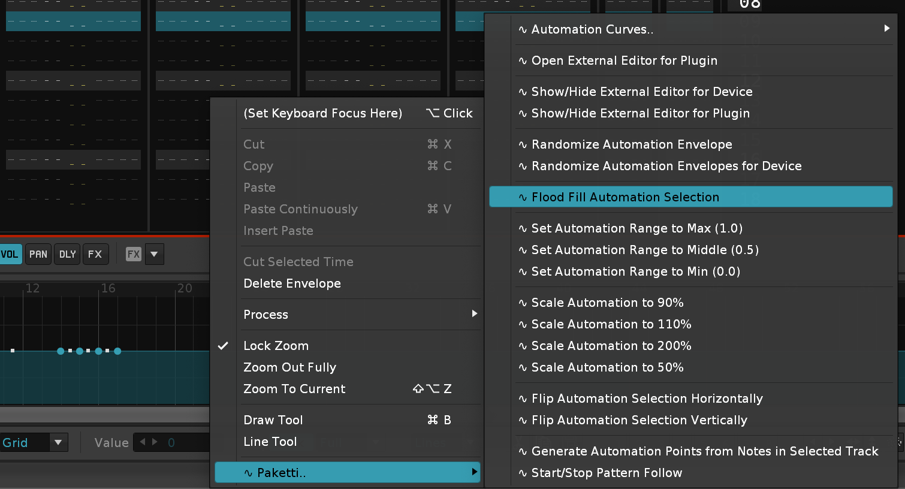
and the other in **Main Menu -> Tools -> Paketti.. -> Automation.. -> Flood Fill Automation Selection**.

### Write Automation Value 0.0-1.0
The Shortcuts for `Write Automation Value 0.0` to `Write Automation Value 1.0` will output the Automation Value to the selected Automation Parameter.

*Note: If there is no Automation Envelope created for the Selected Automation Parameter, an Automation Envelope will be automatically created.* 

### ALT-D Selection with Automation Frame Open
The Shortcut `Impulse Tracker ALT-D Double Select w/ Automation` takes the original ALT-D Double Select feature from Scream Tracker 3 and Impulse Tracker 2 and adds additional logic into the mix.

Meaning, if you have the Automation Frame displaying, the same Shortcut will also select the same rows in the Automation Frame. 

An example of usage:

### Automation Across Multiple Patterns Using Pattern Matrix

Menu Entries in the **Pattern Matrix** for creating Automation curves that start from the first selected Pattern and travel to the last selected Pattern for the Selected Track. 
- Linear Up/Down
- Exponential Up/Down
- Linear Center->Top
- Linear Top->Center
- Linear Center->Bottom
- Linear Bottom->Center
- Exponential Center->Top
- Exponential Top->Center
- Exponential Center->Bottom
- Exponential Bottom->Center

The Pattern Matrix Menu looks like this:

### Flip Automation Horizontally & Vertically
The Shortcuts / MIDI Mappings for `Flip Automation Selection Horizontally` and `Flip Automation Selection Vertically` will do the same thing as `Flip` & `Mirror` buttons in the Automation Frame, but these Renoise-native features do not have MIDI Mappings available.

### MIDI Automation Curve Draw Selection
This MIDI Mapping will read the Selection on your Selected Automation Parameter, and change the Automation Curve. With a regular Automation Envelope, this will cycle through 
- Full Bottom
- Line Up
- Exponential Up
- Full Top
- Line Down
- Exponential Down

An example of usage:

If you have selected a Panning, PitchBend or similar (get in touch if you want more configurations), these will cycle through the following:

An example of usage:

### Select Automation Playmode
The Shortcuts / MIDI Mappings for `Select Automation Playmode (Next)/(Previous)` and `01 Points`,  `02 Lines`,  `03 Curves` let you set the Selected Automation Parameter's Playmode states. 

### Set Automation Range to Max, Middle, Min
The Shortcuts and Midi Mappings for `Set Automation Range to Max (1.0)`, `Set Automation Range to Middle (0.5)` and `Set Automation Range to Min (0.0)` output to the currently selected Automation Parameter's currently selected row.

### Switch to Automation & Cycle through Automation Envelopes
The Shortcut / Midi Mapping `Switch to Automation Dynamic` is a multi-function feature.

If you're not in the Automation Frame, it will display the Automation Frame. (Hence the "Switch to Automation" part of the name).

If you are already on the Automation Frame, pressing the same shortcut or midi button again, will result in you cycling through the parameters that have Automation Envelopes on them.

An example of usage:

### Selected Device Automation Parameter 001...128

These 128 MIDI Mappings will directly write to the Automation Parameter of the Selected Device. This will happen without the Automation Frame switching to showing the Parameter, so, if you know which Selected Device Parameter you wish to control, just map them and fire away.

### Automation Selection Start & End with MIDI
The following MIDI Mappings will let you use two knobs to set the Selection Start and Selection End of the currently selected Automation Envelope.

An example of usage:

### Automation Value Dialog
The Shortcut/Midi Mapping `Show Automation Value Dialog...` will open up a simple and small Dialog that lets you write an Automation Value to the currently selected Automation Line.

As you can see from the Dialog screenshot below, the textfield is autoselected. After opening the Dialog, you can simply input a value between 0.0 and 1.0, press enter, and the Dialog closes and the value is input.

An example of usage:

There is also an additional feature, the EditStep follow, which lets you get jumped to the next EditStep value after you press Enter in the Value textfield.

An example of usage:

With the EditStep set, the Dialog never closes.

### Record Automation to Selected Parameter
This MIDI Mapping will let you record Automation nodes to the Selected Automation Parameter.

This will only record content to the Selected Parameter, if Edit Mode is on. Then it records to the whole selection. If you have a selection, it will change the value of the whole selection. 

If you have **Follow Pattern** on, then it will record to changes to the playhead.

An example of usage:

### Generate Automation Points from Notes in Selected Track
The Shortcut/MidiMapping `Generate Automation Points from Notes in Selected Track` will output Automation Points to the selected Automation Parameter based on the notes you have in the Pattern Editor.

This same feature is also available from the Automation Menu:

An example of usage:

### Automation Selected Parameter Randomization
The Shortcut/Midi Mapping `Randomize Automation Envelope` will take your currently selected Automation Parameter and Randomize it, or, if there is a selection, only Randomize the selection. 

This same feature is also available from the Automation Menu:

An example of usage:

### Automation Selected Device Randomize (All Parameters)

The Shortcut/Midi Mapping `Randomize Automation Envelopes for Device` will insert Randomization to each and every parameter of the Selected Device.

This will create a new Envelope per each Parameter, or overwrite the pre-existing one.

This same feature is also available from the Automation Menu:

### Automation Selection Flip & Mirror
TODO

---
### Wipe Automation from Current Track in Current Pattern, all Tracks in Current Pattern, Current Track in whole Song and All Tracks in whole Song
TODO

---

## MIDI

### 8 Macro Knobs for controlling Paketti Instrument Macros

I think one of the most consistent points of pleasure that Paketti can provide for those with MIDI controllers is this:
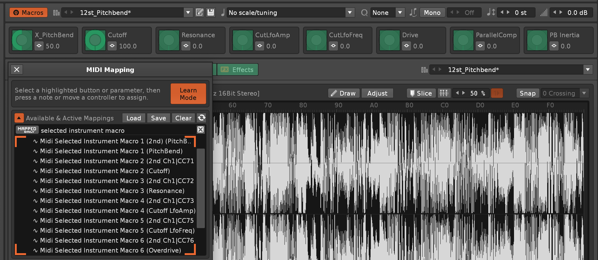
What you're seeing are 8 pre-configured macro knobs. And two versions of the macro knobs for controlling the Selected Instrument settings.
This means that after you're done configuring Macro2: Cutoff, Macro3: Resonance, Macro4: Cutoff LfoAmp, Macro5: Cutoff LfoFreq, Macro6: Drive, Macro7: ParallelComp Macro8: Pitchbend Inertia -- every time you're on any single Paketti Instrument, your 8 knob midicontroller will let you control these settings. 

So, basically, set and forget. 

Set Cutoff + Resonance, and any instrument you're on, your two knobs will change the Cutoff and the Resonance. Or any of those others.

This is what Paketti is all about, workflow improvements that "make sense (tm)" and improve the quality of life.

Also, every Paketti instrument comes in pre-baked with Pitchbend support - so you don't have to set it up yourself. Just load a sample using Paketti (or Clean Render, or Unison Generate, or eSpeak generate, or yt-dlp download, or .RX2 / .REX / .PTI / .IFF / .SF2 import), and you're already ready to control that specific instrument's macro knobs.

## Pattern Editor

## Mixer

## Pattern Matrix

## Pattern Sequencer

## Disk Browser

## Instrument Box

## Sample Editor

## Sample Mappings

## Sample Navigator

## Dialogs

## Global View Presets

Since there are limitations to what the Global View Presets can do - I've opted for creating 8 slots for Dynamic Views. These can be triggered with user-defined shortcuts, and they fully control what is visible or not-visible. Here are the four that I use - note well: you could have a single shortcut that runs through all 8 cycles of the one slot, meaning, it could be anything - going to anything. A single shortcut that jumps from Pattern Editor to Phrase Editor to Mixer to Sample Editor, with all the other frames and information either displayed or not displayed.
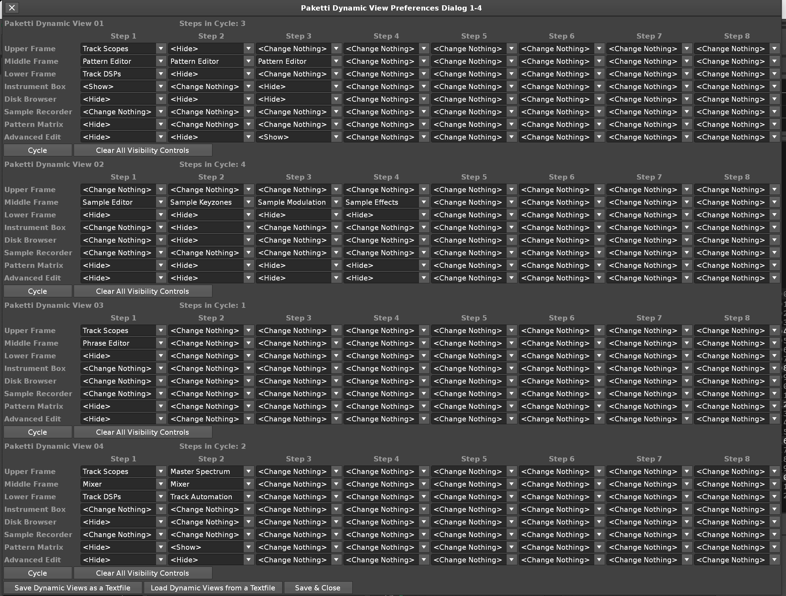

## Sample Recorder

# SampleManagement

Paketti tries to circumvent some of the most painful points of Renoise, and replace them with better, easier, faster, more user-friendly solutions. Quality-of-Life & Workflow improvements over "multiple mouse clicks".

### Loading Samples

One of them is the complete dismissal of the Disk Browser. You don't need to use it to load samples or save samples. In fact, I would encourage you to never use it for loading or saving samples - just use the Paketti solutions.

The Windows Explorer and macOS Finder are far more robust and stronger solutions than the Renoise Disk Browser. When you trigger the following shortcuts or menu entries or midimappings, the Windows Explorer, or the macOS Finder will be opened - allowing you to select multiple samples from multiple folders, access the sidebar/favorites you have set yourself, and, just, be faster than the Disk Browser.

For that, you just use the `Paketti PitchBend Multiple Sample Loader` & `Paketti PitchBend Drumkit Loader` shortcuts. These will load a sample (or multiple samples), and immediately initialize it with:
- 8 Macros (PitchBend, Cutoff, Resonance, Cutoff LFO Frequency, Cutoff LFO Amp (4+5 are used for autofilter like features), OverDrive, Parallel Compression, PitchBend Glide/Inertia) (set it to max, and your regular midicontroller pitchbend input will be very slow, set it to minimum, pitchbending will be immediate). For these, there's a Default XRNI instrument being used, which comes with Paketti. you can of course replace it with a completely different XRNI - which will then get it's sample overwritten on every load.
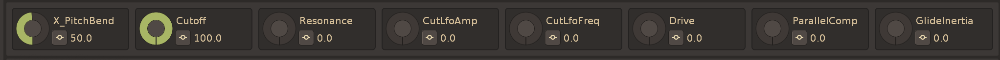

- Paketti Preferences "Paketti Loader" preferences, such as using your preferred loopmode, autofade, autoseek, oneshot, interpolation, New Note Action, selected FilterType. 
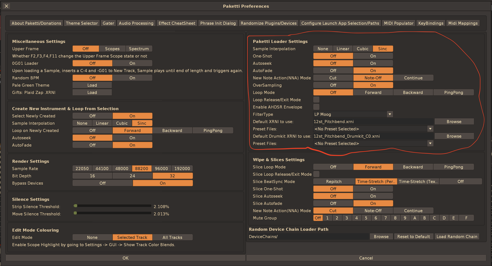

If you pay close attention, you'll also see a checkbox for setting the AHDSR Envelope. Yes, the Default .XRNI Instrument of Paketti also comes in with some Sample FX Chain settings. There's a:

### Sample FX devices
- Deactivated Mono device
- Deactivated DC Offset device
#### Modulation devices
- Volume AHDSR
- Volume Stepper
- Volume LFO
- Pitch Stepper
- Panning Stepper
- Panning LFO
- Cutoff Stepper
- Resonance Stepper
- Drive Stepper

Some examples below:
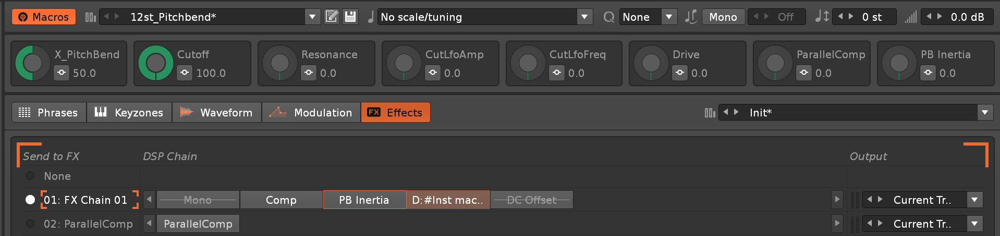

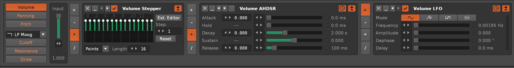
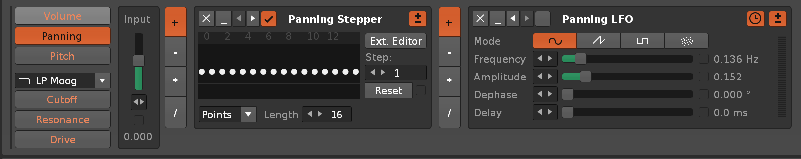
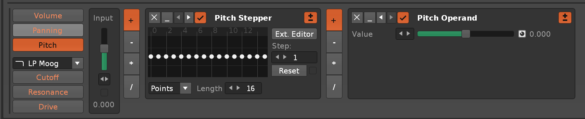
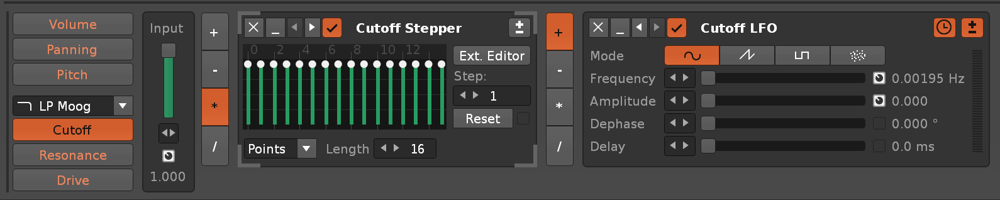
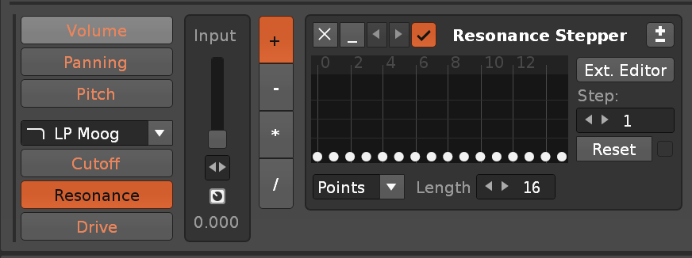
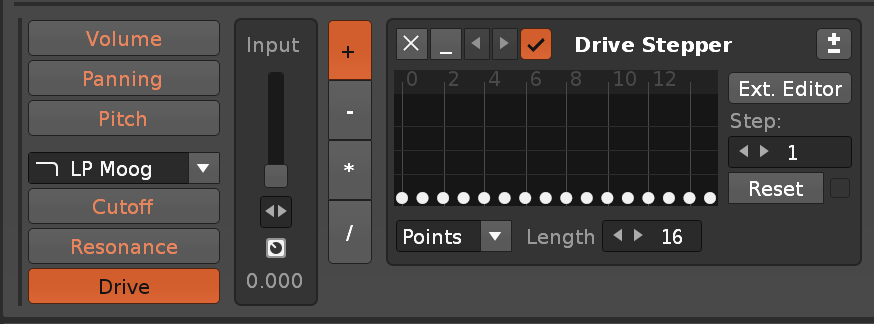

I have created a Stepper switching dialog that lets you visit the stepper of your choice and draw the steps you wish. Here's an example:

There are also other shortcuts for directly sending PitchStepper settings to the selected instrument:
The other shortcuts do these:
- Octave Up & Octave Down

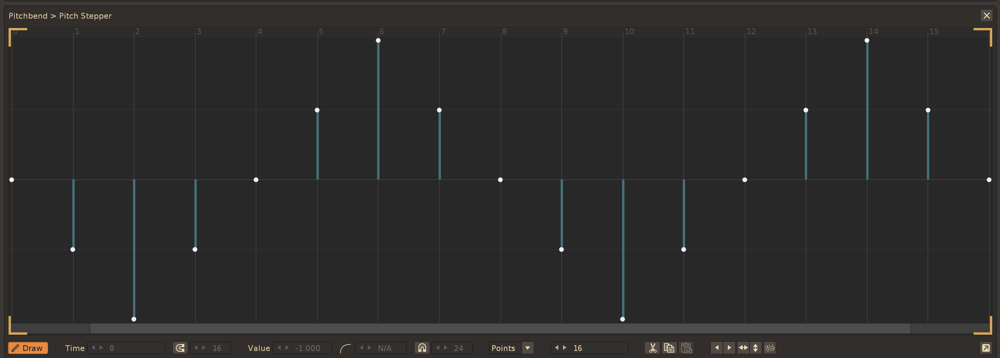

- Octave Up twice & Octave Down twice (changing the minimum & maximum pitch to 24st)

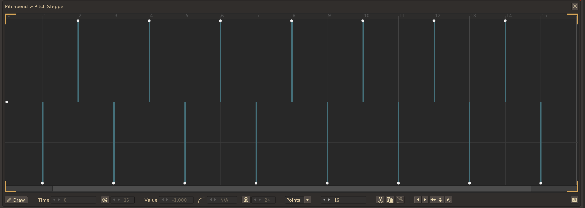
- Randomize PitchSteps

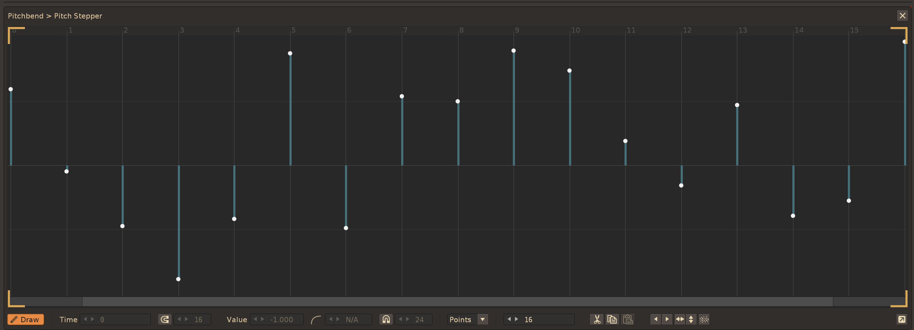

The `*Instr. Macros` device which is also added to the track you are on, allows you to directly start automating the Macro parameters. 

Meaning, you would load a sample using Paketti, input a few notes to the pattern editor, and immediately be able to start drawing automation for any of the 8 macro controls. So you could for instance put in a drumloop, and start drawing a cutoff automation curve directly to modulate the cutoff parameter.

The 8 Macros are also available as a Midi Mapping like this:
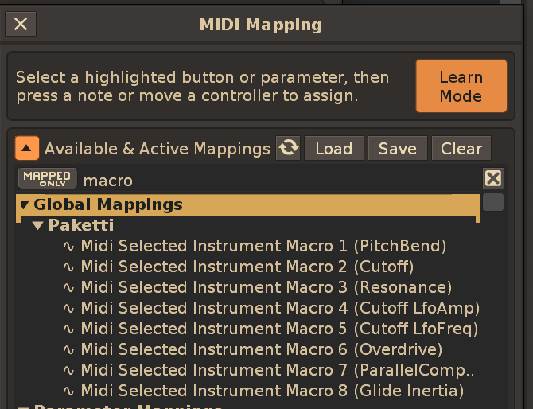

The reason for adding these, is, so, that when you are on any instrument with the Paketti Default XRNI Instrument (or any instrument with any of the 8 Macros set up), the same 8 Midi knobs on your controller will control those 8 settings. So you can rest your hands on the knobs, select a different instrument, and keep crafting. These also, of course, apply to the DrumKit Loader - which we'll cover next.

The DrumKit loader loads a max of 120 samples into the instrument. Select more? Only loads 120 samples. The drums are mapped automatically from C0 to B9.

### Saving Samples

There are Midi Mappings, Keyboard Shortcuts and Menu Entries for `Save Selected Sample .WAV` & `Save Selected Sample .FLAC`. There's also `Save Selected Sample Range .WAV` & `Save Selected Sample Range .FLAC`. The Sample Range saving is from Fast Tracker 2.

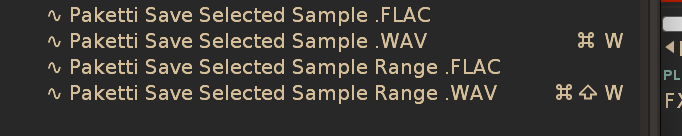

There's also a method for saving all Samples to a Backup Folder - which are user configurable - meaning, you can have 3 different Backup Folders, and thus three different shortcuts for saving either Selected Sample, or all Samples to the Backup Folder.

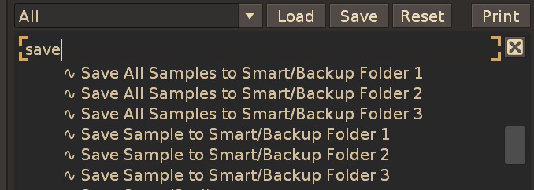

The dialog where you get to select the Backup Folders is the "Launch App Selection Dialog", pictured below:

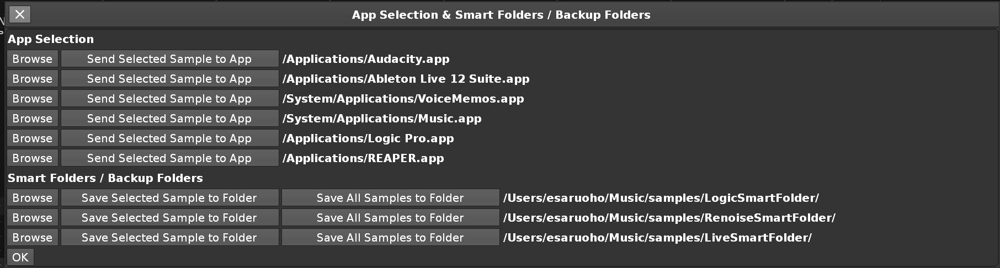

### Sending Samples to other apps

If you carefully look at the same dialog:

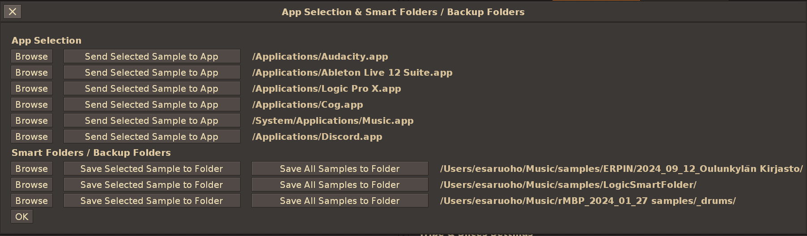
You'll see there is also a way of sending a selected sample to a specific app! This means, you can set your preferred programs, and Renoise / Paketti will save the selected sample to a temporary folder, and start the app and load the sample. 

***Note well, Bitwig developers: Your app does not support sending files to it via `bitwig.app file.wav`. Please fix.***

### Wipe & Slice

Those who like BeatSlicing, there's a mathematical slicer - which takes your loop, and, depending on which shortcut you pick, slices it in half (two slices), or 4 slices.. to max 128 slices. meaning if your loop already loops well, you can just split it into 16-32-64 slices and start drumming away at the loop.

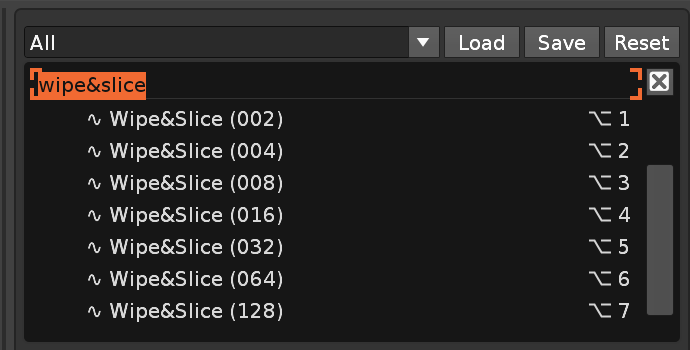

There are additional configuration steps in the Paketti Preferences dialog:
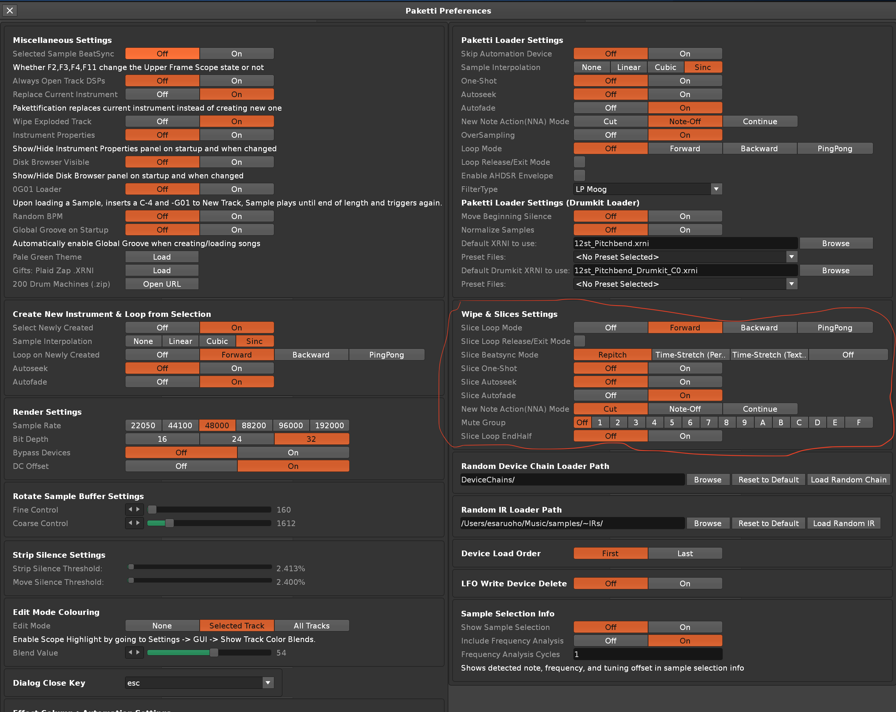

The BeatSync Mode can be set, also, and if, for instance, you set a 256 BeatSync Line setting for the sample, and chop it in 16 pieces, then each Slice will play at 16 BeatSync - maintaining the pitch and speed that you would expect. All this is taken care of behing the scenes.

### MPC-like Slice start + end alteration with Shortcuts / MidiMappings

But Slices aren't always precise. So there are methods for adjusting the Start and Endpoint of the Slices, much like MPC does it. This means that you don't need to keep viewing the original sample, zooming in, adjusting the Start/Endpoints, zooming out, moving a bit, and then doing the same thing like an automaton. Just look at the Slice, and change where it starts and ends.

Here are the shortcuts - and examples of how it could be done.

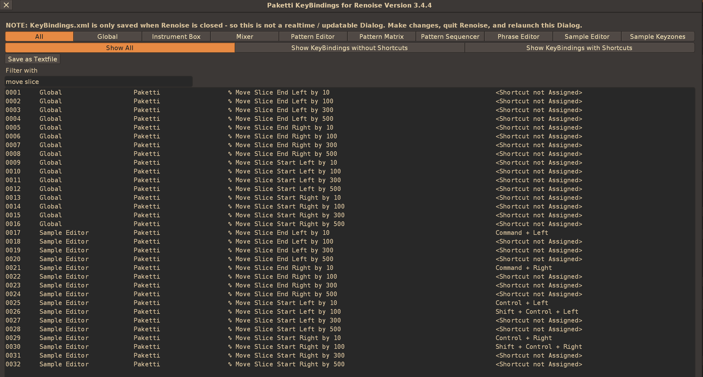
And here's a little .gif of what it looks like:

### Isolate Slices

While we're on the Slice topic, there's also `Isolate Slices to New Instruments`, which takes all the Slices in your Instrument, and creates new Instruments below it. And if you were on, say the Slice that was a Snare - isolate slices, you'll still be on the Snare.

Of course, the Paketti Default .XRNI instrument is introduced for each slice.

You can also `Isolate Selected Sample to a New Instrument` - which takes the selected Sample or Slice, and creates a new Instrument, with the Paketti Default .XRNI Instrument introduced.

There's also `Isolate Samples / Slices to New Instruments` - which takes the selected Instrument, and gets the Samples & Slices to brand new Instruments, with the Paketti Default .XRNI Instrument injected.

## Plugin / Device Management
### Loading Devices and Plugins

Another step in the abandoning / circumventing of Native Renoise loading methods, is the doing away with the usage of the Track DSP Device Loading.

Instead, Paketti introduces Keyboard Shortcuts, MidiMappings for loading your preferred VST,VST3,AU,LADSPA,DSSI,Native devices to both Track DSP Chains and Sample FX Chains. 

There are also Menu Entries for loading your Native devices (including the Hidden / Legacy effects), if you're mouse inclined.

By going to **Tools -> Paketti.. -> Plugins/Devices.. -> Load Devices Dialog...** and ticking your favorites, clicking on the `Add Device(s) as Shortcut(s) & MidiMappings` button will result in, from now on, the selected devices being available in Keybinds and MidiMappings. Set them up, and away you go!

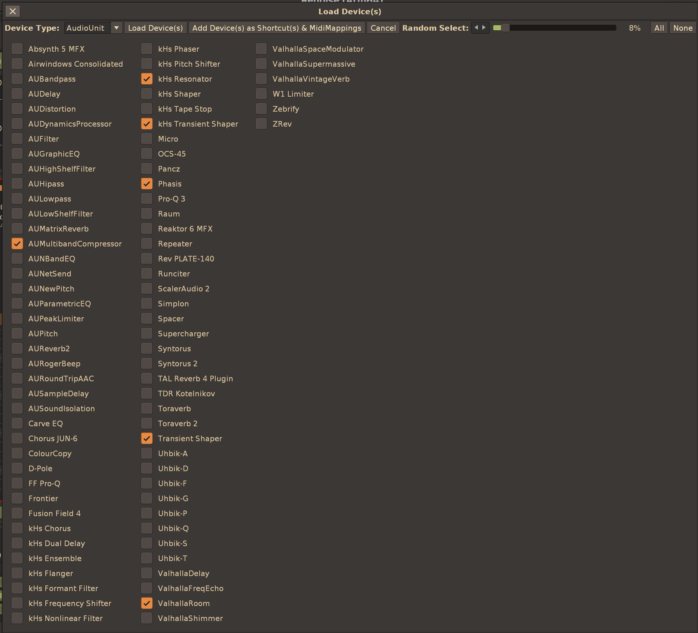

This means that you can, for instance, (in my usecase) press `shift-q e r t z a v`  and out come 7 devices to the selected track. Same with midibuttons, after selecting your favorites, you can use the midi mappings to set up midi controls for loading your desired device onto your selected track. Trust me, it's fast, fluid and just feels natural. Set them like you want to, and throw in your devices.

There are some additional details, such as: the external Devices are loaded in minimized mode, so they don't take up extra space. The Renoise Native devices are not loaded in minimized mode, because the parameters are displayed there.

And the more important detail: the External Editor is automatically opened!

The same thing exists for loading Plugins, go to **Tools -> Paketti.. -> Plugins/Devices.. -> Load Plugins Dialog...**

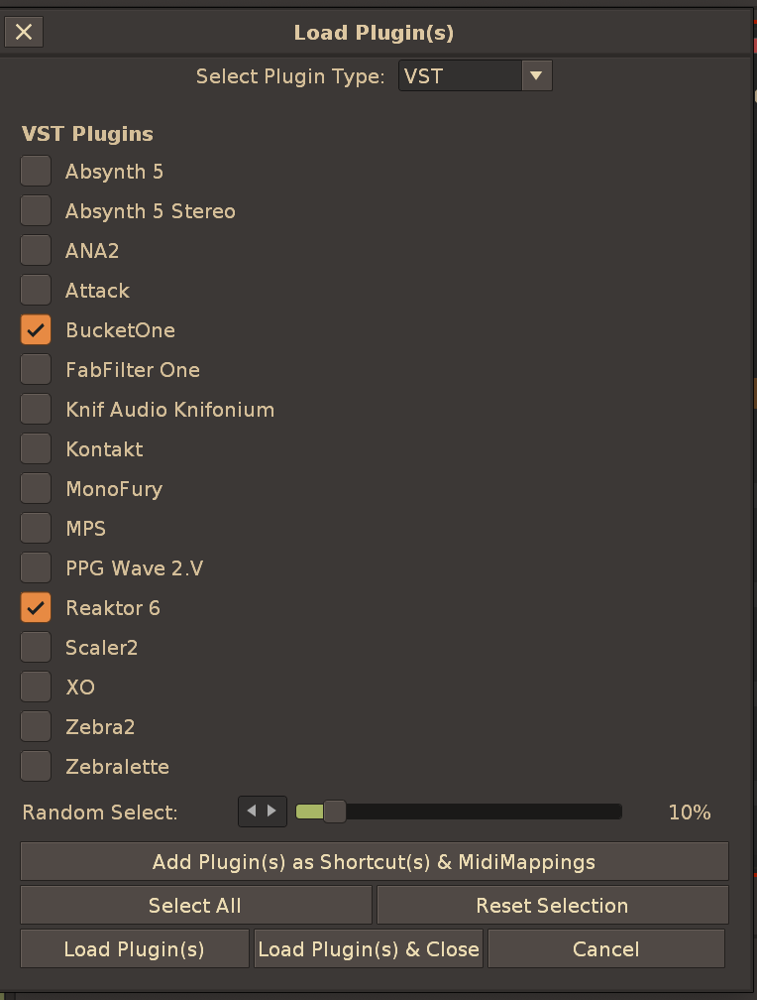

Same logic. Pick the ones you want, add them to the Paketti Preferences - they'll always be there.

The extra logic with Plugins, is, that it wouldn't make much sense if they overwrote the current instrument - so, a new instrument slot is added, every time you load a plugin. And the External Editor is made visible. So you can just start tweaking away.

# RewriteSoon

### Freeze & Flatten a.k.a. Clean Render Selected Track or Group.

there's a Clean Render Selected Track / Group. this will solo the selected track, render it as a wavefile, create a new track (named with a matching title such as "Bass (Rendered)" (if your original track was called Bass, input C-4 to the newly created track, ingest the 8 macros to it, mute the original track, collapse the original track, and if you select it, also bypass the effects in the original track. and it's ready to be automated, by default, too. if you have a line input device on the track, instead of "Highest" diskwriting speed it will switch to "Realtime" - meaning, if you have incoming audio being processed through renoise effects, that incoming audio will be recorded to the new instrument, with the effects. perfect for external synthesizers being controlled by midi, for instance.

### Improved Automation drawing, including multi-pattern automation.

since the renoise automation drawing is quite limited, i've added midi shortcuts and menu entries for drawing curves up/down (exponential, linear), and also added logic that if you're trying to do an "exponential to max" curve on a pitchbend/panning automation lane, it will be drawn from the center to the top, instead of from the bottom to the top.
there's also multipattern automation drawing, meaning, you make a selection from pattern matrix and it will draw an exponential curve or linear curve from patternStart to patternEnd.

there's also midimappings for automation start and automation end, and a third midimapping knob for deciding which automation curve is drawn and from where to where. so you can pick an automation area, and use a knob to decide what the curve would look like.

i've also introduced a "Draw Automation to Selected Automation Parameter". this means, you're in ANY automation lane whatsoever, have playback on, set record on, set follow pattern on, and turn the knob == result == you are drawing automation to that lane. you don't need to map the midi anywhere in the track device or anywhere, just map it once to the "automate selected parameter" and just select any parameter and just draw in. it also works with selections, meaning, you select a section and draw with the knob, and it writes to the section (this with follow pattern off, of course).

<iframe src="https://www.loom.com/embed/5b46a1dd7d5e4d82b87ff145fc38c3cb?sid=7383c8f2-6daf-44ea-a9f2-305d602f5a21" loading="lazy" frameborder="0" webkitallowfullscreen mozallowfullscreen allowfullscreen style="position: absolute; top: 0; left: 0; width: 100%; height: 100%;"></iframe>

### Paketti Theme Selector
This dialog comes in pre-populated with 518 themes, and you can pick your favorite themes out of the mix, and have Renoise randomize through the favorites (or all themes). So every time you boot up Renoise or load a new song, a different theme will load. Great for discovering new themes.

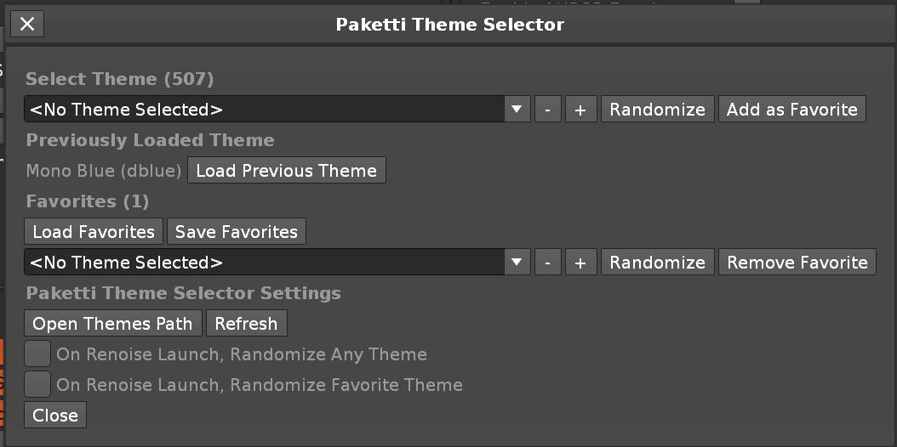

### Paketti Gater
This allows directly writing in looping volume, retrig, backwardsplayback and panning gates. E
Each of these rows have their own steps, min 1 max 16. so if you have a 512 row pattern and use a 16 row volume gater, then it'll keep looping till the end of the 512 row patterns. or if you have a 3 row panning step, those 3 steps will repeat until the end of the pattern, and so on. these are also designed to type directly to the pattern editor, either for volume control of sample, or volume control of the mixer channel.

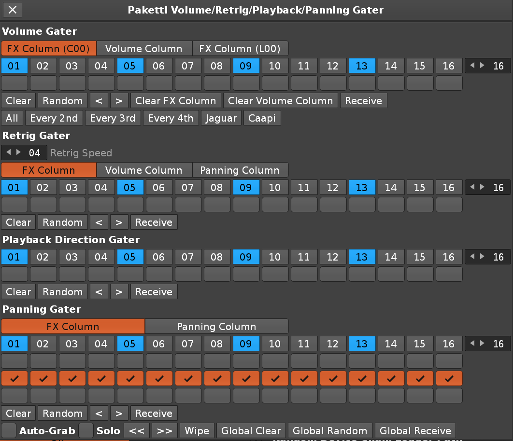

Example:

### Paketti Groovebox 8120

There's a 8 part 16 step stepsequencer which writes directly to the Pattern Editor. You can load 120 samples into each part, pick your preferred sound, and use checkboxes to make them play. Probability checkboxes to modify how likely the step per part is to play, can draw automation directly by clicking on Automation (leveraging the 8 macros introduced on every Sample Load) and use buttons to randomize step sequencer content, select a random sample for all parts, or selecting random samples for each part, reverse any part or all part samples.. and you can limit the steps from 16 to 1 at will. Or increase steps till 512 - meaning, 16 steps will play, and x amount of silence until 16 steps play again.

a brief demo at **SO HEY TWITCH DELETES STREAMS SO ITS GONE** // TODO I need to make a new one.
Here's an updated screenshot:

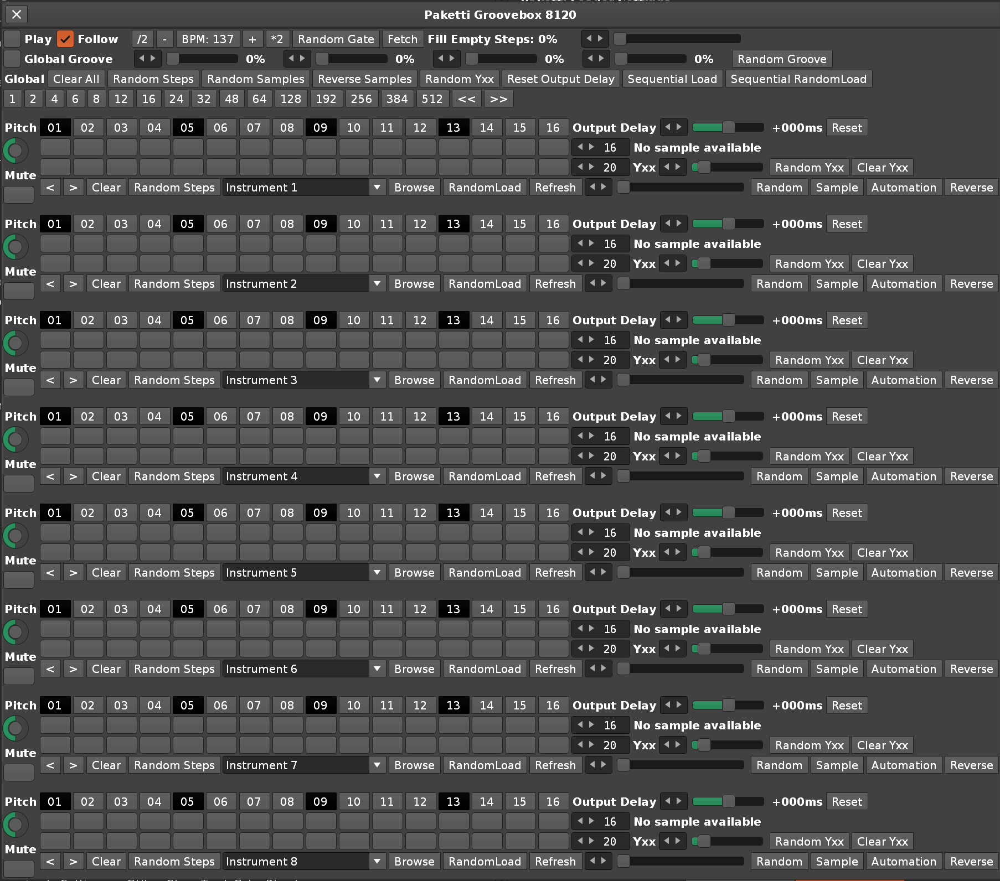

There's dozens of ImpulseTracker/ScreamTracker3 shortcuts for pattern editing and modification, some of which have been recently supercharged to also allow for selecting automation, gif here meaning when you select something using paketti shortcuts, it will also select the automation, if automation is visible. this can be combined with the midiknobs for drawing automation curves easily.

### Dynamic Views for cycling through with shortcuts.

The Dynamic Views let you have a max of 8 shortcuts which cycle through the view settings that you have picked. each of the 8 shortcuts can have max 8 different cycles. 

so you have maximum control over "view presets" but they're much more powerful than the 8 that renoise allows you to have, because they remember their state. You could, for instance, cycle, with one shortcut, from Pattern Editor to Sample Editor + show Sample Recorder, then press the same shortcut to hit Mixer, show Disk Browser + Pattern Matrix + Instrument Box, then again to only show Pattern Editor and Automation.

### MIDI Populator

there's a method of creating 16 new tracks with 16 midi input channels and 16 midi output channels and 16 plugin devices, automatic send generation and line input generation, for those who want to use renoise with an external sequencer with a multi-out soundcard, or those who want to use renoise as a sequencer for external synthesizers and want to map the midioutput channels themselves. all of the generated samples will have midi control devices set up directly, and automation ready to go.

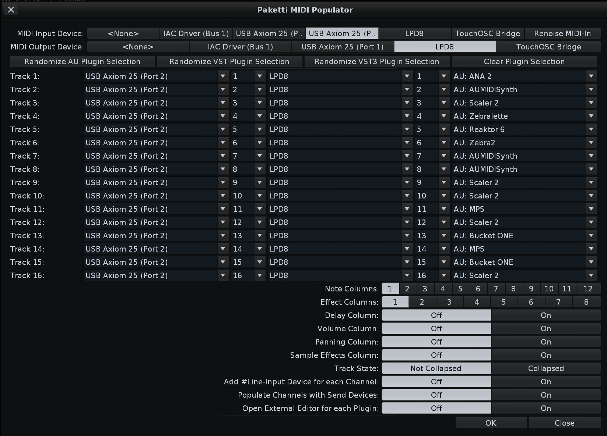
### Default Phrase Settings
This allows you to set your Phrase Preferences - i.e., when you use the Paketti -specific shortcut for creating or modifying current Phrase, the settings will be added.

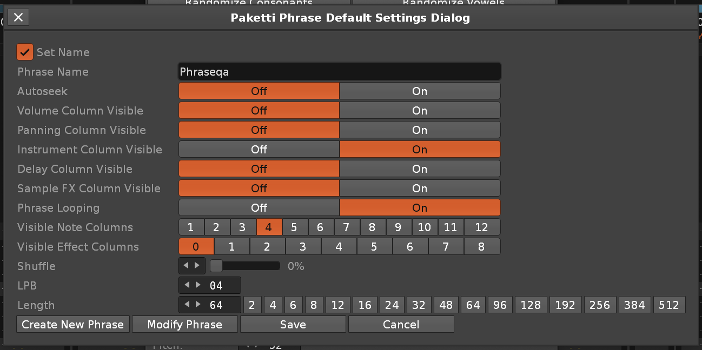
### eSpeak Text-to-Speech speechsynthesizer

This uses `espeak-ng` for creating spoken word samples using text-to-speech synthesis.
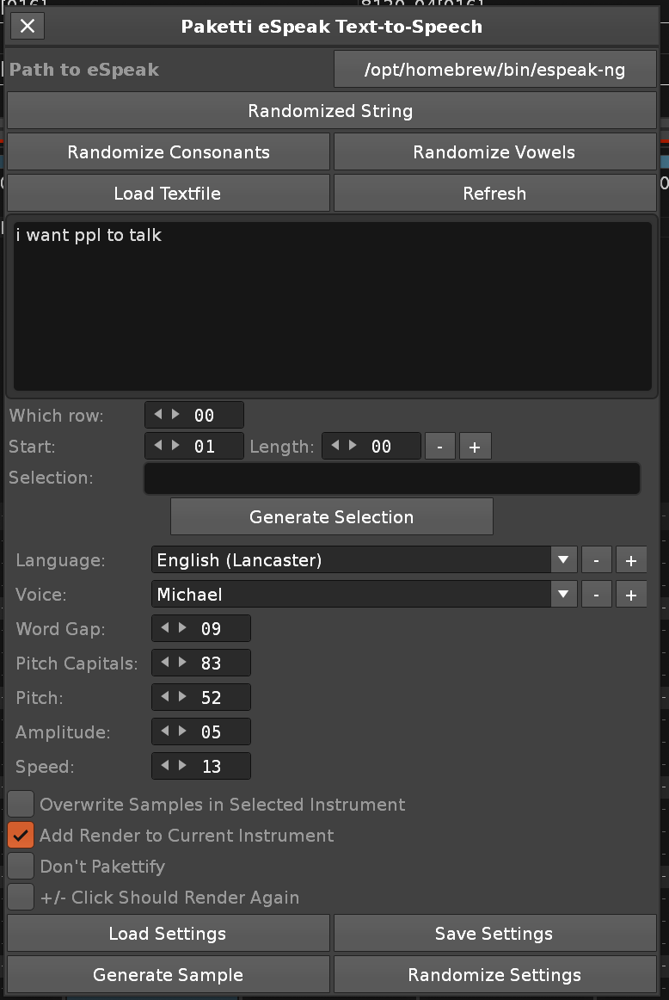

there's randomizers for parameters of selected device, a mono-device which can be added or toggled on/off from the channel for quickly monoing

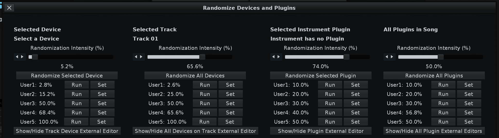

the same shortcut + midimapping loader for devices, is also available for plugins, so vst,vst3,audiounit,ladspa,dssi softsynths can be shot to the instrument box with shortcuts + midimappings

there's an inverter device which inverts the audio - using the Gainer device. This can be added to both the Sample FX Chain and the Track DSP Chains.

The send and multiband send shortcuts load the native devices "correctly" aka "Keep Source and volume at zero" as opposed to "mute source and volume at max".. 
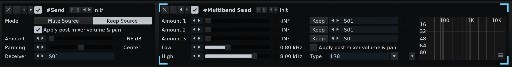

## Automation
I have written midimappings for directly inputting automation points to the currently selected automation parameter 
And also a shortcut for opening a dialog for writing automation points to exactly which pattern row you are on
And also randomize selected automation parameter
And randomize all automation parameters of selected device
And multipattern automation curve drawing
And midimapping for select start and end of automation and also mapping for changing selection curve up down exp Linear etc
And also flood fill of selection in automation parameter to end of pattern
And a shortcut for cycling through all automation parameters that have been defined by user (written to)

### 0G01 Loader

This uses the `G01` (Glide to note) trick to allow for playing really long samples, even if the pattern would be shorter than the length of the sample. The sample will play until the end, and then replay again at the start of the next replay. This means you can have a 4 second drumloop but play 20 minutes of pads on top of it.

there's a midimapping + shortcut that 1) shows sample recorder 2) starts recording 3) press the shortcut again, it stops the recording, throws in the 8 macros
so you can quickly start recording anything by just pressing the shortcut or holding down a midi button, let go of the midibutton, sampling stops

there's a pattern cheatsheet which lets you input pattern commands to either selected row or selection in pattern:

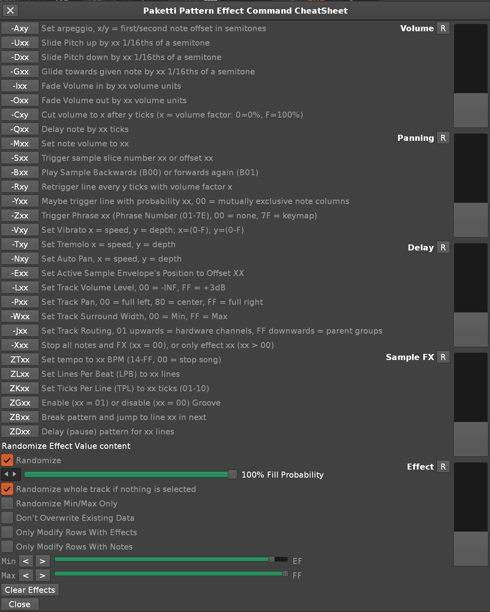

there's shortcuts + midimappings for inputting volume, panning, delay, samplefx effect commands and effect parameters to the selection in pattern

there's "flood fill by editstep" shortcuts which let you take what's under your cursor and repeat it every 6th row or 8th row etc, or every row.

there's a replicate at cursor shortcut, which enables this kind of stuff:

<iframe src="https://www.loom.com/embed/a437d74618934e9db634ceb41b1c5b9a?sid=10a1da7b-de26-4b44-87b0-dcc735ba62c9" loading="lazy" frameborder="0" webkitallowfullscreen mozallowfullscreen allowfullscreen style="position: absolute; top: 0; left: 0; width: 100%; height: 100%;"></iframe>

https://www.loom.com/share/a437d74618934e9db634ceb41b1c5b9a?sid=ead6a274-1a6a-4ea1-a068-344fed4aef23

there's a "Set Repeater Value" Knob midimapping which will either 1) add Repeater and activate it 2) detect Repeater exists and modify the parameters, allowing for stuff like this:

<iframe src="https://www.loom.com/embed/f4f94d05045a4df49896d52202d3adf7?sid=e3999014-729a-4653-a962-ee8bfa45862d" loading="lazy" frameborder="0" webkitallowfullscreen mozallowfullscreen allowfullscreen style="position: absolute; top: 0; left: 0; width: 100%; height: 100%;"></iframe>

https://www.loom.com/share/f4f94d05045a4df49896d52202d3adf7?sid=9c7c6c79-005d-48f4-ba21-ac06475b5bfc

there's shortcuts for changing pattern length to 4, 8, 16, 24, 32, 48, 64, 96, 128, 256, 512 - methods for duplicating content with 1-256 row patterns to double it, then `LPB*2` diskwriting aka rendering a new sample, but making a clone of the pattern and setting it's LPB to current LPB, then the clone of the pattern has LPB times two, and the audio playing there.  there's seamless rendering, aka if you have anything below 257 rows of pattern, it will duplicate it, render it, select the beginning 256 rows (so you can delete them if you like) and add a loop to the other 256 rows so you can have a reliably looping (mostly) long pad with tail mixed in..  mono to stereo converters for sample data (mono to left, right blank, mono to right, left blank, mono to stereo with both).. there's a yt-dlp downloader that downloads the full audio from a youtube video, instagram, facebook, twitter posts, and it already has the macros loaded in.. and there's multiple missing shortcuts for sample pitch finetune panning loop etc controls, same for midi.. i could go on. i've done max 4 hour demos of going through all the features, normally around 45minutes to 1,5hours depending on what i remember to show

there's "Duplicate Instrument and Reverse" - which both makes a copy of the currently selected instrument, and then reverses the sample, and selects the sample.
Duplicate Track and Instrument - will take the notes that are there in the current track. + track dsps, and make a new track, select the track, and duplicate the instrument. and if you have a plugin open in the original instrument, and duplicate the instrument with this script, then it closes the plugin external editor, and duplicates the instrument, jumps to the newly created track, and opens the plugin's external editor for it.
there's a dialog that lets you randomize a selected device, or all devices in a selected track, or selected plugin, or all selected plugins,  -- there's 5 different flavors of all four of those, with percentages you can set for them.
there's a "duplicate track with selected instrument", meaning you can keep copying the note content, but it'll be branded with your current instrument, instead of it being a duplicated instrument.

the randomize with percentage was from ModPlugTracker. there's also a bunch of features from PlayerPro, such as this note inputting dialog, which lets you input notes, with editstep, to selection, or current row, meaning you can do stuff like this. there's also a method of hovering the mouse to write effect columns to the selection in pattern..
i've also replicated the OctaMED Pick/Put Note technique, which lets you pick any note column + effect column content, and put it down. think of it like macros for note column + effect column content.  you can do them with shortcuts (both picking up and putting down) but also with midi. so you could for instance have chords grabbed and keep slamming them down - there's also controls for printing the information with a specific instrument.

one thing i keep forgetting is the Launch App Selection. you can define 6 apps, and when you run the shortcut, or menu entry, or click on "Send selected sample" in the dialog, it saves a temporary file and loads it in the app. such as audacity, apple music, ableton live (straight to session view). there's also a backup folder (3 places) where it saves to one of the three places depending on the shortcut

I've also built two dialogs for showing keybindings - with fuzzy search. one shows Paketti shortcuts only, the other shows all Renoise KeyBindings but can be filtered with tools or without tools, etc.

then there's tiny audio tools such as "strip silence", "move beginning silence to the end".. shortcuts for invert left channel, invert right channel (or invert both channels). audio rotators, so moving the beginning to the left until it crosses over to the end, i.e. "nudge audio left / right", then there's rotation for moving the audio waveform up and down for extreme dcoffset and clippy distortion. then there's a DC Offset kick generator,  "Selection in pattern to group" (turn selected tracks into one group)..

midimappings for toggling effects on and off. midimappings + shortcuts for displaying the external editor on Master or selected track, of a specific track. i.e. if you use renoise for mastering and always have certain types of effects on master, you can show/hide that specifically named effect, no matter where it is in the effect chain. and if it's not in the track dsp chain, then it will be loaded and added in.

uncollapse/collapse all tracks for clearing up visual clutter

Convolver IR export and IR import - when you export the selected IR, it opens up in the sample editor, so you can modify it, then import it back in.

Switch Plugin Auto-Suspend On/Off

"Save All Samples to Backup Folder 1...3" - all samples in the song will be saved to your preferred folder

Unison Generator, takes a chipsound and makes 8 identical copies of it, shifts each of them left by 1/8 to 7/8 - modifies the volume, randomizes finetune, randomizes panning, and drops the overall volume (and includes the instrument macros in the copy) - for a nicer chipsound

there's hundreds of Section/Sequence/Selection shortcuts for queueing what plays next, or skipping to the next section or previous section or "what's next in the queue" and wiping the queue

A Global shortcut for Clone Current Sequence

Resize all non-empty patterns to 96 rows..  and Resize all non-empty patterns to `current pattern` rows
**Create Identical Track** - takes the Note Columns / Effect Columns & Visible Columns&copies

For a selection in sample editor, you can press a shortcut to "create new instrument & loop". there's "mute or solo selection in pattern",  expand/shrink selection content shortcuts, set selection to selected instrument.. bypass all effects in track, or enable.. show all parameters of all devices in track

Oblique Strategies Dialog / Loader - it will randomly pick one Oblique Strategy from a list on the status whenever you save or load a song or restart Renoise

Paketti Midi Mappings - it shows some of the Paketti MidiMappings and if you have Midi Mapping "Learn" mode on, you can actually pick them yourself and assign them easily. for better discoverability

Output Routings dialog that shows all the tracks and lets you set the Output Routings in case you have a multi-out soundcard

Shortcuts for setting each track, or the Master, to a specific output routing channel (01-64) for those with multi-out soundcards

Track Renamer - select a bunch of tracks with selection-in-pattern and rename them all in one go, one track at a time

Phrase Doubler / Halver (takes the content of the Phrase and increases the size or decreases the size

Set Phrase Length to 001-004-006-008-012-016-024-032-048-064-096-128-192-256-384-512

Set Pattern LPB 1-256
Set Phrase LPB 1-256

Print current BPM & LPB to Master track of Pattern - so can modify the tempo in another pattern -good for `LPB*2` i.e. increasing resolution

Keep Sequence Sorted True/False/Toggle

15 frame fade in fade out for reducing clicks

Duplicate sample, maximize audio, turn to 16bit, save as wav or flac (in case you want to deliver them or post them somewhere)

Flip Sample - this allows for 1/2 1/4 1/8 1/16 flipping/rotating of a sample, good for beats if you wanna flip it or any other type of sample

Select first half of sample buffer shortcut - and second half too. midimappings for select sample buffer start and end, so you can just use two knobs to select the length and modify

Set loop mode off, forward, pingpong, backwards

Copy note-on sample to note-off at transpose 0, +12, +24, -12, -24 meaning when you hit a note off on a bassnote, the same basenote can play an octave higher or lower - good for octave basses

Jump to first track in next group / jump to first track in previous group

Midimappings for select instrument, select track, keyboard octave, editstep 0-64 and 1-64, double editstep halve editstep, beatsync line control / double beatsync / halve beatsync
8 midimappings for controlling the macros of the current instrument. meaning, you use the 8 midimappings on any track and you can control macro knobs without having to assign them to a specific instrument. i.e. they're "free" / "dynamic" for lack of a better word

Interval generator. shortcuts for adding +1 to +12 to the current note - adds a new note column, moves to it and adds a note that is +x or -x higher/lower than the original basenote. also midimappings for selecting multiple chord intervals - good for experimenting with basenotes and writing intervals in and seeing what happens. couple that with the Paketti Gater and you can go wherever you please really.

Wipe Effects from Selection in Pattern

Shortcuts for showing a specific number of note columns, or effect columns

Expose / hide note columns or effect columns - this replaces the Renoise "add new note column" by actually exposing it AND selecting it. much more intuitive

Direct shortcuts for writing Axx to Zxx effects and their content (+1 -1 +10 -10) to selection or row

Match delay column to current row  (or panning, or volume).. means you have a row you've 

Selected, run the shortcut, every row in the pattern gets the same delay, or panning, or volume setting

Note Interpolation (entering notes from beginning to end of selection so c-1 at 00 and c-5 at 64? every step has an interpolated value based on math

Randomize delay, panning and volume value for selected tracks and their columns

Flood fill with selection - takes your selection and fills the pattern with it in a loop

Shortcuts for setting visible columns (vol,pan,delay,samplefx) for all tracks globally
clear/delete track dsp effects from current track

BPM increase +0.1 -0.1 +0.5 -0.5 +1 -1 +5 -5 

Bypass all devices on all tracks

Bypass all devices on selected track

Set master output volume in dB to -INF or 0 or -0.1 +0.1 -1 +1 for better control

Midi mappings for setting global groove control 1,2,3,4

Midi Mappings for setting Global Groove 2 & 4 (downbeat?)

Multi-combos like "shortcut for toggling play, record, follow pattern, metronome on/off" or "toggle play,record,followpattern on/off, or record+followpattern on/off

Hide open track dsp device + sample fx device external editors

Shortcuts + menu entries for adding sample modulation devices (all available for volume, pan, cutoff, resonance, overdrive, pitch) 

Shortcut for adding and opening formula device

Direct shortcut for exposing the pitchstep device external editor, which is included in all Paketti-loaded samples so you can immediately start pitching it up and around for extra randomness

Visual editmode for highlighting which track is selected, for those with aged eyes and who have grown tired of trying to figure out which track they've selected

Volume, panning, delay dialog with 16 sliders - basically another step control for setting specific settings, again 16 steps but can be reduced to 1-16 steps for each, so they can be offset

Shortcuts for starting playback at a specific row (000-512)..

Shortcuts for starting playback at a random line of the pattern, or random 2nd or 4th or 8th row (in order to be able to step across it in a stair/stepped way)

Play current line and step forwards, play current line and step backwards, for those who want to use renoise as a.. musical box?

Shortcuts for selecting a specific track i.e. 1-32, you set the shortcut and it jumps you there

Sample fx group + mod group shortcuts for modifying them, same with mute groups

Show/hide selected track's device 1 to 64, another external editor shower/hider

 A mode to enter where if you're in effect column, it'll jump you to the next row in that track that has a note. so you can enter effects to where the notes are

okay.. just realized i completely neglected to talk about the "Paketti Automation" setup.

This brings Master track automation of Global Groove, LPB (1-32), BPM (20-300), EditStep, Octave, EditMode, Recorder, Pattern Length, Instrument Pitch, Instrument LoopStart, Instrument LoopEnd, and 3 other things that remain to be figured out and configured.

this means you can actually automate when the recording is on or off, when sample is being recorded (!), what the selected instrument pitch ir or selected instrument loopstart+loopend, and there's 3 more additional things that could be automated, if i could just figure out what they are. any ideas?

the reason why there's LPB + BPM control is that the BPM in Renoise Master track automation is 20-999 (!) and LPB is 1-256, so  just a bit too much, i asked around a lot and 20-300 and 1-32 seemed to be the agreed upon, anything more, just let me know (64?). but to maintain automation resolution and "keeping it making sense", for most uses, these artifiical limitations are alright

i think the reason why i forgot to mention this was that i have had a tough time finding anyone to tell me what else could be done. i did experiments of using automation to change lower frame, middle frame, upper frame views, for instance. basically any script can be run like this. but i couldn't get anyone to talk to me about what they wanted and gave up and forgot about it

# Oldabout

Paketti is a multipurpose Renoise tool. Working like an expansion pack, it delivers hundreds of new functionalities to the app, ranging from Quality-of-Life (QoL) improvements to new advanced features inspired by Impulse Tracker, Schism Tracker, ModPlugTracker, Player Pro, John Player/Quantum SoundTracker/PollyTracker, OctaMED and many others. It also addresses multiple community requests from the Renoise Forum that were not yet considered by the developers. 

It is far too complex to sum up in just a few words. However, some notable changes include:

* Over ~~three~~ ~~four~~ five thousand new keybinds covering multiple areas of Renoise;
* Default XRNI functionality - each loaded instrument or drumkit has Pitchbend, Glide Amount, Cutoff, Resonance, Cutoff LFO Amount, Cutoff LFO Frequency, Overdrive, Parallel Compression.
* Automatically load multiple samples into sequential instrument slots;
* Device parameter randomizer;
* Plugin parameter randomizer;
* Change default computer keyboard Velocity with Midi Mapping;
* Change Global Grooves with Midi Mapping;
* Freeze & Flatten Track -> Creates a new Track with content playing. Also Records incoming audio if `#Line-in Device` is in the Selected Track;
* Quick switch autosuspend for Selected Plugin;
* Bypass all devices in Selected Track;
* Floating window to insert plugins or Devices and add them as keybinds and MidiMappings;
* Floating interactable FX column cheat sheet, including sliders to quickly write changes to row or selection in pattern in your pattern;
* Pattern doubler/halver (duplicates the Pattern content, and the automation);
* Color/highlight the selected track in Pattern Editor (with EditMode (Record On/Off);
* Dozens of shortcuts for Pattern AND Phrase editing;
* Impulse Tracker (.it) key commands (`ALT-D *2`, `ALT-L *2`, `ALT-U`, `ALT-F`, `ALT-G`, `ALT-Y`, `Home *2`, `End *2`, `F2 F3 F4 F5 F6 F8 F12`);
* Quickly add Automation curves to pattern automation (fade ins/fade outs (linear or exponential), pitchbend/panning);
* Show/Hide Device parameters as sliders in the Mixer;
* Control Selected Sample loop start/endpoints with MIDI;
* Control Automation start / endSelection via MidiMappings
* Control Sample Buffer start / endSelection via MidiMappings
* And much much more!

# Changeslog

📝 **View the complete changelog**: [CHANGESLOG.html](CHANGESLOG.html)

I've decided to move the full changelog with all the improvements, features and plumbing updates to a separate file, so that it is easier to maintain this fledgling document.
