<link rel="stylesheet" href="dark-mode.css">

| [Patreon Paketti](http://patreon.com/esaruoho) |
 [GitHub Paketti](https://github.com/esaruoho/org.lackluster.Paketti.xrnx/) |
 [Discord Paketti](https://discord.gg/xNT6eH7W) |
 [Gumroad Paketti](http://lackluster.gumroad.com/l/paketti) |
 [Ko-Fi Paketti](http://ko-fi.com/esaruoho) |

 1. [What is Paketti](#what-is-paketti)
 2. [What people say about Paketti](#what-people-say-about-paketti)
 3. [Where to say things about Paketti](#where-to-say-things-about-paketti)
 4. [How to Support](#how-to-support)
 5. [Brickwall](#brickwall)
 6. [Rewrite Soon](#rewrite-soon)
 7. [Roadmap](#roadmap)
 8. [Old About](#old-about)
 9. [Old Indexes](#index)
 10. [Changeslog](#changeslog)

## What is Paketti

Paketti is an add-on to Renoise, scripted with the LUA language. Also sometimes called a XRNX or a Tool. However, Paketti is not a "does one thing" type affair, as it introduces over 4100 shortcuts, hundreds of menu entries and midimappings and close to 40 dialogs.

It touches on the **Pattern Editor**, **Sample Editor**, **Automation**, **Pattern Matrix**, **Mixer**, **Instrument Box**, **Sample FX**, **Sample Modulation**, **Instrument Settings**, **Sample Settings**, **Device & Sample management**, **Theme management**, **Pattern Sequencer**, **Phrase Editor**, **Sample Navigator**, **Midi Controls** / **Midi Mappings**.. And a multitude of other things.

Paketti introduces features from:
- the famed C64 trackers created by Aleksi Eeben, JohnPlayer/PollyTracker/Quantum SoundTracker.
- the legendary OctaMED by Teijo Kinnunen.
- the awesome Impulse Tracker by Jeffrey Lim.
- OpenMPT/MadTracker..
- and..
- PlayerPro - the Mac tracker that [Aphex Twin is famous for using](https://www.youtube.com/watch?v=inUOTPt2mLk).

## What people say about Paketti

- *"It's like it's Renoise+"*
- *"Your extension has so much to it. I was playing around with it the other day and I feel like I need to spend just a day to learn everything I can do with it. It's like Renoise+"*
- *"Your tool is really well thought out - most well thought out Renoise tool I've come across actually. Functions I even didn't think about and it's already inside your tool. Speaking of dedication."*
- *"I was mostly in awe and started immediately imagining new ways to use renoise"*
- *"This is by far the most thought out tool ever. Why is this not natively implemented?"*
- *"every renoise user should know and use paketti, without it renoise is not so fun"*
- *"got to be one of the most (if not the most) organized set of tools ive ever seen for Renoise."*
- *"I found Paketti to be the most versatile and flexible in its development direction. It has made Renoise very useful and enjoyable to use. Thank you."*
- *"You are essentially writing... a completely new framework over the engine."*
- *"I have no doubt that you are the most important person in the various Renoise Tools developers."*
- *"You RULE. Thanks for being so responsive ... and for the massive amount of work into creating this. Really is like Renoise+++"*

## Where to say things about Paketti

- Join the [Paketti Discord](https://discord.gg/Qex7k5j4wG)
- Leave issues here on [GitHub](https://github.com/esaruoho/org.lackluster.Paketti.xrnx/issues)
- Hit the mostly dead [Renoise Forum Paketti thread](https://forum.renoise.com/t/new-tool-3-1-paketti-now-compatible-with-renoise-v3-v3-4-4/35848)

# How to Support

You can 
- Join my [Patreon](http://patreon.com/esaruoho) as a monthly supporter. This adds up and would help me. There are different level tiers from 3€ to 300€.
- Sponsor me on GitHub at [GitHub Sponsors](https://github.com/sponsors/esaruoho)
- Send me a donation via [PayPal](http://paypal.me/esaruoho). 
- Send me a one-time donation / or a monthly donation, via [Ko-Fi](https://ko-fi.com/esaruoho).
- Buy Paketti via [Gumroad](https://lackluster.gumroad.com/l/paketti) for a one time purchase.
- Buy my music at [Bandcamp](http://lackluster.bandcamp.com/).

# Roadmap

Take a look at the open tickets on GitHub at [this link](http://github.com/esaruoho/paketti/issues). I have also filtered through the 7361 Renoise Forum posts in the subforum `Ideas and Suggestions` ( From 2002 to 2024 ), and have picked over a thousand of them for being scripted. 

I'm also constantly and consistently doing 1-on-1 calls with people to find out what hinders their workflow, what would boost their quality-of-life (QoL) using Renoise, and what they wish Renoise had - based on what other trackers have.

Whenever there's a new API version, I snoop through all the functions to see if I can reopen old closed tickets (**BlockedByAPI** label which I use on my GitHub - [check here](https://github.com/esaruoho/paketti/issues?q=is%3Aissue_label%3AblockedByAPI)) and re-do them.

I'm also doing the same thing for the Renoise subforum `Beginners Questions` and `Tool Discussion` & `Tool Announcements`. 

The objective for those specific subforums is to find abandoned tools, suggestions for tools, and questions from beginners. When a beginner sees Renoise, they don't know what's there, and they might ask for something that *should* be there, but *isn't*. So it's a cleverly disguised feature request.

*Please note:*
If there's something in the manual here, that feels hard to comprehend or you feel requires better explanations, please send me a message or leave an issue, so I'll focus on that.

So to repeat, I'm adding features people have requested over the past 23 years, I'm adding features from other trackers, and also tweaking abandoned tools and making them work again, but the Paketti way, and adding them into Paketti.

Hence why it's useful if I can get as much support as I can to keep going at this, it feels like this'll take at least 5-10 years to cover everything.

Every time I do a 1-on-1 call, I get between 4 to 28 new ideas. 

# Manual Organization

## Automation

### Automation Selection Flood Fill
The Shortcut/Midi Mapping `Flood Fill Automation Selection` lets you select a segment of Automation, and fill the rest of the Pattern with the selection.

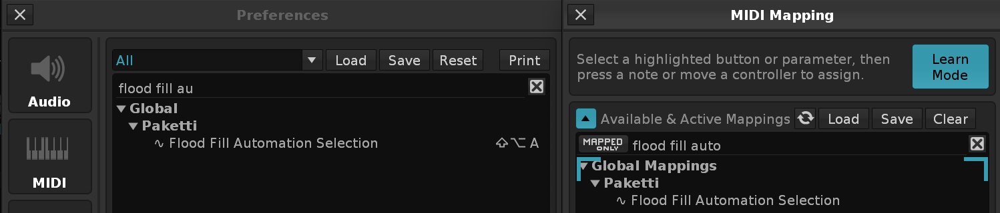

An example of usage:
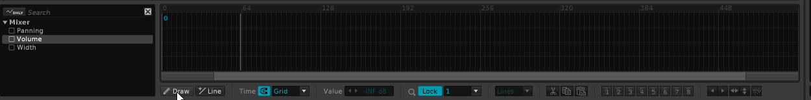

This same feature is also available from the Automation Menu:

and the other in **Main Menu -> Tools -> Paketti.. -> Automation.. -> Flood Fill Automation Selection**.
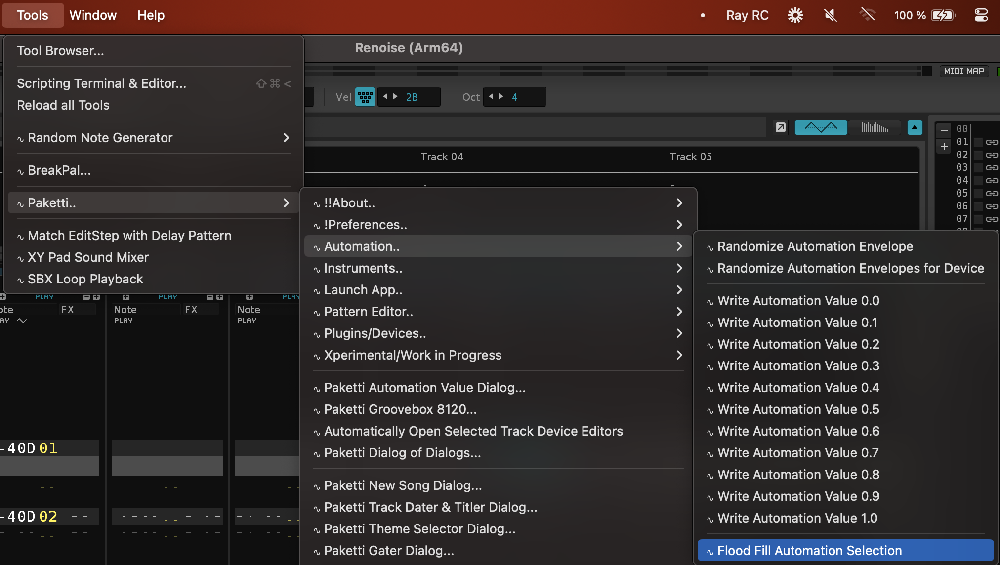

### Write Automation Value 0.0-1.0
The Shortcuts for `Write Automation Value 0.0` to `Write Automation Value 1.0` will output the Automation Value to the selected Automation Parameter.

*Note: If there is no Automation Envelope created for the Selected Automation Parameter, an Automation Envelope will be automatically created.* 

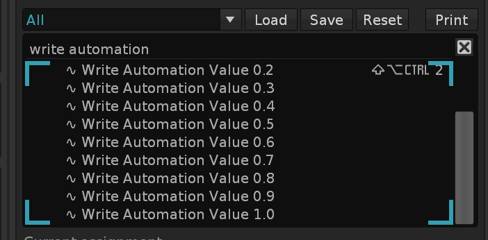

### ALT-D Selection with Automation Frame Open
The Shortcut `Impulse Tracker ALT-D Double Select w/ Automation` takes the original ALT-D Double Select feature from Scream Tracker 3 and Impulse Tracker 2 and adds additional logic into the mix.

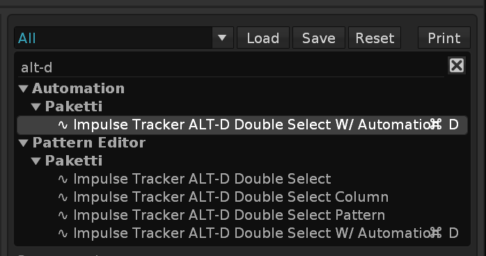

Meaning, if you have the Automation Frame displaying, the same Shortcut will also select the same rows in the Automation Frame. 

An example of usage:
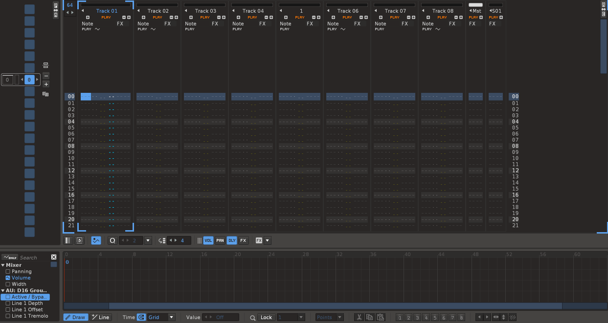

### Automation Across Multiple Patterns Using Pattern Matrix

Menu Entries in the **Pattern Matrix** for creating Automation curves that start from the first selected Pattern and travel to the last selected Pattern for the Selected Track. 
- Linear Up/Down
- Exponential Up/Down
- Linear Center->Top
- Linear Top->Center
- Linear Center->Bottom
- Linear Bottom->Center
- Exponential Center->Top
- Exponential Top->Center
- Exponential Center->Bottom
- Exponential Bottom->Center

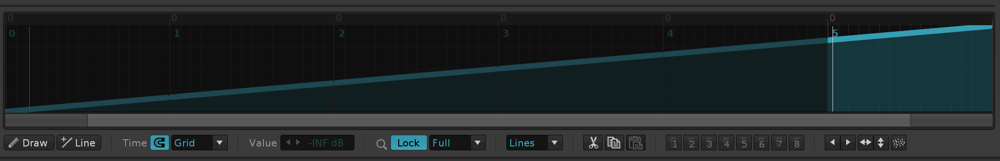

The Pattern Matrix Menu looks like this:
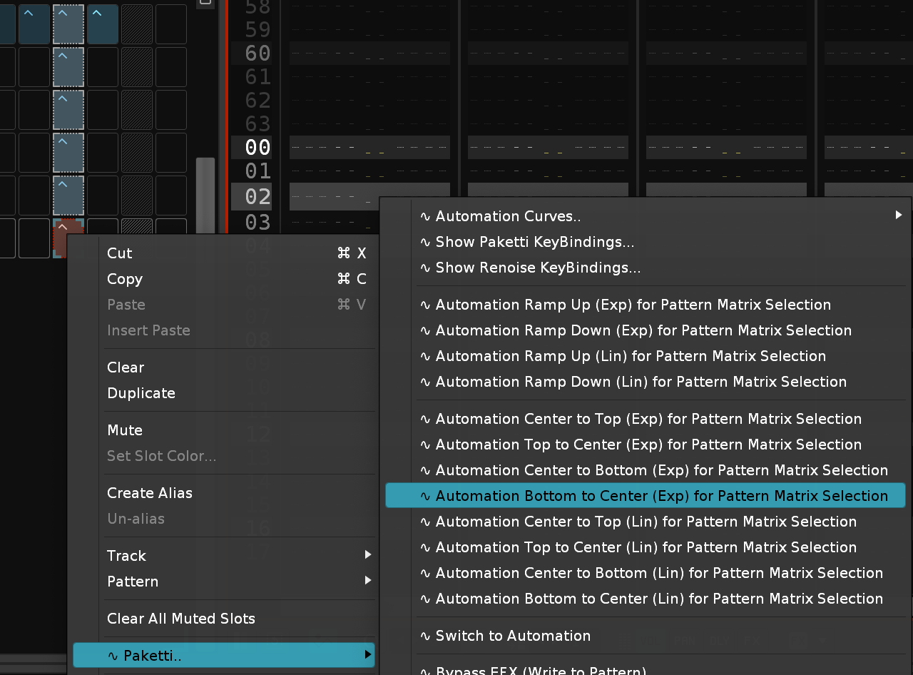

### Flip Automation Horizontally & Vertically
The Shortcuts / MIDI Mappings for `Flip Automation Selection Horizontally` and `Flip Automation Selection Vertically` will do the same thing as `Flip` & `Mirror` buttons in the Automation Frame, but these Renoise-native features do not have MIDI Mappings available.
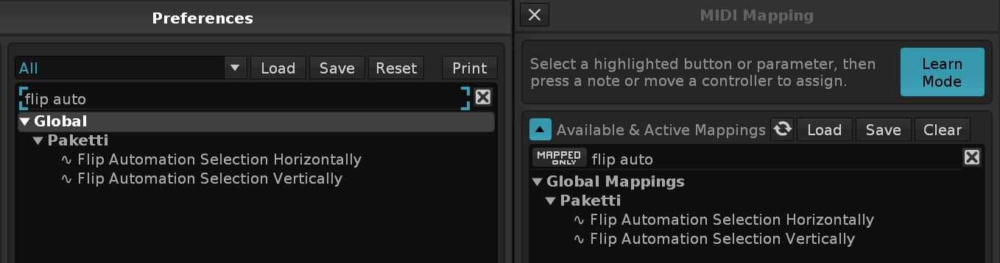
### MIDI Automation Curve Draw Selection
This MIDI Mapping will read the Selection on your Selected Automation Parameter, and change the Automation Curve. With a regular Automation Envelope, this will cycle through 
- Full Bottom
- Line Up
- Exponential Up
- Full Top
- Line Down
- Exponential Down

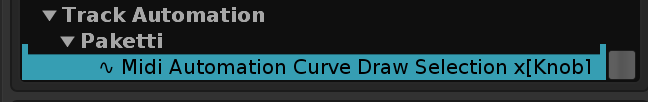

An example of usage:

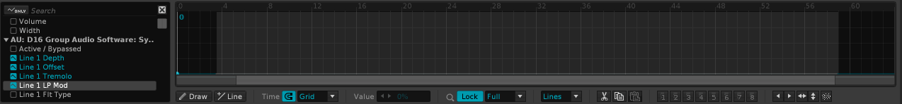
If you have selected a Panning, PitchBend or similar (get in touch if you want more configurations), these will cycle through the following:

An example of usage:
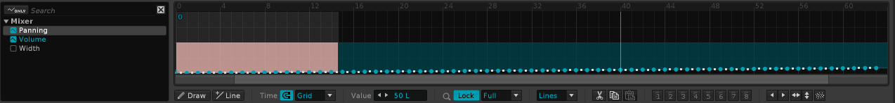
### Select Automation Playmode
The Shortcuts / MIDI Mappings for `Select Automation Playmode (Next)/(Previous)` and `01 Points`,  `02 Lines`,  `03 Curves` let you set the Selected Automation Parameter's Playmode states. 
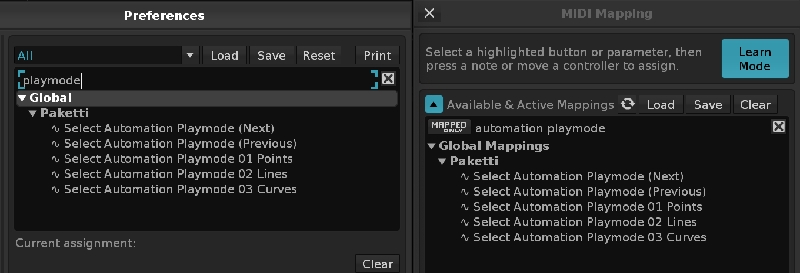
### Set Automation Range to Max, Middle, Min
The Shortcuts and Midi Mappings for `Set Automation Range to Max (1.0)`, `Set Automation Range to Middle (0.5)` and `Set Automation Range to Min (0.0)` output to the currently selected Automation Parameter's currently selected row.
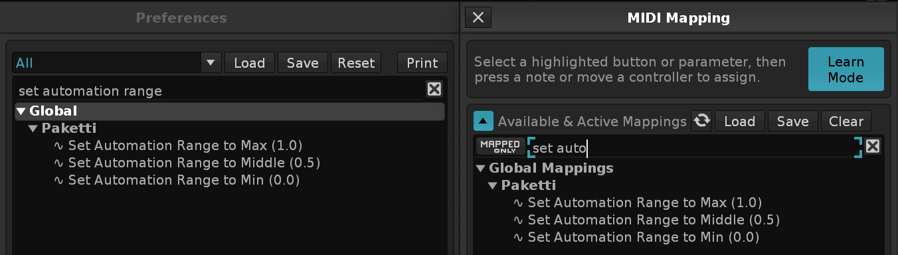
### Switch to Automation & Cycle through Automation Envelopes
The Shortcut / Midi Mapping `Switch to Automation Dynamic` is a multi-function feature.
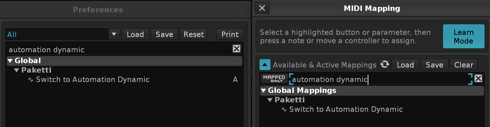
If you're not in the Automation Frame, it will display the Automation Frame. (Hence the "Switch to Automation" part of the name).

If you are already on the Automation Frame, pressing the same shortcut or midi button again, will result in you cycling through the parameters that have Automation Envelopes on them.

An example of usage:
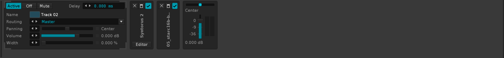

### Selected Device Automation Parameter 001...128

These 128 MIDI Mappings will directly write to the Automation Parameter of the Selected Device. This will happen without the Automation Frame switching to showing the Parameter, so, if you know which Selected Device Parameter you wish to control, just map them and fire away.

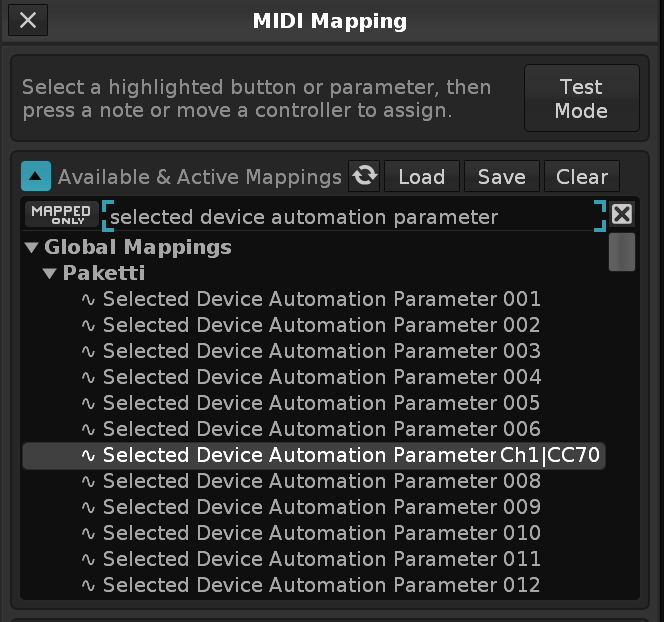
### Automation Selection Start & End with MIDI
The following MIDI Mappings will let you use two knobs to set the Selection Start and Selection End of the currently selected Automation Envelope.

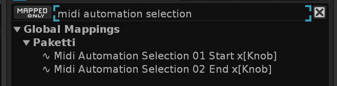

An example of usage:

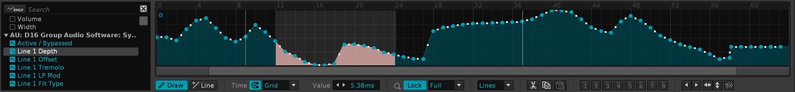
### Automation Value Dialog
The Shortcut/Midi Mapping `Show Automation Value Dialog...` will open up a simple and small Dialog that lets you write an Automation Value to the currently selected Automation Line.

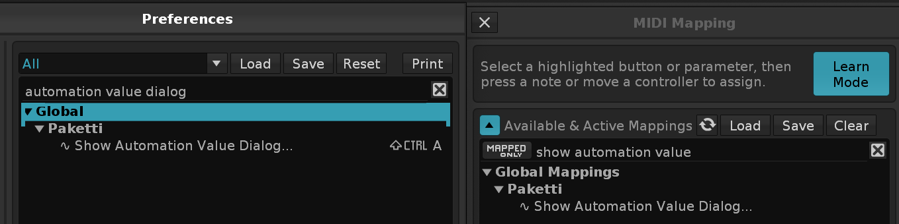
As you can see from the Dialog screenshot below, the textfield is autoselected. After opening the Dialog, you can simply input a value between 0.0 and 1.0, press enter, and the Dialog closes and the value is input.

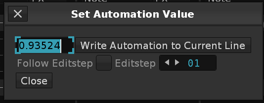

An example of usage:

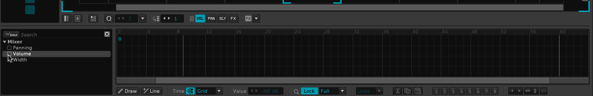

There is also an additional feature, the EditStep follow, which lets you get jumped to the next EditStep value after you press Enter in the Value textfield.

An example of usage:
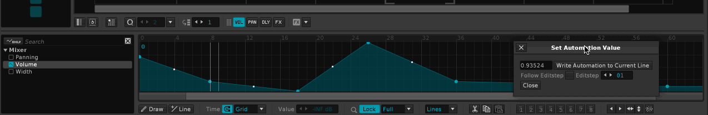
With the EditStep set, the Dialog never closes.

### Record Automation to Selected Parameter
This MIDI Mapping will let you record Automation nodes to the Selected Automation Parameter.
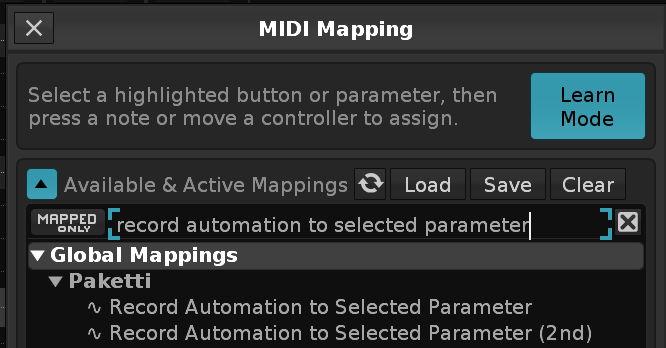

This will only record content to the Selected Parameter, if Edit Mode is on. Then it records to the whole selection. If you have a selection, it will change the value of the whole selection. 

If you have **Follow Pattern** on, then it will record to changes to the playhead.

An example of usage:
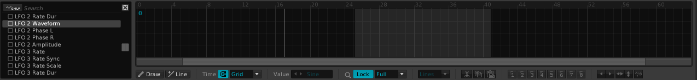
### Generate Automation Points from Notes in Selected Track
The Shortcut/MidiMapping `Generate Automation Points from Notes in Selected Track` will output Automation Points to the selected Automation Parameter based on the notes you have in the Pattern Editor.
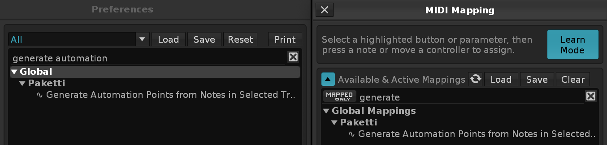

This same feature is also available from the Automation Menu:
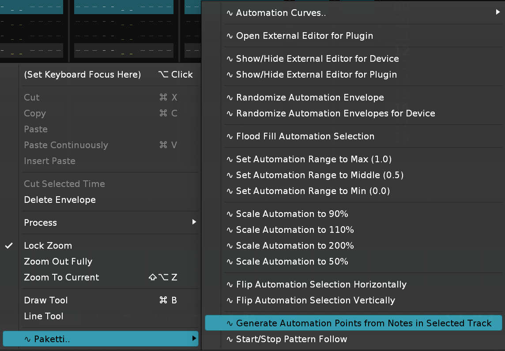

An example of usage:

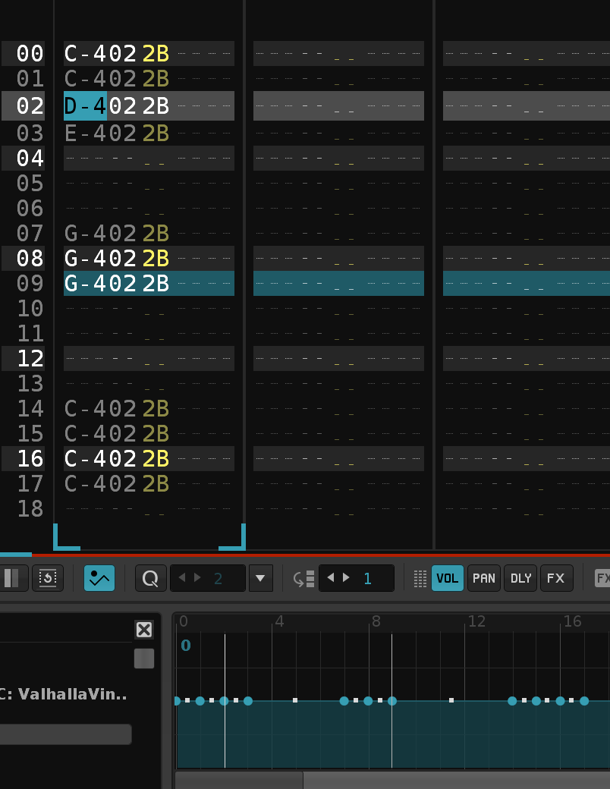
### Automation Selected Parameter Randomization
The Shortcut/Midi Mapping `Randomize Automation Envelope` will take your currently selected Automation Parameter and Randomize it, or, if there is a selection, only Randomize the selection. 
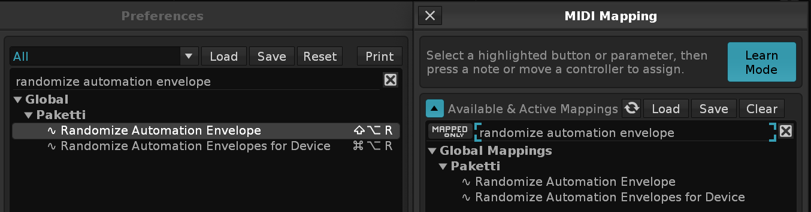

This same feature is also available from the Automation Menu:
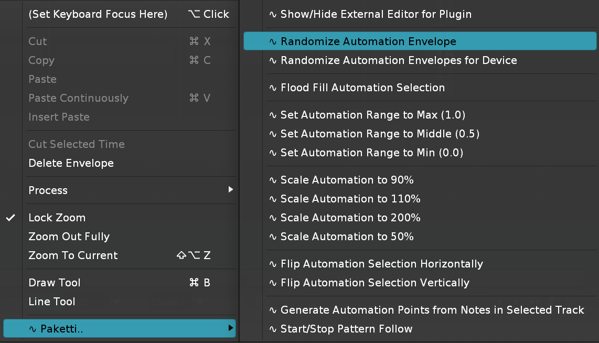

An example of usage:
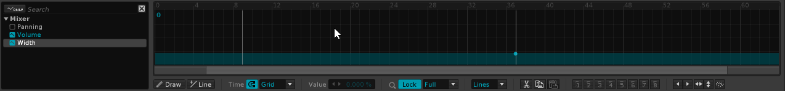

### Automation Selected Device Randomize (All Parameters)

The Shortcut/Midi Mapping `Randomize Automation Envelopes for Device` will insert Randomization to each and every parameter of the Selected Device.

This will create a new Envelope per each Parameter, or overwrite the pre-existing one.


This same feature is also available from the Automation Menu:
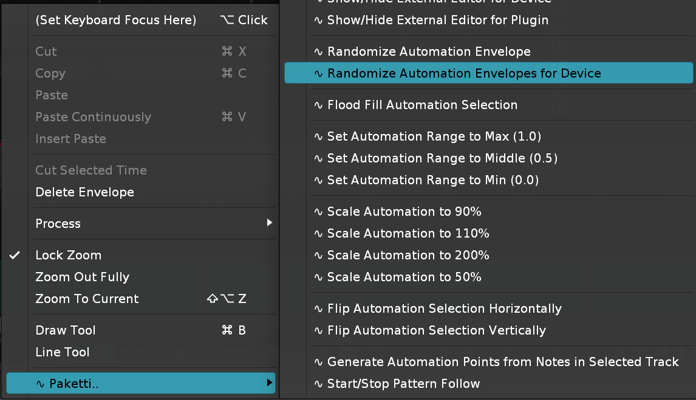

### Automation Selection Flip & Mirror
TODO

---
### Wipe Automation from Current Track in Current Pattern, all Tracks in Current Pattern, Current Track in whole Song and All Tracks in whole Song
TODO

---


## MIDI

## Pattern Editor

## Mixer

## Pattern Matrix

## Pattern Sequencer

## Disk Browser

## Instrument Box

## Sample Editor

## Sample Mappings

## Sample Navigator

## Dialogs

## Global View Presets

## Sample Recorder


# Sample Management

Paketti tries to circumvent some of the most painful points of Renoise, and replace them with better, easier, faster, more user-friendly solutions. Quality-of-Life & Workflow improvements over "multiple mouse clicks".

### Loading Samples

One of them is the complete dismissal of the Disk Browser. You don't need to use it to load samples or save samples. In fact, I would encourage you to never use it for loading or saving samples - just use the Paketti solutionss.

The Windows Explorer and macOS Finder are far more robust and stronger solutions. When you trigger the following shortcuts or menu entries or midimappings, the Windows Explorer, or the macOS Finder will be opened - allowing you to select multiple samples from multiple folders, access the sidebar/favorites you have set yourself, and, just, be faster than the Disk Browser.

For that, you just use the `Paketti PitchBend Multiple Sample Loader` & `Paketti PitchBend Drumkit Loader` shortcuts. These will load a sample (or multiple samples), and immediately initialize it with:
- 8 Macros (PitchBend, Cutoff, Resonance, Cutoff LFO Frequency, Cutoff LFO Amp (4+5 are used for autofilter like features), OverDrive, Parallel Compression, PitchBend Glide/Inertia) (set it to max, and your regular midicontroller pitchbend input will be very slow, set it to minimum, pitchbending will be immediate). For these, there's a Default XRNI instrument being used, which comes with Paketti. you can of course replace it with a completely different XRNI - which will then get it's sample overwritten on every load.

- Paketti Preferences "Paketti Loader" preferences, such as using your preferred loopmode, autofade, autoseek, oneshot, interpolation, New Note Action, selected FilterType. 


If you pay close attention, you'll also see a checkbox for setting the AHDSR Envelope. Yes, the Default .XRNI Instrument of Paketti also comes in with some Sample FX Chain settings. There's a:

- Deactivated Mono device (Sample FX)
- AHDSR Modulation device
- PitchStep Modulation device

Some examples below:


Why a Pitch Stepper? Because there are also shortcuts for opening the External Editor of the Pitch Stepper.


Go wild with the drawings!


The other shortcuts do these:
- Octave Up & Octave Down


- Octave Up twice & Octave Down twice (changing the minimum & maximum pitch to 24st)


- Randomize PitchSteps


The `*Instr. Macros` device which is also added to the track you are on, allows you to directly start automating the Macro parameters. 

Meaning, you would load a sample using Paketti, input a few notes to the pattern editor, and immediately be able to start drawing automation for any of the 8 macro controls. So you could for instance put in a drumloop, and start drawing a cutoff automation curve directly to modulate the cutoff parameter.

The 8 Macros are also available as a Midi Mapping like this:


The reason for adding these, is, so, that when you are on any instrument with the Paketti Default XRNI Instrument (or any instrument with any of the 8 Macros set up), the same 8 Midi knobs on your controller will control those 8 settings. So you can rest your hands on the knobs, select a different instrument, and keep crafting. These also, of course, apply to the DrumKit Loader - which we'll cover next.

The DrumKit loader loads a max of 120 samples into the instrument. Select more? Only loads 120 samples. The drums are mapped automatically from C0 to B9.

### Saving Samples

There are Midi Mappings, Keyboard Shortcuts and Menu Entries for `Save Selected Sample .WAV` & `Save Selected Sample .FLAC`. There's also `Save Selected Sample Range .WAV` & `Save Selected Sample Range .FLAC`. The Sample Range saving is from Fast Tracker 2.


There's also a method for saving all Samples to a Backup Folder - which are user configurable - meaning, you can have 3 different Backup Folders, and thus three different shortcuts for saving either Selected Sample, or all Samples to the Backup Folder.


The dialog where you get to select the Backup Folders is the "Launch App Selection Dialog", pictured below:


### Sending Samples to other apps

If you carefully look at the following dialog:


You'll see there is also a way of sending a selected sample to a specific app! This means, you can set your preferred programs, and Renoise / Paketti will save the selected sample to a temporary folder, and start the app and load the sample. 

***Note well, Bitwig developers: Your app does not support sending files to it via `bitwig.app file.wav`. Please fix.***


### Wipe & Slice

Those who like BeatSlicing, there's a mathematical slicer - which takes your loop, and, depending on which shortcut you pick, slices it in half (two slices), or 4 slices.. to max 128 slices. meaning if your loop already loops well, you can just split it into 16-32-64 slices and start drumming away at the loop.


There are additional configuration steps in the Paketti Preferences dialog:


The BeatSync Mode can be set, also, and if, for instance, you set a 256 BeatSync Line setting for the sample, and chop it in 16 pieces, then each Slice will play at 16 BeatSync - maintaining the pitch and speed that you would expect. All this is taken care of behing the scenes.

### MPC-like Slice start + end alteration with Shortcuts / MidiMappings

But Slices aren't always precise. So there are methods for adjusting the Start and Endpoint of the Slices, much like MPC does it. This means that you don't need to keep viewing the original sample, zooming in, adjusting the Start/Endpoints, zooming out, moving a bit, and then doing the same thing like an automaton. Just look at the Slice, and change where it starts and ends.

Here are the shortcuts - and examples of how it could be done.


And here's a little .gif of what it looks like:


### Isolate Slices

While we're on the Slice topic, there's also `Isolate Slices to New Instruments`, which takes all the Slices in your Instrument, and creates new Instruments below it. And if you were on, say the Slice that was a Snare - isolate slices, you'll still be on the Snare.

Of course, the Paketti Default .XRNI instrument is introduced for each slice.

You can also `Isolate Selected Sample to a New Instrument` - which takes the selected Sample or Slice, and creates a new Instrument, with the Paketti Default .XRNI Instrument introduced.

There's also `Isola

## Plugin / Device Management
### Loading Devices and Plugins

Another step in the abandoning / circumventing of Native Renoise loading methods, is the doing away with the usage of the Track DSP Device Loading.

Instead, Paketti introduces Keyboard Shortcuts, MidiMappings for loading your preferred VST,VST3,AU,LADSPA,DSSI,Native devices to both Track DSP Chains and Sample FX Chains. 

There are also Menu Entries for loading your Native devices (including the Hidden / Legacy effects), if you're mouse inclined.

By going to **Tools -> Paketti.. -> Plugins/Devices.. -> Load Devices Dialog...** and ticking your favorites, clicking on the `Add Device(s) as Shortcut(s) & MidiMappings` button will result in, from now on, the selected devices being available in Keybinds and MidiMappings. Set them up, and away you go!


This means that you can, for instance, (in my usecase) press `shift-q e r t z a v`  and out come 7 devices to the selected track. Same with midibuttons, after selecting your favorites, you can use the midi mappings to set up midi controls for loading your desired device onto your selected track. Trust me, it's fast, fluid and just feels natural. Set them like you want to, and throw in your devices.

There are some additional details, such as: the external Devices are loaded in minimized mode, so they don't take up extra space. The Renoise Native devices are not loaded in minimized mode, because the parameters are displayed there.

And the more important detail: the External Editor is automatically opened!

The same thing exists for loading Plugins, go to **Tools -> Paketti.. -> Plugins/Devices.. -> Load Plugins Dialog...**


Same logic. Pick the ones you want, add them to the Paketti Preferences - they'll always be there.

The extra logic with Plugins, is, that it wouldn't make much sense if they overwrote the current instrument - so, a new instrument slot is added, every time you load a plugin. And the External Editor is made visible. So you can just start tweaking away.


# Rewrite Soon

### Freeze & Flatten a.k.a. Clean Render Selected Track or Group.

there's a Clean Render Selected Track / Group. this will solo the selected track, render it as a wavefile, create a new track (named with a matching title such as "Bass (Rendered)" (if your original track was called Bass, input C-4 to the newly created track, ingest the 8 macros to it, mute the original track, collapse the original track, and if you select it, also bypass the effects in the original track. and it's ready to be automated, by default, too. if you have a line input device on the track, instead of "Highest" diskwriting speed it will switch to "Realtime" - meaning, if you have incoming audio being processed through renoise effects, that incoming audio will be recorded to the new instrument, with the effects. perfect for external synthesizers being controlled by midi, for instance.

### Improved Automation drawing, including multi-pattern automation.

since the renoise automation drawing is quite limited, i've added midi shortcuts and menu entries for drawing curves up/down (exponential, linear), and also added logic that if you're trying to do an "exponential to max" curve on a pitchbend/panning automation lane, it will be drawn from the center to the top, instead of from the bottom to the top.
there's also multipattern automation drawing, meaning, you make a selection from pattern matrix and it will draw an exponential curve or linear curve from patternStart to patternEnd.

there's also midimappings for automation start and automation end, and a third midimapping knob for deciding which automation curve is drawn and from where to where. so you can pick an automation area, and use a knob to decide what the curve would look like.

i've also introduced a "Draw Automation to Selected Automation Parameter". this means, you're in ANY automation lane whatsoever, have playback on, set record on, set follow pattern on, and turn the knob == result == you are drawing automation to that lane. you don't need to map the midi anywhere in the track device or anywhere, just map it once to the "automate selected parameter" and just select any parameter and just draw in. it also works with selections, meaning, you select a section and draw with the knob, and it writes to the section (this with follow pattern off, of course).

<div style="position: relative; padding-bottom: 64.90384615384616%; height: 0;"><iframe src="https://www.loom.com/embed/5b46a1dd7d5e4d82b87ff145fc38c3cb?sid=7383c8f2-6daf-44ea-a9f2-305d602f5a21" loading="lazy" frameborder="0" webkitallowfullscreen mozallowfullscreen allowfullscreen style="position: absolute; top: 0; left: 0; width: 100%; height: 100%;"></iframe></div>

### Paketti Theme Selector
This dialog comes in pre-populated with 518 themes, and you can pick your favorite themes out of the mix, and have Renoise randomize through the favorites (or all themes). So every time you boot up Renoise or load a new song, a different theme will load. Great for discovering new themes.

https://public-files.gumroad.com/i8xgettth9an6ibvc6l8oto44b05

### Paketti Gater
This allows directly writing in looping volume, retrig, backwardsplayback and panning gates. E
Each of these rows have their own steps, min 1 max 16. so if you have a 512 row pattern and use a 16 row volume gater, then it'll keep looping till the end of the 512 row patterns. or if you have a 3 row panning step, those 3 steps will repeat until the end of the pattern, and so on. these are also designed to type directly to the pattern editor, either for volume control of sample, or volume control of the mixer channel.

https://public-files.gumroad.com/w9a7t5n7ya2or8bpe8s795x7yn47

Example:


### Paketti Groovebox 8120

There's a 8 part 16 step stepsequencer which writes directly to the Pattern Editor. You can load 120 samples into each part, pick your preferred sound, and use checkboxes to make them play. Probability checkboxes to modify how likely the step per part is to play, can draw automation directly by clicking on Show Automation (leveraging the 8 macros introduced on every Sample Load) and use buttons to randomize step sequencer content, select a random sample for all parts, or selecting random samples for each part, reverse any of the part or all part samples.. and you can limit the steps from 16 to 1 at will.
a brief demo at **SO HEY TWITCH DELETES STREAMS SO ITS GONE** // TODO I need to make a new one.

There's dozens of ImpulseTracker/ScreamTracker3 shortcuts for pattern editing and modification, some of which have been recently supercharged to also allow for selecting automation, gif here meaning when you select something using paketti shortcuts, it will also select the automation, if automation is visible. this can be combined with the midiknobs for drawing automation curves easily.


### Dynamic Views for cycling through with shortcuts.

The Dynamic Views let you have a max of 8 shortcuts which cycle through the view settings that you have picked. each of the 8 shortcuts can have max 8 different cycles. 
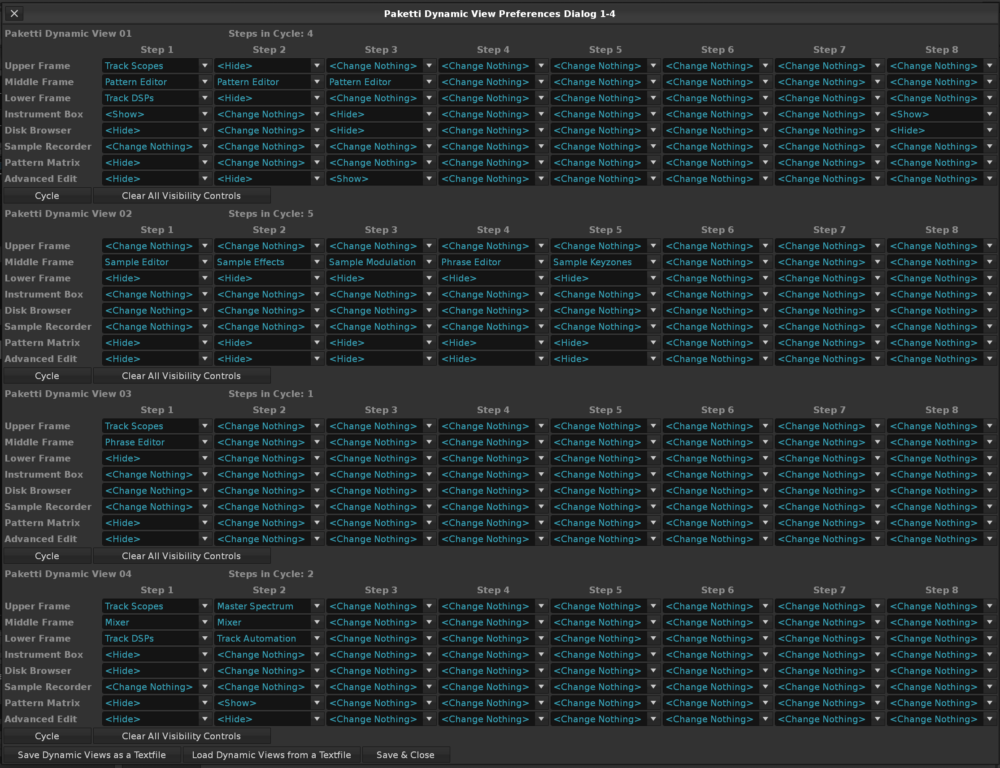

so you have maximum control over "view presets" but they're much more powerful than the 8 that renoise allows you to have, because they remember their state. You could, for instance, cycle, with one shortcut, from Pattern Editor to Sample Editor + show Sample Recorder, then press the same shortcut to hit Mixer, show Disk Browser + Pattern Matrix + Instrument Box, then again to only show Pattern Editor and Automation.

### MIDI Populator

there's a method of creating 16 new tracks with 16 midi input channels and 16 midi output channels and 16 plugin devices, automatic send generation and line input generation, for those who want to use renoise with an external sequencer with a multi-out soundcard, or those who want to use renoise as a sequencer for external synthesizers and want to map the midioutput channels themselves. all of the generated samples will have midi control devices set up directly, and automation ready to go.


### Default Phrase Settings
This allows you to set your Phrase Preferences - i.e., when you use the Paketti -specific shortcut for creating or modifying current Phrase, the settings will be added.


### eSpeak Text-to-Speech speechsynthesizer

This uses `espeak-ng` for creating spoken word samples using text-to-speech synthesis.


there's randomizers for parameters of selected device, a mono-device which can be added or toggled on/off from the channel for quickly monoing


the same shortcut + midimapping loader for devices, is also available for plugins, so vst,vst3,audiounit,ladspa,dssi softsynths can be shot to the instrument box with shortcuts + midimappings


there's an inverter device which inverts the audio - using the Gainer device. This can be added to both the Sample FX Chain and the Track DSP Chains.

The send and multiband send shortcuts load the native devices "correctly" aka "Keep Source and volume at zero" as opposed to "mute source and volume at max".. 


## Automation
I have written midimappings for directly inputting automation points to the currently selected automation parameter 
And also a shortcut for opening a dialog for writing automation points to exactly which pattern row u r on
And also randomize selected automation parameter
And randomize all automation parameters of selected device
And multipattern automation curve drawing
And midimapping for select start and end of automation and also mapping for changing selection curve up down exp Linear etc
And also flood fill of selection in automation parameter to end of pattern
[21.56]esaruoho: And a shortcut for cycling through all automation parameters that have been defined by user (written to)


### 0G01 Loader

This uses the `G01` (Glide to note) trick to allow for playing really long samples, even if the pattern would be shorter than the length of the sample. The sample will play until the end, and then replay again at the start of the next replay. This means you can have a 4 second drumloop but play 20 minutes of pads on top of it.

there's a midimapping + shortcut that 1) shows sample recorder 2) starts recording 3) press the shortcut again, it stops the recording, throws in the 8 macros
so you can quickly start recording anything by just pressing the shortcut or holding down a midi button, let go of the midibutton, sampling stops

there's a pattern cheatsheet which lets you input pattern commands to either selected row or selection in pattern:


there's shortcuts + midimappings for inputting volume, panning, delay, samplefx effect commands and effect parameters to the selection in pattern

there's "flood fill by editstep" shortcuts which let you take what's under your cursor and repeat it every 6th row or 8th row etc, or every row.

there's a replicate at cursor shortcut, which enables this kind of stuff:

<div style="position: relative; padding-bottom: 64.90384615384616%; height: 0;"><iframe src="https://www.loom.com/embed/a437d74618934e9db634ceb41b1c5b9a?sid=10a1da7b-de26-4b44-87b0-dcc735ba62c9" loading="lazy" frameborder="0" webkitallowfullscreen mozallowfullscreen allowfullscreen style="position: absolute; top: 0; left: 0; width: 100%; height: 100%;"></iframe></div>

https://www.loom.com/share/a437d74618934e9db634ceb41b1c5b9a?sid=ead6a274-1a6a-4ea1-a068-344fed4aef23

there's a "Set Repeater Value" Knob midimapping which will either 1) add Repeater and activate it 2) detect Repeater exists and modify the parameters, allowing for stuff like this:

<div style="position: relative; padding-bottom: 64.90384615384616%; height: 0;"><iframe src="https://www.loom.com/embed/f4f94d05045a4df49896d52202d3adf7?sid=e3999014-729a-4653-a962-ee8bfa45862d" loading="lazy" frameborder="0" webkitallowfullscreen mozallowfullscreen allowfullscreen style="position: absolute; top: 0; left: 0; width: 100%; height: 100%;"></iframe></div>

https://www.loom.com/share/f4f94d05045a4df49896d52202d3adf7?sid=9c7c6c79-005d-48f4-ba21-ac06475b5bfc

there's shortcuts for changing pattern length to 4, 8, 16, 24, 32, 48, 64, 96, 128, 256, 512 - methods for duplicating content with 1-256 row patterns to double it, then `LPB*2` diskwriting aka rendering a new sample, but making a clone of the pattern and setting it's LPB to current LPB, then the clone of the pattern has LPB times two, and the audio playing there.  there's seamless rendering, aka if you have anything below 257 rows of pattern, it will duplicate it, render it, select the beginning 256 rows (so you can delete them if you like) and add a loop to the other 256 rows so you can have a reliably looping (mostly) long pad with tail mixed in..  mono to stereo converters for sample data (mono to left, right blank, mono to right, left blank, mono to stereo with both).. there's a yt-dlp downloader that downloads the full audio from a youtube video, instagram, facebook, twitter posts, and it already has the macros loaded in.. and there's multiple missing shortcuts for sample pitch finetune panning loop etc controls, same for midi.. i could go on. i've done max 4 hour demos of going through all the features, normally around 45minutes to 1,5hours depending on what i remember to show

there's "Duplicate Instrument and Reverse" - which both makes a copy of the currently selected instrument, and then reverses the sample, and selects the sample.
Duplicate Track and Instrument - will take the notes that are there in the current track. + track dsps, and make a new track, select the track, and duplicate the instrument. and if you have a plugin open in the original instrument, and duplicate the instrument with this script, then it closes the plugin external editor, and duplicates the instrument, jumps to the newly created track, and opens the plugin's external editor for it.
there's a dialog that lets you randomize a selected device, or all devices in a selected track, or selected plugin, or all selected plugins,  -- there's 5 different flavors of all four of those, with percentages you can set for them.
there's a "duplicate track with selected instrument", meaning you can keep copying the note content, but it'll be branded with your current instrument, instead of it being a duplicated instrument.

the randomize with percentage was from ModPlugTracker. there's also a bunch of features from PlayerPro, such as this note inputting dialog, which lets you input notes, with editstep, to selection, or current row, meaning you can do stuff like this. there's also a method of hovering the mouse to write effect columns to the selection in pattern..
i've also replicated the OctaMED Pick/Put Note technique, which lets you pick any note column + effect column content, and put it down. think of it like macros for note column + effect column content.  you can do them with shortcuts (both picking up and putting down) but also with midi. so you could for instance have chords grabbed and keep slamming them down - there's also controls for printing the information with a specific instrument.

one thing i keep forgetting is the Launch App Selection. you can define 6 apps, and when you run the shortcut, or menu entry, or click on "Send selected sample" in the dialog, it saves a temporary file and loads it in the app. such as audacity, apple music, ableton live (straight to session view). there's also a backup folder (3 places) where it saves to one of the three places depending on the shortcut

I've also built two dialogs for showing keybindings - with fuzzy search. one shows Paketti shortcuts only, the other shows all Renoise KeyBindings but can be filtered with tools or without tools, etc.

then there's tiny audio tools such as "strip silence", "move beginning silence to the end".. shortcuts for invert left channel, invert right channel (or invert both channels). audio rotators, so moving the beginning to the left until it crosses over to the end, i.e. "nudge audio left / right", then there's rotation for moving the audio waveform up and down for extreme dcoffset and clippy distortion. then there's a DC Offset kick generator,  "Selection in pattern to group" (turn selected tracks into one group), 
midimappings for toggling effects on and off. midimappings + shortcuts for displaying the external editor on Master or selected track, of a specific track. i.e. if you use renoise for mastering and always have certain types of effects on master, you can show/hide that specifically named effect, no matter where it is in the effect chain. and if it's not in the track dsp chain, then it will be loaded and added in.
uncollapse/collapse all tracks for clearing up visual clutter
Convolver IR export and IR import - when you export the selected IR, it opens up in the sample editor, so you can modify it, then import it back in.
Switch Plugin Auto-Suspend On/Off
"Save All Samples to Backup Folder 1...3" - all samples in the song will be saved to your preferred folder
Unison Generator, takes a chipsound and makes 8 identical copies of it, shifts each of them left by 1/8 to 7/8 - modifies the volume, randomizes finetune, randomizes panning, and drops the overall volume (and includes the instrument macros in the copy) - for a nicer chipsound
there's hundreds of Section/Sequence/Selection shortcuts for queueing what plays next, or skipping to the next section or previous section or "what's next in the queue" and wiping the queue
there's a global shortcut for Clone Current Sequence, 
Resize all non-empty patterns to 96 rows..  and Resize all non-empty patterns to `current pattern` rows
Create Identical Track - takes the Note Columns / Effect Columns & Visible Columns&copies

For a selection in sample editor, you can press a shortcut to "create new instrument & loop". there's "mute or solo selection in pattern",  expand/shrink selection content shortcuts, set selection to selected instrument.. bypass all effects in track, or enable.. show all parameters of all devices in track

Oblique Strategies Dialog / Loader - it will randomly pick one Oblique Strategy from a list on the status whenever you save or load a song or restart Renoise

Paketti Midi Mappings - it shows some of the Paketti MidiMappings and if you have Midi Mapping "Learn" mode on, you can actually pick them yourself and assign them easily. for better discoverability

Output Routings dialog that shows all the tracks and lets you set the Output Routings in case you have a multi-out soundcard

Shortcuts for setting each track, or the Master, to a specific output routing channel (01-64) for those with multi-out soundcards

Track Renamer - select a bunch of tracks with selection-in-pattern and rename them all in one go, one track at a time

Phrase Doubler / Halver (takes the content of the Phrase and increases the size or decreases the size

Set Phrase Length to 001-004-006-008-012-016-024-032-048-064-096-128-192-256-384-512

Set Phrase LPB 1-256

Set Pattern LPB 1-256

Print current BPM & LPB to Master track of Pattern - so can modify the tempo in another pattern -good for `LPB*2` i.e. increasing resolution

Keep Sequence Sorted True/False/Toggle

15 frame fade in fade out for reducing clicks

Duplicate sample, maximize audio, turn to 16bit, save as wav or flac (in case you want to deliver them or post them somewhere)

Flip Sample - this allows for 1/2 1/4 1/8 1/16 flipping/rotating of a sample, good for beats if you wanna flip it or any other type of sample

Select first half of sample buffer shortcut - and second half too. midimappings for select sample buffer start and end, so you can just use two knobs to select the length and modify

Set loop mode off, forward, pingpong, backwards

Copy note-on sample to note-off at transpose 0, +12, +24, -12, -24 meaning when you hit a note off on a bassnote, the same basenote can play an octave higher or lower - good for octave basses

Jump to first track in next group / jump to first track in previous group

Midimappings for select instrument, select track, keyboard octave, editstep 0-64 and 1-64, double editstep halve editstep, beatsync line control / double beatsync / halve beatsync
8 midimappings for controlling the macros of the current instrument. meaning, you use the 8 midimappings on any track and you can control macro knobs without having to assign them to a specific instrument. i.e. they're "free" / "dynamic" for lack of a better word

Interval generator. shortcuts for adding +1 to +12 to the current note - adds a new note column, moves to it and adds a note that is +x or -x higher/lower than the original basenote. also midimappings for selecting multiple chord intervals - good for experimenting with basenotes and writing intervals in and seeing what happens. couple that with the Paketti Gater and you can go wherever you please really.

Wipe Effects from selection in pattern

Shortcuts for showing a specific number of note columns, or effect columns

Expose / hide note columns or effect columns - this replaces the Renoise "add new note column" by actually exposing it AND selecting it. much more intuitive

Direct shortcuts for writing Axx to Zxx effects and their content (+1 -1 +10 -10) to selection or row

Match delay column to current row  (or panning, or volume).. means you have a row you've 

Selected, run the shortcut, every row in the pattern gets the same delay, or panning, or volume setting

Note Interpolation (entering notes from beginning to end of selection so c-1 at 00 and c-5 at 64? every step has an interpolated value based on math

Randomize delay, panning and volume value for selected tracks and their columns

Flood fill with selection - takes your selection and fills the pattern with it in a loop

Shortcuts for setting visible columns (vol,pan,delay,samplefx) for all tracks globally
clear/delete track dsp effects from current track

BPM increase +0.1 -0.1 +0.5 -0.5 +1 -1 +5 -5 

Bypass all devices on all tracks

Bypass all devices on selected track

Set master output volume in dB to -INF or 0 or -0.1 +0.1 -1 +1 for better control

Midi mappings for setting global groove control 1,2,3,4

Midi Mappings for setting Global Groove 2 & 4 (downbeat?)

Multi-combos like "shortcut for toggling play, record, follow pattern, metronome on/off" or "toggle play,record,followpattern on/off, or record+followpattern on/off

Hide open track dsp device + sample fx device external editors

Shortcuts + menu entries for adding sample modulation devices (all available for volume, pan, cutoff, resonance, overdrive, pitch) 

Shortcut for adding and opening formula device

Direct shortcut for exposing the pitchstep device external editor, which is included in all Paketti-loaded samples so you can immediately start pitching it up and around for extra randomness

Visual editmode for highlighting which track is selected, for those with aged eyes and who have grown tired of trying to figure out which track they've selected

Volume, panning, delay dialog with 16 sliders - basically another step control for setting specific settings, again 16 steps but can be reduced to 1-16 steps for each, so they can be offset

Shortcuts for starting playback at a specific row (000-512)..

Shortcuts for starting playback at a random line of the pattern, or random 2nd or 4th or 8th row (in order to be able to step across it in a stair/stepped way)

Play current line and step forwards, play current line and step backwards, for those who want to use renoise as a.. musical box?

Shortcuts for selecting a specific track i.e. 1-32, you set the shortcut and it jumps you there

Sample fx group + mod group shortcuts for modifying them, same with mute groups

Show/hide selected track's device 1 to 64, another external editor shower/hider

 A mode to enter where if you're in effect column, it'll jump you to the next row in that track that has a note. so you can enter effects to where the notes are

okay.. just realized i completely neglected to talk about the "Paketti Automation" setup.

This brings Master track automation of Global Groove, LPB (1-32), BPM (20-300), EditStep, Octave, EditMode, Recorder, Pattern Length, Instrument Pitch, Instrument LoopStart, Instrument LoopEnd, and 3 other things that remain to be figured out and configured.

this means you can actually automate when the recording is on or off, when sample is being recorded (!), what the selected instrument pitch ir or selected instrument loopstart+loopend, and there's 3 more additional things that could be automated, if i could just figure out what they are. any ideas?

the reason why there's LPB + BPM control is that the BPM in Renoise Master track automation is 20-999 (!) and LPB is 1-256, so  just a bit too much, i asked around a lot and 20-300 and 1-32 seemed to be the agreed upon, anything more, just let me know (64?). but to maintain automation resolution and "keeping it making sense", for most uses, these artifiical limitations are alright

i think the reason why i forgot to mention this was that i have had a tough time finding anyone to tell me what else could be done. i did experiments of using automation to change lower frame, middle frame, upper frame views, for instance. basically any script can be run like this. but i couldn't get anyone to talk to me about what they wanted and gave up and forgot about it

# Old About

Paketti is a multipurpose Renoise tool. Working like an expansion pack, it delivers hundreds of new functionalities to the app, ranging from Quality-of-Life (QoL) improvements to new advanced features inspired by Impulse Tracker, Schism Tracker, ModPlugTracker, Player Pro, John Player/Quantum SoundTracker/PollyTracker, OctaMED and many others. It also addresses multiple community requests from the Renoise Forum that were not yet considered by the developers. 

It is far too complex to sum up in just a few words. However, some notable changes include:

* Over ~~three~~ four thousand new keybinds covering multiple areas of Renoise;
* Default XRNI functionality - each loaded instrument or drumkit has Pitchbend, Glide Amount, Cutoff, Resonance, Cutoff LFO Amount, Cutoff LFO Frequency, Overdrive, Parallel Compression.
* Automatically load multiple samples into sequential instrument slots;
* Device parameter randomizer;
* Plugin parameter randomizer;
* Change default computer keyboard Velocity with Midi Mapping;
* Change Global Grooves with Midi Mapping;
* Freeze & Flatten Track -> Creates a new Track with content playing. Also Records incoming audio if `#Line-in Device` is in the Selected Track;
* Quick switch autosuspend for Selected Plugin;
* Bypass all devices in Selected Track;
* Floating window to insert plugins or Devices and add them as keybinds and MidiMappings;
* Floating interactable FX column cheat sheet, including sliders to quickly write changes to row or selection in pattern in your pattern;
* Pattern doubler/halver (duplicates the Pattern content, and the automation);
* Color/highlight the selected track in Pattern Editor (with EditMode (Record On/Off);
* Dozens of shortcuts for Pattern AND Phrase editing;
* Impulse Tracker (.it) key commands (`ALT-D *2`, `ALT-L *2`, `ALT-U`, `ALT-F`, `ALT-G`, `ALT-Y`, `Home *2`, `End *2`, `F2 F3 F4 F5 F6 F8 F12`);
* Quickly add Automation curves to pattern automation (fade ins/fade outs (linear or exponential), pitchbend/panning);
* Show/Hide Device parameters as sliders in the Mixer;
* Control Selected Sample loop start/endpoints with MIDI;
* Control Automation start / endSelection via MidiMappings
* Control Sample Buffer start / endSelection via MidiMappings
* And much much more!


# Index

For better comprehension, this manual is divided into sections. Each chapter corresponds to a different Renoise screen/tab and can be accessed from the list below:

## Global

## 1 - 'Tools' Menu

Settings for Paketti can be found under `Main Menu -> Tools -> Paketti..`. This menu also includes some shortcuts for useful features:

| Item                                   | Description                                                                                                   | Index |
| -------------------------------------- | ------------------------------------------------------------------------------------------------------------- | ----- |
| `Preferences`                          | Shows Paketti Preferences window.                                                                             | 1.1   |
| `Instruments`                          | Contains sample and drumkit loaders, plus shortcuts for beatsync and pitchbend.                               | 1.2   |
| `Pattern Editor`                       | Random BPM, FX Cheat Sheet, Collapse/Uncollapse All, Double/Halve Pattern                                     | 1.3   |
| `Plugin/Devices`                       | Multiple Plugin/Device functionalities.                                                                       | 1.4   |
| `Show New Song Dialog`                 | Allows you to start a new song with the option to keep the same Patterns/Instruments/etc                      | -     |
| `∿ Squigly Sinewave to Clipboard`      | Copy this symbol to easily find Paketti in the Keys window (under Renoise Preferences).                       | -     |
| `Paketti MIDI Populator`               | Automatically fills current Project with Tracks, Instruments, Sends and Macros for External MIDI Controllers. | 1.5   |
| `Clean Render Selected Track or Group` | Automatically bypasses FX in Track/Group before resampling.                                                   | -     |
| `Catch Octave`                         | (NEEDS EXPLAINING)                                                                                            | -     |
| `Clone Current Sequence`               | Self-explanatory.                                                                                             | -     |
| `Track Routings Dialog`                | Displays a pop-up window containing all track audio device routings.                                          | -     |

### 1.1 - Preferences

| Item                                          | Description                                                                                                                                           | Notes                                                                   |
| --------------------------------------------- | ----------------------------------------------------------------------------------------------------------------------------------------------------- | ----------------------------------------------------------------------- |
| `Upper Frame`                                 | Enables/Disables upper frame control when using Impulse Tracker key commands.                                                                         | See [insert IT topic - to be written].                                  |
| `0G01 Loader`                                 | Automatically enables the 0G01 hack for samples inserted using the Paketti loaders.                                                                   | See **Instrument Box** to better understand the 0G01 hack.              |
| `Random BPM`                                  | (NEEDS EDITING)                                                                                                                                       | -                                                                       |
| `Pale Green Theme`                            | Loads Paketti color theme for Renoise.                                                                                                                | -                                                                       |
| `Gifts: Plaid Zap Load`                       | Insert a special XRNI instrument made from Plaid samples.                                                                                             | See [forum post](https://forum.renoise.com/t/plaidzap-xrni-gift/32521). |
| `Create New Instrument & Loop from Selection` | Quite Self-Explanatory. Works on the Sample Editor (right-click).                                                                                     | -                                                                       |
| `Paketti Loader Settings`                     | Changes default settings for Paketti Drumkit/Multisample loaders.                                                                                     | See 1.2 for                                                             |
| `Wipe & Slices Settings`                      | Determines default settings for slices generated via Paketti (under the Sampler window and Instrument Box): Slice Loop Mode, Beatsync, Autoseek, etc. | See **Instrument Box**                                                  |
| `Render Settings`                             | Determines sample rate and bit depth for Paketti resampling procedures.                                                                               | -                                                                       |
| `Edit Mode Colouring`                         | Highlights the track you're currently editing, all tracks or none.                                                                                    | -                                                                       |

### 1.2 - Instruments

| Item | Description | Notes |
| --- | --- | --- |
| `PitchBend Drumkit Sample Loader` | Automatically generates a drumkit from selected samples. Includes some macros. Samples are adjusted according the your Paketti Loader Settings (see 1.1 above). | |
| `PitchBend Multiple Sample Loader` | Automatically generates one instrument for each selected sample. Sample are also adjusted according to Loader Settings. | |
| `Start Sampling (Record)` | Pops up the Renoise Sampler Recorder and starts playback. Objective for usage is to set "Pattern" mode, and record multi-pattern length content. | |
| `Beat Sync Lines Halve/Double` | Adjusts the Beatsync time for all slices in the Selected Instrument. Does not affect the first/main sample. | |
| `Xst PitchBend Instrument Init` | Inserts an empty instrument containing several useful macros: PitchBend, Cutoff, Resonance, Cutoff LFOAmp, Cutoff LFOFreq, Overdrive, Parallel Compression and PitchBend Glide Inertia. | |

### 1.3 - Pattern Editor

| Item                                     | Description                                                                                                                                                                                                                                   | Notes     |
| ---------------------------------------- | --------------------------------------------------------------------------------------------------------------------------------------------------------------------------------------------------------------------------------------------- | --------- |
| `Random BPM`                             | Picks a random BPM value for the project.                                                                                                                                                                                                     |           |
| `Write Current BPM&LPB to Master column` | This writes both the current BPM and the LPB to the Master Track. Useful when you change LPB / BPM across the song patterns.                                                                                                                  |           |
| `Effect Column CheatSheet Dialog`        | A pop-up window containg all pattern commands available in Renoise.                                                                                                                                                                           | See 1.3.1 |
| `Collapse/Uncollapse All Tracks`         | Collapses (minimizes) or Uncollapses (maximizes) all the Tracks, Groups, Master and Sends.                                                                                                                                                    |           |
| `Pattern Doubler`                        | Doubles the current pattern size while also duplicating its contents accordingly (notes, volume, panning, delay, samplefx columns and effect columns, and automation.                                                                         |           |
| `Pattern Halver`                         | Sets the pattern to 1/2 current size. Works *differently* from the native keybind `CTRL+F8`, as it *does not adapt pattern content* to fit the new length. Simply put: pattern length is changed to half, but notes/commands remain in place. |           |
| `Global Visible Column (All)`            | Expands all columns in all tracks: Volume, Pan, Delay and SampleFX.                                                                                                                                                                           |           |

### 1.3.1 - Effect Column CheatSheet Dialog

Please note: the Effect Column CheatSheet also features sliders for the Volume, Pan, Delay, SampleFX and Effect Columns. Moving a slider places the correspondent value in the highlighted row or selection in pattern. It is very effective for manually programming intricate modulations: pick an effect, move the slider, move to next line, and so on. It's also the perfect companion for Renoise newcomers who still haven't learned the most important commands.
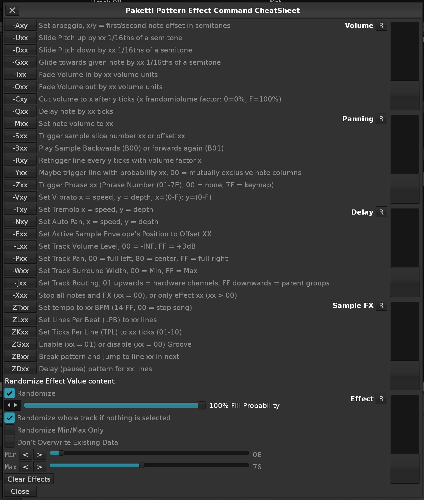

### 1.4 - Plugins/Devices

| Item                                               | Description                                                                                                                                                                                                                                                                               | Notes     |     |
| -------------------------------------------------- | ----------------------------------------------------------------------------------------------------------------------------------------------------------------------------------------------------------------------------------------------------------------------------------------- | --------- | --- |
| `Debug`                                            | Different plugin related utilities for debugging. Can be ignored by the average user.                                                                                                                                                                                                     |           |     |
| `Switch Plugin AutoSuspend OFF`                    | Quickly Enables/Disables the AutoSuspend function in Renoise. From the [user manual](https://tutorials.renoise.com/wiki/Plugin): "Auto Suspend: When enabled, Renoise will completely shut off the plugin when it is no longer producing sound. This is mainly done to reduce CPU usage." |           |     |
| `Expose/Hide Selected Device Parameters in Mixer`  | Display plugin parameters in the mixer as sliders. It's the default behavior for some native devices, such as the Compressor and Mixer EQ.                                                                                                                                                | See 1.4.1 |     |
| `Expose/Hide Selected Track ALL Device Parameters` | Same as above, but applies to all devices in the selected track.                                                                                                                                                                                                                          | See 1.4.1 |     |
| `Hide Track DSP Devices for All Tracks`            | If External Editors for any devices on Track DSP are visible, this will hide their External Editors.                                                                                                                                                                                      |           |     |
| `Bypass/Enable All Devices on Track`               | Self-explanatory. Useful to check pre/post processing. In other words, how the FX chain is affecting signals in a particular track.                                                                                                                                                       |           |     |
| `Load AU/VST/VST3 Plugins Dialog`                  | A pop-up window to quickly load instrument plugins or add them as keyboard shortcuts. These plugin shortcuts can be found under the Keys tab in Renoise Preferences.                                                                                                                      | See 1.4.2 |     |
| `Open Visible Pages to Fit Plugin Parameter Count` | Fully expands a plugin/device window so all the parameter sliders are visible.                                                                                                                                                                                                            |           |     |
### 1.4.1 - Expose/Hide Selected Device Parameters in Mixer

### 1.4.2 - Load AU/VST/VST3 Plugins Dialog

### 1.5 - MIDI Populator

The Paketti MIDI Populator is a powerful tool to automate project configuration for external MIDI controllers and/or sequencers. It allows the user to pick MIDI inputs/outputs and quickly insert plugin instruments (up to 16), including an option to randomize the VSTi selection. A new track is generated for every selected instrument - and outputs set accordingly. These tracks can be configured for automatic Send devices and number of Volume/Pan/Delay/FX columns. 

For users who do not have external hardware sequencers, a good use case for the MIDI Populator is to receive MIDI information from applications such as VCV Rack and Pure Data. However, a third party virtual MIDI server such as LoopBe1 may be necessary to connect these applications to Renoise. This way, you can build sequences in VCV Rack, for instance, and have audio output from VST plugins inside Renoise. Speaking of audio... a virtual audio cable (VAC) could also be used to simultaneously stream audio from VCV Rack (and other applications) to Renoise.

### 1.5.1 - MIDI Populator Quickstart

3. Select MIDI inputs and outputs.
4. Manually pick a plugin for each MIDI channel or use the `Randomize VST3 Plugin Selection` to randomly pick instruments.
5. Configure the remaining options, which range from number of note columns to automatic Send devices.

Paketti will then generate a new track for each plugin, with automatic MIDI In/Out configuration and Send population (if enabled), and also `#Line-In Device` placement for all tracks, in case the objective is to use audio inputs..

## Instrument Box

By right-clicking the Instrument Box (by default, located on the right corner of the screen) another set of Paketti features is available:

| Item | Description | Subtopic |
| --- | --- | --- |
| `Initialize...` | Creates a new empty instrument which includes pre-configured macros for common modulations: PitchBend, Filter Cutoff, Amp Envelope, Drive, etc. If the 0G01 hack is enabled, a new track is created and the command placed in the first line of current pattern alongside the C-4 note. This will be further explained later in the current chapter, so bear with me. | 2.1 |
| `Launch App...` | Sends the selected samples to desired applications. Can be used to bounce stems into another DAW or to export files into a sample manager, such as Sononym. | 2.2 |
| `Smart Folders...` | | |
| `Wipe & Slice...` | Clears all slice markers in the selected instrument. It can also replace the current slices with a new set of equally distributed slices (2/4/8/16/32/64/128). In vanilla Renoise the slices have to be manually removed in the Sampler window - so this option automates this process. | |
| `Duplicate and Select New Instrument` | Self-explanatory. | |
| `Switch Plugin AutoSuspend Off` | Quickly Enables/Disables the AutoSuspend function in Renoise. From the user manual: "Auto Suspend: When enabled, Renoise will completely shut off the plugin when it is no longer producing sound. This is mainly done to reduce CPU usage". This option is also available in the Tools menu. | |
| `Create Phrase` | Self-explanatory. | |
| `PitchBend Drumkit Sample Loader` | Automatically generates a drumkit from selected samples. Includes some macros. Samples are adjusted according the your Paketti Loader Settings (see 1.1 above). This option is also available in the Tools menu. | |
| `PitchBend Multiple Sample Loader` | Automatically generates one instrument for each selected sample. Sample are also adjusted according to Loader Settings. This option is also available in the Tools menu. | |
| `Save Selected Sample .WAV/.FLAC` | Self-explanatory. | |
| `Wipe Song Retain Sample` | Self-explanatory. | |
| `Clean Render Selected Track or Group` | Works like the "Freeze and Flatten" option in some other DAWs. It renders the current (source) track into a new instrument and automatically places a C-4 on the first line of a new track. After that, the source track is automatically muted and collapsed. Useful to share your .xrns without fearing plugin dependencies, to free up CPU or maybe just to support your resampling needs. | |
| `Record to Current Track` | | |
| `Start Sampling (Record)` | | |

## Changeslog

# Paketti Updates Changelog

### 2024-06-16 - esaruoho

Improvement: Effect Column CheatSheet Dialog now either outputs to selected_row if no selection, or to the selection.

---
### 2024-06-16 - esaruoho
Paketti Effect CheatSheet Dialog
<div style="position: relative; padding-bottom: 64.90384615384616%; height: 0;"><iframe src="https://www.loom.com/embed/29043519c0a548a1a30fd696560f580f?sid=4e0836bb-95a1-46e4-9016-0c0a8fbfc9a7" loading="lazy" frameborder="0" webkitallowfullscreen mozallowfullscreen allowfullscreen style="position: absolute; top: 0; left: 0; width: 100%; height: 100%;"></iframe></div>

https://www.loom.com/share/29043519c0a548a1a30fd696560f580f?sid=b2bd3dc7-8647-4294-b3d3-01545f44be5b


---
### 2024-06-16 - esaruoho

Improvement: Impulse Tracker shortcuts have been renamed to reference `Impulse Tracker` for easier discoverability. No more guessing. 
Note: "Mixpaste" is still not working, i started work on it but somehow couldn't get it going, will hopefully look at that later


---
### 2024-06-16 - esaruoho

Improvement: Effect Column writers (shortcuts) now either outputs to selected_row if no selection, or to the selection
their naming has been tweaked also for better discoverability
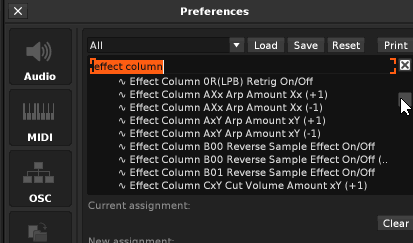


---
### 2024-06-16 - esaruoho

Improvement: Been working a bunch on making Menu Entries better and more organized, here's Keyzones


---
### 2024-06-16 - esaruoho

Improvement: "Wipe Song Retain Sample" now no longer errors if the Instrument you selected has no sample.

---
### 2024-06-16 - esaruoho

WIP Improvement: Instrument Box Menu Entries are better organized
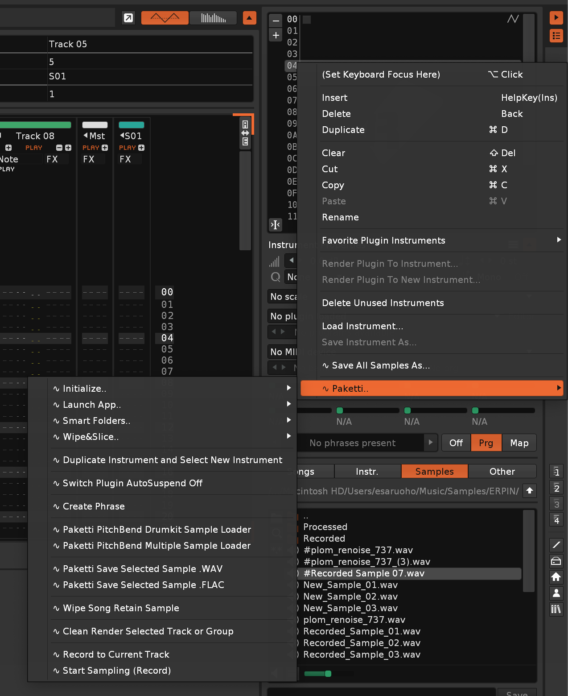

---
### 2024-06-16 - esaruoho

Improvement: Wipe & Slice no longer shoots an error if there is no sample in the instrument.  - instead shows a status "No samples available in the selected instrument".

---
### 2024-06-16 - esaruoho

Improvement: Wipe & Slice will tell you how many slices have been added to the instrument, and reference the sample name.


---
### 2024-06-16 - esaruoho

Improvement: Wipe & Slice will tell you when you've wiped all slices
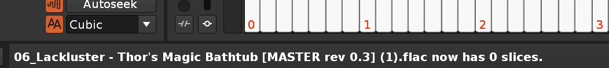

---
### 2024-06-16 - esaruoho

Improvement: LoopBlock "2nd binds" made available with matching naming convention to what Renoise provides


---
### 2024-06-16 - esaruoho

Improvement: Enable / Bypass EFX in Pattern now uses the right commands to bypass the first 8 effects, or enable the first 8 effects. (Meaning: now compatible with Renoise 3)
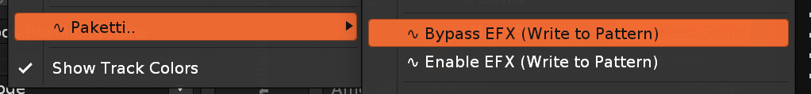

---
### 2024-06-16 - esaruoho

Backend Improvement: there's now a global function for giving a XML Preset and loading it directly to a plugin. which'll be useful in the future for loading XML content into active_preset_data for a plugin or a device.

---
### 2024-06-16 - esaruoho

Improvement: Whenever saving a script, or saving a song, or loading a new song, or creating a new song, or loading a sample, the view_preset1 would be forcibly shown. I've removed that since it benefits no-one - the viewport should stay the same no matter what

---
### 2024-06-17 - esaruoho

Improvement to ImpulseTracker "ALT-L *2" functionality. Now, if you are on Send or Master, and press ALT-L, it will select the content of the Send or Master track. when you press ALT-L again, it will select all of the pattern data (including sends + masters). instead of "only the tracks and not sends + masters".


---
### 2024-06-17 - esaruoho

Fixed: when using Pattern Doubler to double a 256 row pattern to 512 - and the pattern has automation, there used to be an error shot. now no error is shot no more and the automation works as expected.

---
### 2024-06-17 - esaruoho

Improvement: Sample Navigator now has the "Mono to Stereo" & "Mono to Left, Right Blank" & "Mono to Right, Left Blank" entries and they're sorted correctly


---
### 2024-06-17 - esaruoho

improvement: tweaked the naming convention of "Bypass EFX (Write to Pattern)" and "Enable EFX (Write to Pattern)".
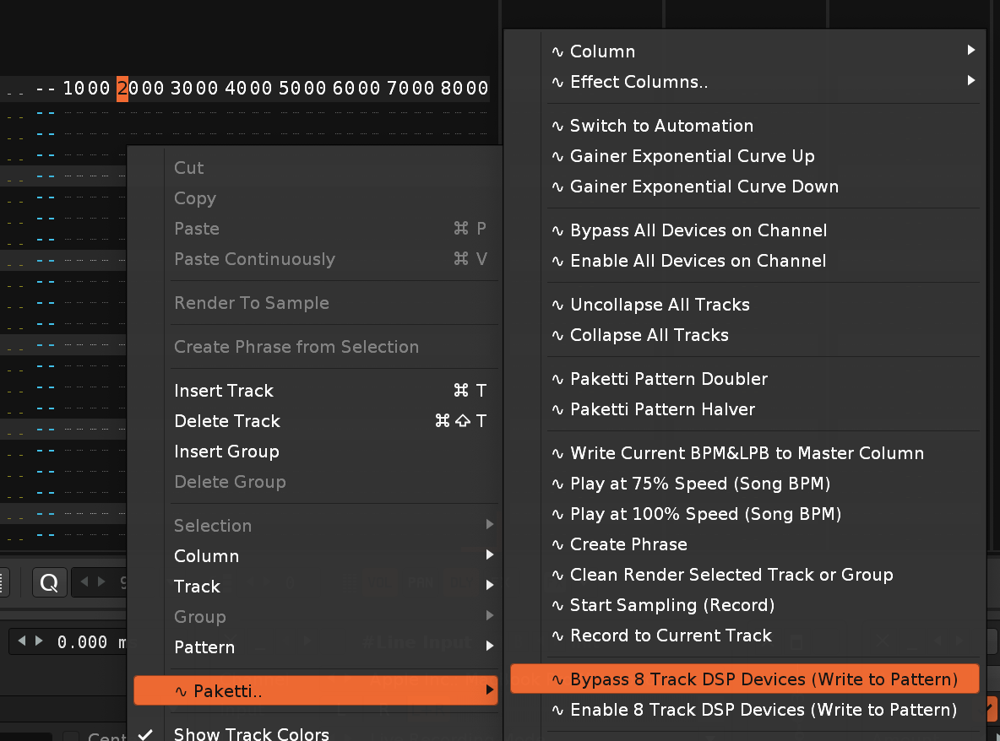

---
### 2024-06-17 - esaruoho

Improvement: Paketti PitchBend DrumKit Loader now correctly sets LoopMode + Sample Interpolation for each of the samples loaded into the drumkit.

---
### 2024-06-17 - esaruoho

Improvement: Bypass EFXs are now grouped together
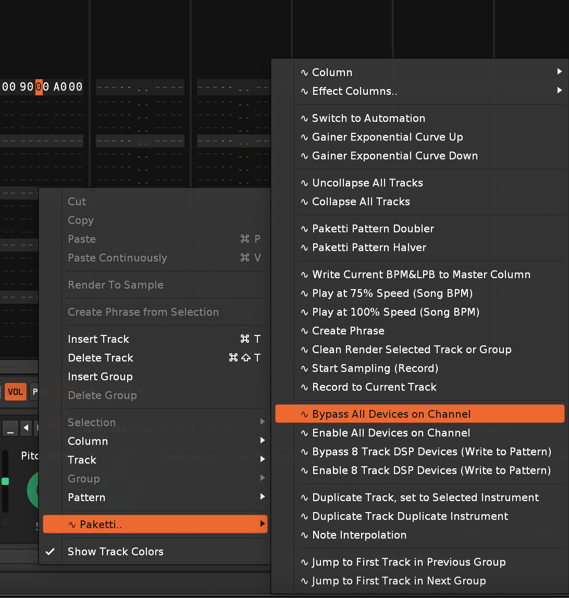

---
### 2024-06-17 - esaruoho

Improvement: had to switch from vb:switch for loop release to vb:checkbox -  - but now the preferences actually work properly. for loading samples and for slicing.

this Loop Release mode, coupled with Backward - means that whenever you let go of the playing slice, it will start playing backwards until the beginning of the sample is reached.


---
### 2024-06-17 - esaruoho

Feature: "Jump to First Track in Next Group" & "Jump to First Track in Previous Group" - as requested by icasiino - 
pretty much does what it says on the tin - if there are no groups, then it doesn't do anything.


---
### 2024-06-17 - esaruoho

Improvement: 24st_pitchbend, 36st_pitchbend, 48st_pitchbend, 64st_pitchbend, 96st_pitchbend loaders updated with macros set up .. these init instruments were lagging behind from 12st_pitchbend which had all the goodies
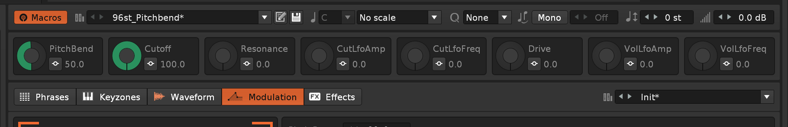

---
### 2024-06-17 - esaruoho

Improvement: Pattern Editor Cheat Sheet: added "0Yxx" (Maybe), "0Zxx" (Trigger Phrase) - tweaked order of effects so they match https://forum.renoise.com/t/effect-commands-cheat-sheet/45512 .. 
more tweaks incoming later (additional efx, grouping)
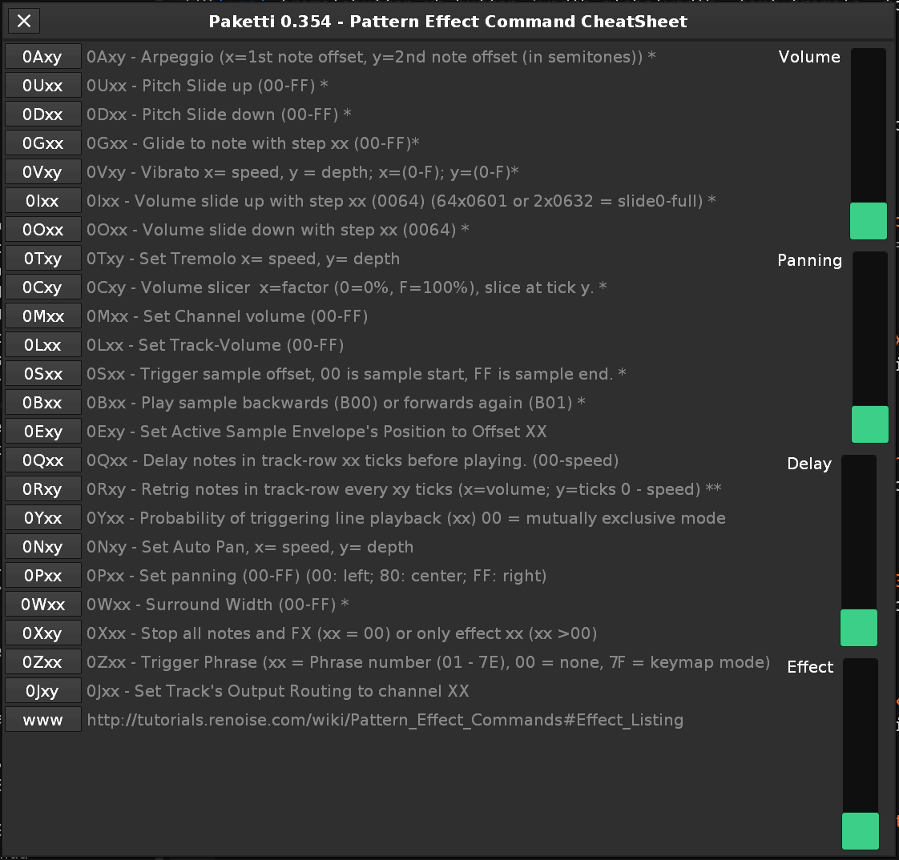

[Effect Commands Cheatsheet (Renoise Forum post, printable PDF by someone else)](https://forum.renoise.com/t/effect-commands-cheat-sheet/45512)

---
### 2024-06-18 - esaruoho

Feature: Globally Enable / Disable Volume Column, Panning Column, Delay Column, Sample FX Column. Available in Global:Tools:Paketti..:Pattern Editor, and Pattern Editor:Paketti..:  menu entries, and also as shortcuts. 

these change the Column Visibility of all regular Tracks to On/Off (Toggle) or Set to Visible.
(found this on a Renoise Forum post by ViZiON from 2008)
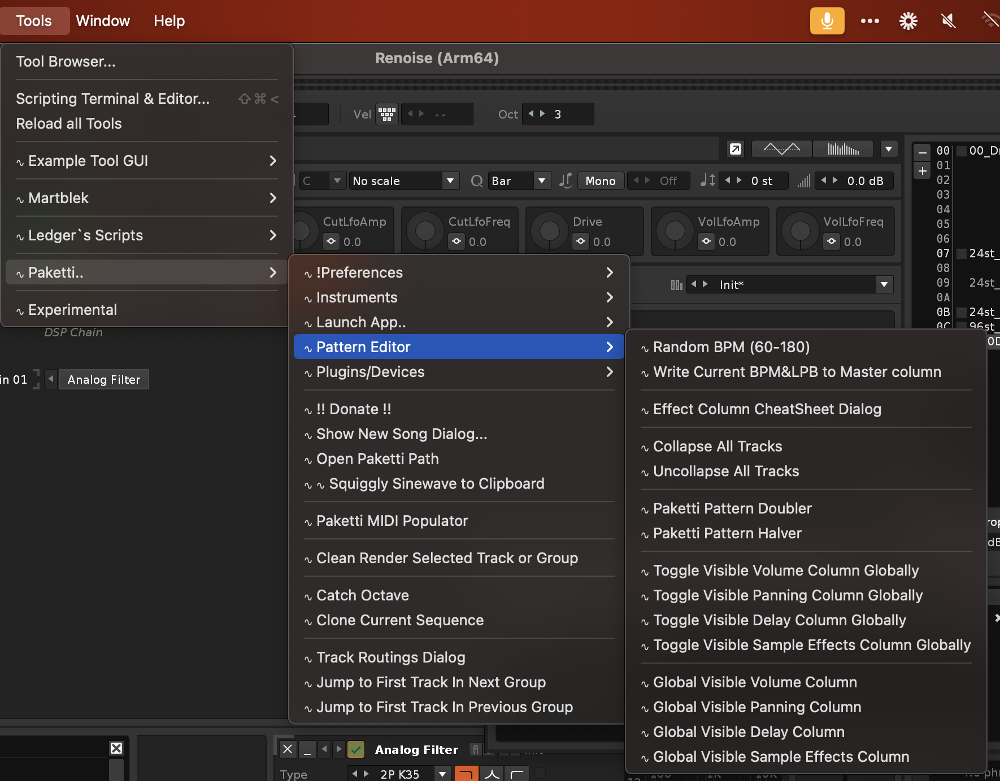


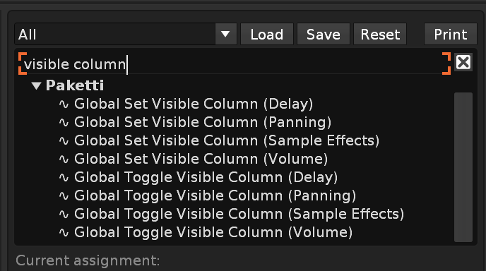


---
### 2024-06-18 - esaruoho

Improvement: Globally / Enable Visible Columns are now also visible on View -> Paketti.. -> Pattern Editor -> submenu
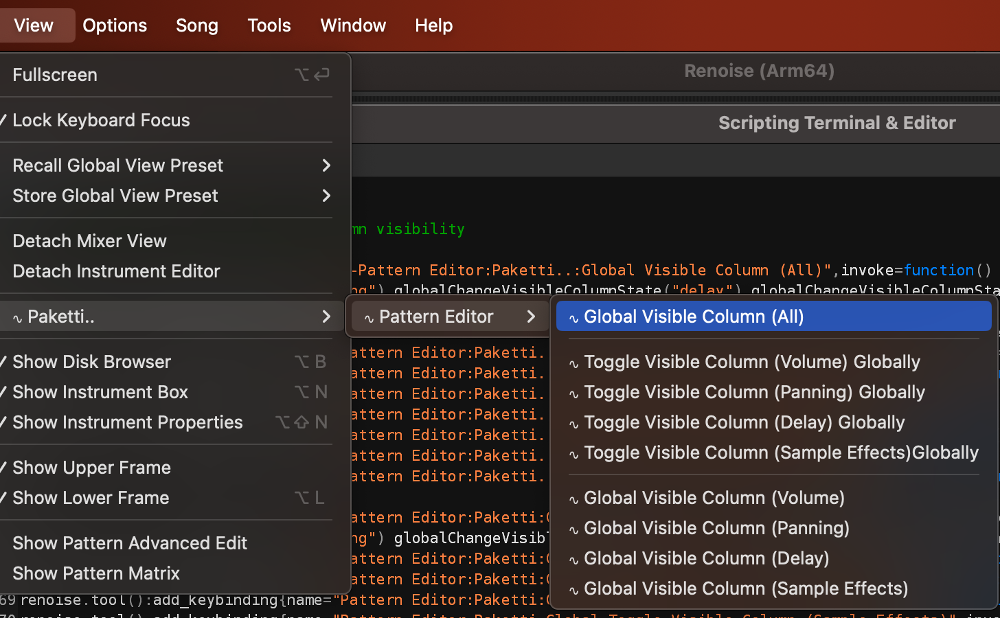


---
### 2024-06-18 - esaruoho

Improvements: `Bypass all Effects on Channel` now shows status `Disabled all Track DSP Devices on Selected Channel`
`Enable all Effects on Channel` now shows status `Enabled all Track DSP Devices on Selected Channel`

Tweaked most Track DSP Device hiding shortcuts + menu entries to make mention of "External Editor"
and added `"All open External Editors for Track DSP & Sample FX Chain Devices have been closed."`  and `"No Track DSP or Sample FX Chain Device External Editors were open, did nothing."` for informing the user what is going on.

this show_status thing will need to be done for hundreds of functions so whenever you see one that doesn't tell you what it does, hit me up and i'll tweak it in. there's too many for it to be doable in one go.


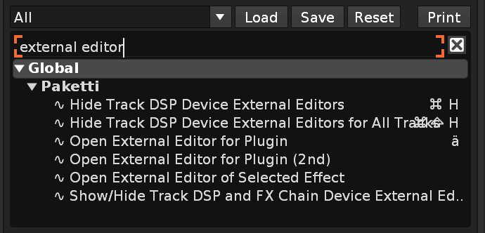


---
### 2024-06-19 - esaruoho

Feature: `Bypass All Other Track DSP Devices (Toggle)` as a keyshortcut, menu entry for Mixer + Track DSP  (Lower Frame) -- as requested  by untilde
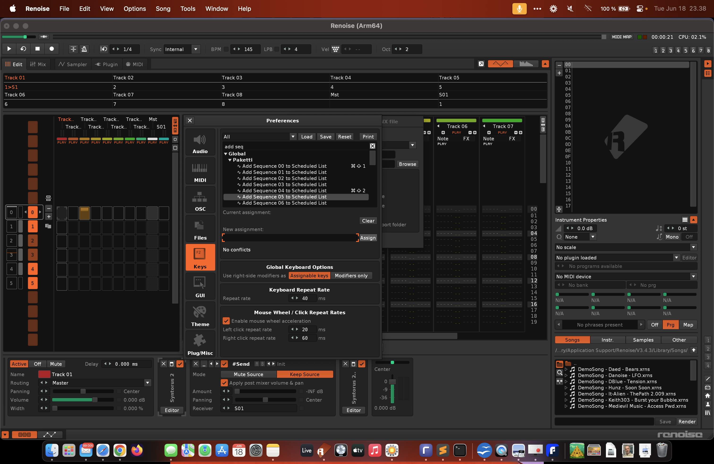


---
### 2024-06-19 - esaruoho

Improvement: "Jump to First Track in Next Group" & "Jump to First Track in Previous Group" shortcuts added to Pattern Matrix -- as requested by icasiino
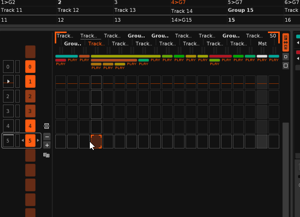


---
### 2024-06-19 - esaruoho

Improvement: 12st, 24st, 36st, 48st, 64st, 96st + drumkit loaders / init instruments now correctly map Cutoff knob to Cutoff, instead of.. Volume.. 🫢 🤦‍♂️

---
### 2024-06-19 - esaruoho

Improvement: added "Mono to Stereo, Mono to Left, Mono to Right" to Sample Mappings (=Keyzones) menu


---
### 2024-06-20 - esaruoho

Improvement: "Mono to Stereo" "Mono to Left with Right Blank", "Mono to Right with Left Blank" now retain basenote and other key mapping settings, and are put into the same sample slot as previously (meaning instruments with multiple samples will retain their organization correctly).

---
### 2024-06-21 - esaruoho

Improvement: if 0G01 Loader is ON and you Wipe&Slice - new tracks are no longer created for slicecount (if you sliced a sample to 128 slices, you'd get 128 tracks) now you no longer need to protect yourself by disabling 0G01 Loader in order to wipe&slice and then re-enable 0G01 Loader -- the wipe&slicer just does the ad-hoc disable at the start of wiping&slicing, and then just re-enables it, if it was enabled. (this closes https://github.com/esaruoho/org.lackluster.Paketti.xrnx/issues/183 )

---
### 2024-06-21 - esaruoho

Feature: AppSelection GUI now includes method for setting three Smart Folders (for macOS use), instead of hardwiring them to /Users/esaruoho/Music/samples/LogicSmartFolder + /Users/esaruoho/Music/samples/LiveSmartFolder..
I've also removed `sox` usage for adjusting 32bit samples to 24bit samples, which is no longer needed since Logic Pro can handle 32bit wavefiles nowadays.

NOTE: if there are apps out there that can't handle 32bit wavefiles, please tell me which ones they are, so i can try them out and add "adjust to 16bit" "adjust to 24bit" next to the Smart Folder path buttons.

(this closes  https://github.com/esaruoho/org.lackluster.Paketti.xrnx/issues/161 )


---
### 2024-06-21 - esaruoho

Improvement: If you try to save sample or samples to a Smart Folder that is not set - an error is shown on the status and the Smart Folder GUI opens up
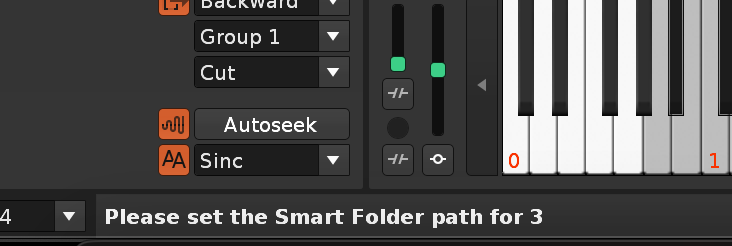

---
### 2024-06-21 - esaruoho

Feature: Create Identical Track.
if your track has X amount of Note Columns, Effect Columns, Panning, Delay, Volume, Sample FX Columns visible or the track is collapsed -- (or if none of these are visible or on), the "Create Identical Track" shortcut will create a Track that matches the track you were on.
closes https://github.com/esaruoho/org.lackluster.Paketti.xrnx/issues/208
(as requested by ViZiON on the Renoise Forums in January2009)


---
### 2024-06-21 - esaruoho

Feature: Randomize Selected Device Parameters:
<div style="position: relative; padding-bottom: 64.90384615384616%; height: 0;"><iframe src="https://www.loom.com/embed/52748313bf284544976bf7f90b62e6c6?sid=a2142966-d532-49d2-adbc-2aca8bd751fa" loading="lazy" frameborder="0" webkitallowfullscreen mozallowfullscreen allowfullscreen style="position: absolute; top: 0; left: 0; width: 100%; height: 100%;"></iframe></div>

https://www.loom.com/share/52748313bf284544976bf7f90b62e6c6?sid=b3198df4-229b-47e0-a5ce-465ca11f90e6

---
### 2024-06-21 - esaruoho

Feature: Randomize Selected Instrument (All) Plugin Parameters .. but since it randomizes each parameter, you might have a bad time if the synth sets itself to not play anything (outputs that you're not listening to, etc..)

---
### 2024-06-21 - esaruoho

Improvement: Randomize Selected Device Parameters now shows the name of the device that was randomized.
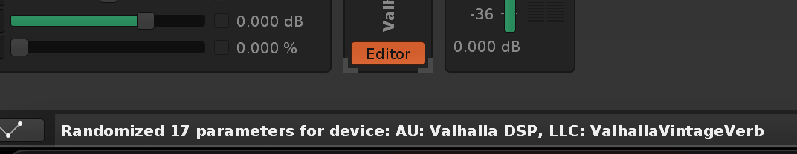

---
### 2024-06-21 - esaruoho

Feature: LADSPA/DSSI Device loader (shortcut + midimapper) GUI created. if you have Linux, please DM me and i'll send you a xrnx and please take some video + screenshots, i can't test how it works myself.
EDIT: there's apparently some noisy devices there that have a really long name (looking at you: 
```
721  Audio/Effects/LADSPA/lsp-plugins-ladspa.so:http://lsp-plug.in/plugins/ladspa/sc_mb_dyna_processor_stereo
```
fun. but shoot me some screenshots + video  so i can pick up the pieces. seems to work anyway.

---
### 2024-06-21 - esaruoho

Improvement: Gainer Exponential Curve Up, Gainer Exponential Curve Down now goes from 0.0dB to INF or from INF to 0.0dB - instead of to "12.5dB" - thus boosting the input signal by +12dB.
fixes https://github.com/esaruoho/org.lackluster.Paketti.xrnx/issues/171

usecase: make a way to fade in a sound by adding a gainer device to the track and fading sound in or sound out.


https://github.com/esaruoho/paketti/issues/171

---
### 2024-06-22 - esaruoho

Improvement: Moved "Jump to First Track in Next Group" & "Jump to First Track in Previous Group" to Main Menu:Tools:Paketti..:Pattern Editor:


---
### 2024-06-22 - esaruoho

Improvement: Added "Create Identical Track" to Tools->Paketti.. -> Pattern Editor
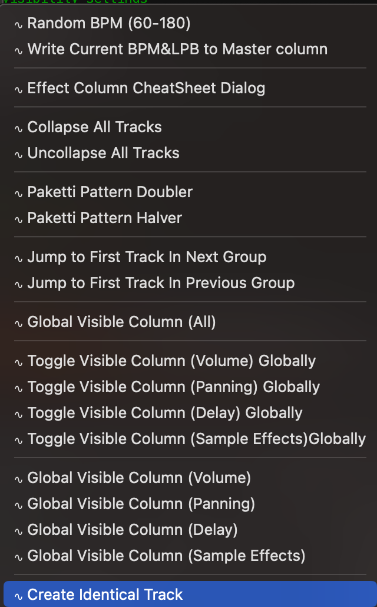

---
### 2024-06-22 - esaruoho

Improvement: Added "Randomize Selected Instrument Plugin Parameters" &."Randomize Selected Device Parameters" to Tools->Paketti..->Plugins/Devices
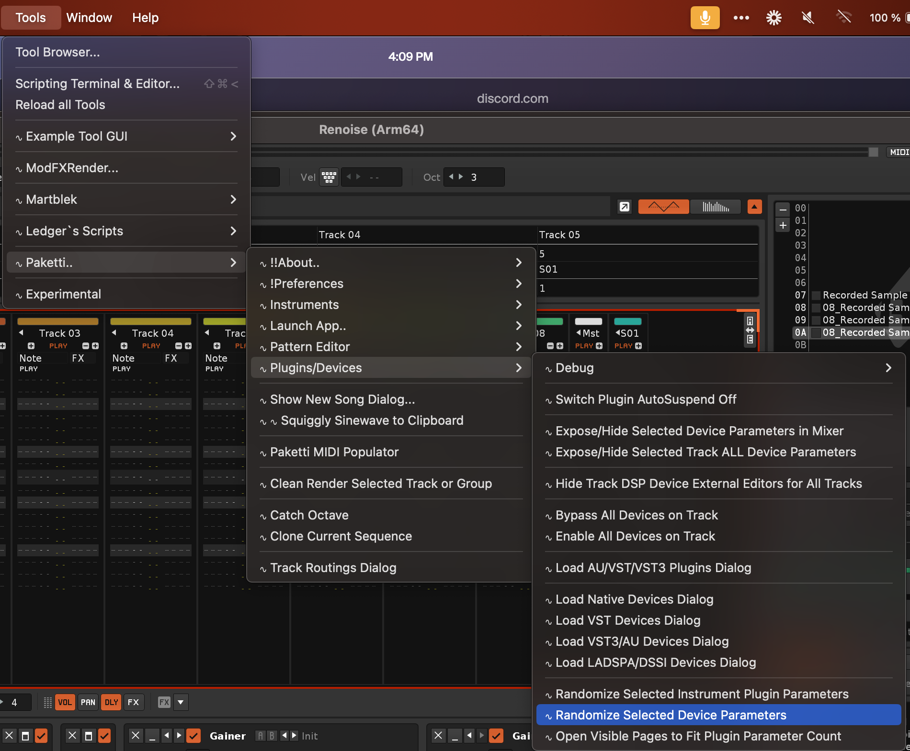

---
### 2024-06-22 - esaruoho

Feature: Move Slice End Left/Right by +10/-10, +100/-100, Move Slice Start LeftRight by +10/-10 +100/-100:
this means that you can be in the slice itself, and adjust the slice visually with nudges.


---
### 2024-06-22 - esaruoho

Improvement: Wipe Slices (in Wipe&Slice suite of features) now will properly wipe all slices from the sample even if a slice was selected when you wipe slices. (it used to do nothing)

---
### 2024-06-22 - esaruoho

Improvement: If there are no apps configured in App Selection, the dialog does not forcibly open on every new song, Renoise start, etc. Just a show_status message instead:
```
No apps have been configured in Paketti..:Launch App..:Configure Launch App Selection, cannot populate Menu.
```

---
### 2024-06-22 - esaruoho

Improvement: if no LADSPA or DSSI devices found on computer, display a sensible message (`No LADSPA/DSSI Devices found on this computer.` )  instead of ruining the GUI by making the buttons not show properly

---
### 2024-06-22 - esaruoho

Improvement: if no AU, VST or VST3 plugins found on computer, display a sensible message ( `No AudioUnit Plugins found on this computer.` or `No VST Plugins found on this computer.` or `No VST3 Plugins found on this computer.`) instead of ruining the GUI by making the buttons not show properly

---
### 2024-06-23 - esaruoho

Feature: Solo Selected Track in Group using Note Column Mute:
closes https://github.com/esaruoho/org.lackluster.Paketti.xrnx/issues/106
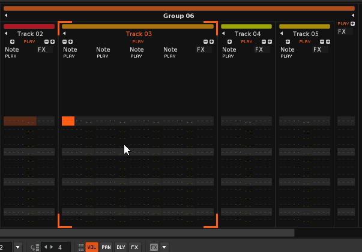

---
### 2024-06-23 - esaruoho

Improvement: +300/-300 +500/-500 for both Slice Start & Slice End:
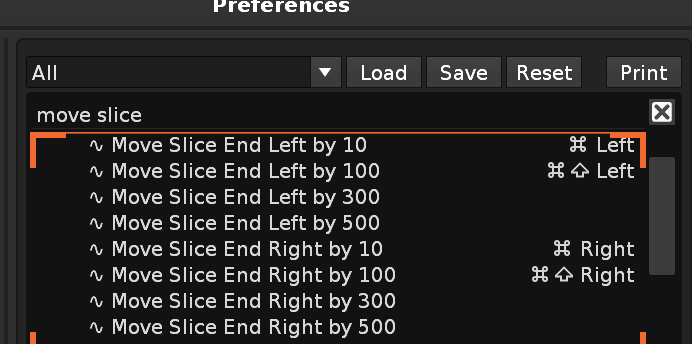


---
### 2024-06-23 - esaruoho

Improvement: Midi Mapping Sample FX Column knob now shows the Sample FX Column, for better visibility.


---
### 2024-06-23 - esaruoho

Improvement: Midi Change 01 Volume Column Value / 02 Panning Column Value / 03 Delay Column Value / 04 Sample FX Value: 
if you have nothing selected, it'll output to current_line row. if columns are not visible, they are made visible. if you have a selection, then the whole selection will be changed by midi knobs.

<div style="position: relative; padding-bottom: 64.90384615384616%; height: 0;"><iframe src="https://www.loom.com/embed/3af37cfeac9a4aa78834d7b6c74b7f36?sid=8448be8d-8f03-469a-a7a2-12df1888add2" loading="lazy" frameborder="0" webkitallowfullscreen mozallowfullscreen allowfullscreen style="position: absolute; top: 0; left: 0; width: 100%; height: 100%;"></iframe></div>

https://www.loom.com/share/3af37cfeac9a4aa78834d7b6c74b7f36?sid=0285c5a2-1d7b-4c83-820c-e9e07f40a52f

---
### 2024-06-23 - esaruoho

Feature: Selected Device Parameter Randomizer Dialog.
Offers a slider for controlling percentage of randomization
auto-updates to new device if you select a new device.
<div style="position: relative; padding-bottom: 64.90384615384616%; height: 0;"><iframe src="https://www.loom.com/embed/6358542ad6db449daf581421653548fa?sid=710584ec-3e0c-47ae-9e3b-9da0abecefba" loading="lazy" frameborder="0" webkitallowfullscreen mozallowfullscreen allowfullscreen style="position: absolute; top: 0; left: 0; width: 100%; height: 100%;"></iframe></div>
https://www.loom.com/share/6358542ad6db449daf581421653548fa?sid=aee4ccb0-2738-4214-933d-0bd5c50eb163
---
### 2024-06-23 - esaruoho

Improvement: BPM +0.1 / BPM -0.1 (in addition to +1/+5/-5/-1 already being there since 14 years ago in Paketti.) this is ripped straight from the ModPlugTracker playbook:
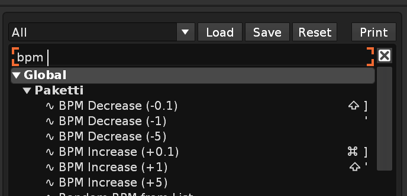

---
### 2024-06-23 - esaruoho

Improvement: Randomize Selected Device Parameters Dialog now updates if no Device is selected. also, after clicking on the Randomize button, the keyboard focus is returned to Renoise / the Tracker, so you can continue shortcutting+keyjazzing.

---
### 2024-06-24 - esaruoho

Feature: "Duplicate Effect Column Content to Pattern"


---
### 2024-06-24 - esaruoho

Improvement: "Duplicate Effect Column Content to Pattern or Selection" -> if something is selected, your current row effect parameter is input to selection.. if nothing selected, then the whole pattern gets the effect parameter input

---
### 2024-06-24 - esaruoho

Feature: "Randomize Effect Column Parameters for Pattern or Selection"


---
### 2024-06-24 - esaruoho

Feature: Effect Column Interpolation for Selection or Pattern.


---
### 2024-06-24 - esaruoho

Feature: Flood Fill Selection or Track with Instrument + Note:


---
### 2024-06-24 - esaruoho

Improvement: now all Plugin parameters can be randomized, or all plugins in the whole song can be randomized.  same GUI as Selected Track Device & All Devices on Selected Track.


---
### 2024-06-25 - esaruoho

Improvement: If currently selected instrument has no plugin, Randomize Devices & Plugins dialog will still open.
If there are no plugins in the song, then Randomize All Plugins will show_status stating there are no plugins, instead of saying "yes, randomized all plugins in song". and in the same situation, "Show/Hide all Plugin External Editors" will also show a status.
and visual update: the fourth column now has empty space before the "Randomization intensity (%)" line to better line up.
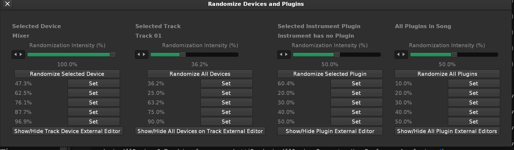

---
### 2024-06-26 - esaruoho

Feature: Impulse Tracker ALT-Left / ALT-Right (two flavors, one that Wraps (last track to first track.. or first track to last track), and another that doesn't wrap (press alt-left enough, and you'll be in first track but that's it.. same for alt-right)))


---
### 2024-06-28 - esaruoho

Feature: Impulse Tracker "Slide Content Up / Down". this takes Selected Track.. or Selected Note Column or Selected Effect Column. will slide it up and down.


---
### 2024-06-28 - esaruoho

Feature: Solo Tracks - if no pattern selection - then mute currently selected track. if current track is selected or has selection, mute that. draw selection around multiple tracks and run shortcut = all other tracks are muted. or unmuted.


---
### 2024-06-28 - esaruoho

Improvement: Note Interpolation now works on any note column on the track. same with selection. and.. if you have multiple note columns selected, and there's notes there at the start + end of pattern rows, the interpolation will happen. and if you have a selection within a track, the note interpolation will happen for the whole selection.


---
### 2024-06-28 - esaruoho

Feature: ALT-Y "Swap Block" straight from ImpulseTracker2/SchismTracker/ScreamTracker3(?)


---
### 2024-06-28 - esaruoho

Improvement: Alt-Y will now work with tracks that don't have "enough" note columns, they will be resized. and now this can be used for multiple note columns, and to the track you're at.


---
### 2024-06-29 - esaruoho

Improvement: Transpose +12 / -12 / +1 / -1  so that if nothing is selected in the pattern, it will transpose the whole selected_track. if something is selected in the pattern, then it'll transpose the selection.
Feature: Transpose +12/-12/+1/-1 for selection, or just current note column.

both of these transposes actually go from C-9 to C-0 if you keep transposing.


---
### 2024-06-29 - esaruoho

Feature: Duplicate Instrument and Reverse Sample -- this just takes your currently selected instrument, duplicates it below it, and reverses the samples in the instrument. (and selects the newly created reversed instrument)

---
### 2024-06-30 - esaruoho

Improvement: F5 "Impulse Tracker Play" used to have a 0.4 second delay after Panic + playback starting. it was to avert plugins from crashing (F5 is a macro that stops playback, runs Renoise Panic (to kill all audio) and then starts playback with follow pattern = on)) - now i cut it down to 0.225second, so it "feels less sluggish".

---
### 2024-07-01 - esaruoho

Feature: Paketti Renamer - shortcut + menu entry for renaming a track. opens a dialog with current name highlighted, you can type, press enter -> renaming done. works for master, send, group, track.
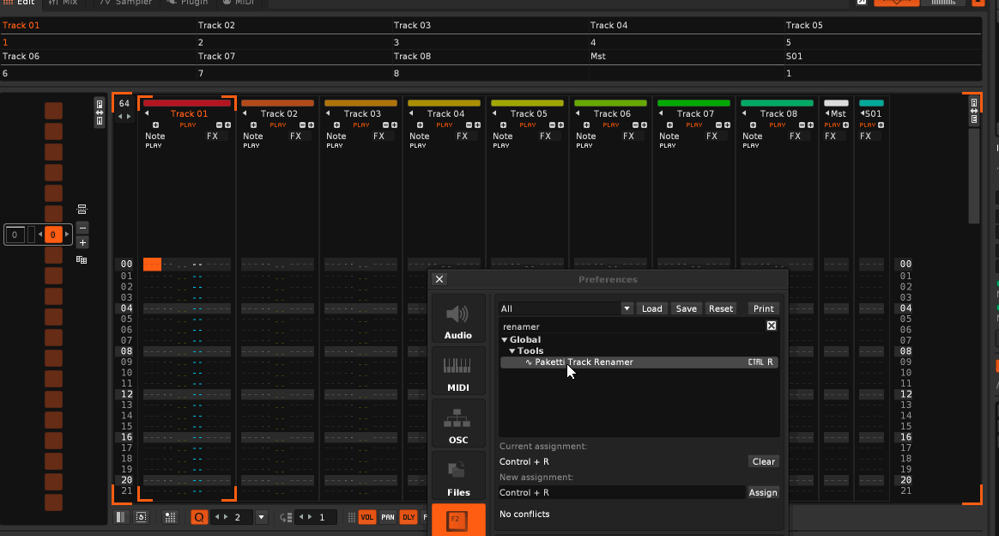

---
### 2024-07-01 - esaruoho

Improvement: Now Paketti Track Renamer reads selection-in-pattern for multi-track renaming one at a time.
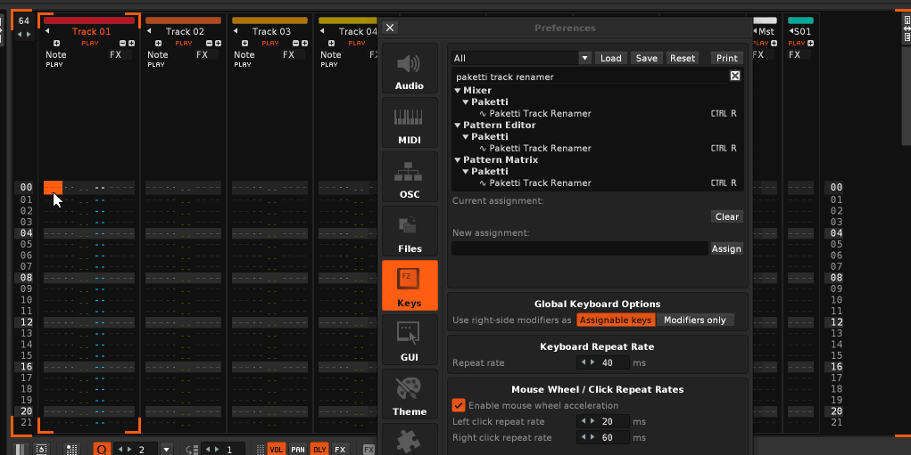

---
### 2024-07-04 - esaruoho

Improvement: "Wipe Plugins" added to CTRL-N, it will look through all the instruments and clear the plugins from the instruments.
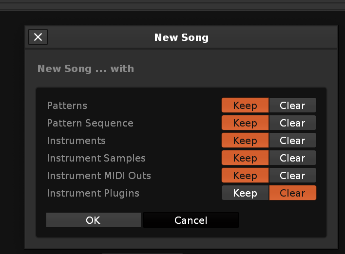

---
### 2024-07-05 - esaruoho

Improvement: Added the Note-On to Note-Off (with transpose) copying to Sample Navigator, since i went there to try and run it and realized it's not there. it's now in sample editor, sample mappings, and sample navigator.
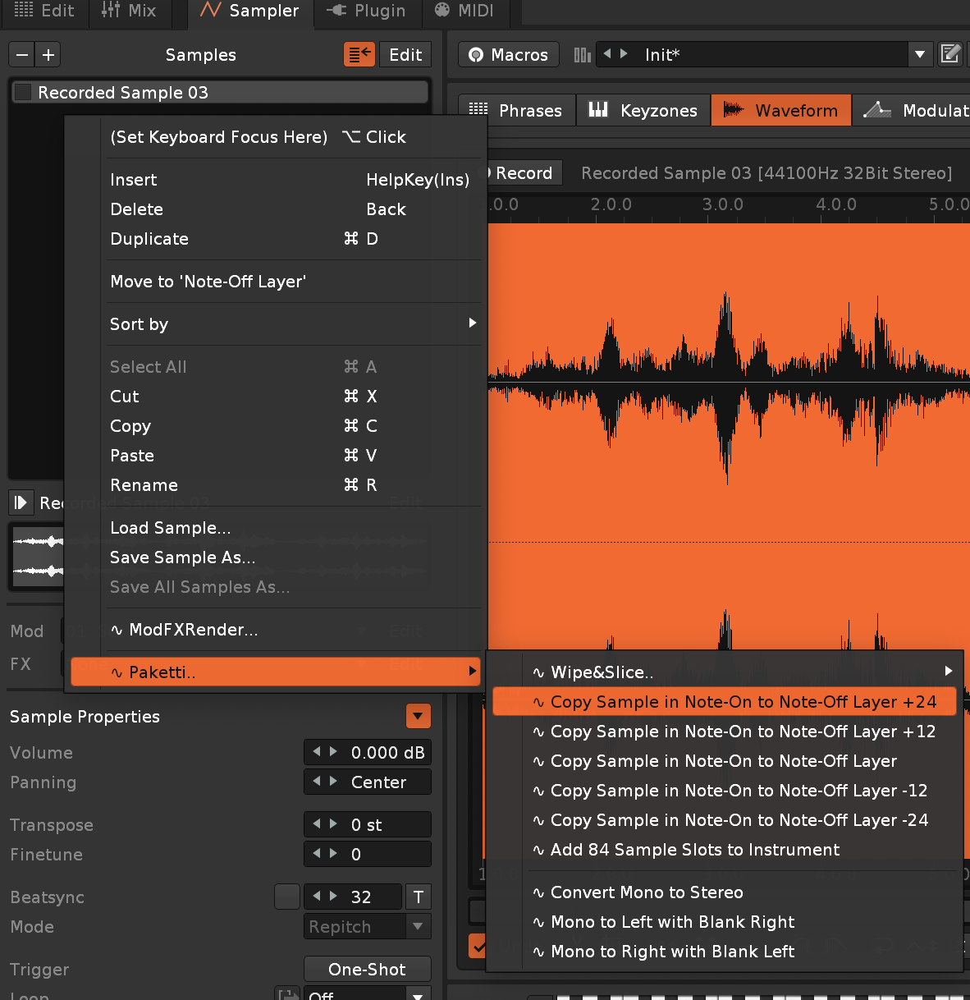


---
### 2024-07-05 - esaruoho

Improvement: Solo Tracks will now:
- Work if the selected track is a Send - the rest of the Sends + Tracks are muted.
- Mute Sends if selected track is a Track, or if Selection In Pattern covers tracks.
- Work if Selected Track is within a Group - mutes the rest of the Tracks within the Group, but keeps the Group playing.
- If you Selection in Pattern say tracks4-5, and run shortcut, and then move Selection In Pattern to 5-6 and run shortcut, 5-6 will be unmuted and the rest muted. this used to mess up.
- Master is ignored and is not allowed to shoot error. (i.e. script no longer tries to mute Master for no reason.)

still ironing out 4 other issues, then it's ready. .. 🫢

---
### 2024-07-05 - esaruoho

Feature: Isolate Slices to New Instruments - this takes the slices in your sliced instrument, and copies all their settings and modes, and creates new instruments, naming them according to the slice.
available in Sample Editor, Sample Navigator, Sample Mappings and Instrument Box. and a global shortcut.
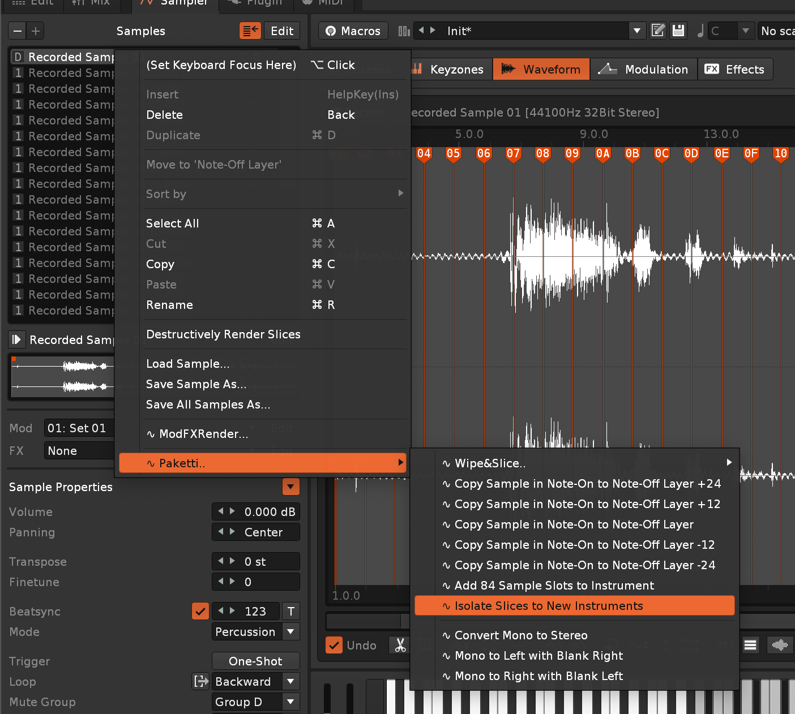


---
### 2024-07-05 - esaruoho

Feature: Reverse Notes in Selection
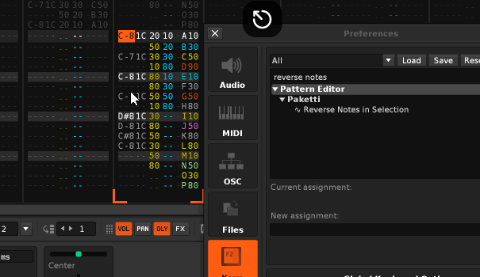


---
### 2024-07-05 - esaruoho

Improvement: Load Native Devices Dialog can be opened multiple times instead of only once (and then the gui fails to render)

---
### 2024-07-05 - esaruoho

Improvement: the Smart Folders segment of this dialog has been, more understandably, modified to include "Backup Folders" and for the buttons to refer to "Folders" instead of "Smart Folders" - because the usecase is of course that you can set the folder of your choice to be a folder that's a smart folder (macOS) or any folder (such as a backup folder). think "folder 1 = drums, folder 2 = melodies, folder 3 = pads" or something like that


---
### 2024-07-05 - esaruoho

Improvement: End *2 now actually first takes you to last row of current note column, and on second press, to the last track last row.

---
### 2024-07-05 - esaruoho

Feature: Send Populator for Selected Track or All Tracks.
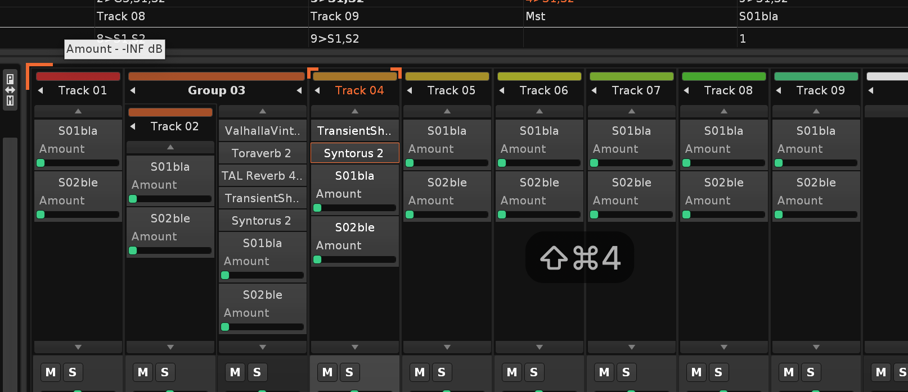


---
### 2024-07-06 - esaruoho

Feature: Flood Fill Note & Instrument with Edit Step - this takes the Edit Step and fits the currently selected line note + instrument to it, or if you have a multi-track selection, it will take the current row and fill the selection with the note+instrument using editstep.
<div style="position: relative; padding-bottom: 64.90384615384616%; height: 0;"><iframe src="https://www.loom.com/embed/2dc0c84c97dc4dcc9c5125671e6b1da2?sid=1e5f9784-6265-47de-b622-eb39cc463ab5" loading="lazy" frameborder="0" webkitallowfullscreen mozallowfullscreen allowfullscreen style="position: absolute; top: 0; left: 0; width: 100%; height: 100%;"></iframe></div>
https://www.loom.com/share/2dc0c84c97dc4dcc9c5125671e6b1da2?sid=081e5637-a092-4299-ac49-7433e90d344a
---
### 2024-07-06 - esaruoho

Improvement: Load Native Devices Dialog now has "Randomize Selection" as a possibility.  it will clear the current selection, and then select a random amount of devices.


---
### 2024-07-06 - esaruoho

Improvement: Load VST Devices Dialog also has "Randomize Selection"


---
### 2024-07-06 - esaruoho

Improvement: Load VST3/AudioUnit Randomize Selection
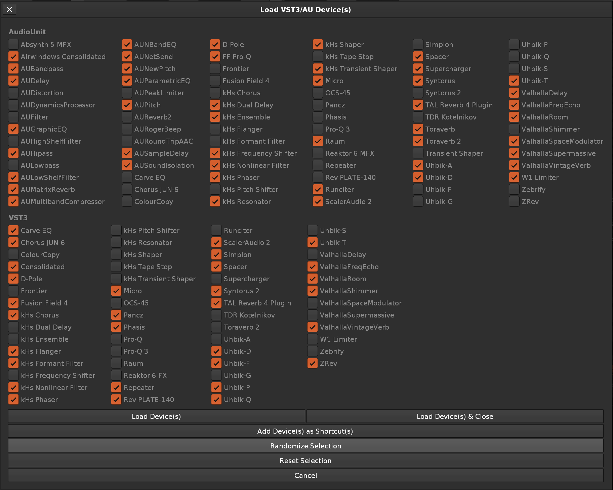


---
### 2024-07-06 - esaruoho

Improvement: Load VST3/VST/AudioUnit Plugins Randomize Selection:


---
### 2024-07-06 - esaruoho

Improvement: Plaidzap gift now uses the macros (pitchbend,cutoff,resonance,cutoffLFOAmount,cutoffLFOFreq,Overdrive,VolLFOAmount,VolLFOFreq

---
### 2024-07-06 - esaruoho

Feature: Unison Generator.. creates 6 samples  and finetunes them by -1 +1 -2 +2 -3 +3 and adjusts the sample startpoint by fractions (1/8 to 7/8) so they're slightly offset


---
### 2024-07-08 - esaruoho

Feature: You can now Export the Convolver IR to a new Instrument, which will export it and then show the Sample Editor. You can also, after modifying, Import the Selected Sample back to the Selected Device (Convolver).
if anyone's into IRs, please DM me and I'll send a build and we can continue looking at this - i need plenty of IRs to make sure it all works

---
### 2024-07-08 - esaruoho

Improvement: There's now a connection between 0G01 loader and Paketti PitchBend Multiple Sample Loader - if 0G01 loader is set to On, then new tracks will be created per each loaded sample, and each track will cleanly have a instr automation device added, so there's no longer a flood of instr automation devices for the track you were on, i.e. you load 36 samples and there's 36 instr automation devices on selected_track.

closes https://github.com/esaruoho/org.lackluster.Paketti.xrnx/issues/191

---
### 2024-07-10 - esaruoho

Improvement: Export / Import Convolver IR file feature now offers a GUI for also importing to convolver or exporting from convolver, and the gui allows for using shortcuts while open, so you can select a new sample to be imported to a Convolver of your choice. it also will update when you select a different sample, it allows you to add a Convolver to the start of the Track DSP Chain or the end of it, and you can import or export from any of them.
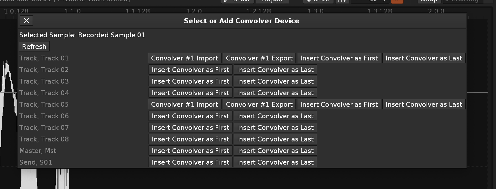

---
### 2024-07-10 - esaruoho

Feature: Set Master Track Output Routings 00...32 - this changes the Master Track Output.


---
### 2024-07-10 - esaruoho

Improvement: Set Master is now 0...63
Selected Track Output Routing is now 0...63

---
### 2024-07-11 - esaruoho

Feature: MidiMapping Knob 0...127 for Selected Track Output Routing, and Master Track Output Routing:


---
### 2024-07-12 - esaruoho

Feature: MidiMapping Buttons for Selected Track Output Routing, and Master Track Output Routing:  0...63
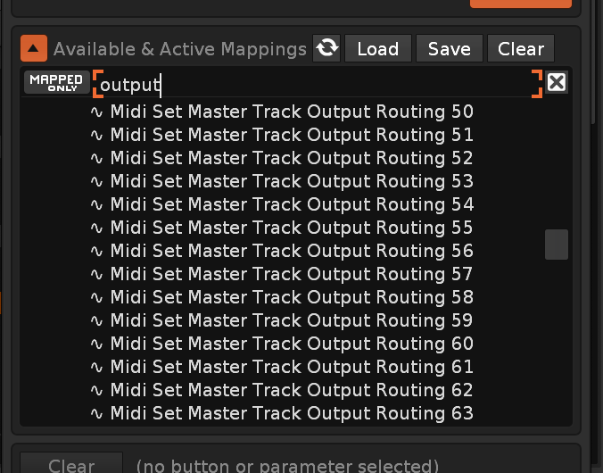

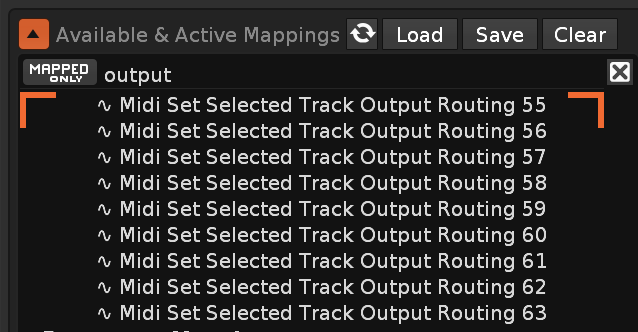


---
### 2024-07-13 - esaruoho

Feature: a brand new donation dialog with buttons for donating via ko-fi, bandcamp or PayPal, and with a list of people who donated, how much, and links to their pages as promotion.

---
### 2024-07-14 - esaruoho

Feature: PlayerPro Note Dialog - lets you output selected instrument and note to row if nothing selected.. if there's a selection_in_pattern, and you press a note, the selected instrument + clicked on note will appear in the selection.
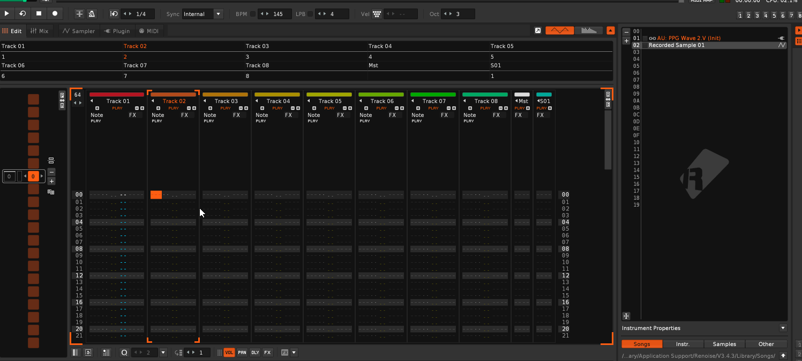


---
### 2024-07-15 - esaruoho

Feature: Set Master Track Volume +0.1dB / -0.1dB, with clamping at -INF and 3dB.

---
### 2024-07-16 - esaruoho

Feature: Paketti eSpeak Text-to-Speech, tested with macOS & Linux.
This supports both `espeak` and `espeak-ng` 
it is an improvement over Martblek's abandoned ReSpeak. (Martblek gave permission to take his work and improve upon it)

Supports: 
- Loading textfiles and rendering
- selection from text can be rendered
- same shortcut that opens the dialog, renders the sample
- espeak path is stored  in Preferences
- settings stored in Preferences
- Sample Editor is brought up after rendering, so you can see what happened
- Can select whether new instrument is rendered or sample.
- User setting: every voice/language change will render a new sample / new instrument. (dropdownmenu & +/- changes for quickly changing the voice / language) -> means when you  hit +/- it'll render a new instrument every time.
- Languages sorted alphabetically


---
### 2024-07-16 - esaruoho

Improvement: if you have no MIDI input devices and/or MIDI output devices, the Paketti Midi Populator no longer errors out and stops working.

---
### 2024-07-18 - esaruoho

Improvement: Switch to Automation will now switch back to TrackDSPs if Automation is already displaying

---
### 2024-07-18 - esaruoho

Feature: Resize & Fill. (available in Pattern Editor menu, Tools menu, and as a shortcut). this takes your pattern (and pattern automation) and expands until you have a pattern of 032, 064, 128, 256, 512 rows. so if you have a 4 row pattern, and you press "Resize & Fill 128" - the 4 row pattern changes to 128 rows, and the content is duplicated 32 times. 
if, however, you have a 512 row pattern and you press "resize&fill 032" - it will simply resize the pattern to 32 rows. and tell you accordingly.

this is basically a controlled "Paketti Pattern Doubler".
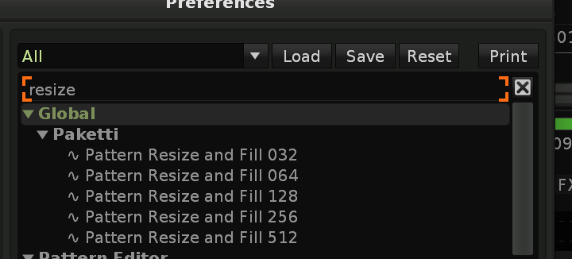


---
### 2024-07-18 - esaruoho

Improvement: Paketti Save Sample as FLAC / WAV menu entries added to Sample Editor (!!!) they should have always been there.


---
### 2024-07-18 - esaruoho

Improvement: Paketti Save Selected Sample as FLAC / WAV menu entries added to Sample Navigator.
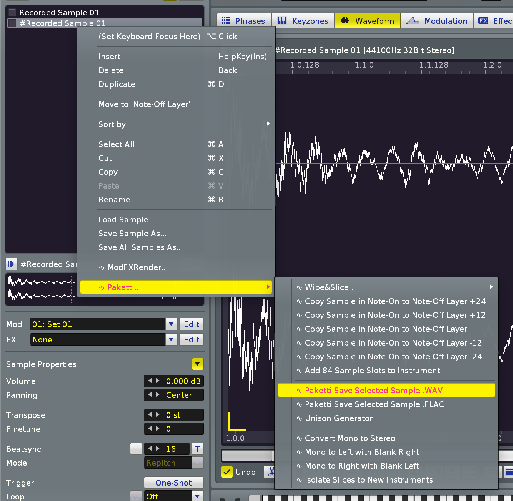


---
### 2024-07-18 - esaruoho

Improvement: Unison Generator -> sets the selected instrument selected sample loopmode to Forward, in case if it is not set

---
### 2024-07-19 - esaruoho

Improvement: Unison Generator now both makes a copy of the original instrument, and loads 12st_Pitchbend.xrni instrument, for macros.
(closes https://github.com/esaruoho/org.lackluster.Paketti.xrnx/issues/274)
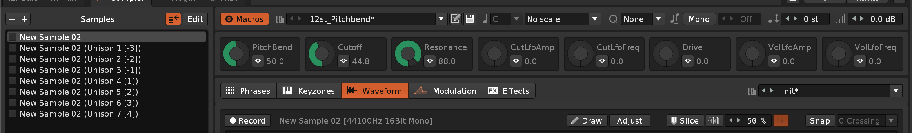
---
### 2024-07-19 - esaruoho

Improvement: "Save Selected Sample" & "Save All Samples" to Smart/Backup Folder menu entries added for Sample Navigator (Selected+All), Sample Editor (Selected) and Instrument Box (All)
EDIT: typo fix, "All Sample" -> "All Samples" for each menu entry 🙂
(closes https://github.com/esaruoho/org.lackluster.Paketti.xrnx/issues/245 )


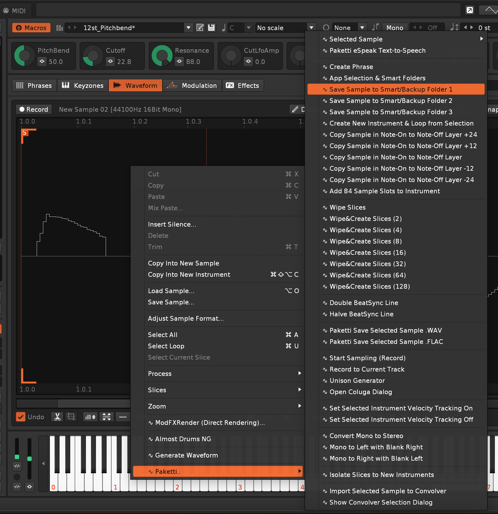


---
### 2024-07-19 - esaruoho

Improvement: Transpose +1/-1/+12/-12 now work with 1) selection only if selection in pattern 2) each note column in track if no selection in pattern.
(closes https://github.com/esaruoho/org.lackluster.Paketti.xrnx/issues/174)

---
### 2024-07-19 - esaruoho

Update: Paketti Donations list updated with URL button added to newest donator - a maximum of 3 URLs can be added upon donation (Zoey Samples got the BTD Records url)


---
### 2024-07-19 - esaruoho

Improvement: Unison Generator now reads this brand new (still WIP) setting in Paketti Preferences:  .. i.e. if it is set to ON, then the Unison Generated Instrument will have AHDSR envelope enabled instead of disabled. default is disabled.


---
### 2024-07-19 - esaruoho

Improvement: Unison Generator is now the first feature that uses the "Default .XRNI to use" Paketti Preferences setting. This allows you to set your own instrument to be loaded when generating a Unison - enabling you to decide which macros + etc modfx + samplefx settings (sample fx chains) stuff your instrument comes preloaded with. including sample modulation. this is a powerful thing to have.

---
### 2024-07-19 - esaruoho

Improvement: "Create New Instrument & Loop" now also uses Default XRNI Preference

---
### 2024-07-19 - esaruoho

Improvement: Paketti Pitchbend Multi Sample Loader now also uses Default .XRNI preference

---
### 2024-07-19 - esaruoho

Improvement: Paketti Clean Render now also uses Default .XRNI Preference

---
### 2024-07-20 - esaruoho

Improvement: Default XRNI Loader now has a dropdown menu in Paketti Preferences: you can pick from the ones already available, or your own.
this lets me also collaborate with other people who want to make a default XRNI available, and want to contribute it to Paketti
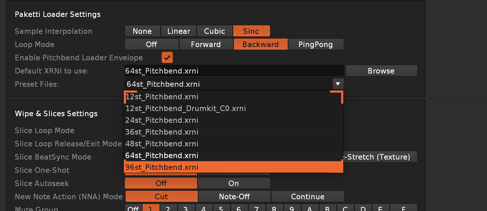

---
### 2024-07-22 - esaruoho

Plumbing: Paketti has KeyBindings.xml files inside the script itself, I've moved them to the `KeyBindings` folder. These are, for now, only used for storing the "macOS Paketti" shortcuts.. The objective is to eventually offer a PakettimacOS / PakettiWindows / PakettiLinux  KeyBindings files, but that is further down the line.

---
### 2024-07-22 - esaruoho

Feature: PlayerPro Transpose Selection or Row +1/-1/+12/-12


---
### 2024-07-23 - esaruoho

Feature: Paketti Theme Selector Dialog.
<div style="position: relative; padding-bottom: 64.90384615384616%; height: 0;"><iframe src="https://www.loom.com/embed/2289acd190614b388a93edc2e7f3507a?sid=ff453d9e-81db-49ea-be24-3592a85b2f6a" loading="lazy" frameborder="0" webkitallowfullscreen mozallowfullscreen allowfullscreen style="position: absolute; top: 0; left: 0; width: 100%; height: 100%;"></iframe></div>
https://www.loom.com/share/2289acd190614b388a93edc2e7f3507a

- 453 themes added within Paketti (from Renoise Theme Thread, and private sendings) - if you want your theme added, please shoot me a DM.
- A dropdown menu that shows you the whole list. +/- and Randomize functions.
- Shows you the previously selected theme (saved when closing dialog)
- You can create a list of Favorited themes, and +/- and Randomize from that.
- "Select a Random Favorite on Renoise Launch" checkbox - your Favorite list will be looked at, and a theme is randomly selected.
- Open Themes Path - should work on Windows, Linux and macOS - opens the Themes path so you can update
- Refresh for refreshing the dropdown menu.
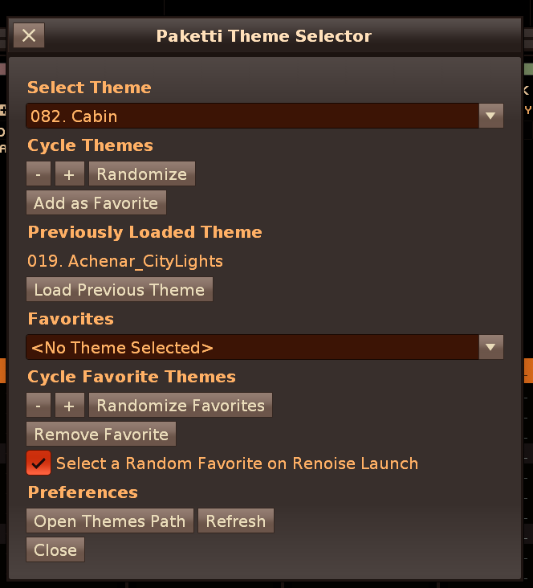

---
### 2024-07-23 - esaruoho

Improvement: Paketti eSpeak TTS now will use the Default XRNI Instrument - so you have pitchbend, cutoff, resonance, overdrive etc Macros already set up

---
### 2024-07-23 - esaruoho

Improvement: Paketti Theme Selector:
Removed all the duplicate themes.. and added all the Renoise default themes + "More" themes, so there's 505 now.
Added shortcuts for these functions.


---
### 2024-07-23 - esaruoho

Plumbing: Isolated all Preferences to separate segments of the preferences.xml for better managing. this should help a lot. Hopefully also with the Paketti Theme Selector

---
### 2024-07-25 - esaruoho

Improvement: Paketti Theme Selector:
- Added "Save Favorites" & "Load Favorites" so you can save your Favorites properly
- Fixed Preferences so the "Select a Random Favorite on Renoise Launch" & Favorites are properly stored.
- Tweaked the interface so it feels more optimized (+/- & randomize & add to favorite & remove favorite are on the same row as the dropdown menu)
- made "Pick a Random Theme (Favorites)  properly work
- Removed "Load Favorite Theme (Next)" & "Load Favorite Theme (Previous)".
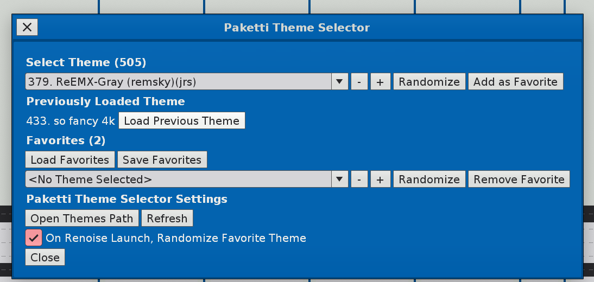


---
### 2024-07-25 - esaruoho

Improvement: 12st_Pitchbend now has 
- a deactivated "Mono" device for Monoing up the output
- Glide Inertia button
- Parallel Compression button

NOTE: this modifies the Instr Control device usage, should not touch X_Pitchbend but instead Pitchbend in Automation lane. 
this closes
https://github.com/esaruoho/org.lackluster.Paketti.xrnx/issues/286
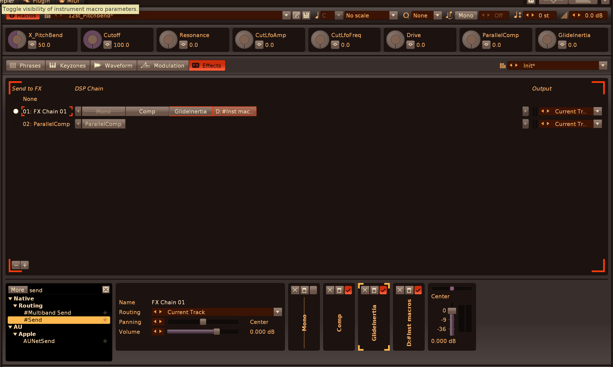


---
### 2024-07-25 - esaruoho

(regards 12st_Pitchbend)


---
### 2024-07-25 - esaruoho

Improvement:  `*Key Tracker` & `*Velocity Tracker` can no longer be added from Menu Entry or shortcuts, to Send, Master or Group Tracks. instead of shooting an error (!!) there will be a show_status notification.
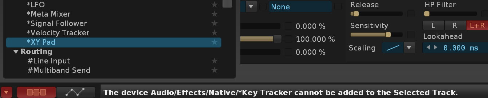


---
### 2024-07-25 - esaruoho

Improvement: Separate blacklists for loading native devices. 
Master cannot load `#Send, #Multiband, #Sidechain, *Key Tracker, *Velocity Tracker`
Group cannot load `*Key Tracker or *Velocity Tracker`
Send cannot load `*Key Tracker or *Velocity Tracker.`
SampleFX cannot load `#ReWire Input`

---
### 2024-07-25 - esaruoho

Improvement: #Sidechain added to "regular Paketti Shortcuts" (the ones that are manually written, not created by user via Native Device dialog

---
### 2024-07-25 - esaruoho

Improvement: "Randomize Selected Device" will now read if you're in the Sample FX Chain - and randomize the parameters of that. if you're not there, it'll randomize the selected device (in track dsp chain, or in mixer). it used to shoot an error.

---
### 2024-07-25 - esaruoho

Improvement: "Pitchbend" is now part of the "start from center" brigade for drawing automation using midimapping. (the Default XRNI had PitchBend, but that's now called X_PitchBend since it's not to be touched (since the addition of the Inertia for Gliding with Pitchbend).

---
### 2024-07-25 - esaruoho

Improvement: added `*Instr. MIDI Control`, `*Instr. Automation` and `*Instr. Macros` to blacklist of SampleFX Chain - so they can no longer be added even if you have them shortcutted - meaning that no error will be shot but a warning will be shot on the show_status.
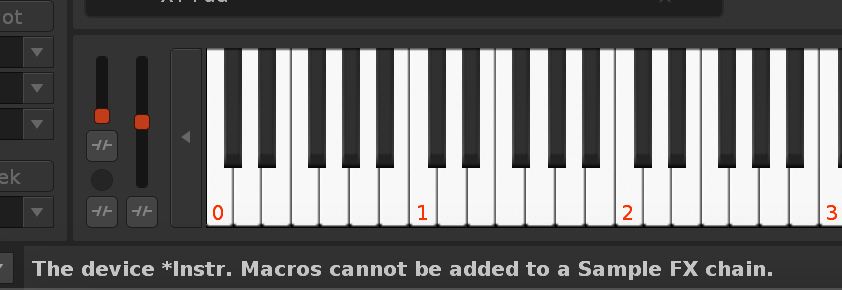


---
### 2024-07-25 - esaruoho

Improvement: If you're in the Sample Editor, and press the "Switch to Automation" shortcut, it'll jump to Pattern Editor + Automation, instead of requiring two presses of "Switch to Automation" to have the Automation lane display.

---
### 2024-07-26 - esaruoho

Improvement: EditMode Signaler now no longer shoots an error, if you had editmode on, a track was blended, and you open a new song or create a new song.

---
### 2024-07-27 - esaruoho

Improvement: "Isolate Slices to New Instruments" now also adds the Default XRNI Instrument for each isolated slice to new instrument - meaning, your slices now have cutoff, resonance, pitchbend inertia, overdrive, parallel compression and cutoff LFO Amount & cutoff LFO Freq. 
(closes https://github.com/esaruoho/org.lackluster.Paketti.xrnx/issues/295 )

---
### 2024-07-27 - esaruoho

Improvement: "Wipe Song & Retain Sample" now retains the name of the Instrument and the name of the Sample in the new song. 
(closes https://github.com/esaruoho/org.lackluster.Paketti.xrnx/issues/294 )

---
### 2024-07-27 - esaruoho

Improvement: "Wipe Song & Retain Sample" now also adds the Default XRNI Instrument for the sample.
also, added the feature to Sample Navigator & Sample Editor menus.

---
### 2024-07-27 - esaruoho

Improvement: "Load Renoise Native" menu entries now also list the Hidden devices (deprecated devices)
(closes https://github.com/esaruoho/org.lackluster.Paketti.xrnx/issues/292 )
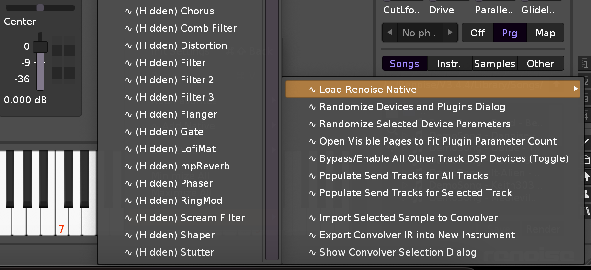


---
### 2024-07-27 - esaruoho

Improvement: Added Hidden / deprecated devices as shortcuttable devices:


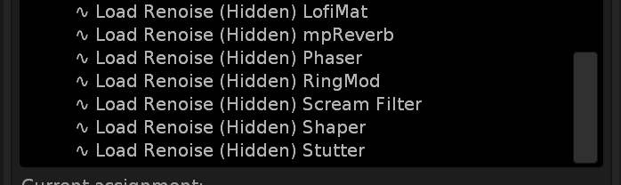


---
### 2024-07-27 - esaruoho

Improvement: the Load Native Devices dialog, for loading, or adding to shortcuts+ midimappings, now also shows the Hidden/deprecated devices:


---
### 2024-07-27 - esaruoho

Improvement: Paketti YT-DLP Downloader has been verified as working for downloading content from SoundCloud, Bandcamp and Instagram (in addition to YouTube). updating the dialog to better inform the user:
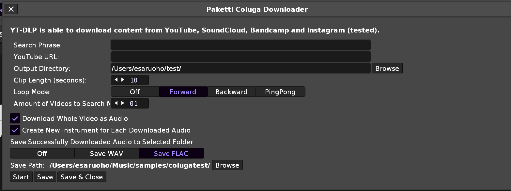


---
### 2024-07-27 - esaruoho

Improvement: Paketti Pattern Effect Cheat Sheet now correctly outputs `0Y` into selection in pattern, or if no selection in pattern exists, to current row.

---
### 2024-07-27 - esaruoho

Improvement: Paketti Pattern Effect Cheat Sheet now has dialog improvements: you can open and close it with the same shortcut.
the Delay, Panning and Volume sliders now will turn the tracks within selection in pattern to visible, if they aren't already.
(closes https://github.com/esaruoho/org.lackluster.Paketti.xrnx/issues/300 )
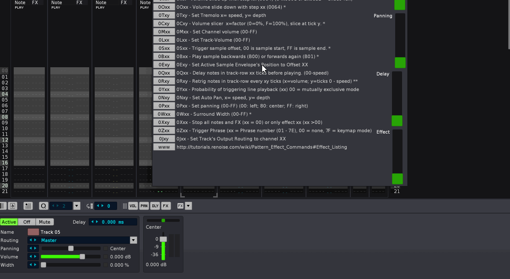


---
### 2024-07-27 - esaruoho

Feature: Paketti About page:
( closes https://github.com/esaruoho/org.lackluster.Paketti.xrnx/issues/291 )


---
### 2024-07-27 - esaruoho

Improvement: If you're on Modulation tab and run a shortcut to add a VST,VST3,AudioUnit,Native Device or LADSPA/DSSI device, then the view will change to Sample FX Tab.
closes https://github.com/esaruoho/org.lackluster.Paketti.xrnx/issues/284

---
### 2024-07-27 - esaruoho

Improvement: "Isolate Slices to New Instruments" is now "Isolate Slices or Samples to New Instruments" -> meaning if your instrument has multiple samples, you can dump them to new instruments, with the Default XRNI instrument applied to each instrument.
closes https://github.com/esaruoho/org.lackluster.Paketti.xrnx/issues/246


---
### 2024-07-27 - esaruoho

Improvement: Paketti Coluga Downloader  will now automatically focus the "URL" textfield, meaning, for me, the workflow is CTRL-C (start Coluga), CMD-V (paste YouTube URL), press enter  -> download starts

---
### 2024-07-28 - esaruoho

Improvement: It seems they lowered minimum BPM from 32 to 20.. So BPM +1/-1/+0.1/-0.1 will now go to 20BPM. 
closes https://github.com/esaruoho/org.lackluster.Paketti.xrnx/issues/306

---
### 2024-07-28 - esaruoho

Feature: "Select First Half of Sample Buffer" - this will select exactly half of the available sample buffer content in Sample Editor.


---
### 2024-07-28 - esaruoho

Improvement: "Select First Half of Sample Buffer" now has a counterpart, "Select Second Half of Sample Buffer".


---
### 2024-07-28 - esaruoho

Improvement: Paketti eSpeak Text-to-Speech now:
- no longer renders a Selection if you press +/- - unless if "Render on +/-" is ON
- has shortcuts for Generate Sample, Generate Selection, and Refresh textfile

---
### 2024-07-29 - esaruoho

Improvement: Pattern Editor Cheat Sheet
- On start of Dialog, returns focus to Pattern Editor, so you can keep selecting, tracking, while using the dialog.
- now correctly shows the pattern effect command + effect description in show_status, and the GUI no longer says "0Axx" in button only to be followed by textfield starting with "0Axx - ". (no need to show redundant information twice)
- now writes properly to the selected effect columns and selected note columns - no matter where your cursor is. doing the note column + effect column math to figure out where to write. so your "not-selected" effect columns, and "not-selected note columns" are safe.
- the dialog sliders are in the correct places (aligned to the right, so the gui looks better)
- if you select a Group, Master or Send track, the Delay,Volume,Panning sliders no longer shoot errors.
- If you have Group, Master or Send tracks in Selection In Pattern, the Delay,Volume,Panning sliders no longer shoot errors.
- the cursor no longer jumps to the effect column, if you're on note column, instead writing to the effect column from the note column.
- if the selection_in_pattern does not have any effect columns selected, and you press a button for inputting an effect, the first effect column will be used.
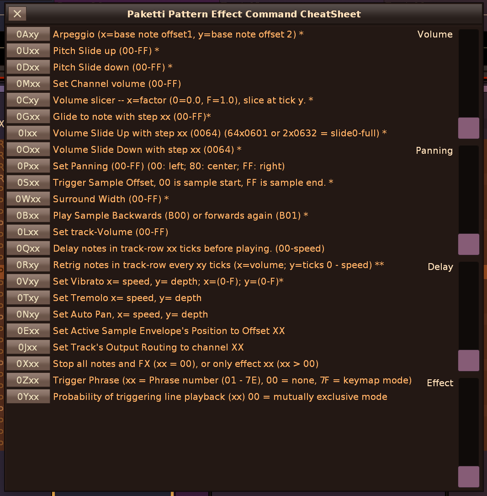


---
### 2024-07-29 - esaruoho

Improvement: Pattern Editor Cheat Sheet
added all missing effect commands from the "FX dropdown" in Renoise Pattern Editor.
tweaked the copywriting to conform to what FX dropdown says
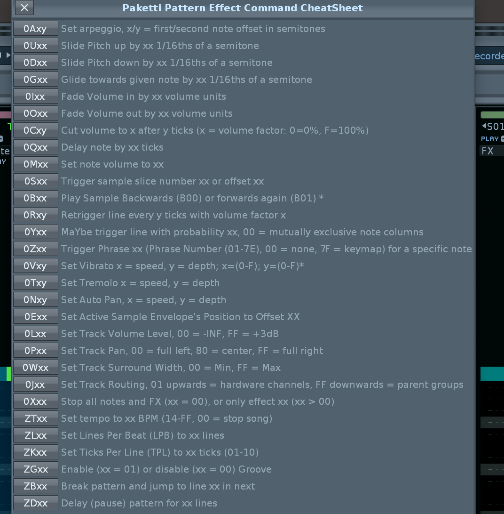


---
### 2024-07-29 - esaruoho

Improvement: Cheatsheet modified with.. randomize functions.
hopefully this video will shed some light as to what is going on:
https://www.loom.com/share/978e659e038e432d873272b8a819b96c?sid=df8061c5-fef7-45a0-bb43-aa0333bbe66a
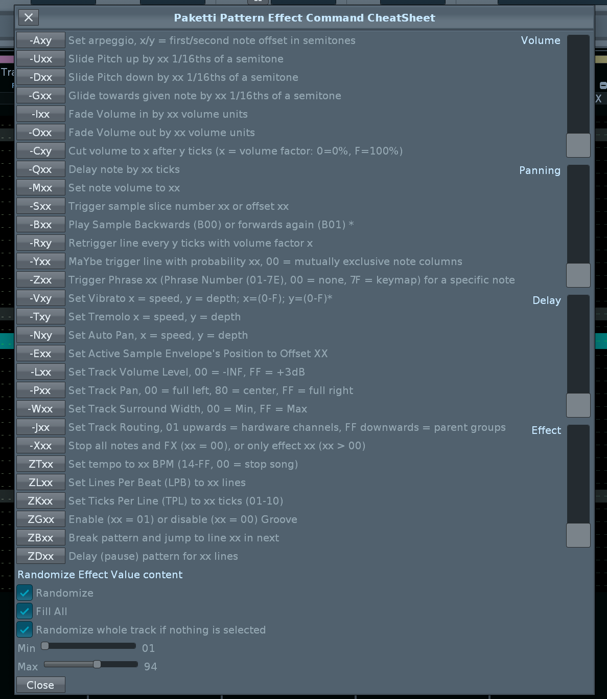

[Embedded Link](https://www.loom.com/share/978e659e038e432d873272b8a819b96c?sid=df8061c5-fef7-45a0-bb43-aa0333bbe66a)


---
### 2024-07-30 - esaruoho

Improvement: CheatSheet randomize functions improvements:
- Randomize Min/Max Only - if it is on, the randomize switches from min value and max value - so you can pick your favorite min value and max value and that will be the only content put to the selection in pattern, or whole track.
- Don't Overwrite - if this checkbox is On, the buttons you click during randomize will not overwrite currently existing effect content
- Fill All checkbox replaced with 0% to 100% Slider - Slider at 100% ? fill all. Slider at 10%? Fill Probability will be 10%.
- fixed ZTxx and Txx effects so the min + max are properly used, instead of erraneously introduced default values.

(closes https://github.com/esaruoho/org.lackluster.Paketti.xrnx/issues/313 )
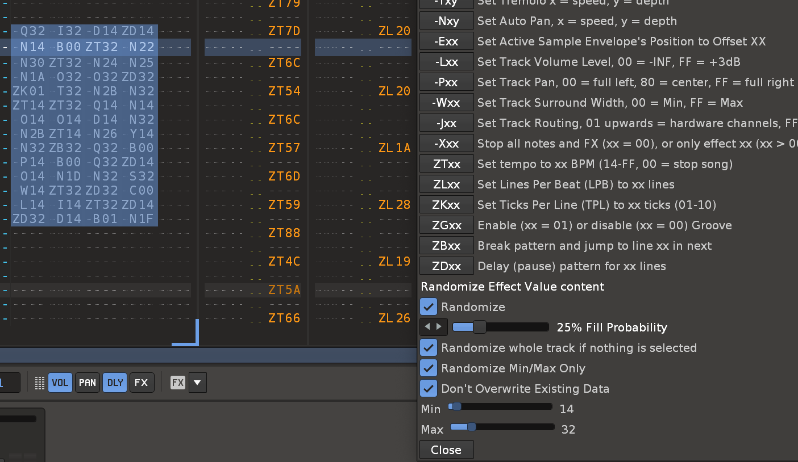


---
### 2024-07-31 - esaruoho

Feature: Paketti Gater
offers 16 steps for Volume, (C00 to C0F) and for Retrig (user can set the Retrig speed)
randomize features, shift left&right, imprint on volume column (volume/retrig), panning column (retrig), effect columns (volume/retrig)
clear checkboxes. .. 
how it works: will fill the whole selected track with content, and you have 16 steps available, the length of which you can modify so that retrig could be 8 steps and volume could be 6 steps,.. and presets like all, every second, every third, every fourth.
can also receive the first 16 rows of volume, or retrig, to the checkboxes. 
some screenshot examples:
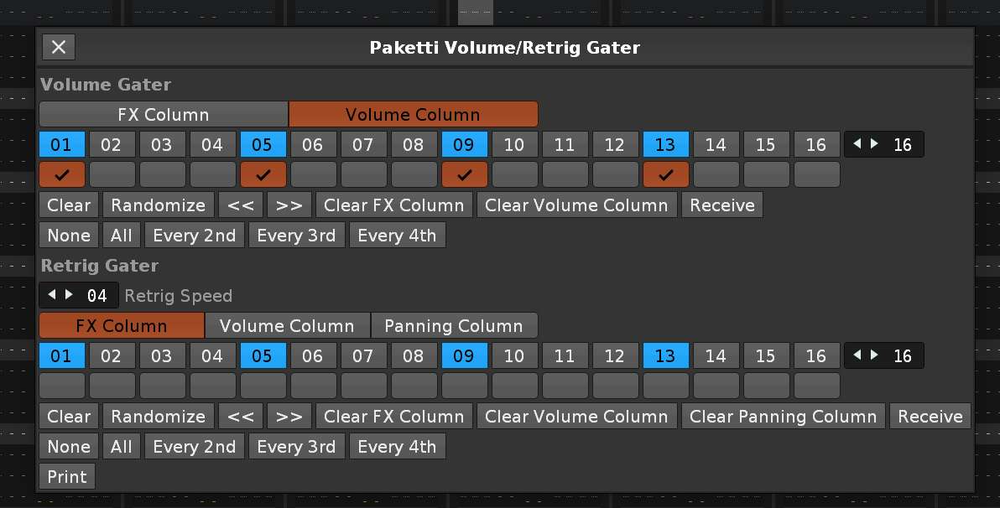

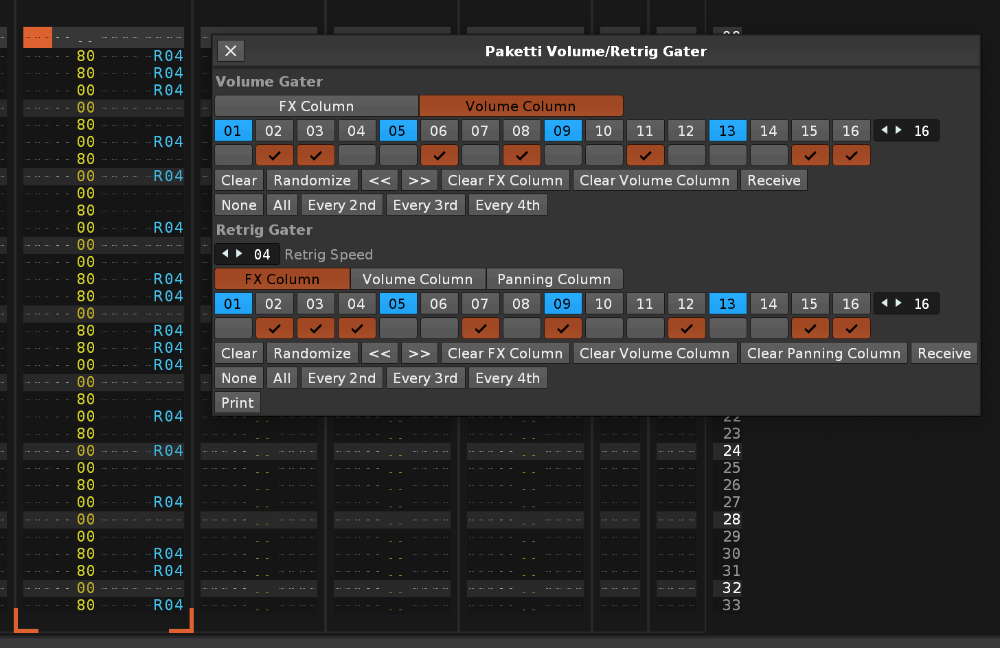


---
### 2024-08-01 - esaruoho

Feature: Flood Fill with Selection.
<div style="position: relative; padding-bottom: 64.90384615384616%; height: 0;"><iframe src="https://www.loom.com/embed/147fab8a865e4b87af4850185620aae3?sid=c52b301d-7084-4074-80ce-44a77210c1bf" loading="lazy" frameborder="0" webkitallowfullscreen mozallowfullscreen allowfullscreen style="position: absolute; top: 0; left: 0; width: 100%; height: 100%;"></iframe></div>

https://www.loom.com/share/147fab8a865e4b87af4850185620aae3?sid=191b0f48-7985-4603-b218-c77abbd84d87
select anything, effect columns, note columns, run flood fill with selection = result = pattern filled with content.

---
### 2024-08-01 - esaruoho

Feature: Selected Row to / Selection In Pattern Start  -> circular rotate to first row.
this means, if your cursor is on say row 6 and you trigger the shortcut, row6 becomes row1 and everything in row1-row5 goes to the end of the pattern. or if you have a selection, such as a couple of note columns and a couple of effect columns, and trigger the shortcut, then the first row in the selection is moved to the first row of the pattern.
<div style="position: relative; padding-bottom: 64.90384615384616%; height: 0;"><iframe src="https://www.loom.com/embed/a3f55137bb4d46de9ccd81e76296fc60?sid=a7902e6e-86ac-45fb-86cf-2def38563cbc" loading="lazy" frameborder="0" webkitallowfullscreen mozallowfullscreen allowfullscreen style="position: absolute; top: 0; left: 0; width: 100%; height: 100%;"></iframe></div>

https://www.loom.com/share/a3f55137bb4d46de9ccd81e76296fc60?sid=b7c8a4f5-9d76-46b9-9034-5bbbc5c73500


---
### 2024-08-01 - esaruoho

Feature: Oblique Strategies 
this fetches a random line from the official Oblique Strategies list and shows it either in a dialog, or on the statusbar.


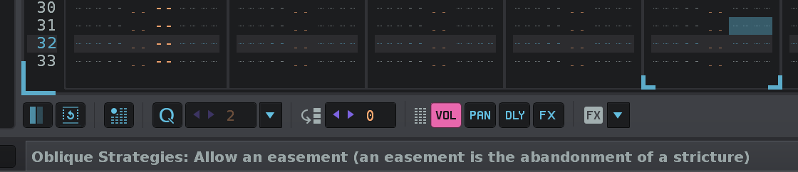


### 2024-08-02 - esaruoho

Feature: Paketti Dater & Titler - (Save Song As replacement)
<div style="position: relative; padding-bottom: 64.90384615384616%; height: 0;"><iframe src="https://www.loom.com/embed/6d1b8cf98ee0471cb67156b6a98fa383?sid=6373355d-068c-46fc-b1c1-028d0d5074df" loading="lazy" frameborder="0" webkitallowfullscreen mozallowfullscreen allowfullscreen style="position: absolute; top: 0; left: 0; width: 100%; height: 100%;"></iframe></div>
https://www.loom.com/share/6d1b8cf98ee0471cb67156b6a98fa383?sid=73e989d0-b7ff-4f96-a538-264f67a18239


---
### 2024-08-02 - esaruoho

Improvement: Mixer: Load Native Device menu entry now shows both the renoise native devices and renoise hidden devices - instead of there being two menus (one with the name "Load Native Device" and the other "Load Native Device ")
closes https://github.com/esaruoho/org.lackluster.Paketti.xrnx/issues/335

---
### 2024-08-02 - esaruoho

Improvement: "Duplicate and Reverse Instrument" is now available in the Instrument Box, Sample Editor and Pattern Editor
closes https://github.com/esaruoho/org.lackluster.Paketti.xrnx/issues/331

---
### 2024-08-02 - esaruoho

Improvement: "Paketti Save sample as FLAC / WAV" now says that the file was successfully saved, and where
closes  https://github.com/esaruoho/org.lackluster.Paketti.xrnx/issues/329


---
### 2024-08-02 - esaruoho

Improvement: If you were in F4 view ( MIDI or Plugin frame ) and pressed F3  , nothing happened. fixed.
closes https://github.com/esaruoho/org.lackluster.Paketti.xrnx/issues/323

---
### 2024-08-02 - esaruoho

Improvement: Naming of Delay +1 -1 +10 -10 - discoverability improvement:
closes https://github.com/esaruoho/org.lackluster.Paketti.xrnx/issues/333


---
### 2024-08-02 - esaruoho

Improvement: Double Beatsync Line & Halve Beatsync Line now has a total of 4 shortcuts. both for selected sample, and for all slices, or all samples. if there are slices, the 1st (original sample slot) will not be touched. if there's only samples, (all) will apply for all.
closes https://github.com/esaruoho/org.lackluster.Paketti.xrnx/issues/51


---
### 2024-08-03 - esaruoho

Improvement: Wipe Song & Retain Sample now supports Selected Slice -> if you select a slice and run the script, a new song is created with that slice retained. 
closes https://github.com/esaruoho/org.lackluster.Paketti.xrnx/issues/304
[Embedded Link](https://github.com/esaruoho/org.lackluster.Paketti.xrnx/issues/304)


---
### 2024-08-03 - esaruoho

Feature: Paketti KeyBindings Dialog. 
Shows all the KeyBindings with Paketti. 
sort by path (Global, Sample Editor)
can filter "unshortcutted"
menu entry in main menu tools paketti.. but also in every instance (right-click on Mixer for instance to go to **Paketti..: Show Keybindings**
closes https://github.com/esaruoho/org.lackluster.Paketti.xrnx/issues/308
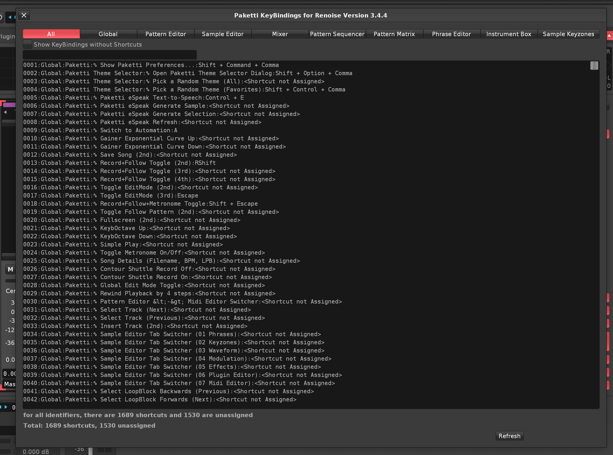


---
### 2024-08-03 - esaruoho

Improvement: Paketti KeyBindings Dialog:
- KeyBinding names sorted alphabetically
- Padding added for shortcuts -> easier to see, matching padding on each tab
- Important note added ( `NOTE: KeyBindings.xml is only saved when Renoise is closed - so this is not a realtime / updatable Dialog. Make changes, quit Renoise, and relaunch this Dialog`) 
- Pattern Editor added to list of Menu_Entries (meaning, you can right click in a place such as sample editor, pattern editor, instrument box, mixer, pattern sequencer, pattern matrix.. and you'll see the available shortcuts in that Section because the dialog opens and selects that place
- "and 0 are unassigned" would show in annoying places, fixed.
- Show only Keybinds with Shortcuts set added


---
### 2024-08-04 - esaruoho

Plumbing: Removed all `Paketti..:` shortcuts (should be `Paketti:`

---
### 2024-08-04 - esaruoho

Feature: Renoise KeyBindings Dialog:
shows all KeyBindings in Renoise.
you can only show tools, or show without tools.
search is fuzzier (for both Renoise + Paketti KeyBindings dialogs)
padding has been introduced to make it better looking.


---
### 2024-08-04 - esaruoho

Improvement: Paketti KeyBindings Dialog:
fuzzy search
padding for better readability
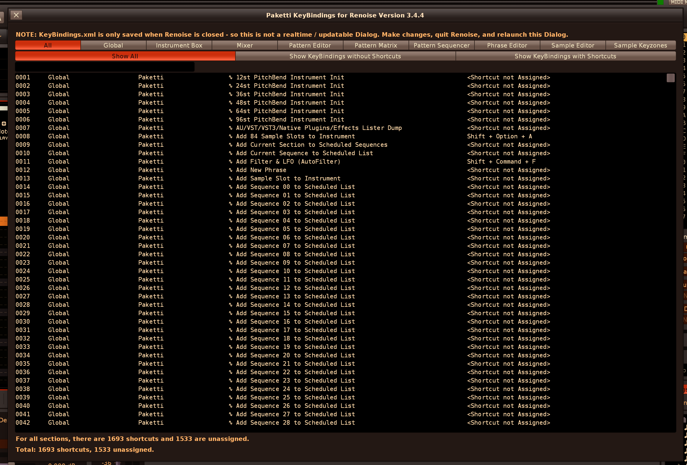

---
### 2024-08-05 - esaruoho

Improvement: 0G01 Loader no longer triggers every time you load a sample, even if Off (!!!).

---
### 2024-08-06 - esaruoho

Improvement: I've tweaked all the Midi Mappings to no longer fluctuate wildly ("Global:Paketti:Name" // "Global:Tools:Paketti:Name" // "Tools:Paketti:Name" // "Tools:Name" //). now they're either Paketti:Name or Context:Paketti:Name.

closes https://github.com/esaruoho/org.lackluster.Paketti.xrnx/issues/342

---
### 2024-08-07 - esaruoho

Improvement: `Wipe&Create Slice` renamed to `Wipe&Slice` - better conforms to what the Paketti Preferences calls it.
closes https://github.com/esaruoho/org.lackluster.Paketti.xrnx/issues/352

---
### 2024-08-07 - esaruoho

Improvement: Impulse Tracker shortcut naming convention is now `Impulse Tracker <keyshortcut> featurename`
and "Set Selection to Instrument (Protman)" has been renamed to `Impulse Tracker ALT-S Set Selection to Instrument` for better discoverability. 
closes https://github.com/esaruoho/org.lackluster.Paketti.xrnx/issues/346
and https://github.com/esaruoho/org.lackluster.Paketti.xrnx/issues/345


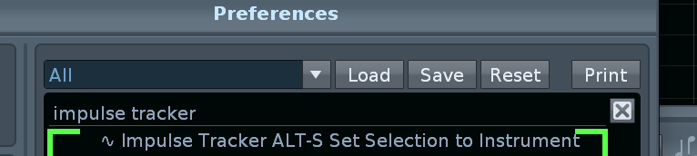


---
### 2024-08-07 - esaruoho

Feature: "Insert Stereo -> Mono to Master Track"
closes https://github.com/esaruoho/org.lackluster.Paketti.xrnx/issues/350
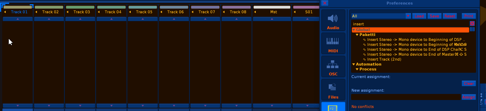


---
### 2024-08-07 - esaruoho

Feature: Paketti Midi Mappings dialog.
This shows all the Midi Mappings created by Paketti. if you also open the CMD-M Midi Mappings Dialog and enter the Extended mode, clicking on the button selects the Midi Mapping and you can press a button, twist a knob or move a slider to assign that. fastest way to onboard yourself into the features Paketti introduces.
I've also tweaked the namings of all the midimappings, and grouped them accordingly.
<div style="position: relative; padding-bottom: 64.90384615384616%; height: 0;"><iframe src="https://www.loom.com/embed/ad75ebed54234085965675a1c4649726?sid=868e331a-ee92-43de-90cc-f8f343b509e7" loading="lazy" frameborder="0" webkitallowfullscreen mozallowfullscreen allowfullscreen style="position: absolute; top: 0; left: 0; width: 100%; height: 100%;"></iframe></div>
https://www.loom.com/share/ad75ebed54234085965675a1c4649726?sid=7ad37178-855d-4b9e-af35-7594afdc09fe

Closes https://github.com/esaruoho/org.lackluster.Paketti.xrnx/issues/262
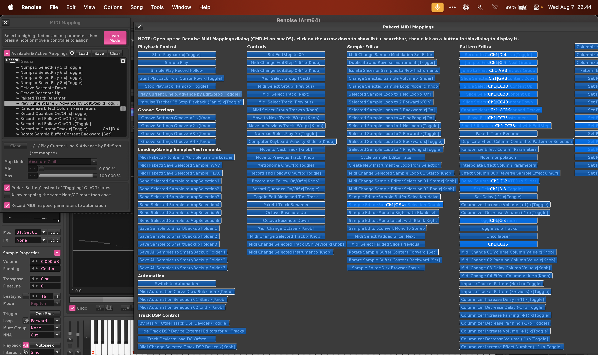


---
### 2024-08-07 - esaruoho

Improvement: "Duplicate Instrument and Reverse" would break if instrument had slices.  now no longer. - now it reverses the first sample and the slices are maintained.

---
### 2024-08-08 - esaruoho

Improvement: "Duplicate Instrument and Reverse" now handles each slice setting separately and works.
closes https://github.com/esaruoho/org.lackluster.Paketti.xrnx/issues/332

---
### 2024-08-08 - esaruoho

Feature: Strip Silence shortcut - this will take the currently selected sample, and strip silence from beginning and from the end. some examples in the gif.
this might help with drumloops.


---
### 2024-08-08 - esaruoho

Improvement: Strip Silence now has Strip Silence Threshold  - "some sort of threshold"..
closes https://github.com/esaruoho/org.lackluster.Paketti.xrnx/issues/48#issuecomment-2275323680


---
### 2024-08-08 - esaruoho

Feature: Move Beginning Silence to End


---
### 2024-08-08 - esaruoho

Feature: Rotate Sample Buffer Content Backward / Forward:
i believe this lets me close these:
https://github.com/esaruoho/org.lackluster.Paketti.xrnx/issues/228
https://github.com/esaruoho/org.lackluster.Paketti.xrnx/issues/148


---
### 2024-08-08 - esaruoho

Feature: Paketti Clean Render Track or Group with LPB*2 

Ok, so what this does is pretty much identical to Paketti Clean Render - except.. right after it diskwrites, it writes current BPM + LPB to Master of current pattern
then it clones the pattern, increases LPB by *2 (so 4 -> 8), and writes BPM + LPB to Master of the new cloned pattern, which non-destructively replaces the original_pattern, and then puts in the sample onto the new track.
closes https://github.com/esaruoho/org.lackluster.Paketti.xrnx/issues/65

---
### 2024-08-08 - esaruoho

Feature: MidiMapping for EditStep Double + Halve:
closes https://github.com/esaruoho/org.lackluster.Paketti.xrnx/issues/92


---
### 2024-08-08 - esaruoho

Improvement: EditStep Halve + EditStep Double added to Paketti MidiMappings dialog
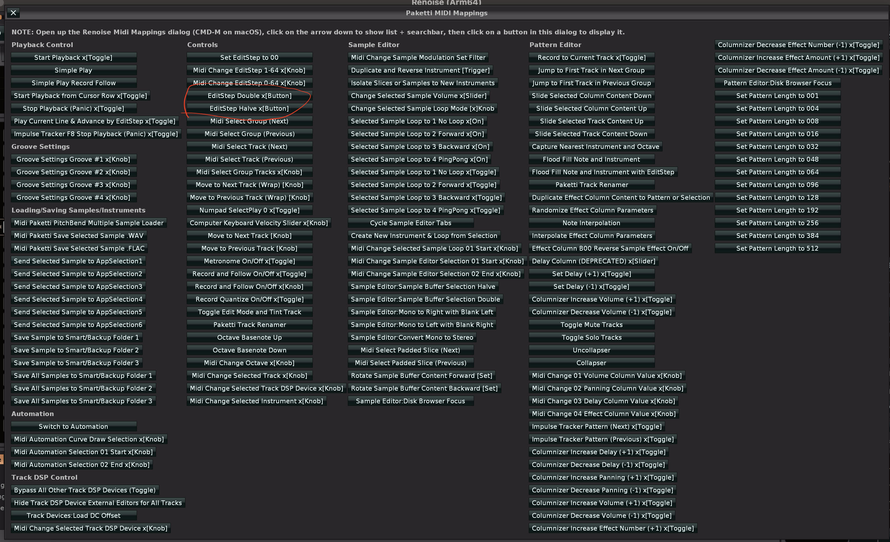


---
### 2024-08-08 - esaruoho

Improvement: now all Plugin, VST, VST3, AudioUnit, Native Device loaders will work properly with Midi Mapping - meaning, a pad will trigger it once - instead of loading the same thing twice (!)
closes https://github.com/esaruoho/org.lackluster.Paketti.xrnx/issues/173

---
### 2024-08-08 - esaruoho

Improvement: Create New Instrument & Loop MidiMapping now triggers once instead of twice

---
### 2024-08-09 - esaruoho

Improvement: "Midi Select Track (Next)" & "Midi Select Track (Previous)" now triggers once instead of twice (and no longer need you to hammer a midipad at 127 velocity to happen 🙂

---
### 2024-08-09 - esaruoho

Improvement: "Midi Select Group (Next)" & "Midi Select Group (Previous) now trigger once with the press of midipad, and no longer capped to "must be velocity 127 to work"

---
### 2024-08-09 - esaruoho

Improvement: Midi Trigger fixes:
```
Impulse Tracker F5 Start Playback x[Toggle]
Impulse Tracker F8 Stop Playback (Panic) x[Toggle]
Switch to Automation
Impulse Tracker Pattern (Next) x[Toggle]
Impulse Tracker Pattern (Previous) x[Toggle]
Wipe&Slice 004-128 x[Toggle] (all 6 of them)
Paketti:Metronome On/Off x[Toggle]
Paketti:Uncollapser
Paketti:Collapser
Paketti:Show/Hide Pattern Matrix x[Toggle]
Paketti:Record Quantize On/Off x[Toggle]
```
also renamed Start Playback to `Impulse Tracker F5 Start Playback` for easier discoverability, also `Wipe & Create Slices` to `Wipe&Slice` so it matches the other places.

---
### 2024-08-09 - esaruoho

Improvement: Global:Paketti:Selected Instrument Midi Program +1 (Next)
& Global:Paketti:Selected Instrument Midi Program -1 (Previous) now map from 0...128 meaning you can select "Off" in addition to 1...127
+ added Midi Mappings for both features.

---
### 2024-08-09 - esaruoho

Improvement: 
these now work with triggers
```
Paketti:Play Current Line & Advance by EditStep x[Toggle]
Paketti:Record and Follow x[Toggle]
Paketti:Impulse Tracker F7 Start Playback from Cursor Row x[Toggle]
Paketti:Stop Playback (Panic) x[Toggle]
Paketti:Set Delay (+1) x[Toggle]
Paketti:Set Delay (-1) x[Toggle]
```
more updates coming

---
### 2024-08-09 - esaruoho

Feature: NumPad SelectPlay 0-8 now works with MidiMappings (single trigger, not double trigger). what this does is, you can play instrument slots 00 to 08 with pads. why is it called NumPad? Because there's also a version for NumPads. NOTE: this will NOT play the sample. it WILL however record to the pattern. if you have a quick pattern running, you can tap in beats and keep tapping in more beats. it will input a note to "current row". the note will always be C-4. while it is of course possible to fingerdrum a singular instrument's drums, this is for fingerdrumming instruments 00 to 08.


---
### 2024-08-09 - esaruoho

Improvement: NumPad SelectPlay 0-8 will now warn the user to select a note column, if on effect column.
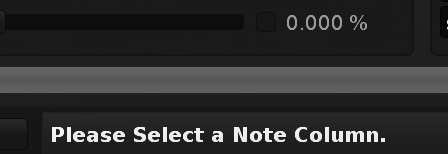


---
### 2024-08-09 - esaruoho

Improvement: MidiTrigger singular fix:
```
Paketti:Capture Nearest Instrument and Octave
Paketti:Simple Play
all Columnizers
```
also renamed the Columnizers for better discoverability

also fixed Columnizer Effect Amount / Effect Number Increase Decrease to not error out if you're on Note Column instead of Effect Column.


---
### 2024-08-09 - esaruoho

Improvement: added "Midi Paketti PitchBend Drumkit Loader" midimapping
(and more "Trigger once only" things)


---
### 2024-08-09 - esaruoho

Improvement: Paketti Gater now has `LPB*2` and `LPB/2` buttons for `Clone Current Pattern and set LPB*2` and `Clone Current Pattern and set LPB/2`
what these do, is, print current LPB + BPM to current pattern.. then if you run `LPB*2` , it makes an identical copy of the same pattern, selects the new pattern, prints LPB*2 and BPM to the pattern.  LPB/2 does the LPB halving so LPB4 becomes 2.

Also, Print now writes to the amount of rows in the pattern, instead of only writing to 64 rows of the pattern.

---
### 2024-08-09 - esaruoho

Improvement: Paketti Gater now will output `L00` & `LC0` - in case you want to flip the mixer volume instead of sample volume.


---
### 2024-08-09 - esaruoho

Improvement: Clear FX Column would not clear L00/LC0  columns. now it clears them.
if you resize the pattern while dialog is open, now the maximum amount of rows to be printed to will be set on every Print, instead of "set on start of dialog".

---
### 2024-08-09 - esaruoho

Improvement: Receive would receive volume or retrig stuff from where the cursor was, not from the beginning of the pattern. it now receives it from the beginning of the pattern.

---
### 2024-08-09 - esaruoho

Feature: Shift Sample Buffer Upwards / Downwards (MidiMapping)


---
### 2024-08-10 - esaruoho

Improvement: renamed these and added -INF dB. they now more clearly say it's all the samples in the instrument


---
### 2024-08-10 - esaruoho

Feature: Set Selected Instrument Volume 0.0dB / -INF dB.
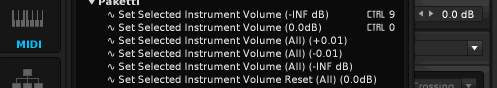


---
### 2024-08-10 - esaruoho

Feature: Set Selected Instrument Volume +0.01dB / -0.01dB
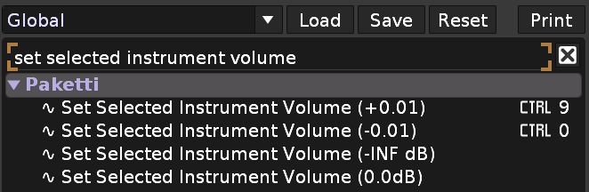


---
### 2024-08-10 - esaruoho

Feature: Set Selected Sample Volume to 0.0dB and others to -INF dB
closes https://github.com/esaruoho/org.lackluster.Paketti.xrnx/issues/371


---
### 2024-08-10 - esaruoho

Improvement: better name


---
### 2024-08-10 - esaruoho

Improvement: Now references Global Volume name


---
### 2024-08-10 - esaruoho

Improvement: Set Selected Sample Volume 0.0dB, others -INF now has an informative showstatus


---
### 2024-08-10 - esaruoho

Feature: "Paketti Save Selected Sample Range .FLAC / .WAV" - basically just saves the selection in sample editor to a wav or flac using macOS Finder or Windows Explorer prompts.  available in midimapping, keybinding and menu entry flavors.

p.s. the genesis of this is FastTracker 2 !https://github.com/esaruoho/org.lackluster.Paketti.xrnx/issues/233
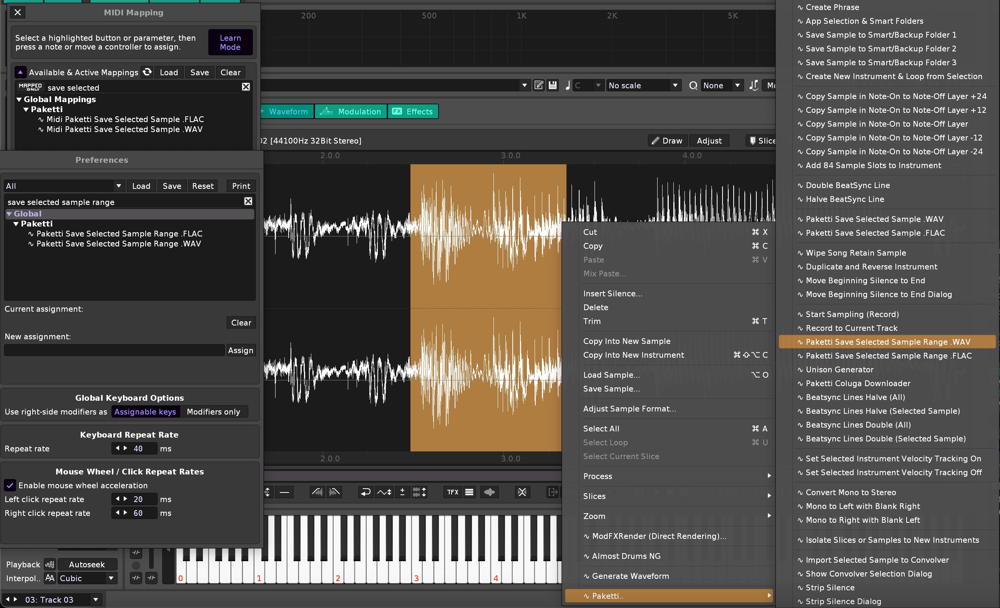


---
### 2024-08-10 - esaruoho

Improvement: CTRL-N  "New Song Dialog" now has Track DSP Wipe/Keep.
wipes Track DSP devices from all tracks, groups, sends, master.
closes https://github.com/esaruoho/org.lackluster.Paketti.xrnx/issues/249
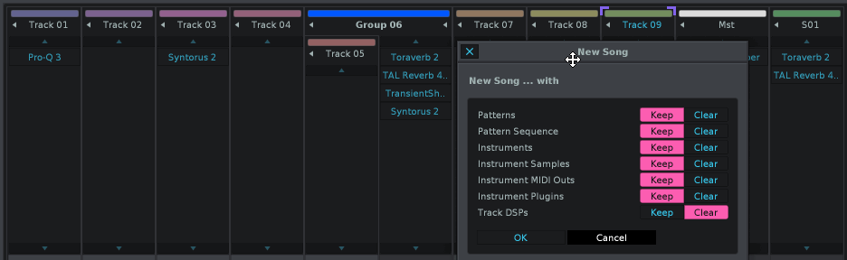


---
### 2024-08-10 - esaruoho

Improvements: Paketti Midi Mappings Dialog has been updated with additional tweaks and fixes and added midimappings

---
### 2024-08-10 - esaruoho

Feature: "FT2 Minimize Selected Sample" -> another FT2 port - this will remove the rest of the sample after LoopEnd.
shortcut + menu entry
closes https://github.com/esaruoho/org.lackluster.Paketti.xrnx/issues/232


---
### 2024-08-11 - esaruoho

Improvement: Paketti DrumKit default instrument now has ParallelCompression and Glide Inertia
closes https://github.com/esaruoho/org.lackluster.Paketti.xrnx/issues/336


---
### 2024-08-11 - esaruoho

Improvement: if you're in Mixer with TrackDSP displaying and run "F12", it used to kick you from TrackDSP to Automation - now it correctly goes to Mixer, Master, TrackDSP. same with if you're in Sample Editor, Sample FX Chain, or Instrument pages (f3, f3, f4, f4)
closes https://github.com/esaruoho/org.lackluster.Paketti.xrnx/issues/344

---
### 2024-08-11 - esaruoho

Improvement: if you're in Mixer without Upper Frame visible, pressing F3 would do nothing - now it goes to Sample Editor without requiring a second F3 press.

---
### 2024-08-11 - esaruoho

Improvement: All Plugin & Device loader dialogs now say "Add as Shortcut(s) & MidiMappings".
closes https://github.com/esaruoho/org.lackluster.Paketti.xrnx/issues/347


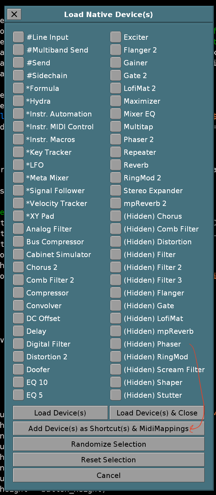


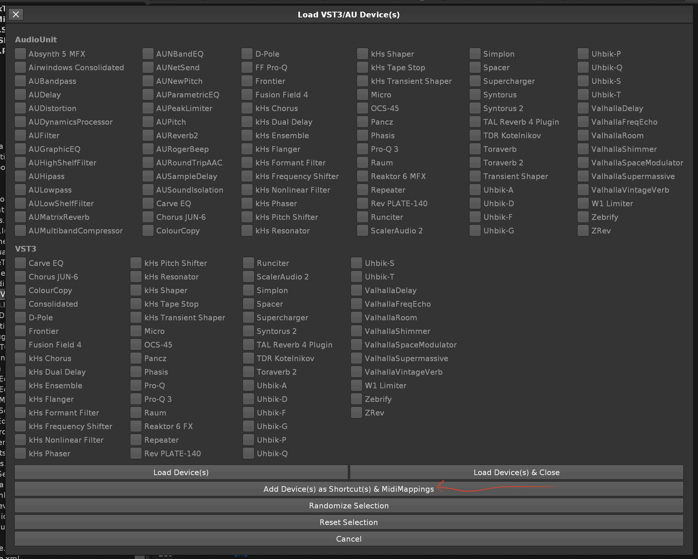


---
### 2024-08-11 - esaruoho

Improvement: ALT-D when there's less rows to be selected than LPB allows (you're on 3rd last row, LPB is 8), would shoot an error. now it gracefully selects from 3rd last row to last row.
closes https://github.com/esaruoho/org.lackluster.Paketti.xrnx/issues/354

---
### 2024-08-11 - esaruoho

Feature: Recursive DC Offset - one shortcut that wrecks the sample, the other that runs it random amounts (1-50 times)
https://www.loom.com/share/3b67650f0d8242f8ad7d08c6640207fc?sid=b4996356-c5b1-4cf6-a66b-1f9a56952d82


---
### 2024-08-11 - esaruoho

Feature: Load Device Chain shortcut - this is within Paketti. the first Device Chain Load command. If you have XRNTs you wanna share that are utility/utilitarian in essence, please hit me up with DMs.  This is only the beginning re: Device Chain uses / scope of where we're going with this


---
### 2024-08-11 - esaruoho

Feature: Record,Follow,Jump to Pattern Editor & start playback with Metronome Precount for 1-4bars.
(closes https://github.com/esaruoho/org.lackluster.Paketti.xrnx/issues/348 )


---
### 2024-08-11 - esaruoho

Improvement: for better discoverability, midimapping names `Sample Buffer Selection 01 Start x[Knob]` & `Sample Buffer Selection 02 End x[Knob]` will be used from now on.
(closes https://github.com/esaruoho/org.lackluster.Paketti.xrnx/issues/349)
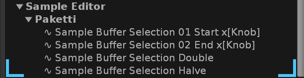


---
### 2024-08-11 - esaruoho

Improvement: Midi Mapping for Move Slice Start Left / Right, Move Slice End Left / Right
(closes https://github.com/esaruoho/org.lackluster.Paketti.xrnx/issues/355)


---
### 2024-08-11 - esaruoho

Feature: 15 frame Fade in & Fade out to sample buffer
(closes https://github.com/esaruoho/org.lackluster.Paketti.xrnx/issues/372)


---
### 2024-08-12 - esaruoho

Feature: Invert Left Sample, Invert Right Sample, Invert whole sample - with protection against running "Left Sample Invert" if sample is mono (same for Right)  - available as menu entries and keybindings


---
### 2024-08-12 - esaruoho

Improvement: Re-added OverSampling + AutoFade to PakettiLoader - when loading multiple or single samples, or drumkit, these two are now applied.
(closes https://github.com/esaruoho/org.lackluster.Paketti.xrnx/issues/360)


---
### 2024-08-13 - esaruoho

Improvement: Autoseek + Oneshot added to Paketti Loader Settings.


---
### 2024-08-14 - esaruoho

Improvement: Renamed "Enable Pitchbend Loader Envelope" to "Enable AHDSR Envelope" (as witnessed with the two screenshots above
also some additional tweaks like having the Note text be on the next row, matching "One-Shot" text everywhere (not "One-Shot" somewhere and "Oneshot" somewhere else. also increased the BeatSync Mode Switch width so the text is better displayed.
Paketti Preferences dialog can now be closed with the same shortcut that opens it.
and it is now less wide. and other minor look'n'feel tweaks


---
### 2024-08-14 - esaruoho

Improvement: CTRL-N (Keep/Clear song elements) now has a Keep/Clear switch that switches all the below ones to Clear (or to Keep)
(closes https://github.com/esaruoho/org.lackluster.Paketti.xrnx/issues/388 )


---
### 2024-08-14 - esaruoho

Improvement: Added "Select All" to all the VST,VST3,AudioUnit,Ladspa/DSSI,Native Devices & VST,VST3,AudioUnit Plugin dialogs.
(closes https://github.com/esaruoho/org.lackluster.Paketti.xrnx/issues/380 )


---
### 2024-08-14 - esaruoho

Improvement: the "SimpleSend" DeviceChain now looks like this:
(i.e. needless hydra device parameters have been hidden and it really is just "one slider for send dry/wet")


---
### 2024-08-14 - esaruoho

Improvement: Midi Populator dialog now has better text titles
(closes https://github.com/esaruoho/org.lackluster.Paketti.xrnx/issues/384)


---
### 2024-08-14 - esaruoho

Improvement: Paketti Clean Render Selection/Track now has a setting in Paketti Preferences for bypassing devices on rendered track after end of render.
(closes https://github.com/esaruoho/org.lackluster.Paketti.xrnx/issues/250)
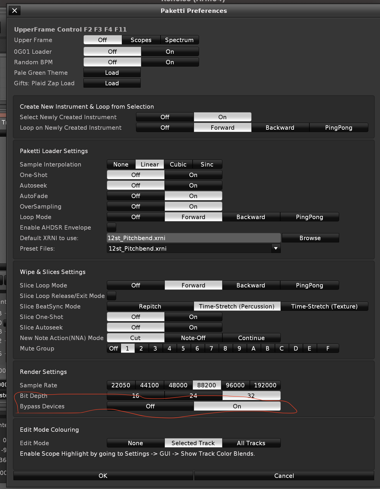


---
### 2024-08-15 - esaruoho

Improvement: "Pale Green Theme" actually works now. it was broken after i renamed it as a file. so it's been broken for multiple weeks 😉

---
### 2024-08-15 - esaruoho

Improvement: the Plaid Zap Gift XRNI name is more accurate now. Next to the Pale Green theme, there's a button for opening the Paketti Theme Selector dialog.


---
### 2024-08-15 - esaruoho

Improvement: added dialog openers into Paketti Preferences. so Theme Selector, Gater, Effect Column Cheatsheet, Phrase Init Dialog, MIDI Populator, KeyBindings, MidiMappings
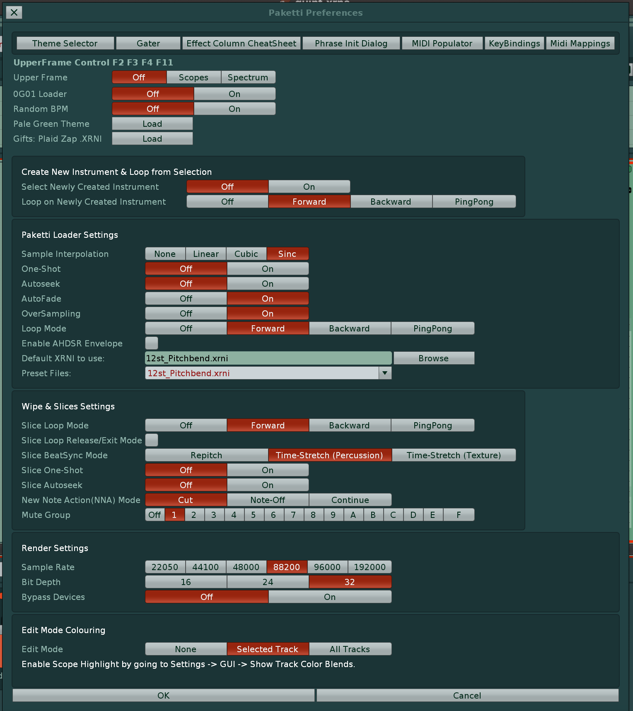


---
### 2024-08-15 - esaruoho

Improvement - grouping is now a little bit better, less visual jitter.
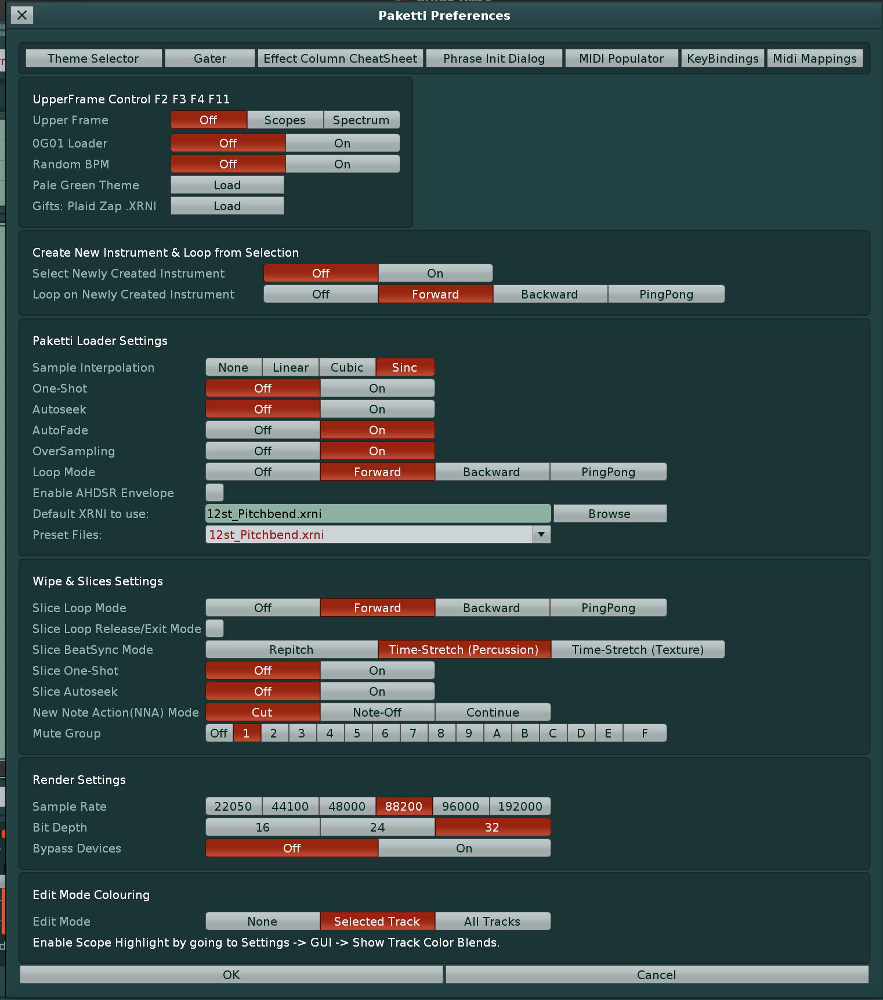


---
### 2024-08-15 - esaruoho

Improvement: added minor 0G01 Loader detail / info. further small tweaks to layout.
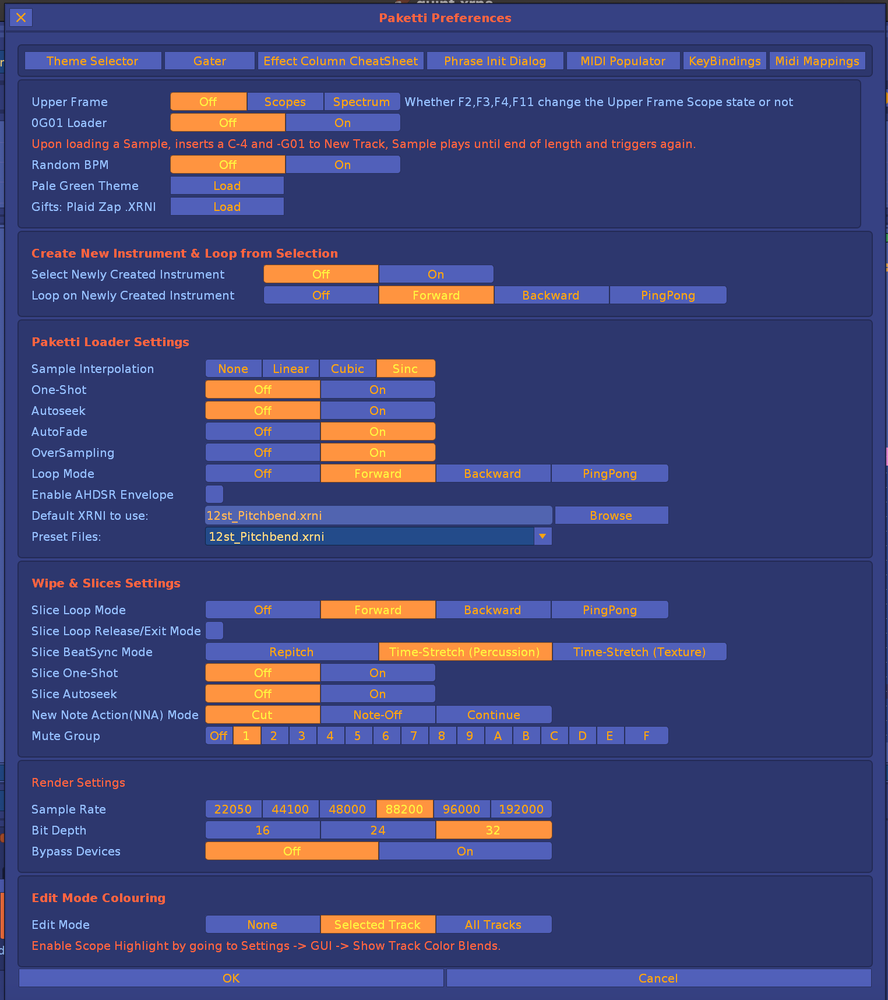


---
### 2024-08-15 - esaruoho

Improvement: Theme Selector no longer uses numbers in the dropdown menus, or when exporting XML or loading XML. this should mean that if you add x amount of Themes, the Favorite loading no longer breaks.
(closes https://github.com/esaruoho/org.lackluster.Paketti.xrnx/issues/338 )

---
### 2024-08-15 - esaruoho

Feature: Paketti Dialogs Dialog. This should in theory show all the dialogs in Paketti. It's a handy piece you can use to open them, or familiarize yourself with different features of Paketti.


---
### 2024-08-15 - esaruoho

Improvement: Forgot "Paketti Preferences" from the Dialog 🙂

here's a demo of opening all the dialogs
<div style="position: relative; padding-bottom: 64.90384615384616%; height: 0;"><iframe src="https://www.loom.com/embed/830634bae9f544bcacc6867d74ee5a6c?sid=1cbcd58f-a70b-4612-b910-9a19566b6305" loading="lazy" frameborder="0" webkitallowfullscreen mozallowfullscreen allowfullscreen style="position: absolute; top: 0; left: 0; width: 100%; height: 100%;"></iframe></div>

https://www.loom.com/share/830634bae9f544bcacc6867d74ee5a6c?sid=e771626f-c8e7-4f10-b840-a99e1b408c0f
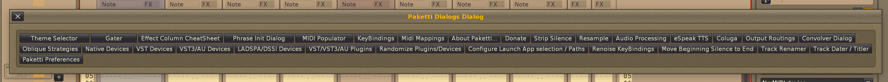


---
### 2024-08-16 - esaruoho

Improvement: "Computer Keyboard Velocity Slider" now works instead of shooting an error. this is a midimapping knob that lets you set the Velocity of your Computer Keyboard.


---
### 2024-08-16 - esaruoho

Improvement: I've changed the "Strip Silence" & "Move Beginning Silence to End of Sample" default settings to be "0.0121" (1.21%) so they immediately do something useful from the start, instead of requiring the user to set the Strip Silence/Beginning Silence Move settings in the dialog. of course they can set the dialogs as they want, after, but it's good to start with "for most cases, this'll be identified as silence -> blammo, do something useful" 🙂
(closes https://github.com/esaruoho/org.lackluster.Paketti.xrnx/issues/394)

---
### 2024-08-16 - esaruoho

Improvement: "Paketti Pattern Doubler" will now shoot a status error if you're trying to go beyond 512 rows.
(closes https://github.com/esaruoho/org.lackluster.Paketti.xrnx/issues/392)
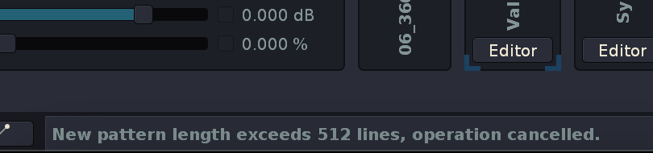


---
### 2024-08-16 - esaruoho

Improvement: Theme Selector Favorites dropdown menu no longer has  `.xrnc` at the end. this means loading +/- randomize (favorites) in dialog & randomize favorite shortcut work without issues now.
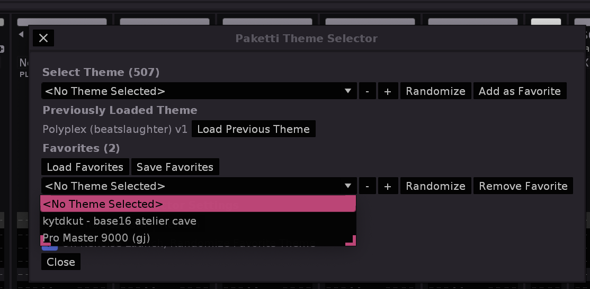


---
### 2024-08-16 - esaruoho

Improvement: Randomize Devices / Plugins dialog now tells you which preset you're setting (user#1 to user#5) for each of the four flavors, and there's a "run" button to run the randomize.
(closes https://github.com/esaruoho/org.lackluster.Paketti.xrnx/issues/334)
(closes https://github.com/esaruoho/org.lackluster.Paketti.xrnx/issues/387)


---
### 2024-08-16 - esaruoho

Improvement: Main Menu Entries tweaked and organized with better horizontal ruler sorting 
same for Instrument Box:
and Pattern Editor:

i.e. Clean Render Selected Track or Group + LPB*2 flavor are together instead of separated.


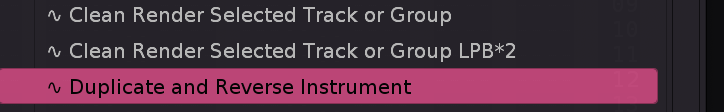


---
### 2024-08-16 - esaruoho

Improvement: "MIDI Populator Dialog" now closes if you click on a button that opens it, instead of opening a second (and third and fourth.. etc) copy of the same dialog. shortcut for opening it also opens it, or if open, closes it.

---
### 2024-08-16 - esaruoho

Improvement: Menu Entries in Tools:Paketti..: are now organized in a better way.
and from now on, I'll try to enforce `...` for signifying that it's a dialog in both keybindings, menu entries and midimappings
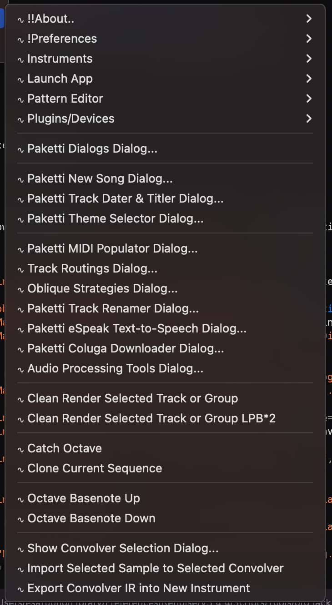


---
### 2024-08-16 - esaruoho

Improvement: Unison Generator now correctly assigns all the created instruments to Sample FX Chain 1, so "Parallel Compression" etc works. - i.e., you load Devices (Renoise, VST, VST3, AudioUnits) to FX Chain1, and you hear them being played.
(closes https://github.com/esaruoho/org.lackluster.Paketti.xrnx/issues/401)

---
### 2024-08-16 - esaruoho

Feature: Randomize Selected Instrument Modulation Filter Type shortcut
this will pick a random Filter Type .
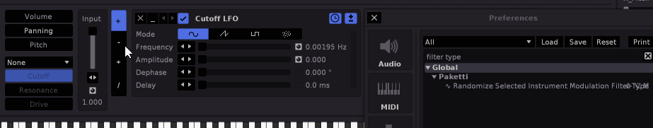


---
### 2024-08-17 - esaruoho

Improvement: Added Default Filter Type to Paketti Loader settings. - from now on you don't need to be stuck with "LP Clean" - you can set the filter you want the samples/kits/renders/create new instrument/unison generator/isolate slices/samples to new instruments/duplicate instrument and reverse sample etc   to be loaded with.
(Closes https://github.com/esaruoho/org.lackluster.Paketti.xrnx/issues/231)
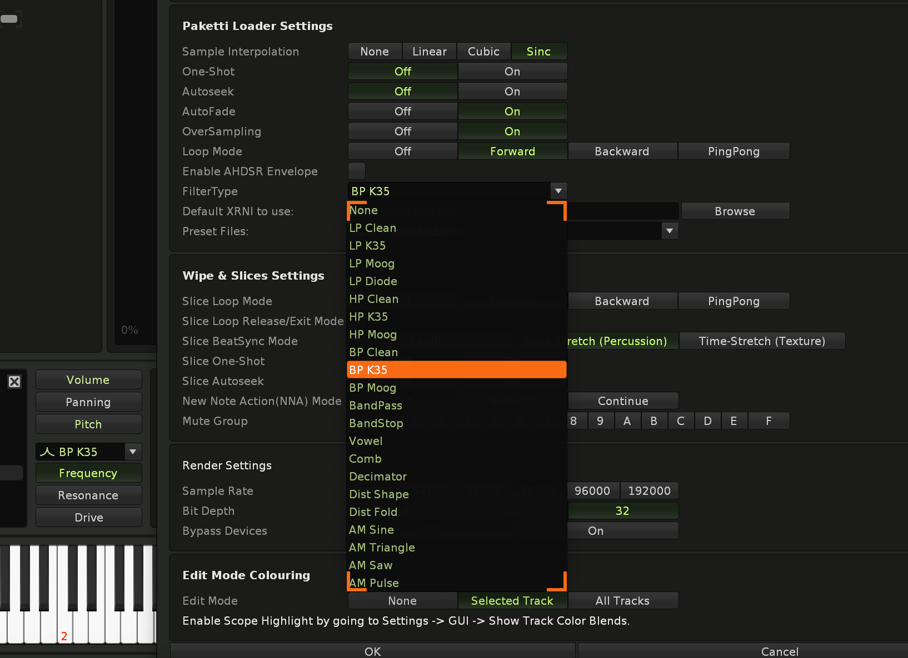


---
### 2024-08-17 - esaruoho

Feature: Added Midi Mapping for controlling BeatSync value 1-128. If BeatSync Mode is Off - it turns it On.
(closes https://github.com/esaruoho/org.lackluster.Paketti.xrnx/issues/409)
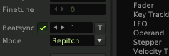


---
### 2024-08-18 - esaruoho

Feature: Paketti Phrase Default Settings Dialog + shortcuts + midimappings + menu entries for creating according to the Settings.

this lets you set your own specified settings for Phrase creation, meaning you can use it instead of the Renoise Native "Insert Phrase" shortcut that people might already be using. 

(closes https://github.com/esaruoho/org.lackluster.Paketti.xrnx/issues/165 and
https://github.com/esaruoho/org.lackluster.Paketti.xrnx/issues/399 )
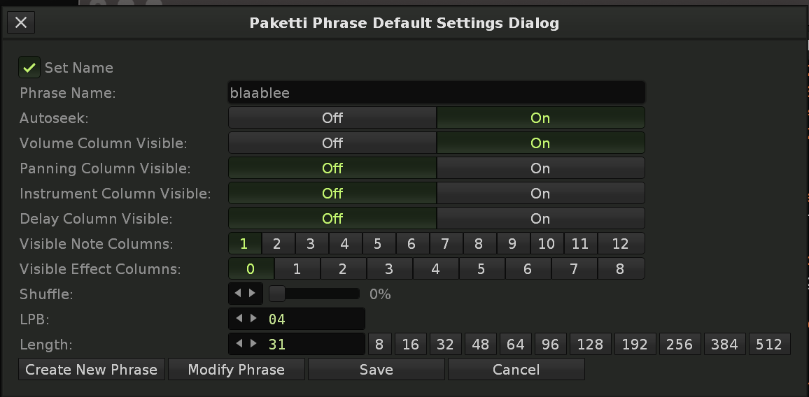


---
### 2024-08-19 - esaruoho

Improvement: Paketti Loader Preferences now has NNA & Loop Release / Exit Mode (these are used for unison, multiple sample loader, drumkit loader, clean render, etc, etc, etc.
(closes https://github.com/esaruoho/org.lackluster.Paketti.xrnx/issues/376 )
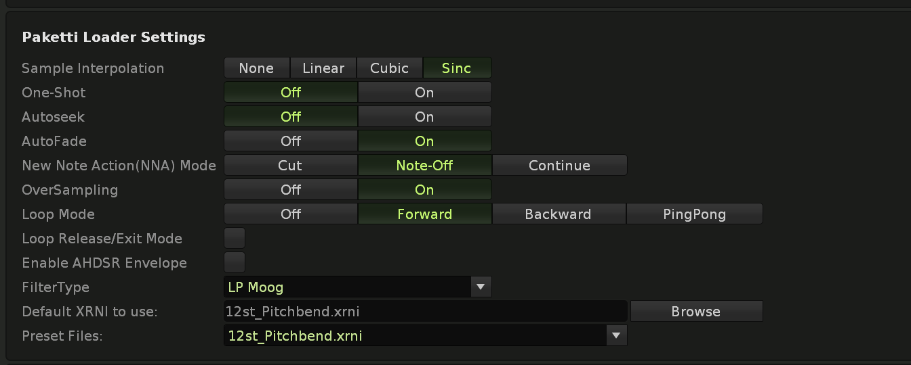


---
### 2024-08-19 - esaruoho

Improvement: Paketti Preferences Dialog has been split in half (the maximum height was exhausted, i couldn't have added anything extra at all - the OK/Cancel buttons would have stopped showing. 
I also added some more dialogs to the top bar of the dialog. this resize will hopefully let me add some more content to to all the places in the near future.


---
### 2024-08-20 - esaruoho

Feature: Midi Mapping for toggling selected track Send 01-64 Value On/Off. It will either be `-INF dB` or `0.0dB` aka full volume.
(closes https://github.com/esaruoho/org.lackluster.Paketti.xrnx/issues/79 )
p.s. if there is no send, it will gracefully error on the show_status
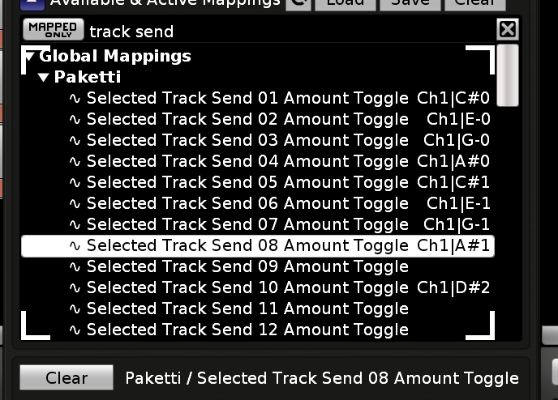


---
### 2024-08-21 - esaruoho

Improvement: Changed `Midi Change 04 Effect Column Value x[Knob]` to `Midi Change 04 Sample FX Column Value x[Knob]`
(since it wrote to sample fx column and not effect column)


---
### 2024-08-21 - esaruoho

Feature: Added `Midi Change 05 Effect Column Value x[Knob]`  which directly inputs into the Effect Column with a slider.
this now completes the 5 columns. 
note the "selected row" or "selected column"
(closes https://github.com/esaruoho/org.lackluster.Paketti.xrnx/issues/134 )
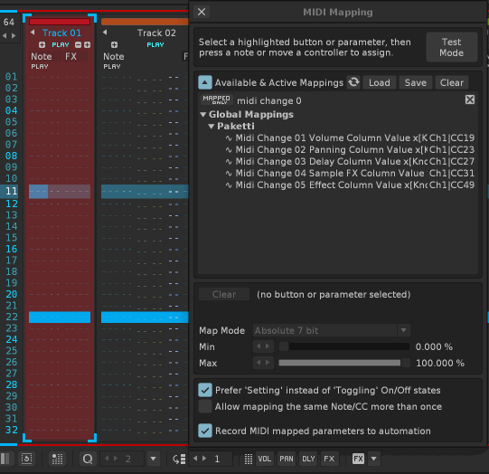


---
### 2024-08-21 - esaruoho

Improvement: Midi Change 01 to 04 (Volume, Panning, Delay, Sample) will now work even if you're on Effect Column.

---
### 2024-08-21 - esaruoho

Improvement: Midi Change  05 Effect Column Value will now check which Effect Column you are on and output to that column


---
### 2024-08-21 - esaruoho

Improvement: Midi Change 05 Effect Column Value will now check which Effect Columns are selected, across multiple tracks, and output to those columns.


---
### 2024-08-21 - esaruoho

Improvement: Midi Change 01 -04 (Volume Panning Delay SampleFX) will now work across all columns that have been selected.


---
### 2024-08-21 - esaruoho

Improvement: Paketti Cheatsheet now has the Sample FX Column Slider too
(one checkbox marked as done at https://github.com/esaruoho/org.lackluster.Paketti.xrnx/issues/317 )
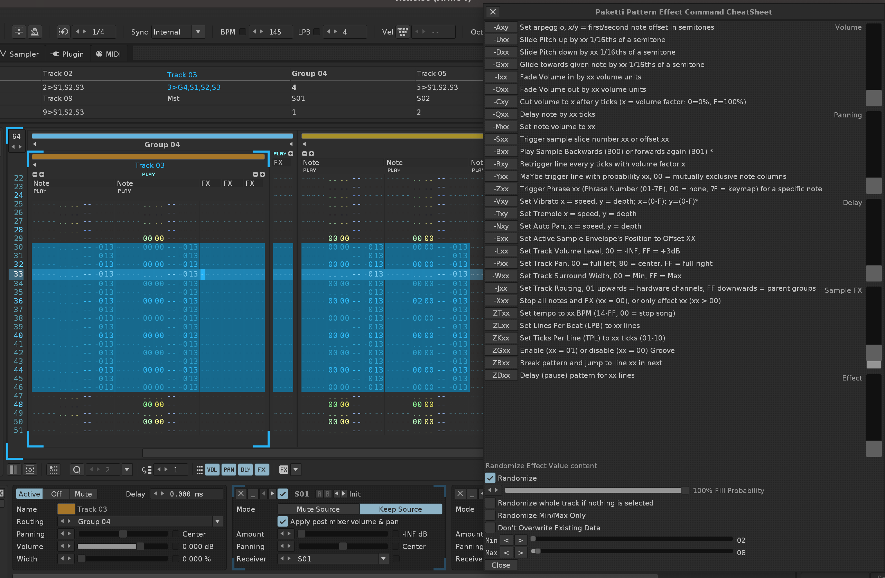


---
### 2024-08-21 - esaruoho

Improvement: Hot Dog Stand theme added to Theme Selector!


---
### 2024-08-21 - esaruoho

Improvement: Sand (Contrast) added to Theme Selector


---
### 2024-08-21 - esaruoho

Improvement: Paketti Default Drumkit XRNI Loader  can now be set in the Paketti Preferences - meaning, you aren't stuck using the default Drumkit XRNI  - and can instead use your own.
(closes https://github.com/esaruoho/org.lackluster.Paketti.xrnx/issues/305)


---
### 2024-08-21 - esaruoho

Improvement: `Pick a Random Theme (All)` now shows the name of the theme picked
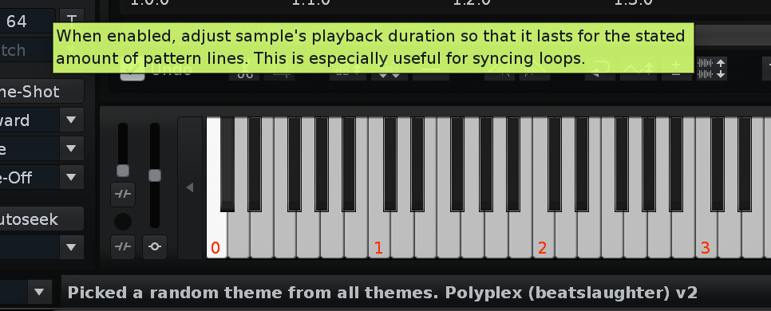


---
### 2024-08-21 - esaruoho

Improvement: Randomize a Theme on Startup of Renoise from all Themes.
(one checkbox from https://github.com/esaruoho/org.lackluster.Paketti.xrnx/issues/283 )
note: this will take preference over "Randomize Theme from Favorites".
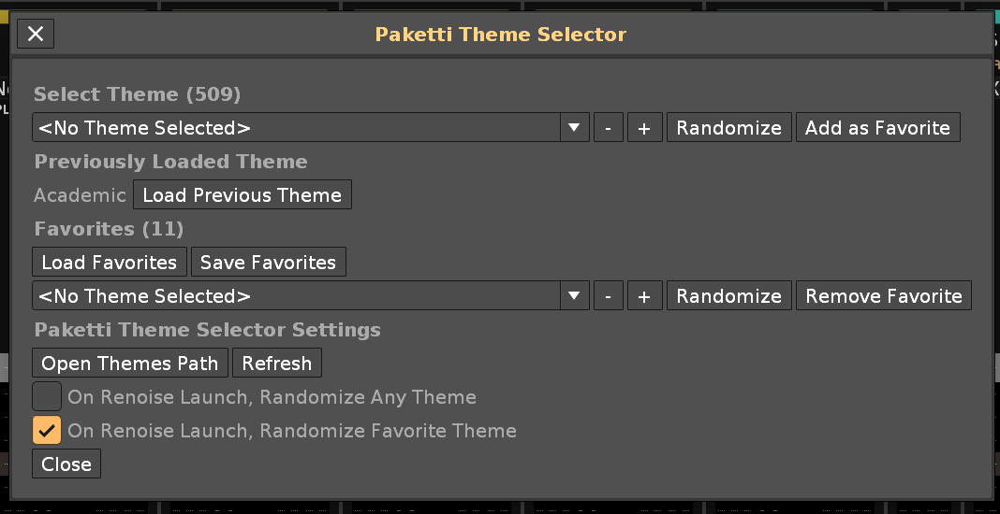


---
### 2024-08-22 - esaruoho

Improvement: "About Paketti..." Dialog will now close if it is already open, and you try to open it again.

---
### 2024-08-22 - esaruoho

Improvement: "Donate" Dialog will now close if it is already open, and you try to open it again.

---
### 2024-08-22 - esaruoho

Improvement: "Oblique Strategies" Dialog will now close if it is already open, and you try to open it again.

---
### 2024-08-22 - esaruoho

Improvement: "Paketti Theme Selector" Dialog will now close if it is already open, and you try to open it again.

---
### 2024-08-22 - esaruoho

Improvement: "Create New Instrument & Loop" now has Autofade, AutoSeek + Interpolation settings inside Paketti Preferences


---
### 2024-08-22 - esaruoho

Improvement: Paketti Gater/Retrig/Playback now has 0B01 / 0B00 added.
(closes https://github.com/esaruoho/org.lackluster.Paketti.xrnx/issues/443)


---
### 2024-08-22 - esaruoho

Improvement: Added Set Pattern Length 006 012 024
(closes https://github.com/esaruoho/org.lackluster.Paketti.xrnx/issues/438)


---
### 2024-08-22 - esaruoho

Improvement: Added Set Phrase Length 006 012 024 
(closes https://github.com/esaruoho/org.lackluster.Paketti.xrnx/issues/439 )


[Embedded Link](https://github.com/esaruoho/org.lackluster.Paketti.xrnx/issues/439)


---
### 2024-08-22 - esaruoho

Improvement: Phrase Init Generator, added 006 012 024
(closes https://github.com/esaruoho/org.lackluster.Paketti.xrnx/issues/437)


---
### 2024-08-22 - esaruoho

Improvement: Fix `Toggle Visible Column (Sample Effects) Globally` string in menu
(closes https://github.com/esaruoho/org.lackluster.Paketti.xrnx/issues/435)
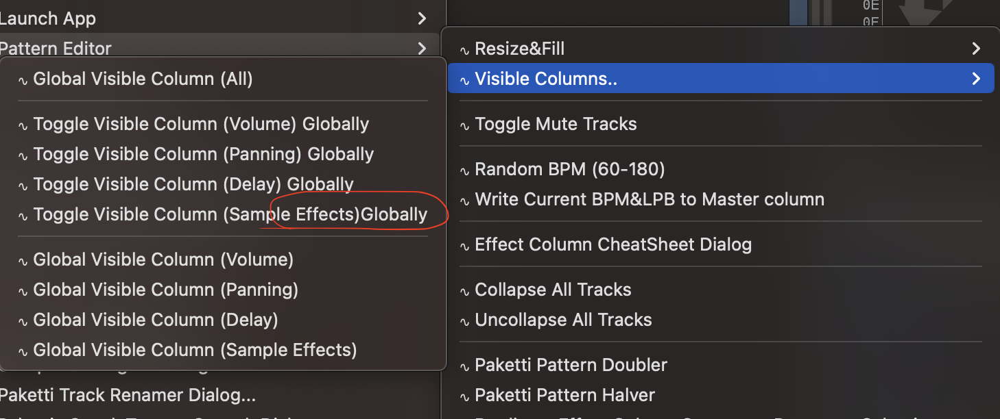

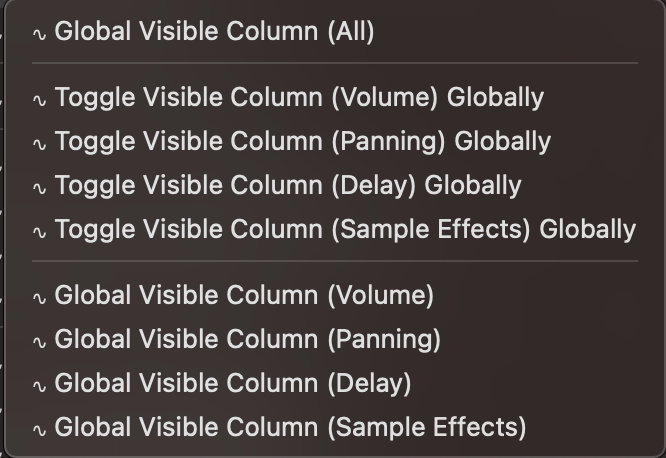


---
### 2024-08-22 - esaruoho

Improvement: Grouped Sample Editor Menu Entries(Save Sample as WAV / FLAC, Save Selected Sample Range WAV / FLAC) together for better discoverability 
(closes https://github.com/esaruoho/org.lackluster.Paketti.xrnx/issues/422)


---
### 2024-08-22 - esaruoho

Improvement: Moved Strip Silence Threshold Dialog & Move Beginning Silence to End Threshold Dialog sliders to Paketti Preferences for better discoverability.
(closes https://github.com/esaruoho/org.lackluster.Paketti.xrnx/issues/440)
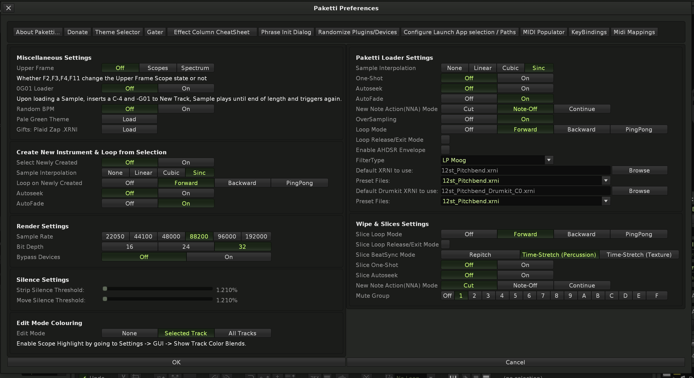


---
### 2024-08-22 - esaruoho

Feature: Max Amplitude DC Offset Kick Generator
- this creates a 16800 length sample, sets maximum amplitude, and runs a randomized amount of dc-offsets on it (1-50)
result is a clicky kick. - mix this with "recursive dcoffset randomizer" shortcut and you can get an even clickier, longer, kick-click
(closes https://github.com/esaruoho/org.lackluster.Paketti.xrnx/issues/434)
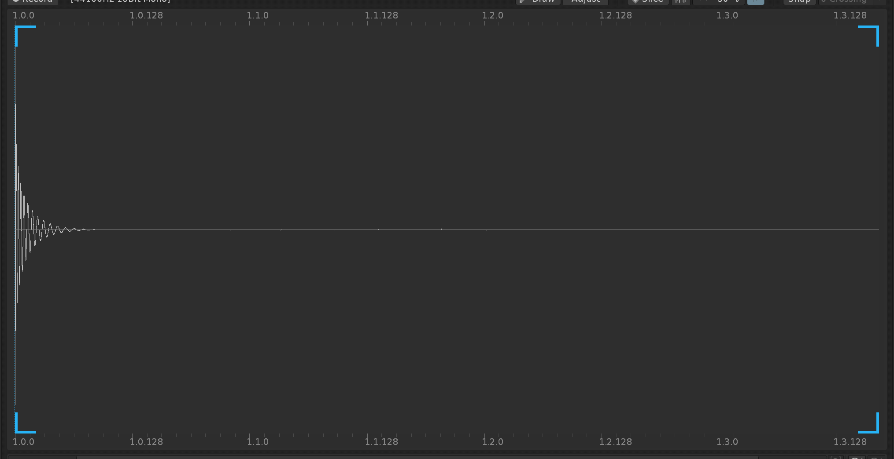


---
### 2024-08-22 - esaruoho

Improvement: F3 will now correctly exit back to Sample Editor `<->` Sample FX Chain loop .. even if you're in Phrase Editor, Keyzones or Modulation.
(closes https://github.com/esaruoho/org.lackluster.Paketti.xrnx/issues/442 & https://github.com/esaruoho/org.lackluster.Paketti.xrnx/issues/418)

---
### 2024-08-22 - esaruoho

Improvement: Added "Global Visible Column (None)" to all menu entries (Pattern Editor, Tools, View)
(closes https://github.com/esaruoho/org.lackluster.Paketti.xrnx/issues/436)


---
### 2024-08-22 - esaruoho

Improvement: Plaid Zap now uses Parallel Compression + Glide Inertia instead of "old Drumkit XRNI)
(closes https://github.com/esaruoho/org.lackluster.Paketti.xrnx/issues/427)


---
### 2024-08-23 - esaruoho

Improvement: Reintroduced LPB*2 LPB/2 to Paketti Gater


---
### 2024-08-23 - esaruoho

Improvement: F4 *2 will now go from Midi Monitor in Midi Out, to Instrument Plugins Phrase Editor (instead of Instrument Plugins External Editor screen which just has a button there for opening the External Editor)
(closes https://github.com/esaruoho/org.lackluster.Paketti.xrnx/issues/417)
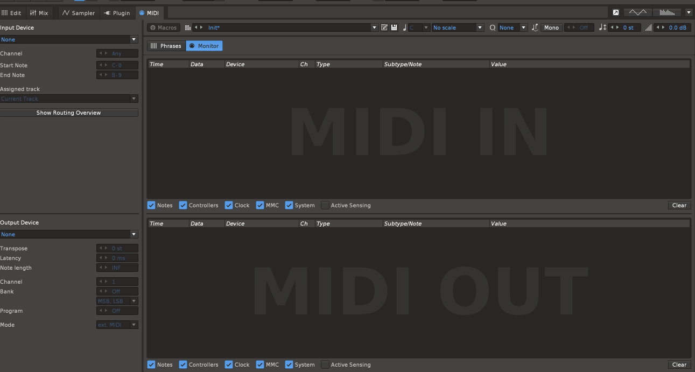


---
### 2024-08-23 - esaruoho

Feature: Wipe Selected Track Track DSPs
a shortcut that wipes the Track DSPs from the selected track
(closes https://github.com/esaruoho/org.lackluster.Paketti.xrnx/issues/419)


---
### 2024-08-23 - esaruoho

Improvement: Midi Populator will now also name the track accordingly - i.e. if you load a plugin, then the plugin name is shown in the track title.
(closes https://github.com/esaruoho/org.lackluster.Paketti.xrnx/issues/429)


---
### 2024-08-23 - esaruoho

Improvement: If you try to run "Create New Instrument and Loop" while there is no sample there - an error used to be shot. now shows a show_status and exits gracefully.
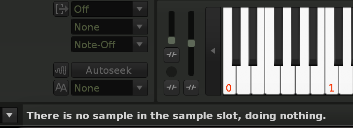


---
### 2024-08-23 - esaruoho

Improvement: Pattern Effect Command CheatSheet now has visual rows, hopefully making it easier to recognize where tempo + bpm + lpb stuff is.
(closes https://github.com/esaruoho/org.lackluster.Paketti.xrnx/issues/430)


---
### 2024-08-23 - esaruoho

Improvement: Paketti Gater will now print C00 to each of the empty checkbox rows until there's a checkbox that starts the C01 process.
also if there are no checkboxes for playback reversing checked, then `0B01` will no longer printed on each row of the selected track.

---
### 2024-08-23 - esaruoho

Improvement: Paketti Gater now has Panning for Panning Column or Effect Column 4.
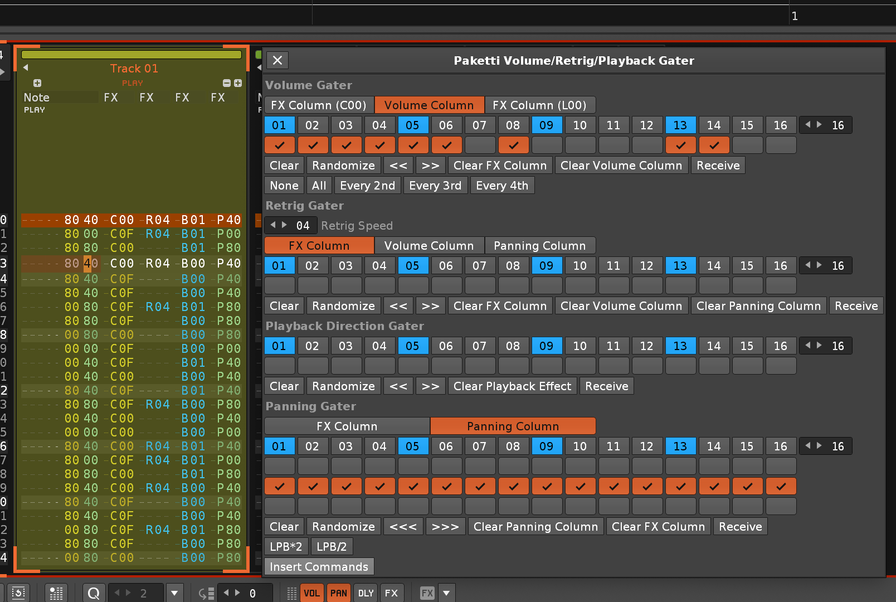


---
### 2024-08-23 - esaruoho

Feature: Multi-pattern Automation Drawing (Curve Up, Curve Down, Line Up, Line Down)  - this reads the selection in Pattern Matrix and imprints
<div style="position: relative; padding-bottom: 64.90384615384616%; height: 0;"><iframe src="https://www.loom.com/embed/2642b8a5ab7f4afe9328ddff90aba7bf?sid=7c90e800-2600-4cbc-9255-54cdf28c9a75" loading="lazy" frameborder="0" webkitallowfullscreen mozallowfullscreen allowfullscreen style="position: absolute; top: 0; left: 0; width: 100%; height: 100%;"></iframe></div>

https://www.loom.com/share/2642b8a5ab7f4afe9328ddff90aba7bf?sid=c94130c3-5274-4e7a-abb2-b4322398aa70
(Closes https://github.com/esaruoho/org.lackluster.Paketti.xrnx/issues/57)

---
### 2024-08-23 - esaruoho

Improvement: Multi-pattern Automation Drawing now has Center->Top, Top->Center, Center-> Bottom, Bottom->Center in both Exp + Lin form.
<div style="position: relative; padding-bottom: 64.90384615384616%; height: 0;"><iframe src="https://www.loom.com/embed/6d851711aa52451eb41cbedd631d61cc?sid=6ce5efe5-2c77-4def-9c7e-c2193d2374c8" loading="lazy" frameborder="0" webkitallowfullscreen mozallowfullscreen allowfullscreen style="position: absolute; top: 0; left: 0; width: 100%; height: 100%;"></iframe></div>

https://www.loom.com/share/6d851711aa52451eb41cbedd631d61cc?sid=77630b42-cef3-4ff7-a4e2-9c0192000dc4


[Embedded Link](https://www.loom.com/share/6d851711aa52451eb41cbedd631d61cc?sid=77630b42-cef3-4ff7-a4e2-9c0192000dc4)


---
### 2024-08-23 - esaruoho

Feature: Set Velocity Range 00,7F for selected sample, and 00,00 for all the other samples in the instrument. midimapping + keybinding flavors. midimapping is 0...127, keybinding is +1 -1 and random.
this lets you load f.ex. 120 snares into an instrument, you manually click "Layer" in the KeyMappings, then tweak a midiknob or press a shortcut and all the other snares  stop playing - but the one you selected will play. quickly audition your samples or other drums or oneshot synth sounds or wotevs.
(closes https://github.com/esaruoho/org.lackluster.Paketti.xrnx/issues/157)


---
### 2024-08-23 - esaruoho

Improvement: the above Switcharoo now will actually select the selected sample - meaning, if you're in the Sample Editor, you immediately can see, and start editing, the sample that you've selected with shortcuts or midimapping.


---
### 2024-08-23 - esaruoho

Improvement: Receive / Writing of Panning + 0B00 / 0B01 in Paketti Gater has had various bugs fixed, and a Jaguar preset has been added to Volume.


---
### 2024-08-23 - esaruoho

Improvement: Added "Caapi" preset to Paketti Gater


---
### 2024-08-23 - esaruoho

Improvement: Some minor improvements to make the Paketti Gater gui less wide:


---
### 2024-08-23 - esaruoho

Improvement: "Solo one sample out of all samples in instrument" (Velocity Range / Switcharoo -- still looking for a name) now prints status of which sample slot / sample name is selected.


---
### 2024-08-25 - esaruoho

Improvement: "Global Receive" added to Paketti Gater -> this will take what's in the currently selected track, and receive.


---
### 2024-08-25 - esaruoho

Feature: OctaMED Pick/Put Dialog / Shortcuts / MidiMapping:
This lets you PICK a row to a slot (10 slots).. then you can move your cursor around and PUT it anywhere, to any track. the slots are saved.
there's editstep too. so you could pick, say, 10 very highly customized rows, and bang them in yourself with midi buttons or shortcuts, to any track.
it will resize the track to fit the max 12 note columns and max 8 effect columns, if they're in use.
you can also set it to selected instrument, so grab something that uses one instrument, and paste it somewhere else, using another instrument.
(Closes https://github.com/esaruoho/org.lackluster.Paketti.xrnx/issues/453)
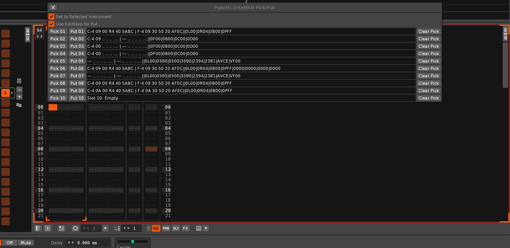

[Embedded Link](https://github.com/esaruoho/org.lackluster.Paketti.xrnx/issues/453))


---
### 2024-08-25 - esaruoho

Improvement: Paketti MIDI Populator takes less screen space - dialog is more optimized:
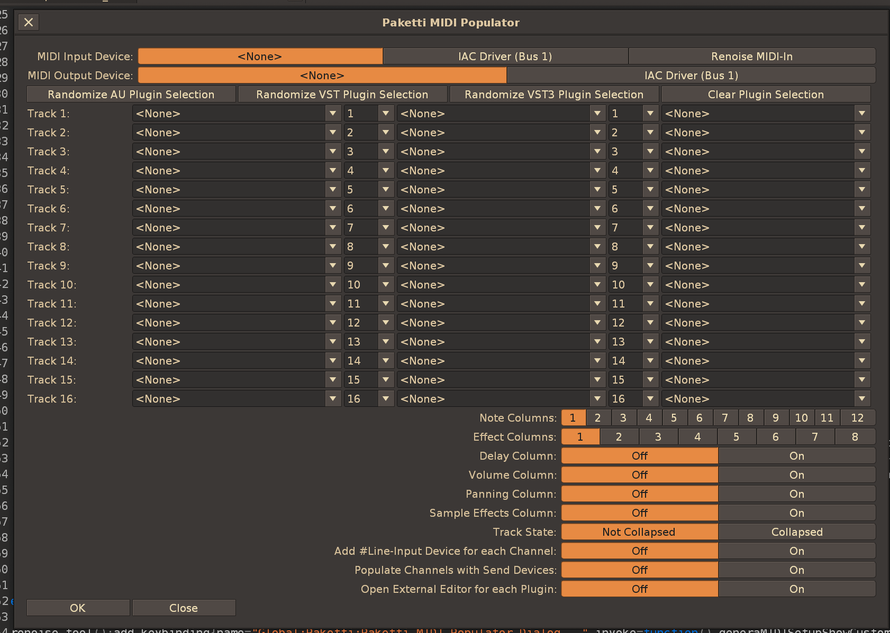


---
### 2024-08-25 - esaruoho

Improvement: OctaMED Pick/Put shortcuts + midimappings will now put slot content to pattern editor even if dialog is not open.

---
### 2024-08-25 - esaruoho

Feature: Selected Track Mute 
midimapping for toggling mute on/off with one button. if it's off, it'll be turned on. if it's on, it'll be turned off. flavors: "selected track" or track01-64. also has protection against track not existing.


---
### 2024-08-25 - esaruoho

Feature: Set all non-empty patterns to current pattern length
Set all non-empty patterns to 96 rows.
menu entries + keybinds
(closes 2/3 of https://github.com/esaruoho/org.lackluster.Paketti.xrnx/issues/464)


---
### 2024-08-26 - esaruoho

Improvement: Paketti KeyBindings + Renoise KeyBindings dialogs will now close when you run the shortcut again (and the dialog was open).

---
### 2024-08-26 - esaruoho

Improvement: Paketti Theme Selector will now return focus to Pattern Editor when opening dialog.

---
### 2024-08-26 - esaruoho

Improvement: Paketti Preferences can now be opened, closed .. and re-opened multiple times without an error

---
### 2024-08-26 - esaruoho

Improvement: Audio Processing Tools Dialog can now be opened.. and closed, with the same shortcut.

---
### 2024-08-26 - esaruoho

Improvement: Merged Audio Processing Tools Dialog and Resample Dialog together - because it makes sense.
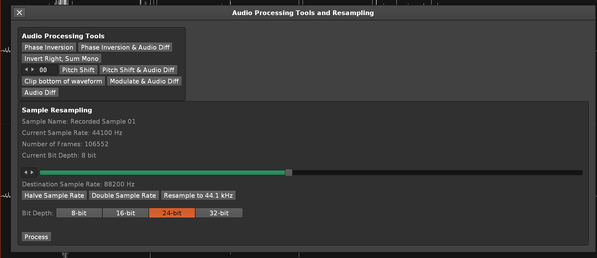


---
### 2024-08-26 - esaruoho

Improvement: fixed the width of the slider and overall the rectangle boxes.. for Audio Processing Dialog
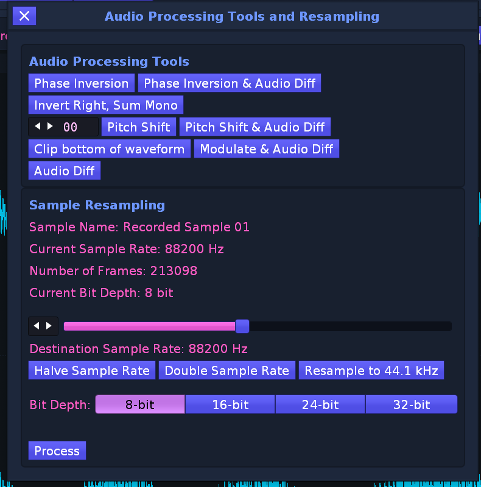


---
### 2024-08-26 - esaruoho

Improvement: Paketti About dialog is now the Donate dialog too.
(Closes https://github.com/esaruoho/org.lackluster.Paketti.xrnx/issues/465)
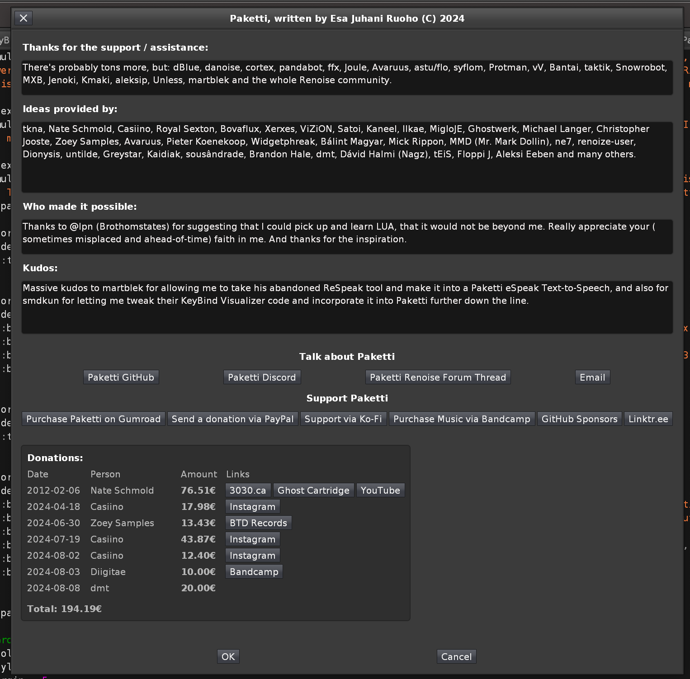


---
### 2024-08-27 - esaruoho

Improvement: Paketti Preferences topbar + Dialog of Dialogs content tweaked. (aka removed Donations, renamed "About Paketti" to "About Paketti/Donations..." - and removed "Resample" dialog since it is in Audio Processing Dialog.


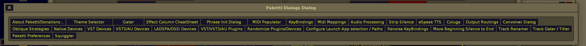


---
### 2024-08-27 - esaruoho

Improvement: Formula Device Documentation Dialog + manual text optimized so it no longer takes so much space. this loads the Formula device and displays the manual, with helpful Renoise forum links at the bottom.
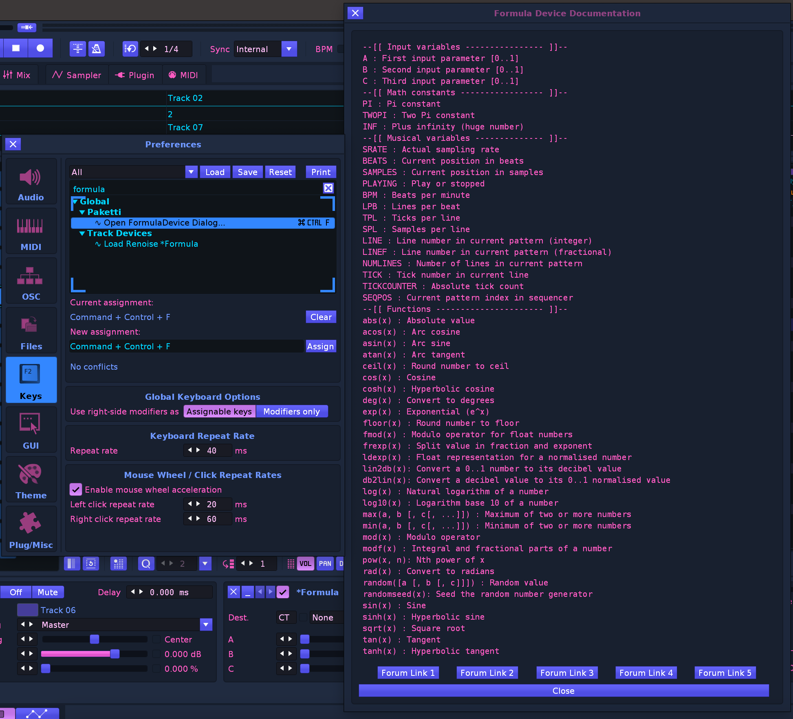


---
### 2024-08-27 - esaruoho

Improvement: App Selection dialog has now been optimized so it takes less space
(Closes https://github.com/esaruoho/org.lackluster.Paketti.xrnx/issues/470)


---
### 2024-08-27 - esaruoho

Improvement: About Paketti/Donations dialog can now be closed with "OK" or "Cancel":
(Closes https://github.com/esaruoho/org.lackluster.Paketti.xrnx/issues/482)

---
### 2024-08-27 - esaruoho

Improvement: Pattern Effect CheatSheet will now correctly write to current row SampleFX Column if no selection in pattern exists - instead of erroring.
(Closes https://github.com/esaruoho/org.lackluster.Paketti.xrnx/issues/475 )

---
### 2024-08-27 - esaruoho

Feature: "Duplicate Sample Range, Mute Original"
this takes the samplerange, copies it to a new sample slot, mutes the original and makes sure all other settings are copied for the sample. (transpose, pitch, finetune, panning, autofade,autoseek, interpolation, oversampling, beatsync etc)
(Closes https://github.com/esaruoho/org.lackluster.Paketti.xrnx/issues/457)
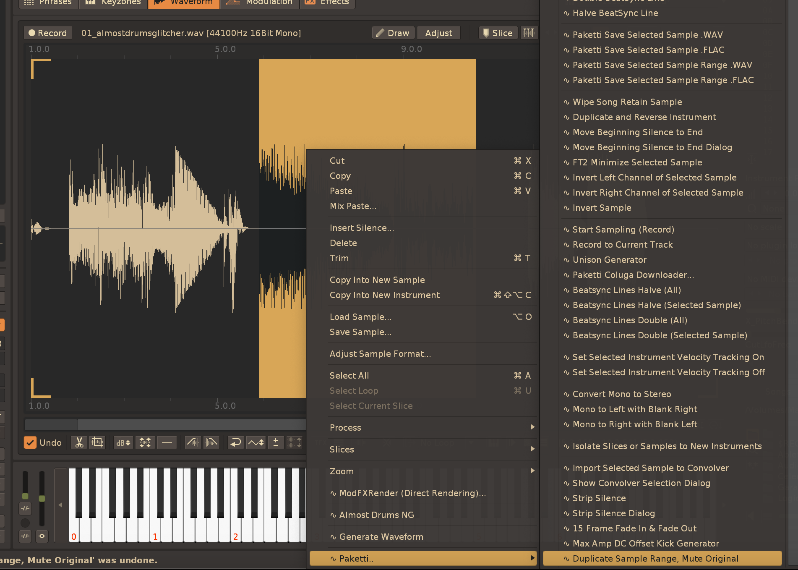


---
### 2024-08-27 - esaruoho

Improvement: "Interpolate Effect Column Parameters" now also duplicates the first row effect number - so it's not just empty lines with interpolated effect values.
(Closes https://github.com/esaruoho/org.lackluster.Paketti.xrnx/issues/170
and https://github.com/esaruoho/org.lackluster.Paketti.xrnx/issues/480
and https://github.com/esaruoho/org.lackluster.Paketti.xrnx/issues/473)
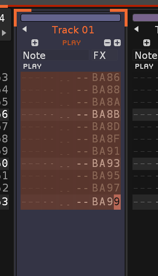


---
### 2024-08-27 - esaruoho

Feature: Clean Render Selected Track or Group and save as WAV or FLAC
this will do a render of the original track, without muting notecolumns of original track, without collapsing the track, and without printing C-4 on a new track (since no new track is created).
this is basically a shortcut and a menu entry for "selected track or group straight to .WAV/.FLAC".
(Closes https://github.com/esaruoho/org.lackluster.Paketti.xrnx/issues/408)
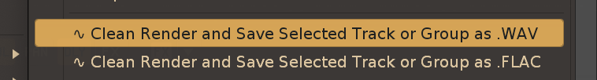


---
### 2024-08-27 - esaruoho

Feature: Randomize Selected Sample Pitch +6/-6 and Finetune +127/-127
(Closes https://github.com/esaruoho/org.lackluster.Paketti.xrnx/issues/458)
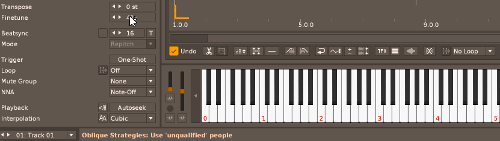


---
### 2024-08-27 - esaruoho

Improvement: moved "Strip Silence Dialog & Move Beginning Silence to End Dialog" content to Audio Processing Dialog
(closes https://github.com/esaruoho/org.lackluster.Paketti.xrnx/issues/451)


---
### 2024-08-28 - esaruoho

Improvement: Audio Processing Tool now includes "15 frame fade in, 15 frame fade out" - and it correctly updates the sample waveform at the end of running it - and some visual tweaks to make the dialog take less space.


---
### 2024-08-28 - esaruoho

Improvement: Added Max Amp DC Offset Kick, DC Offset, DC Offset 1-50 times buttons to Audio Processing dialog and a slider for running DC Offset multiple times (1-500 times)
(Closes https://github.com/esaruoho/org.lackluster.Paketti.xrnx/issues/450)
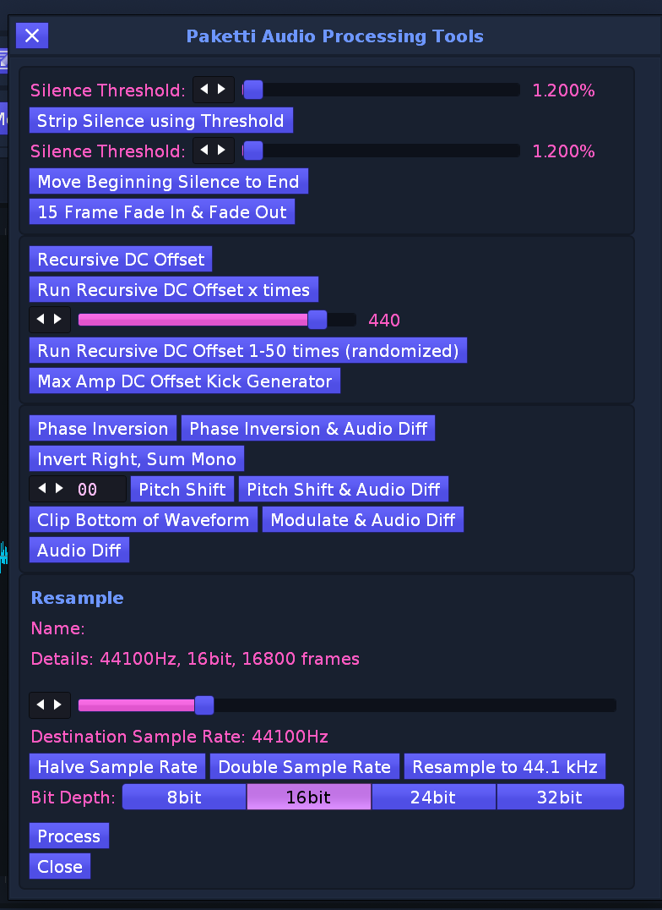


---
### 2024-08-28 - esaruoho

Improvement: Rotate up,down,left,right shortcuts + midimappings now all refer to Rotate instead of some Rotate and some Shift.
(Closes https://github.com/esaruoho/org.lackluster.Paketti.xrnx/issues/481)
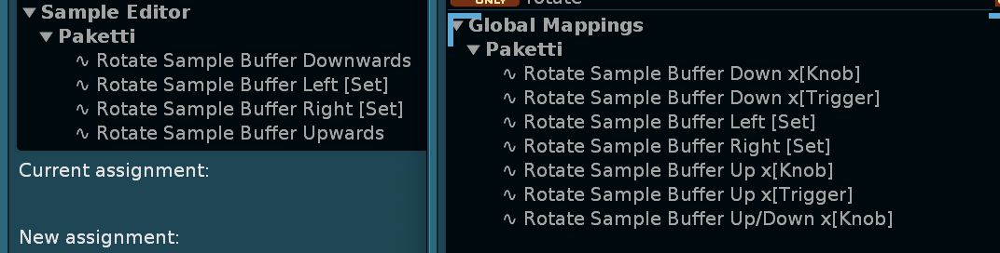


---
### 2024-08-28 - esaruoho

Improvement: Added Invert Left Channel, Invert Right Channel, Invert Sample buttons to Audio Processing Dialog.
also added DC Offset, Recursive DC Offset with a slider, and a max amp dc offset kick generator
(Closes https://github.com/esaruoho/org.lackluster.Paketti.xrnx/issues/485)
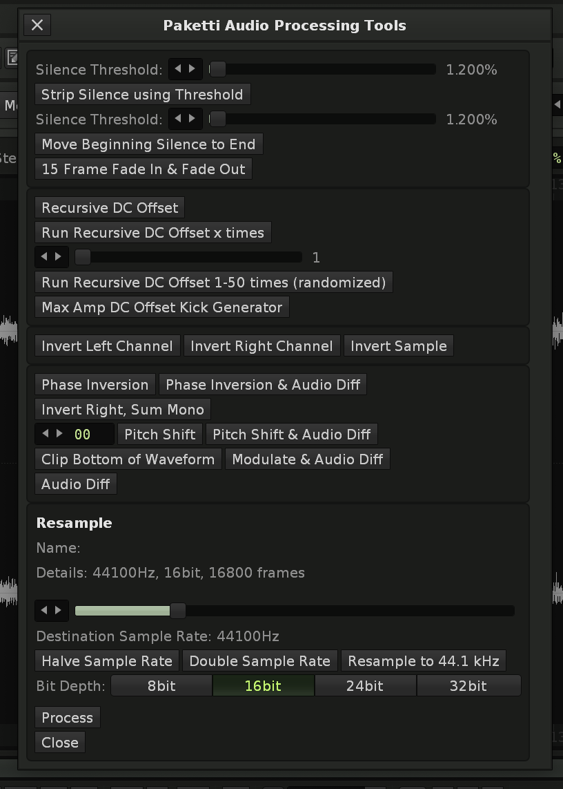


---
### 2024-08-28 - esaruoho

Improvement: Resample Name + Details now change when changing to a new sample, and they update when running Process or Resample 44.1khz
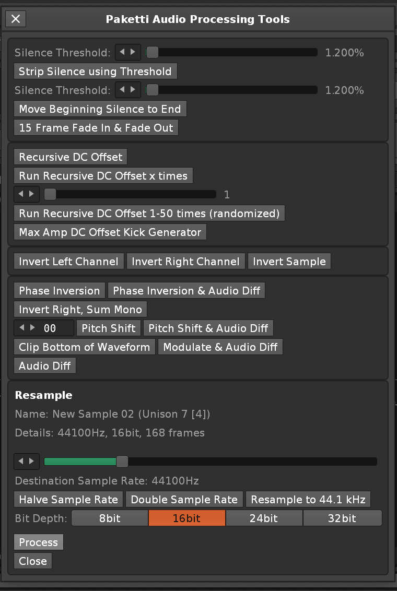


---
### 2024-08-28 - esaruoho

Feature: Transpose Notes in Selection via Midi Mapping
(Closes https://github.com/esaruoho/org.lackluster.Paketti.xrnx/issues/449)


---
### 2024-08-28 - esaruoho

Improvement: Rotate Sample Buffer Left/Right Fine + Coarse MidiMappings:
and with protection against rotating a sample larger than 64000 frames - (as it would cause a significant hit on performance, crash renoise - well, all 3.
(Closes https://github.com/esaruoho/org.lackluster.Paketti.xrnx/issues/486)
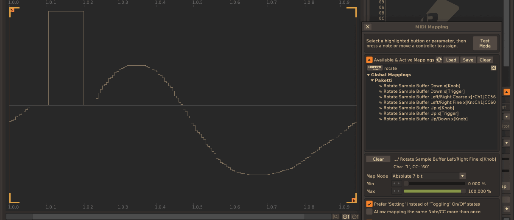


---
### 2024-08-28 - esaruoho

Improvement: Rotate Sample Buffer Left / Right by 1000/10000 shortcuts now implemented.
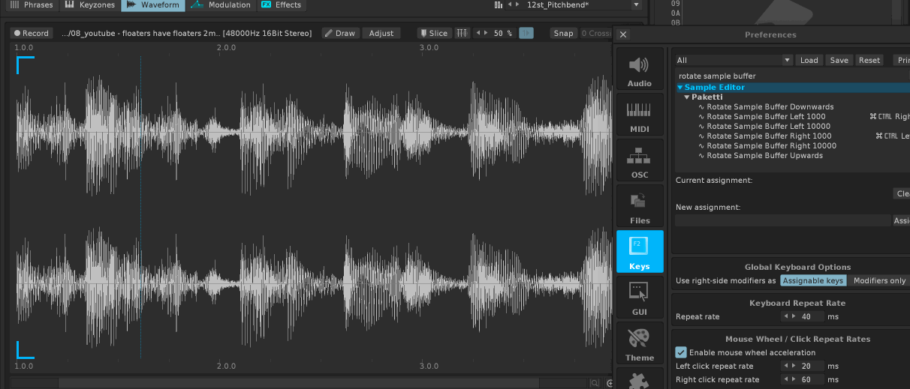

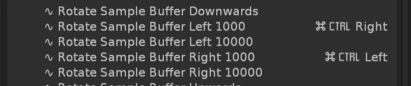


---
### 2024-08-28 - esaruoho

Feature: Duplicate selected Sample, Maximize Sample, Convert to 16bit, save as WAV or FLAC
(Closes https://github.com/esaruoho/org.lackluster.Paketti.xrnx/issues/445)


---
### 2024-08-28 - esaruoho

Improvement: Midi Change 05 Effect Column Value x[Knob] will now work even if you are on Note Column. it used to shoot an error.
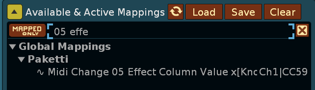


---
### 2024-08-28 - esaruoho

Improvement: Introduced "Sample FX Column Visible" to the dialog + preferences for Paketti Phrase Init.

also modified "Create Phrase" entry in Menu Entries to read the Phrase Init Settings and use them.
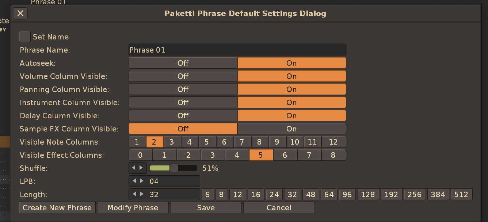


---
### 2024-08-28 - esaruoho

Improvement: Flood Fill Note and Instrument every 1-64 step now also captures Volume, Panning, Delay, SampleFX column content
(Closes https://github.com/esaruoho/org.lackluster.Paketti.xrnx/issues/476)


---
### 2024-08-28 - esaruoho

Feature: Replicate at Cursor (0, +1, -1, +12, -12). this will replicate everything that is above the cursor to below the cursor until pattern runs out.
this is from PollyTracker, JohnPlayer and QuantumSoundTracker.
<div style="position: relative; padding-bottom: 64.86486486486486%; height: 0;"><iframe src="https://www.loom.com/embed/66b956cf80d24ad2a72ed5abe590b84a?sid=eb84ac98-249e-4ab1-9bda-47e3fc75d6ce" loading="lazy" frameborder="0" webkitallowfullscreen mozallowfullscreen allowfullscreen style="position: absolute; top: 0; left: 0; width: 100%; height: 100%;"></iframe></div>

https://www.loom.com/share/66b956cf80d24ad2a72ed5abe590b84a?sid=fae3b7e0-359f-472b-b059-5a4c9ab9a683
(Closes https://github.com/esaruoho/org.lackluster.Paketti.xrnx/issues/460)
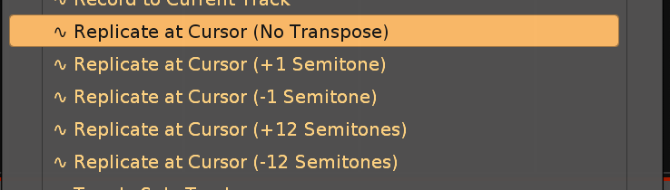


---
### 2024-08-28 - esaruoho

Improvement: Added "Replicate Selected Track at Cursor" to the above.

quick demo.
<div style="position: relative; padding-bottom: 64.90384615384616%; height: 0;"><iframe src="https://www.loom.com/embed/2df6c536454041128e2d38aff6c4dcd3?sid=a2603636-8c75-4cf8-907b-560d12f3f9e0" loading="lazy" frameborder="0" webkitallowfullscreen mozallowfullscreen allowfullscreen style="position: absolute; top: 0; left: 0; width: 100%; height: 100%;"></iframe></div>

https://www.loom.com/share/2df6c536454041128e2d38aff6c4dcd3?sid=8c2ce261-ce79-45a3-a9c9-02efb6ecb432
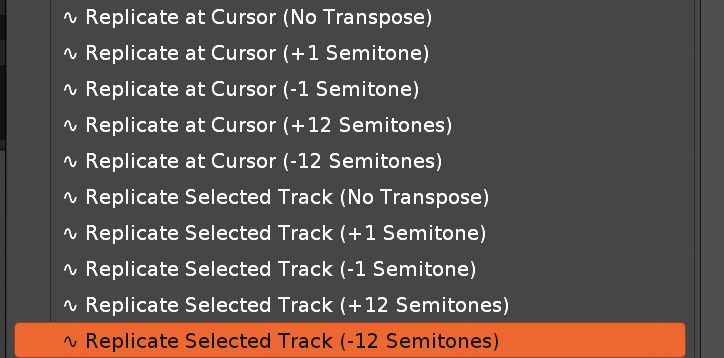


---
### 2024-08-29 - esaruoho

Improvement: Rotate Sample Buffer Left / Right  by 10, 100 added


---
### 2024-08-29 - esaruoho

Improvement: Wipe&Slice now reads if the drumloop or other loop has beatsync mode ON and a specific line set. meaning. if you set sample to 128 beatsync, and slice into 64 slices, then each slice will have beatsync 2. if you set sample to 16 beatsync, and slice into 16 slices, then each slice will have beatsync 1. and so on.
and if sample has no beatsync, then slice without beatsync.
(Closes https://github.com/esaruoho/org.lackluster.Paketti.xrnx/issues/100)

---
### 2024-08-29 - esaruoho

Feature:  Draw a diagonal line to new sample for DC Offset drum generation
(Closes https://github.com/esaruoho/org.lackluster.Paketti.xrnx/issues/493)


---
### 2024-08-29 - esaruoho

Improvement: Paketti Transpose  will no longer shoot an error if you try to transpose a selection in a Group, Send or Master track which cannot have Note Columns. Will cleanly error. If selection in pattern contains tracks, sends, groups and masters - no error will be shot, also - just transpose the rows with notes.
(Closes https://github.com/esaruoho/org.lackluster.Paketti.xrnx/issues/488)


---
### 2024-08-30 - esaruoho

Improvement: The Randomized Theme randomizing is now run once, not twice, on load/save of Song and restart of Renoise.

---
### 2024-08-31 - esaruoho

Improvement: Added "Mono->Stereo" & "Mono->Stereo (Blank L)" and "Mono->Stereo (Blank R)" to Audio Processing Dialog.


---
### 2024-08-31 - esaruoho

Feature: Double LPB / Halve LPB - this will double the current LPB - or halve it, if possible (odd LPBs will not be halved).
(Closes https://github.com/esaruoho/org.lackluster.Paketti.xrnx/issues/500 )


---
### 2024-08-31 - esaruoho

Feature: Initialize Groove Automation.
this adds three `*Instr. Automation` devices to Master, the first is set up for Global Groove Settings (slot 1-4) and the second one is set for EditMode, EditStep and Octave, and a currently experimental RunScript1 and a third device will have RunScript2-5. 
they will be the first four `No Parameter` in each automation for each device.

these are not yet configured for anything since I'm trying to find usecases for which Paketti functions should be automated.
(Closes https://github.com/esaruoho/org.lackluster.Paketti.xrnx/issues/150)

Here's a little video of how it works:
<div style="position: relative; padding-bottom: 64.90384615384616%; height: 0;"><iframe src="https://www.loom.com/embed/f24ab48833aa47aab640aa3a79350b16?sid=891d6b7d-f83b-48a6-a43e-dcd256bb2a0e" loading="lazy" frameborder="0" webkitallowfullscreen mozallowfullscreen allowfullscreen style="position: absolute; top: 0; left: 0; width: 100%; height: 100%;"></iframe></div>
https://www.loom.com/share/f24ab48833aa47aab640aa3a79350b16?sid=c6c8c08d-1aae-49f8-86e2-8b15e1a31c2e


---
### 2024-09-01 - esaruoho

Improvement: the above Automation now is named accordingly - am still tweaking this and it requires a reload of the parameter notifiers on every song load or song save, but at least the automation lanes are named accordingly.


---
### 2024-09-01 - esaruoho

Improvement: Another screenshot for the above to show the improvement better
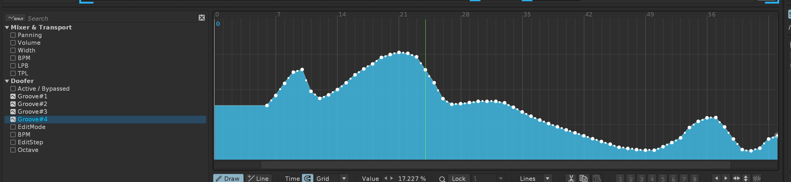


---
### 2024-09-01 - esaruoho

Improvement: "instr00" is automatically added, which is a placeholder for "Paketti Automation" - and now there's no chance you will accidentally automate some plugin's parameters.

---
### 2024-09-01 - esaruoho

Improvement: When launching Paketti Automation - the current Global Groove 1-4, EditStep, LPB, BPM, Octave are read into the Doofer devices. so there's no "oh!" panic situation happening when launching the init (i.e. all your settings changing)
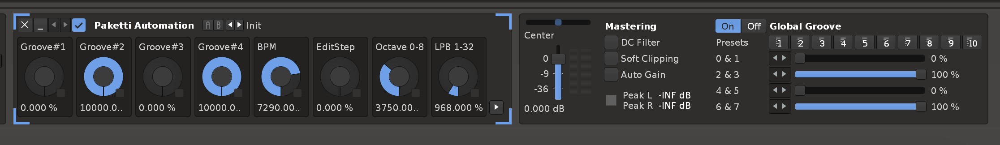


---
### 2024-09-01 - esaruoho

Improvement: Upon request from Osionik `Cyberpunk1.xrnc` has been renamed as `Osi-Cyberpunk1.xrnc` in Themes

---
### 2024-09-01 - esaruoho

Improvement: `Mono Blue` & `Mono Orange` & `Mono Red` removed since `Mono Blue (dblue).xrnc` & `Mono Orange (dblue).xrnc` & `Mono Red (dblue).xrnc` already exist

---
### 2024-09-01 - esaruoho

Improvement: 12st_Pitchbend.xrni instrument (aka Paketti PitchBend Multiple Sample Loader etc) now has "PitchStepper" automatically added to the instrument. this means you have a 16 step randomizer for pitch there, which will only become active when you start configuring the steps.


---
### 2024-09-01 - esaruoho

Feature: "Jump to Sends" - this jumps to Sends globally, anywhere. (Renoise Native jump one is only available in the Mixer)
(Closes https://github.com/esaruoho/org.lackluster.Paketti.xrnx/issues/504)


---
### 2024-09-01 - esaruoho

Improvement: eSpeak TTS now has Randomize Settings for randomizing Language, Voice, Word Gap, Pitch Capitals, Pitch, Speed.
(Closes 3rd checkbox of https://github.com/esaruoho/org.lackluster.Paketti.xrnx/issues/307 )

---
### 2024-09-01 - esaruoho

Improvement: Added "Normalize Sample" function to Audio Processing Dialog.


---
### 2024-09-01 - esaruoho

Improvement: eSpeak TTS now automatically normalizes the audio, this prevents clipping.
(Closes a todo-entry in https://github.com/esaruoho/org.lackluster.Paketti.xrnx/issues/307)

---
### 2024-09-01 - esaruoho

Improvement: eSpeak TTS now has `Randomize Consonants` and `Randomize Vowels`
(Closes a todo-entry in https://github.com/esaruoho/org.lackluster.Paketti.xrnx/issues/307)


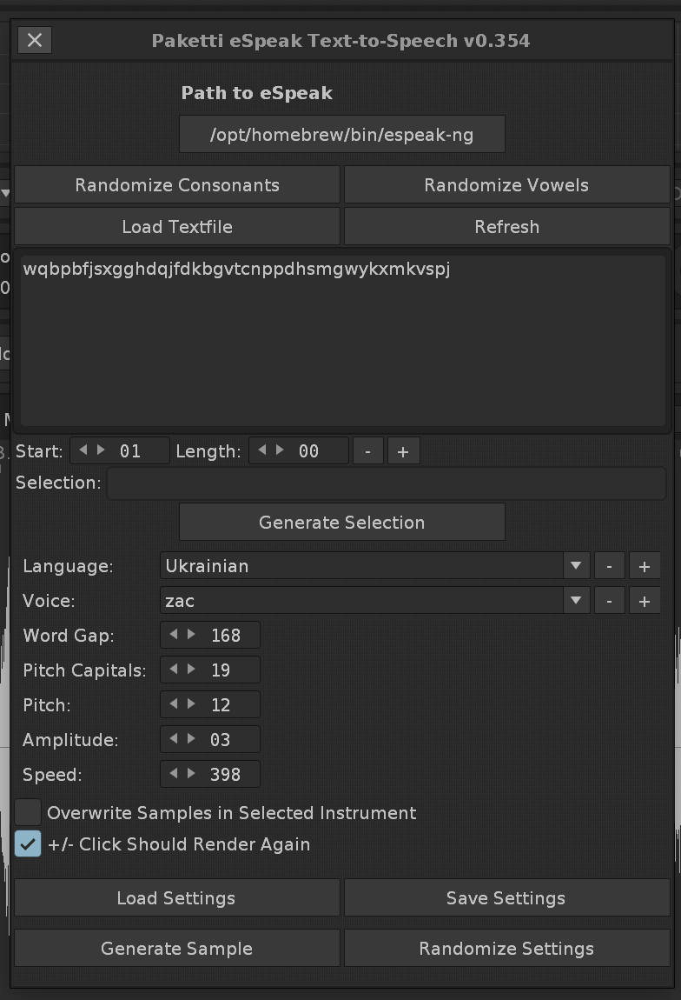


---
### 2024-09-01 - esaruoho

Improvement: eSpeak TTS now has `Randomized String` 
(Closes a todo-entry in https://github.com/esaruoho/org.lackluster.Paketti.xrnx/issues/307)
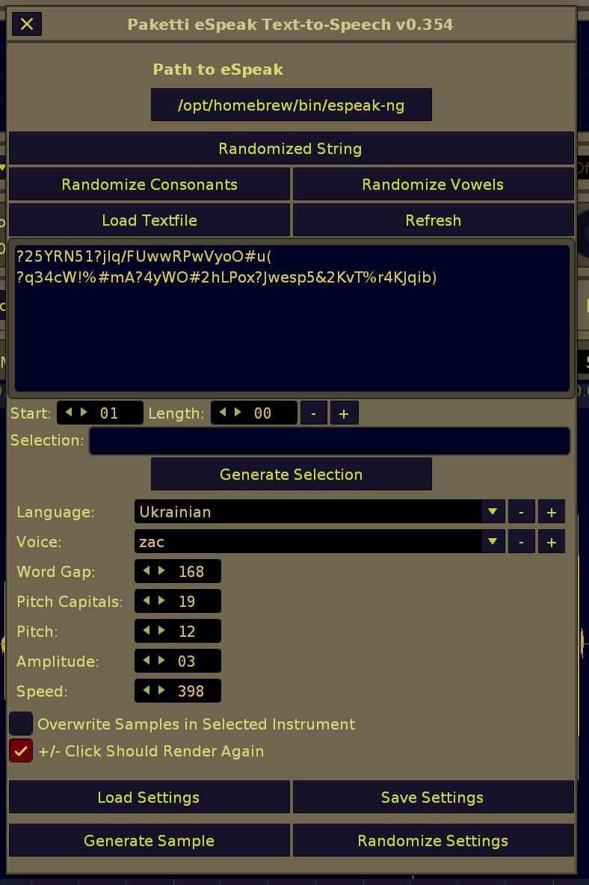


---
### 2024-09-01 - esaruoho

Improvement: Added Pitchbend Drumkit Init Menu Entries (Instrument Box, Tools, keybinding)
(Closes https://github.com/esaruoho/org.lackluster.Paketti.xrnx/issues/507)


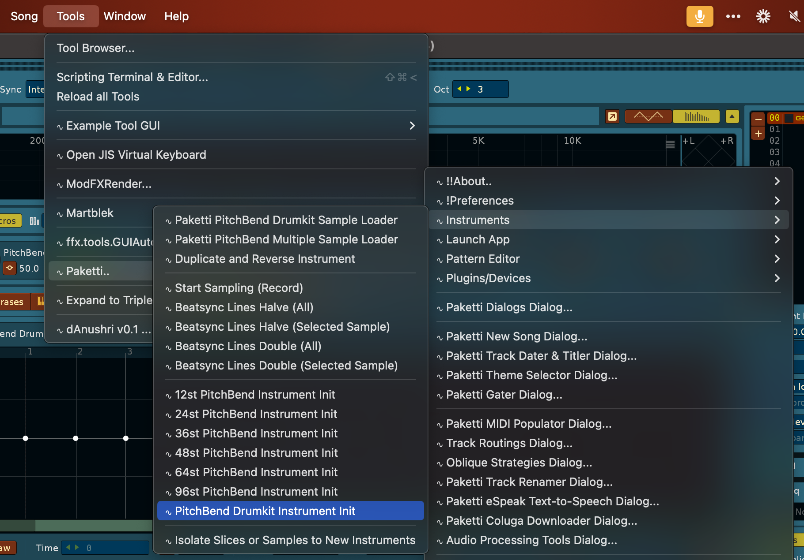

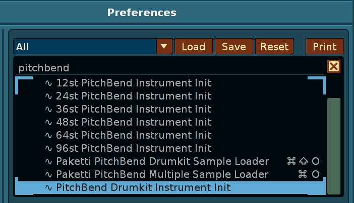


---
### 2024-09-01 - esaruoho

Improvement: added PitchStep to Drumkit default XRNI

---
### 2024-09-02 - esaruoho

Feature: Show/Hide PitchStep External Editor
this will show/hide the PItchStep External Editor of selected device.. There's protection against errors if there's no sample, or if modulationset is not called `Pitchbend`. 
(Closes https://github.com/esaruoho/org.lackluster.Paketti.xrnx/issues/506)


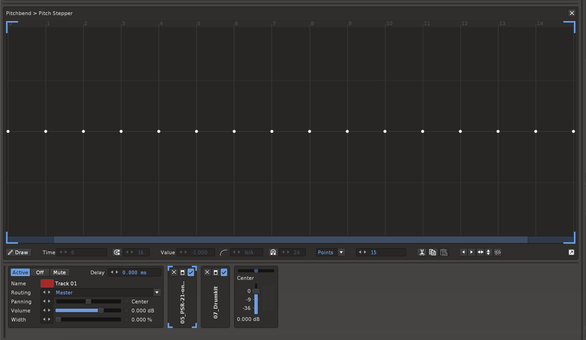


---
### 2024-09-02 - esaruoho

Feature: Pakettify Selected Instrument - this will make an identical copy of the sample, samples or slices, and inject the Default XRNI into the mix.


---
### 2024-09-02 - esaruoho

Improvement: .WAV and .FLAC are now capitalized in the Dialogs for saving samples.
(Closes https://github.com/esaruoho/org.lackluster.Paketti.xrnx/issues/514)

---
### 2024-09-02 - esaruoho

Improvement: "Set Pattern Length" and "Set Phrase Length" shortcuts will now show the number in Hex after it. so `012 (00C)`
(Closes https://github.com/esaruoho/org.lackluster.Paketti.xrnx/issues/512)


---
### 2024-09-02 - esaruoho

Improvement: OctaMED Pick/Put Slots are now named from 01-10 instead of from 1-10
(Closes https://github.com/esaruoho/org.lackluster.Paketti.xrnx/issues/511)


---
### 2024-09-02 - esaruoho

Improvement: Changed the Clean Render and Save Selected Track or Group as .WAV to a shorter version for better discoverability in KeyBinding:
(Closes https://github.com/esaruoho/org.lackluster.Paketti.xrnx/issues/515)


---
### 2024-09-02 - esaruoho

Improvement: added "Replicate at Cursor" MidiMappings:
(Closes https://github.com/esaruoho/org.lackluster.Paketti.xrnx/issues/518)


---
### 2024-09-02 - esaruoho

Improvement: Paketti Gater "Retrig Gater" feature will now clear the steps that don't have checkboxes set to On.
It will now read the switch status (FX Column, Volume Column, Panning Column) for Retrig - and clear that, before printing the new content in.
(Closes https://github.com/esaruoho/org.lackluster.Paketti.xrnx/issues/478)

---
### 2024-09-02 - esaruoho

Improvement: Paketti Gater "Panning Gater" - Clear FX Column or Clear Panning Column will now set `0P80` or `40` (panning column) when wiping. - returning the Panning to the original state.
(Closes https://github.com/esaruoho/org.lackluster.Paketti.xrnx/issues/456)
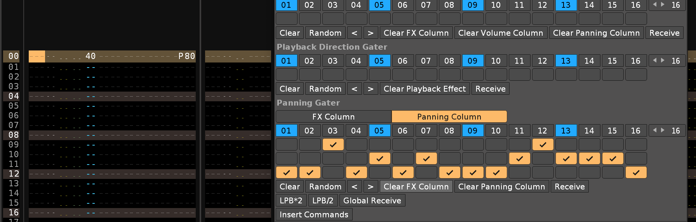


---
### 2024-09-03 - esaruoho

Improvement: Unison Generator now auto-sets the Instrument Volume down to -10.5dB to evade clipping

---
### 2024-09-03 - esaruoho

Feature: Chordsplus add 1-12 / sub 1-12. This takes the current note column content, and adds x to it and adds the note+x to the next column row. if there's more visible note columns required, then it adds more visible note columns. looks like this:


---
### 2024-09-03 - esaruoho

Feature: "Insert Note Offs to all Visible Note Columns" - this will put a note off to all the visible note columns.


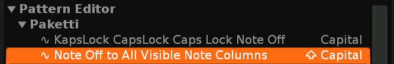


---
### 2024-09-03 - esaruoho

Improvement: Paketti Automation now has 2 Doofers. the Doofer2 has "EditMode" & "Sample Recorder" & "Pattern Length" and "Instrument Pitch"
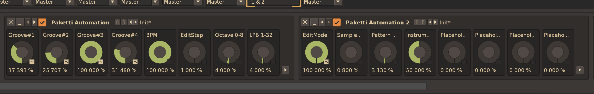


---
### 2024-09-03 - esaruoho

Improvement: 2nd Doofer now has "LoopEnd" for Selected Sample. 
example:
<div style="position: relative; padding-bottom: 64.90384615384616%; height: 0;"><iframe src="https://www.loom.com/embed/acbb53d9d5b34f04b9dc11f9274fb794?sid=6d95d0b5-f339-4800-a6d8-20bab7cca78e" loading="lazy" frameborder="0" webkitallowfullscreen mozallowfullscreen allowfullscreen style="position: absolute; top: 0; left: 0; width: 100%; height: 100%;"></iframe></div>
https://www.loom.com/share/acbb53d9d5b34f04b9dc11f9274fb794?sid=2e88e830-5ecc-4be4-a72e-8614873b4423

---
### 2024-09-03 - esaruoho

Improvement: "Insert Note Offs to all Visible Note Columns" has been renamed to `Toggle Note Off in All Visible Note Columns` - and yep, it now adds or removes Note Off.

---
### 2024-09-03 - esaruoho

Improvement: Added BPM +0.5 & -0.5 shortcuts 
(Closes https://github.com/esaruoho/org.lackluster.Paketti.xrnx/issues/520)

---
### 2024-09-03 - esaruoho

Feature: Track Grouper - creates a Group based on Selection in Pattern.
`Selection in Pattern to Group`

edit: this is a KeyShortcut that i run in the video. i select tracks with mouse or keyboard (regular renoise feature), then run the shortcut and bang, the tracks that are in the selection, are grouped)
(idea from https://forum.renoise.com/t/fastest-group/34495)
(Closes https://github.com/esaruoho/org.lackluster.Paketti.xrnx/issues/521 )
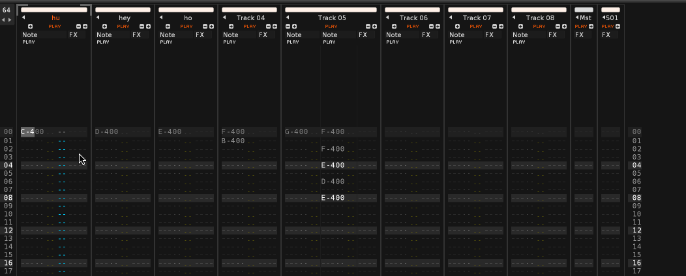

[Embedded Link](https://github.com/esaruoho/org.lackluster.Paketti.xrnx/issues/521)


before: here's `hey` `ho` `huh` and `track 08` selected
after: here's the selection grouped. 👍


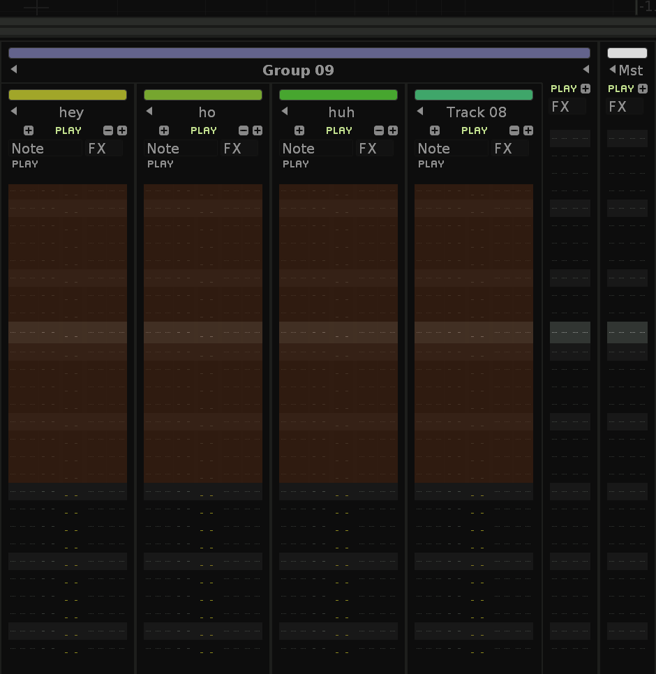


---
### 2024-09-04 - esaruoho

Feature: There's now a Customization folder inside Paketti which includes the transparent "Badge" & "Logo" images - so that your Renoise can look like this (i.e. Renoise logos  from bottom right + R badge in Instrument Box are removed)
note, the copying is manual work since Renoise cannot be open at the same time. These are just stashed so they are safe.
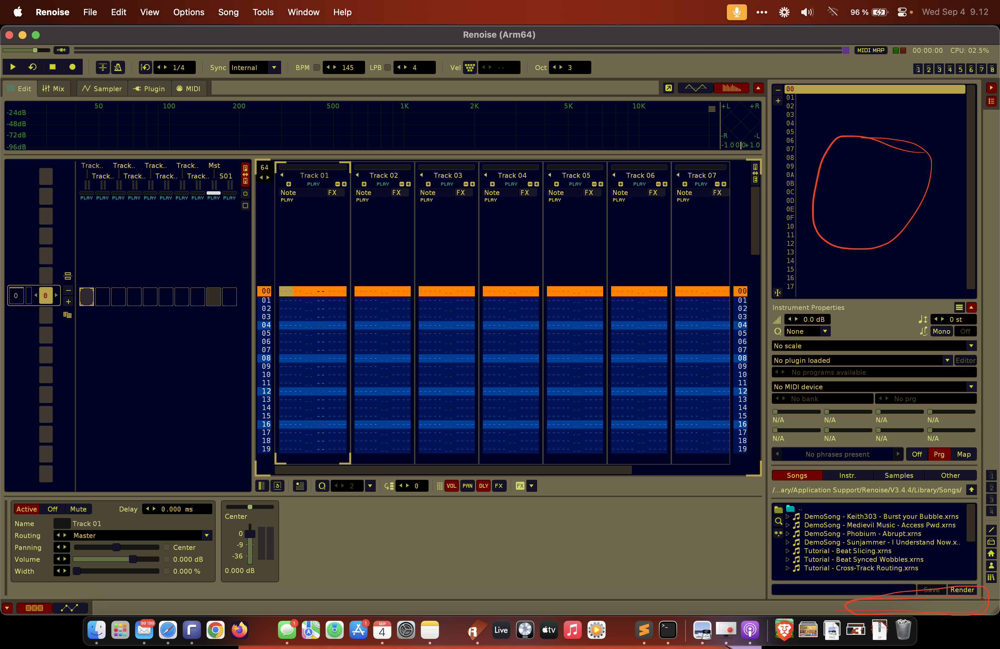


---
### 2024-09-04 - esaruoho

Improvement: Paketti Gater now correctly writes a 0P7F for real Center, when wiping Panning with no entries.
EDIT: it's actually a bug in Renoise. they say `0P80` is center, but when you right-click on Center, it says `0P7F` and neither of them are Center. i've reported it.

---
### 2024-09-04 - esaruoho

Improvement: the Paketti Automation Doofer will now correctly set Global Groove 1,2,3,4, LPB, BPM, EditStep and Octave to the Doofer device - so you can start automating from "actual settings".

---
### 2024-09-04 - esaruoho

Improvement: Unison Generator now introduces randomized Panning (Hard Left / Hard Pan), and Finetuning happens randomly between -8 and 8 finetune values.

---
### 2024-09-04 - esaruoho

Feature: Chordsplus - this one is heavily in progress. Basically, you select a note on the first note column, and run either "add 1" to "add 12" - what it does is, print a note on the second note column that is pitched upwards by the number. so "add 3"? C-4 now has D#4 on the second note column. add 4? C-4 now has E-4 on the second note column. you can continue until you get to the 12th note column, after which, you'll be kicked back to the first note column but next row.

then, the same for sub to sub 12 - you have a C-4 on note column and run sub12? you now have C-3 on the next note column and that column is selected. this means you can quickly put together a chord with intervals.

but that's not all.

there are ready-made chords that you bang out with a shortcut (check second screenshot).
this means, you run the script while cursor is on a basenote -> result is a chord.

and the real deal is the midimapping. Global:Paketti:Chord Selector [0-127] <- this means you're on any row with a note on notecolumn1 -> twist a knob, and you've output an interval based on the note the cursor is under. meaning a large amount of possibilities of chords and variations.

note: this is very much a work in progress so if you're seeing intervals that are missing, send me a DM with the intervals (run them as "3-4-4-3" meaning 3rd transpose of basenote, 4th transpose of 2nd note, 4th transpose of 3rd note and 3rd transpose of 4th note.

I'm also introducing "Toggle Note Off to all Visible Note Columns on track" and a "Phrasing Randomizer" which takes the notes on your row and transposes them by 1, 2, 3 octaves up or down.

if you have any ideas, please get in touch.
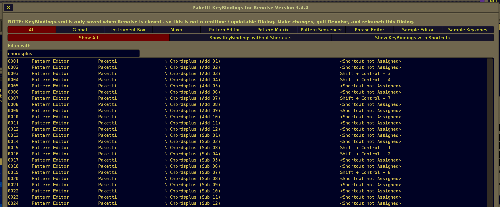


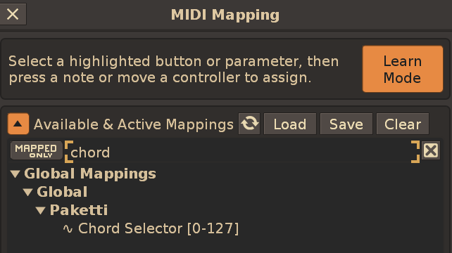

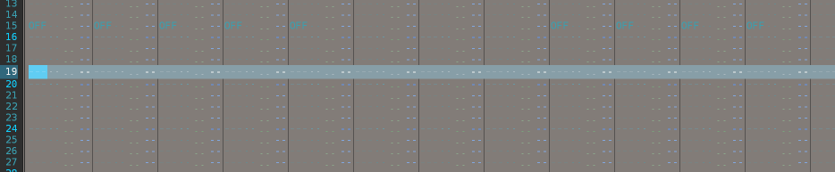


---
### 2024-09-05 - esaruoho

Improvement: Paketti Phrase Doubler / Halver naming tweaked
(Closes https://github.com/esaruoho/org.lackluster.Paketti.xrnx/issues/526)


---
### 2024-09-06 - esaruoho

Improvement: PitchStep Show/Hide will now allow for hiding the PitchStep if running the shortcut on an instrument that has no instrument / sample.

---
### 2024-09-06 - esaruoho

Plumbing: Paketti Manual has now been added to my account, and the first PR has been merged in.
( https://github.com/esaruoho/paketti-manual/ )

---
### 2024-09-06 - esaruoho

Feature: Show/Hide Selected Device on Master or Selected Track
you have your favorite visualizer or different device on Master? now you can set "ok, always show TDR Kotelnikov external editor, no matter where it is on Master, if shown, hide it". meaning, you can configure your preferred devices to be shown on master or on selected track, 10 slots in total. you will get a dropdown menu with a list. if you always have device1, device2, device3 on your master - anywhere in the fx chain, you can display one of them, or hide one of them. 
(closes https://github.com/esaruoho/org.lackluster.Paketti.xrnx/issues/374)


---
### 2024-09-06 - esaruoho

Feature: Main Menu -> Tools -> Paketti.. -> Plugins/Devices -> Debug -> Dump VST/VST3/AU/LADSPA/DSSI/Native Effects to Dialog
opens up a dialog, with a save button, with the full list of available devices, and their full details.
good for debugging.


---
### 2024-09-06 - esaruoho

Improvement: Show/Hide Slots will now add, and show, the slot device to your Master or Selected Track, if it's not already there.
also added midimappings.. so when you press a midibutton.. if it's not there, it's added. if it's there, it's shown. if it's visible, it's hidden.
Also Improvement: fixed LADSPA / DSSI so they are shown in the dropdown menus
Also Improvement: the dropdowns are now alphabetically ordered for easier discoverability
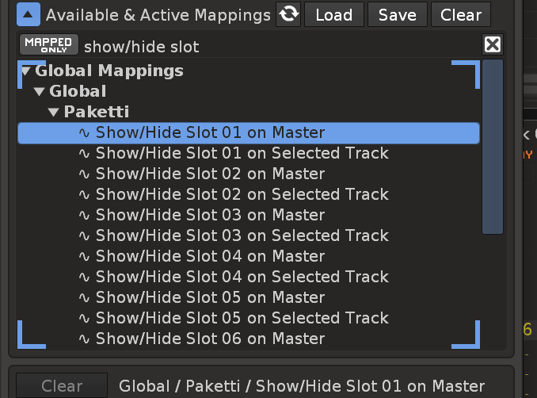


---
### 2024-09-06 - esaruoho

Improvement: Show/Hide Slots -> If no External Editor available, then say it instead of erroring. and don't minimize the device, since parameters can be shown within the device.

---
### 2024-09-06 - esaruoho

Improvement: Show/Hide Slots: if you open the dialog while it is open, it closes. when you open the dialog, cursor focus is shot back to Renoise.
and when you use the shortcut to close the dialog -> the slots are saved.

---
### 2024-09-06 - esaruoho

Improvement: Added missing Silence + Beginning Silence threshold text info to Paketti Preferences
(Closes https://github.com/esaruoho/org.lackluster.Paketti.xrnx/issues/529)


---
### 2024-09-06 - esaruoho

Improvement: Paketti Transpose +1 -1 +12 -12 and Note Column Transposes now 
6. no longer transpose "OFF" note to B-9 or C-0 (both)
7. no longer exit transposing if first column selected is an effect column (Note Column Transpose)
(1. Closes https://github.com/esaruoho/org.lackluster.Paketti.xrnx/issues/524)

---
### 2024-09-06 - esaruoho

Feature: Insert Random Delay on Visible Note Columns on Selected Row of Selected Track
(Closes https://github.com/esaruoho/org.lackluster.Paketti.xrnx/issues/492)


---
### 2024-09-06 - esaruoho

Improvement: Added Insert Random Delay, Insert Random Volume, Insert Random Panning shortcuts + midimappings:


---
### 2024-09-06 - esaruoho

Improvement: Modified Insert Random Delay Volume + Panning shortcuts + midimappings to either do it to the current row, or to selection in track .. or selection in pattern.

---
### 2024-09-06 - esaruoho

Improvement: From now on, all Modulation Device loaders (menu, shortcuts) will default to `+` instead of `*` 
(Closes https://github.com/esaruoho/org.lackluster.Paketti.xrnx/issues/534)


---
### 2024-09-06 - esaruoho

Improvement: Player Pro Note Dialog will now wipe Instrument column of selection, if "000" or "OFF" is selected:
(Closes https://github.com/esaruoho/org.lackluster.Paketti.xrnx/issues/499 & 
https://github.com/esaruoho/org.lackluster.Paketti.xrnx/issues/498)
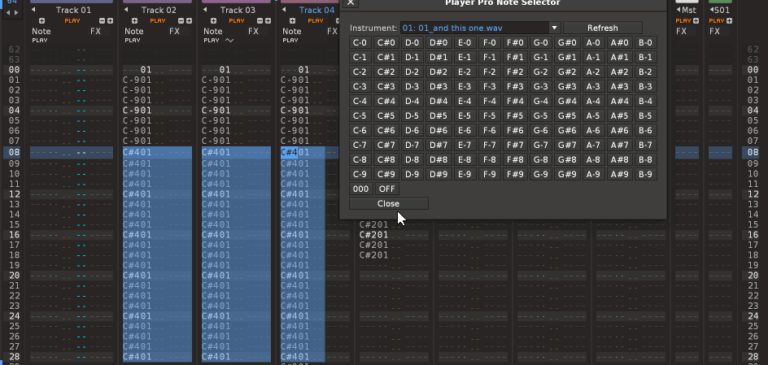


---
### 2024-09-06 - esaruoho

Improvement: Player Pro Note Dialog now can follow EditStep.


---
### 2024-09-07 - esaruoho

Improvement: if PlayerPro Note Dialog receives EditStep = 0 - it defaults to filling the rows as if EditStep was 1

---
### 2024-09-07 - esaruoho

Improvement: minor PlayerPro dialog tweaks and EditStep row is more informative now.


---
### 2024-09-07 - esaruoho

Improvement: Player Pro Transpose now works across multiple tracks, and does not transpose "OFF" "notes"
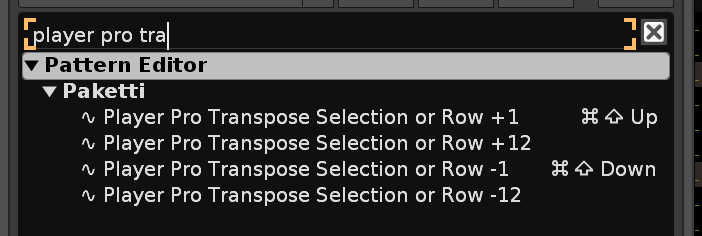


---
### 2024-09-08 - esaruoho

Improvement: Added "Save as Textfile" to Paketti KeyBindings - saves a textfile of what is shown on the textfield.
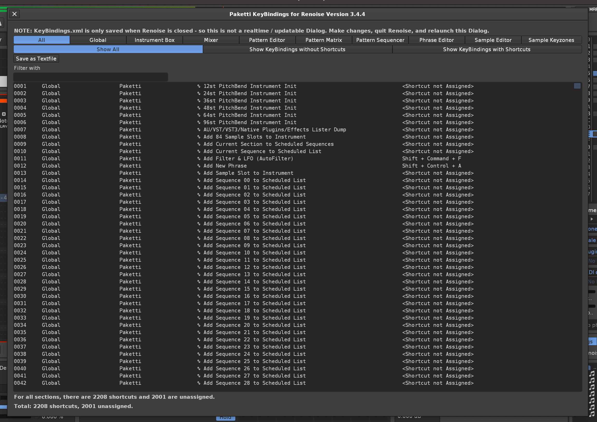


---
### 2024-09-08 - esaruoho

~~Improvement: I've added a new file to the paketti-manual; https://github.com/esaruoho/paketti-manual/blob/main/Documentation/22-KeyBindings.md
it is a direct print from the Paketti KeyBindings.~~
(Closes https://github.com/esaruoho/paketti-manual/issues/5)


---
### 2024-09-09 - esaruoho

Feature: "Set Repeater Value" MidiMapping. this takes a leaf from the `Show/Hide Slot` book, but instead of opening an external editor, one knob will 1. add Repeater if it is not already in Selected Track 2. change the parameters from parameterspace
```
Off, 1/1 Even, 1/1 Triplet, 1/1 Dotted, 1/2 Even, 1/2 Triplet, 1/2 Dotted, 1/4 Even, 1/4 Triplet, 1/4 Dotted, 1/8 Even, 1/8 Triplet, 1/8 Dotted, 1/16 Even, 1/16 Triplet, 1/16 Dotted, 1/32 Even, 1/32 Triplet, 1/32 Dotted, 1/64 Even, 1/64 Triplet, 1/64 Dotted, 1/128 Even, 1/128 Triplet, 1/128 Dotted
```
meaning, you tweak a knob and it changes to one of these. this is surprisingly powerful.
there's two flavors - one will rename the track destructively, so you know what's going on, the other will not rename the track.


---
### 2024-09-09 - esaruoho

Feature: Global Set EditStep to 00...64
this means you only configure one set of shortcuts, instead of "Pattern Editor EditStep" & "Phrase Editor EditStep". Found this need while going to Phrase Editor and cmd-1-9 doing nothing.

---
### 2024-09-09 - esaruoho

Improvement: "Duplicate Instrument and Select New Instrument" shortcuts will now detect you're in the Phrase Editor, and keep you in the Phrase Editor. meaning: you've got a phrase you're happy with, run the script, you're editing a new phrase for a new instrument, but still in the Phrase Editor.

---
### 2024-09-09 - esaruoho

Improvement: "Duplicate Instrument and Select New Instrument" shortcuts will now detect if you're in Plugin->Monitor view and stay there.

---
### 2024-09-09 - esaruoho

Improvement: Init Phrase Settings will now create a new Phrase if there is no Selected Phrase - otherwise it'll modify the Selected Phrase.

---
### 2024-09-09 - esaruoho

Improvement: added `2` and `4` to Init Phrase Settings dialog because.. they weren't there.


---
### 2024-09-10 - esaruoho

Improvement: Added further protections for Randomize Devices and Plugins dialog - now it will properly update the selected Plugin, and return from "No Plugin Selected" state back to the selected Plugin state.

---
### 2024-09-10 - esaruoho

Improvement: Player Pro Note Dialog will now also follow editstep when changing instruments - instead of typing the whole selection in pattern full of the instrument.

---
### 2024-09-11 - esaruoho

Feature: "Record Automation to Selected Parameter" - pick a parameter in Automation View (Lower Frame), twist the knob assigned to this midimapping - whichever parameter you have selected in Automation, is the one that gets automated. 
<div style="position: relative; padding-bottom: 64.90384615384616%; height: 0;"><iframe src="https://www.loom.com/embed/5b46a1dd7d5e4d82b87ff145fc38c3cb?sid=47d167d0-2442-4251-a87b-f9a407fb528a" loading="lazy" frameborder="0" webkitallowfullscreen mozallowfullscreen allowfullscreen style="position: absolute; top: 0; left: 0; width: 100%; height: 100%;"></iframe></div>
https://www.loom.com/share/5b46a1dd7d5e4d82b87ff145fc38c3cb?sid=a70c3095-f7b8-4909-a664-6b449baecb23

---
### 2024-09-11 - esaruoho

Improvement: Record Automation to Selected Parameter" will now write it to selected automation range, if there is such a thing. but if playback + follow pattern is ON, then it will write to playhead position.

---
### 2024-09-12 - esaruoho

Feature: Selected Device Automation Parameter 001-128 midimappings added. 
This means, you select a Device on TrackDSP, and twist a knob, and if it has a parameter in the knob you've set (001-128), that parameter will change, in the device, no automation. 
BUT if you have EditMode on, then the parameter value change is written to automation automatically to currentStep (not following playhead)
BUT if you have EditMode + Playing on, then the automation is written to playStep -> following playhead.

this means you will automate, with your battery of knobs or sliders, the value of any parameter in a selected device. - or if not recording, then simply change the parameter of any device.
(Closes https://github.com/esaruoho/org.lackluster.Paketti.xrnx/issues/543)
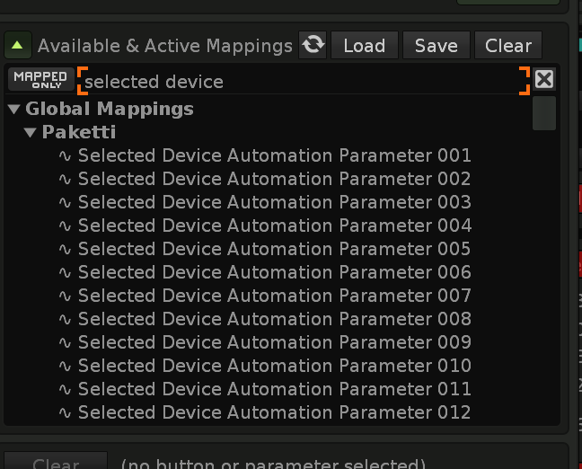


---
### 2024-09-12 - esaruoho

Improvement: Selected Device Automation Parameter will now also edit device parameters if Playing is on, but follow pattern is off.

---
### 2024-09-12 - esaruoho

Improvement: Selected Device Automation Parameter will now also edit device parameters if Playing is Off.
and if Playing is Off and Record is On, it will write to Automation.

---
### 2024-09-13 - esaruoho

Improvement: If using Wipe&Slice while there was no BeatSyncLines set - it would shoot an error. no more.
(Closes https://github.com/esaruoho/org.lackluster.Paketti.xrnx/issues/547)

---
### 2024-09-13 - esaruoho

Improvement: If you run Paketti Normalize Sample on a Slice - it will normalize the original sample. otherwise, selected sample.
(Closes https://github.com/esaruoho/org.lackluster.Paketti.xrnx/issues/548)

---
### 2024-09-13 - esaruoho

Improvement: Paketti Renoise Native, VST, VST3, LADSPA, DSSI, AudioUnit dialogs have now been combined into one dialog. with dropdown menus. this averts the issue with "too many devices" when in AU/VST3.
it also has a randomize slider. 
(Closes https://github.com/esaruoho/org.lackluster.Paketti.xrnx/issues/403 & 
https://github.com/esaruoho/org.lackluster.Paketti.xrnx/issues/466 & 
https://github.com/esaruoho/org.lackluster.Paketti.xrnx/issues/406 & 
https://github.com/esaruoho/org.lackluster.Paketti.xrnx/issues/404)


---
### 2024-09-13 - esaruoho

Improvement: Paketti Device Loader dialog now correctly sorts VST3, and has 36 rows per column, which should help with large selections of VST3

---
### 2024-09-13 - esaruoho

Improvement: Paketti Plugin Loader dialog now shows LADSPA, DSSI, splits VST3 and VST and AudioUnit to separate dropdown menu dialogs.


---
### 2024-09-13 - esaruoho

Improvement: Paketti Device Loader dialog has now been optimized for maximum amount of rows i can stretch out of it. this should help when you have hundreds of devices. you now have 39 items per each column, and the dialog will fit to how many columns you have.


---
### 2024-09-13 - esaruoho

Improvement: I've optimized the Paketti Device Loader about as far as it can go. Please post on <#1251962697298214922> with a screenshot if you have any issues with the Device Loader Dialog.
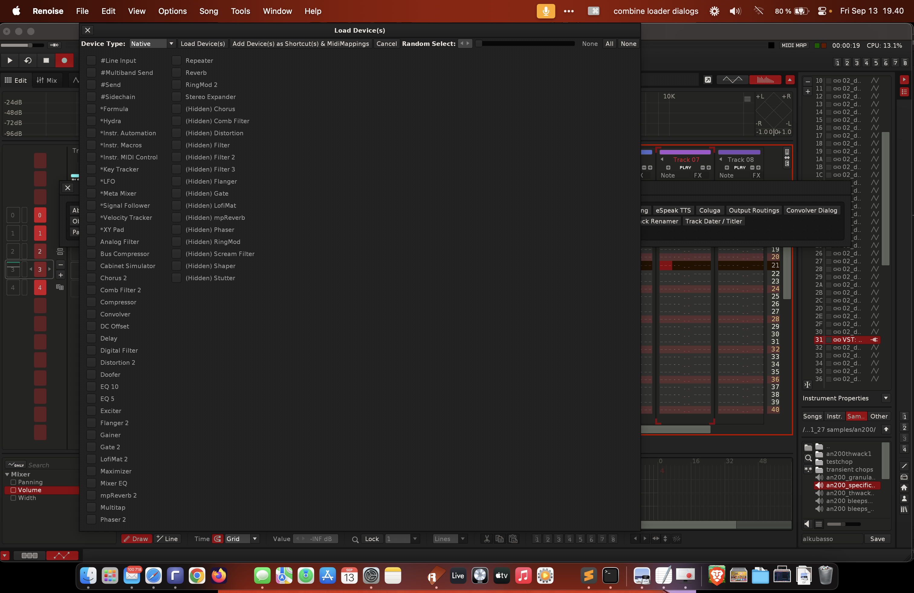


---
### 2024-09-13 - esaruoho

Improvement: LADSPA / DSSI dialog names have been filtered so they no longer take up a lot of space.
(Closes https://github.com/esaruoho/org.lackluster.Paketti.xrnx/issues/414 )

---
### 2024-09-14 - esaruoho

Improvement: Added "ClippyClip" Device Chain to Shortcuts:
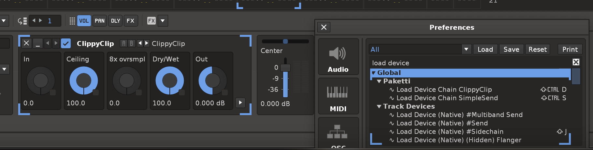


---
### 2024-09-14 - esaruoho

Improvement: "Change Selected Track Volume +0.1 +0.05  +0.01 -0.1 -0.05 -0.01" - this sets the PostFX volume of the Selected Track. protection against going over 3dB and below 0dB.
(Closes https://github.com/esaruoho/org.lackluster.Paketti.xrnx/issues/553)


---
### 2024-09-14 - esaruoho

Improvement: Coluga YT-DLP downloader now no longer uses BASH scripting. it should now work with both macOS and Linux. Windows is still pending. there's also a log screen so you can see what is going on. and a Clear button.
(Closes https://github.com/esaruoho/org.lackluster.Paketti.xrnx/issues/267)


---
### 2024-09-14 - esaruoho

Improvement: eSpeak Text-to-Speech now has a "Which Row" valuebox, meaning you can either use 0 - which renders everything, or a specific row.
(closes https://github.com/esaruoho/org.lackluster.Paketti.xrnx/issues/263)
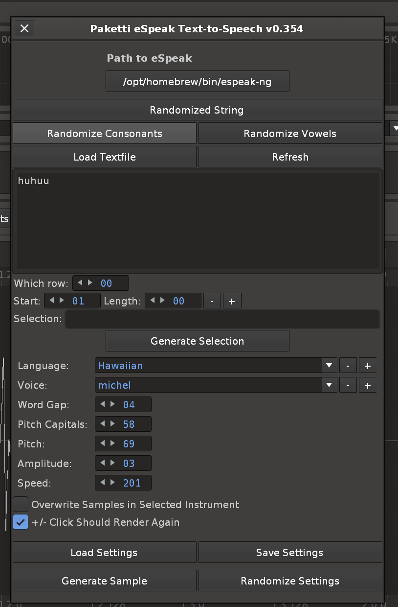


---
### 2024-09-15 - esaruoho

Improvement: "Populate Sends to All Tracks / Selected Track" will now consider if the Sends have already been added. if the SendTrack name has changed, then, instead of adding a new duplicate send, it will rename the currently existing one.
(Closes https://github.com/esaruoho/org.lackluster.Paketti.xrnx/issues/256)

---
### 2024-09-15 - esaruoho

Improvement: YT-DLP downloader will now, at the end of having downloaded the whole sample, normalize it.

---
### 2024-09-15 - esaruoho

Feature: Match Current Sub Column Selection. This lets you fill the current pattern content with Instrument, Volume, Panning, Delay, SampleFX(01) and SampleFX(02) and works for selected note column.
(Closes https://github.com/esaruoho/org.lackluster.Paketti.xrnx/issues/130)


---
### 2024-09-16 - esaruoho

Improvement: Added a Normalize flavor to Paketti PitchBend Multiple Sample Loader. this will normalize the samples being loaded.


---
### 2024-09-16 - esaruoho

Improvement: if you ran PitchStep external editor shower with no sample, you would get an error. fixed.

---
### 2024-09-17 - esaruoho

for the sake of clarity, here
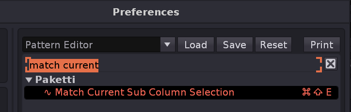


---
### 2024-09-17 - esaruoho

Improvement: There's now two flavors of "Replicate at Cursor". one that replicates above+cursor and one that replicates above only.
(Closes https://github.com/esaruoho/org.lackluster.Paketti.xrnx/issues/495)
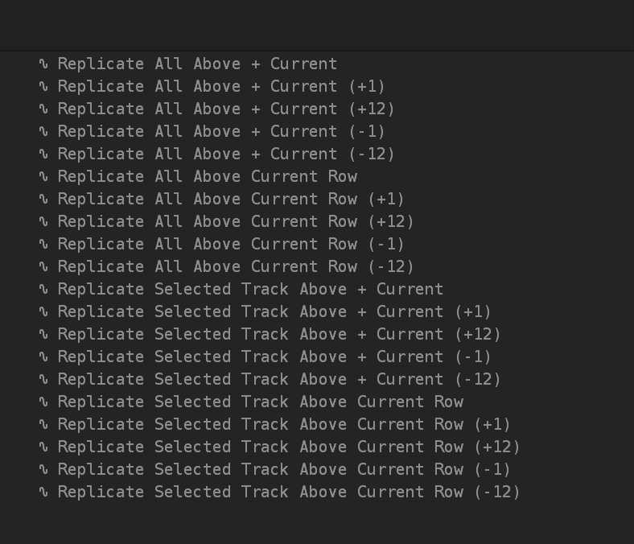


---
### 2024-09-17 - esaruoho

Feature: Loop Set Texture, Loop Set Percussion.
This takes the current sample
- Enables BeatSync
- Sets BeatSync to either Texture or Percussion
- Enables Forward Loop
- Enables AutoSeek.

(Closes https://github.com/esaruoho/org.lackluster.Paketti.xrnx/issues/560)
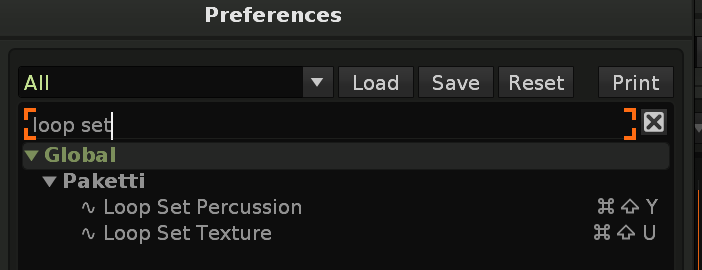


---
### 2024-09-17 - esaruoho

Improvement: "Save Notes" for Paketti Track Dater & Titler
if you find a cool name, you can save it to your selected note file.
(Closes https://github.com/esaruoho/org.lackluster.Paketti.xrnx/issues/337)


---
### 2024-09-17 - esaruoho

Improvement: Flood Fill Note and Instrument, will, now when there's no selection, fill from current row onwards instead of all rows in pattern. Also errors fixed
(Closes https://github.com/esaruoho/org.lackluster.Paketti.xrnx/issues/359)

---
### 2024-09-17 - esaruoho

Improvement: Paketti Gater "Insert Commands" shortcut + midimapping added
(Closes https://github.com/esaruoho/org.lackluster.Paketti.xrnx/issues/517)


---
### 2024-09-17 - esaruoho

Feature: 3 shortcuts: 
- Set Selected Sample Velocity Range to 7F
- Set Selected Sample Velocity Range to 00
- Set All Samples Velocity Range to 7F
(Closes https://github.com/esaruoho/org.lackluster.Paketti.xrnx/issues/559)
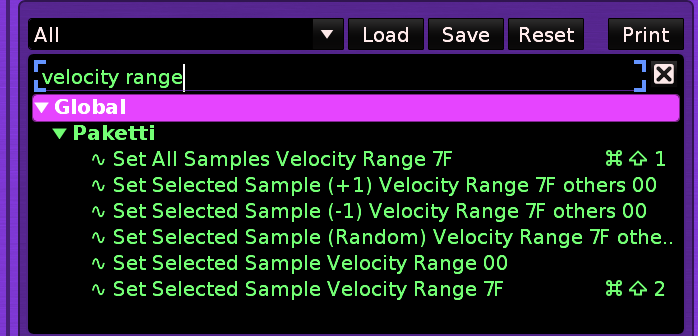


---
### 2024-09-17 - esaruoho

Improvement: Added one more "Delay Column Increase/Decrease +1 -1 +10 -10". This one does current row, or current selection.
(Closes https://github.com/esaruoho/org.lackluster.Paketti.xrnx/issues/366)


---
### 2024-09-17 - esaruoho

Improvement: eSpeak now has "Generate Row 00-32" shortcuts. 00 will generate all the rows. 1 will generate 1st.. and so on.
(Closes yet another checkbox in https://github.com/esaruoho/org.lackluster.Paketti.xrnx/issues/307 )


---
### 2024-09-17 - esaruoho

Improvement: Loop Set Texture / Loop Set Percussion now sets Mute Group 1.
(Closes https://github.com/esaruoho/org.lackluster.Paketti.xrnx/issues/564)

---
### 2024-09-17 - esaruoho

Feature: Smart BeatSync from Selection
This reads selection in pattern and imprints it on selected sample beatsync.
meaning: select 4 rows, run shortcut - sample BeatSync lines is now 4.
select 64 rows, run shortcut - sample BeatSync line is now 64.
(Closes https://github.com/esaruoho/org.lackluster.Paketti.xrnx/issues/561)

---
### 2024-09-19 - esaruoho

Feature: "Change Selected Instrument (Next / Previous)" added to MidiMappings. it's a +1 -1 effort.
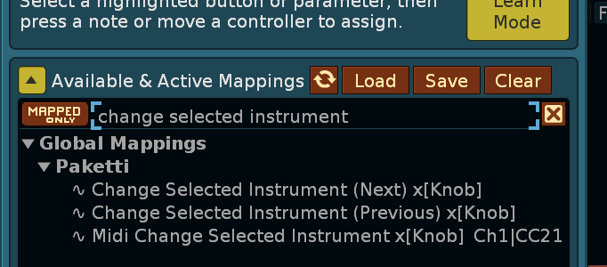


---
### 2024-09-19 - esaruoho

Improvement: Added -1 protection, so can't go lower than instrument 1 (00)

---
### 2024-09-20 - esaruoho

Improvement: Coluga / YT-DLP now has a textfield for storing the location of the `yt-dlp` executable. This, along with the heavy plumbing i did, converting the bash script (which was macOS only, really) to full LUA, should allow yt-dlp to successfully download YouTube videos in full and add them as samples into a new instrument, complete with the Default XRNI Instrument (and it's macros) automatically added, on macOS, Linux and Windows.
It's been a long time in coming
(Closes https://github.com/esaruoho/org.lackluster.Paketti.xrnx/issues/570)

---
### 2024-09-20 - esaruoho

Sidequest: In case you're wondering about the drop-off on updates on this channel, it's because I've been reworking the Sononymph tool so that it has more and better features, and improve the Configuration file detection. here's a screenshot or two. Sononymph is a tool that allows for a deep integration between Sononym and Renoise, and I've added certain features to it that "made sense" to have. If I include this in Paketti, I'll have to do a complete rewrite of it, so that it fits into how Paketti has been coded. I'm in contact with danoise about these features and hoping to see some, shall we say, official progress, further down the line. If he has abandoned it, I'll rewrite it and include it in Paketti.


---
### 2024-09-20 - esaruoho

Another sidequest: I've received permission from Martblek to take his "Simple Beat Detector" tool, which uses a lowpass filter to detect low-end beats and create slices, and modify it. I've been working on it, and now it has both lowpass and highpass filters for detecting beats, and therefore it now detects hihats too, not only bassdrums. It's still a work in progress, though - I want it to be better than the Renoise transient detection, before I will ship it in Paketti. Here's a rudimentary video. 
<div style="position: relative; padding-bottom: 64.90384615384616%; height: 0;"><iframe src="https://www.loom.com/embed/8908487817cc4c888ce00657afed9d8b?sid=6f669599-25be-4631-9d81-a93692891d2e" loading="lazy" frameborder="0" webkitallowfullscreen mozallowfullscreen allowfullscreen style="position: absolute; top: 0; left: 0; width: 100%; height: 100%;"></iframe></div>

https://www.loom.com/share/8908487817cc4c888ce00657afed9d8b?sid=629daeb8-01d8-4e97-ae84-a6837371556d

---
### 2024-09-20 - esaruoho

Improvement: I've added three TouchOSC specific shortcuts, designed for switching to Pattern Editor, or to Sample Editor, and the third one starts sampling and stops it. So press a button and hold it down on TouchOSC - Renoise samples a new sample. Let go -> stops sampling.
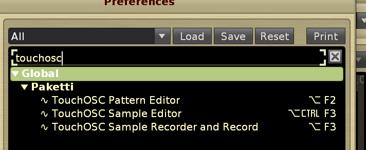


---
### 2024-09-20 - esaruoho

Plumbing: Finally removed all the four separate Load VST, Load VST3, Load AU, Load LADSPA/DSSI, Load Native device dialogs from the code since there's only one preferred dialogs that loads all 6 things.

---
### 2024-09-20 - esaruoho

Improvement: Added Graphite RC1 and Yellow Harmony to Paketti Theme Selector
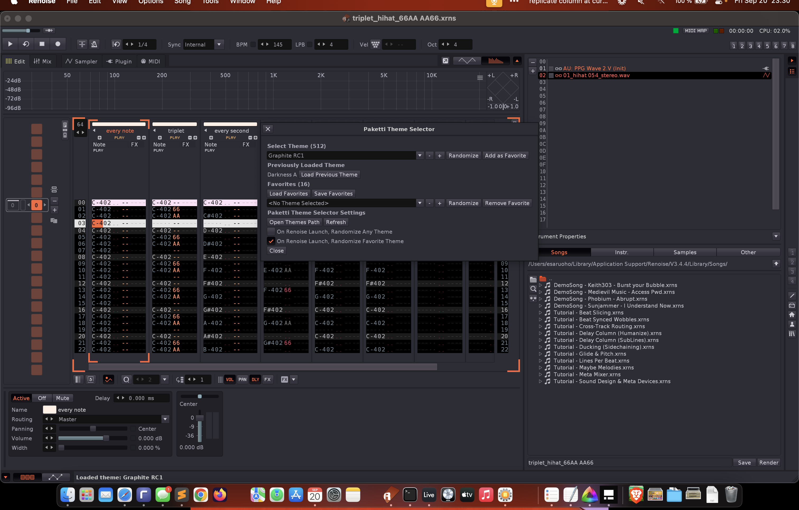


---
### 2024-09-20 - esaruoho

Plumbing: Moved features around in codebase

---
### 2024-09-20 - esaruoho

Feature: Expose and Select New Column
Hide Current and Select Previous Column
these are slightly smarter shortcut replacements for the Renoise "Add New Column" .. It not only adds the new column (effect or note column) but also selects the column. if you're on the 12th note column and remove one, then you're on the 11th note column. same for if you're on the 8th effect column and remove one, then you're on the 7th effect column.
(Closes https://github.com/esaruoho/org.lackluster.Paketti.xrnx/issues/567 & 
https://github.com/esaruoho/org.lackluster.Paketti.xrnx/issues/505)
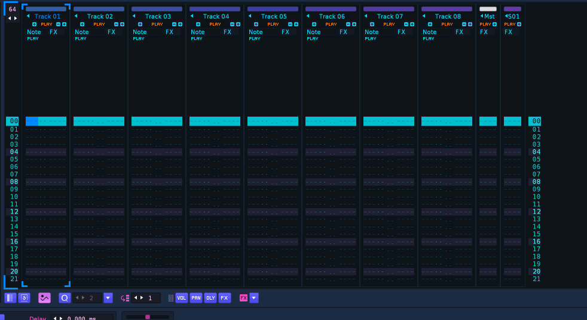


---
### 2024-09-21 - esaruoho

Improvement: When loading a Plugin using a shortcut, the Middle Frame would change from "Midi tab" to "Sample tab" - mostly to Sample Editor. Added some logic to avert that, and also made sure that if you're in the Plugin Phrase Editor, you are no longer transported to Sample Phrase Editor.
(Closes https://github.com/esaruoho/org.lackluster.Paketti.xrnx/issues/551)

---
### 2024-09-21 - esaruoho

Improvement: Expose and Select New Column & Hide Current and Select Previous Column are now available as MidiMappings

---
### 2024-09-21 - esaruoho

Feature: Select Sample Next/Previous shortcut + midimapping:
it also communicates at the bottom status row, which sample has been selected and if there's no more to move to
(Closes https://github.com/esaruoho/org.lackluster.Paketti.xrnx/issues/571)


---
### 2024-09-21 - esaruoho

Improvement: Osionik has sent four more themes to me.
`Osi-BladeRunner`
`Osi-Moss1`
`Osi-TheBlueBrandy`
`Osi-TrackerHacker`
they've been added to the Themes. Now there's a total of 516 themes in the Paketti Theme Selector. If you have any additional themes, please send them my way via DM.

---
### 2024-09-21 - esaruoho

Feature: "Flood Fill Column with Row". if you are on effect column 1 and what's on the row you wanna fill the pattern with, then run this. or note column.


---
### 2024-09-21 - esaruoho

Feature: Toggle Note Off on All Tracks on Current Row
it will write a Note Off (or turn it off) on the current row of all tracks.
(Closes https://github.com/esaruoho/org.lackluster.Paketti.xrnx/issues/568)
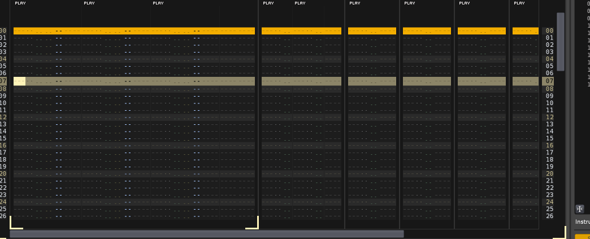


---
### 2024-09-21 - esaruoho

Improvement: The "Selected Instrument Macros1-8" generation has been simplified so it is no longer so over-the-top.
they're no longer dynamically created, they just exist. this should avert an error caused in a newer version of Renoise that's currently in alpha.


---
### 2024-09-22 - esaruoho

Improvement: Added noby's "Mango theme" to Paketti Theme Selector

---
### 2024-09-22 - esaruoho

Feature: Double Double LPB & Halve Halve LPB. 
(Closes https://github.com/esaruoho/org.lackluster.Paketti.xrnx/issues/581)
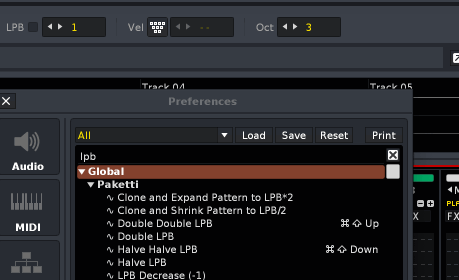


---
### 2024-09-22 - esaruoho

Feature: Double Double BeatSync, Halve Halve BeatSync (Selected Sample or All)
(Closes https://github.com/esaruoho/org.lackluster.Paketti.xrnx/issues/582)


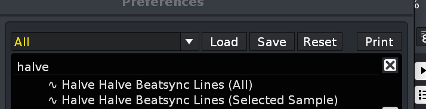


---
### 2024-09-22 - esaruoho

Feature: Double BPM, Halve BPM, Double Double BPM, Halve Halve BPM.
(Closes https://github.com/esaruoho/org.lackluster.Paketti.xrnx/issues/580)


---
### 2024-09-22 - esaruoho

Update: Removed "Gainer Exponential Curve" from Pattern Matrix, KeyBindings, Track Automation etc. this can be done properly with other Paketti Automation shortcuts + menu entries.
(Closes https://github.com/esaruoho/org.lackluster.Paketti.xrnx/issues/471)

---
### 2024-09-22 - esaruoho

Improvement: Flood Fill Note and Instrument with Step will now also Flood Fill the Effect Column content.
(Closes https://github.com/esaruoho/org.lackluster.Paketti.xrnx/issues/398)

---
### 2024-09-23 - esaruoho

Improvement: Launch App Selection added to Sample Navigator + Sample Editor dropdown menus
(Closes https://github.com/esaruoho/org.lackluster.Paketti.xrnx/issues/516)
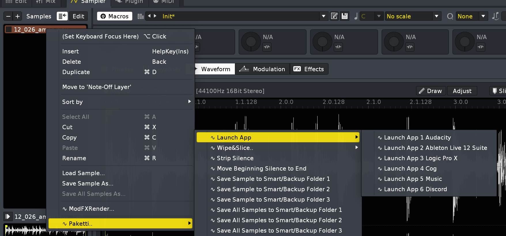


---
### 2024-09-23 - esaruoho

Improvement: If you use ALT-Y Swap Block to swap the selected block, and have the cursor on the first row of the selection - Renoise would become unresponsive, end up in a loop and eventually either crash or ask you to stop the tool. 
(Closes https://github.com/esaruoho/org.lackluster.Paketti.xrnx/issues/513)

---
### 2024-09-23 - esaruoho

Improvement: ALT-Y Swap Block now correctly swaps Volume, Panning, Delay, SampleFX Columns and makes them visible in the new track.

---
### 2024-09-23 - esaruoho

Improvement: If you are on Master track and load samples using the Paketti PitchBend Multiple Sample Loader / Paketti PitchBend Drumkit Sample Loader, the `*Instr. Macros` device will not be created to the Master channel and an error will now be shot.
(Closes https://github.com/esaruoho/org.lackluster.Paketti.xrnx/issues/501)


---
### 2024-09-23 - esaruoho

Improvement: ALT-Y Swap Block now finally, correctly, also swaps the effect column content, and makes the correct amount of effect columns visible in the track where they are being swapped to.


---
### 2024-09-23 - esaruoho

Feature: `Set Pattern Length to LPB*001` to `Set Pattern Length to LPB*512` added
(Closes https://github.com/esaruoho/org.lackluster.Paketti.xrnx/issues/420)


---
### 2024-09-23 - esaruoho

Improvement: Pattern Editor context menu reorganizations - submenus, no longer scrollbar galore. and somewhat better organized anyway
(Closes https://github.com/esaruoho/org.lackluster.Paketti.xrnx/issues/330)


---
### 2024-09-24 - esaruoho

Improvement: Pattern Editor CheatSheet now looks like this, so more optimized. almost 100% there with the Randomize buttons - they will only randomize the rows that do have content. volume, panning, delay, samplefx already work. just effect columns to go.
(Closes https://github.com/esaruoho/org.lackluster.Paketti.xrnx/issues/316)
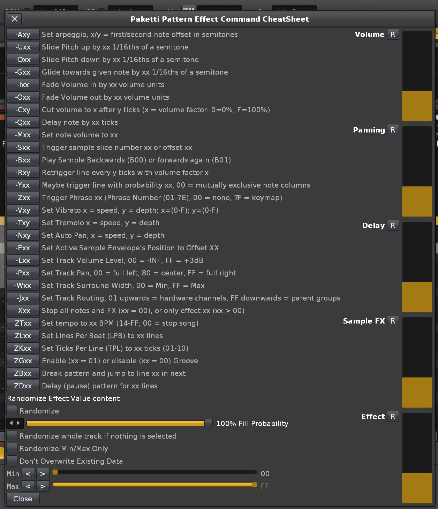


---
### 2024-09-24 - esaruoho

Improvement: Effect Columns now get properly randomized - ignoring the empty rows.
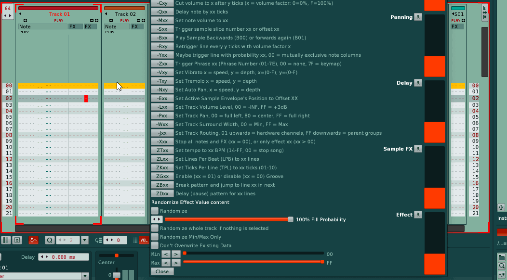


---
### 2024-09-24 - esaruoho

Improvement: Pattern CheatSheet no longer writes to each pattern in the song, only the one you're on.
(Closes https://github.com/esaruoho/org.lackluster.Paketti.xrnx/issues/474)

---
### 2024-09-25 - esaruoho

Improvement: Pattern CheatSheet now follows "Randomize whole track if nothing is selected", otherwise reads selection in pattern, and if no selection, and "randomize whole track" is off -> then it just outputs to current row.
(Closes https://github.com/esaruoho/org.lackluster.Paketti.xrnx/issues/589)

---
### 2024-09-25 - esaruoho

Improvement: Paketti Preferences now (again) closes and opens without issues multiple times.
(Closes https://github.com/esaruoho/org.lackluster.Paketti.xrnx/issues/587)

---
### 2024-09-25 - esaruoho

Improvement: Wipe Effects from Selection will now only wipe the selected effect columns, not all effect columns of the track. and if there's multiple effect columns selected across multiple tracks, it'll still continue working and only wipe the effect columns that were selected.

---
### 2024-09-25 - esaruoho

Improvement: Added 2nd keybinds for "Impulse Tracker Pattern (Next)" / "Impulse Tracker Pattern (Previous)"
(Closes https://github.com/esaruoho/org.lackluster.Paketti.xrnx/issues/202)

---
### 2024-09-25 - esaruoho

Feature: Impulse Tracker ALT-X (interpolate, or, if already interpolated, wipe)
(Closes https://github.com/esaruoho/org.lackluster.Paketti.xrnx/issues/205)


---
### 2024-09-25 - esaruoho

Improvement: The Center-to-Bottom & Center-to-Top automation drawing while in Automation, from menu entry, now properly starts from 0.5 instead of "slightly off".
(Closes https://github.com/esaruoho/org.lackluster.Paketti.xrnx/issues/124)

---
### 2024-09-25 - esaruoho

Feature: Toggle Match EditStep with Note Placement. This is meant for Effect Column use. If you are on the Effect Column and you toggle this off, the EditStep will dynamically change to match the "next note".
(Closes https://github.com/esaruoho/org.lackluster.Paketti.xrnx/issues/128)


---
### 2024-09-25 - esaruoho

Improvement: Paketti PitchBend Multiple Sample Loader  had regressed to no longer working due to Coluga changes. Fixed.
(Closes https://github.com/esaruoho/org.lackluster.Paketti.xrnx/issues/590)

---
### 2024-09-26 - esaruoho

Improvement: added Autofade to Paketti Preferences for Wipe&Slice
(Closes https://github.com/esaruoho/org.lackluster.Paketti.xrnx/issues/566)


---
### 2024-09-26 - esaruoho

Feature: Device Control 01-34 Bypass, Enable, Toggle.
These shortcuts+midimappings will let you bypass, or enable, or toggle, all the 34 devices of the Track DSP Chain.
(Closes https://github.com/esaruoho/org.lackluster.Paketti.xrnx/issues/583)


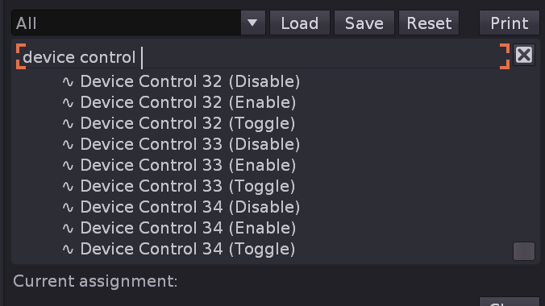

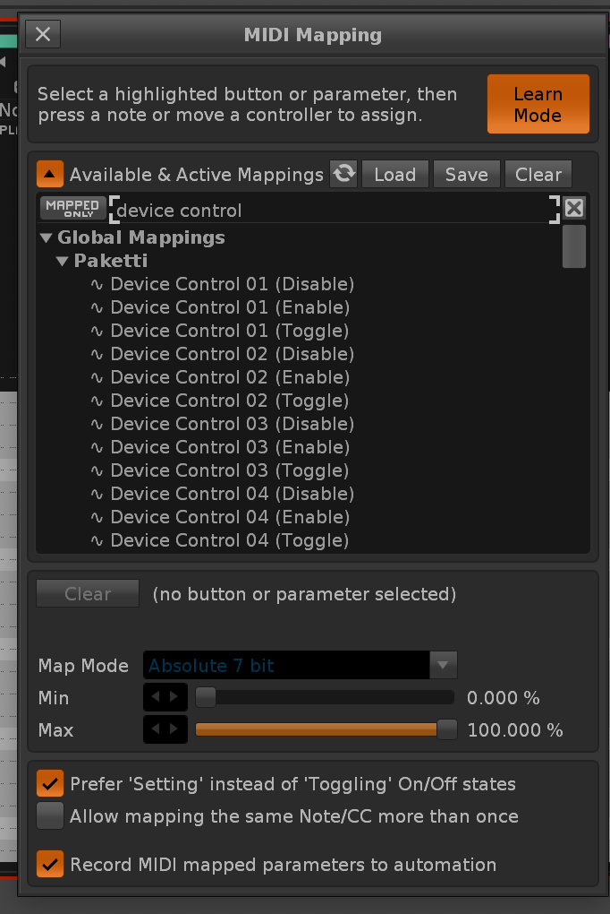

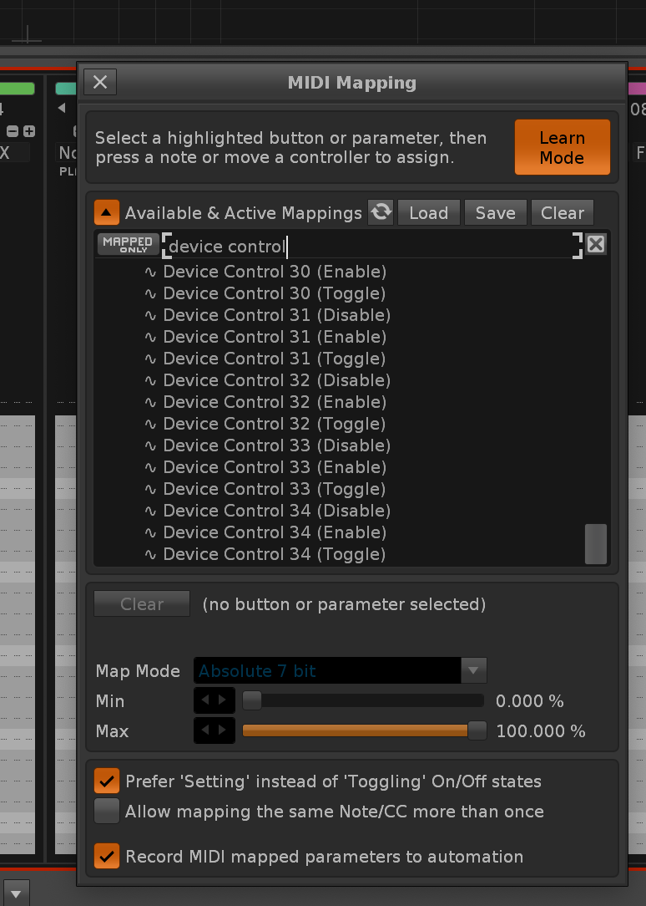


---
### 2024-09-27 - esaruoho

Improvement: Normalize no longer worked with Coluga or eSpeak or Audio Processing Dialog - due to a regression. fixed.

---
### 2024-09-27 - esaruoho

Improvement: eSpeak now has a brand new checkbox, called "Add Render to Current Instrument" - which will add a new slot and add the render there. 
(Closes https://github.com/esaruoho/org.lackluster.Paketti.xrnx/issues/307)


---
### 2024-09-28 - esaruoho

Improvement: After a ton of plumbing, I got eSpeak dialog to open and close and open without erroring out.
also some tweaks to how it looks.


---
### 2024-09-28 - esaruoho

Improvement: Player Pro Note Dialog is now a Global shortcut and takes you to the Pattern Editor so it "immediately makes sense"

---
### 2024-09-28 - esaruoho

Plumbing: in preparation for making it possible to set a user-defined key for closing a dialog, I've modified the following dialogs to follow the forthcoming user-defined key:
8. Paketti Preferences
9. Paketti Theme Selector
10. eSpeak
11. Dialog of Dialogs
12. About/Donations
13. Paketti Gater
14. Paketti Phrase Init Dialog
15. Oblique Strategies
16. Track Dater & Titler
17. Track Routings
18. Select or Add Convolver Device
19. User Preferences for Show/Hide Slots
20. ImpulseTracker New Song CTRL-N
21. Effect Column CheatSheet
22. Midi Populator
23. OctaMED Pick/Put Dialog
24. Paketti KeyBindings
25. Renoise KeyBindings
26. Paketti Midi Mappings
27. Paketti Track Renamer
28. Paketti Coluga YT-DLP
29. Beat Detector Dialog
30. Launch App Selection
31. Player Pro Note Dialog
32. Load Devices (VST,VST3,AU,Native,LADSPA,DSSI)
33. Load Plugins (VST,VST3,AU,LADSPA,DSSI) 
34. Debug: Available Plugin Information
35. Debug: Available Device Information
36. Audio Processing Tools Dialog
37. Player Pro Effects Dialog
38. Player Pro Tools Dialog

---
### 2024-09-30 - esaruoho

Improvement: Track Routings dialog ui has been tweaked, so the dropdown menus will show a longer output channel name, and margins have been removed.
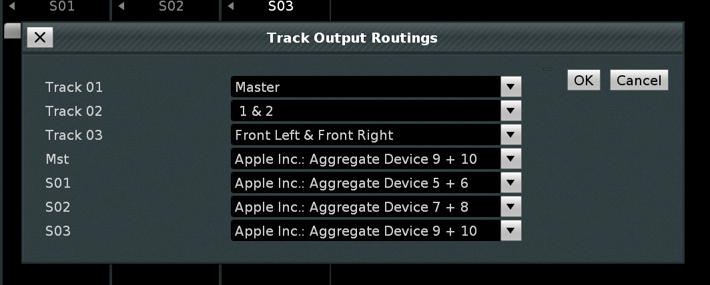


---
### 2024-09-30 - esaruoho

Feature: Output Routing (Serial, Continual) & (Serial, Non-Continual) - this maps the Outputs for all tracks including master + sends. it is serial. continual will go through the list continually, non-continual will map as many outputs as you have, and the rest of the tracks will have the same output channel, if output channels have been exhausted.
there are "omit Master & include Master" flavors of each.
(Closes https://github.com/esaruoho/org.lackluster.Paketti.xrnx/issues/542)
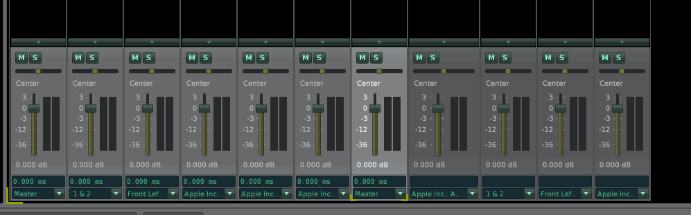


---
### 2024-09-30 - esaruoho

Improvement: the "Selected Track Send 01-64" has been changed from volume control to On/Off toggle. and the placement can be anywhere in the selected track. first send is first send. doesn't matter where it is.
(Closes https://github.com/esaruoho/org.lackluster.Paketti.xrnx/issues/428)
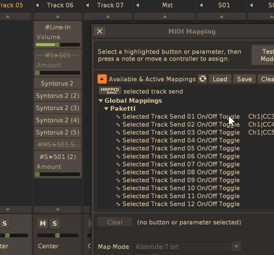


---
### 2024-09-30 - esaruoho

Improvement: added the "Master is in Loop" too flavors for Output Routing:
(Closes https://github.com/esaruoho/org.lackluster.Paketti.xrnx/issues/597)


---
### 2024-10-01 - esaruoho

Feature: Play current line + step forwards & Play current line + step backwards shortcuts. These will toggle follow pattern off, and step forwards, or backwards.
(Closes https://github.com/esaruoho/org.lackluster.Paketti.xrnx/issues/599)

---
### 2024-10-01 - esaruoho

Feature: Set Output Routings to Master, and Master to ` 1 & 2` 
(Closes https://github.com/esaruoho/org.lackluster.Paketti.xrnx/issues/600)


---
### 2024-10-01 - esaruoho

Improvement: added "Play Current Line&Step Random" which steps to a random step in the current pattern.
(Closes https://github.com/esaruoho/org.lackluster.Paketti.xrnx/issues/602)


---
### 2024-10-01 - esaruoho

Feature: Clean Render Seamless Track/Group.. this will take your <256 row pattern, duplicate it to max 512 rows, i.e. play it "twice", then render it, select the first half of the sample, and add a loop from the end of the first half to the end of the second half. meaning, seamless loops with reverb tails.
(Closes https://github.com/esaruoho/org.lackluster.Paketti.xrnx/issues/280)
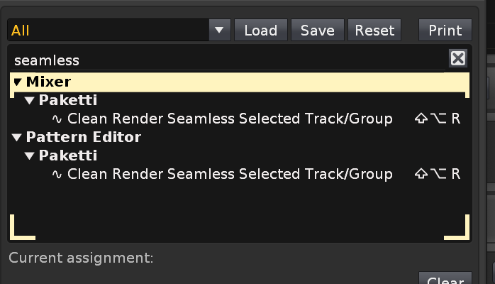


---
### 2024-10-01 - esaruoho

Feature: Rotate Sample by 1/2, 1/4, 1/18, 1/16
this will flip your beat by a fraction of the whole beat.
(Closes https://github.com/esaruoho/org.lackluster.Paketti.xrnx/issues/362)


---
### 2024-10-02 - esaruoho

Feature: Play at Random Line in Current Pattern, 2, 4 or LPB.
this will either, if follow pattern off, move the cursor to a random line in the pattern-space, or if set to 2, move to a matching.. or 4, move to a matching,  or LPB, move to a matching LPB space. so if you have 64 row pattern and LPB is 8, then it'll only randomize all the "8th" rows if that makes sense. also available for midimapping.
and if follow pattern is on, it will actually kick you to play the random line it picks. and no duplicate lines will be hit - so if you're already on row 48, pressing a randomizer will not accidentally kick you to row 48. enjoy (and remember to use autoseek! if you're working with loops)
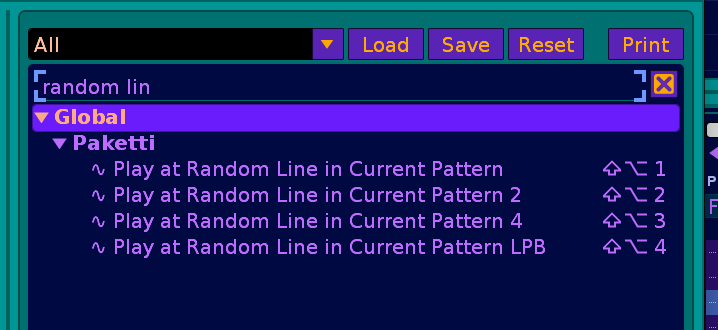


---
### 2024-10-02 - esaruoho

Feature: Play at Row 001-512 (Shortcut + midimapping)
(Closes https://github.com/esaruoho/org.lackluster.Paketti.xrnx/issues/603)


---
### 2024-10-02 - esaruoho

Feature: Stepper Dialog for Volume, Delay, Panning - Auto-Grab will also automatically grab the current track's settings.
(Closes https://github.com/esaruoho/org.lackluster.Paketti.xrnx/issues/340)


---
### 2024-10-02 - esaruoho

Improvement: OctaMED Pick/Put Dialog now
- has Load / Save buttons for loading and saving the Slots
- Will work with Group, Send and Master - no longer putting in Note Column content to a track that has no Note Columns - instead only putting in Effect Columns
- Will no longer overwrite Notes if Putting in a Effect Column only Slot.
- has a Randomize slider + Randomize checkbox so you can randomize how many times the Slot is put in
(Closes https://github.com/esaruoho/org.lackluster.Paketti.xrnx/issues/463 & 
https://github.com/esaruoho/org.lackluster.Paketti.xrnx/issues/461 & 
https://github.com/esaruoho/org.lackluster.Paketti.xrnx/issues/462 )


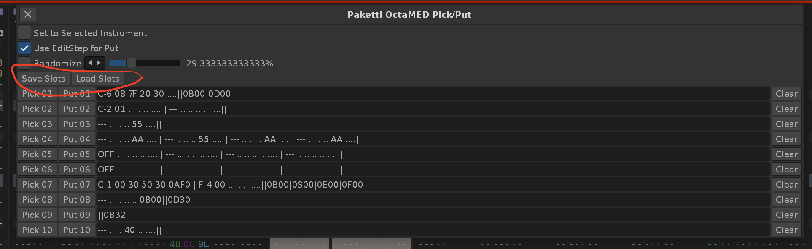

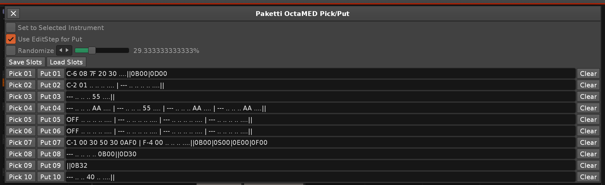


---
### 2024-10-02 - esaruoho

Improvement: Renoise KeyBindings Dialog now, again, correctly opens in the right context - open it in Sample Editor? -> Shows Sample Editor selection. open it in Pattern Editor ? -> Shows Pattern Editor selection.
(Closes https://github.com/esaruoho/org.lackluster.Paketti.xrnx/issues/407)

---
### 2024-10-02 - esaruoho

Feature: Paketti Macro 01 - this is designed for setting your own preferred middle frame views. so meaning, you have one shortcut that cycles through the ones you have selected.
(Closes https://github.com/esaruoho/org.lackluster.Paketti.xrnx/issues/379)


---
### 2024-10-02 - esaruoho

Feature: "Wipe All Columns of Selected Track" - fully wipes the whole track all note columns all effect columns and all columns.
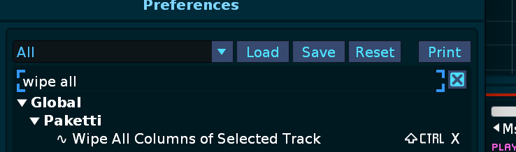


---
### 2024-10-02 - esaruoho

Improvement: "Play at Row 001-512" now also includes HEX next to it.
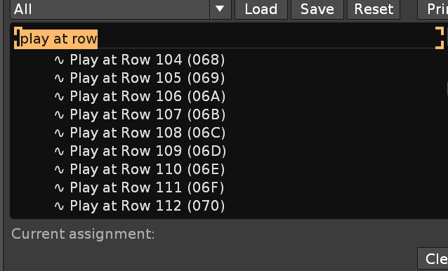


---
### 2024-10-02 - esaruoho

Improvement: "Play at Row 000-511" makes more sense 😉
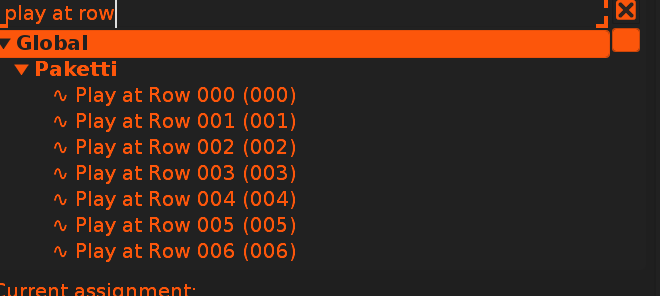


---
### 2024-10-02 - esaruoho

Improvement: Play at Row will now default to "Play Current Line" and move to that Line, if playback is not on. if playback is on, then it just plays from that line.
(Both this and the above two close https://github.com/esaruoho/org.lackluster.Paketti.xrnx/issues/606)

---
### 2024-10-02 - esaruoho

Improvement: while eSpeak dialog is open, and *no textfield is selected*, pressing ctrl-R will refresh (reload) the textfile. ctrl-enter will "Generate Sample". alt-enter will "Generate Selection"
(Closes https://github.com/esaruoho/org.lackluster.Paketti.xrnx/issues/264)

---
### 2024-10-02 - esaruoho

Feature: Dynamic MidiMapping for Compressor (Threshold, Ratio, Release, Makeup), RingMod (Note, Transpose, Dry/Wet), CombFilter (Note, Transpose, Feedback, Dry/Wet)
meaning, once you bind them, you can modify them no matter where they are in the Selected Track.
<div style="position: relative; padding-bottom: 64.86486486486486%; height: 0;"><iframe src="https://www.loom.com/embed/e7360634fec44795bd8ace4ebafccc01?sid=20736f6a-786e-4c1a-881f-6d210c54f008" loading="lazy" frameborder="0" webkitallowfullscreen mozallowfullscreen allowfullscreen style="position: absolute; top: 0; left: 0; width: 100%; height: 100%;"></iframe></div>

https://www.loom.com/share/e7360634fec44795bd8ace4ebafccc01?sid=4b7073bb-4bfa-4654-8fde-a26700fa35a9
(Closes https://github.com/esaruoho/org.lackluster.Paketti.xrnx/issues/410)

---
### 2024-10-02 - esaruoho

Improvement: EQ10 now also Dynamically MidiMapped
(closes https://github.com/esaruoho/org.lackluster.Paketti.xrnx/issues/608)
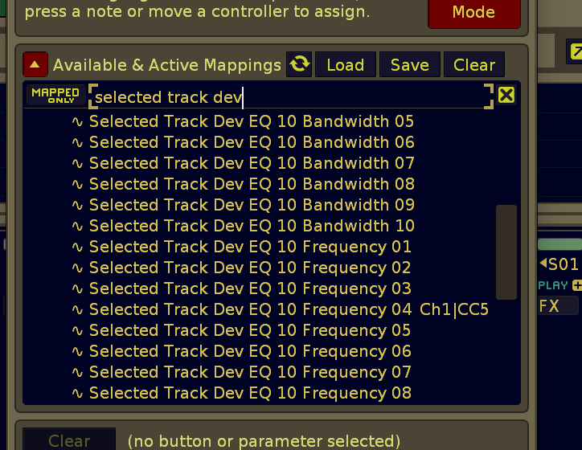


---
### 2024-10-03 - esaruoho

Feature: Start/Stop Sample Recording and Pakettify it.
This means you have one shortcut, that immediately creates a new instrument slot, selects it, writes onto it .. and injects the Macros, Paketti Loader default autofade, autoseek, oneshot, interpolation, mutegroup, new note action, oversample, beatsync, interpolation into it.
(but detail: you ***have*** to have "Create a new instrument on each take" off).  this way anything you sample using the function, will always be Pakettified.


---
### 2024-10-05 - esaruoho

Feature: Inverter Device. This is a Gainer device with Invert set for both channels.
(idea was touched upon on the Facebook Renoise "Workflows/Painpoints" chatgroup - seems valid, here it is)
(Closes https://github.com/esaruoho/org.lackluster.Paketti.xrnx/issues/613)


---
### 2024-10-05 - esaruoho

Improvement: If you add a VST/VST3/AU/LADSPA/DSSI device to Sample Chain, that specific device is selected - allowing for direct randomization or other modifications

---
### 2024-10-07 - esaruoho

Improvement: I made the Gainer device load into Sample FX Chain too

---
### 2024-10-07 - esaruoho

Update: If you're wondering about the lack of updates, I've been working on a quite massive dialog + Dynamic View script which started around thursday-friday as (image1).. then changed to (image2).., and kept ballooning up until we're now at:
(Closes https://github.com/esaruoho/org.lackluster.Paketti.xrnx/issues/379 & 
https://github.com/esaruoho/org.lackluster.Paketti.xrnx/issues/605)
it's still WIP so I'll describe it better, just an update so you know that it's coming and that's why it's been tumbleweed town on this channel.
(i was also on a trip to play a gig on friday and only returned last night at 9pm). there's updates coming, that's for sure.
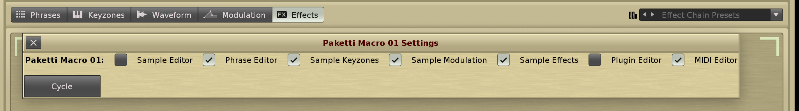

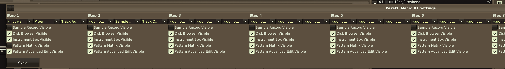

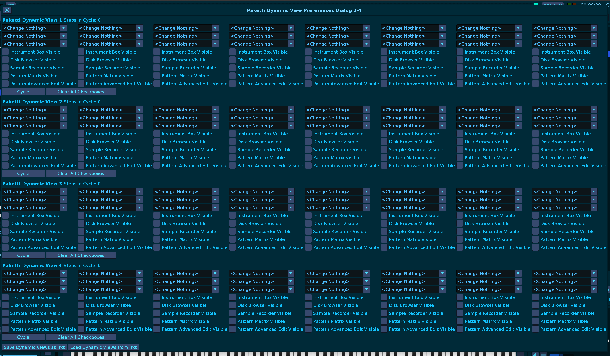


---
### 2024-10-07 - esaruoho

Feature: Paketti Dynamic View Dialog + 8 Shortcuts. There's 4 Cycle slots per Dialog (1-4 Dialog & 5-8 Dialog).
This lets you fully configure a cycle-based shortcut (Dynamic View 01 to Dynamic View 08) with full control over Upper Frame, Middle Frame, Lower Frame and Visibility (Disk Browser, Instrument Box, Sample Recorder, Pattern Matrix, Pattern Advanced Edit). you can set up your own preferred shortcut for the controls. I believe this is the maximum control that the Renoise API allows for ViewModes, and they are dynamic, so you can set a maximum of 8 cycles, i.e. one shortcut will start from the first slot, then proceed to the next and next and next. 
there's also a system for saving and loading the presets. Enjoy.
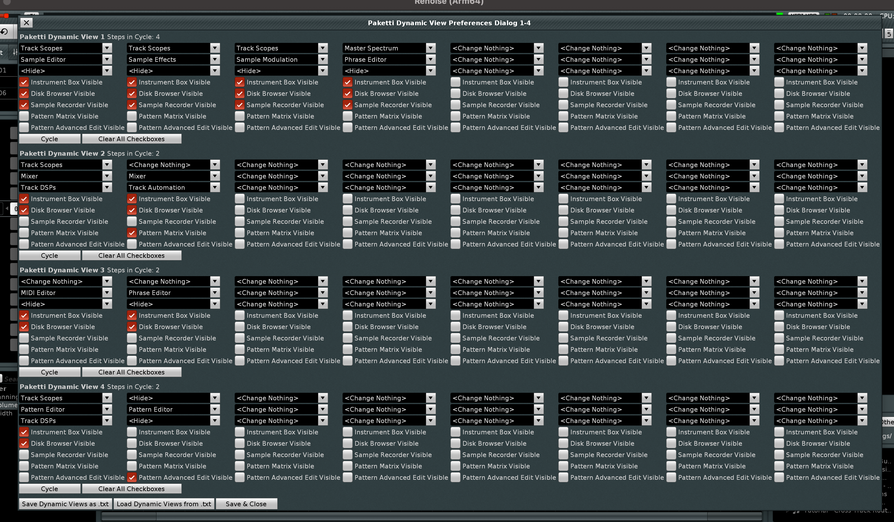


---
### 2024-10-08 - esaruoho

Feature: Select 00...F0 in Instrument Box. if the Slot/Chunk does not exist, it creates it.
(Closes https://github.com/esaruoho/org.lackluster.Paketti.xrnx/issues/585)
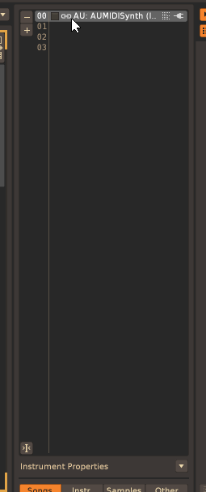


---
### 2024-10-08 - esaruoho

Improvement: Added BPM +1 -1 +0.1 -0.1 +0.5 -0.5 as MidiMappings
This comes from the Renoise Forum request from October 2012 - https://forum.renoise.com/t/bpm/37363
(Closes https://github.com/esaruoho/org.lackluster.Paketti.xrnx/issues/615)


---
### 2024-10-08 - esaruoho

Feature: Wipe&Slice now has a Paketti Preference for "Off". this means that even if the original sample that you want to wipe&slice DOES have a beatsync set up, the slices will NOT have beatsync set up.
(Closes https://github.com/esaruoho/org.lackluster.Paketti.xrnx/issues/611)
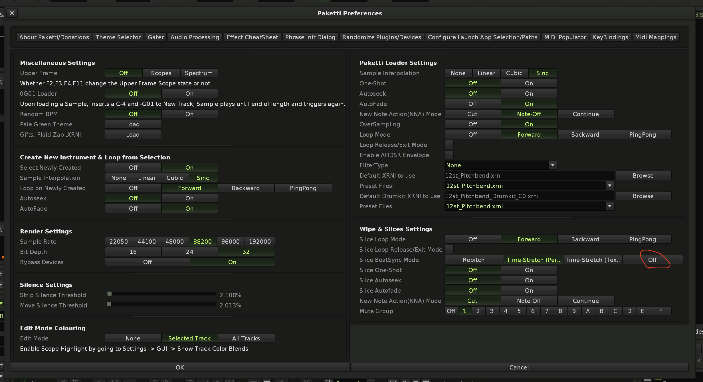


---
### 2024-10-08 - esaruoho

Feature: Create New Track&Load Random Device Chain/Preset
this takes the DeviceChains/ folder already available in Paketti, creates a new track, and loads either a random .XRNT or a random .XRDP inside Paketti, onto the track.
(Closes https://github.com/esaruoho/org.lackluster.Paketti.xrnx/issues/358)


---
### 2024-10-08 - esaruoho

Improvement: Paketti Preferences now correctly loads and displays the Default Filter Type
(Closes https://github.com/esaruoho/org.lackluster.Paketti.xrnx/issues/591)

---
### 2024-10-08 - esaruoho

Improvement: Paketti Preferences now has "Random Device Chain Loader Path".


---
### 2024-10-09 - esaruoho

Improvement: Change Selected Track volume is now in dB. 
(Closes https://github.com/esaruoho/org.lackluster.Paketti.xrnx/issues/554)


---
### 2024-10-10 - esaruoho

Feature: "Clear all Track DSPs from Selected Track". 
This will, well, wipe all the TrackDSPs from the Selected Track. that was simple.
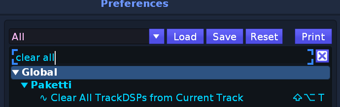


---
### 2024-10-11 - esaruoho

Sidequest: In order to make it easier for me to "pick something to do" from the 120+ tickets on Paketti, I improved this script that picks a random ticket:

https://tobycm.github.io/random-issue-picker/?url=https://github.com/esaruoho/org.lackluster.Paketti.xrnx/issues&fetch

so running this resulted in me working on one long-standing ticket that i've been now tweaking for 1,5 days.
[Embedded Link](https://tobycm.github.io/random-issue-picker/?url=https://github.com/esaruoho/org.lackluster.Paketti.xrnx/issues&fetch)


---
### 2024-10-11 - esaruoho

Update: I'm working on the same large new feature that i started yesterday morning and am hopefully gonna be able to finish it before Wednesday. Am making great progress with it. stay tuned. send a DM if interested in previews

---
### 2024-10-13 - esaruoho

Improvement: There's a theoretically-working-with API5 build Paketti (older version), which might work with Renoise v3.1.1. I don't have it available to me right now so can't check. it disables eSpeak, BeatDetector and removes all font styling.

---
### 2024-10-13 - esaruoho

Improvement: more alterations to API5 Older build, this should now evade certain errors encountered

---
### 2024-10-14 - esaruoho

Feature: Paketti Groovebox 8120. this is a 8 row groovebox, 16 steps per row. each step count can be modified between 1-16. it will, in realtime, output to the pattern editor. youcan load instruments into it using Browse - meaning, one instrument can have max 120 samples. so you can load 120 kicks, 120 snares, 120 hihats, 120 claps, 120 rimshots, 120 rides, 120 toms and 120 randompercs in, and use the Selection Slider or Random button to immediately change to one of them. there's also direct routing for automating pitchbend / cutoff / the Paketti Macro works. there's a Random Gate which will fill the 16 steps across all 8 rows in such a way that only one of the 8 instruments will be playde on that row. there's Global Groove controls. there's mute buttons for muting them. there's a Random Fill which will modify the Step counts and fill randomly. you can control bpm, play, follow pattern. when you move Select or Random slider, it shows the Sample Editor. when you click on Step-count of on Follow or Play, or a checkbox in the stepsequencer, it shows the pattern editor. when you click on Random Groove, or enable Global Groove, or Global Groove sliders, it shows you the Global groove. when you click on Show Automation, it shows you the automation.
Here's a little video demo of it:
<div style="position: relative; padding-bottom: 64.86486486486486%; height: 0;"><iframe src="https://www.loom.com/embed/a6866eb0d331409ab092a7c13c5b357e?sid=048d1e35-7b62-484c-bdd2-d10d1754dae6" loading="lazy" frameborder="0" webkitallowfullscreen mozallowfullscreen allowfullscreen style="position: absolute; top: 0; left: 0; width: 100%; height: 100%;"></iframe></div>

https://www.loom.com/share/a6866eb0d331409ab092a7c13c5b357e?sid=2d20a67e-0d3b-4c63-810b-903ad21f1c99

I'm still improving on this, but this is the thing i've been working on for 3-4 days. Will keep cracking away at it until it does everything I want and when using it in a jam session type deal, i don't get any additional ideas. I'm open to any suggestions, out of interest, but let's please not blow this out of proportion by demanding lots of more rows etc.
(Closes https://github.com/esaruoho/org.lackluster.Paketti.xrnx/issues/448)

---
### 2024-10-14 - esaruoho

Improvement: Here's three ways of booting up the Paketti Groovebox 8120 - a shortcut, a midimapping and a menu entry
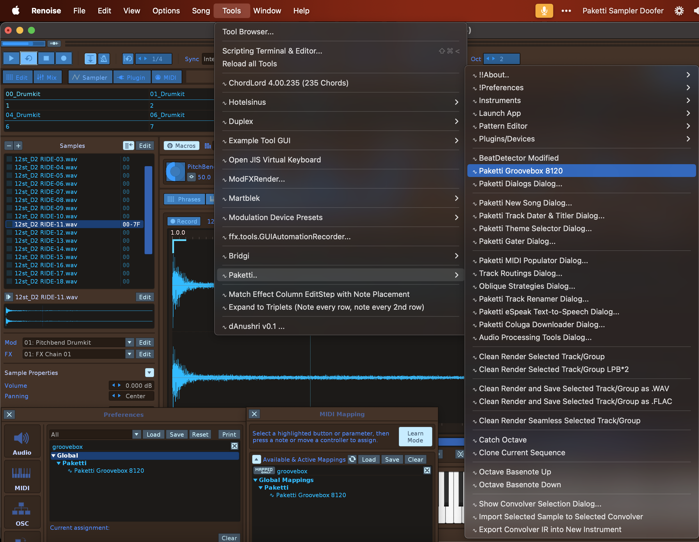


---
### 2024-10-14 - esaruoho

Improvement: Groovebox 8120 has been improved in these ways in the past 3 days:
bug: Checkboxes should update Pattern
bug: Random Gate&Fill Empty steps functions missing
feature: Select Button that shows the sample currently playing in sample editor for quick edits
feature: buttons return focus to Renoise instead of dialog
feature: clicking on Random will select the instrument in Sample Editor
feature: moving slider for Drum Sample selection will select the instrument and show the Sample Editor
feature: global groove sliders + random groove should select master track and show global groove
bug: Browse does not trigger Refresh
bug: Random fill slider at 0, clears all rows
bug: Select slider does now select a sample
bug: Samplename now properly changes when pressing Random
bug: Global Groove checkbox is not checked for, i.e. shows as off even though ON in settings
bug: when fetching, dialog lurches + overwrites destructively.
bug: Select Slider should set the correct samplename
Improvement: When clicking on 1...16 Global Steps, display Pattern Editor
Improvement: Global Groove is now correctly updated - i.e. if master has it on-> then it reads it. if master has it off -> then it reads it.
Improvement: When opening the dialog, the correct steps are fetched from Pattern Editor, without overwriting Pattern Editor content
Improvement: "Randomize All" will randomize each of the 8 rows
Improvement: "Random All" will random pick a sample of each instrument.
Improvement: Selected Slider now selects the correct samplename
Improvement: Select Row1-Row8 Automation Device for pitchbend working
Improvement: Dynamically rename Tracks upon Loading
Improvement: "Show Automation" shows automation for easy pitchbending
Feature: Clicking on Follow Pattern should show the Pattern Editor
Clicking on Play should show Pattern Editor
1st sample should be selected - and the rest muted, after adding instrument.
Random All now sets random samples for each row.
Random Gate resets steps to 16

---
### 2024-10-15 - esaruoho

Improvements: Paketti Groovebox 8120
- now correctly fetches the sample name when opening dialog
- now no longer errors if no samples have been loaded
- dialog opens properly without uninformative error

---
### 2024-10-15 - esaruoho

Improvements: Paketti Groovebox 8120
- Random Fill now gives an informative status
- Added BPM/2 and BPM*2
- Random Gate now gives a better status
- Global >> and << now give a better status.
- Clear All now says "Wiped all steps of each row."
- Random All now says "Each Instrument Bank now has a Random Selected Sample"
- Randomize All now says "Each Instrument Row step content has now been randomized."
- Select button has been renamed to Show for better discoverability.


---
### 2024-10-15 - esaruoho

Improvement: Added all buttons to midimappings:


---
### 2024-10-16 - esaruoho

Improvement: now each row in 8120 has Reverse and there's a Reverse All which reverses all the selected samples for each row

---
### 2024-10-17 - esaruoho

Improvement: Paketti Preferences now only runs the XRNI Default search once instead of running it twice.

---
### 2024-10-17 - esaruoho

Improvement: GitHub plumbing now means that "choose random theme" Paketti Theme Selector is not run by default when installing Paketti. There was an issue with GitHub inputting all the preferences (aka my settings) to any user who downloaded the build. this is not so in private builds.
I've also set EditMode blend highlight so that it is not Selected Track by default. working on a few other things.
(Closes https://github.com/esaruoho/org.lackluster.Paketti.xrnx/issues/467)

---
### 2024-10-17 - esaruoho

here's something quite simple but with possibilities that might be really useful:  "selection in pattern to selection in automation"


---
### 2024-10-17 - esaruoho

Improvement: ALT-D / ALT-U (Doubleselect, unmark) now read if automation is displayed, and provide selection/deselection there, too.
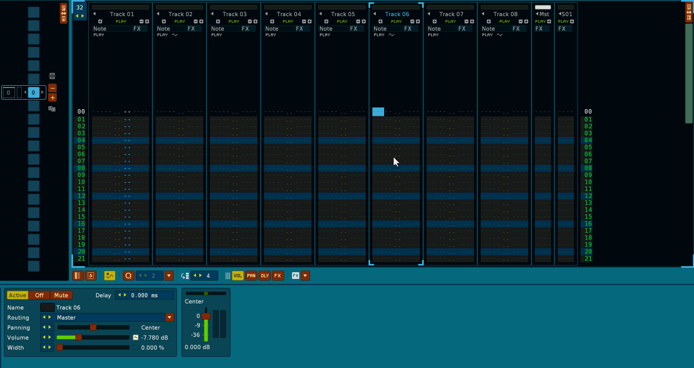


---
### 2024-10-18 - esaruoho

Improvement: Windows Paketti no longer opens up two CMD.exe's to query default XRNIs, instead does it without using terminal / cmd.

---
### 2024-10-18 - esaruoho

Plumbing: all mentions of "ReSpeak" removed and replaced with "eSpeak" everywhere. 
Improvement: Randomize Settings will now render the textfield content, instead of just randomizing the settings and doing nothing.

---
### 2024-10-18 - esaruoho

Improvement: "Bypass all Devices on Track" & "Enable all Devices on Track" weren't available as shortcuts. now they are

---
### 2024-10-18 - esaruoho

Improvement: Three Bypass/Enable&Toggle menu entries are now sorted correctly in Mixer Menu Entry for better discoverability
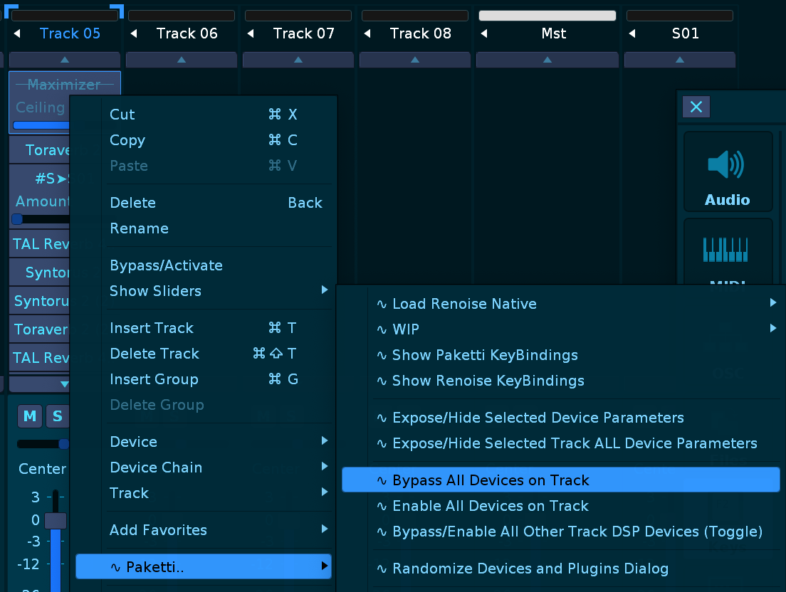


---
### 2024-10-18 - esaruoho

Feature: Bypass All Devices on All Tracks / Enable All Devices on All Tracks
(Closes https://github.com/esaruoho/org.lackluster.Paketti.xrnx/issues/630)
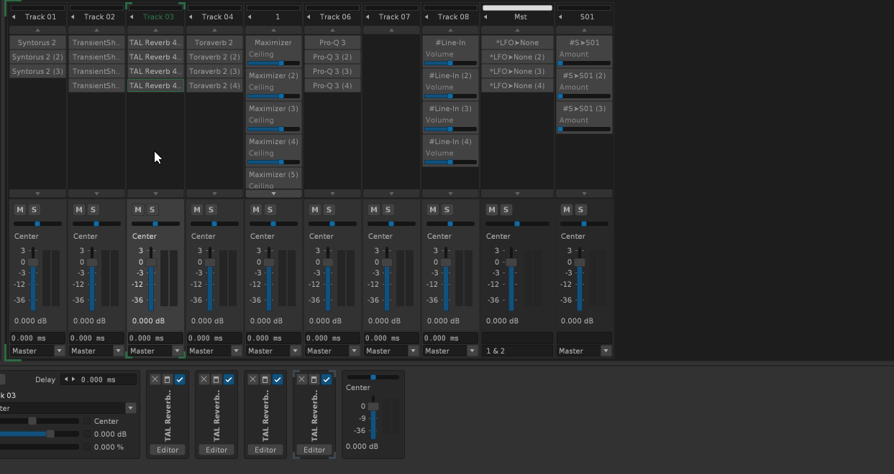


---
### 2024-10-18 - esaruoho

Improvement: moved Clean&Render features in Pattern Editor to be next to eachother instead of all over the place in the menu.
also did the same thing for Mixer menus, all 5 are shown in their own correct place.
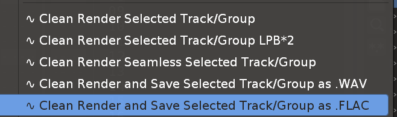


---
### 2024-10-18 - esaruoho

Improvement: Groovebox 8120 "BPM" text is no longer a text, it's a button that randomizes the BPM between 20-300


---
### 2024-10-19 - esaruoho

Improvement: Inverter device can now be loaded (and gets renamed) in both Sample FX Chain and Track DSP Chain:


---
### 2024-10-20 - esaruoho

Improvement: Groovebox 8120 now has probability Yxx setting below every actual step - each instrumentbank can have it's own Yxx set for the probability checkbox
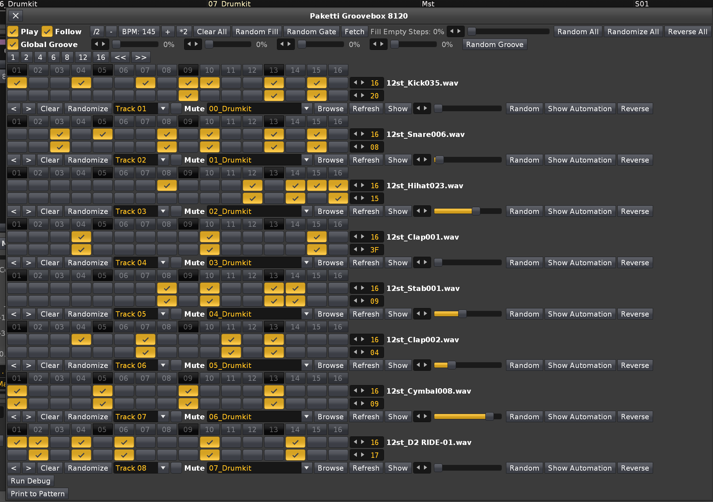


---
### 2024-10-20 - esaruoho

Improvement: "Yxx ProbabilitY" now listed next to the valuebox for better discoverability
+ "Random Fill" Removed because "Randomize All" does the same thing


---
### 2024-10-20 - esaruoho

Improvement: eSpeak error from Menu Entries: it was still referring to ReSpeak so fixed it to eSpeak

---
### 2024-10-21 - esaruoho

Improvement: "Load Random Chain" button added to Paketti Preferences:
so you can immediately start testing out your device chain loading.
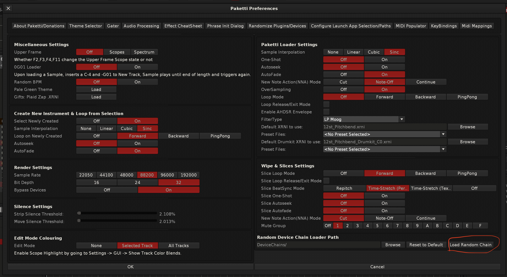


---
### 2024-10-21 - esaruoho

Improvement: Grabbed Renoise subforums 10 (Tips & Tricks), 18 (Renoise Tools) and 19 (Renoise Tool Development) to PDFs - a total of 4209 posts
(Closes https://github.com/esaruoho/org.lackluster.Paketti.xrnx/issues/413)

---
### 2024-10-21 - esaruoho

Improvement: Yxx now starts at FF (so "always play". that way you can start dropping it down from there to where you like it

---
### 2024-10-21 - esaruoho

Improvement: 8120 now has Clear for each probability row - and also buttons for quickly setting them.


---
### 2024-10-21 - esaruoho

Improvement: added MidiMappings for "Random Gate", "Random All", "Randomize All"," "Reverse All" and steps 1,2,4,6,8,12,16 and << >> global controls

---
### 2024-10-22 - esaruoho

Improvement: Added "No Selected Sample" error protection for "Set Selected Sample Velocity Tracking On/Off" shortcuts

---
### 2024-10-22 - esaruoho

Update: I've finally reached a milestone, i've gone through 30% of the "Ideas and Suggestions" Renoise subforum (2002-2024 posts). i've picked 346 tickets from the 30% (there were 7361 in total). some of them are already done, but some are just "oh, look at this and eventually do it". if i were to add these to the GitHub we'd probably jump to 500 open tickets or so. but work is being done to filter through the ideas and suggestions, beginners questions, tips and tricks, tool development, renoise tools discussion threads. there's i believe in total over 16000 threads i need to filter through and make decisions. just wante dto let you know i'm at 30% of 7361 now. (only 5130 to go through left on Ideas and Suggestions)

EDIT: and i just got through all 2002 Ideas and Suggestions, now it's upwards from 2023

---
### 2024-10-22 - esaruoho

Feature: Show/Hide Selected Track Device 1...32 - this shows or hides the Selected Track's device x if it has an external editor.


---
### 2024-10-22 - esaruoho

Improvement: Plaid Zap XRNI loads on Paketti Preferences again
Also Lackluster Pale Theme button loads on Paketti Preferences
(Closes https://github.com/esaruoho/org.lackluster.Paketti.xrnx/issues/643)

---
### 2024-10-22 - esaruoho

Improvement: "isolate Slices to new Samples" now sets the octave correctly so "q" is C-4
(Closes https://github.com/esaruoho/org.lackluster.Paketti.xrnx/issues/639)

---
### 2024-10-22 - esaruoho

Improvement: "Set Selected Instrument Panning / Interpolation" shortcuts are now global instead of stuck in Sample Editor (joining the rest of the Global "Set Selected Instrument" settings.
(Closes https://github.com/esaruoho/org.lackluster.Paketti.xrnx/issues/637)

---
### 2024-10-22 - esaruoho

Improvement: when using "Create New Instrument & Loop" and Paketti PitchBend Multiple Sample Loader, if Master is selected, you'll get told "Did not add *Instr. Macros device to Master track"
(Closes https://github.com/esaruoho/org.lackluster.Paketti.xrnx/issues/641)

---
### 2024-10-22 - esaruoho

Improvement: Player Pro Note Dialog now returns cursor focus to Pattern Editor - meaning, you can edit the editstep with shortcuts while clicking on the note dialog.
(Closes https://github.com/esaruoho/org.lackluster.Paketti.xrnx/issues/646)

---
### 2024-10-22 - esaruoho

Improvement: Unison Generator Sample Slot names now accurately say what the pan is (such as L50 or R50 for hard pan left, hard pan right) for each unison sample.
(Closes https://github.com/esaruoho/org.lackluster.Paketti.xrnx/issues/640)


---
### 2024-10-22 - esaruoho

Improvement: Send and MultiSend now no longer have this:  - it's off from now on.


---
### 2024-10-23 - esaruoho

Improvement: When loading the Maximizer device, the "Boost" parameter is automatically displayed in the Mixer.
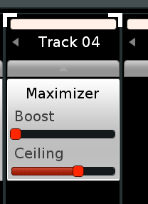


---
### 2024-10-23 - esaruoho

Improvement: Gater now updates the pattern immediately on every checkbox click.
(Closes https://github.com/esaruoho/org.lackluster.Paketti.xrnx/issues/642)
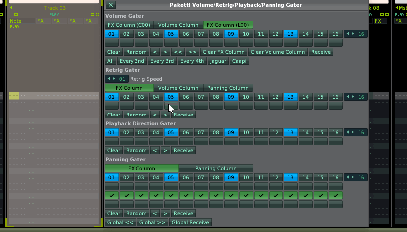


---
### 2024-10-24 - esaruoho

Improvement: I've been tweaking the Instrument Box and Tools Menu Entries and organizing them in a better way. also moved the WIP/Unfinished stuff to "Xperimental/Work in Progress" submenu, for better discoverability. also some copywrite tweaks ("..." = Dialog, ".." = Submenu). removed Clean Render menu entries from Instrument Box because they're Pattern Editor/Mixer specific, and just in general doing more discoverability/readability tweaks. aka "instrument box shouldn't talk about samples too much when they can be in sample editor/sample navigator"


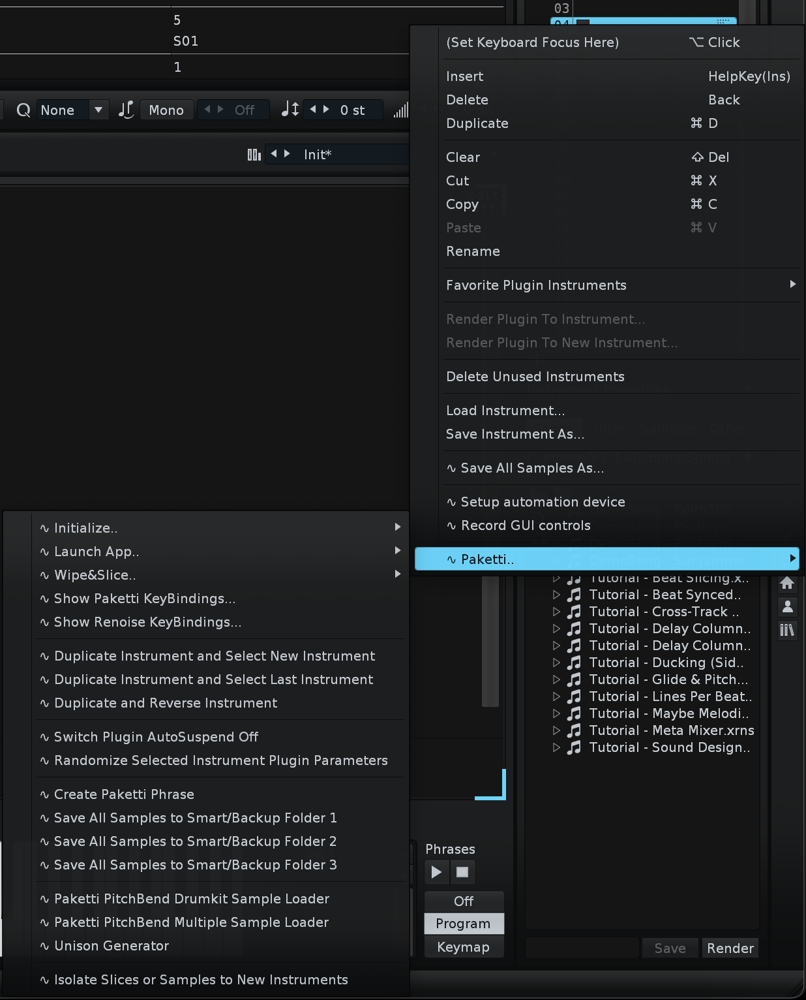


---
### 2024-10-24 - esaruoho

Improvement: Removed "Add 64 slices to instrument" since 84 already exists. Added 84 to Instrument Box, Sample Editor, Sample Navigator.
Some Menu Entries were tied to "Sample Navigation" instead of "Sample Navigator" so they did not get shown
Removed Unison Generator from Instrument Box Menu Entries
Tweaked Sample Mappings Menu Entries look and organization
Added "Configure Launch App Selection..." to Sample Editor and Sample Navigator submenus
Hid Coluga/yt-dlp (since it's WIP) from Sample Navigator, Sample Editor and Instrument Box
Added 7F/00 switcher to Keyzones tab


---
### 2024-10-24 - esaruoho

Feature: Set Interpolation to None,Linear,Cubic,Sinc across the whole song (each sample, each slice) shortcuts added
(Mentioned in https://forum.renoise.com/t/set-interpolation-of-every-sample-in-song-to-none/74220)
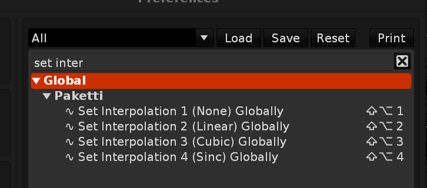

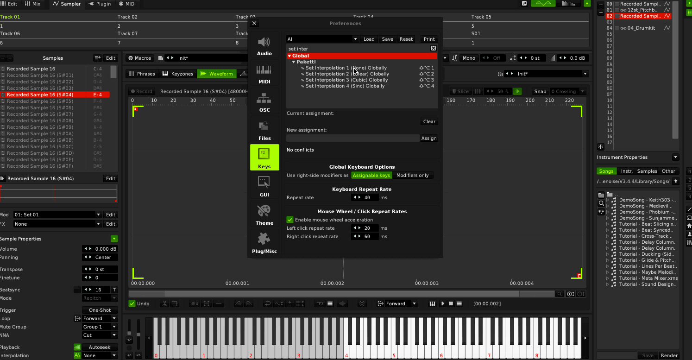


---
### 2024-10-25 - esaruoho

Improvement: the Paketti Donation / About dialog buttons for opening urls now.. open the url again.

---
### 2024-10-25 - esaruoho

Improvement: OctaMED Pick / Put Dialog keybindings are now under "Paketti:" instead of "Paketti..:" for better discoverability

---
### 2024-10-26 - esaruoho

Improvement: more organization for Main Menu -> Tools -> Paketti -> Instruments
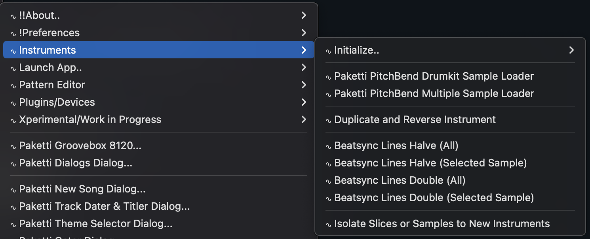


---
### 2024-10-27 - esaruoho

Improvement: Additional tweaks - all menus in menu entry now end with ".." and they are better organized
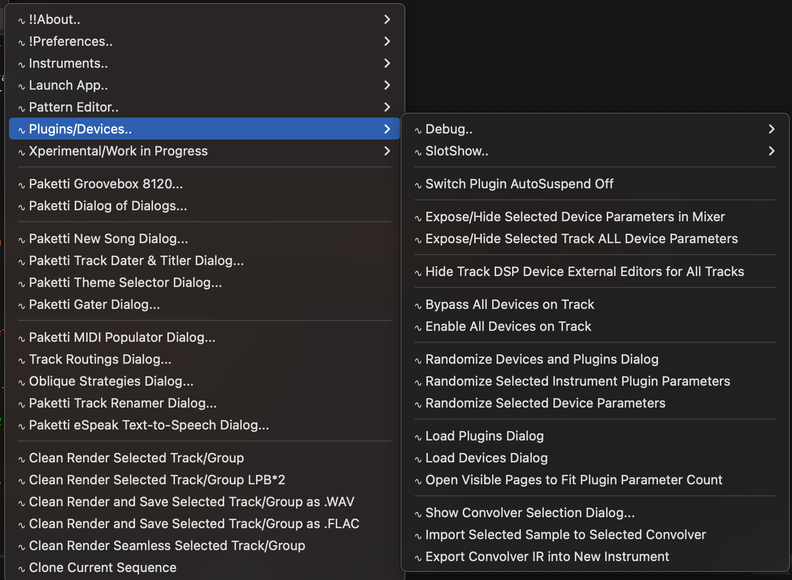


---
### 2024-10-27 - esaruoho

Improvement: "Capture Nearest Instrument and Octave" has now received the following upgrades:
39. After selecting the nearest instrument, if you run the script again, it shows the Sample Editor.
40. If you're already in the nearest instrument, and Sample Editor is showing, then back to Pattern Editor and Automation
41. If you're already in the nearest instrument, and Pattern Editor and Automation are showing, then show Track DSPs.
(Related to some discussions at https://forum.renoise.com/t/sample-selection/20837, so 2007.. )

---
### 2024-10-28 - esaruoho

I pretty much ended up using most of today trying to get the Paketti Manual GitHub page working, didn't make much headway, the markdown is not correctly parsed. but also filtered through tons of Renoise Threads

---
### 2024-10-29 - esaruoho

Improvement: Moved the path of these so there's no "Global:Paketti" for MidiMappings, instead Paketti: for these
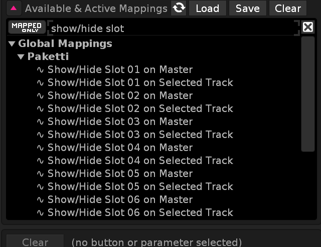


---
### 2024-10-29 - esaruoho

Improvement: Path changes for MidiMappings for these


---
### 2024-10-29 - esaruoho

Improvement: Path changes (easier to show the before fix)
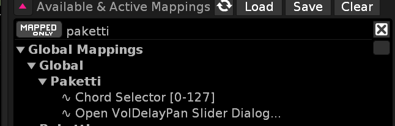


---
### 2024-10-29 - esaruoho

Improvement: Fixed the numbering order of these so they start from 01 instead of 1 - better discoverability
(Closes https://github.com/esaruoho/org.lackluster.Paketti.xrnx/issues/666)


---
### 2024-10-29 - esaruoho

Improvement: Unison Generator will no longer error out if being run on an instrument with multiple samples. it will instead make a copy of the selected sample, and start the unison generator process.
(Closes https://github.com/esaruoho/org.lackluster.Paketti.xrnx/issues/662)

---
### 2024-10-30 - esaruoho

Updates: I've merged the paketti manual work with the brickwall of text into one article instead of multiple pages. and wrote some more stuff to the brickwall and did the first rudiments of organizing it a bit better. i'll need to split it into little pieces and group them by themes and areas. It's a longform project, would probably take me a month to get it done fully and properly
Added some more Loom videos to it

---
### 2024-10-30 - esaruoho

Improvement: Added shortcuts and midimappings for controlling Automation playmode - so you can set it to Points, Lines or Curves at will.
(Closes https://github.com/esaruoho/org.lackluster.Paketti.xrnx/issues/667)
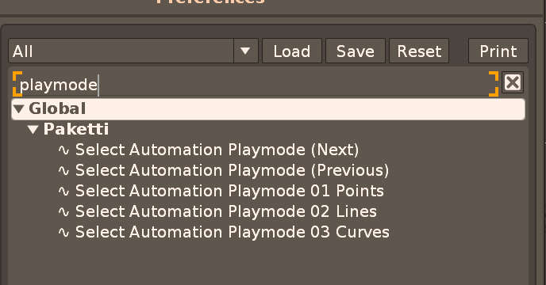


---
### 2024-10-30 - esaruoho

Improvement: "Show External Editor for Selected Device" in Automation will no longer error if there is no External Editor 🙂 instead shows an informative error.


---
### 2024-10-30 - esaruoho

Improvement: "Show External Editor for Selected Plugin" now also shows an informative error


---
### 2024-10-31 - esaruoho

Improvement: Track Titler now has different date formats for those who want them:
(Closes https://github.com/esaruoho/org.lackluster.Paketti.xrnx/issues/657) 
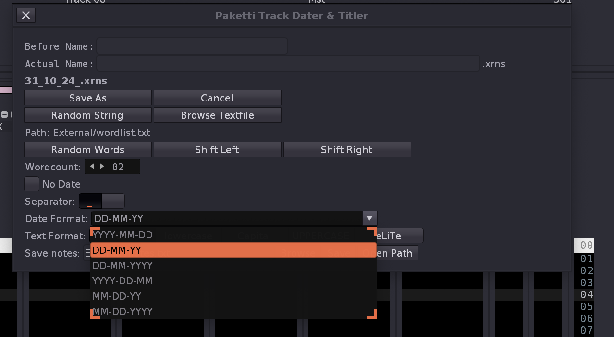


---
### 2024-10-31 - esaruoho

Feature: Midi Mapping for changing Selected Instrument Transpose
(Closes https://github.com/esaruoho/org.lackluster.Paketti.xrnx/issues/638)
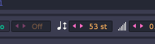


---
### 2024-10-31 - esaruoho

Improvement: I've added 8 midiknobs that fit the 0...127 values into 1...8 for cycling through the Dynamic Views. if there's only two cycles configured for a dynamic view - then 0-64 will change to cycle1, and 65-127 to cycle2.
this means, you can configure a max of 8 different dynamic view states as per one Dynamic View number, and use one knob  to switch between these views.
so if you have a situation where you absolutely must quickly run from pattern editor to sample editor to sample editor with sample recorder showing to mixer to pattern editor with automation, to.. sample phrases.. to.. something - you can do it with the twist of a knob.
(closes https://github.com/esaruoho/org.lackluster.Paketti.xrnx/issues/656) 


---
### 2024-10-31 - esaruoho

Improvement: Paketti Groovebox 8120 now has a slider for Yxx probability, a Randomize for each row's Yxx, and a Randomize all Yxx.
(Closes https://github.com/esaruoho/org.lackluster.Paketti.xrnx/issues/623) 


---
### 2024-10-31 - esaruoho

Feature: "Populate Sends to all Selected Tracks"
select a few tracks in the song and run script -> sends added to all tracks.
(Closes https://github.com/esaruoho/org.lackluster.Paketti.xrnx/issues/614)
this was from a post on the Ideas and Suggestions Renoise forum made in 2004 ( https://forum.renoise.com/t/strapping-a-send-across-several-tracks/15087 )


---
### 2024-11-01 - esaruoho

Improvement: added MPReverb 2 controls (dynamic midimappings that find where the device is in the selected track) for Color, Duration, WetMix


---
### 2024-11-01 - esaruoho

Improvement: the Paketti Edit Mode Signaler no longer reverts "Song Set Track Blend Values" for all tracks to off, if EditMode Signaler is set to "None" and you toggle Edit Mode on or off..
(Closes https://github.com/esaruoho/org.lackluster.Paketti.xrnx/issues/386)

---
### 2024-11-01 - esaruoho

Improvement: Now when you use the Paketti loaders to load #Send or #Multiband send - it will always be added to the end of the track dsp device chain or sample fx device chain.
(Closes https://github.com/esaruoho/org.lackluster.Paketti.xrnx/issues/426)

---
### 2024-11-01 - esaruoho

Plumbing: I've removed 30 duplicate themes (different namings) and added grymmjack themes - there's now a total of 502 themes.

---
### 2024-11-01 - esaruoho

Feature: "Load new sample with current slice markers". select a sample with slice markers. run it via shortcut, or two menu entries (sample editor, or instrument box). prompt comes up, for loading the sample. load the sample -> markers from previous sample are applied to it. if there's less sampleframes, only the markers that fit inside the sample length are applied.
<div style="position: relative; padding-bottom: 64.90384615384616%; height: 0;"><iframe src="https://www.loom.com/embed/f8a4d31abb1643459ca58389357fc78a?sid=ffe72a17-f359-4618-802e-0ad79eb7ccf2" loading="lazy" frameborder="0" webkitallowfullscreen mozallowfullscreen allowfullscreen style="position: absolute; top: 0; left: 0; width: 100%; height: 100%;"></iframe></div>
https://www.loom.com/share/f8a4d31abb1643459ca58389357fc78a?sid=546bd950-8176-45fc-b9a7-2617e349cf49
(Closes https://github.com/esaruoho/org.lackluster.Paketti.xrnx/issues/668)

---
### 2024-11-01 - esaruoho

Improvement: the #Send and #MultiSend XML loaders were calling "PakettiSend.XML" and "PakettiMultiSend.XML" instead of "PakettiSend.xml" and "PakettiMultiSend.xml". fixed.

---
### 2024-11-02 - esaruoho

Feature: Duplicate Selection with padding & Move Cursor 1 & 2:
select 4 rows. press shortcut. introduces 4 rows of silence, duplicates the 4 rows, another 4 rows of silence, and moves the cursor accordingly. will also resize pattern if you're at the end of the pattern.

video only of "padding clearing" flavor (1) 
<div style="position: relative; padding-bottom: 64.90384615384616%; height: 0;"><iframe src="https://www.loom.com/embed/7dc5d7710ad844f081e4af89a8d85af8?sid=77436d53-6c74-416e-9b46-f21f78b7c1ca" loading="lazy" frameborder="0" webkitallowfullscreen mozallowfullscreen allowfullscreen style="position: absolute; top: 0; left: 0; width: 100%; height: 100%;"></iframe></div>
https://www.loom.com/share/7dc5d7710ad844f081e4af89a8d85af8?sid=d601b232-ea0e-44f5-a508-24a8023416ca
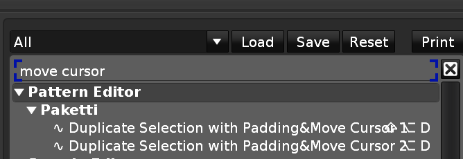


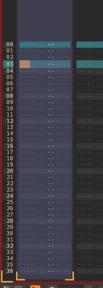


---
### 2024-11-03 - esaruoho

Feature: "Duplicate Pattern & Clear Muted Tracks" ->
you're on a pattern. you have a bunch of muted tracks. you maybe have some automation, and also some pattern matrix muted tracks.
you run the shortcut.
now, below the selected pattern, there's a newly created (and selected)  pattern, with the muted tracks(notes+automation) cleared, the pattern matrix mutes retained.  and if the pattern had a name, then the name is repeated, with `(mutes cleared)` added, and if the pattern had no name, then the name is printed as `pattern <number> (mutes cleared)` 
got the suggestion from a thread in Trackercorps Discord.
<div style="position: relative; padding-bottom: 64.90384615384616%; height: 0;"><iframe src="https://www.loom.com/embed/d5a591475e7c407ea25d43ebce1d9d9b?sid=b67df2d9-ecee-45c9-ab61-2d0fadd73c65" loading="lazy" frameborder="0" webkitallowfullscreen mozallowfullscreen allowfullscreen style="position: absolute; top: 0; left: 0; width: 100%; height: 100%;"></iframe></div>
https://www.loom.com/share/d5a591475e7c407ea25d43ebce1d9d9b?sid=20ff4b86-2014-4edc-b141-b64d84d6f946

---
### 2024-11-03 - esaruoho

Feature: "Nudge and Paste Selection"
This will, instead of adding the padding of silence, instead, read the selection on the track, move the rest of the track down by the selection row count, then paste in the content.
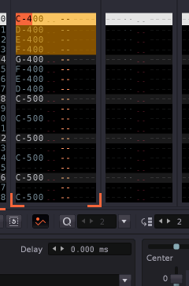


---
### 2024-11-03 - esaruoho

Improvement: "Switch to Automation" will now actually switch to the Automation view, if you're in the Sample Editor and you already had Automation displaying elsewhere (such as pattern editor, mixer, etc). so it will cleanly, reliably, always move you to the track automation.

---
### 2024-11-03 - esaruoho

Feature: Duplicate Selected Sample at -12/-24/+12/+24 menu entries, shortcuts and midimappings added.
This will take the current sample, duplicate it, and set the transpose of the duplicate to one of those.
good for doubling up a sample.


---
### 2024-11-03 - esaruoho

Improvement: Duplicate Pattern & Clear Muted Tracks now has an Above and a Below flavor - the Above will place the duplicate+muted track above the original pattern, and the Below will paste it below.


---
### 2024-11-03 - esaruoho

Improvement: Nudge Paste now has two flavors, one that moves the selection, and one that deselects.


---
### 2024-11-03 - esaruoho

Improvement: Load new sample with current slice markers now also loads sample settings and all slice settings to the new one.

---
### 2024-11-03 - esaruoho

Feature: Randomize Automation Parameter.
this is a global shortcut that will run anywhere, without needing you to focus automation just to randomize. if there's no envelope, it creates a new one. if there's a selection in envelope, it randomizes that. if you have pattern editor + automation displaying, and use `ALT-D *2` to select, you get to select an amount of automation rows and randomize that. at the end of the gif i use the Paketti loader shortcuts to shoot in some track dsp fx and then start automating them
(Closes https://github.com/esaruoho/org.lackluster.Paketti.xrnx/issues/665)
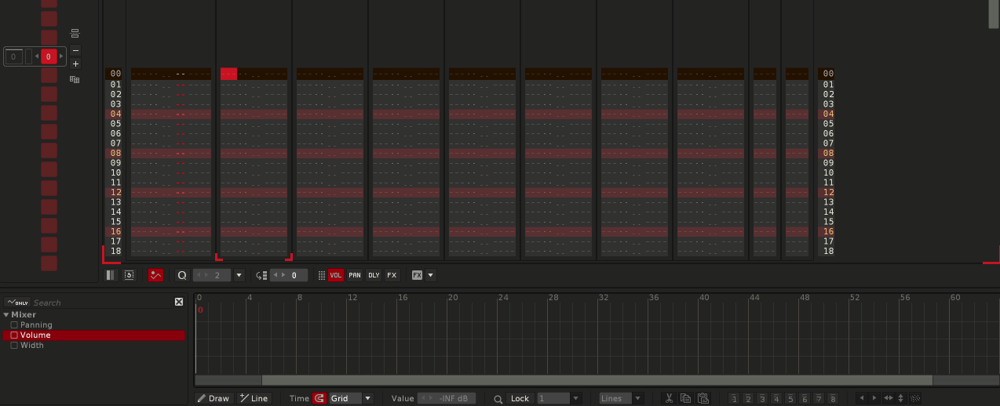


---
### 2024-11-04 - esaruoho

Feature: Invert Volume, Delay, Panning Column content across selection in pattern 
as requested on the trackercorps discord


---
### 2024-11-04 - esaruoho

Improvement: There's now three flavors of it. Invert Volume, Delay, Panning, SampleFX Columns on Note Columns, 
Invert Effect Columns
Invert Effect + Note Column content
and they work with selection in pattern, or no selection in pattern.


---
### 2024-11-04 - esaruoho

Improvement: PitchStep now has a Clear, a Random and a Octave up / Octave Down shortcut.
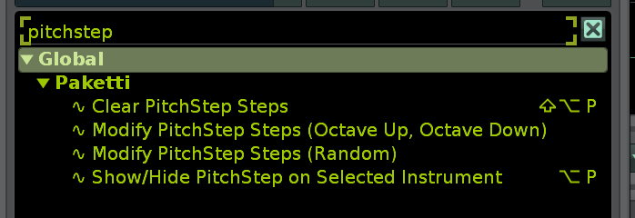


---
### 2024-11-04 - esaruoho

Feature: Randomize Automation Envelopes for Device - this will write randomized automation for each and every parameter of selected device. it's available in Track DSP frame, Mixer and as a shortcut. Write utterly wild randomized automations to your devices of choice and see what happens.
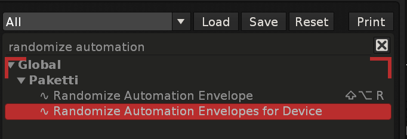


---
### 2024-11-05 - esaruoho

Improvement: ALT-L will now also select the automation lane, if automation frame is displayed.

---
### 2024-11-05 - esaruoho

Improvement: the PitchStep modifiers made yesterday now have protection against if the Pitch Stepper device is not even there. They no longer error out.

---
### 2024-11-05 - esaruoho

Improvement: "Pakettify Current Instrument" now puts in the original instrument volume after doing the Pakettification (loading the macros, modulations and samplefx)

---
### 2024-11-05 - esaruoho

Improvement: ALT-U now has a Global shortcut so you can unmark pattern selection while in Mixer or anywhere. This fixes the issue where you, unknowingly, have something selected in the pattern editor, and try to mute/solo the selected track, and the selection in pattern is muted/solod

---
### 2024-11-05 - esaruoho

Improvement: Added four XRDPs (Device Chain presets) created by NPC1
```
Track Compressor (NPC1).xrdp
Low - High Cut (steep) (NPC1).xrdp
Low - High Cut (halfsteep) (NPC1).xrdp
Low - High Cut (flat) (NPC1).xrdp
```

---
### 2024-11-06 - esaruoho

Feature: added the AKWF waveforms to Paketti at +2 pitch and -35 finetune - there's loaders now that incorporate the default XRNI Instrument in the mix:
a random file will be selected, with the correct pitch and finetune, and loop mode enabled.
and you can stack them, i.e. load a max of 12 samples in and the volume will be reduced so it does not clip. same with "random 1...12" or just random 1. let me know if you need more changes and tweaks.


---
### 2024-11-06 - esaruoho

Feature: Sample Offset (dialog and shortcuts)
requested on https://forum.renoise.com/t/gain-offset-in-sample-editor/74279/


---
### 2024-11-06 - esaruoho

Improvement: "Select Instrument" numbering is now 00 instead of "0" - allowing for better discoverability.


---
### 2024-11-06 - esaruoho

Improvement: "select specific track" numbering is now 01 instead of 1 - better discoverability.


---
### 2024-11-06 - esaruoho

Improvement: Nudge Slice 01-32 is now 01-32 instead of 1-32 , better discoverability


---
### 2024-11-06 - esaruoho

Improvement: Set Global LPB is now 001 instead of 1 onwards - better discoverability


---
### 2024-11-06 - esaruoho

Improvement: Set Phrase LPB is now 3 digits instead of 1, for better discoverability


---
### 2024-11-06 - esaruoho

Improvement: Display Note Column is now 2 digits instead of 1
Column Cycle Keyjazz 2 digits instead of 1


---
### 2024-11-06 - esaruoho

Feature: Switch to Automation Dynamic
Yes. this will cycle through the Automation envelopes that exist in your track.
<div style="position: relative; padding-bottom: 64.90384615384616%; height: 0;"><iframe src="https://www.loom.com/embed/dbc1113a5c4b45a1a8f66b6381f72808?sid=ee610eba-28b6-441a-aa18-31cd197cb363" loading="lazy" frameborder="0" webkitallowfullscreen mozallowfullscreen allowfullscreen style="position: absolute; top: 0; left: 0; width: 100%; height: 100%;"></iframe></div>
https://www.loom.com/share/dbc1113a5c4b45a1a8f66b6381f72808?sid=926aeaea-d037-4f10-99f7-2a820dd54c66


---
### 2024-11-07 - esaruoho

Improvements to the Manual: just rewrote + added gifs of Loading, Saving Samples, Sending Samples to other Apps, Loading Devices and Plugins with Shortcuts & MidiMappings  and Wipe&Slice (Mathematical slicing), Isolate Slices and the MPC-like start/endpoint changing via viewing slice itself.. still a lot to do 
to https://esaruoho.github.io/paketti-manual/#loading-samples

---
### 2024-11-07 - esaruoho

Plumbing: Removed all `.DS_Store` files from the GitHub repo for Paketti

---
### 2024-11-07 - esaruoho

Improvement: the AKWF loaders will now add a new instrument slot and select it - so you can run the loaders as many times as you like and start chiptuning away.

---
### 2024-11-07 - esaruoho

Update: am now at 3568 out of 7361 left on "Ideas and Suggestions" filtering (=picking/deleting)

---
### 2024-11-07 - esaruoho

Feature: "Select Loop Range" for Sample Editor:


---
### 2024-11-08 - esaruoho

Update: GitHub has now been switched around so Ko-Fi, Patreon and GitHub Sponsors are visible directly from the repository:
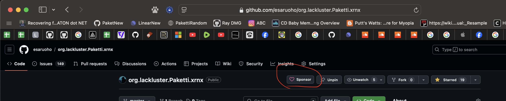

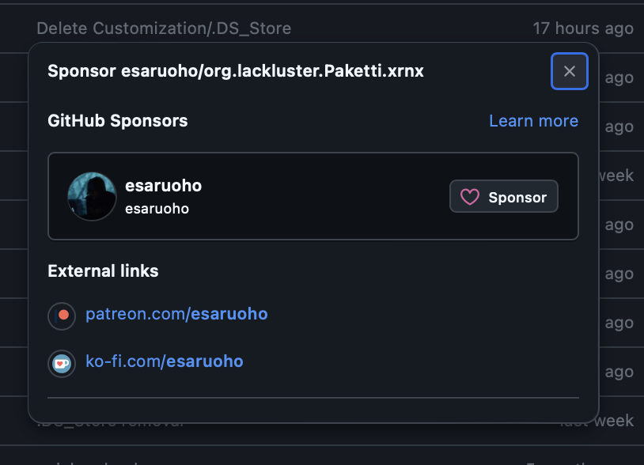


---
### 2024-11-08 - esaruoho

Update: GitHub url has been shortened to `esaruoho/paketti` to better match `esaruoho/paketti-manual`

---
### 2024-11-08 - esaruoho

Feature: Set Random EditStep 0-64
Set Random EditStep 1-64
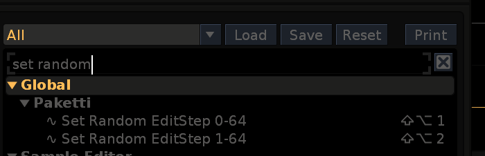


---
### 2024-11-08 - esaruoho

Feature: Jump Backwards Within Pattern by 0...128
Jump Backwards Within Pattern by Random
Jump Forwards Within Pattern by 0...128
Jump Forwards Within Pattern by Random
Jump Backwards Within Song by 0...128
Jump Backwards Within Song by Random
Jump Forwards Within Song by 0...128
Jump Forwards Within Song by Random

shortcuts + midimappings added
(Closes https://github.com/esaruoho/paketti/issues/682)


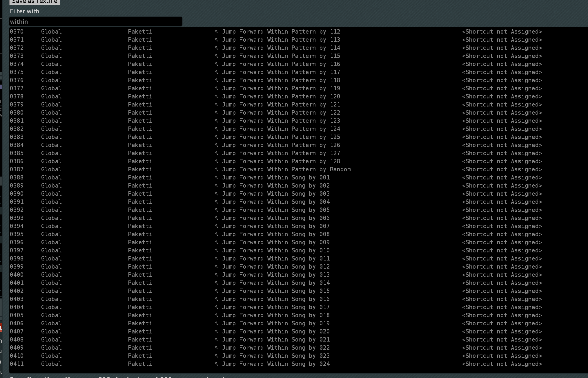


---
### 2024-11-09 - esaruoho

Improvement: Paketti Gater had a bug where it would touch the notes and instruments i.e. if you had a 16 step gater, the first 16 steps would be repeated with notes. this no longer happens.

---
### 2024-11-09 - esaruoho

Improvement: Paketti Load Devices shortcuts + midimappings were no longer read when renoise was started - they are now read and applied.
(Closes https://github.com/esaruoho/paketti/issues/679)

---
### 2024-11-09 - esaruoho

Improvement: I lately modified the Capture Nearest Instrument and Octave so that it would jump, on second run, to sample editor, on third run to pattern editor+automation and on fourth run to pattern editor + track dsp (this in case the nearest instrument is already selected).
i've now made two flavors, one that jumps around like that and one that doesn't


### 2024-11-10 - esaruoho

Improvement: I've probably fixed the Paketti PitchBend Drumkit Loader which is instrumental for Paketti Groovebox 8120 to work, so, that it will work directly from first install onwards. It was a path issue. Waiting for feedback from 7 people on whether it works. 🤞

EDIT: Ok, got 1 confirmation that it works.. waiting for the others to ping in

---
### 2024-11-10 - esaruoho

Plumbing: Paketti Titler Dialog preferences are now saved to the general Paketti preferences, not a secondary file.

---
### 2024-11-11 - esaruoho

Plumbing: Paketti MIDI Populator preferences are getting ready to be saved to Paketti preferences, but not 100% there yet. i'm really trying.

---
### 2024-11-11 - esaruoho

Improvement: Paketti MIDI Populator now has preferences that are loaded and saved (from Note Columns to Open External Editor).  also changed from switchboxes to dropdown menus for midi input device + midi output device.


---
### 2024-11-12 - esaruoho

Improvement: Added "Set Keyboard Velocity" 00, 10, 20, 30, 40, 50, 60, 70, 7F shortcuts + midimappings:


---
### 2024-11-12 - esaruoho

Improvement: Max Amp DC Kick Generator shortcut now also renames the instrument + sample, just like the Audio Processing Dialog one already did.


---
### 2024-11-12 - esaruoho

Feature: Open Automation Value Dialog.
This will.. Open a dialog (sets Pattern Editor + Automation frames displaying)-> focus the textfield
you type in a number between 0...1
press enter twice - writes to automation line. if no automation envelope, creates it.
and the textfield is re-focused again.
(Closes https://github.com/esaruoho/paketti/issues/685)


---
### 2024-11-13 - esaruoho

Improvement: Write Automation Value 0.0 ... 1.0 
these shortcuts will do much of what the above does, but always to "that value".


---
### 2024-11-13 - esaruoho

Improvement: Added more pattern lengths to "Resize all non-empty Patterns to.." shortcuts.
(Closes https://github.com/esaruoho/paketti/issues/698)


---
### 2024-11-13 - esaruoho

Improvement: AKWF Random Loading did not work on Windows. Fixed.

---
### 2024-11-13 - esaruoho

Improvement: added Duplicate Selected Sample to +12 +24 -12 -24 to Sample Mappings.


---
### 2024-11-14 - esaruoho

Feature: GlobalGainer - adds a `GlobalGainer` to each track - and the same midi knob that controls the volume of each GlobalGainer device.  and if you add more tracks, the same midi knob will add more GlobalGainers to the new tracks.
<div style="position: relative; padding-bottom: 64.90384615384616%; height: 0;"><iframe src="https://www.loom.com/embed/41c362b9a8c44ff79bd869f49cbbdab1?sid=b139a6df-f1b8-4d23-a9db-c8b6f19967b7" loading="lazy" frameborder="0" webkitallowfullscreen mozallowfullscreen allowfullscreen style="position: absolute; top: 0; left: 0; width: 100%; height: 100%;"></iframe></div>
https://www.loom.com/share/41c362b9a8c44ff79bd869f49cbbdab1?sid=e1d0548a-28bb-4633-a000-e8ba7deef9fc
as requested by [Patreon subscriber](https://www.patreon.com/esaruoho) number two

---
### 2024-11-14 - esaruoho

Feature: A/B Shortcuts for adding A or B - Gainer device to selected track -- and a midiknob that does a crossfade between A & B.
<div style="position: relative; padding-bottom: 64.90384615384616%; height: 0;"><iframe src="https://www.loom.com/embed/4d19d732f7f643c69da83c50dc402103?sid=a0d975ad-61ee-4019-a373-08f7f3dbae10" loading="lazy" frameborder="0" webkitallowfullscreen mozallowfullscreen allowfullscreen style="position: absolute; top: 0; left: 0; width: 100%; height: 100%;"></iframe></div>
https://www.loom.com/share/4d19d732f7f643c69da83c50dc402103?sid=c7dd1de9-206a-4f22-b894-a4c97a69f832
as requested by [Patreon subscriber](https://www.patreon.com/c/esaruoho) number one

(Closes https://github.com/esaruoho/paketti/issues/700 )

---
### 2024-11-14 - esaruoho

Feature: Load 1.. or 32.. random samples from any subfolder in selected folder.
<div style="position: relative; padding-bottom: 64.90384615384616%; height: 0;"><iframe src="https://www.loom.com/embed/fe011e3d56d441918a9eb70659c22c79?sid=74a0dd92-eb94-4bf5-809e-31f113dfe994" loading="lazy" frameborder="0" webkitallowfullscreen mozallowfullscreen allowfullscreen style="position: absolute; top: 0; left: 0; width: 100%; height: 100%;"></iframe></div>
https://www.loom.com/share/fe011e3d56d441918a9eb70659c22c79?sid=bd9dc155-1f9d-44b1-b163-db983fd51631
[Embedded Link](https://www.loom.com/share/fe011e3d56d441918a9eb70659c22c79?sid=bd9dc155-1f9d-44b1-b163-db983fd51631)


---
### 2024-11-14 - esaruoho

Improvement: Added 2nd midibinds of the 8 Selected Instrument macros and the selected automation parameter writer.

---
### 2024-11-15 - esaruoho

Improvement: Show Automation Value Dialog now writes directly to automation lane and closes.. one single enter required only
repost since gif added


---
### 2024-11-15 - esaruoho

Feature: Load 32 random samples from user-defined folder. (One sample per instrument)

<div style="position: relative; padding-bottom: 64.90384615384616%; height: 0;"><iframe src="https://www.loom.com/embed/fe011e3d56d441918a9eb70659c22c79?sid=482a730a-a58a-4e61-b8fc-35e679d8cf38" loading="lazy" frameborder="0" webkitallowfullscreen mozallowfullscreen allowfullscreen style="position: absolute; top: 0; left: 0; width: 100%; height: 100%;"></iframe></div>
https://www.loom.com/share/fe011e3d56d441918a9eb70659c22c79?sid=bd9dc155-1f9d-44b1-b163-db983fd51631
(Closes https://github.com/esaruoho/paketti/issues/701 )

---
### 2024-11-15 - esaruoho

Feature: load 12 random samples to new instrument.


---
### 2024-11-15 - esaruoho

Feature: load 120 random samples as a drumkit
Video with some audio:
<div style="position: relative; padding-bottom: 64.90384615384616%; height: 0;"><iframe src="https://www.loom.com/embed/9dba2e74146c45dfa1299b9af6cb6686?sid=7453fb29-8618-4805-9ddc-a92dd015fa96" loading="lazy" frameborder="0" webkitallowfullscreen mozallowfullscreen allowfullscreen style="position: absolute; top: 0; left: 0; width: 100%; height: 100%;"></iframe></div>
https://www.loom.com/share/9dba2e74146c45dfa1299b9af6cb6686?sid=80a48602-e0d3-4b47-b22c-c922b7c2ef88
[Embedded Link](https://www.loom.com/share/9dba2e74146c45dfa1299b9af6cb6686?sid=80a


---
### 2024-11-16 - esaruoho

Feature: Save Song with Timestamp - saves yyyy-mm-dd-hh-mm-ss timestamp - shortcut + menu entry.
(Closes https://github.com/esaruoho/paketti/issues/702)
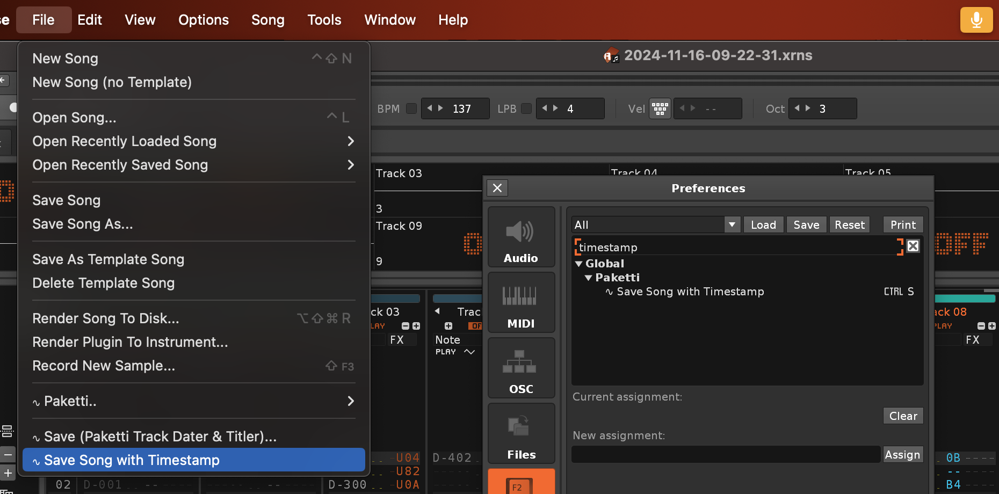


---
### 2024-11-16 - esaruoho

Plumbing: Renoise Tools, GitHub + [Gumroad](https://lackluster.gumroad.com/l/paketti) Paketti builds updated

---
### 2024-11-17 - esaruoho

Improvement: Clean Render was no longer correctly soloing, and now it correctly solos the channel and unsolos, and also it should remember which tracks were muted before the specific track was rendered. proof
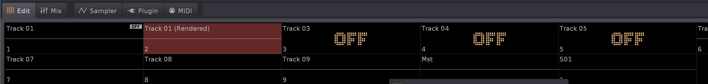


---
### 2024-11-18 - esaruoho

Plumbing: Been working on a Selection In Pattern Pro improvement which should help with all future tooling relating to pattern editor

---
### 2024-11-18 - esaruoho

Improvement: `12st_` does not bring anything especially important to the Sample Navigator Sample Filename, so removed the `12st_` automatic addition for pitchbend drumkit loader for easier readability
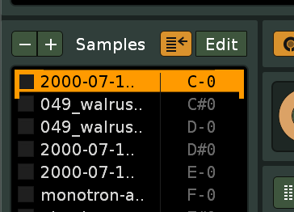


---
### 2024-11-18 - esaruoho

Feature: `Wipe Random Notes` (Random Amount of Notes from Selection) - this will replace notes with Note Offs in selection in pattern across multiple tracks.


---
### 2024-11-18 - esaruoho

Improvement: Initialize for 8120 - this is a menu entry and a global shortcut that adds 8 new tracks to the beginning of the song so you can immediately start using Groovebox 8120.


---
### 2024-11-18 - esaruoho

Improvement: Initialize for 8120 now correctly sets the editmode off while doing the tracks, then re-enables it so there's no two tracks with editmode blend on.

---
### 2024-11-18 - esaruoho

Improvement: Mixer `Paketti..` menu now has the Add Gainer A & B menu entries for preparing for crossfade.


---
### 2024-11-18 - esaruoho

Improvement: `Open VolDelayPan Slider Dialog...` seems to have slipped through the cracks. I've added it to the Main Menu and to the Pattern Editor submenu for Paketti. Easier to remember it exists.
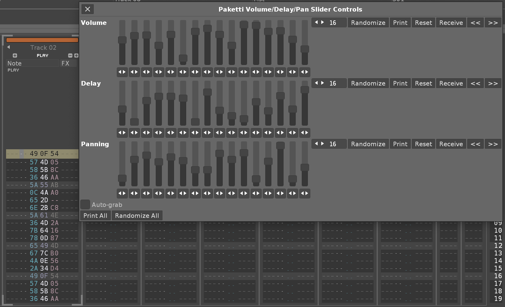


---
### 2024-11-18 - esaruoho

Improvement: It made no sense for the Sliders to have those `< >` buttons which did nothing.  this looks better.


---
### 2024-11-18 - esaruoho

Improvement: Now when you change the valuesteps value, the content is automatically printed.

---
### 2024-11-18 - esaruoho

Improvement: Added "Populate Global Gainers" to Mixer menu


---
### 2024-11-18 - esaruoho

Improvement: Moved "Write Automation value 0.0 - 1.0" menu entries from Main Menu Paketti to Main Menu Paketti: Automation..:


---
### 2024-11-19 - esaruoho

Improvement: Repeater Divisor is now shown in Mixer, when using the midimapping to modify Repeater.
(Closes https://github.com/esaruoho/paketti/issues/710)


---
### 2024-11-21 - esaruoho

Plumbing effort: Still trying to move loadPlugins from one preference to global preference - it's been harrowing but not making much progress 😦 even with assistance

---
### 2024-11-21 - esaruoho

Feature: Paketti User-Defined Sample Folders:
This lets you define specific folders (10 in total), then use the Load 32 (32 samples, one per instrument), Load 12( 12 samples within one instrument) and load Drumkit (120 samples) from the folders. they're all randomized.
(Closes https://github.com/esaruoho/paketti/issues/669)


---
### 2024-11-23 - esaruoho

Feature: Clear Below Current Row - this clears the rest of the pattern of the selected track below the current row.


---
### 2024-11-23 - esaruoho

Improvement: Clear All Tracks Below Current Row


---
### 2024-11-24 - esaruoho

Feature: XY Audio Mixer for 4 AKWF + 4 random samples in same instrument
<div style="position: relative; padding-bottom: 64.90384615384616%; height: 0;"><iframe src="https://www.loom.com/embed/7ed3c942a53241b58a43fceabb932dc2?sid=532ca7ad-bbaa-4457-8aee-6c5f3416e1be" loading="lazy" frameborder="0" webkitallowfullscreen mozallowfullscreen allowfullscreen style="position: absolute; top: 0; left: 0; width: 100%; height: 100%;"></iframe></div>
https://www.loom.com/share/7ed3c942a53241b58a43fceabb932dc2
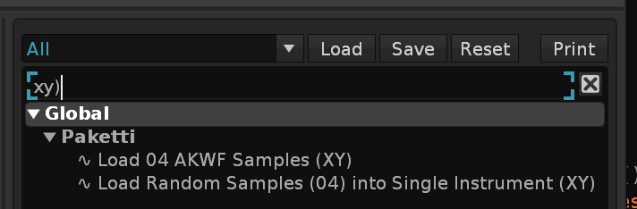


---
### 2024-11-24 - esaruoho

Feature: Generate Track Automation Points out of Notes in Pattern Editor:


---
### 2024-11-24 - esaruoho

Plumbing: "Load Plugins" now writes to the correct preferences file, not a secondary file. and works.

---
### 2024-11-24 - esaruoho

Improvement: Added "Wipe Selected Track Track DSP Devices" to Mixer + Track DSP Layer.
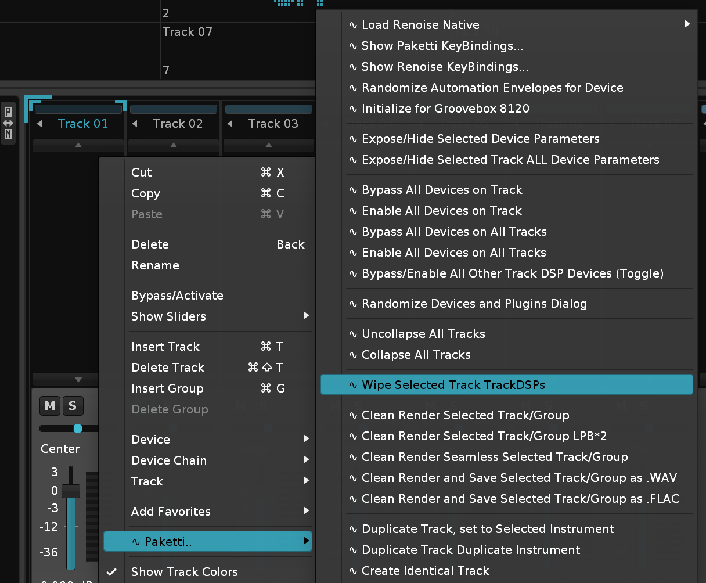


---
### 2024-11-24 - esaruoho

Plumbing: "Load Devices" now writes to the correct preferences file, not a secondary file. and works.

---
### 2024-11-25 - esaruoho

Plumbing: Dynamic Views are no longer overwritten when being given local builds - you just gotta save your current dynamic views, and load them in after reinstalling new Paketti version - this should now help.

### 2024-11-26 - esaruoho

Feature: Automation Selection Flood Fill. 
Takes your selected Automation segment, and fills the rest of the pattern with it.
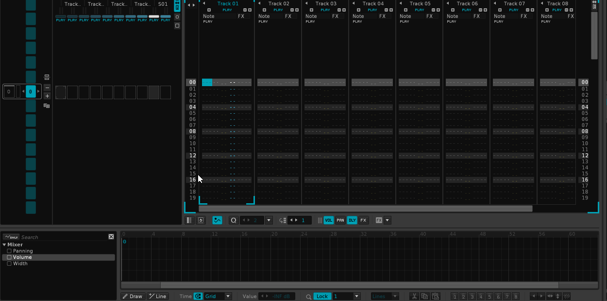


---
### 2024-11-26 - esaruoho

better gif for the above


---
### 2024-11-26 - esaruoho

Improvement: Automation Menu sorting might now be better organized
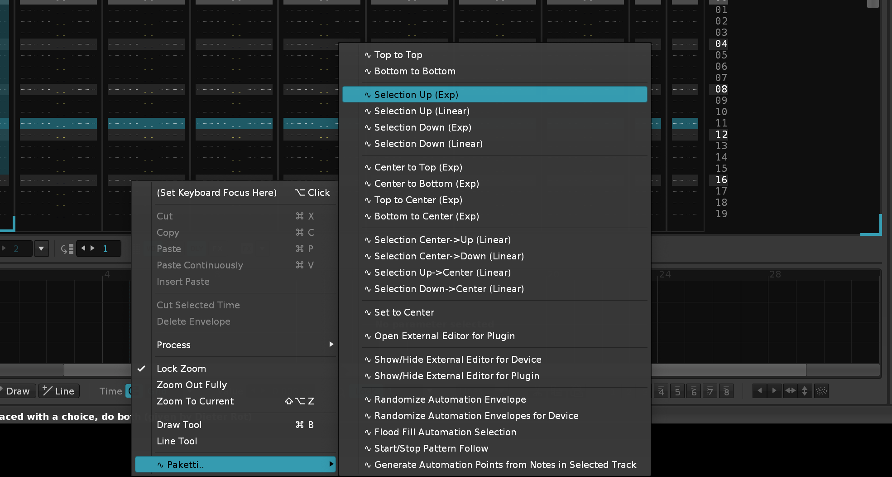


---
### 2024-11-26 - esaruoho

Improvement: Flip Selected Automation Horizontally (menu, midimap, shortcut), + Flip Selected Automation Vertically (menu, midimap, shortcut)
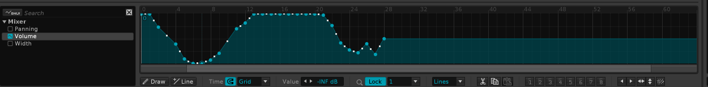


---
### 2024-11-27 - esaruoho

Feature: Set All Tracks to Center - this sets the prefx + postfx of all tracks (including master + send) to Center.
it's in Track DSP, Mixer and Pattern Editor now


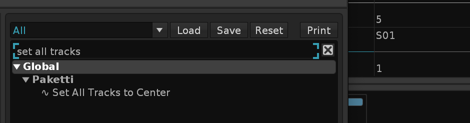


---
### 2024-11-27 - esaruoho

Crisis: Dynamic Views needs to be reverted to the non-preferences.xml situation - it just doesn't work. returning back to how it used to be. sorry.
i really tried to get this going but can't seem to write it properly.

---
### 2024-11-27 - esaruoho

Improvement: Added Stereo->Mono (end of chain / beginning of chain) as menu entry to Track DSP Device area & Mixer.


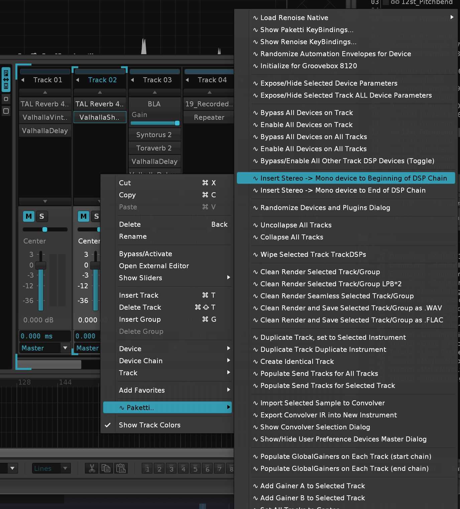


---
### 2024-11-27 - esaruoho

Improvement: "Capture Nearest Instrument & Octave with Jump" now will detect the sample key you are on, and show that specific sample in the sample editor. if you are in the sample editor and run the script, it returns back to pattern editor. suggested key: "Enter".

---
### 2024-11-28 - esaruoho

Improvement: Impulse Tracker "Next Track / Previous Track" jumpers would fail if trying to move from Note Column to a track that is a Group, a Send or a Master. fixed.

---
### 2024-11-29 - esaruoho

Improvement: Added amigaos3 4k and amegas 4k created by ffx themes

---
### 2024-11-30 - esaruoho

Improvement: I'm down to  1934 PDFs left in "Ideas and Suggestions" folder. -- slowly progressing through all of these

---
### 2024-11-30 - esaruoho

Feature: Load XRNI + Wipe Phrases menu entries, keybindings, midimappings
Load XRNI + Keep Phrases menu entries, keybindings, midimappings.
These open a fileprompt, you can load a .XRNI, and either retain or wipe Phrases.
from https://forum.renoise.com/t/when-loading-instrument-presets-phrase-playback-should-be-disabled-by-default/74519/

---
### 2024-11-30 - esaruoho

Feature: "Load Recently Saved Song" shortcut + menu entry. loads the newest saved song
idea from 2007 https://forum.renoise.com/t/open-recently-saved-song/20253

---
### 2024-12-02 - esaruoho

Improvement: YT-DLP now correctly lets you select yt-dlp if it's not set originally
also tweaked some of the dialogs and am slowly removing Coluga from the naming since this is a `YT-DLP` tool.

---
### 2024-12-02 - esaruoho

update, i'm down to 1460 left

---
### 2024-12-02 - esaruoho

Improvement: added "User-Defined Samples Folders" Dialog opener as shortcut


---
### 2024-12-02 - esaruoho

Improvement: Automation Value Dialog now with EditStep - it follows the EditStep and re-highlights the textfield so you can quickly input more automation values at your desired editstep.
(from B-Complex requests on the Renoise Forum https://forum.renoise.com/t/automation-edit-step/24186)
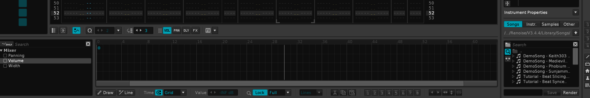


---
### 2024-12-03 - esaruoho

Improvement: Changed "Basenote Transpose" to "Instrument Transpose" - same location for menu entries + shortcuts.
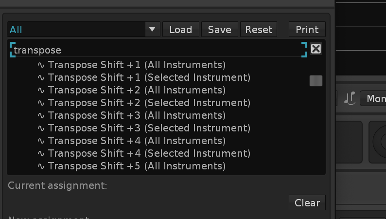


---
### 2024-12-03 - esaruoho

Improvement: moved Randomize Automation Device Parameter / All Parameters + Flood Fill menu entries inside Automation for better Main Menu Tools clarity


---
### 2024-12-03 - esaruoho

Feature: Roll the Dice on Notes
this will take the selection in pattern and roll the dice on all the notes aka randomly place them to the current rows there are notes on.


---
### 2024-12-03 - esaruoho

Improvement: Roll the Dice on Notes now works on multi-track selection


---
### 2024-12-03 - esaruoho

There are now 996 PDFs left in this folder.

slowly getting there for "Ideas and Suggestions"
EDIT: 862

---
### 2024-12-04 - esaruoho

Improvement: Fixed ImpulseTracker "F5" to start from the beginning of the song!
(As per mention in Forum thread https://forum.renoise.com/t/playback-from-start-of-song/29692 Beginners Questions)

---
### 2024-12-04 - esaruoho

improvement: wrote a script that picks a folder, (Ideas and Suggestions, Beginners and Questions, Tool Discussions, Tool Releases) and starts running through it, so i can get a completely random subforum PDF start. there's quite a bit to go through, about 980 Tool discussions, 5600 or so Beginners Questions, still 840 Ideas and Suggestions, and then the Tool Help discussions which i think is 1300 or so discussions. this is gonna be a big goldmine

```
There are now 5127 PDFs left in the folder Beginners Questions Renoise Forum
There are now 853 PDFs left in the folder Ideas and Suggestions Renoise Forum
There are now 1560 PDFs left in the folder Renoise Tool Development Renoise Forum.
There are now 928 PDFs left in the folder Renoise Tools Renoise Forum.
```

---
### 2024-12-04 - esaruoho

Feature: Nudge Up / Down by Delay Values +1 -1
another Ideas and Suggestions post - this allows for - when you get to FF delay value, nudging the note down (when pressing nudge down one more time).. and when you get to 00 delay value, nudging the note up (when pressing nudge up)
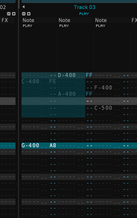


---
### 2024-12-04 - esaruoho

Improvement: now the nudge by delay value will actually also nudge them to the last row notes to the beginning row.
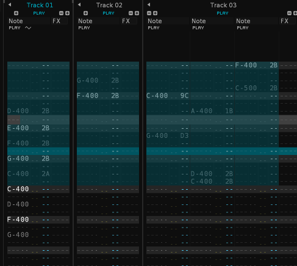


---
### 2024-12-05 - esaruoho

Improvement: Did the same last night for non-delay-value-nudges, instead nudging notes down without delay values being modified
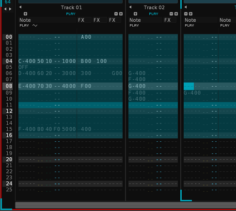


---
### 2024-12-05 - esaruoho

Improvement: AKWF Random Loader now sets instrument volume also, so it no longer blares at you at full volume. also, each loaded sample has -10 or +10 finetune auto-set to it, for widening the sound

---
### 2024-12-05 - esaruoho

Feature: Paketti Device Chain Dialog.
this lets you go to a track, and save the slot.. and use a shortcut to load it to another track.
or the dialog itself.
enjoy.


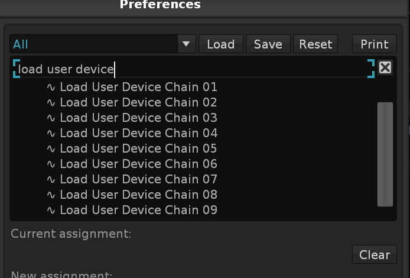


---
### 2024-12-06 - esaruoho

Improvement: The Device Chain Dialog is now a Device Chain (.XRNT) & Instrument (.XRNI) Dialog. you can load both, or either.


---
### 2024-12-06 - esaruoho

Feature: Hide All Effect Columns:
this .. hides all effect columns for all regular tracks.


---
### 2024-12-06 - esaruoho

Improvement: Hide All Effect Columns doesn't error out if you have a Group-track in the mix

---
### 2024-12-07 - esaruoho

Feature: Switch Upper Frame (Track Scopes/Master Spectrum)
(Closes https://github.com/esaruoho/paketti/issues/739)


---
### 2024-12-07 - esaruoho

Feature: Set Selected Track or Master Panning to Hard Left, Hard Right, Center
(Closes https://github.com/esaruoho/paketti/issues/715)
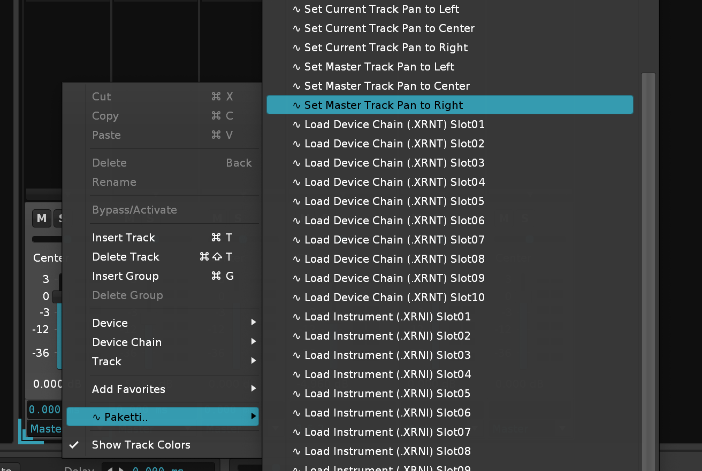


---
### 2024-12-07 - esaruoho

Feature: Isolate Slices to New Instrument - takes the slices in your instrument, and creates a new instrument with samples instead of slices.
(Closes https://github.com/esaruoho/paketti/issues/735)
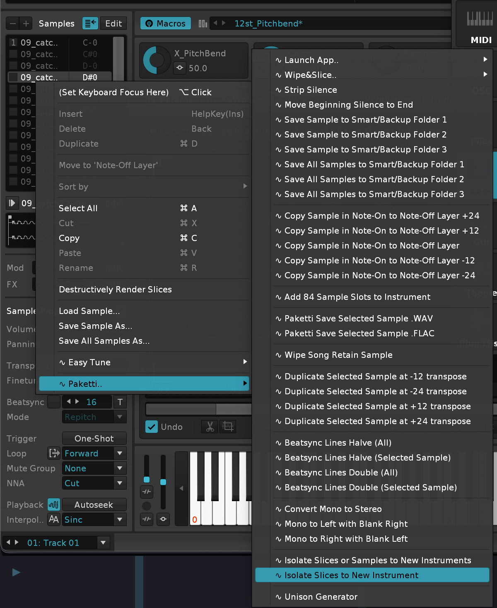


---
### 2024-12-07 - esaruoho

Improvement: "Load XRNI & Disable Phrases" - for those who don't want to wipe phrases but also don't want them to play.
(Addresses https://forum.renoise.com/t/when-loading-instrument-presets-phrase-playback-should-be-disabled-by-default/74519)

---
### 2024-12-09 - esaruoho

I've been making a lot of progress last night and during the flight on the Ideas and Suggestions folder - we're below 600 threads now. I've also been implementing some extra stuff from there, and maintaining a changeslog which is getting to be pretty huge. am also assisting a friend with a tool they have made.

---
### 2024-12-09 - esaruoho

Feature: Create New Pattern from Selection (with Automation) - resizes pattern to selection length and duplicates the pattern for those selected rows for all tracks.

---
### 2024-12-09 - esaruoho

Feature: Set Selected Instrument Overlap Mode "Play All"/"Cycle"/"Random"
Cycle Overlap Mode between all 3

---
### 2024-12-09 - esaruoho

Feature: Load Drumkit with Overlap Mode Cycle or Random (two shortcuts + menu entries)

---
### 2024-12-09 - esaruoho

Feature: Midi Mapping for Clearing current Track content

---
### 2024-12-09 - esaruoho

Feature: Duplicate Selected Track & Name (Drums01 -> Drums02, f.ex.)

---
### 2024-12-09 - esaruoho

Feature: Hide All Effect Columns - hides all effect columns for each and every track!

### 2024-12-09 - esaruoho

Improvement: tweaked the naming so `Isolate Slices to New Instrument as Samples` hopefully makes more sense as a naming
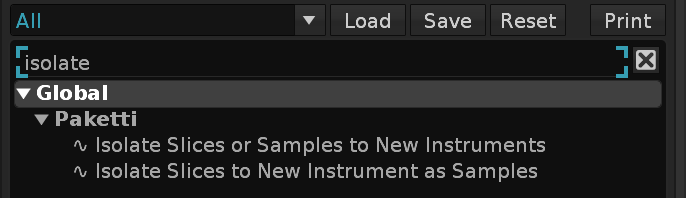


---
### 2024-12-09 - esaruoho

Feature: Automatically Open Selected Track's Devices if they have External Editors. - close them when changing to the next track - and open that one's devices.
<div style="position: relative; padding-bottom: 64.90384615384616%; height: 0;"><iframe src="https://www.loom.com/embed/5f55296e885e42b3825f7a4a840516d5?sid=b5625d2d-70c1-44b9-8936-c69a63bb8799" loading="lazy" frameborder="0" webkitallowfullscreen mozallowfullscreen allowfullscreen style="position: absolute; top: 0; left: 0; width: 100%; height: 100%;"></iframe></div>
https://www.loom.com/share/5f55296e885e42b3825f7a4a840516d5?sid=472e4800-95a5-4394-aa73-da074420d6f5


---
### 2024-12-10 - esaruoho

Improvement: the `Transpose Octave Up (Selection/Track)`  now fully works as expected - even if you have 12 note columns displaying, no longer erroring out in a weird edgecase where it tries to also modify a 13th note column which does not exist.

---
### 2024-12-11 - esaruoho

Improvement: F7 ImpulseTracker "Play Pattern from current row" would not work because I had commented away the experimental `SBx` code. I've reinstated the code so F7 + F5 & F6  properly work

---
### 2024-12-11 - esaruoho

Improvement: Fixed F8 so when you run it for the first time to stop playback, your cursor stays on the line you are on. Second F8 jumps the cursor to current pattern first row. Third F8 jumps the cursor to first pattern first row.

---
### 2024-12-11 - esaruoho

Improvement: Menu Entry for setting all Samples in current Instrument to Loop Forward, PingPong, Reverse or Off.

---
### 2024-12-11 - esaruoho

Improvement: "Insert Track (2nd)" Global shortcut now adds the new track behind the current one, and selects it.

---
### 2024-12-11 - esaruoho

Improvement: Set all samples inside selected instrument Autofade ON & Autoseek ON menu entries in Sample Navigator

---
### 2024-12-11 - esaruoho

Feature: Expand Selection Twice, Shrink Selection Twice shortcuts
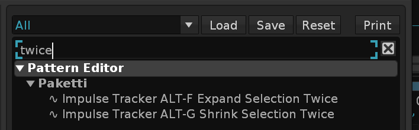


---
### 2024-12-13 - esaruoho

update: out of 7361 threads from 2002 to may 2024 - i picked 1736. i also started processing through which tool discussions / tool ideas / tool releases are worth looking into and either hijacking if they're abandoned, or rewriting with Paketti in mind.

also now that 7361->1736, i'll be working on sorting them into ~~three~~four distinct categories, aka
42. already done and in Paketti
43. not yet in Paketti, do
44. not yet in Paketti, could be done but very complex (further down the todo stream)
45. wait for API changes to allow the feature

---
### 2024-12-15 - esaruoho

Improvement: Made ALT-F Expand Selection & Flood Fil
and ALT-G Shrink Selection & Flood Fill.
these will basically let you expand or shrink the selection and then fill the rest of the pattern with the content.

---
### 2024-12-17 - esaruoho

Improvement: when running "Replicate above Cursor" - if you're on the first row, it'll start replication from first row 🙂
(Closes https://github.com/esaruoho/paketti/issues/730)

---
### 2024-12-17 - esaruoho

Update: I've started to rewrite the Paketti Documentation in Obsidian, hopefully this'll result in me being able to better organize information cohesively.

so far, so good. just need to work it into getting it directly into readme.md on the pakettimanual repository, so that it will 100% work. with the gifs and the screenshot assets.


---
### 2024-12-17 - esaruoho

Update: I've also done a 2 hour Twitch stream of the new feature **Paketti Stacker**, which I'm slowly finetuning and working out the kinks to make it work even faster and in a more userfriendly way. I have a long todo-list of things to do for this, it's a pretty big feature.

---
### 2024-12-17 - esaruoho

Improvement: I've added the missing menu entries + midimappings for both Automation Selection Flood Fill and Automation Value Dialog

---
### 2024-12-18 - esaruoho

Update: Slowly adding more Automation stuff while preparing for wikilinks to markdown conversion.


---
### 2024-12-18 - esaruoho

Improvement: While writing the documentation, I realized that the Pattern Matrix Automation menu entries were confusing, so organized & titled them slightly better. Also, the "Original" Automations (i.e. "current pattern, or if selection then selection within pattern") are grouped inside "Automation Curves.." for better discoverability.


---
### 2024-12-18 - esaruoho

Update: More Automation documentation progress


---
### 2024-12-18 - esaruoho

Feature: "Duplicate Pattern, Wipe Notes in Pattern Matrix Selected Tracks" == Retain Automation, lose notes
"Duplicate Pattern, Wipe Automation in Pattern Matrix Selected Tracks" == Wipe Automation, keep notes
(closes https://github.com/esaruoho/paketti/issues/750)

---
### 2024-12-19 - esaruoho

Feature: Volume Interpolation, Delay Interpolation, Panning Interpolation. select anything in the track, any columns, and interpolate those.
(Closes https://github.com/esaruoho/paketti/issues/327)

---
### 2024-12-19 - esaruoho

Feature: Move Track Left / Move Track Right - these are global shortcut that work everywhere
(Closes https://github.com/esaruoho/paketti/issues/753 )

---
### 2024-12-19 - esaruoho

Improvement: "Note Interpolation" is now called "Interpolate Notes"

---
### 2024-12-19 - esaruoho

Improvement: Renamed / Reorganized all of these into one easily findable place


---
### 2024-12-19 - esaruoho

Improvement: Paketti Groovebox 8120 - fixed an error when pressing Randomize All

---
### 2024-12-19 - esaruoho

Improvement: added ALT-X there too so they are in the right places
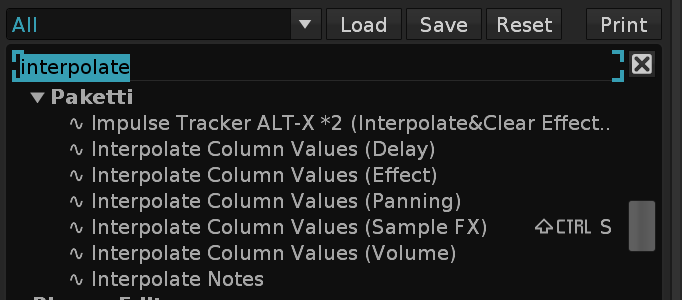

---
### 2024-12-20 - esaruoho

Feature: Duplicate All Samples at -36 -24 -12 +12 +24 +36 Transpose 
menu entries + shortcuts added. this will read the current keymappings of the selected instrument, duplicate the slots, and pitch the duplicated slots by the amount you picked.
EDIT: added protection so that it does not duplicate the already duplicated samples, creating a feedback loop
EDIT: added volume controls so it will drop the volume slowly so you don't get blaring sounds
<div style="position: relative; padding-bottom: 64.90384615384616%; height: 0;"><iframe src="https://www.loom.com/embed/5f55296e885e42b3825f7a4a840516d5?sid=b5625d2d-70c1-44b9-8936-c69a63bb8799" loading="lazy" frameborder="0" webkitallowfullscreen mozallowfullscreen allowfullscreen style="position: absolute; top: 0; left: 0; width: 100%; height: 100%;"></iframe></div>
https://www.loom.com/share/15e01283dd5843869ece3c3e1b2d3891?sid=2374bdee-801f-4ebc-97f9-be3fe7a06b5e


---
### 2024-12-20 - esaruoho

Feature: Random Selected Notes Octave Up 25% - 50% - 75% Probability


---
### 2024-12-20 - esaruoho

Improvement: If you add a *Instr. Macros while in Automation, you stay in Automation view, so you don't get kicked to Track DSP View.

---
### 2024-12-22 - esaruoho

Improvement: I've been cleaning the Xperimental/Work in Progress features to reside in their own folder again

---
### 2024-12-22 - esaruoho

Feature: Global Reduce Instrument Volume -4.5dB
Global Reduce Sample Volume -4.5dB
Global Instrument/Sample Reduction dialog:


Let's you reduce the instrument or sample+slice volumes as you need.
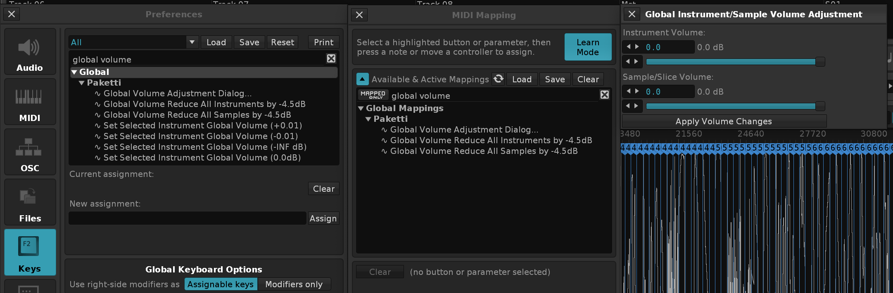


---
### 2024-12-22 - esaruoho

Feature: Paketti Tuplet Generator - a very WIP feature based on the tuplet calculator website. http://tridentloop.com/renoisecalc/ still needs some more work. but here's a little video + gif 
(the gif is pretty outdated, check the video)

 <div style="position: relative; padding-bottom: 64.90384615384616%; height: 0;"><iframe src="https://www.loom.com/embed/454f3cdb1ccf402dbbc15fda6e7c508b?sid=f211f6ca-cfe6-48f0-9371-6f86ff55c3a4" loading="lazy" frameborder="0" webkitallowfullscreen mozallowfullscreen allowfullscreen style="position: absolute; top: 0; left: 0; width: 100%; height: 100%;"></iframe></div>
 https://www.loom.com/share/454f3cdb1ccf402dbbc15fda6e7c508b


---
### 2024-12-22 - esaruoho

Improvement: Added Clone and Expand Pattern to LPB*2 and Shrink Pattern to LPB/2 to Pattern Sequencer for better discoverability.
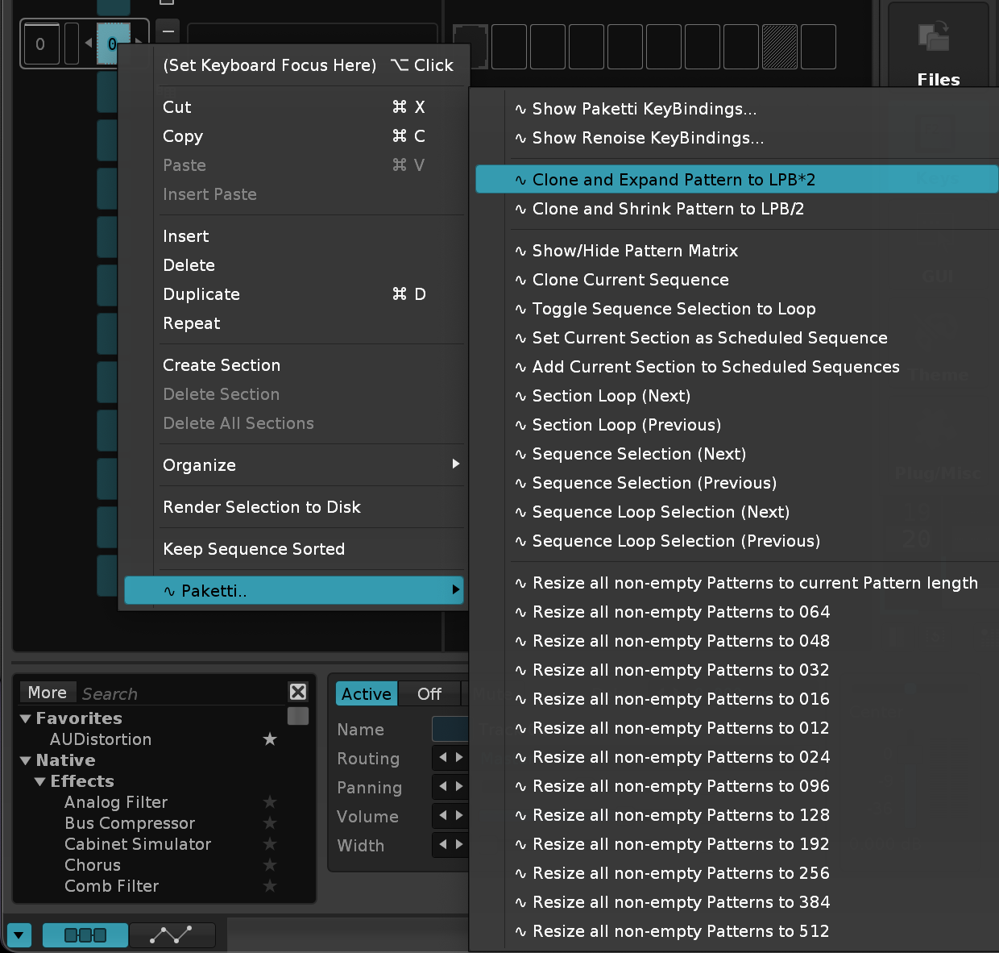


---
### 2024-12-22 - esaruoho

Improvement: Moved Section/Sequence -related menu entries to a subfolder in Pattern Sequencer
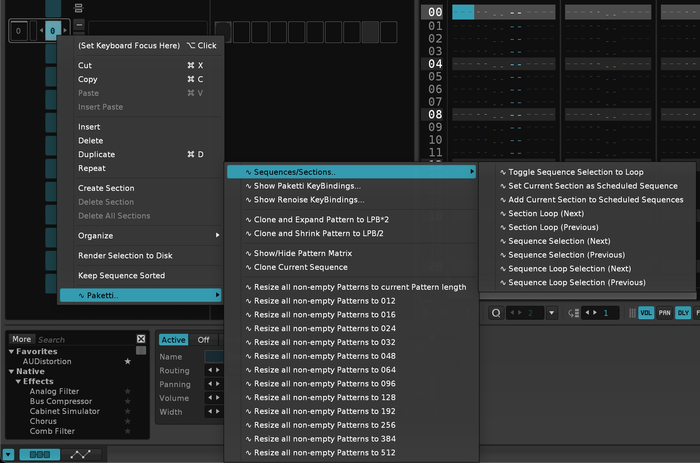


---
### 2024-12-22 - esaruoho

Improvement: Sorted `Resize all non-empty Patterns to xxx` so the numbering makes sense

---
### 2024-12-22 - esaruoho

Improvement: Resizes moved to subfolder in Pattern Editor and in Pattern Sequencer. for better discoverability
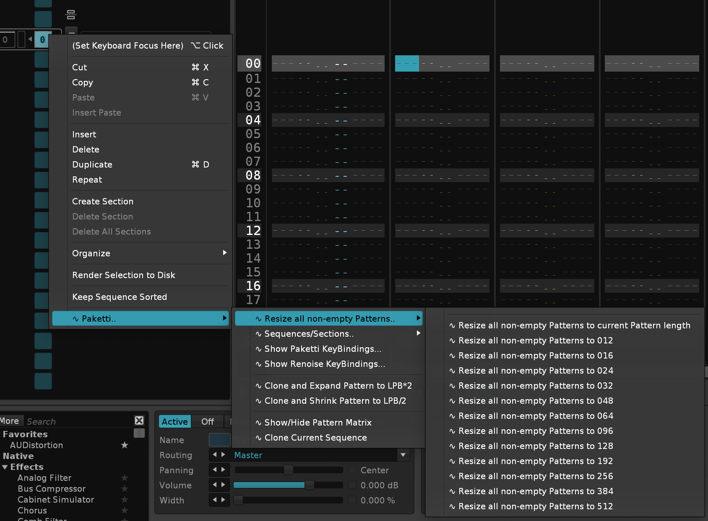


---
### 2024-12-22 - esaruoho

Improvement: added Clone Pattern and LPB*2 / LPB/2 to Pattern Matrix for better discoverability


---
### 2024-12-22 - esaruoho

Improvement: Added OSI-Terminator Theme to Theme Selector

---
### 2024-12-23 - esaruoho

Feature: Pattern Matrix Selection Expand / Shrink - meaning if you Expand 4 tracks in 4 patterns, they are destructively expanded (pattern is not resized)

---
### 2024-12-23 - esaruoho

Feature: Edit Step Dialog. focuses the textfield, lets you write something between 0-64 (or larger-than 64, then capped to 64), and sets editstep.
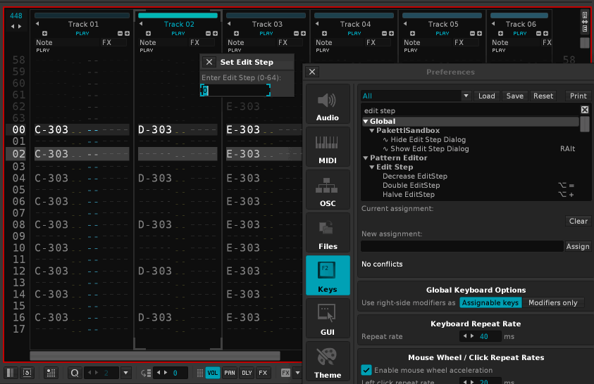


---
### 2024-12-23 - esaruoho

Improvement: Clone Current Pattern & LPB*2 used to read the wrong pattern row length and would error out with over 256 row pattern duplication. fixed.

---
### 2024-12-23 - esaruoho

Improvement: Paketti Default Phrase Init Dialog LPB was limited to 64 - can now be set to max 256.

---
### 2024-12-26 - esaruoho

Feature: Paketti Timestretch Dialog
- can render the timestretched result


<div style="position: relative; padding-bottom: 64.90384615384616%; height: 0;"><iframe src="https://www.loom.com/embed/e7189db45e514446aa90de4742c3bf61?sid=e3799ce5-d2ea-4c8b-ad76-0f574ec85546" loading="lazy" frameborder="0" webkitallowfullscreen mozallowfullscreen allowfullscreen style="position: absolute; top: 0; left: 0; width: 100%; height: 100%;"></iframe></div>
https://www.loom.com/share/e7189db45e514446aa90de4742c3bf61?sid=e8dca846-9fd3-4ca1-b682-d3e74df42b35

<div style="position: relative; padding-bottom: 64.90384615384616%; height: 0;"><iframe src="https://www.loom.com/embed/6ead19c0c7384a81977f2e5d664a5ee6?sid=c1e372b6-276d-4dc1-ad93-304c05cb6d01" loading="lazy" frameborder="0" webkitallowfullscreen mozallowfullscreen allowfullscreen style="position: absolute; top: 0; left: 0; width: 100%; height: 100%;"></iframe></div>

https://www.loom.com/share/6ead19c0c7384a81977f2e5d664a5ee6?sid=ee2d3f62-285d-4cc4-81ce-d9908ab22b72


(No text)


---
### 2024-12-28 - esaruoho

Improvement: Paketti Timestretch Dialog now:
lets you have 512 row pattern (two repeats of the same sample)
lets you write pitch to current row-and-below, meaning you can create a render with varied note pitch
and the -24 -12 c-4 +12 +24 buttons also follow the "print notes"
many improvements incoming

---
### 2024-12-28 - esaruoho

Improvement: ChordsPlus has now been added as menu entries like this:
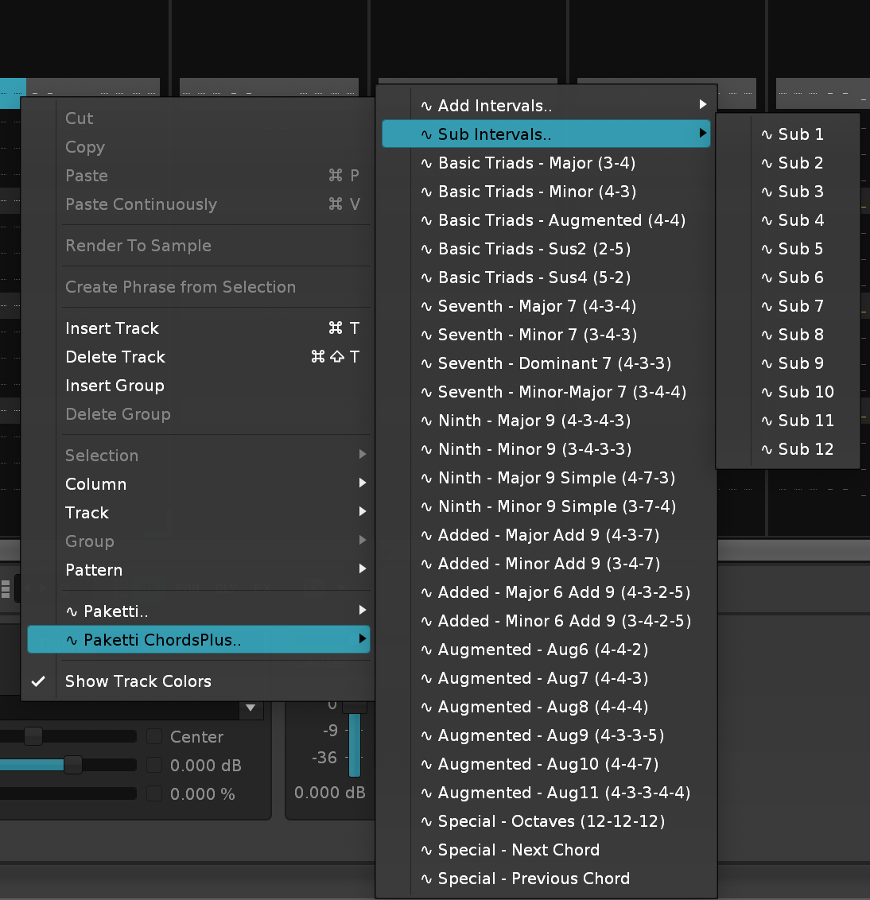

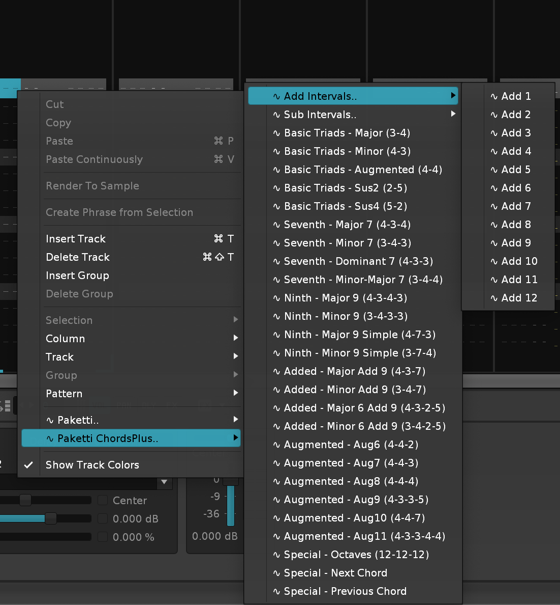


---
### 2024-12-29 - esaruoho

Improvement: Paketti Timestretch Dialog now
makes it possible to have AHDSR envelope for clipping the sounds really quickly (fast gate).. 
has controls for changing to sample editor for better wave display visibility, or modulation mappings to see the pitch settings and the pitch envelope
has default Release and Scale for Release for the AHDSR sliders
protection against going below C-0 and higher than B-9, no errors there anymore.
various Reversed checkbox fixes

---
### 2024-12-30 - esaruoho

Improvement: Paketti Timestretch Dialog now
correctly shows the millisecond/second value of the Release slider
checks whether the instrument has been pakettified or not (i.e. ahdsr envelope release will not work), and suggests to run Pakettify on the sample.
has a Pakettify button that makes an identical copy, but with instrument macros. which correctly sets the instrument valuebox in the interface to the new, Pakettified, instrument.
no longer errors out if there's over LPB32 (such as LPB56).
correctly sets a 64 row pattern to 256 rows in order to print in the sampleoffset numbers.
sets forward loop mode ON when enabling AHDSR, sets it off when disabling AHDSR.

---
### 2024-12-30 - esaruoho

Improvement: Paketti Timestretch Dialog will now write BPM+LPB to Master track.


---
### 2024-12-31 - esaruoho

Improvement: Fixed error on start of Renoise / script

---
### 2025-01-01 - esaruoho

Improvement: Paketti Timestretch Dialog will now output the LPB into the instrumentname + samplename too, like this:
`137BPM 16LPB A-3`

---
### 2025-01-01 - esaruoho

Improvement: Paketti Timestretch Dialog < and > for BPM, LPB, ComboTempo + Note now all move by -1/+1

---
### 2025-01-04 - esaruoho

I have been writing down the main unfinished features and bugs on s piece of paper while planning on what to do this January to be able to start February from a Clean slate

---
### 2025-01-05 - esaruoho

Improvement: Tweaked Chordsplus so it says what it did and how
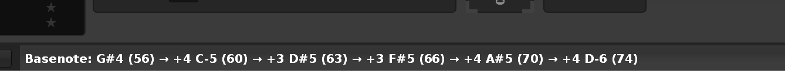


---
### 2025-01-05 - esaruoho

Improvement: Chordsplus menu entry now also shows a related function, which is Randomize Phrasing.  this changes the octaves of the notes on the row randomly


---
### 2025-01-05 - esaruoho

Improvement: Chordsplus shortcuts now match the basenote velocity column volume amount (


---
### 2025-01-05 - esaruoho

Improvement: the EZMaximizeSpectrum easter egg features that worked for Renoise v2.8, has been reintroduced, but hidden - only available if you happen to run Paketti with v2.8 Renoise 👍

---
### 2025-01-05 - esaruoho

Improvement: some additional tweaks to menu entries and better organization


---
### 2025-01-06 - esaruoho

Improvement: Added "Paketti Init Phrase" to the Main Menu !Preferences segment
tweaked the repetition of "Dialog..." out of some of the menu entries
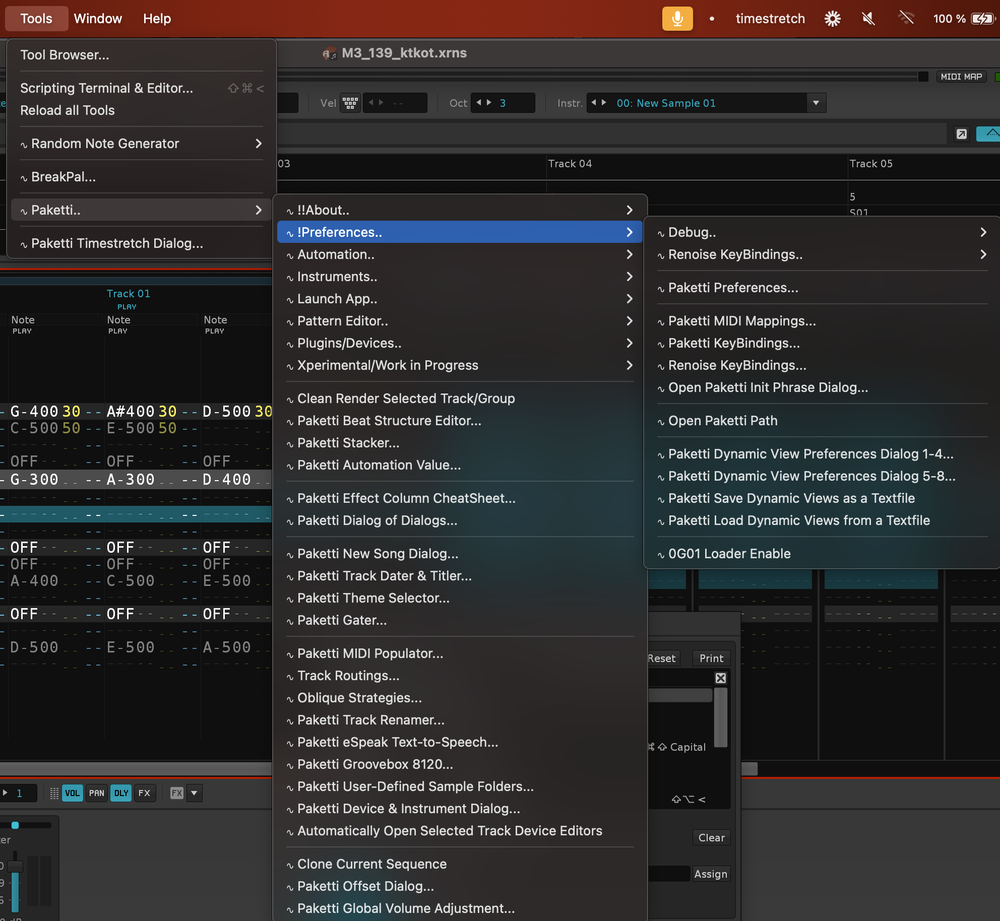


---
### 2025-01-06 - esaruoho

Improvement: "Available Routings for Selected Track" had stopped opening due to regression - dialog works again.


---
### 2025-01-06 - esaruoho

Improvement: The Debug content has now been aptly named so people don't wonder why nothing showed (if it's only for `(Console)` )
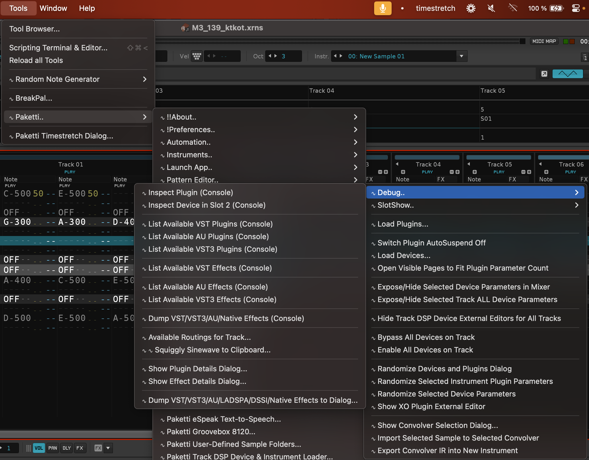


---
### 2025-01-07 - esaruoho

Improvement: tweaked all Clean Render menu entries to be inside `Pattern Editor..` in Main Menu .. also moved the VolDelayPan dialog to be in the main menu tools Paketti subfolder


---
### 2025-01-07 - esaruoho

Feature: Normalize Slices Independently
(apparently this was a feature in Propellerheads ReCycle - aka Normalize Each Slice)


---
### 2025-01-08 - esaruoho

Improvement: Paketti KeyBindings dialog now has a dropdown menu for sorting, much like the Renoise KeyBindings dialog.
Renoise KeyBindings dialog now properly sorts the subcategories together (so "all Edit subcategories are together" etc instead of all over the place)


---
### 2025-01-08 - esaruoho

Improvement: Due to all the above KeyBindings fixes, noticed a bunch of "Paketti..:" format keybindings, tweaked them so they're `Paketti:` instead.

---
### 2025-01-08 - esaruoho

Improvement: Sorting of Paketti + Renoise KeyBindings fixed
(Closes https://github.com/esaruoho/paketti/issues/763, https://github.com/esaruoho/paketti/issues/760)
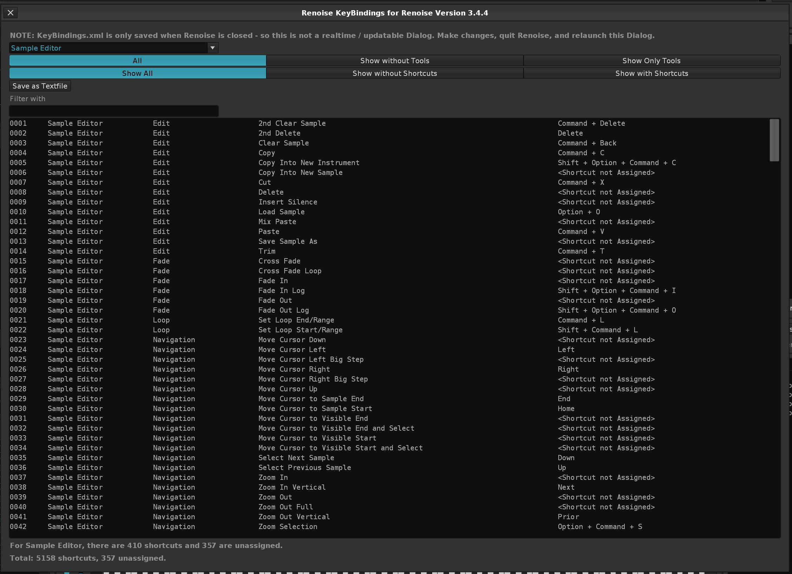


---
### 2025-01-09 - esaruoho

Improvement: slowly renaming everything related to `Coluga` to `YTDLP` since that's what it is and that's how people are going to understand what it is and what it does

---
### 2025-01-09 - esaruoho

Feature: PitchStep Hard Detune, this creates 16 steps of PitchStep content, ranging between -0.05 to +0.05


---
### 2025-01-09 - esaruoho

Improvement: Added the same above (but 64 steps of PitchStep with -0.05 to +0.05 to Unison Generator, meaning:
after creating an unison generator sound, a random pitchstep of 64 step length is added for further detuning


---
### 2025-01-10 - esaruoho

Improvement: I've added "Send Selected Sample" to the Main Menu Entries  and finally introduced the separator for better readability in the sample editor


---
### 2025-01-11 - esaruoho

Improvement: Saw this request for "Menu Entry for Randomize Device Parameters in Mixer" at [here](https://forum.renoise.com/t/idea-device-randomizer-tool/36980/14) so here it is:
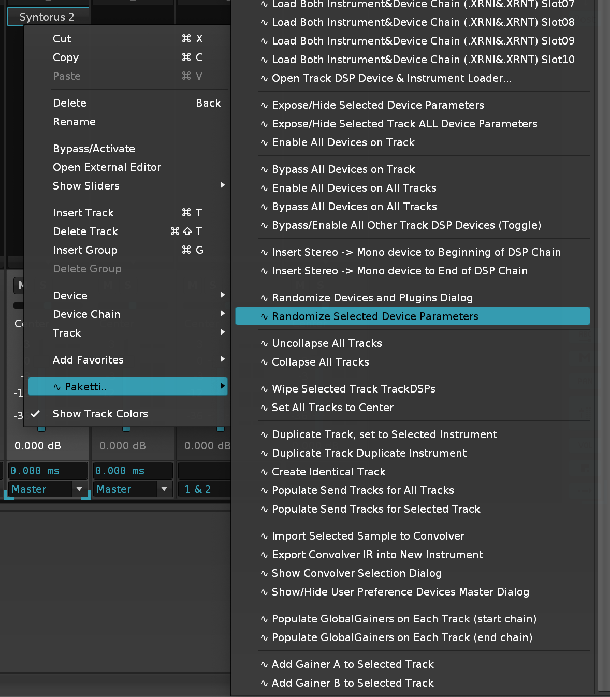


---
### 2025-01-12 - esaruoho

Improvement: The "Sample NOW and F3" shortcuts have been renamed to 
`Start Sampling and Sample Editor (Record)`
What this does:
simple shortcut starts the sample recorder, and starts sampling. same shortcut stops the sample recording. after the sample has finished being saved and made available to Renoise, the Sample Editor is displayed.

---
### 2025-01-12 - esaruoho

Improvement: Added the above feature to Pattern Editor, Sample Editor, Instrument Box & Mixer, and it now has Autoseek set to On.

---
### 2025-01-12 - esaruoho

Removal: I have commented away the "Select Next / Previous ReWire channel" or ReWire features. if you want them back, please ping me.

---
### 2025-01-12 - esaruoho

Improvement: The `Contour Shuttle Record Prototype` has been renamed and is no longer considered a prototype. this is now called `Contour Shuttle Record On/Off`.  all it does is display the Sample Recorder dialog, start sampling.. and if you run it again, it stops sampling. no extras.

---
### 2025-01-12 - esaruoho

Improvement: Contour Shuttle Record On/Off now sets Autoseek+Autofade to True.
same for Start Sampling and Sample Editor.

---
### 2025-01-12 - esaruoho

Improvement: Contour Shuttle Record Off, Follow On, Record On, Follow Off shortcuts have been clarified. this is not a sample recorder feature. so the names have been changed too.
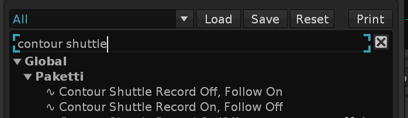


---
### 2025-01-12 - esaruoho

Feature: Record & Follow Flip. 
this shortcut + menu entry will enable Editmode. but disable follow pattern. if you run it again with editmode on, then it disables editmode, but enables follow pattern. so one shortcut will let you follow, until you're ready to quit following and instead edit. same for midimapping button.

---
### 2025-01-13 - esaruoho

Improvement: Added "Set Track Volume Level (L00)" as a MidiMapping too

---
### 2025-01-13 - esaruoho

Improvement: Added "Effect Column B00 Reverse Sample Effect On/Off" as a MidiMapping too

---
### 2025-01-13 - esaruoho

Improvement: Effect Column B00 On/Off will now read the first free Effect Column and write the 0B00 effect there. and make more effect columns visible if all currently visible ones are filled.

---
### 2025-01-14 - esaruoho

Improvement: I've resurrected the "Record to Current Track+Plus" feature and renamed it as `Paketti Overdub` . this allows, while Sample Recorder is set to these settings:
(sync start stop: Pattern, Create a new instrument set to OFF)
for recording max 12 new instruments per track, and auto-inputs the instrument at c-4 note and with 0G01 (glide) meaning you can record say 30 minutes of pads, and then have it play in your 16-64 row pattern (or any size pattern) and right at the end, restart the playback from the beginning. i.e. flawless loops.
i've got two more improvements for this on my todo-list, after which it's video-time.
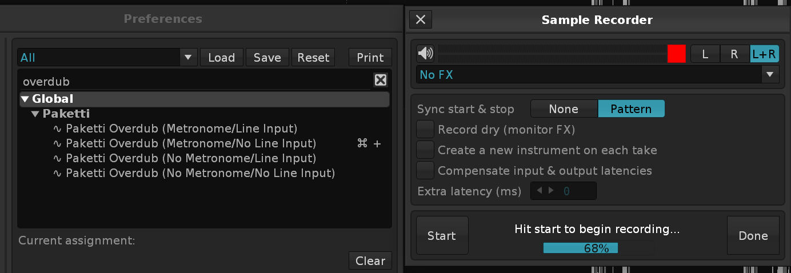


---
### 2025-01-15 - esaruoho

Improvement: Overdub now has a 12 note column per track and 1 note column per track flavor.
so one instrument per track, or 12 instruments per track.
(Closes https://github.com/esaruoho/paketti/issues/769)


---
### 2025-01-15 - esaruoho

Improvement: Overdub now returns cursor focus to middle frame so that you can reverse or normalize what you recorded
and also cuts the sample by 3500frames so that it definitely loops

---
### 2025-01-16 - esaruoho

Feature: Tempo Calculator for IT2/ST3/Schism etc stuff
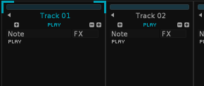


---
### 2025-01-17 - esaruoho

More work on Overdub including bugreports to Renoise devs - they're looking at the bugs

---
### 2025-01-18 - esaruoho

Feature: Nudge Delay Output Delay +1ms -1ms and set to 0ms - shortcuts, menu entries and midimapping


---
### 2025-01-18 - esaruoho

^^


---
### 2025-01-18 - esaruoho

Feature: Global Groove 2&4  - this midi mapping will let you modify the 2nd + 4th shuffle with one knob.


---
### 2025-01-19 - esaruoho

Improvement: +05 -05 +10 -10 as menu entries, keybindings


---
### 2025-01-19 - esaruoho

Improvements: Retitled some Midi Mappings for easier discoverability:
these focus on being able to clear or wipe a specific column, track, selected track below, or all tracks below current row
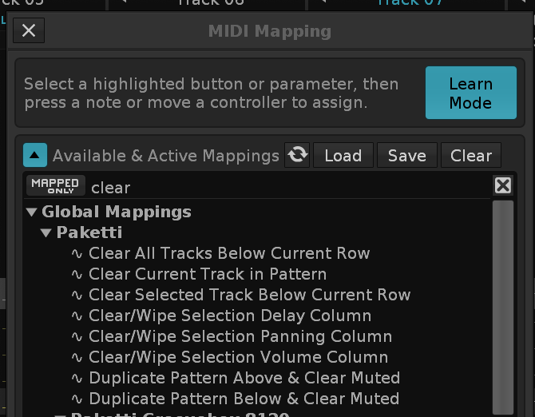


---
### 2025-01-20 - esaruoho

Feature: Step by EditStep (Forwards / Backwards)
https://forum.renoise.com/t/editstep-jumping/75076/2


---
### 2025-01-20 - esaruoho

Improvement: Unison Generator fixes.
- if you used the Unison Generator on a sample that's already been Unison Generator'd up, the panning was all wrong (not center, 50L, 50R, 50L, 50R, 50L, 50R, 50L - instead, all over the place)
- If you Unison Generator a Unison Generator'd sample, the naming used to go wrong. (think `New Sample 02 (Unison 7 [-2] (50R)) (Unison 7 [-2] (50L)) (Unison 7 [7] (50L))` etc and other such mess) - now, no longer.
Fixes https://github.com/esaruoho/paketti/issues/748

---
### 2025-01-20 - esaruoho

Improvement: Pakettify Current Instrument  has been added as a menu entry to Instrument Box and Sample Navigator.

---
### 2025-01-20 - esaruoho

Improvement: Pakettify Current Instrument now correctly assigns the pakettified instrument to FX01 samplechain instead of keeping it unassigned.

---
### 2025-01-20 - esaruoho

Improvement: Shortcut + Menu Entry for turning Pakettified instrument to Mono or non-Mono:
Closes https://github.com/esaruoho/paketti/issues/655
If the Instrument is not Pakettified, it suggests the Pakettification of the Instrument.
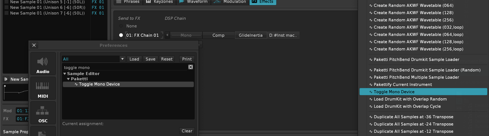


---
### 2025-01-21 - esaruoho

Feature: Note Switch Dialog
this shows the notes in a dialog, and lets you select the instrument. meaning if you have 100 E-4 notes at instrument 3 and want to change them all to instrument 5, now you can. 
Closes https://github.com/esaruoho/paketti/issues/363
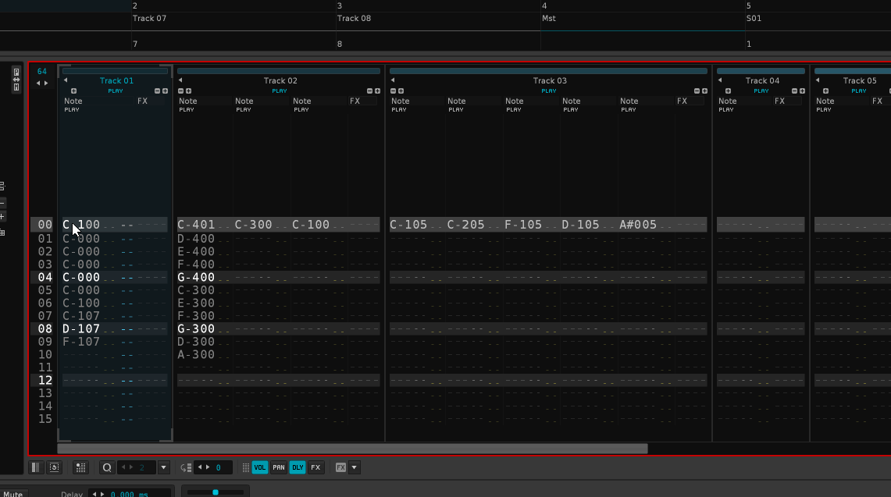


---
### 2025-01-22 - esaruoho

Improvement: Finally!! I've figured out the difference between Windows and macOS/Linux when it comes to Loading Paketti Presets. Windows now properly loads them when loading with "Paketti PitchBend Multiple Sample Loader" or "Paketti PitchBend DrumKit Loader".

---
### 2025-01-22 - esaruoho

Improvement: In light of the above - I've removed all of the custom code + user-definable XRNI preset code from Paketti Preferences.  since load_instrument doesn't work in the same way with windows / macOS - and nobody has volunteered any details of what kinds of 3rd party .XRNI instruments they use for this -- let's just keep it in a functional state by defaulting to the Paketti specified XRNI templates.


---
### 2025-01-23 - esaruoho

Feature: `Select Sample x[Knob]` will now kick you to the sample editor, and show you the sample you've selected. same for Select Sample Next & Select Sample Previous (both midi mappings and shortcuts).

---
### 2025-01-23 - esaruoho

Improvement: Now, hidden inside the Paketti PitchBend 12st_ instrument, there's a Panning LFO that is deactivated until you activate it.


---
### 2025-01-23 - esaruoho

Feature: Wipe&Slice now has a Paketti Preferences setting for adding a Loop for the second half of each slice.

---
### 2025-01-23 - esaruoho

finally put in the checkbox for Wipe&Slice LoopEndHalf
(Closes https://github.com/esaruoho/paketti/issues/777)


---
### 2025-01-23 - esaruoho

Feature: Reverse Selected Sample or Slice
(Closes https://github.com/esaruoho/paketti/issues/770)

---
### 2025-01-23 - esaruoho

Improvement: Track Output Routings Dialog now has a Refresh - which closes + reopens the dialog so it shows the new tracks.
(Closes https://github.com/esaruoho/paketti/issues/596)


---
### 2025-01-24 - esaruoho

Feature: Computer Keyboard Velocity (Halve) / (Double) shortcuts added
Fixes https://github.com/esaruoho/paketti/issues/694


---
### 2025-01-24 - esaruoho

Improvement: The Automation Value Dialog now reads the EditStep if the EditStep is changed by midi or shortcut.
Fixes https://github.com/esaruoho/paketti/issues/749

---
### 2025-01-24 - esaruoho

Improvement: The Automation Value Dialog now captures (!) the Cursor back to the Dialog upon EditStep change by user. so change the EditStep manually, and type in the automation value number to continue.

---
### 2025-01-24 - esaruoho

Feature: Realign Samples
Closes https://github.com/esaruoho/paketti/issues/650
this is a menu entry that adds some extra spaces to match the "Chain" icon for better readability
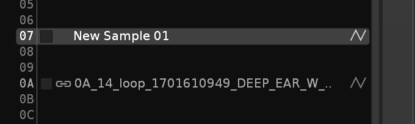


---
### 2025-01-24 - esaruoho

Improvement: Groovebox 8120 now has Output Delay for each of the 8 tracks!
Closes https://github.com/esaruoho/paketti/issues/779
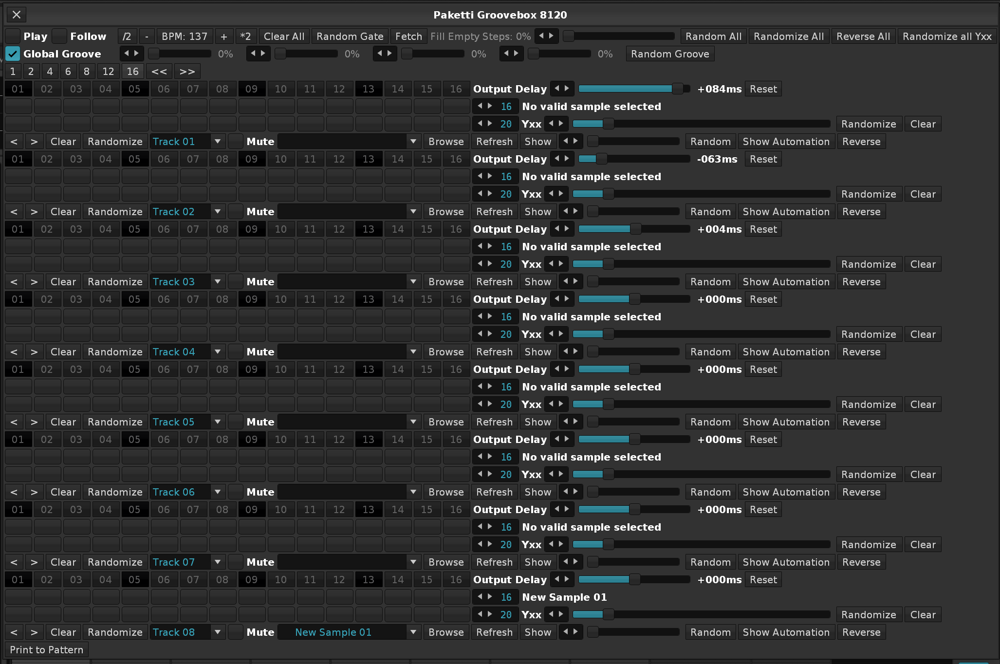


---
### 2025-01-25 - esaruoho

Feature: Wipe All Automation in All Tracks on Current Pattern
Wipe All Automation in All Tracks on Whole Song
Wipe All Automation in Track on Current Pattern
Wipe All Automation in Track on Whole Song
Wipe All Effect Columns in All Tracks on Current Pattern
Wipe All Effect Columns in All Tracks on Song
Wipe All Effect Columns in Selected Track on Current Pattern
Wipe All Effect Columns in Selected Track on Song
Menu Entries + Shortcuts added.
Closes https://github.com/esaruoho/paketti/issues/555
EDIT: (screenshots that mention "Delete" are outdated, i renamed to "Wipe" for easier discoverability


---
### 2025-01-26 - esaruoho

Improvement: Paketti Pattern Cheatsheet Dialog now has "Clear Effect Columns"
Closes https://github.com/esaruoho/paketti/issues/746


---
### 2025-01-26 - esaruoho

Improvement: Flood Fill Note and Instrument now:
- doesn't error if you're in effect column, instead errors gracefully in the statusbar
- now also floodfills the volume, panning, delay and samplefx columns, if they happen to contain data.

---
### 2025-01-26 - esaruoho

Improvement: Automation Exp Up Exp Down Linear Up Linear Down now detects if you're in Volume and goes from -INF to 0dB instead of -INF to MAXdB (not desired)
same for Pattern Matrix Selection Automation
Fixes https://github.com/esaruoho/paketti/issues/447 & https://github.com/esaruoho/paketti/issues/472

---
### 2025-01-26 - esaruoho

Improvement: Added Wipe All Automation in track in pattern, in track in song, in all tracks in pattern, in all tracks in song to Pattern Matrix
Fixes https://github.com/esaruoho/paketti/issues/696

---
### 2025-01-26 - esaruoho

Improvement: Wipe All Automation in track/tracks,pattern,song now also wipes Volume,Width,Panning if they exist.

---
### 2025-01-27 - esaruoho

Feature: Double BPM&Halve LPB.. & Halve BPM&Double LPB
Menu Entry in Pattern Matrix + Pattern Editor, and global shortcuts.


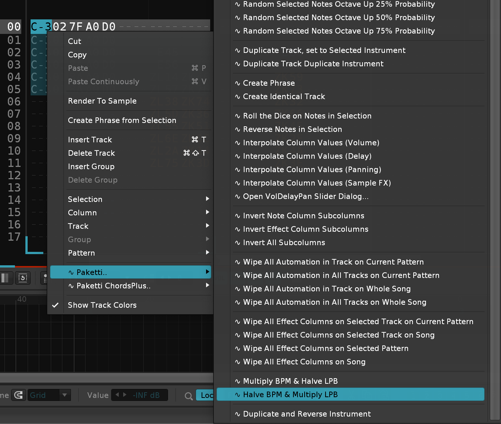


---
### 2025-01-27 - esaruoho

Feature: Normalize All Samples in Current Instrument
Feature: Move Beginning Silence to End of Sample for all Samples in Current Instrument
Added to Sample Editor, Sample Navigator and as shortcuts
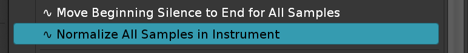


---
### 2025-01-27 - esaruoho

Improvement: Paketti DrumKit Loader will now offer the possibility of Move Benning Silence to End + Normalize All Samples.


---
### 2025-01-27 - esaruoho

Improvement: Load Plugins now shows the favorited Plugins, and lets you select from those only with the slider, if you enabled the "Favorites Only" checkbox.
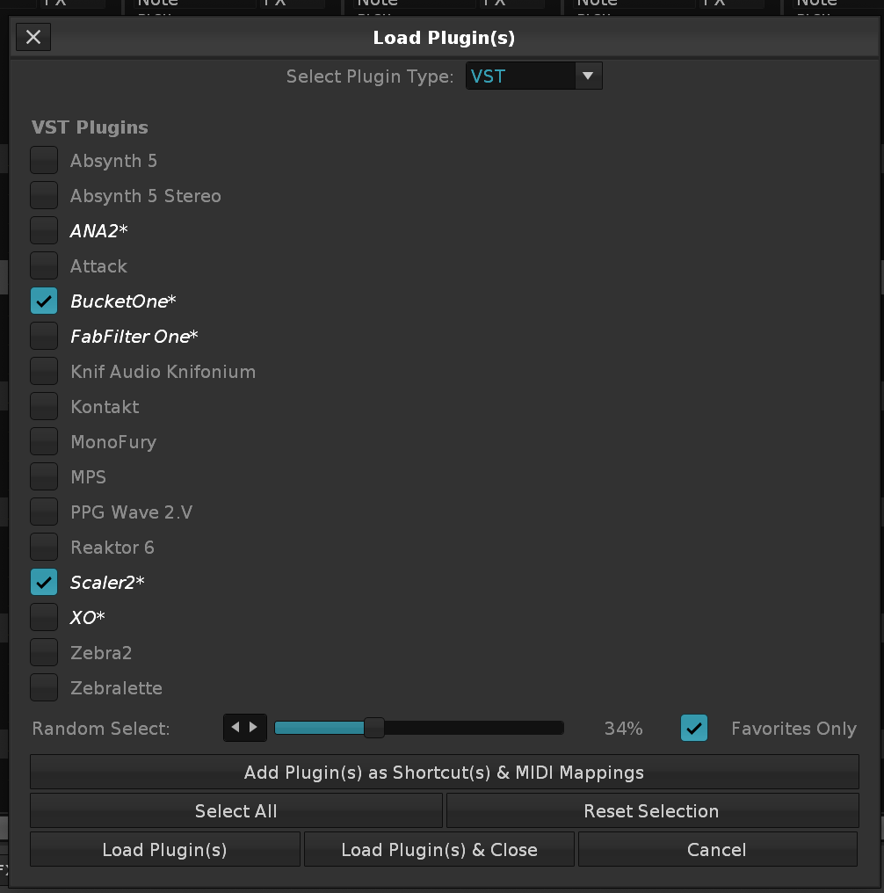


---
### 2025-01-28 - esaruoho

Improvements: Load Plugins & Load Devices both now have Favorited Plugins, and you have a checkbox for "Favorites Only" for Load Devices too.
Closes https://github.com/esaruoho/paketti/issues/549

---
### 2025-01-28 - esaruoho

Feature: Invert Random Samples in Instrument
Invert Entire Sample
this helps with the Unison Generator


---
### 2025-01-28 - esaruoho

Improvement: Unison Generator will now correctly read the Paketti Loader settings such as Autofade, Oversampling, Interpolation mode, and apply them to each of the 8 Unison Generator samples.

---
### 2025-01-28 - esaruoho

Improvement: Column Cycle Keyjazz (Special) will fill the current track with note delays, and let you input a note per each "tick" and when you get 12th note column and input a note, you are moved to 1st note column but next row.


---
### 2025-01-29 - esaruoho

Improvement: eSpeak now has "Don't Pakettify" for those who need it
Closes https://github.com/esaruoho/paketti/issues/738


---
### 2025-01-30 - esaruoho

Improvement: the Dynamic Views now no longer forces Sample Recorder to be hidden while recording! And all the (instrument box, disk browser, adv. edit, pattern matrix, sample recorder stuff) can now be set to `<change nothing>`, `<show>`,  `<hide>`
Closes https://github.com/esaruoho/paketti/issues/687 & https://github.com/esaruoho/paketti/issues/620
this unfortunately means that your settings will need to be re-created.
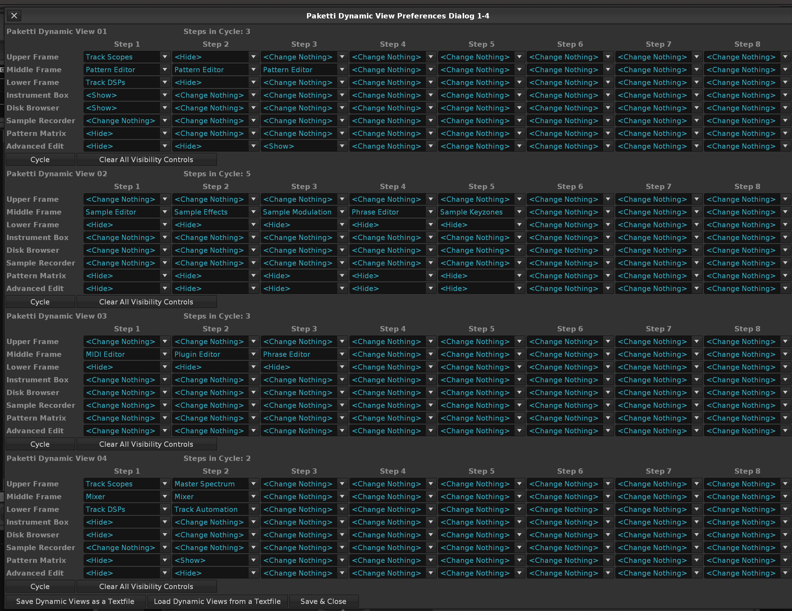


---
### 2025-01-30 - esaruoho

Feature: Metronome Volume Control **(V3.5 Only!)**
Closes https://github.com/esaruoho/paketti/issues/132
this introduces midimappings + shortcuts for +1 -1 metronome volume, "default metronome volume" & "metronome volume OFF" and a midimapping for 0...127 knob control of metronome volume.
This will be shipped with the current Paketti - but only available for those who are on V3.5 Beta (i'm not so i'm working in the blind here)

---
### 2025-01-31 - esaruoho

Updates: Due to v3.5 beta updates (which i still don't have access to, I've resurrected certain tickets which i had marked as `BlockedByAPI` and will be taking care of them due to the API updates.

---
### 2025-02-02 - esaruoho

Feature: Set Sync Mode to Internal/Midi Clock/Ableton Link/Jack **(V3.5 Only!)**
This introduces menu entries + shortcuts for setting the Sync Mode to one of the four.
This will be shipped with the current Paketti - but only available for those who are on V3.5 (Beta/Release) - I'm not, so I'm working in the blind here.

---
### 2025-02-03 - esaruoho

Feature: Paketti CapsLock feature now works in Phrase Editor **(V3.5 Only!)**
I'm protecting nonv3.5 beta/release users from seeing errors - while still working in the blind (with no access to v3.5)
(Closes https://github.com/esaruoho/paketti/issues/2)

---
### 2025-02-03 - esaruoho

Improvement: if using "Capture Nearest Instrument" while in Phrase Editor with no Phrase existing in the Instrument -> pressing enter in Phrase Editor will create a new phrase and select the phrase.

---
### 2025-02-03 - esaruoho

Feature: Reintroducing Increase Delay +1/+10/-1/-10 to Phrase Editor.. it was waiting for V3.5 API functions. **(V3.5 Only!)**

---
### 2025-02-03 - esaruoho

Feature: Show/Hide Right Frame (Disk Browser & Instrument Box?) **(V3.5 Only!)**

---
### 2025-02-03 - esaruoho

Improvement: **(V3.5 Only!)**
Expose and Select Next Column (for Effect Columns or Note Columns in Phrase Editor)
Hide Current and Select Previous Column (for Effect Columns or Note Columns in Phrase Editor)

---
### 2025-02-04 - esaruoho

Feature: Introduce "Instrument Box Slot Size" True/False shortcuts (show/hide, true, false) with a check whether the function works. **(V3.5 Only!)**

---
### 2025-02-04 - esaruoho

Feature: Show/Hide Disk Browser (Shortcuts) **(V3.5 Only!)**

---
### 2025-02-04 - esaruoho

Feature:  Fill Effect Column with 0G01+0D00 & Fill Effect Column with 0G01+0U00
this will fill the first row with 0G01 and the second row to end row with 0D00.. or 0U00. after doing it, the cursor is moved to second row, effect column 1, and editstep is 0, so you can easily set the effect to what you want

---
### 2025-02-04 - esaruoho

Improvement to Impulse Tracker F8 - first press will stop playing, second press will move you to current pattern first row. third press will move you to song first row.. fourth press will abort&cut the audio.

---
### 2025-02-04 - esaruoho

Improvement to Impulse Tracker "8" - **(V3.5 Only!)**
if using 8, the whole row will be played, and advance by editstep. Without using "start playback stop playback" tricks.
(Closes https://github.com/esaruoho/paketti/issues/607)

---
### 2025-02-05 - esaruoho

Improvement: Some minor improvements to Pattern Editor Menu entries - sorting Column Cycle Keyjazz into it's own subfolder, same for the above 0D00/0U00/0G01 stuff to Effect Columns..:
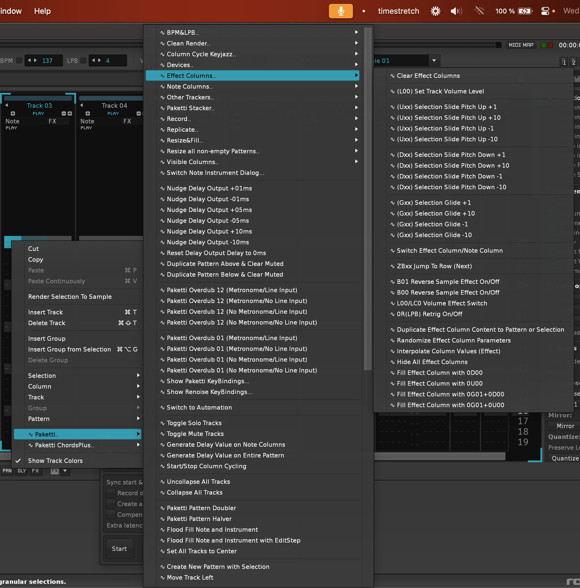


---
### 2025-02-05 - esaruoho

Improvement: Moved Paketti Overdub functions to be within Record.. to de-clutter the Mixer Menu Entries


---
### 2025-02-05 - esaruoho

Improvement: Added Renoise Native devices loading methods to Sample FX Chain.
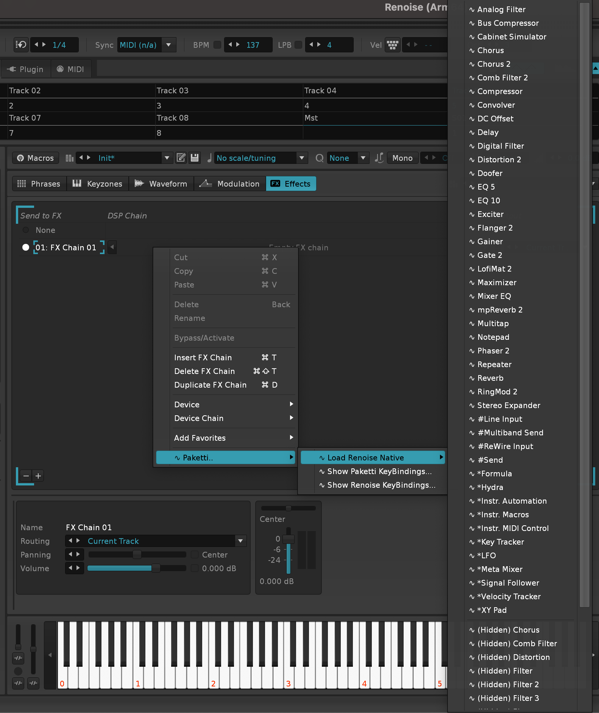


---
### 2025-02-05 - esaruoho

Improvement: OctaMED Note Spread 01 - 12 - this takes the current track and spreads the notes on the note columns from 1 to 12 note columns. you can also go back. note off is taken into consideration. 
also increment + decrement shortcuts added:


---
### 2025-02-05 - esaruoho

Feature: Sort Notes Ascending/Descending
this will take the notes on current row and sort them to ascending or descending order
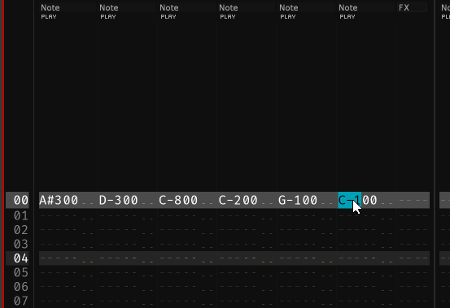


---
### 2025-02-05 - esaruoho

Feature: "Shift Notes to the Right" - frees up the first note column and highlights it, so you can add "lower notes".

---
### 2025-02-06 - esaruoho

Improvement: 12st_Pitchbend (aka default Paketti instrument) - now has a disabled DC Offset command at the end of the effect chain. + same for drumkit.
(Closes https://github.com/esaruoho/paketti/issues/810)

---
### 2025-02-06 - esaruoho

Improvement: Paketti Offset Dialog / Shortcuts no longer error out if no sample selected
(Closes https://github.com/esaruoho/paketti/issues/805)

---
### 2025-02-06 - esaruoho

Feature: Isolate Selected Sample to New Instrument
(Closes https://github.com/esaruoho/paketti/issues/804)

---
### 2025-02-06 - esaruoho

Improvement: PitchSteppers will now just detect the Pitch Stepper device, instead of being hardcoded to a specific device number which might not be true. This means that all the +1 +2 +1 0 -1 -2 -1 0 pitchsteppers, the randomized pitchsteppers, 0 +1 0 -1 0 pitchsteppers etc now work, even with the added panning device. and should continue working till perpetuity.
(Closes https://github.com/esaruoho/paketti/issues/796)

---
### 2025-02-06 - esaruoho

Improvement: Reset Output Delay to 0ms no longer errors out if trying to run it on Send, Master or a Group Track
"Reset Output Delay to 0ms (ALL)" now will set the 0ms for all valid tracks in one go
same for +1 +5 +10 -1 -5 -10 - no longer error on master,send,group
(Closes https://github.com/esaruoho/paketti/issues/792)

---
### 2025-02-07 - esaruoho

Improvement: Paketti Groovebox 8120's Groove Controls / Randomize Groove now no longer force you to Mixer view - in case you wanted to be in Pattern Editor view.
(Closes https://github.com/esaruoho/paketti/issues/799)

---
### 2025-02-07 - esaruoho

Feature:  Insert 0B00 (play sample backwards) onto each row that has a note, in selection), Menu Entry & Shortcut.
if the notes in the selection already have 0B00, then the 0B00 is removed.
(Closes https://github.com/esaruoho/paketti/issues/807)
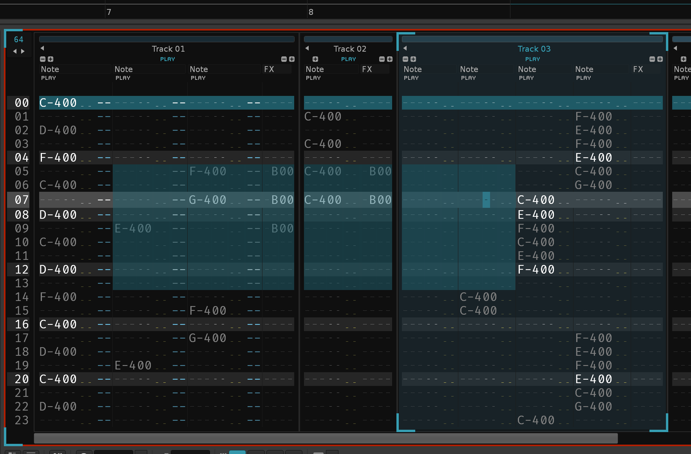


---
### 2025-02-07 - esaruoho

Improvement: "Nudge Delay Output Delay" shortcuts + menu entries + midimappings now have a rename feature which renames the name of the track so you can easier see what the ms delay is.
(Closes https://github.com/esaruoho/paketti/issues/794)
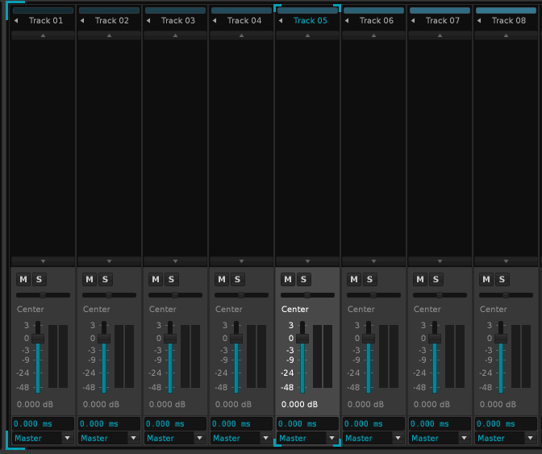


---
### 2025-02-07 - esaruoho

Improvement: User-defined sample folders now have shortcuts + menu entries
(Closes https://github.com/esaruoho/paketti/issues/803)
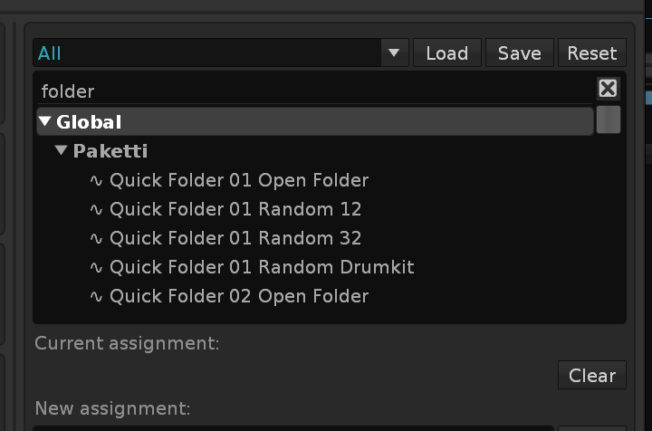

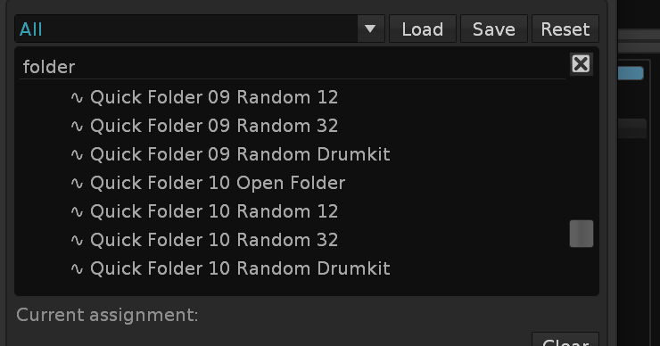


---
### 2025-02-08 - esaruoho

Feature: Delete (=Hide) Unused Columns (Note Columns / Effect Columns)
(Closes https://github.com/esaruoho/paketti/issues/288)

---
### 2025-02-09 - esaruoho

Improvement: "Isolate Selected Sample to New Instrument" now sets the instrument name to sample name, for better discoverability. (it used to be `instrumentname (selected samplename)` )

---
### 2025-02-10 - esaruoho

Improvement: Introduced Changeslog to http://esaruoho.github.io/paketti-manual/ and moved the whole repository to be editable via Obsidian.

---
### 2025-02-10 - esaruoho

Feature: Added Transpose +3 -3 +4 -4 +7 -7 +11 -11 to ChordsPlus as Menu Entries + Shortcuts. This will transpose the current row, or the selection.


---

### 2025-02-10 - esaruoho
Added the Automation features to the Paketti Manual - Not necessarily all, but it's a good start.


---
### 2025-02-11 - esaruoho
Improvement: I've fixed the AutomationAssets so all the animated .gifs and Automation-related screenshots are fully displayed.
EDIT: and also fixed the text / image line feeds so they no longer collide.

---
### 2025-02-11 - esaruoho
Improvement: `Set Selected Sample Velocity Range to 7F` will now tell you, with an informative message of
`The Velocity Range of this Sample is already set to 0-127.` - if there is nothing to do.

Feature: `Global:Paketti:Set All Samples Velocity Range 00` introduced - this will set all the Samples in the Selected Instrument to Velocity Range 0-0.

Improvement: `Global:Paketti:Set All Samples Velocity Range 7F` now correctly sets all of the samples in the Selected Instrument to 0-127.

---
### 2025-02-11 - esaruoho
Feature: `Decrease All Track Volumes by 3dB` / `Increase All Track Volumes by 3dB`
These are available as Shortcuts, Menu Entries for Mixer, Pattern Editor and on the Main Menu.

---
### 2025-02-11 - esaruoho
Feature: `Global:Paketti:Shift Notes Left` - this will shift all the notes in the selection to the left, or if no selection, then all the notes on the current row, to the left. 
Improvement: `Global:Paketti:Shift Notes Right` - this will also now shift all the notes in the selection to the right, and if no selection, then all notes on the current row.
(Closes https://github.com/esaruoho/paketti/issues/787)
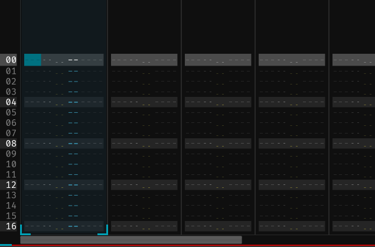

---
### 2025-02-11 - esaruoho
Improvement: Create Identical Track has been modified to 
- duplicate the notes on the track
- duplicate the track dsps on the track
I have also added it as a shortcut to the Mixer and to Pattern Editor.
(Fixes https://github.com/esaruoho/paketti/issues/815)

---
### 2025-02-11 - esaruoho
Improvement: Chordsplus Transposer now has a "Row Only" flavor in addition to the "Row/Selection" flavor.

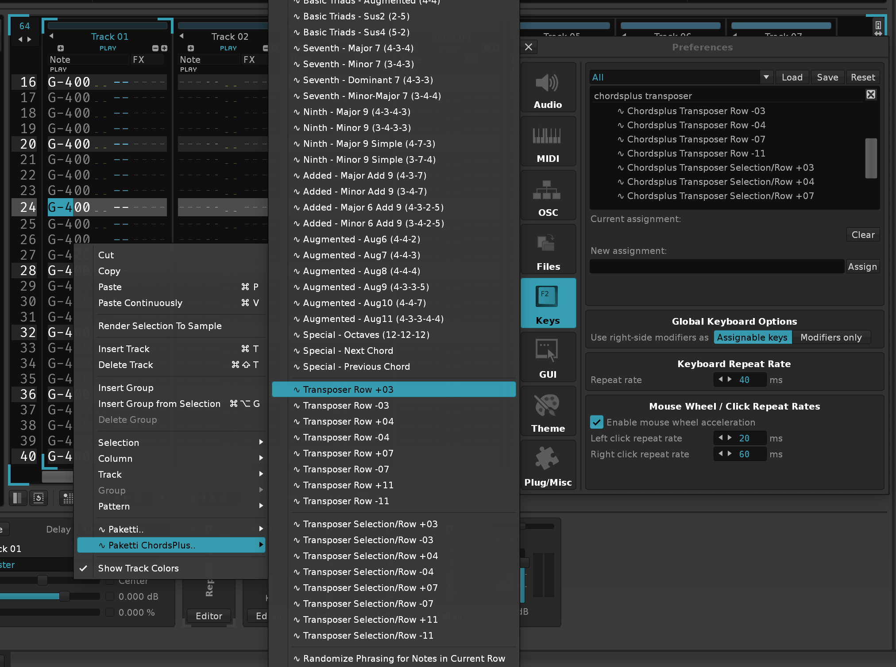

---
### 2025-02-11 - esaruoho
Feature: Replace `FCxx` with `0Lxx` across the whole song, for those that need this conversion to be done.

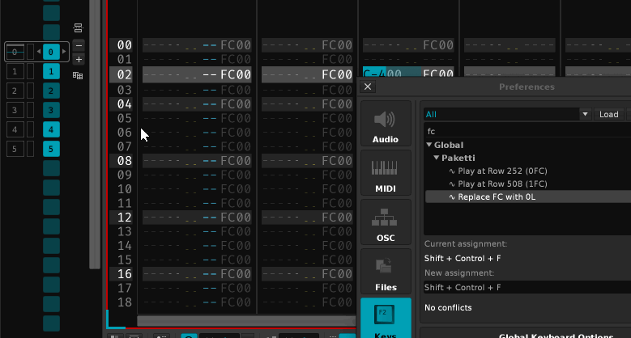

---
### 2025-02-12 - esaruoho
Feature: Clever Note Off (Right After/Half Before/Right Before)
This inserts Note Off commands to each of the note columns on the selected track - in case they have notes on them. 
The Right After will put a Note Off right after each note. Half Before, will put a Note Off right in the middle of "played note" & "next note". The Right Before, puts a Note Off right before the next note plays.
(Closes https://github.com/esaruoho/paketti/issues/812)

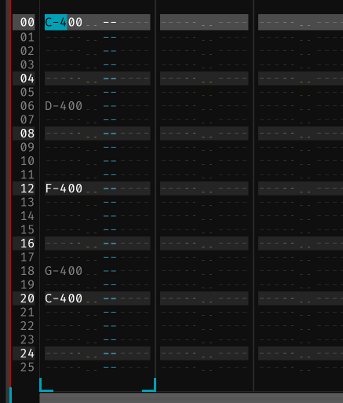


---
### 2025-02-12 - esaruoho

Feature: Bypass/Enable all Sample FX Chain Devices in current Instrument
Feature: Bypass/Enable all Sample FX Chain Devices in all Instrument in Song
(Closes https://github.com/esaruoho/paketti/issues/784)

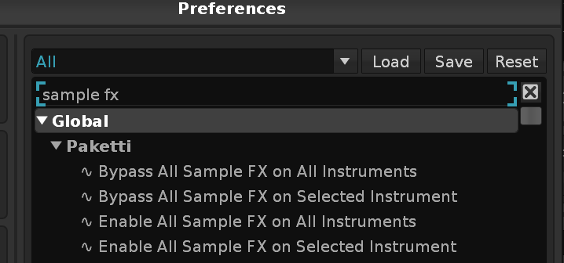

### 2025-02-12 - esaruoho

Feature: Match EditStep to Notes
This will change the EditStep so that every time you input a note, it will jump to the row with the next note.
(Closes https://github.com/esaruoho/paketti/issues/592)

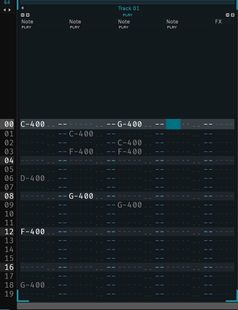

---
### 2025-02-12 - esaruoho
Feature: Reset every PitchStep on Playback Stop (Impulse Tracker F8), on Playback Start (Impulse Tracker F7&Impulse Tracker F5)
There's also an extra shortcut + menu entry for this use
(Closes https://github.com/esaruoho/paketti/issues/536)

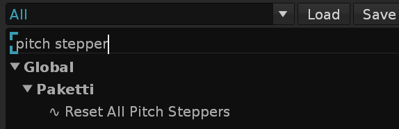
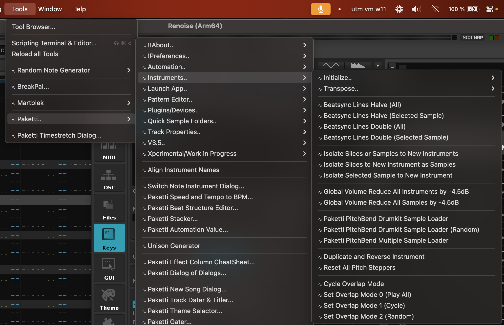

---
### 2025-02-12 - esaruoho
Improvement: Fixed "Reverse Notes in Selection" to work properly across multiple tracks

(Closes https://github.com/esaruoho/paketti/issues/298)


---
### 2025-02-12 - esaruoho
Improvement: Paketti Groovebox 8120: Each of the 8 stepsequencers can be set to max 64 steps, with 16 steps containing checkboxes aka playable notes, and when they get played, then if you have it set to 64 steps, there will be 48 steps of silence until replay happens again. This is good for offsetting things and maintaining a kind of "shape" of stepsequences repeating over the course of time.

(Closes https://github.com/esaruoho/paketti/issues/648)

---
### 2025-02-13 - esaruoho
Feature: Clear Selected Track Below Current Row / Clear All Tracks Below Current Row
Clear Selected Track Above Current Row / Clear All Tracks Above Current Row
I've made these available as Menu Entries, Shortcuts and Midi Mappings.
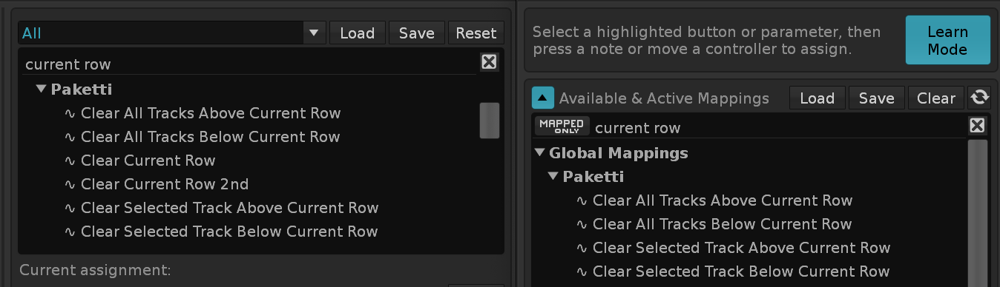
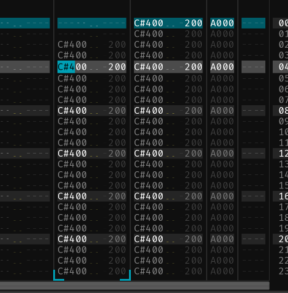
(Closes https://github.com/esaruoho/paketti/issues/584)

---
### 2025-02-13 - esaruoho
Feature: Insert Random Device (AU/Native), Insert Random Device (All), Insert Random Plugin (AU), Insert Random Plugin (All)
The inserted device's or plugin's External Editor will be opened, if available. The inserted device, if not a Native device, will be opened in minimized mode.
(Closes https://github.com/esaruoho/paketti/issues/711)


---
### 2025-02-13 - esaruoho
Feature: Generate Delay Value on Note Columns
This will read the amount of Note Columns and fit the delay values so they play evenly.

(Closes https://github.com/esaruoho/paketti/issues/811)
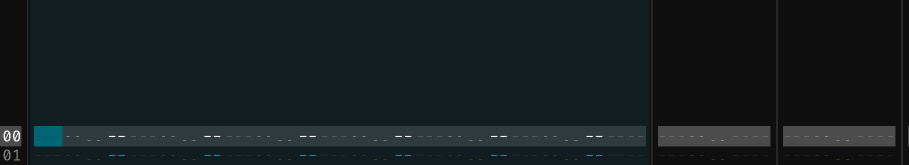

---
### 2025-02-13 - esaruoho
Improvement: "Switch Note Dialog" now has a "Whole Song" version which will change the note instrument across all patterns in the song.

(Closes https://github.com/esaruoho/paketti/issues/776)

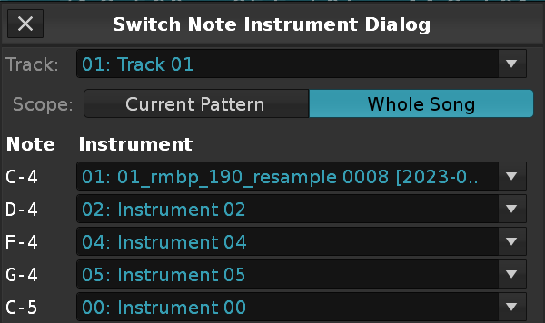

---
### 2025-02-13 - esaruoho
Improvement: PlayerPro Effect Column Dialog now shows both the hexadecimal and the decimal values.
(Closes https://github.com/esaruoho/paketti/issues/813)


---
### 2025-02-14 - esaruoho
Feature: Slice DrumKit (Percussion) / Slice DrumKit (Texture)
These shortcuts + menu entries do the following thing:
Original Sample:
1. Set BeatSync On
2. Set BeatSync Mode to Percussion OR Texture
3. Set Forward Loop On
4. Set Autoseek On
5. Set Mute Group 1

Slices:
1. Disable BeatSync
2. Enable One-Shot
3. Set Autofade on
4. Set Mute Group 1

(Closes https://github.com/esaruoho/paketti/issues/565)


---
### 2025-02-14 - esaruoho
Feature: Normalize Selected Slice or Sample
This is a follow-up to the "Reverse Selected Slice or Sample" - it just hits the Slice (or Sample) and normalizes it.
Available on the Sample Editor, Sample Navigator and as Midi Mappings + Shortcuts (same for Reverse Selected Slice or Sample, so, slight improvements there)


---
### 2025-02-14 - esaruoho
Improvement: Both Normalize & Reverse Selected Slice or Sample now correctly reverse or normalize the last slice.

---
### 2025-02-14 - esaruoho
Improvement: Edit Mode Blend Value is now settable via the Paketti Preferences
(Closes https://github.com/esaruoho/paketti/issues/425)
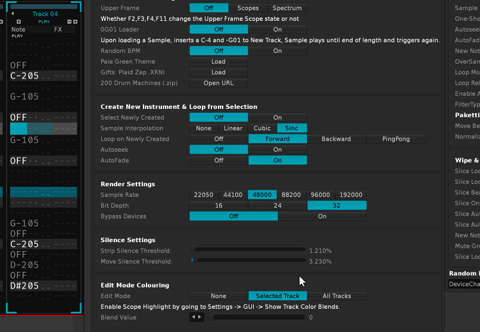


---
### 2025-02-14 - esaruoho
Feature: Note Off with EditStep
(Closes https://github.com/esaruoho/paketti/issues/806)

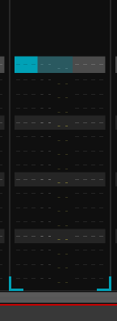

---
### 2025-02-14 - esaruoho
Improvement: `Impulse Tracker Home*2` and `End*2` functionality for Phrase Editor **V3.5 Only**
These detect if you're in the Phrase Editor and then run the same functionality (go to the top of the current note column, if pressed again, go to the first note column.. and.. go to the end of the current note column, if pressed again, go to the last note column.)
(Closes https://github.com/esaruoho/paketti/issues/819)

---
### 2025-02-14 - esaruoho
Feature: Phrase Follow Pattern Hack **V3.5 Only**
This tries to follow the pattern, but in the phrase. i.e. if phrase is 64rows and LPB4, and pattern is 64 rows and LPB4 - it will detect: oh, pattern is playing, let's adjust the selected phrase line index of the phrase.

This is considered highly experimental and might not work at all. Waiting for V3.5 access.


---
### 2025-02-14 - esaruoho
Improvement: Audio Processing Dialog should be openable and reopenable
(Closes https://github.com/esaruoho/paketti/issues/595)

---
### 2025-02-15 - esaruoho
Improvement: OctaMED Pick/Put Dialog now reads Selection in Pattern in Selected Track and writes to Selection, while following EditStep.
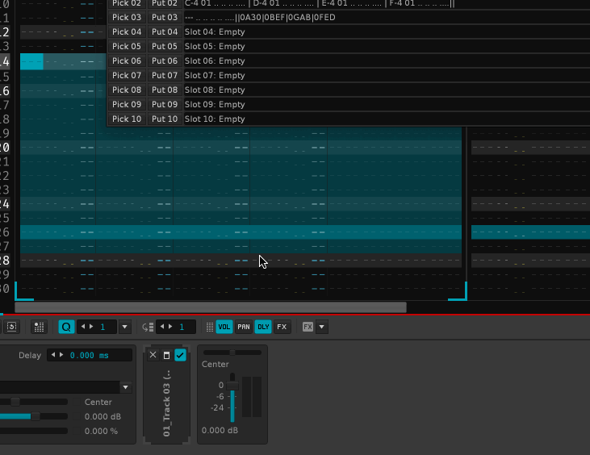


---
### 2025-02-14 - esaruoho
Feature: Cycle Chord Inversion Down / Up
This will take either current row, or selection in Pattern, and modify, per each row, the lowest note to be lifted an octave higher - and then re-organizes the notes by ascending order (lowest first, highest last) 


---
### 2025-02-15 - esaruoho
Improvement: Note Sorter (Ascending) / (Descending) now also follow the "Change Selection if exists, otherwise only current row" thinking.

---
### 2025-02-15 - esaruoho
Improvement: Tweaked "Randomize Phrasing for Notes on Current Row" to actually be "Randomize Phrasing for Notes in Row/Selection" - this means the Menu + Shortcut + MidiMapping have been renamed and should be re-assigned. 
Also, it now reads the selection in pattern, or if no selection, then just current row.
And no longer randomizes between -3 octaves and +3 octaves, instead -2 octaves and +2 octaves.


---
### 2025-02-16 - esaruoho
Improvement: Fixed 12st_Pitchbend.xrni so that it uses `*` instead of `+` for AHDSR device, for less buggy / blaring Envelopes.


---
### 2025-02-16 - esaruoho

Am going through a ChangesLog I was maintaining and realized I've neglected to mention bunches of things I've done last year. Here's a catchup:

Feature: Set Quantization to 01...32 (Global, Pattern Editor, Phrase Editor)
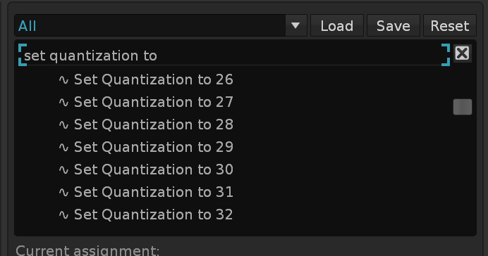

Feature: XLN Audio XO opener - checks where XO is in the track, VST,VST3,AudioUnit - if it is found, opens the External Editor. If not, loads it to a new instrument and opens. If already showing external editor, closes it. Reason for being? because you can alt-drag a selected drum into renoise (!!!) and load it.

Improvement: If "Replicate at Cursor All Above Current Track", and you're on the first row, then it defaults to repeating that low.

---
### 2025-02-16 - esaruoho
Continuing with the "Didn't I talk to anyone about this??" changeslog:
The **Paketti Stacker**.
This loads a sample, then lets you divide it mathematically into slices, then stacks them into a new instrument with velocity controlling which slice is played, then you can output a rising ramp (first to last), downwards ramp (last to first), then random ramp (any hit). 

To make this more sensible, I've added "Expand + Flood Fill" & "Shrink + Flood Fill", Pitch Stepper controls (-24, -12, 0, +12, +24), and Instrument Pitching, Loop Modes to the Dialog.

This enables you to scretch valid loops into little pieces and have them tick tick tick tick through the pattern.
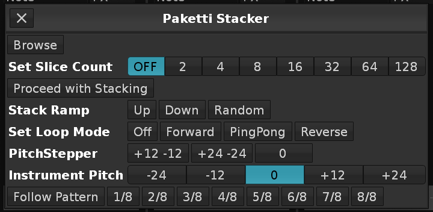
Give it a try.
<div style="position: relative; padding-bottom: 64.90384615384616%; height: 0;"><iframe src="https://www.loom.com/embed/00fbe479717044cfb96dd8abdd60ef8a?sid=b92dc5b0-a9f8-4cfa-88b8-bd67afea0e7c" loading="lazy" frameborder="0" webkitallowfullscreen mozallowfullscreen allowfullscreen style="position: absolute; top: 0; left: 0; width: 100%; height: 100%;"></iframe></div>

---
### 2025-02-16 - esaruoho
Feature: Set All Instruments All Samples Autoseek Off / On
This queries all the Instruments - and sets all samples in each Instrument Autoseek state On or Off.

Feature: Set All Instruments All Samples Autofade Off/On
Same as Autoseek


---
### 2025-02-16 - esaruoho
Feature: Insert Random Note-Offs in Empty Rows
Feature: Randomize Note-Offs in Selection
(Closes https://github.com/esaruoho/paketti/issues/820)

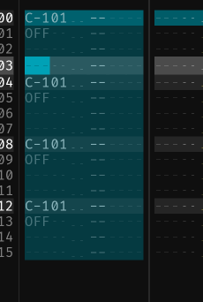
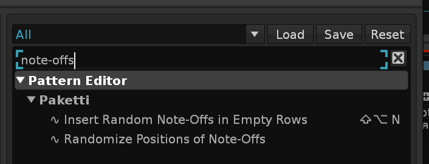

---
### 2025-02-16 - esaruoho
Feature: Create Group & Move DSPs.. 
This inserts the current Track into a Group, and moves the Track DSPs of the Track to the Group, and inserts a new Track and selects the new Track within the Group.
Available in Pattern Editor + Mixer as Shortcut & Menu Entry
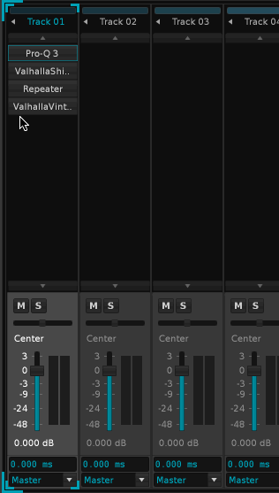


---
### 2025-02-17 - esaruoho
Feature: Move DSPs to Next / Previous Track
This will move the current track's Track DSP Devices to the Next or the Previous Track.
Improvement: Can move DSPs between Tracks, Groups, Master.. and Sends. Also remembers Maximized/Minimized status.
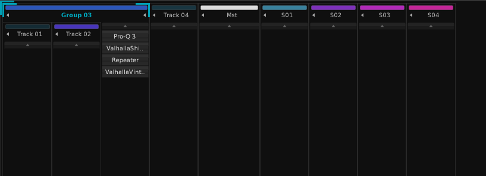


---
### 2025-02-17 - esaruoho
Feature: Flood Fill within Selection with Arp
This will create a Delay Value, and then read the current row's Chord, replicate it to the rest of the Selection, and then alter the Voicing, and sort it ascending / descending, resulting in, well, arpeggios.

---
### 2025-02-17 - esaruoho
Improvement: Sort Notes (Ascending) / (Descending) now no longer changes the Delay Values around, if it detects that you've been using Generate Delay Values within ChordPlus.

---
### 2025-02-17 - esaruoho
Improvement: ChordsPlus now has a "Random Chord" Midi Mapping, Menu Entry + Shortcut.
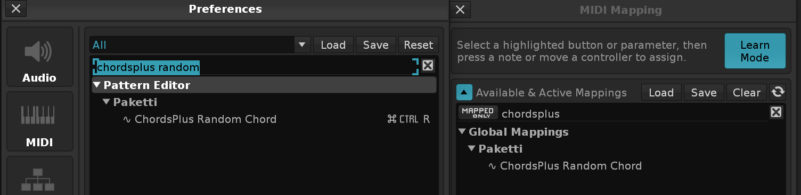

---
### 2025-02-17 - esaruoho
Improvement: Move "Selected Track DSP Device" to Next / Previous Track
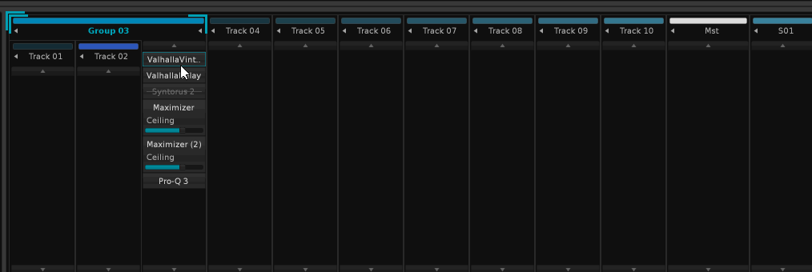

---
### 2025-02-17 - esaruoho
Improvement: Renamed "Randomize Phrasing for Notes in Row/Selection" to "Randomize Voicings for Notes in Row/Selection" since it is Voicing, not Phrasing. Sorry.

---
### 2025-02-18 - esaruoho
Feature: ChordsPlus Extract Bassline to Next Track


---
### 2025-02-18 - esaruoho
Feature: ChordsPlus Extract Highest Note to Next Track


---
### 2025-02-18 - esaruoho
Plumbing: Native Device loading / VST/AU/LADSPA/DSSI loading can now change the name of the device and load a specific preset (XML format)
(Closes https://github.com/esaruoho/paketti/issues/622)

---
### 2025-02-18 - esaruoho
Improvement: When loading the ValhallaDelay AU - it will now boot up with LowCut at 200Hz.

---
### 2025-02-18 - esaruoho
Feature: Load Random IR from folder set in Paketti IR Folder Settings in Paketti Preferences This will add a Convolver to the Track if there is no such device, or, modify the current Convolver device with a random IR from user-defined folder.
(Closes https://github.com/esaruoho/paketti/issues/824)
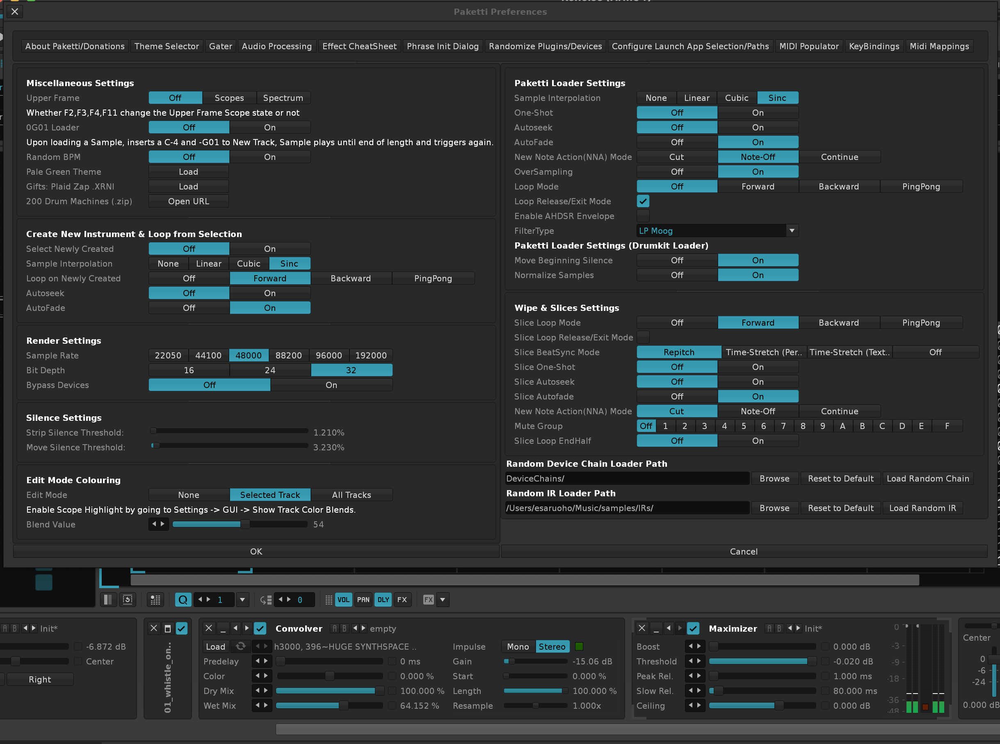
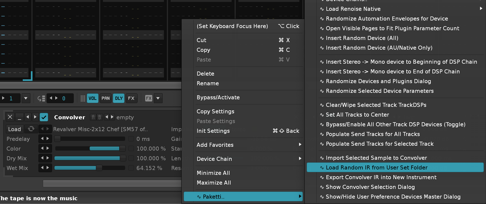

---
### 2025-02-18 - esaruoho
Improvement: Plaid Zap (gift) update: Now has a deactivated DC Offset at the end of the Sample FX Chain, and I've added Autofade / Sinc Interpolation + Oversampling to the last sample, which was missing it.
(Closes https://github.com/esaruoho/paketti/issues/814)

---
### 2025-02-18 - esaruoho
Feature:  M00/MFF control - this sets the individual Note Column Sample Effect Column, for selected Note Column, to MFF, and the rest to M00 - meaning, the others don't play, but the selected Note Column does play.
(Closes https://github.com/esaruoho/paketti/issues/766)


---
### 2025-02-18 - esaruoho
Improvement: "Hide Current and Select Previous Column" would error out if you try to hide the Effect Column of a Group, Master of Send Track. No longer happens.

---
### 2025-02-18 - esaruoho
Improvement: Added a "Notes Only" version for Generate Delay Value, meaning, the Delay Values will be added only to the notes, to fit the note content onto delay, not based on Note Column amount, but based on Note amount.
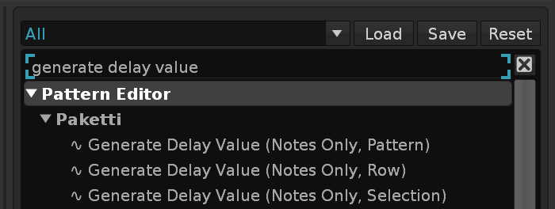

---
### 2025-02-19 - esaruoho
Improvement: When loading the ValhallaShimmer AU - it will now boot up with LowCut at 200Hz.

---
### 2025-02-19 - esaruoho
Feature: "Duplicate Track & Duplicate Instrument"
this handles:
visible note columns, effect columns, visible delay,panning,volume,sample effects columns
whether instrument external editor is visible or not
and duplicates the track in mixer, pattern editor or pattern matrix - and selects the new instrument and the new track.
(Closes https://github.com/esaruoho/paketti/issues/809)

---
### 2025-02-19 - esaruoho
Feature: "Save Unused Samples"
This will save the unused samples as wav and unused instruments as .XRNI. and if the instruments have unused samples, those are saved too.
(Closes https://github.com/esaruoho/paketti/issues/800)

---
### 2025-02-20 - esaruoho
Feature: "Save All Samples to Folder"
Prompts for a folder and then saves all the samples in the whole song to the folder.
Added to Sample Navigator, Instrument Box, and Main Menu.

---
### 2025-02-20 - esaruoho
Improvement: When loading D16 Repeater, it will now boot up with Mix volume at 0dB (i.e. no reduction), and Left Mix & Right Mix percentage at 15%.


---
### 2025-02-21 - esaruoho
Added "Save Unused Samples" & "Save All Samples" to Main Menu: File:


---
### 2025-02-21 - esaruoho
Improvement: Added "Analog Filter" (Type,Cutoff,Resonance,Drive) to Midi Mappings. Search for "Selected Track Dev Analog Filter". The idea here is: If you're on a track with an Analog Filter on it, the specific Midi Knobs will change the settings of these specific parameters, no matter where the Analog Filter is.
EDIT: Also added Inertia, and the "Filter Type" (which required XML injection to work)


---
### 2025-02-21 - esaruoho
Feature: OctaMED Note Echo 
(Closes [https://github.com/esaruoho/paketti/issues/454](https://github.com/esaruoho/paketti/issues/454 "https://github.com/esaruoho/paketti/issues/454"))
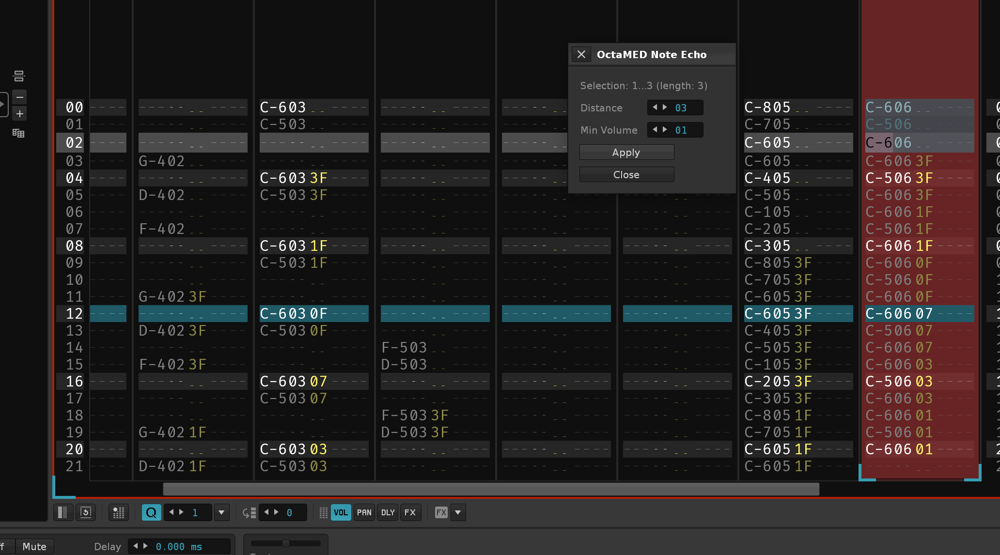

---
### 2025-02-22 - esaruoho
Feature: OctaMED NumPad Mute/Unmute Shortcuts
For tracks 1...16
https://forum.renoise.com/t/numpad-to-control-track-on-off/13334
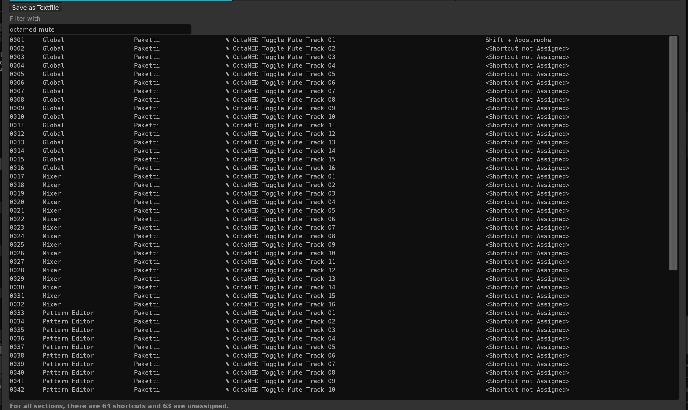

---
### 2025-02-22 - esaruoho
Feature: Dialog DSP Device List with Dropdown Menu
(Closes https://github.com/esaruoho/paketti/issues/773)

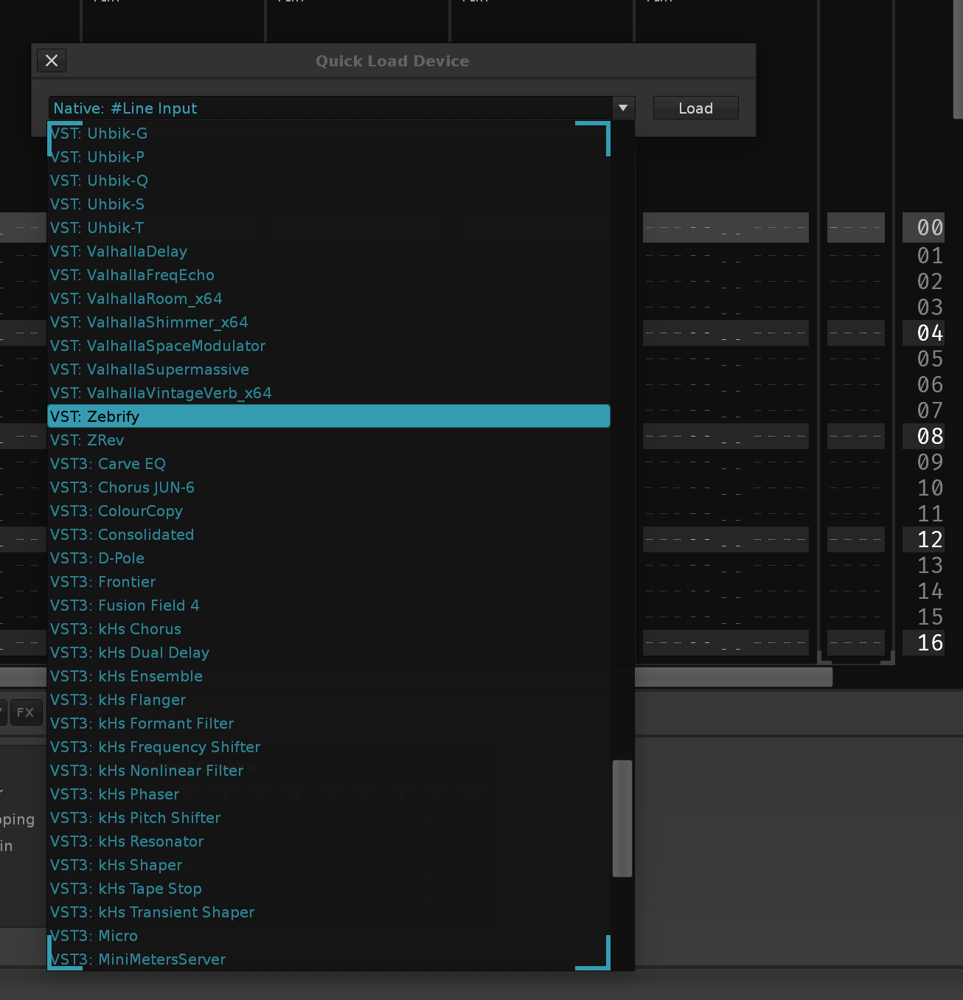


---
### 2025-02-23 - esaruoho
Improvement: the "App Selection & Backup Folder" dialog can now be opened and closed with the same shortcut (i.e. the same shortcut no longer opens multiple dialogs), and "OK" will no longer error - instead will close as expected.
	(Closes https://github.com/esaruoho/paketti/issues/827)

---
### 2025-02-23 - esaruoho
Improvement: Paketti Stacker dialog can now be opened and closed with the same dialog, and the same shortcut / Menu Entry no longer opens multiple dialogs.

---
### 2025-02-23 - esaruoho
Feature: Paketti Action List
This dialog dynamically creates all the Shortcuts / Menu Entries into a dialog with a dropdown menu (50 slots) - so you can boot up the Paketti Action List and pick your favorite Paketti features and click "Run" next to them.
(Closes https://github.com/esaruoho/paketti/issues/273)


---
### 2025-02-24 - esaruoho
Improvement: Paketti Rotate Sample Buffer Fine / Coarse - in the Paketti Preferences Settings
(Closes https://github.com/esaruoho/paketti/issues/385)


---
### 2025-02-24 - esaruoho
Improvement: Strip Silence / Move Silence will show the currently selected sample, so you can see what the settings you are making are gonna look like for the example sample.
(Closes https://github.com/esaruoho/paketti/issues/789)


---
### 2025-02-24 - esaruoho
Improvement: Clean Render Selected Group/Track now introduces DC Offset - if chosen from Paketti Preferences. It is added to the Group or the Track, and then removed post-render.
(Closes https://github.com/esaruoho/paketti/issues/469)


---
### 2025-02-24 - esaruoho
Improvement: The Clean Render Selected Group/Track will now also unmute all the tracks, when rendering a Group, instead of leaving "the rest of the tracks" muted.
(Closes https://github.com/esaruoho/paketti/issues/828)

---
### 2025-02-24 - esaruoho
Improvement: Phrase Follow Pattern Hack **V3.5 Only** now fully integrated to `Record+Follow Toggle` so if you are in Phrase Editor, pressing the shortcut will start following the Pattern Editor while in the Phrase Editor. If elsewhere, kicks the user to the Pattern Editor.

---
### 2025-02-25 - esaruoho
Improvement: Added "Width" to mpReverb2 MIDI controls


---
### 2025-02-25 - esaruoho
Improvement: Added Phaser 2 parameters for `Selected Track Dev` - Ceiling, Depth, Feedback, Floor, Rate, Stages
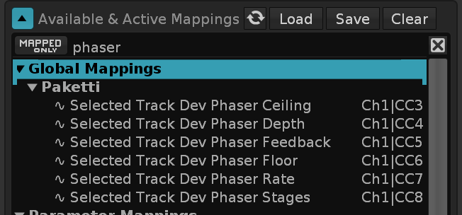

---
### 2025-02-25 - esaruoho
Improvement: Added LofiMat 2 parameters for `Selected Track Dev` - Bit Crunch, Dry Mix, Noise, Rate, Wet Mix


---
### 2025-02-25 - esaruoho
Improvement: Added Delay parameters for `Selected Track Dev` - L Delay, L Feedb., L Sync Time, R Delay, R Feedb., R Sync Time, Send
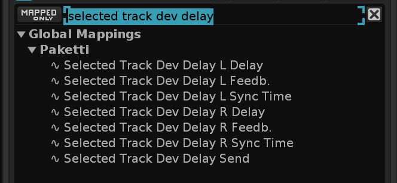

---
### 2025-02-25 - esaruoho
Feature: Write ZLxx via Midi Mapping to Pattern Selection or Current Row.
(Closes https://github.com/esaruoho/paketti/issues/795)
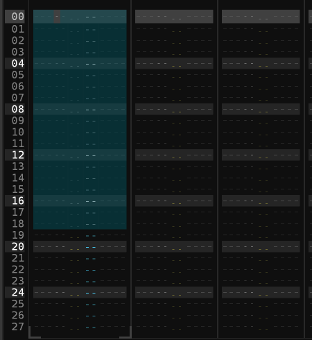

---
### 2025-02-25 - esaruoho
Feature: Write 0Sxx via Midi Mapping to Pattern Selection or Current Row - Modifies to Slices 0...127 if Slices exist, otherwise stays at S00 to SFF.
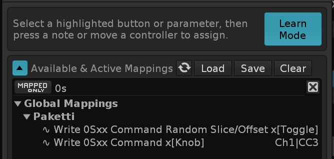

---
### 2025-02-25 - esaruoho
Improvement: Random Slice/Offset now works faster, never hits S00 (always S01 until S(slicecount)), and has a shortcut.
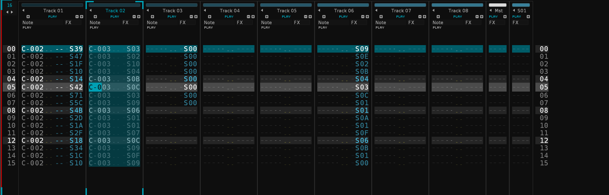

---
# End


You are right at the end of this manual now. Welcome!

